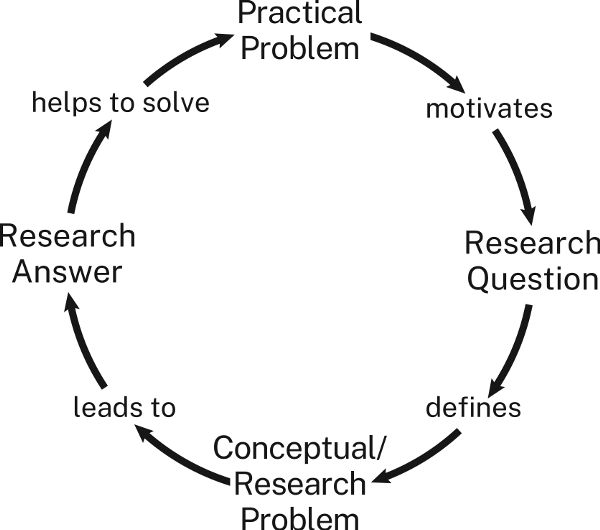

# 第 2 章　从问题到研究课题

本章说明，如何把一个问题转化为受众认为值得解决的研究课题。如果你已有丰富研究经验，就知道这一步不可或缺。如果你刚开始学习，我们希望能让你理解它的重要性，因为这里学到的内容，将关系到今后所有项目。

上一章建议用下面的三步陈述，逐渐明确研究问题的意义：

1. **主题：** 我正在研究________，
2. **问题：** 因为我想弄清什么／为什么／如何________，
3. **意义：** 以便帮助受众理解________。

这三步既描述项目的发展，也描述你作为研究者的成长。

- 从第一步走向第二步，你便不再只是数据收集者，而成为希望进一步理解某件事的研究者。
- 从第二步走向第三步，你开始关注：这种理解为什么重要。

最初，它可能只对你自己重要；但当你能从受众角度说清其意义时，就加入了研究者的共同体。这样一来，你与受众的关系也更牢固：作为他们关注研究的回报，你承诺帮助他们更深入地理解自己在意的事情。此时，你便提出了一个他们认可、认为需要解决的研究课题。

## 2.1 理解研究课题

各个水平的研究者中，都有太多人仿佛只在完成一项任务：回答仅让自己感兴趣的问题。这是不够的。要使研究有意义，必须回应共同体中其他人，也就是你的受众，同样想解决的问题。

因此，problem 在研究中有特殊含义，初学者有时会感到困惑。日常生活里，问题是我们想避开的麻烦；学术研究中，问题却是我们主动寻找，必要时甚至要自己构思出来的东西。要理解其中缘故，就得知道研究课题是什么样的。为此，我们先区分另外两类问题：**实际问题**与**认识层面的问题**。明白这一区别，才能理解，什么使一个问题成为研究课题。

> **译名说明：** 本章用“研究问题”对应 research question，指需要回答的疑问；用“研究课题”对应 research problem，指值得解决、且具有一定后果的认识缺口。两者紧密相关，但并不完全相同。

### 2.1.1 研究课题的共同结构

日常研究通常不是从寻找写作主题开始，而是从一个不处理就会惹麻烦的实际问题开始。如果解决办法不明显，就得先弄清如何解决。为此，必须提出并解决另一类问题：一个研究课题，它由你对实际问题尚不了解、不理解的部分界定。

这是很熟悉的过程，通常像这样：

| 环节 | 示例 |
| --- | --- |
| 实际问题 | 我的自行车链条断了。 |
| 研究课题 | 能找到一家给我换链条的车店吗？ |
| 研究得出的答案 | 找到了：东 55 街 1401 号的 Cycle Source 车店。 |
| 实际解决办法 | 把车推过去修好。 |

这类问题与更复杂的问题，在本质上并无不同。例如：

- 可再生能源行业协会正在游说我支持风力发电补贴。**如果答应，会失去多少选票？** 做一次调查。**大多数选民支持发展风电。** 那我可以同意这一请求。
- 奥马哈工厂的成本上升了。**发生了什么变化？** 请咨询公司查明原因。**员工流失率上升了。** 如果改善培训、提升士气，员工就更愿意留下。

概括来说，实际问题起因于现实中的某种状况；它让人困扰，因为它使我们付出时间、金钱、尊重、安全、机会，甚至生命的代价。解决实际问题，就是采取行动，或推动别人行动，消除或至少缓解造成这些切实代价的状况。

但要知道该做什么，必须先更好地理解某些事情。例如，受到可再生能源行业协会游说的政治人物，需要了解选民的看法，才能决定怎样投票；奥马哈工厂的管理者，需要知道成本增加的原因，才能着手应对。

### 2.1.2 理解实际问题：我们该做什么？

实际问题有两部分：一种带来难以承受的代价的**状况**，以及这种状况造成的**代价**。要让他人清楚理解问题，就必须把两部分都说出来。

| 状况 | 你或受众不愿承受的代价 |
| --- | --- |
| 我没赶上公交车。 | 我会上班迟到，丢掉工作。 |
| 海洋酸性增强。 | 某些浮游生物更难形成钙质外壳。 |

但要注意：受众判断问题有多重要，看的是不解决会给他们带来什么代价，而非你自己付出多少。因此，你认为是问题，他们未必同意。要让你的问题也成为他们的问题，就得从他们的角度来表述，让他们看见自己要承担的后果。

不妨想象，你提出了问题中的“状况”，受众却问“那又怎样”：

> 你：这些浮游生物正在减少。  
> 受众：那又怎样？

你进一步指出一种代价：

> 依靠这些浮游生物为食的海洋生物，也陷入了生存困境。

假如他们又问“那又怎样”，这次你可以从经济代价，而非环境代价来回答：

> 商业渔业产量下降，导致价格上涨，渔业从业者失业。

如果他们还要追问“那又怎样”——虽然不太可能——就说明你尚未让他们相信，自己也面临一个问题。只有当人们不再问“那又怎样”，转而问“我们该怎么办”，才算真正承认问题存在。

这样的实际问题容易理解，因为后果很具体：物价上涨、有人失业时，我们通常不会再问“那又怎样”。但学术研究中的问题，往往属于认识层面，更难理解，因为无论状况还是代价，都较为抽象。

### 2.1.3 理解认识层面的问题：我们该怎样理解？

对知识或理解的需要，会引出认识层面的问题。研究中，当我们对世界的某个方面了解得还不够，未达到希望的程度，就出现了这类问题。解决它，并不是采取行动改变世界，而是回答一个问题，使自己更好地理解世界。

我们通常通过研究回答这些问题，因此认识层面的问题，有时也称为研究课题。“认识层面”描述的是它们的状况与代价或后果；“研究”则说明我们怎样解决它们。实际问题与认识层面的问题，也就是研究课题，关系如下。

**图中内容的中文对照：**

> 实际问题 → **促使我们提出**研究问题 → **界定**认识层面的问题／研究课题 → **引出**研究答案 → **帮助解决**实际问题。

初学者有时难以理解这些概念，是因为有经验的研究者常用简略说法介绍工作。被问到正在研究什么时，他们往往给出一个听起来很笼统的主题：成人麻疹、艾米莉·狄金森诗歌的格律、怀俄明州马鹿的求偶叫声。结果，新手可能以为，有一个可阅读的主题，就等于有一个可解决的研究课题。

### 2.1.4 实际问题与认识层面的问题有什么共同点

两类问题都有上述两个部分，但状况和代价的性质不同：

- 实际问题的状况，可以是**任何**给你，最好也给受众，带来切实代价的事态。
- 认识层面的问题，其状况**总是**某件事尚不知道或尚未理解。

借助 1.3 节的三步陈述，可以找出认识层面问题的状况。第一步是“我正在研究的主题是________”。第二步中的间接问句，则说出尚不知道或尚未理解什么：

> 我正在研究二战时期“铆钉女工罗西”形象向女性主义象征的演变，**因为我想理解，这一形象为什么以及如何在不同时期获得多种意义。**

这就是我们强调问题价值的原因：问题迫使你明确说出，自己还不知道、不理解，却想弄清什么。

研究课题会指导后续工作，所以要特别留意：它的表述是否把你引向某些方向，或排除了可能的答案与视角。例如，上述关于罗西的问法，可能让你忽视、甚至根本不去考察，最初的罗西形象如何把有色人种女性推向边缘。真正的研究，在最好的时候能带领我们和受众走出无知与偏见；然而，最难抗拒的偏见，往往正隐藏在问题和课题本身。

两类问题的代价也不相同：

- 实际问题的**代价**，总是某种我们不愿见到的具体事物或处境。
- 认识层面的问题没有同样切实的代价。为了突出区别，我们把它的代价称为**后果**：一种特定的无知——因为还不理解某件事，使我们无法理解另一件更重要的事。换言之，一个问题尚未回答，妨碍我们回答另一个更重要的问题。

研究者常常仅仅出于好奇选择项目。事实上，我们大多数人正是这样开始对所研究的主题产生兴趣的。但要让研究对他人有意义，就不能只说“这件事让我感兴趣”。你得说明，解决自己的课题，如何帮助他们解决问题；这就需要解释课题的后果。

三步陈述的第三步，正是表达这种后果的地方：

> 我正在研究二战时期“铆钉女工罗西”形象向女性主义象征的演变，  
> 因为我想弄清，这一形象为什么以及如何在不同时期获得多种意义，  
> **以便理解，图像如何被重新利用来服务新的目的，又如何带有许多观看者未曾察觉的排斥性含义。**

这些说法听起来也许令人困惑，其实比看上去简单。认识层面的问题中，状况与后果分别对应两个问题，它们有两种联系：

- 第一个问题 Q1 的答案，有助于回答第二个问题 Q2。
- 第二个问题 Q2 的答案，比第一个问题 Q1 的答案更重要。

再说一次，研究课题的第一部分，是某件你不知道却想知道的事。这个知识或理解上的缺口，可以写成直接问句：“过去五十年，爱情电影发生了什么变化？”也可以写成间接问句：“我想弄清过去五十年爱情电影如何变化。”

现在，假设有人问：“回答不了这个问题，又怎样？”你就要说出一件更重要的事，说明第一个答案如何帮助理解它。例如：

> 回答“过去五十年爱情电影如何变化”这个问题，**即状况／第一个问题**，有助于回答一个更重要的问题：“我们的文化对浪漫爱情的描绘发生了什么变化？”**这就是后果所涉及的、更广泛也更重要的第二个问题。**

如果你认为回答第二个问题很重要，就已指出一种后果，使课题值得研究。若受众也认同，研究便有了着落。

但如果受众继续问：“不知道我们现在是否用不同于以往的方式描绘爱情，又怎样？”你就得再提出一个更大的、希望能让受众重视的问题：

> 回答“我们对浪漫爱情的描绘发生了什么变化”，有助于回答一个更重要的问题：“我们的文化如何塑造年轻男女对婚姻与家庭的期待？”

如果受众还问“那又怎样”，你也许会想：“找错受众了。”但若必须面对的就是这群人，就只好继续尝试：“如果不回答这个问题，我们就无法……”

学术领域之外的人，常觉得专家提出的问题琐碎得可笑，例如“跳房子游戏是怎样起源的”。但他们没有意识到，研究者希望通过回答这个问题，进一步回答更重要的问题。对关心民间游戏如何影响儿童社会性发展的人来说，“不知道”所造成的认识后果，就足以证明研究值得做。如果能发现儿童民间游戏如何起源，就能更好地理解游戏如何使儿童学会参与社会生活；还没等你再问，知道这一点，又能帮助我们理解……

## 2.2 区分“纯研究”与“应用研究”

前面说过，真正的研究由答案事先未知的问题驱动。其中又可区分两类。如果研究处理的认识层面问题，与现实中的实际处境没有直接联系，只为增进研究共同体的理解，我们称之为**纯研究**。如果研究处理的认识层面问题具有实际后果，就称为**应用研究**。

看定义项目的三步陈述中，最后一步指向什么，就能判断是哪一类：它指向“知道”，还是“行动”？

> 1. **主题：** 我正在研究宇宙某一区域的电磁辐射，
> 2. **问题：** 因为我想弄清天空中有多少星系，
> 3. **意义：** 以便帮助我们**理解**，宇宙会永远膨胀，还是最终坍缩为一点。

这是纯研究，因为第三步只涉及理解。

应用研究的第二步仍然指向知道或理解，但第三步会指向行动：

> 1. **主题：** 我正在比较韦布望远镜与地面望远镜对同一批恒星的观测读数，
> 2. **问题：** 因为我想弄清大气会使电磁辐射的测量产生多大偏差，
> 3. **实际意义：** 以便天文学家利用地面望远镜数据，更准确地**测量**电磁辐射的密度。

这个问题需要应用研究，因为只有知道如何计入大气造成的偏差，天文学家才能做到他们想做的事：更准确地测量光。

## 2.3 将研究与实际后果联系起来

有些新手对纯研究感到不安，因为认识层面问题的后果——仅仅是不知道某件事——太抽象。他们尚未加入一个深切关心某方面知识的研究共同体，便觉得自己的发现没有多大用处。因此，会勉强给认识层面的问题拼上一项实际后果或意义，让它显得更重要：

> 1. **主题：** 我正在研究二战时期“铆钉女工罗西”形象向女性主义象征的演变，
> 2. **研究问题：** 因为我想弄清，这一形象为什么以及如何在不同时期获得多种意义，
> 3. **可能的实际意义：** 以便帮助平面设计师设计更具包容性的政治海报。

多数人会觉得，第二步与第三步之间的联系有些牵强。

要构思一个好的应用研究项目，就必须说明：回答第二步中的间接问题，如何有理由地帮助回答第三步中的间接问题。不妨这样检验：

- 如果受众想实现________这个目标，填入第三步的目标；
- 他们是否会认为，弄清________，填入第二步的问题，就有可能实现这一目标？

用这个方法检验刚才的应用天文学项目：

- 如果受众想利用地面望远镜数据，更准确地测量电磁辐射密度；
- 他们会不会认为，知道大气造成了多大测量偏差，就能做到？

答案似乎是“会”。

再检验罗西的例子：

- 如果受众想设计更好的政治竞选海报；
- 他们会不会认为，知道罗西形象为什么以及如何在不同时期获得多种意义，就能做到？

答案多半是“不会”。两者也许有联系，但还是牵强。

如果你觉得，认识层面课题的答案或许可用于实际问题，就先把项目表述为纯研究，再把应用放到第四步：

> 1. **主题：** 我正在研究二战时期“铆钉女工罗西”形象向女性主义象征的演变，
> 2. **认识层面的问题：** 因为我想弄清，这一形象为什么以及如何在不同时期获得多种意义，
> 3. **认识上的意义：** 以便理解，图像如何被重新利用来服务新的目的，又如何带有许多观看者未曾察觉的排斥性含义，
> 4. **可能的实际应用：** 从而帮助平面设计师设计更具包容性的政治海报。

不过，在引言中提出课题时，仍应把它作为一个纯粹属于认识层面的研究课题，以认识上的后果说明其重要性。等到结论，再提出可能的实际应用。第 14 章将进一步讨论。

人文学科的大多数研究，以及自然科学和社会科学中的许多研究，都不能直接应用于日常生活。但“纯”这个词也暗示，许多研究者甚至比应用研究更看重这类研究。他们相信，为知识本身而追求知识，体现了人类最高的志向：了解更多，不为金钱或权力，而为了更深理解、更丰富精神生活所带来的超越性价值。

你可能已经猜到，我们十分支持纯研究，也同样支持应用研究，前提是研究做得扎实，不受不良动机污染。例如，在化学和生物科学中，潜在利润可能损害纯研究和应用研究的诚信，因为它不仅影响某些研究者选择什么课题，也可能影响他们给出什么答案：“告诉我们想看到什么，我们就给你什么！”这类情形引出的伦理问题，将在第 17 章“研究伦理”中讨论。

## 2.4 找到一个好的研究课题

杰出研究者与我们大多数人的区别，也许在于才智、敏锐的眼光，甚至纯粹的好运：他们碰到了一个课题，而其答案能让所有人以新方式看世界。当好课题与我们相遇时，往往不难认出来。但研究者开始项目时，常常还不知道真正要解决什么；有时，只希望把某个困惑界定得更清楚。

事实上，发现一个新课题，或澄清一个旧课题，往往比解决一个已明确界定的课题，对领域的贡献更大。有些研究者，甚至因为推翻了自己原本打算证明的、看似合理的假说而成名。

所以，一开始无法完整表述课题，不必气馁，很少有人能做到。不过，尽早思考它，可以省去后来许多无用功，也可能避免临近结束时惊慌失措。这还会帮助你形成高阶研究必需的思维习惯。下面几种方法，有助于发现并完善好的研究课题。

### 2.4.1 寻求帮助

像有经验的研究者那样做：与同事、教师、同学、亲戚、朋友、邻居，任何可能感兴趣的人交谈。别人为什么想知道你所提问题的答案？知道后能做什么？答案又会引出哪些新问题？

如果可以自由选择课题，不妨找一个大问题中的小问题。虽然你解决不了整个大问题，但其中这一小部分，也会分享它的重要性。你还会借此了解本领域的问题，这本身就收获不小。

如果你是学生，可以问老师正在研究什么，自己能否参与其中一部分。但不要让老师的建议成为研究的边界。学生完全照建议做、一步也不多走，最让老师失望。老师希望建议成为思考的起点，而非终点。能沿着建议发现连老师也未曾预料的东西，最让他们高兴。

### 2.4.2 在阅读中寻找课题

资料中也藏着研究课题。你看到了哪些矛盾、不一致，或解释不充分之处？先暂时假定，其他人也会或也应有同样感受。许多项目都始于与资料作者的一场想象中的对话：“等等，你忽略了……”

但在着手补缺、纠错之前，要确认缺漏与误解确实存在，而非自己读错了。无数研究论文都曾反驳一个从来没人提出过的观点。4.3 节列出一些常见的做法，帮助你从资料中发现课题，它们都是“资料认为 X，但我认为 Y”的不同形式。

认为找到了真正的疑点或错误后，不要只是指出来。如果资料说 X，你认为 Y，或许就有了课题；但你还必须证明，相信 X 的人，也因此误解了某个更大的问题。

最后，仔细读资料末尾几页，许多研究者会在那里提出有待回答的问题。下面这段话的作者，刚刚解释了十九世纪俄国农民的生活如何影响他们当兵后的表现：

> 正如士兵和平时期的经历会影响其战场表现，军官群体的经历也必然影响他们的表现。事实上，日俄战争后，有几位评论者把俄国战败归咎于军官在处理经济事务时养成的习惯。无论如何，要理解沙皇时期军官在和平与战争中的服役习惯，**我们需要对军官群体作一种结构性的——也可以说，人类学式的——分析，正如本文对普通士兵所做的那样。**〔着重号为本书作者所加〕

最后一句，就提出了一个等待你着手处理的新课题。

### 2.4.3 回看自己的结论

批判性阅读也能帮助你在自己的草稿中发现好课题。我们往往在最后几页才想得最好，因为写到那里，才形成了开始时未曾预料的主张。如果在早期草稿中形成了一个未曾预料的主张，问问自己：它可能回答了什么问题？

这听起来有些矛盾，但你也许已经回答了一个尚未提出的问题，从而解决了一个尚未界定的课题。你的任务，就是弄清那究竟是什么课题。

## 2.5 学会围绕课题开展研究

有经验的研究者梦想找到新课题；更大的梦想，是解决一个别人甚至不知道自己面临的问题。但在其他人认为，或能被说服认为，它需要解决之前，这个新课题还没有多大价值。因此，面对课题，有经验的研究者首先该问的，不是“我能解决吗”，而是“别人会认为它应该被解决吗”。

没人期待你第一次就全部做到。但你应开始培养为那一刻作准备的思维习惯。研究不只是积累、报告事实。试着提出一个你认为值得回答的问题，今后才能学会寻找别人认为值得解决的课题。否则，就可能遭遇研究者最不愿听到的回应：不是“我不同意”，而是“我不关心”。参见 I.4.3 节、6.2 节与 9.1 节。

读到这里，关于学术研究的这些抽象讨论，也许显得与所谓“真实世界”脱节。但无论商业、政府、法律、医学，还是政治与国际外交，没有什么能力比这更受重视：认出一个问题，并以恰当的方式说清楚，让别人既愿意关心，也相信它能够解决，尤其相信你能解决。如果你能在拜占庭陶器的课堂上做到，就能在普通街区或华尔街的办公室里做到，也能坐在自家厨房桌边，通过视频会议做到。

## 实用提示：把经验不足变成机会

进入一个新领域时，如果还不完全理解它的价值取向、关注点、思考方式和论证方式，我们都会焦虑。事实上，本书作者在新主题上开展新类型项目时，也仍会体验这种新手焦虑。偶尔出现这样的感受无法避免，但可以设法应对。

- **知道不确定与焦虑自然且难免。** 它们表明的是经验不足，而不是能力不行。
- **边研究边写，逐渐掌握主题。** 保留一本日志，反思自己的进展。这类写作不仅帮助理解所读内容，也会激发思考。越早多写，哪怕只是零散草记，面对令人生畏的初稿时也越容易。
- **回应资料，不要只积存资料。** 找到有用的来源时，不要只拍照、截图，或把网页留在浏览器标签里。这样做很容易，却不能推进思考。还应写一段概述或评论，列出它在你心中引发的问题。
- **把任务拆成能够完成的小步骤，并认识到它们相互支持。** 提出一个好问题，会让起草和修改更有效；越能预先考虑如何写、如何改初稿，真正写起来也越有效率。
- **如果你是学生，相信老师理解你的困难。** 他们希望你成功，你可以寻求帮助。也可以向图书馆员或校内写作中心求助。
- **设定现实的目标。** 即使受众不赞同你的主张，只要承认你的论证做得好，你就已取得有意义的成果。
- **最重要的是，把这番挣扎看作它本来的样子：学习经历。** 要应对焦虑、克服所有新手都会遇到的困难，就像成功的研究者那样做，尤其在灰心时：回顾计划与已写的内容，然后继续前进。成功的研究者知道，虽然没有什么可以保证，但大多数构思周全的项目，结果都不会太差。也许只是“考虑到各种条件，已经不错”，不过更有可能比这好得多。
