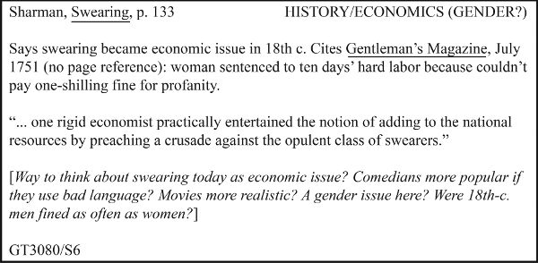

# 第 4 章　深入阅读与运用资料

要让研究可靠，就必须公允、准确地使用资料。本章说明，怎样与资料开展有成效的对话，怎样记笔记，使它们推进思考，也让受众在你借助或批评某份资料时，能够信任你。

本章着重讨论怎样从资料，尤其是二手资料中获得最大收获。理由很简单：在这个问题上，我们能够给出有用、适用面广的建议。研究者怎样寻找或生成数据，受众认可什么数据为证据，各学科差异很大。历史学者和文学批评家通常从一手资料中挖掘证据；其他研究者可能根本不使用这类一手资料，而是在实验室分析土壤样本、发放问卷，或建立计算机模型进行模拟。不过，每个领域都有一批二手资料，也就是该领域的文献，而各领域研究者与这些资料打交道的方式颇为相似。

如何使用二手资料，取决于你寻找研究项目的进展。有经验的研究者平时就会阅读二手资料，了解领域动态，因此项目开始时，往往已经有了研究问题或课题。如果刚接触一个主题，或只有一个宽泛主题，可能需要读许多资料才能找到值得追究的课题，然后还得读更多，才能找到解决方法。本章会说明，如何像有经验的研究者那样阅读二手资料：不仅寻找自己论证可用的数据，更要寻找能激发思考的问题、课题和论证。

## 4.1 记录完整的书目信息

最先要做的事是：一旦认定某份资料值得读，就记下它完整的书目信息。先做这件事，再做别的。只需片刻，我们却可以保证，没有什么习惯能在今后的研究生涯中带来更多帮助。

记录书目信息，不只是为了回忆读过什么，也是为了写作时正确标明出处。自己的笔记可以采用任何格式，只要记录完整；正式写作中的引注，则应遵循本领域的规范，参见 12.8 节。多数图书馆和数据库界面，只需点击几下，就能按选定格式导出引文。

**纸本图书应记录：**

- 作者；
- 书名，包括副标题；
- 编者、译者，如有；
- 版次，若非初版；
- 卷号，如有；
- 出版社；
- 出版年份；
- 所查阅章节的页码；
- 图书馆索书号，如有；
- ISBN，即国际标准书号。

**电子书除上述信息外，还应记录：**

- URL，即网址，如有；
- 数据库名称，如有；
- 访问日期，若在线查阅；
- 电子文件格式。

**纸本期刊论文应记录：**

- 作者；
- 文章题目，包括副标题；
- 期刊名称；
- 卷号和期号；
- 日期；
- 文章页码；
- 图书馆索书号，如有。

**在线期刊论文及其他网络资料**，应尽量记录以上适用信息，另加：

- URL；如果有 DOI，即数字对象标识符，则记录 DOI。它是某份资料独有的稳定代码，常写成以 `https://doi.org/` 开头的网址；
- 数据库名称，如有；
- 网站所有者或主办者；
- 访问日期。

如果是在网上阅读纸本出版物，应同时记录原出版物的书目信息，以及你实际获取它的网络来源。

扫描或复印书中一段内容时，也把书名页及其背面的出版信息一并扫描或复印。知道索书号的话，再补上它。正式引用时不必列出索书号，但以后需要重找这份资料时，它会让事情容易得多。

你可能觉得这些建议过分谨慎，其实不然。没有什么比这种情况更令人沮丧：笔记里明明有一句再合适不过的引文或一项数据，却因为当初没记全出处、如今又找不到原件，而不能用于论文或报告。

## 4.2 主动与资料对话

记笔记不只是记录、积累资料和数据，也是加工、理解它们。事实上，后一个目的更重要。今天，借助互联网与研究图书馆的数据库，你几乎可以瞬间把无穷无尽的资料调到屏幕上，既包括二手资料，也包括一手资料。下面威廉姆斯的故事就是一例：如果他今天从事那项研究，租户名单很可能早已数字化，世界各地的研究者都能查看。

> **找错了地方**
>
> 威廉姆斯曾因没有完整记录一份资料的出处，让一篇有关伊丽莎白时代社会史的著作推迟发表了一年多。几年前，他偶然看到一份 1638 年伦敦租户名单，觉得将来可能用得上，却没记全来源。等到真需要用时，这些数据却无法引用。他在芝加哥大学图书馆找了许多个小时。直到一天夜里，他猛地从床上坐起来，才想起：那份资料在另一家图书馆！

有经验的研究者知道，把资料登记在电子表格里，或在浏览器中打开一个标签页，并不等于理解了它，也不等于它促进了自己的思考。他们不会被动阅读，而会主动进入对话。如果可能，重要资料应读两遍。第一遍，先善意理解。留意什么内容激起兴趣，重读令人困惑的段落。不要急着找分歧，而应设法把对方的意思读通。否则，一旦资料提出与你竞争的论证，你就容易只强调它的弱点。至少一开始，要抵制这种诱惑。

如果资料重要，或者挑战了你的立场，再慢慢读第二遍，这次更严格地审视它。每读一段，不仅想它说了什么，也想自己会怎样回应。把回应写进笔记；如果资料属于你，或使用的是副本，也可以直接写在页边。用概述检验理解：如果无法在脑中概括一段话，就还没有理解到足以反对它的程度。

不要只因为某个权威提出了主张，就接受它。主张可能错误，也可能因资料年代久远而过时。例如，旧资料可能说太阳系有九大行星，如今这样说就不对了，因为冥王星在 2006 年被重新归类为“矮行星”。还要理解，专家经常意见不一。专家甲这样说，专家乙那样说，丙则自称专家，却未必真是。有些学生听到专家分歧，就变得犬儒，把专业知识一概当成个人意见。但对于确实存在争议的问题，基于知识、经过深思的辩论，不应与随口意见混为一谈。事实上，这正是一个领域充满活力的标志。

> **核对，再核对**
>
> 研究者很少故意歪曲资料，但有时会粗心，或在思想上偷懒。科伦布曾听一位知名研究者在演讲后坦言，自己从未读过刚才讨论的著作。布思的一本书曾遭某位批评者“驳倒”，但对方似乎只看了一个小节标题：“小说必须写实”。他没有继续往下读，因此不知道，布思本人正是在批评标题中的主张，以及其他关于小说的误解。威廉姆斯的一位书评作者则错引了他的话，以为自己在反驳，结果论证的恰恰就是威廉姆斯原本的观点！
>
> 如果在做进阶研究，应核实所有对论证重要的信息。研究成果曾被别人使用的人，往往会告诉你：他们的工作被转述得不准确，被草率概括，或遭到不懂内容的批评。作者经常给《纽约书评》和《纽约时报》“书评”版写信，指出评论者怎样歪曲观点，或在批评中犯下事实错误。

## 4.3 为寻找研究课题而阅读

一旦有了研究课题，就用它引导自己寻找证据、范例，以及需要回应的论证。但如果还没有课题，就不知道哪些数据、范例或论证与自己有关。因此，不要漫无目的地读，而要有意识地寻找问题。留意那些令人困惑、不准确或过分简单的主张，任何让你想提出异议的地方都值得关注。不同意一份资料时，更容易找到研究课题；不过，赞同的资料也能提供机会。

### 4.3.1 寻找富有创造性的赞同

如果相信某份资料的主张，可以尝试把它向前推进：它还能涵盖哪些新案例？带来哪些新见解？有没有它尚未考虑、却能证实主张的证据？以下几种方式，有助于从赞同中发现课题。

**1. 提供更多支持。** 可以用新证据支持已有主张。

> 史密斯用轶事说明，“铆钉女工罗西”在 20 世纪 80 年代重新成为女性主义象征；不过，杂志图片能提供更好的文献证据。

- 原资料用旧证据支持主张，你提供新证据。
- 原资料所用证据较弱，你提供更有力的证据。

**2. 证实尚无支持的主张。** 可以证明原资料仅仅假定或推测的事情。

> 史密斯建议通过意象训练提高运动表现，而对运动员心理活动的功能性磁共振成像（fMRI）研究，能够提供证据，说明为什么这个建议有效。

- 原资料推测“________”可能成立，你提供证据证明它确实成立。
- 原资料假定“________”成立，你把它证明出来。

**3. 扩大主张的适用范围。** 可以拓展一个立场。

> 史密斯认为，向医学生讲解生理过程时，使用多个比喻比只用一个更有助于学习。对工程和法律专业的学生，似乎也如此。

- 原资料正确地把“________”应用于一种情境，你将它应用于新的情境。
- 原资料声称“________”在某种特定情境下成立，你证明它一般都成立。

### 4.3.2 寻找富有创造性的分歧

主动阅读，难免会发现自己与资料观点不同。不要轻轻放过这些分歧，它们往往指向新的研究课题。可以留意以下几类；这份清单并不穷尽所有可能，各类之间也有重叠。

**1. 分类或定义上的分歧。** 原资料认为某物属于某一类，你认为应归入另一类。

> 史密斯说，涂鸦不过是破坏公物；但把它理解为一种公共艺术，更为恰当。

- 原资料声称“________”是一种“________”，但其实不是。
- 原资料声称“________”总以“________”为其特征或品质之一，但其实并非如此。
- 原资料声称“________”是正常的／好的／重要的／有用的／道德的／有趣的，但其实不是。

这些表述，以及下面的表述，都可以反过来说：

- 虽然原资料说“________”*不是*一种“________”，但我能证明它是。

**2. 部分与整体关系上的分歧。** 可以指出，原资料误解了事物各部分的关系。

> 史密斯认为，编程与博雅教育无关；事实上，它是必不可少的一部分。

- 原资料声称“________”是“________”的一部分，但其实不是。
- 原资料声称“________”的一个部分与另一部分具有某种关系，但其实没有。
- 原资料声称，每个“________”都包含“________”这一部分，但其实并非如此。

**3. 历史或发展过程上的分歧。** 可以指出，原资料误解了主题的起源或发展。

> 史密斯认为，悲剧源于宗教仪式；事实却不是这样。

- 原资料声称“________”正在变化，但其实没有。
- 原资料声称“________”起源于“________”，但其实不是。
- 原资料声称“________”沿某种路径发展，但其实并非如此。

**4. 因果关系上的分歧。** 可以指出，原资料误判了因果关系。尤其要警惕把*因果*（A 导致 B）与*相关*（A 与 B 同时发生）混为一谈。

> 史密斯声称，教育券计划不会减少公立学校的经费；但三个试行学区的证据表明，它们确实会减少经费。

- 原资料声称“________”导致“________”，但其实并不导致／两者都由“________”造成。
- 原资料声称，只要有“________”就足以导致“________”，但其实还不够。
- 原资料声称“________”只会导致“________”，但它还会导致“________”。

**5. 观察视角上的分歧。** 多数分歧不会改变概念框架；但当你反对某种“标准”看法时，就是在请别人换一种方式思考。

> 史密斯假定广告只有经济功能，但它也是试验新艺术形式的场所。

- 原资料从“________”的角度讨论“________”，但新的情境或视角揭示了新的事实。新旧情境可以是社会、政治、哲学、历史、经济、伦理、特定性别等方面。
- 原资料用“________”理论或价值体系分析“________”，你则换个角度，使它呈现出新的样貌。

## 4.4 为完善论证而阅读

有经验的研究者还会通过阅读来改进自己的论证：把其他人的反对意见纳入考虑，并把他人的论证视为推理与分析的范例。

### 4.4.1 寻找需要回应的论证

只有承认并回应受众可以预见的问题和异议，论证才算完整。二手资料中可以找到一些竞争性观点。它们提供了什么不同于你的主张？列出了哪些你不能不承认的证据？有些新手以为，提到反对意见就会削弱自己的论证。恰好相反，承认别人观点，会表明你不仅知道这些观点，而且认真考虑过，能够有把握地回应。详见第九章。

成熟研究者也会用竞争性观点改善自己的看法。只有理解一个理性的人为什么可能与你想得不同，才能真正理解自己的想法。因此，不要只找支持自己主张的资料，还要注意挑战它们的资料。如果受众熟悉这些资料，认真回应会增加你的可信度；如果受众不熟悉，你把新的声音和视角带入讨论，也是在为研究共同体作有价值的贡献。

### 4.4.2 寻找推理与分析的范例

二手资料还可以作为推理和分析的范例。如果从未做过自己打算开展的这类论证，就可以借鉴二手资料中的论证模式。不能直接拿走其中的具体想法，那会构成剽窃；但借鉴论证方式或数据分析方法，并不属于剽窃。不要担心，把一份资料作为范例，会让研究显得没有原创性。研究论证的方法和推理方式往往并不新颖；读者期待的原创性，主要体现在课题、主张和证据上。

假设你想论证，美国“第一个感恩节”的故事之所以兴盛，一方面是因为它符合历来编织、增补这个故事之人的政治利益，另一方面是因为它满足了讲述者的情感需求。你需要与这一主张相匹配的独特理由和证据，但也可以提出与其他真实或虚构传说研究相似的问题。例如，一份资料说明亚瑟王传说如何塑造英国社会和政治，你就可以用类似方式讨论感恩节故事与美国。你不一定必须引注这个范例，但可以指出它与自己的论证相似，以增加可信度：

> 正如亚瑟王传说帮助塑造了鲜明的英格兰社会与政治认同（Weiman 2019），第一个感恩节的故事也……

## 4.5 为寻找数据与支持而阅读

可以用二手资料寻找能作证据的数据，也可以从中寻找支持自己论证的内容。

### 4.5.1 寻找可作证据的数据

新手常从二手资料中挖掘数据，但有条件时应核对一手资料。例如，如果一段重要引文的原文及上下文能够取得，却不去查，就是一种冒险的思考捷径。使用某份资料的数据，不意味着必须赞同它；甚至其论证也不必与你的问题相关，只要数据相关即可。不过，使用统计数据之前，你必须有能力自行判断其收集和分析方式是否恰当。

这里要特别提醒：始终注明自己实际查阅过的资料。有些新手以为，使用二手资料转述的数据时，只应引用原始一手资料；也有人以为只应引用二手资料。两者都只对了一半。只引一手资料，会暗示你亲自查过原件；只引二手资料，又会暗示数据最终来自那里。正确做法是同时注明。例如，通过安德森撰写的二手资料，使用黄的文章中的一手数据，按此处给出的 APA 格式示例，应写作：

> （Wong, 1989, p. 45；转引自 Anderson, 2015, p. 19）

引注的一项作用，是让读者有需要时可以追查你的研究路径。在某些学科，尤其是科学领域，研究出版物还会提供链接，有时甚至用链接代替传统引注。有些教师也接受、甚至更喜欢链接，因为这样能便捷地查阅学生所用资料。如果想用链接取代引注，或两者并用，应先了解学科惯例，或征询老师的要求。

### 4.5.2 寻找可作支持的主张

研究者常用二手资料中的研究结果加强自己的论证。如果发现有用的主张，尤其是已经得到充分支持并广为接受的主张，可以引用来支持自己。不过，许多主张充其量只能说明另一位研究者与你意见相同。要把它们用作证据，除了转述结论，还必须说明对方的推理和支持证据。换句话说，要让受众有机会自行判断：你从他人研究中选用的证据，是否相关、是否可靠。

## 4.6 系统地记笔记

找到可能有用的资料后，必须有目的地仔细阅读。可如果日后找不到它，或记不清到足以使用的程度，读得再认真也收效有限。因此，再强调一次：先记录完整书目信息，再做其他事。接着，用一种既能帮助记忆和使用所读内容，又能推进自身思考的方式记笔记。认真、系统的笔记，也能防止无意中的剽窃，参见第十二、十七章。

可以用电子方式记笔记，例如下载 PDF 并添加批注，或收藏有用网页；也可以手动输入电脑、平板或手机，甚至写在索引卡或笔记本上。整理时，可以使用在线文献管理系统、电子表格、电脑文件夹，甚至鞋盒。这些方式各有优缺点，了解之后，选择最适合自己的。

### 4.6.1 纸上笔记

多年前，记录资料的标准方法，是建立一套索引卡：

**图中文字与结构说明：** 左上角记录“Sharman，《Swearing》，第 133 页”，右上角标记“历史／经济（性别？）”。正文先概述：咒骂在十八世纪成为经济问题；资料引用《绅士杂志》1751 年 7 月号，未注明页码，记载一名女性因付不起一句脏话的一先令罚金，被判十天苦役。接着抄录：“……一位严苛的经济学家竟认真考虑过，向富裕的咒骂者发起讨伐，以此增加国家财源。”方括号内是研究者自己的问题：“能否从经济问题看待今天的咒骂？说脏话的喜剧演员更受欢迎？电影更真实？这里涉及性别吗？十八世纪男性被罚款是否与女性一样频繁？”左下角为索书号 `GT3080/S6`。引文、概述与研究者反应彼此分开。

卡片左上是作者、简写书名和页码；右上是关键词，方便研究者按不同类别、顺序反复整理。卡片正文概述资料，必要时抄录直接引文，并记录研究者的问题和回应。它看起来或许过时，却仍是高效笔记的好模板：

- 每份资料都记录完整书目信息，以便正确引用并轻松重找。
- 不同主题的笔记分开，即使来自同一份资料。
- 确保笔记准确，因为以后必须依靠它们。如果要引用超过几行的文字，就复制或保存该段，或整个文档。留意誊抄错误：手抄或键入引文时，即使自认为小心，也很容易改动原句。这种风险与手抄的好处相伴——亲手写或输入，而非直接复制粘贴，会迫使你思考内容。
- 不只记录资料的主张，也记录令你感兴趣的数据或支持材料。
- 写下赞同、反对、推测、问题等。是否发现论证中的复杂之处或矛盾？资料有没有引发新的问题？这样做，会推动你超越单纯摘录。
- **清楚区分三种内容：直接引用，转述或概括，以及自己的想法。** 在纸上可以用标题、方括号、不同颜色的墨水区分；在电脑或网上可以用不同字体、字色。自己的文字与资料原话必须区分得毫无歧义，因为两者实在太容易混淆。

你也许会问，既然能直接输入设备，为什么还要费事做纸笔笔记？纸笔笔记的存放、备份、索引和查找固然麻烦，却仍有用处。笔记本和索引卡便宜、便携，有时还能进入电子设备不得进入的地方；有些档案馆至今只允许读者用纸和铅笔。更主要的原因是，纸笔有助于思考。由于不可能抄下一切，纸笔会迫使你判断什么最重要。写在卡片或纸上的笔记，也能分组、重排，铺在书桌、桌面，甚至地板上。书写这一动作本身，不仅帮助记忆，还能帮助看见联系、形成自己的想法。

不过，如今极少有研究者只用纸笔。多数人也做电子笔记：借助纸张思考，借助电子记录确保引文、出处和引注准确。

### 4.6.2 电子笔记

使用电脑、平板、手机或其他电子设备时，有几类选择：

- **Word、Google Docs 之类的文字处理工具。** 每份资料建一个独立文件，至少另起一页，并清楚区分自己的文字与资料原话。这类工具易用，但在建立索引、组织、排序和检索笔记方面有限。项目较长或复杂时，尤其值得考虑其他选择。
- **专门的笔记应用。** 可帮助建立索引、分类、查找笔记，但有些采用专有格式，导出或与其他程序配合可能不便。
- **功能完整的引文管理系统。** 除了记笔记，这类软件通常能直接从在线目录和数据库提取信息，在写作中格式化、更新引注和参考书目。有些还能保存资料的完整电子副本，帮助维护个人资料库。但它们有时也使用专有格式，而且需要学习如何操作。

这三类应用也都有网页版，程序和笔记保存在云端，而非本机。这有助于避免意外丢失或损坏，也方便共享信息，与其他研究者合作。

无论用哪种技术，都应考虑几个基本问题：

- **怎样保持条理？** 如果每份资料各建一个文档，就需要一套命名和存放规则。没有规则，笔记很容易“丢”在自己的设备里。
- **怎样使用笔记？** 小项目与大项目、一次性项目与长期项目、个人项目与协作项目，可能适合不同存储方式。
- **学校或图书馆提供哪些应用？** 许多学校、图书馆向教师、学生和读者提供笔记或文献管理系统，有时还与目录整合。如果可以使用，值得考虑。
- **怎样备份？** 无论采用何种方式，都要确保意外发生后能恢复：咖啡泼到笔记本电脑上，手机丢失，文件与新版应用不兼容，地下室的老鼠咬坏了装索引卡的盒子。我们建议把笔记保存在云端，至少做一份云端备份；备份软件可以自动完成。
- **最重要的是：哪种方式最适合你的写作、思考与工作习惯？** 随着成长，你会发展出个人化的工作方法，别人可能觉得繁琐、混乱，甚至无法理解，这不要紧。目标不是打造一套精巧复杂的笔记，而是有能力、有见地地研究和写作。软件若不能帮助你做到这一点，对你就没有用。

### 4.6.3 决定直接引用、转述还是概括

如果能够复印、扫描、下载、复制粘贴资料，或确定写作时还能在线访问，就可以少操心逐字保存，多关注自己与资料的对话。这是一大便利。概括资料，也能帮助理解；标出以后可能直接引用或转述的段落；再记下自己的反应：哪些地方赞同，哪些地方反对，哪些地方想说“是的，不过……”？

如果无法保存整份资料，又不确定以后能否取得，就需要作更难的选择：哪些部分逐字记录，可以手抄、复制、截屏或拍照；哪些部分只作概括或转述。此时，要考虑以后怎样使用笔记。学科也会影响选择：人文学者写作时最常直接引用，社会科学和自然科学研究者通常更常转述和概括，参见第十二章。

- **只需要要点时，作概括。** 可以概括一个段落、一个部分，甚至整篇文章或整本书。它适合交代背景，或介绍有关但并不直接切中项目的观点。对资料的概括，不能成为有力证据。
- **具体措辞不如含义重要时，作转述。** 转述不是只改一两个词，而是用自己的词语和句式替换原文的大部分表达。作为证据，转述始终不如直接引文。
- **以下情况，应逐字记录引文：**
  - 原话本身就是支持理由的证据。例如，若主张不同群体对更改以奴隶主命名的建筑名称反应不同，就应引用不同新闻资料中的准确原话；如果只需要大致态度，才可转述。
  - 原话来自你准备借助或挑战的权威。
  - 措辞特别新颖或极富感染力，可作为其余讨论的框架。
  - 资料提出了你不同意的主张，为公允起见，需要准确呈现。

不要省略引文，想着日后能准确补回去。你做不到。错引会损害可信度。

### 4.6.4 准确把握上下文

不可能记录所有内容，但必须记得足够多，以准确把握资料的意思。使用资料时，不仅要记下它说了什么，也要记下它怎样使用这些信息。

**1. 引用、转述或概括时，留意上下文。** 无法把整个原文都引下来，因此严格说来，摘引总会离开部分原始语境。但概括、转述或抄录时，必须保住最重要的背景：你对原文的完整理解。记下重要论证或结论时，也记录作者的推理路径。

> **不要只写：** 巴托利，第 123 页：战争由 Z 导致。
>
> **也不要仅写：** 巴托利，第 123 页：战争由 X、Y、Z 导致。
>
> **应该写：** 巴托利：战争由 X、Y、Z 导致（第 123 页）。但最重要的原因是 Z（第 123 页），理由有二：第一，……（第 124—126 页）；第二，……（第 126 页）。

即使只关心结论，记录作者怎样得出它，也能帮助你更准确地使用。

**2. 记录主张时，注明它在原文中的作用。** 是核心观点、次要观点，还是限定或让步？记清这些差别，能避免以下错误：

> **琼斯原文：** “研究者承认，肺癌有多种成因，包括遗传易感性，以及接触石棉、氡和细颗粒物等环境因素。但研究过数据的人，无不承认吸烟是肺癌的首要原因。”
>
> **误导性的笔记：** 吸烟只是肺癌众多成因之一。例如，琼斯声称，“肺癌有多种成因，包括遗传易感性，以及接触石棉、氡和细颗粒物等环境因素”。

琼斯根本没有提出笔记中的那个观点。她先作了一项让步，为真正想表达的重点铺垫。故意这样歪曲转述，违背基本的诚实标准。但如果只记录原话，不记录它在论证中的作用，也可能无意中犯这个错。

为避免这种错误，要区分核心论述与作者承认却不着重强调的限定或让步。除非你有意逆着作者的意图阅读，例如揭示其隐含倾向，否则不要把次要内容说成主要内容，更不要说成整篇资料的宗旨。

**3. 记录主张的范围与确定程度。** 不要把它说得比原文更确定，或适用面更广。下面第二句就没有准确、公允地转述第一句：

> **原文：** 一项有关风险感知的研究（Clark, 2008）提示，高额赌博与童年脑震荡之间可能存在联系。
>
> **误导性的笔记：** 克拉克（2008）说，童年脑震荡会导致高额赌博。

**4. 不要把作者对他人观点的概述，误当作作者自己的看法。** 有些作者转述别人的论证时，标示得不够清楚，很容易让人把他准备反驳的观点，引作他本人相信的观点。

**5. 记录不同资料为什么一致、为什么分歧。** 它们在什么方面、为什么一致，与“一致”这一事实同样重要。同样，分歧可能来自对相同证据的不同解释，也可能来自处理课题的方法不同。紧紧依附某一位研究者的说法，风险很大。不加审视地概述别人的成果，不叫研究。即使资料广受信任，也要谨慎。如果至少比较两份资料，通常会发现它们并不完全一致，而你的研究正可以从这里开始：*谁的论证更好？谁更尊重证据？* 实际上，研究课题已经出现了：*我们该相信谁？*

## 4.7 给资料做批注

批注能帮助我们系统地与资料对话。下载、复制粘贴、复印或重新输入原文，可以保证引用、转述的准确；但如果不回应资料，就只是在积累一堆日后还得筛选的静态数据。为推进思考，可以高亮或标记关键句段，便于日后查找；标出预计会用于论证的观点和数据；概括高亮部分，写下初步回应，或在页边说明为什么标记它。现在围绕一份资料写得越多，日后就越理解它。

### 4.7.1 页边批注

除了在纸上或电脑里另记笔记，也可以直接在许多纸本或数字资料上批注。批注就是通过评论、提问、关联其他资料，来标记原文。与单纯高亮相比，页边批注通常更有效，因为它能把资料与你项目之间的关系凸显出来。

批注把本章讨论的主动阅读过程记录下来。可以标出主张和关键词，也可以质疑或扩展理由、证据和论证依据，借此与资料“争论”，参见第三部分。随着项目发展，再回来看批注，就能知道自己早先怎样想。

当然，并非所有资料都同样适合直接批注。图书馆的书，或其他不属于自己的文本，不能在页边涂写。许多资料又只能，或最方便，以数字形式获取。幸好，有数字批注工具能记录线上阅读；它们适用于文字、图片、录音和视频，还能把你对不同资料的回应联系起来，形成可检索的数据库，供日后参考。

> **广泛阅读的价值**
>
> 我们一直强调，用一个好问题来聚焦研究很重要。但不要因此以为，读了后来证明不相关的资料，就是浪费时间。实际上，阅读和记录超出最终使用的范围，能建立扎实的知识基础，而这对良好思考至关重要。思考是一项可以学习的技能，但只有具备广博、深厚的知识，才能有效运用。因此，读资料不只为回答今天的问题，也为在今后的研究生涯中，更好地思考每一个问题。从这个意义上说，你读的一切都有关。

### 4.7.2 带注解的参考书目

另一种处理资料的方法，是编制带注解的参考书目：列出可能使用的资料，每项附完整引注和简要概述。关于引注，参见第十二章。根据目的不同，注解可以有不同类型。对于研究项目，这份书目能让你总览各种资料，以及它们可能在论证中发挥的作用。编制注解书目往往是研究过程中的独立阶段，让你和老师有机会回顾已收集的资料。每条注解都可以评估资料可信度、概括其论证，并说明与项目的关联。

编制这样的书目，有助于判断自己的检索是否充分，对已收集资料的理解是否深入。

### 4.7.3 用关键词分类笔记

最后是一项在概念层面较有挑战的任务：记笔记时，为每条笔记指定至少两个关键词，参见前面笔记卡的右上角，原书第 85 页。不要机械照搬资料中的词，而应根据它对研究问题的意义，用比具体内容更概括的观念分类。相关笔记使用相同标签或关键词，不要每新增一条笔记，就新造一个标签。

这一步很关键，因为它迫使你找出笔记的核心意思。电子笔记有了关键词，只需一次查找，就能把相关笔记聚在一起。使用多个关键词，还能从不同角度重新组合笔记，发现新的关系；觉得自己原地打转时，这一点尤其重要。

## 实用提示：应对研究中的迷茫时刻

项目推进到一定深度，你可能忽然觉得，一切纠缠在一起，乱得无从整理。通常是因为积累笔记的速度超过了整理速度。这些时刻令人焦虑，却也可能预示着新的洞见或发现即将出现。

可以抓住每个机会整理、概括已有材料，边研究边写，并不断回到核心问题，以减轻焦虑：我在问什么？我提出的研究课题是什么？反复练习这套表述：“我正在研究 X，以进一步了解 Y，从而帮助受众更好地理解 Z。”经常围绕这些问题写作，不仅能保持聚焦，也能帮助思考。

也可以求助于朋友、同学、老师，任何愿意体谅你、又能提出批评的人。解释已学到的内容怎样关联研究问题，怎样帮助解决研究课题。问他们：“这样说有道理吗？有没有漏掉重要内容？你还想知道什么？”他们的反应会有帮助，而把想法解释给非专业人士听，这个动作本身往往更有帮助。
