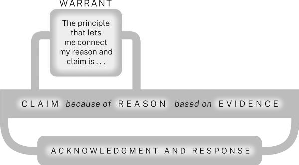
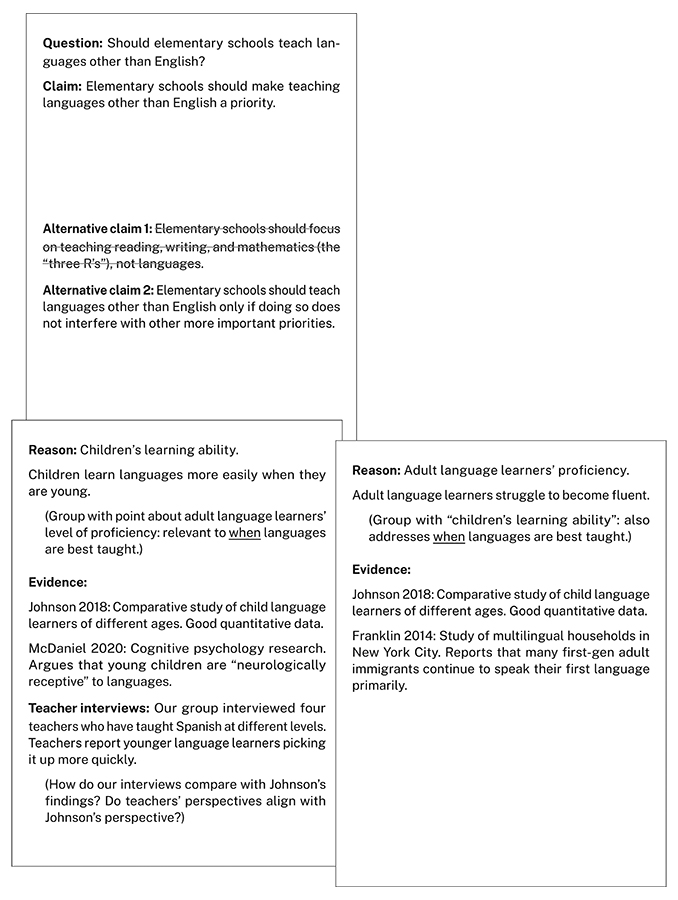

# 第 5 章　构建有力的论证：概览

本章解释什么是研究论证，以及构成论证的五个问题与相应答案。

第一部分说过，真正的研究不只是积累某个主题的信息，而是为你和受众共同关心的课题提出解答。同样，分享研究成果，也不只是把一堆数据倒给受众，说“这些都是有关我的主题的事实”，而是要通过研究论证，解释课题，并证明解答有道理。

## 5.1 把论证看成对话

在研究论证中，你提出主张，用建立在证据之上的理由来支持它，承认并回应其他观点，有时还需解释推理所依据的原则。这些并不神秘。想想日常生活中的对话：

**艾比：** 听说你上学期挺不顺的。你觉得这学期会怎样？  
*艾比用提问的方式提出一个问题。*

**布雷特：** 希望会好些。  
*布雷特回答问题。*

**艾比：** 为什么？  
*艾比要求给出相信这个回答的理由。*

**布雷特：** 我这学期上的是本专业课程。  
*布雷特给出理由。*

**艾比：** 比如哪些？  
*艾比要求提供支持理由的证据。*

**布雷特：** 艺术史、设计导论。  
*布雷特给出支持理由的证据。*

**艾比：** 上本专业课程，为什么就会不一样？  
*艾比看不出这个理由与“表现会更好”的主张有什么关系。*

**布雷特：** 上我感兴趣的课，我会更努力。  
*布雷特给出一个一般原则，把理由与“表现会更好”的主张联系起来。*

**艾比：** 那门必须上的数学课呢？  
*艾比对他的理由提出异议。*

**布雷特：** 我知道，上次我只好退了那门课。但这次有个很好的辅导老师。  
*布雷特承认异议，并作出回应。*

如果能想象自己参与这样的对话，搭建研究论证就不会显得陌生。因为任何论证的五个要素，不过是对艾比这类问题的回答。你也必须代受众向自己提出这些问题：

1. **主张：** 你希望我相信什么？你的要点是什么？
2. **理由：** 为什么这么说？我为什么应当同意？
3. **证据：** 你怎么知道？拿得出支持吗？
4. **论证依据：** 这怎么推得出来？能解释推理吗？
5. **承认异议并作回应：** 可是，________又怎么解释？

不妨把研究看成寻找这五类答案的过程。

## 5.2 搭建论证的核心

每项研究论证的核心，都有三个要素：主张、接受主张的理由，以及支撑理由的证据。在此基础上，还要增加一个，有时两个要素：需要解释推理何以成立时，补充论证依据，参见第八章；还要承认并回应问题、反对意见和其他观点，参见第九章。把这些要素都看成对受众可预见问题的回答。

### 5.2.1 用理由支持主张

第一种支持是理由，也就是能引导受众接受主张的陈述。我们常用“因为”把主张与理由连接起来：

> **主张：** 小学应把多语言教学列为优先事项。  
> **理由：** 因为人在年幼时，语言学得最好，也最容易。

一个主张往往需要不止一个理由。复杂论证中的理由，通常又需要更多理由支持：

> **主张 1：** 小学应把多语言教学列为优先事项。  
> **理由 1，同时也是主张 2：** 因为人在年幼时，语言学得最好，也最容易。它支持主张 1。  
> **理由 2，同时也是主张 3：** 事实上，成年后才开始学习新语言的人，很少能达到幼年就学习者的流利程度。它支持理由 1，也就是主张 2。  
> **理由 3，同时也是主张 4：** 小学阶段开展多语言教学，还有助于儿童的道德发展。它支持主张 1。  
> **理由 4，同时也是主张 5：** 因为这能培养儿童对自身文化和社会之外的其他文化、社会的认识。它支持理由 3，也就是主张 4。

### 5.2.2 让理由建立在证据之上

第二种支持是证据，也就是理由所依据的材料。理由可能需要更多理由支撑，但这条链不能无限延长。最终，必须拿出具体数据或信息，那就是证据。有时，“理由”和“证据”看起来可以互换：

> 你的主张基于什么理由？  
> 你的主张基于什么证据？

但两者意思不同。比较下面两句：

> 你的理由基于什么证据？  
> 你的证据基于什么理由？

第二句很奇怪，因为不是证据建立在理由上，而是理由建立在证据上。理由是我们思考出来的、支持主张的陈述；证据则需要到外部世界寻找，再展示给所有人看。证据是我们用来支持理由的信息或数据，例如统计数字、实例、引文、图片、模型等。理由需要证据支持；证据除了清楚展示，或注明可靠出处之外，不应再需要其他支持。

> **澄清几个术语**
>
> 对于表达你要论证的想法的那句话，前面已用过两个名称。在研究问题的语境中，我们称它为“答案”；在研究课题的语境中，我们称它为“解答”。现在，在论证的语境中，称它为“主张”。
>
> - **主张**是需要支持的断言，可以是一句话，也可以不止一句。例如：“大熊猫是熊的一种。”“美国联邦医疗保险支出将继续上升。”“托妮·莫里森最重要的小说是《宠儿》。”**核心主张**是整个研究论证所支持的断言，也有人称它为中心论点或论文论旨。
> - **理由**是支持主张的断言。例如：“因为基因检测表明，其他熊类是大熊猫最接近的亲属。”“因为美国人口正在老龄化。”“因为在《宠儿》中，莫里森的主要主题得到了最充分的展开。”
> - **证据**是用来支持理由的信息。与主张和理由不同，证据不一定采用断言形式。例如，展示大熊猫与其他熊类在遗传和解剖学上相似性的图示；记录过去二十年美国居民年龄中位数的图表或数据表；展现莫里森主要主题的《宠儿》引文。
>
> 这些区分可能令人困惑：主张和理由都是断言，理由和证据又都是支持。不过，继续读下去，你会看到这些差别为什么重要。

日常交谈中，通常一个理由就足以支持主张：

> **主张：** 我们该走了。  
> **理由：** 看起来要下雨。

很少有人追问：“你说看起来要下雨，有什么证据？”但在研究论证中，还必须提供证据，因为审慎的受众不会直接照单全收理由：

> **主张 1：** 小学应把多语言教学列为优先事项。  
> **理由 1／主张 2：** 因为人在年幼时，语言学得最好，也最容易。  
> **理由 2／主张 3：** 事实上，成年后才开始学习新语言的人，很少能达到幼年就学习者的流利程度。这支持理由 1。  
> **支持理由 2 的证据：** 琼斯（2013）研究了一百多位语言学习者，发现新语言熟练程度与……呈负相关，见表 1。

有了理由和证据，就有了研究论证的核心：

**图示说明：** “主张（claim）——因为（because of）——理由（reason）——基于（based on）——证据（evidence）”。阅读方向显示论证的解释次序；支持关系则是证据支持理由，理由支持主张。

但多数情况下，仅有核心还不够。还需要补足论证：有时提供论证依据，说明理由为什么与主张相关；还要承认并回应其他观点。

## 5.3 用论证依据解释推理

即使受众认可某个理由为真，也可能因为看不出它与主张的关联，而感到困惑，甚至反对。看下面这个论证：

> **理由：** 近期美国国债收益率曲线倒挂，  
> **主张：** 因此，经济衰退似乎很可能发生。

不熟悉金融和投资的人可能会问：“收益率曲线倒挂，为什么就意味着更可能衰退？我看不出联系。”要回答，就必须给出一个一般原则，把这个具体理由与具体主张连接起来，解释推理如何成立：

> **论证依据：** 至少从二十世纪中叶以来，美国国债收益率曲线倒挂，一直能可靠地预示即将到来的经济衰退。

这一论证依据表达了一条从经验中得来的原则：收益率曲线倒挂，是未来经济困难的征兆。和所有论证依据一样，如果它为真，就能确立这样一种推断：从一般情形“收益率曲线倒挂”，可以推向一般结果“经济很可能衰退”。如果主张是这一一般结果的恰当实例，理由也是这一一般情形的恰当实例，那么论证便成立。

**图示说明：** 下方仍是“主张——因为——理由——基于——证据”；上方增加“论证依据（warrant）”，框中文字为“使我能够把理由与主张联系起来的原则是……”。它架在理由和主张之间，解释两者的推理联系。

第八章会说明，连“什么时候需要把论证依据说出来”都不容易判断。有经验的研究者通常只在两种场合明示它：一是预料本领域受众可能看不出理由与主张的关联；二是向普通受众解释本领域的推理方式。

## 5.4 承认并回应可以预见的问题与异议

审慎的受众会质疑论证的每个部分。因此，应尽量预见他们的问题，并承认、回应其中最重要的。例如，面对“小学应优先开展语言教学”的主张，受众可能担心，这是否会影响其他学科教学。如果预料会出现这个问题，明智的做法就是主动承认并回应：

> **主张 1：** 小学应把多语言教学列为优先事项。  
> **理由 1／主张 2：** 因为人在年幼时，语言学得最好，也最容易。……  
> **承认异议：** 当然，如果学校更重视语言教学，其他学科的教学质量可能下降。  
> **回应：** 但支持这种担忧的证据很少，能消除这种担忧的证据却很多……

没有承认异议与回应，研究论证就不完整。因此，下面把它们加入图中，显示它们与其他所有部分的关系：

**图示说明：** 在“主张—理由—证据”及其上方的“论证依据”之外，下方增加“承认异议并作回应（acknowledgment and response）”。连接线环绕整个论证核心，表示问题与异议可以针对论证各部分，而回应也应覆盖这些部分。

## 5.5 规划研究论证

研究论证与日常论证由相同的五类要素构成：主张、理由、证据、论证依据，以及对其他观点的承认与回应，只是更复杂。除了核心主张，还可能包括若干从属主张；每一项又可能由更多理由和证据支持，并由一个或多个论证依据解释。它几乎肯定还会承认、回应预期问题、其他可能和反对意见，而每个回应又需要自己的论证。

多数研究论证还包括背景、定义，以及受众可能不理解的问题的解释。例如，向不熟悉经济理论的人论证通货膨胀与货币供给之间的关系，就得先解释经济学家怎样理解这些概念。严肃论证结构复杂，但拆成更简单的部分，就能处理。

规划时，可以写传统提纲，也可以用其他方式把论证画出来。我们推荐一种图表式提纲或视觉组织工具，叫“论证分镜图”（storyboard）。它像一份拆开后铺在几页纸上的提纲，留有很多空间，便于不断补充数据和想法，比普通提纲更灵活。可以使用应用或在线工具，也可以像我们一样，用索引卡、便利贴或纸张。

开始时，把核心主张、每条理由和下一级理由，分别写在不同卡片或页面的顶部。在每条理由下列出支持证据；尚无证据，就注明需要什么类型的证据。如果预计必须解释某个理由怎样支持主张，再加一页记录论证依据。也可以另外设页，记录其他观点及你的回应。

尚未想清的页面可以先留白，准备好再填。随着论证和论文结构逐渐成形，可以不断移动页面。把它们铺在墙上，相关内容放在一起，次要部分放在主要部分下方，就能一眼看见整体设计。这种可视化能帮助你发现哪些地方还需充实，也能尝试不同组织方式，选出最合适的一种。

下面是一项“小学语言教学”研究的部分论证分镜图。它只是研究者此刻想法的快照，随着项目推进和思路发展，可以、也应该发生变化。第一页记录研究问题和暂定主张，也就是引导研究、但可能随项目改变的初步主张，另列几种替代主张，其中一种已被否决。理由分为两组：一组关注何时学习语言效果最好，另一组关注语言学习的益处。计划也包括对异议的承认和回应，但“文化意识”那页几乎空白，因为研究者还没找到支持这一理由的恰当证据。如果继续研究仍找不到，就可能必须放弃这个理由，甚至修改主张。

**图中三张卡片的中文内容：**

**卡片一：研究问题与主张**

- **问题：** 小学应该教授英语以外的语言吗？
- **主张：** 小学应把教授英语以外的语言列为优先事项。
- **替代主张 1，已划去：** 小学应专注于阅读、写作和数学，也就是“读、写、算”，而不是语言教学。
- **替代主张 2：** 只有在不妨碍其他更重要事项的前提下，小学才应教授英语以外的语言。

**卡片二：理由——儿童的学习能力**

儿童年幼时学习语言更容易。与“成年语言学习者的熟练程度”归为一组，两者都涉及什么时候最适合教语言。

- **证据：** Johnson 2018，对不同年龄儿童语言学习者的比较研究，有良好的定量数据。
- **证据：** McDaniel 2020，认知心理学研究，认为幼儿在神经机制上更容易接受语言。
- **教师访谈：** 本组访谈了四位在不同层级教授西班牙语的教师。他们报告，较年幼的学习者掌握得更快。
- **待思考：** 我们的访谈结果与 Johnson 的发现如何比较？教师的视角是否与 Johnson 一致？

**卡片三：理由——成年语言学习者的熟练程度**

成年语言学习者要达到流利程度比较困难。与“儿童的学习能力”归为一组，也是在回答什么时候最适合教语言。

- **证据：** Johnson 2018，对不同年龄儿童语言学习者的比较研究，有良好的定量数据。
- **证据：** Franklin 2014，对纽约市多语言家庭的研究，报告许多成年第一代移民仍以母语为主要交流语言。

**图中四张卡片的中文内容：**

**卡片四：理由——心智训练**

学习第二语言可以训练心智，使思考更好、更灵活。与“文化意识”归为一组，都是语言学习的益处。

- **待思考：** 这一点能否成为主要理由？培养文化意识与训练心智，哪个更重要？
- **证据：** Yamato 2006，报告开设语言课程的学校，其学生在定量推理测试中表现更好。
- **待思考：** 该研究的结论能推广多远？所学具体语言会影响结果吗？

**卡片五：理由——文化意识**

学习第二语言，让学生了解其他文化。与“心智训练”归为一组，都是语言学习的益处。

- **证据：** ？？？

**卡片六：承认异议——与其他优先事项冲突**

语言教学可能分散学校对读、写、算教学的注意力。

- **回应：** 这是“资源总量固定”的谬误吗？
- **回应：** 使用 Yamato 2006？如果学语言的学生在定量推理测试上优于没学的学生，是否说明语言学习至少有助于读、写、算中的一项？
- **回应：** Chase 2007 提出了类似观点。

**卡片七：承认异议——资源不足**

有些学校没有足够师资或资金来教语言。

- **回应：** 缺乏资源，并不意味着语言教学没有价值，或不应列为优先事项。
- **回应：** 部分学校开展语言教学，仍比所有学校都不教好。
- **回应：** 是否存在其他经费来源？州或联邦拨款？私人基金会？

## 5.6 建立研究者的可信形象

最后再说一点。本章介绍了所有论证共同拥有的五个要素：主张、理由、证据、论证依据，以及承认异议与回应。但论证还有第六个隐含要素，传统上称为 ethos，即研究者的可信形象。受众判断论证，不仅看它的思想结构，也看你在论证时展现的品格。你是否愿意提供必要背景，帮助受众跟上思路？是否为主张提供充分而不过量的支持？是否周全考虑不同方面？还是只看见一种观点，轻率否定乃至忽略其他意见？同样，从写作风格或表达方式看，你是否体察受众需求，尊重他们的时间和注意力？还是显得生硬简略、傲慢，或只顾自己说得晦涩？第十五、十六章会讨论这些问题。

> **信息太多、脑子转不过来时，不妨宽心**
>
> 到这里，许多研究新手会开始感到不堪重负。如果你也如此，请知道，这种焦虑更多来自缺少经验，而不是智力或能力不足。我们中的一位曾向法律写作教师解释，为什么许多法学院一年级学生会因为初入陌生领域，而觉得自己不会写作。讲座结束时，一位女士说，她原先是人类学教授，发表的文章一直以清楚易懂受到称赞。后来转行读法学院，头六个月写出来的东西却如此混乱，以至于怀疑自己患上了退行性脑病。当然，她并没有病。她只是经历了多数人都会遇到的痛苦转变：面对自己还不完全理解的内容，为自己更不了解的受众写作。后来她发现，对法律了解越多，写得就越好，这才松了一口气。
>
> 如果感到力不从心，可以从这个故事中获得安慰。一位读者写邮件告诉我们：
>
> “《研究的艺术》里写到，一位女士从人类学转到法律，忽然发现自己无法清楚写作。我做了五年平面设计助理教授，最近转向人类学，突然发现，写人类学论文像拔牙一样艰难。我也想过，自己会不会得了退行性脑病！读到那位转学法律的人类学家的故事，我忍不住大笑起来，心里好受了一点。”

当你表达清楚、态度尊重，并预见、处理受众的问题和关切时，就会赢得信任，让他们有充分理由与你一起发展、检验新观念。这也是承认异议和回应如此重要的另一个原因。长远看，一次次论证中呈现的可信形象，会沉淀为声誉；每位研究者都必须在意它，因为声誉就是每次论证中隐含的第六个要素。它回答了那个没有说出口的问题：“我能信任你吗？”这个答案必须是“能”。

## 实用提示：一个常见错误——退回自己熟悉的东西

缺少经验时，你可能过度依赖熟悉的东西。因为“知道”自己能证明，就过早接受某个主张，甚至在研究还没怎么展开时便定下来。但退回这种确定感，只会妨碍充分思考。做研究者，就意味着允许发现和见解带给自己意外。因此，开始项目时，不要从一个自知能够证明的主张出发，而要从一个想探索、想解决的课题出发。

同样，刚进入某个领域时，也可能依赖此前教育或经验中熟悉的论证方式。如果文学课教你通过呈现、分析引文来支持主张，不要以为在生物学或实验心理学等强调“客观数据”的学科里，也能照搬。反过来，如果作为生物或心理专业学生，你学会了搜集实测数据、开展统计分析，也不要以为艺术史同样如此。这不是说，一门课学到的东西，到另一门课就没用了。所有学科的论证都依赖本章所述要素。但必须了解，每个学科怎样以自己的方式处理这些要素，并在信任已有技能的同时，灵活调整。

随着越来越熟悉某个领域，还可能以另一种方式过度简化。有些新手一旦成功掌握一种论证，就反复使用。对一种复杂性的熟练，反而使他们看不见另一种复杂性：一个活跃的领域，本来就有彼此竞争的方法、解答、目标和宗旨。不要掉进这个陷阱。会做一种论证以后，试试其他类型：寻找不同方法，不仅提出多种解答，也提出支持它们的多种路径，并问一问，别人会不会用不同方式处理同一课题。
