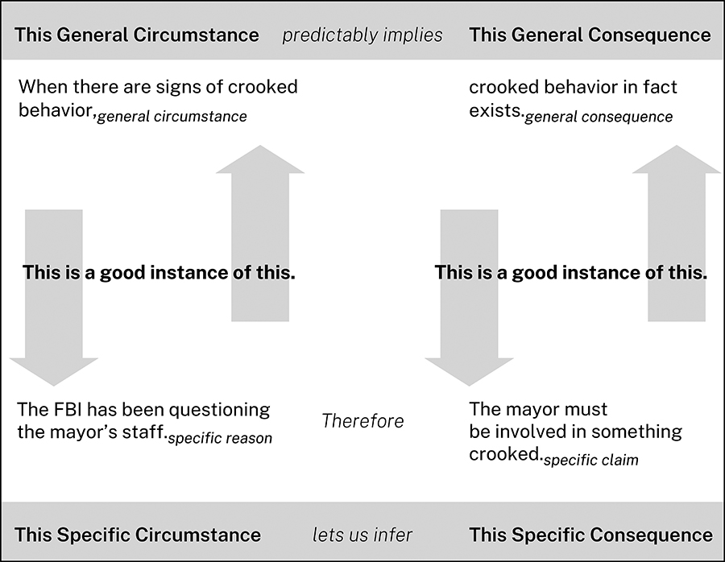
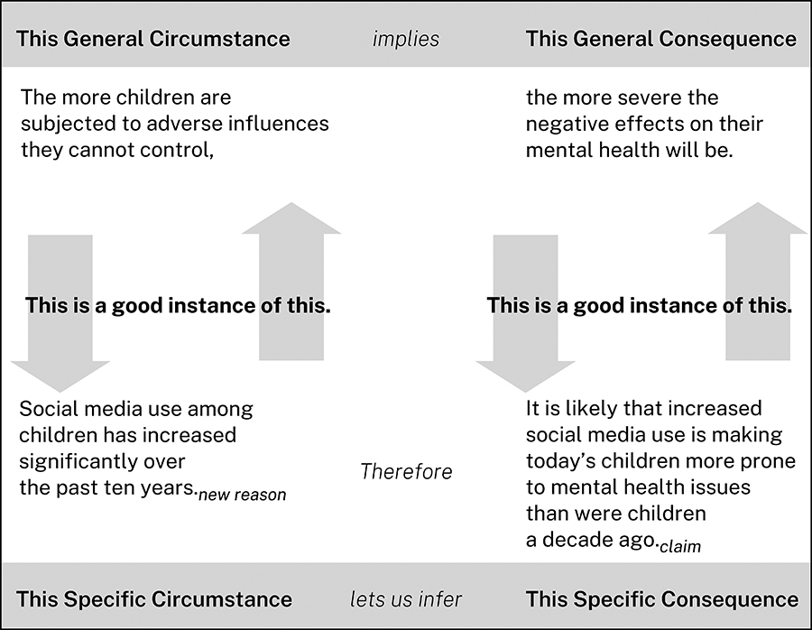

# 第 8 章　论证依据

论证依据，是把理由与主张联系起来的一般原则。本章解释何时以及怎样使用它。所有研究论证都有论证依据，正如它们都有主张、理由和证据。不过，与这些核心要素不同，论证依据常常隐而不言。一般来说，只有不把它说出来受众就无法理解论证，或者你预计受众会质疑推理时，才需要明说。

来看这个论证：

> 日本面临生活水平下降的前景。**〔主张〕**因为其生育率只有 1.3，而且还在下降。**〔理由〕**

有人回应：

> 日本的生育率，你说得没错。但我不明白，这为什么意味着日本的生活水平会下降？这个结论是怎么推出来的？

如果提出论证的是你，会怎样回答？拿出生育率的证据并没有帮助，因为对方问的不是理由本身是否真实，而是它怎样支持主张。这个问题涉及论证的第四个、也是最抽象的要素：论证依据。

论证依据是把理由与主张联系起来的一般原则。它必不可少，因为它解释或确认了论证赖以成立的推理。你需要理解它，因为别人不仅可能质疑理由是否真实，也可能质疑理由是否相关。这时，不仅要说明理由和证据是什么，还要解释它们为什么支持主张；这可能比听起来更难。

每一个针对论证依据的问题，归根结底都是在追问你的信念建立在什么基础上。它要求你认识到，论证之所以说得通，是因为你接受某些原则，也就是论证依据；还要求你承认，持不同原则的人看到同样的理由和证据时，可能得出不同结论，甚至根本无法得出结论。

好在多数时候，我们不必作这样的哲学思辨，因为大多数论证依据来自我们参与的共同体：不仅有研究共同体和职业群体，也有社交圈、家庭、政治与宗教团体，乃至整个文化。

实际运用时，基本原则是：**只有当受众持有不同的论证依据、不明说就无法理解你的推理，或可能质疑你的推理时，才把论证依据明确写出。**为本领域专家写作时，大多数论证依据可以不说，因为专家通常已将其视为理所当然。

## 8.1 日常推理中的论证依据

论证依据虽然抽象，我们却一直在使用它。拿谚语来解释推理时，这一点就很容易理解，因为谚语正是大家熟悉的文化性论证依据。例如，有人说：

> 听说联邦调查局一直在询问市长的幕僚。**〔理由〕**市长肯定牵涉了某种见不得人的勾当。**〔主张〕**

另一个人可能反对：“没错，联邦调查局确实在询问市长的幕僚，但这为什么就说明市长不干净？”为了说明自己如何得出结论，第一个人也许会引用谚语：“有烟的地方就有火。”也就是说，看到事情有问题的迹象，就可以推断确实出了问题。

推理的运作方式是这样的：大多数谚语有两个不同部分，一个是情形——“有烟的地方……”；另一个是结果——“……就有火”。如果一般情况下，某种情形意味着某种结果，就可以依据这一联系，对具体情况作出推断。“烟与火”的谚语与联邦调查局调查市长的例子，关系如下：

> **图示说明：**上层是一般情形“出现不正当行为的迹象”，指向一般结果“确有不正当行为”；下层是具体理由“联邦调查局一直在询问市长幕僚”，因此推出具体主张“市长一定卷入了不正当行为”。上下两侧的箭头表示：具体理由和具体主张，分别被视为一般情形与一般结果的恰当实例。最下方概括为“这一具体情形，使我们能够推断出这一具体结果”。

我们用谚语解释各种日常推理：因果关系，如“欲速则不达”；行为规则，如“三思而后行”；可靠的推断，如“一燕不成夏”。但日常论证依据不限于谚语。体育中有“防守赢得冠军”；烹饪中有“只在英文名称带 r 的月份供应牡蛎”；定义中有“质数只能被它本身和 1 整除”；研究中也有“受众发现一项证据有错，就会怀疑其余证据”。

## 8.2 研究论证中的论证依据

研究者及其他专业人士的论证依据，运作方式完全相同，但有些特点使它们更难把握，尤其对初入某个领域的人而言。

首先，研究论证的依据未必是大家共有的常识，往往是特定研究共同体使用的专业推理原则。新研究者需要时间才能掌握本领域的论证依据。事实上，所谓学会像生物学家、历史学家、医生那样思考，很大一部分就是学习这些原则。

其次，专家面向同行时，很少明说论证依据，因为可以放心假定对方已经了解。把理应显而易见的依据说出来，可能显得居高临下；更糟的是，还可能暴露出一位所谓专家其实并不专业。

这种不明说公认依据的做法，有利于研究共同体高效交流。不过，无论是评价别人论证的人，还是刚进入领域的初学者，能够识别正在起作用的论证依据，仍然很有帮助。假设现有证据支持理由，生物学家会接受以下论证：

> 鲸与河马的亲缘关系比与牛更近。**〔主张〕**因为鲸与河马共享的 DNA 比与牛更多。**〔理由〕**

生物学家不会问：“DNA 为什么能用来衡量亲缘关系？”因此，面向同行写作的生物学家，也不会给出回答这个问题的论证依据。但如果提问的是非生物学家，专家就会把同行视为当然的依据说出来：

> 一个物种与另一物种共享的 DNA 比与第三种更多时，**〔情形〕**我们推断，它与第二种的亲缘关系更近。**〔结果〕**

当然，接下来可能还得解释这条依据。关键是：是否需要明说论证依据，不仅取决于论证，也取决于受众。研究共同体成员只有在与外部人士交流，或受到质疑时，才会明说对同行不言自明的原则。

第三，专业领域的论证依据，常把情形和结果压缩在一起。大多数谚语的两个部分清楚分开：“有烟的地方，**〔情形〕**就有火。**〔结果〕**”但也可以压成一句：“烟意味着火。”谚语很少这样说，专家却常如此表达：

> 共享 DNA 的多少，是衡量物种亲缘关系的尺度。

这样表述，就没有明确区分情形与结果，但仍可以把它们拆开。为求清楚，本章将采用最明确的形式来表述论证依据：**当 X 时，就有 Y。**

再看日本经济前景的论证：

> 日本面临生活水平下降的前景。**〔主张〕**因为其生育率只有 1.3，而且还在下降。**〔理由〕**

如果有人认为理由与主张无关，提出论证的人就得给出论证依据，说明两者的联系为何成立：

> 当一个国家的劳动力萎缩时，**〔一般情形〕**它的经济前景就不乐观。**〔一般结果〕**

这里的情形和结果，都必须比具体理由和具体主张更为一般化。其逻辑关系如下：

> **图示说明：**一般原则是“国家劳动力萎缩 → 经济前景不佳”；具体论证是“日本生育率仅为 1.3，且持续下降 → 日本面临生活水平下降”。图中上下箭头表示，理由与主张分别被当作一般情形和一般结果的恰当实例。

无论日常推理还是专业推理，模式都相同。

## 8.3 检验论证依据

受众质疑论证依据的方式，通常可以预见。来看这个论证：

> 在十八世纪初的新英格兰，除最富裕的农民外，很多农民拥有钟表的可能性似乎不大。**〔主张〕**因为农民的遗嘱很少提到钟表。**〔理由〕**考察 1700 至 1750 年马萨诸塞州四个县登记的 124 份此类遗嘱发现，只有 14% 提到任何一种钟表。**〔证据报告〕**

如果这项主张挑战了某些人的既有信念，他们很可能提出质疑。即使接受理由为真，也就是遗嘱确实很少提到钟表，他们仍可能反对：“我不明白，这怎么能成为相信很少有农民拥有钟表的理由？两者无关。”如果历史学家预见到这一质疑，就可以先提出论证依据：

> 在十八世纪初的新英格兰，遗嘱会列明家中贵重物品。因此，遗嘱没有提到某件此类物品，就说明立遗嘱者没有它。**〔论证依据〕**所以，似乎不大可能……**〔主张〕**

注意，这个论证还依赖第二条依据：马萨诸塞州农民的情况，也适用于更广泛的新英格兰农民。不过，如果历史学家认为这条依据不会受到质疑，就可以不明说。

有效的论证依据必须满足五项条件，也就是受众能够对以下问题回答“是”：

1. 这条论证依据合理吗？
2. 它是否有充分的限定？
3. 它是否优于与之竞争的其他依据？
4. 它是否适合这个领域？
5. 它是否涵盖了所用的理由与主张？

### 8.3.1 论证依据合理吗

如果受众能够接受，一般结果确实能从一般情形中推出，论证依据看起来就是合理的。若受众不愿直接接受，就得把它当作一项独立论证中的主张，用自己的理由和证据来支持：

> 在十八世纪初的新英格兰，遗嘱会列明家中贵重物品。因此，遗嘱没有提到某件此类物品，就说明立遗嘱者没有它。**〔论证依据／主张〕**迈尔斯与温恩（2018）证实了这一点。**〔理由〕**他们对十八、十九世纪美国继承习俗的研究表明……**〔证据〕**

### 8.3.2 论证依据是否有充分的限定

多数论证依据只在一定限度内合理。例如，关于钟表所有权的依据太绝对，似乎不允许例外：

> 在十八世纪初的新英格兰，遗嘱会列明家中贵重物品。因此，遗嘱没有提到某件此类物品，就说明立遗嘱者没有它。

加上限定，可能更可信：

> 在十八世纪初的新英格兰，遗嘱**通常**会列明物主认为**特别贵重**的家用物品。因此，遗嘱没有提到某件此类物品，就说明立遗嘱者**很可能**没有它。

不过，一旦加上“通常”“很可能”“特别”等限定，又可能需要说明：例外情况并没有把你的理由和主张排除在外。“通常”和“很可能”到底意味着多大的频率？当时的人认为钟表特别贵重吗？

### 8.3.3 它是否优于竞争性的论证依据

你可能认为自己的论证依据既合理，也有充分限定，但还可能有其他依据与它竞争，甚至优先于它。下面两条依据，就都可以说有一定道理：

> 当人们相信某种医疗措施可能伤害自己时，就有权拒绝。泰勒认为新冠疫苗会引起心肌炎，所以他有权拒绝接种。

> 当医疗决策涉及公共卫生时，政府就有权加以规范。广泛接种新冠疫苗会让每个人更安全，因此政府可以要求政府雇员接种。

哪条依据应该优先？这需要论证。

有时，加上限定可以调和相互竞争的依据：

> 当人们相信某种医疗措施可能伤害自己时，就有权拒绝，**前提是不危及他人的健康**。

> 当医疗决策涉及公共卫生时，政府就有权加以规范，**前提是尽量少侵入个人对自己身体的自主权**。

找到合适的平衡，甚至找到任何平衡，都并不总是容易。事实上，所谓“文化战争”的争论，例如新冠疫苗强制接种之争，往往如此激烈、难解，正是因为它们更多涉及相互竞争的价值观和原则，也就是论证依据，而非理由或证据。

### 8.3.4 论证依据适合这个领域吗

一条依据可能合理、限定充分，也优于其他依据，但仍须被相关领域认可。法学生发现许多日常依据不适用于法律论证时，会吃到一记苦头。大多数人刚进入法学院时，都抱有这样的常识性信念：

> 一个人受到不公正待遇时，法律就应予以纠正。

但他们必须学会，法律上的依据可能优先于这类常识。例如：

> 忽视法律义务的人，即使出于无意，也必须承担后果。

因此：

> 年迈房主忘记缴纳房地产税时，别人可以通过缴清欠税买下他们的房屋，并将其驱逐。

法学生必须明白，严格法律意义上的正义，并非他们认为合乎伦理的结果，而是法律和法院支持的结果。

### 8.3.5 论证依据是否涵盖理由和主张

最后，必须确认理由与主张确实是论证依据的一般情形与一般结果的恰当实例。例如：

> **艾哈迈德：**也许你该开始用个效率应用。**〔主张〕**因为你总是缺席我们的员工会议。**〔理由〕**
>
> **贝丝：**你为什么认为效率应用会让我去参加员工会议？
>
> **艾哈迈德：**如果做事更有条理，**〔一般情形〕**就更容易记住日程安排。**〔一般结果〕**
>
> **贝丝：**我不参加，可不是因为做事没条理。

贝丝质疑的不是理由不真实，而是它不能算作一般情形的有效实例。她没有否认缺席会议，只否认缺席是由于缺乏条理；也许她只是觉得会议浪费时间。对她而言，艾哈迈德的理由并不在他的论证依据涵盖范围之内，因此不相关。

贝丝也可能回答说，用效率应用反而会使自己更没条理：

> **贝丝：**我一直都用纸质日程本，所以实在不觉得应用能帮到我。

这时，她质疑的是主张并非一般结果的恰当实例，也就是说，主张不能从理由推出：即使她做事确实没有条理，效率应用也帮不了她。

现实中的论证大多如此：某个情况究竟“算不算”一般情形的实例，或者能够推出什么具体结果，常常需要讨论和协商，而不是由毫无争议的定义决定。艾哈迈德与贝丝可以合理地争论，什么才算“没条理”；但什么几何图形算三角形，就不会引起这样的分歧。这也是讨论论证依据会带出更多讨论，并在理想情况下增进理解的又一个原因。

## 8.4 何时需要明说论证依据

任何领域的论证都依赖无数推理原则，但多数已融入研究者的默会知识，或已普遍得到接受，因此不仅没有明说，甚至根本未被察觉。不过，以下三种情况可能需要明确提出论证依据。

1. **受众来自本领域之外。**面对不具备相同专业知识的人，你可能需要解释本领域专家怎样得出结论、支持主张；推理方法不同寻常时，尤其如此。
2. **采用本领域中较新或有争议的推理原则。**倚赖非常规原则，就可以预料至少一部分人会怀疑。明确提出论证依据，并说明其合理性，有助于化解疑虑。可以援引同样采用它的受尊敬的学者；若找不到，就自行论证，为这种推理辩护。
3. **提出一项别人只是因为不愿它为真，就会抵制的主张。**这时，一个好策略是：在提出预计会遭抵制的理由与主张之前，先给出希望对方接受的论证依据。对方未必因此更喜欢你的主张，但至少可能认识到，它并非不合理。

例如：

> 我们应当承认，人类活动是气候变化的主要原因。**〔主张〕**因为几乎所有气候科学家都持这种看法。**〔理由〕**

受众可能抵制它，因为它威胁到他们坚信的其他观念。面对这样的受众，研究者可以先给出一条对方应该能接受的依据，促使他们至少考虑该主张：

> **当绝大多数具备相应能力的专家得出同一结论时，我们通常可以信赖它。〔论证依据〕**因此，我们应当承认，人类活动是气候变化的主要原因。**〔主张〕**因为几乎所有气候科学家都持这种看法。**〔理由〕**

只要受众接受论证依据合理、理由真实，而且理由和主张确实是一般情形与一般结果的恰当实例，那么从逻辑上说，他们至少有义务**考虑**这项主张。如果连这也不肯做，理性论证大概就无法改变他们的想法。

> **没有说出的话，也会显露你的为人**
>
> 明确提出并支持论证依据，向受众解释他们可能不熟悉的推理原则，是一种礼貌。反过来，明知受众不懂，却对本应解释的依据保持沉默，也是在传递同样强烈、但不那么友善的态度。无论哪种做法，论证依据都会显著影响受众如何看待你通过论证呈现的研究者可信形象。

## 8.5 用论证依据检验自己的论证

试着为一个论证找出论证依据，可以检验它是否可靠。下面是一个有缺陷的例子：

> 今天十二至十六岁的儿童，比上一代同龄人明显更容易出现心理健康问题。**〔理由〕**布朗（2021）表明，自 2010 年以来，儿童焦虑和抑郁的发生率上升了……**〔证据〕**我们必须得出结论：社交媒体正在损害儿童心理健康。**〔主张〕**

要看出问题，可以试着找一条依据，把“儿童心理健康问题增加”这一理由，与“社交媒体至少应为部分增加负责”这一主张联系起来。该主张看起来符合常识，甚至可能是真的，但没有令人满意、也就是符合 8.3 节五项标准的依据，能够把这一个具体理由与这一个具体主张联系起来。它需要的依据大概是：

> 当儿童心理健康变差时，**〔一般情形〕**就该归咎于社交媒体。**〔一般结果〕**

这似乎并不合理。为什么单单点名社交媒体？其他所有可能对儿童产生不利影响的因素呢？

要修复论证，就必须修改理由，使它成为受众能接受的一条论证依据中，一般情形的恰当实例。这也可能意味着，要为修改后的理由寻找新证据：

> 儿童受到的、无法控制的不利影响越多，其心理健康遭受的负面影响就越严重。**〔论证依据〕**已知使用社交媒体是十二至十六岁儿童焦虑和抑郁的风险因素，而过去十年间，儿童使用社交媒体的情况显著增加。**〔新理由〕**琼斯（2022）表明……**〔新证据〕**鉴于这些事实，社交媒体使用的增加，很可能正在使今天的儿童比十年前更容易出现心理健康问题。**〔主张〕**

现在，理由和主张似乎更接近论证依据所涵盖的范围。下面的图展示了这一论证的逻辑，原书见第 149 页。

但一位急于推翻论证的怀疑者，仍可能反对：

> 等等，社交媒体并不总是儿童“无法控制”的“不利影响”。它难道不会有积极作用吗？诚然，儿童使用社交媒体与焦虑和抑郁风险相关，但它也让儿童能够与朋友联系，否则他们可能孤立无援……

研究者就必须回应这些质疑。现在你明白了，重要议题为什么总是争论不休；即使你觉得自己的论证无懈可击，别人为什么仍能说：“等等，那……怎么办？”

> **图示说明：**一般原则为“儿童受到的、无法控制的不利影响越多 → 心理健康受到的负面影响越严重”。具体理由为“过去十年儿童使用社交媒体显著增加”，具体主张为“使用增加可能让今天的儿童比十年前更容易出现心理健康问题”。上下箭头标示具体情形与一般原则的对应关系。

## 8.6 质疑他人的论证依据

最难作出的论证，不只是挑战主张和证据，而是挑战研究共同体所信奉的论证依据。没有哪种论证任务比这更难，因为你要求共同体改变的不仅是相信什么，还有怎样推理。

要成功挑战一条依据，首先必须设想接受它的人会怎样辩护。论证依据可能由不同类型的论证支持，因此也必须用不同方式质疑。

### 8.6.1 质疑基于经验的论证依据

有些依据来自亲身经验或他人的报告：

> 惯于说谎的人，不值得信任。
>
> 有烟的地方就有火。
>
> 国债收益率曲线倒挂时，很可能发生经济衰退。

要挑战这些依据，就必须质疑相关经验是否可靠，这通常不容易；或者找出不能被轻易当成特殊情况排除的反例。

### 8.6.2 质疑基于权威的论证依据

我们会因为某些人的专业知识、地位或魅力而相信他们：

> 权威 X 说 Y，那么 Y 一定如此。

挑战权威最容易、也最友善的方式，是指出在当前问题上，权威并未掌握全部证据，或超出了自己的专业范围。最强硬的方式，则是论证该来源根本称不上权威。

### 8.6.3 质疑基于知识体系的论证依据

这类依据由一套定义、原则或理论支持：

- **数学：**两个奇数相加，结果是偶数。
- **生物学：**进行有性生殖的生物，其后代与双亲中的任何一方都不同。
- **法律：**存在先例时，法官应遵循先例。

挑战这类依据时，“事实”大多派不上用场。你必须挑战整个体系，这总是很难；或者证明具体情况并不属于该依据的适用范围。

### 8.6.4 质疑文化性的论证依据

这类依据依靠的不是个人经验，而是整个文化的共同经验，因此显得像无可动摇的“常识”：

> 种什么因，得什么果。
>
> 受到侮辱，就有理由报复。
>
> 杀不死你的，会使你更强大。

这些依据也许会随时间改变，但变化很慢。可以提出竞争性依据来挑战它们，或指出它们只适用于特定文化。

### 8.6.5 质疑方法层面的论证依据

这类依据是一般思维模式，只有运用于具体情况，才有实际内容。我们借助它们解释抽象推理；许多谚语也源于此。

- **概括：**如果所有已知的 X 都有性质 Y，那么所有 X 很可能都有 Y。对应的谚语是：“见过一个，就等于见过全部。”
- **类比：**如果 X 在多数方面像 Y，那么 X 在其他方面也会像 Y。对应的谚语是：“橡子落地，离树不远。”
- **征兆：**如果 Y 经常在 X 之前、期间或之后出现，那么 Y 就是 X 的征兆。对应的谚语是：“手冷，心热。”

哲学家曾质疑这些依据本身，但在实际论证中，我们通常只质疑它们的具体应用，或指出限制条件：“可以把 X 类比为 Y，但如果……就不行。”

### 8.6.6 质疑基于信条的论证依据

有些依据被置于不容质疑的位置。托马斯·杰斐逊在《独立宣言》中写道：“我们认为这些真理是不言自明的：人人生而平等……”就是援引了这样的依据。其他例子包括：

> 基于自然法的主张，必定为真。
>
> 基于神启的主张，必定为真。

这类依据靠的不是论证，而是拥护者的确信，因此几乎不可能用竞争性依据直接反驳。若某条依据把一项主张置于不容争议的地位，从而切断论证中的来回讨论，我们就已离开研究和研究论证的范围。一个主张若只是被假定为真，而不是因为有理由和证据支持，才被判断为真或至少可信，就不能算是研究的产物。

## 实用提示：理由、证据与论证依据

支持理由有两种方式：提供证据，或从论证依据推导出来。两种方式会产生不同类型的论证。研究者通常更信任第一种，因此尽可能让理由立足于扎实证据。比较以下两个论证：

> 我们应尽力阻止青少年边开车边发短信。**〔主张〕**因为分心驾驶是青少年死亡的主要原因之一。**〔理由〕**据美国疾病控制与预防中心统计，机动车事故造成的死亡，占十二至十九岁人群死亡总数的三分之一以上；而开车时发短信，会使任何驾驶者卷入事故的可能性呈指数级增加。此外……**〔证据〕**

> 我们应尽力阻止青少年边开车边发短信。**〔主张〕**因为这样做会增加事故风险。**〔理由 1〕**驾驶本就复杂，发短信又会分散注意力。**〔支持理由 1 的理由 2〕**我们知道，人们在执行复杂任务时分心，表现就会变差。**〔连接理由 2 与理由 1 的论证依据〕**

如果你和大多数人一样，大概更喜欢第一个。因为它的论证依据没有争议，所以无须明说；主张得到理由支持，而理由又建立在扎实证据上。第二个也说得通，因为理由 1 和理由 2 分别是那条依据的一般结果与一般条件的恰当实例。但大多数人仍然想看到证据。

尤其要注意，不能只靠论证依据和理由，就支持事实性主张，参见 6.1 节：

> 边开车边发短信，是青少年死亡的主要原因之一。**〔事实性主张〕**因为开车时发短信非常容易分心。**〔理由〕**驾驶者分心时，发生严重甚至致命事故的风险就会增加。**〔论证依据〕**

你是不是在想：“我可以相信，但还是希望看到证明”？这个常识性的反应很能说明问题。我们无法仅凭推理，就断定开车发短信是青少年死亡的主要原因，甚至无法据此断定它确实造成了青少年死亡。除了数学、哲学、神学的某些分支等少数领域，证明事实性主张的办法，是拿出证据，表明所主张的确实是事实。

要记住：**只要可能，就依靠确凿证据，而不要仅靠基于论证依据铺展开来的复杂推理。**
