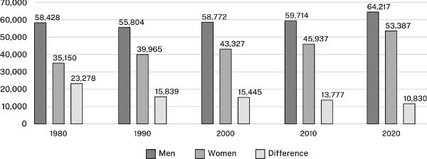
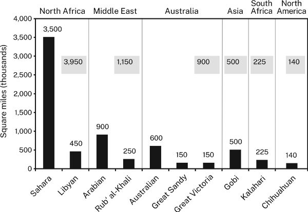
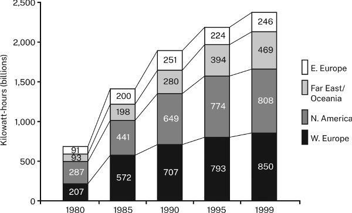
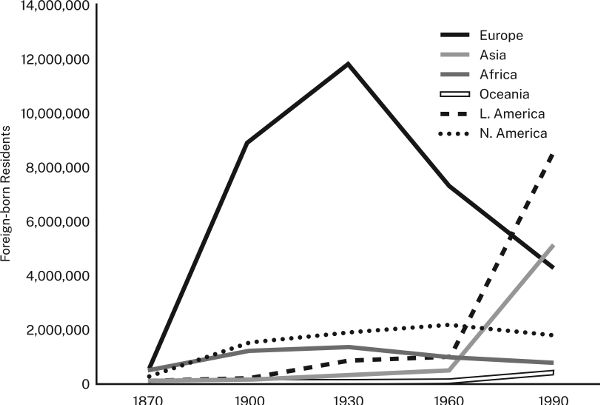
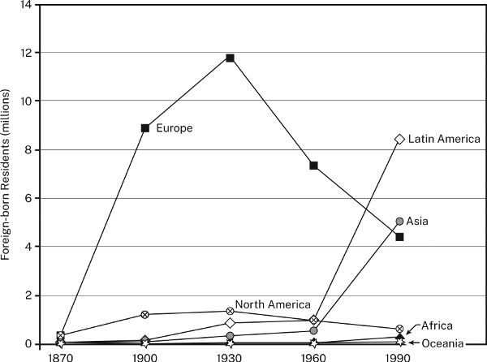
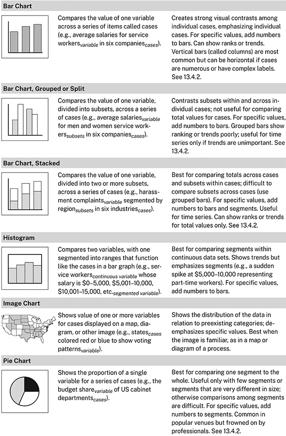

# 第 13 章　用视觉形式呈现证据

与文字相比，多数读者更容易通过表格、柱形图和线图理解定量证据。但不同视觉形式，适合不同的数据与信息。本章说明怎样选择图表，让读者既看懂数据，也明白它们怎样支持论证。

“一图胜千言”虽然是老话，但在研究论证中，数字数据的视觉呈现往往确实有这样的力量。本章简要介绍能支持论证的主要图表类型及其表达用途。想进一步了解，可查阅本书附录推荐的数据可视化资料。

先说明术语。本章用“图表” graphics 统称数据的各种视觉呈现。传统上，它们分为“表” tables 和“图” figures。表由行列构成；图包括其他形式，如线图、统计图、照片、绘画与示意图。呈现定量数据的图，又可分为统计图 charts 与线图 graphs：前者通常由条柱、圆形、点或其他形状组成，后者由连续线条组成。

## 13.1 选择图表还是文字

数据少而简单时，用一句话和用表格一样容易理解，见表 13.1：

> 2020 年，男性年收入为 64,217 美元，女性为 53,387 美元，相差 10,830 美元。按比例计算，男性每挣 1 美元，女性挣 0.83 美元。

**表 13.1　2020 年男女非农工作收入中位数，单位：美元**

| 项目 | 收入 |
| --- | ---: |
| 男性 | 64,217 |
| 女性 | 53,387 |
| 差额 | 10,830 |

但数字一多，没有表格或其他视觉辅助，读者就难以理清，见表 13.2：

> 1980 至 2020 年，长期存在的男女收入差距大幅缩小。1980 年，男性非农工作收入中位数为 58,428 美元，女性为 35,150 美元；男性每挣 1 美元，女性挣 0.60 美元。差距随时间波动，但近年来降至最低。2000 年，女性收入 43,327 美元，男性 58,772 美元，差距为 26%；到 2020 年，男性为 64,217 美元，女性为 53,387 美元，差距缩至 17%。

## 13.2 选择最有效的图表

面对上一段那样复杂的数据，常见选择是表格、柱形图和线图，它们各有不同效果。

表格显得精确、客观，强调单个数值，通常要由读者自行推断关系或趋势，除非你在引导句中先指出。

**表 13.2　1980—2020 年男女收入差距的变化**

全职非农劳动者按性别划分的收入中位数，以实际美元及比例表示。

| 项目 | 1980 | 1990 | 2000 | 2010 | 2020 |
| --- | ---: | ---: | ---: | ---: | ---: |
| 男性收入，美元 | 58,428 | 55,804 | 58,772 | 59,714 | 64,217 |
| 女性收入，美元 | 35,150 | 39,965 | 43,327 | 45,937 | 53,387 |
| 差额，美元 | 23,278 | 15,839 | 15,445 | 13,777 | 10,830 |
| 女性收入占男性收入的比例 | 60% | 72% | 74% | 77% | 83% |

> 原表最后一行标作“差距（%）”，但数值实际表示女性收入占男性收入的比例，译表据数值含义修正行名。相应差距约为 40%、28%、26%、23%、17%。

统计图和线图以视觉形象传递数据，数值不如表格精确，却更有冲击力。二者之间也有区别。柱形图强调离散项目之间的对比：

**图 13.1　1980—2020 年男女收入差距的变化**

> **图示说明：**横轴为 1980、1990、2000、2010、2020 年；纵轴为收入金额，刻度从 0 到 70,000。Men 为男性，Women 为女性，Difference 为差额。每年三根柱分别显示表 13.2 的对应数值，例如 2020 年为 64,217、53,387、10,830 美元。

线图则暗示随时间连续发生的变化：

**图 13.2　1980—2020 年男女收入差距的变化**

> **图示说明：**横纵轴与图 13.1 相同；粗实线为男性收入，细实线为女性收入，虚线为差额。数值与表 13.2 完全对应，差额从 23,278 美元降至 10,830 美元。

选择能实现预期效果的形式，不要只用最先想到的一种。如果刚开始做定量研究，先限于基础表格、柱形图和线图。软件虽提供更多选项，不熟悉的先不用。

如果研究已较深入，读者会期待你使用本领域偏好的更丰富图形，可参照表 13.6。如果所在领域经常处理大型数据集中的复杂关系，撰写学位论文或文章时，可能还需探索更有创造性的呈现方式。附录提供了进一步资源。

以下介绍表格、统计图和线图的基本原则。

## 13.3 设计表格、统计图和线图

演示软件能生成耀眼的图形，以至于许多作者让软件替自己决定设计。这是错误的。如果不能清楚传达要点，读者不会在乎图有多花哨。有效设计应遵循以下原则。

### 13.3.1 给每幅图表提供必要说明

展示复杂数字关系的图表，很少会自己说话。必须给它配上说明，引导读者知道该看什么，以及它怎样与论证相关。

**1. 给每幅图表加上能描述数据的标题或图注。**表的说明叫表题，放在表格上方，左对齐；图的说明叫图注，放在图下，左对齐。保持简短，但也要具体到能把每幅图表与其他图表区分开。

- 不要只写笼统主题。

  > 不宜：户主
  >
  > 改为：2005—2020 年单亲与双亲户主家庭的变化

- 不要在表题或图注中交代背景，或解释数据意味着什么。

  > 不宜：2012—2022 年工作人员专业化之前，心理咨询对抑郁儿童的较弱效果
  >
  > 改为：2012—2022 年心理咨询对抑郁儿童的效果

- 确保标题能区分呈现相近数据的不同图表。

  > 不宜：高血压的风险因素
  >
  > 改为：伊利诺伊州开罗市男性的高血压风险因素

**2. 在图表中加入帮助读者看出数据如何支持论点的信息。**例如，表格数字呈现某种趋势，且变化幅度重要，就在最后一列写明变化；线条因图中尚未说明的因素而改变，就加上文字注释。

**图 13.3　2000—2015 年中城高中的 SAT 成绩**

> **图示说明：**纵轴为分数，范围 300—600；实线 Math 为数学，带圆点线 Verbal 为语言。约 2003 年的注释是“新高中开办时重新划分学区”；约 2009 年的注释是“引入数学和阅读补充课程”。学区调整后，阅读与数学成绩下降近 100 分；补充课程实施后，趋势转为回升。图中未逐点标出精确数值。

**3. 用一句话引出图表，说明怎样解读。**再突出希望读者关注的内容，尤其是引导句提到的数字或关系。例如，下面这句话与表 13.3 的关系，需要读者仔细研究才能明白：

> 关于汽油消费增长的多数预测，都被证明错了。

**表 13.3　1990—2020 年美国国内汽油需求量，单位：十亿加仑**

| 项目 | 1990 | 2000 | 2010 | 2020 |
| --- | ---: | ---: | ---: | ---: |
| 年消费量 | 113.6 | 131.9 | 137.7 | 127.7 |

这里需要更有信息量的标题，一句话解释数字怎样支持或说明主张，再用视觉提示指出应该注意什么：

> 汽油消费并未按预测增长。在 2000 年代和 2010 年代，消费趋于平缓，2020 年甚至下降，很可能与新冠疫情期间的隔离措施有关。

### 13.3.2 在内容允许的范围内，尽量简洁

有些指南鼓励尽量把更多数据塞进一幅图。但读者只想看到与论点相关的数据，不受无关内容干扰。

**1. 只放相关数据。**如果仅为了留档而提供，应注明，并移到附录。

**2. 让视觉呈现简单。**只有把两幅或更多图放成一组时，才加外框；不要给背景上色或加阴影。

对于表格：

- 不要同时用深色横线和竖线分隔行列。只有表格复杂，或需要突出行、列时，才用浅灰线。
- 行很多时，可每隔五行给一行加浅底色。

对于统计图和线图：

- 只有图形复杂，或读者需要读取精确数值时，才用背景网格线，并设为浅灰色。
- 用纹理或明暗表示对比，不要只靠颜色或同色深浅，因为某些视力障碍者无法分辨。尽可能使用纹理，更好的是直接标注。之后要黑白打印或复印的图，也应避免依赖颜色。
- 不要仅为效果而使用图标形柱子，例如用汽车图像表示汽车产量，也不要随意加三维效果。两者既显得不专业，也可能扭曲读者对数值的判断。
- 只有读者熟悉三维图，而且确实无法用其他方式呈现时，才用三维。

**3. 标签要清楚。**

- 表格的所有行列，以及统计图、线图的两个坐标轴，都应标明含义。
- 用刻度线和标签标出纵轴间隔。
- 尽可能直接在线条、柱段等位置标注，而不把图例放在旁边或下方。只有直接标注会使图太复杂、难读时，才用独立图例。
- 具体数值重要时，把数字加在柱子、分段或线上的数据点旁。

## 13.4 表格、柱形图和线图的具体准则

### 13.4.1 表格

数据很多的表格容易显得密集，需要有意组织。

- 按能突出重点的原则排列行列，不要自动采用字母顺序。
- 将数字取舍到与问题相关的精度。如果小于 1,000 的差异不重要，2,123,499 就精确过头了。
- 合计放在列底或行末，不要放在顶部或左边。

比较表 13.4 和 13.5：

**表 13.4　2000—2015 年主要工业国家的失业状况**

| 国家 | 2000 | 2015 | 变化 |
| --- | ---: | ---: | ---: |
| 澳大利亚 | 5.2 | 6.1 | 1.0 |
| 加拿大 | 8.0 | 6.9 | (1.1) |
| 法国 | 9.7 | 10.7 | 1.0 |
| 德国 | 7.1 | 5.2 | (1.9) |
| 意大利 | 8.4 | 11.9 | 3.5 |
| 日本 | 5.0 | 3.9 | (1.1) |
| 瑞典 | 8.6 | 7.7 | (0.9) |
| 英国 | 7.9 | 6.6 | (1.3) |
| 美国 | 9.6 | 6.2 | (3.4) |

表 13.4 显得杂乱，项目排列也不利于理解。相比之下，表 13.5 的标题更有信息量，视觉干扰更少，并通过排序，使变化模式更容易比较。

**表 13.5　2000—2015 年工业国家失业率的变化**

| 国家 | 2000 | 2015 | 变化 |
| --- | ---: | ---: | ---: |
| 美国 | 9.6 | 6.2 | (3.4) |
| 德国 | 7.1 | 5.2 | (1.9) |
| 英国 | 7.9 | 6.6 | (1.3) |
| 加拿大 | 8.0 | 6.9 | (1.1) |
| 日本 | 5.0 | 3.9 | (1.1) |
| 瑞典 | 8.6 | 7.7 | (0.9) |
| 澳大利亚 | 5.2 | 6.2 | 1.0 |
| 法国 | 9.7 | 10.7 | 1.0 |
| 意大利 | 8.4 | 11.9 | 3.5 |

> 括号表示下降，数值按底本保留。源表 13.4 的澳大利亚 2015 年数值为 6.1，与表 13.5 的 6.2 不一致；前表所列变化 1.0 也与 6.1−5.2＝0.9 不符。仅凭底本无法判定应改哪一项，故明确保留这一缺陷。Markdown 版本也无法完全复现原书用线与留白的视觉差异，但两表排序差异仍可比较。

### 13.4.2 柱形图

柱形图既通过具体数字，也通过视觉冲击传递信息。但柱子排列没有模式，就难以体现论点。尽可能分组、排序，让图形与要传达的信息一致。

例如，结合下面的说明句看图 13.4。图中按英文名称字母排序，无法帮助读者看出要点：

> 世界上的沙漠大多集中在北非和中东。

**图 13.4　世界十大沙漠**

> **图示说明：**从左到右是阿拉伯、澳大利亚、奇瓦瓦、戈壁、大沙、维多利亚、卡拉哈里、利比亚、鲁卜哈利、撒哈拉沙漠。括号中的地区缩写依次涉及中东、澳大利亚、北美、亚洲、南部非洲和北非。纵轴从 0 到 4,000,000，原图未标明单位。按字母排序，把同一地区的沙漠分散开来。

相比之下，图 13.5 的形象直接支持“世界上的沙漠大多集中在北非和中东”的主张。

在普通柱形图中，每根柱代表一个整体的 100%。但有时读者需要知道整体各部分的具体数值。可以采用两种方式：把一根柱按比例分段，形成“堆积柱”；或者每个部分各画一根柱，再按组聚合。

**图 13.5　大型沙漠的世界分布**

> **图示说明：**纵轴为千平方英里。按图中标值：北非包括撒哈拉 3,500、利比亚 450，合计 3,950；中东包括阿拉伯 900、鲁卜哈利 250，合计 1,150；澳大利亚包括澳大利亚沙漠 600、大沙 150、维多利亚 150，合计 900；亚洲的戈壁为 500；南部非洲的卡拉哈里为 225；北美的奇瓦瓦为 140。地区名称置于上方，灰色框显示地区合计。
>
> 原图 13.4 与 13.5 的大沙、戈壁两项高度并不一致，像是两者数值调换。图注据各图实际内容说明，不据此擅改原图。

仅当你希望读者比较各柱总量，而不是各分段时，才使用堆积柱，因为仅靠目测很难比较分段比例。使用时应：

- 按逻辑排列各段；如果可能，把最大一段放在底部，用最深颜色。
- 标出各段具体数值，帮助比较；用灰线连接对应分段。

比较图 13.6 和 13.7。

如果各部分与整体同样重要，因而采用分组柱形图，应：

- 按逻辑排列各组；尽可能让大小相近的柱子相邻，各组内部顺序保持一致。
- 在每组上方或底部标签下方，标出该组总量。

适合柱形图的大多数数据，也能画成饼图。饼图在杂志、小报和年报中很流行，虽然醒目，却比柱形图难读，因为读者必须比较不易判断大小的扇区比例。

不过，饼图也有用途，特别适合传递相对大小的定性印象：例如某部分远大于其他部分，或整体分成许多小部分。不要用饼图细致传递定量数据；这时用柱形图。

**图 13.6　1980—1999 年世界核能发电量**

> **图示说明：**横轴为 1980、1985、1990、1995、1999 年；纵轴单位为十亿千瓦时。图例自下而上为北美、中南美、西欧、东欧、中东、非洲、远东与大洋洲。不同纹理表示地区，但没有标出分段数值，各年的对应分段不易直接比较。

**图 13.7　1980—1999 年主要核能发电地区**

> **图示说明：**单位同为十亿千瓦时，各段自下而上为西欧、北美、远东与大洋洲、东欧。1980 年四段依次为 207、287、93、91；1985 年为 572、441、198、200；1990 年为 707、649、280、251；1995 年为 793、774、394、224；1999 年为 850、808、469、246。图中用数字和连接线帮助比较各段。

### 13.4.3 线图

线图强调趋势，图像必须清楚，读者才不会误解。

- 选择能让线条朝支持论点的方向上升或下降的变量。如果好消息是高中辍学人数下降，可以把同一数据表现为留校人数上升，更有效地传达好消息。如果要强调坏消息，可寻找用下降线表示数据的方式。
- 只有无法用其他方法传达论点时，才在同一图中画超过六条线。
- 数据点少于大约十个时，用点标出。如果只有少数点重要，就在旁边写出精确数字。
- 不要像图 13.8 那样，仅靠灰度区分线条。

比较图 13.8 和 13.9。前者难读，因为灰度与背景之间区分不够，眼睛还得在线条与图例之间来回移动。后者让对应关系更清楚。

同一数据的不同呈现方式可能让人困惑，因此要尝试多种方案。先做出几种图，再请不熟悉数据的人判断哪种更清楚、更有表现力。务必用一句话引出图形，说明你希望它支持的主张。

## 13.5 合乎伦理地呈现数据

图表不仅要清楚、准确，也要诚实。不要为了论点而扭曲数据形象。图 13.10 的两幅柱形图，原书见第 230 页，显示完全相同的数据，却暗示不同信息。

**图 13.8　1870—1990 年美国的外国出生居民**

> **图示说明：**横轴为 1870、1900、1930、1960、1990 年，纵轴为外国出生居民人数，上限 14,000,000。外置图例包括欧洲、亚洲、非洲、大洋洲、拉丁美洲、北美；线条用粗细、灰度、虚线和圆点区分。欧洲线在 1930 年前后达到接近 1,200 万的峰值，亚洲和拉丁美洲线后期上升。

**图 13.9　1870—1990 年美国的外国出生居民**

> **图示说明：**纵轴改以“百万人”为单位，范围 0—14；地区名称直接写在线条附近，并使用方形、菱形、圆形、三角形等点符号。欧洲、亚洲、拉丁美洲、北美、非洲、大洋洲的对应关系因此更易识别。
>
> 源文把两图作为同一数据的不同设计来比较，但至少北美系列的数值在两幅原图中明显不一致。译文保留图片，并提示这一底本差异，不把两图称为逐点完全一致的数据。

**图 13.10　2010—2022 年首府城污染指数**

> **图示说明：**2010、2012、2014、2016、2018、2020、2022 年的指数依次为 101、98、99、94、92、93、90。两图数字完全相同；左图纵轴从 0 起，右图从约 80 起，因而右图让下降显得更陡。

左图采用约 0—100 的量尺，下降较平缓，看起来污染减少不多。右图纵轴不从 0 开始，而从 80 开始；这样的截断会制造更陡的视觉落差，夸大小差异。

线图还可能暗示虚假的相关性。有人也许主张，工会会员比例下降时，失业率也随之下降，并以图 13.11 为证。图中两者确实似乎同步变化得十分紧密，让读者可能推断存在因果关系：

**图 13.11　2013—2019 年工会会员比例与失业率**

> **图示说明：**横轴为 2013—2019 年；圆点线为工会会员比例，读左轴，范围 13%—17%；菱形线为失业率，读右轴，范围 4%—8%。图中工会会员比例约从 15.9% 降至 13.9%，失业率约从 6.7% 降至 4.1%。两轴起点不同，不能凭线条贴近就判定因果关系。

左轴的量尺与右轴不同，使两条趋势看起来可能存在因果关系。它们也许确有关联，但这种扭曲的图像证明不了这一点。

图形还可能让读者误判数值。图 13.12 的两幅图展示完全相同的数据，却似乎表达不同信息：

**图 13.12　1980—2020 年周边各县学生占州立大学本科生的比例，单位：%**

> **图示说明：**横轴为 1980—2020 年，纵轴为总人数百分比，范围 0—70。左图自下而上为北县、西县、东县、南县；右图自下而上为西县、东县、南县、北县。北县色带明显变宽，其他三县带宽大体稳定。分段数值应看相邻边界间的宽度，不应只看边界线是否上升。

两幅都是堆积面积图。数值变化由线条之间的面积表示，不是由线条倾角表示。两图中，南、东、西三县色带大体同宽，说明各自数值变化不大；北县色带却显著加宽，表示大幅增长。

左图把另外三条色带堆在增长的北县之上，读者容易误以为它们也增长了。右图把三者放在底部，它们便不再整体上抬，只有北县的色带增长。

避免视觉误导，应遵守四条准则：

- 不要操纵量尺，夸大或缩小对比。
- 不要使用视觉形象会扭曲数值的图形。
- 不要把图表弄得不必要地复杂，也不要简化到造成误导。
- 如果图表支持某个论点，就明确说出。

## 表 13.6　常见图表形式及其用途

以下保留原表图片，并在其后完整列出中文内容。“个案”指接受比较的对象，“变量”指测量的属性。

| 图表形式 | 数据特征 | 表达用途 |
| --- | --- | --- |
| 柱形图 | 比较一组个案中同一变量的值。例如，六家公司是个案，服务业员工的平均工资是变量。 | 在各个案之间形成鲜明对比，强调个别个案。需要精确数值时，在柱上加数字；也可显示排名或趋势。竖柱最常见，但个案很多或标签复杂时，可改用横条。参见 13.4.2。 |
| 分组或分列柱形图 | 将一个变量分为若干子组，再跨个案比较。例如，六家公司中，男女服务业员工各自的平均工资；性别是子组，公司是个案。 | 对比同一个案内及不同个案间的子组；不利于比较个案总量。精确数值可加在柱上。较难表现排名或趋势；只有不强调趋势时，才适合时间序列。参见 13.4.2。 |
| 堆积柱形图 | 将一个变量分为两个或更多子组，再跨个案比较。例如，六个行业中，按地区划分的骚扰投诉数量；地区为子组，行业为个案。 | 最适合比较各个案总量，以及某个案内部的子组；难以跨个案比较子组，后者宜用分组柱。可在整柱与分段上加数值；适用于时间序列，只能就总量清楚展示排名或趋势。参见 13.4.2。 |
| 直方图 | 比较两个变量，其中一个分成区间，作用类似柱形图中的个案。例如，按工资 0—5,000、5,001—10,000、10,001—15,000 美元等区间，呈现服务业员工的分布。 | 最适合比较连续数据集内部的区间。可显示趋势，但更强调分段，例如 5,000—10,000 美元处突然升高，代表兼职员工群体。精确数值可加在柱上。 |
| 图像统计图 | 在地图、示意图或其他图像上，显示各个案的一个或多个变量。例如，以各州为个案，用红蓝着色显示投票模式这一变量。 | 显示数据相对于既有类别的分布，不强调精确数值。使用地图或流程图等熟悉图像时效果最好。 |
| 饼图 | 显示一个变量在一组个案中的占比。例如，各美国内阁部门为个案，预算份额为变量。 | 最适合比较一个部分与整体。只有分段较少，或大小差异很大时有用，否则很难比较。可给各段加数字。在大众媒体中常见，但专业人士往往不偏好它。参见 13.4.2。 |

| 图表形式 | 数据特征 | 表达用途 |
| --- | --- | --- |
| 线图 | 比较一个或多个个案的连续变量。例如，两种液体为个案，温度和黏度为变量。 | 最适合展示趋势，不强调具体数值，适用于时间序列。可在数据点旁加数字。若要说明趋势意义，可对网格区域分段，例如区分高于或低于平均水平。参见 13.4.3。 |
| 面积图 | 比较单一个案中的两个连续变量。例如，一个学区为个案，阅读测验成绩与时间为变量。 | 展示趋势而非精确数值，可用于时间序列，也可给数据点加数字。线下的填充面积并不增加信息，却会使一些读者误判数值；有多条线或多个面积时尤其容易混乱。 |
| 堆积面积图 | 比较两个或更多个案中的两个连续变量。例如，多种产品为个案，利润与时间为变量。 | 展示各个案总量的趋势，以及每个个案对总量的贡献。容易使读者误判单个个案的数值或趋势，参见 13.5。 |
| 散点图 | 在多个数据点上比较一个或多个个案的两个变量。例如，两座城市为个案，房屋销售量与距市中心距离为变量。 | 最适合展示数据分布，尤其在没有清楚趋势，或重点是离群点时。如果点很少，也可突出单个数值。 |
| 气泡图 | 在多个数据点上比较一个或多个个案的三个变量。例如，两座城市为个案，房屋销售量、距市中心距离、价格为三个变量。 | 强调第三个变量，也就是气泡大小，与前两个变量的关系；尤其适合考察第三变量是否由前两者产生。读者容易误判气泡表示的相对大小，补上数字有助于减轻问题。 |

## 实用提示：寻找加入视觉证据的机会

各领域论文和演讲越来越多地采用“多模态”表达，也就是同时包含视觉与语言信息。这在自然科学和许多社会科学中早已常见，也逐渐被传统上不使用图像的领域接受。

因此，新研究者比以往更需要学习：何时、怎样用图形而非仅靠文字呈现数据或信息。即使文章不一定需要视觉证据，加入它也可能更好。多种证据形式相互配合，能让受众更容易理解并信服论证。所以，应主动寻找数据可视化的机会。

- **观察本领域资料怎样使用视觉证据。**不仅看哪些数据或信息被呈现，也看采用什么形式。
- **向有经验的研究者请教。**了解专家怎样选择，会帮助自己作出更好的选择。
- **决定在论文中至少使用一幅图表。**仅这个决定，就会让你主动思考怎样把视觉证据用于论证。
- **请教师布置允许使用视觉证据的作业。**多数教师乐见学生尝试在优秀资料中看到并欣赏的写法。即使作业没有明确要求图表，也不必羞于提出使用它们的请求。
