# the-craft-of-research

---

## Cover

The Craft of Re­search

Writ­ing for So­cial Sci­ent­ists

HOWARD S. BECKER

Writ­ing Your Journal Art­icle in Twelve Weeks

WENDY LAURA BELCHER

Writ­ing Eth­no­graphic Field­notes

ROBERT M. EMER­SON, RACHEL I. FRETZ, AND LINDA L. SHAW

The Chicago Guide to Gram­mar, Us­age, and Punc­tu­ation

BRYAN A. GARNER

The Art of Cre­at­ive Re­search

PHILIP GER­ARD

On Re­vi­sion

WIL­LIAM GERMANO

From Notes to Nar­rat­ive

KRISTEN GHOD­SEE

The Craft of Sci­entific Com­mu­nic­a­tion

JOSEPH E. HAR­MON AND ALAN G. GROSS

Think­ing Like a Polit­ical Sci­ent­ist

CHRIS­TOPHER HOWARD

Listen­ing to People

AN­NETTE LAR­EAU

Cite Right

CHARLES LIPSON

How to Write a BA Thesis

CHARLES LIPSON

Eco­nom­ical Writ­ing

DEIRDRE NANSEN MC­CLO­S­KEY

The Chicago Guide to Writ­ing about Mul­tivari­ate Ana­lysis

JANE E. MILLER

The Chicago Guide to Writ­ing about Num­bers

JANE E. MILLER

The Chicago Guide to Com­mu­nic­at­ing Sci­ence

SCOTT L. MONT­GOMERY

Where Re­search Be­gins

THOMAS S. MUL­LANEY AND CHRIS­TOPHER REA

The Writer’s Diet

HELEN SWORD

A Manual for Writers of Re­search Pa­pers, Theses, and Dis­ser­ta­tions

KATE L. TUR­A­BIAN

Stu­dent’s Guide to Writ­ing Col­lege Pa­pers

KATE L. TUR­A­BIAN

Tales of the Field

JOHN VAN MAANEN

A com­plete list of series titles is avail­able on the Uni­ver­sity of Chicago Press web­site.

---

## Title Page

The Craft of Re­search

Fifth Edition

Wayne C. Booth

Gregory G. Colomb

Joseph M. Wil­li­ams

Joseph Bizup

Wil­liam T. FitzGer­ald

The Uni­ver­sity of Chicago Press

Chicago and Lon­don

---

## Copyright Page

The Uni­ver­sity of Chicago Press, Chicago 60637

The Uni­ver­sity of Chicago Press, Ltd., Lon­don

© 1995, 2003, 2008, 2016, 2024 by The Uni­ver­sity of Chicago

All rights re­served. No part of this book may be used or re­pro­duced in any man­ner what­so­ever without writ­ten per­mis­sion, ex­cept in the case of brief quo­ta­tions in crit­ical art­icles and re­views. For more in­form­a­tion, con­tact the Uni­ver­sity of Chicago Press, 1427 E. 60th St., Chicago, IL 60637.

Pub­lished 2024

Prin­ted in the United States of Amer­ica

33 32 31 30 29 28 27 26 25 24 1 2 3 4 5

ISBN-13: 978-0-226-83388-0 (cloth)

ISBN-13: 978-0-226-82667-7 (pa­per)

ISBN-13: 978-0-226-82666-0 (ebook)

DOI: ht­tps://doi.org/10.7208/chicago/9780226826660.001.0001

Lib­rary of Con­gress Cata­loging-in-Pub­lic­a­tion Data

Names: Booth, Wayne C., au­thor. | Colomb, Gregory G., au­thor. | Wil­li­ams, Joseph M., au­thor. | Bizup, Joseph, 1966– au­thor. | FitzGer­ald, Wil­liam T., au­thor.

Title: The craft of re­search / Wayne C. Booth, Gregory G. Colomb, Joseph M. Wil­li­ams, Joseph Bizup, Wil­liam T. FitzGer­ald.

Other titles: Chicago guides to writ­ing, edit­ing, and pub­lish­ing.

De­scrip­tion: Fifth edi­tion. | Chicago ; Lon­don : The Uni­ver­sity of Chicago Press, 2024. | Series: Chicago guides to writ­ing, edit­ing, and pub­lish­ing | In­cludes bib­li­o­graph­ical ref­er­ences and in­dex.

Iden­ti­fi­ers: LCCN 2023053638 | ISBN 9780226833880 (cloth) | ISBN 9780226826677 (pa­per­back) | ISBN 9780226826660 (ebook)

Sub­jects: LCSH: Re­search—Meth­od­o­logy. | Tech­nical writ­ing. | BISAC: LAN­GUAGE ARTS DIS­CIP­LINES / Writ­ing / Gen­eral | REF­ER­ENCE / Re­search Clas­si­fic­a­tion: LCC Q180.55.M4 B66 2024 | DDC 001.4/2—dc23/eng/20231201

LC re­cord avail­able at ht­tps://lccn.loc.gov/2023053638

This pa­per meets the re­quire­ments of ANSI/NISO Z39.48-1992 (Per­man­ence of Pa­per).

---

## Dedication

In Me­moriam

Wayne C. Booth

(1921–2005)

Gregory G. Colomb

(1951–2011)

Joseph M. Wil­li­ams

(1933–2008)

---

## Contents

Con­tents

Pre­face: The Aims of This Edi­tion

In­tro­duc­tion: Your Re­search and Your Audi­ence

I.1 What Is Re­search?

I.2 Con­nect­ing with Your Audi­ence

I.3 Un­der­stand­ing Your Role

I.4 Ima­gin­ing the Role of Your Audi­ence

I.5 How to Use This Book

▶ Quick tip: A Check­list for Un­der­stand­ing Your Audi­ence

I Ask­ing Ques­tions, Seek­ing An­swers

Pro­logue: Plan­ning Your Pro­ject—An Over­view

▶ Quick Tip: Sus­tain­ing a Re­search Pro­ject Alone and in Groups

1 From Top­ics to Ques­tions

1.1 From an In­terest to a Topic

1.2 From Fo­cused Topic to Re­search Ques­tion

1.3 The Most Sig­ni­fic­ant Ques­tion: So What?

▶ Quick Tip: Find­ing Top­ics

2 From Ques­tions to a Prob­lem

2.1 Un­der­stand­ing Re­search Prob­lems

2.2 Dis­tin­guish­ing Between “Pure” and “Ap­plied” Re­search

2.3 Con­nect­ing Re­search to Prac­tical Con­sequences

2.4 Find­ing a Good Re­search Prob­lem

2.5 Learn­ing to Work with Prob­lems

▶ Quick Tip: Mak­ing an Op­por­tun­ity of In­ex­per­i­ence

II Sources and Re­sources

Pro­logue: Sources and Au­then­tic Re­search

3 Find­ing and Eval­u­at­ing Sources

3.1 Un­der­stand­ing Three Types of Sources

3.2 Mak­ing the Most of the Lib­rary

3.3 Loc­at­ing Sources On­line

3.4 Eval­u­at­ing Sources for Rel­ev­ance and Re­li­ab­il­ity

3.5 Look­ing Bey­ond Pre­dict­able Sources

3.6 Us­ing People to Fur­ther Your Re­search

▶ Quick Tip: Us­ing Gen­er­at­ive Ar­ti­fi­cial In­tel­li­gence

4 En­ga­ging Sources

4.1 Re­cord­ing Com­plete Bib­li­o­graphic In­form­a­tion

4.2 En­ga­ging Sources Act­ively

4.3 Read­ing for a Prob­lem

4.4 Read­ing for Ar­gu­ments

4.5 Read­ing for Data and Sup­port

4.6 Tak­ing Notes Sys­tem­at­ic­ally

4.7 An­not­at­ing Your Sources

▶ Quick Tip: Man­aging Mo­ments of Un­cer­tainty

III Mak­ing Your Ar­gu­ment

Pro­logue: As­sem­bling a Re­search Ar­gu­ment

5 Mak­ing Good Ar­gu­ments: An Over­view

5.1 Ar­gu­ment as Con­ver­sa­tion

5.2 As­sem­bling the Core of Your Ar­gu­ment

5.3 Ex­plain­ing Your Reas­on­ing with War­rants

5.4 Ac­know­ledging and Re­spond­ing to An­ti­cip­ated Ques­tions and Ob­jec­tions

5.5 Plan­ning Your Re­search Ar­gu­ment

5.6 Cre­at­ing Your Ethos

▶ Quick Tip: A Com­mon Mis­take—Fall­ing Back on What You Know

6 Mak­ing Claims

6.1 De­term­in­ing the Kind of Claim You Should Make

6.2 Eval­u­at­ing Your Claim

6.3 Qual­i­fy­ing Claims to En­hance Your Cred­ib­il­ity

▶ Quick Tip: Make Your Claim Con­test­able

7 As­sem­bling Reas­ons and Evid­ence

7.1 Us­ing Reas­ons to Plan Your Ar­gu­ment

7.2 Dis­tin­guish­ing Evid­ence from Reas­ons

7.3 De­term­in­ing the Kind of Evid­ence You Need

7.4 Dis­tin­guish­ing Evid­ence from Re­ports of It

7.5 Eval­u­at­ing Your Evid­ence

▶ Quick Tip: As­sess Your Evid­ence as You Gather It

8 War­rants

8.1 War­rants in Every­day Reas­on­ing

8.2 War­rants in Re­search Ar­gu­ments

8.3 Test­ing War­rants

8.4 Know­ing When to State a War­rant

8.5 Us­ing War­rants to Test Your Ar­gu­ment

8.6 Chal­len­ging Oth­ers’ War­rants

▶ Quick Tip: Reas­ons, Evid­ence, and War­rants

9 Ac­know­ledg­ments and Re­sponses

9.1 Ques­tions About Your Re­search Prob­lem

9.2 Ques­tions About the Sound­ness of Your Ar­gu­ment

9.3 Ima­gin­ing Al­tern­at­ives to Your Ar­gu­ment

9.4 De­cid­ing What to Ac­know­ledge

9.5 Fram­ing Your Re­sponses as Sub-Ar­gu­ments

9.6 The Vocab­u­lary of Ac­know­ledg­ment and Re­sponse

▶ Quick Tip: Three Pre­dict­able Dis­agree­ments

IV De­liv­er­ing Your Ar­gu­ment

Pro­logue: Plan­ning, Writ­ing, and Think­ing

10 Plan­ning and Draft­ing

10.1 Why a Formal Pa­per?

10.2 Plan­ning Your Pa­per

10.3 Avoid­ing Three Com­mon but Flawed Pat­terns

10.4 Turn­ing Your Plan into a Draft

▶ Quick Tip: Man­aging Anxi­ety as a Writer

11 Re­vis­ing and Or­gan­iz­ing

11.1 Think­ing Like a Reader

11.2 Re­vis­ing Your Frame

11.3 Re­vis­ing Your Ar­gu­ment

11.4 Re­vis­ing Your Or­gan­iz­a­tion

11.5 Check­ing Your Para­graphs

11.6 Let­ting Your Draft Cool, Then Re­vis­it­ing It

▶ Quick Tip: Ab­stracts

12 In­cor­por­at­ing Sources

12.1 Sum­mar­iz­ing, Para­phras­ing, and Quot­ing

12.2 Cre­at­ing a Fair Sum­mary

12.3 Cre­at­ing a Fair Para­phrase

12.4 Us­ing Dir­ect Quo­ta­tions

12.5 Mix­ing Sum­mary, Para­phrase, and Quo­ta­tion

12.6 Show­ing Read­ers How Evid­ence Is Rel­ev­ant

12.7 The So­cial Im­port­ance of Cit­ing Sources

12.8 Four Com­mon Cita­tion Styles

12.9 Guard­ing Against In­ad­vert­ent Pla­gi­ar­ism

▶ Quick Tip: In­dic­at­ing Cita­tions in Your Pa­per

13 Com­mu­nic­at­ing Evid­ence Visu­ally

13.1 Choos­ing Visual or Verbal Rep­res­ent­a­tions

13.2 Choos­ing the Most Ef­fect­ive Graphic

13.3 Design­ing Tables, Charts, and Graphs

13.4 Spe­cific Guidelines for Tables, Bar Charts, and Line Graphs

13.5 Rep­res­ent­ing Data Eth­ic­ally

▶ Quick Tip: Look for Op­por­tun­it­ies to In­clude Visual Evid­ence

14 In­tro­duc­tions and Con­clu­sions

14.1 The Com­mon Struc­ture of In­tro­duc­tions

14.2 Step 1: Stat­ing a Con­text

14.3 Step 2: Stat­ing Your Prob­lem

14.4 Step 3: Stat­ing Your Re­sponse

14.5 Set­ting the Right Pace

14.6 Find­ing Your First Few Words

14.7 Writ­ing Your Con­clu­sion

▶ Quick Tip: Use Key Terms in Titles

15 Re­vis­ing Style: Telling Your Story Clearly

15.1 Judging Style

15.2 The First Two Prin­ciples of Clear Writ­ing

15.3 A Third Prin­ciple: Old Be­fore New

15.4 Choos­ing Between the Act­ive and Pass­ive Voice

15.5 A Fi­nal Prin­ciple: Com­plex­ity Last

15.6 Ed­it­or­ial Pol­ish

▶ Quick Tip: The Quick­est Re­vi­sion Strategy

16 Re­search Present­a­tions

16.1 Present­ing to Aud­it­ors

16.2 Giv­ing a Pre­lim­in­ary Present­a­tion

16.3 Giv­ing a Fi­nal Present­a­tion

▶ Quick Tip: Treat Your Present­a­tion as a Per­form­ance

V Some Last Con­sid­er­a­tions

17 The Eth­ics of Re­search

17.1 Your Eth­ical Ob­lig­a­tion to Your­self

17.2 Your Eth­ical Ob­lig­a­tions to Your Audi­ence and Fel­low Re­search­ers

17.3 Re­search and So­cial Re­spons­ib­il­ity

17.4 A Fi­nal Thought

18 Ad­vice for Teach­ers

18.1 The Risks of Im­pos­ing Formal Rules

18.2 On As­sign­ment Scen­arios: Cre­at­ing a Ground for Curi­os­ity

18.3 Ac­cept­ing the In­ev­it­able Messi­ness of Learn­ing

Our Debts

Ap­pendix: A Brief Guide to Bib­li­o­graphic and Other Re­sources

In­dex

---

## Preface: The Aims of This Edition

Pre­face

The Aims of This Edition

This fifth edi­tion of The Craft of Re­search is the second that we—Joseph Bizup and Wil­liam T. FitzGer­ald—have pre­pared. We have re­garded our work as an honor and a re­spons­ib­il­ity. It is an honor to re­work a book that so ac­cess­ibly cap­tures and con­veys the wis­dom of three gif­ted schol­ars and teach­ers both of us ad­mire: Wayne C. Booth, Gregory G. Colomb, and Joseph M. Wil­li­ams. We also re­cog­nize our re­spons­ib­il­ity to the book’s read­ers, both those who are new to it and those it has at­trac­ted over the years. In­deed, this audi­ence is an in­ter­na­tional one; the book has been trans­lated into Ar­abic, Chinese, Korean, Rus­sian, Span­ish, Tibetan, and many other lan­guages. Booth, Colomb, and Wil­li­ams ad­dressed their book to an audi­ence ran­ging from ad­vanced high school stu­dents and first-year un­der­gradu­ates in com­pos­i­tion classes, to gradu­ate stu­dents and other ad­vanced re­search­ers, and even to pro­fes­sion­als work­ing in fields such as busi­ness, gov­ern­ment, medi­cine, and law.

Like pre­vi­ous edi­tions, this fifth edi­tion aims to help all of these sorts of read­ers be­come bet­ter re­search­ers, thinkers, and com­mu­nic­at­ors. Spe­cific­ally, this edi­tion aims to

* ▪ guide its read­ers through the pro­cess of identi­fy­ing a mean­ing­ful topic or ques­tion and then de­vel­op­ing it into a sig­ni­fic­ant re­search prob­lem and pro­ject;
* ▪ help them make a rich and com­pel­ling ar­gu­ment in­formed by the res­ults of their re­search;
* ▪ show them how to com­mu­nic­ate that ar­gu­ment ef­fect­ively in writ­ing or in a present­a­tion.

Other guides ad­dress these mat­ters, but this one is dif­fer­ent. Most ac­know­ledge that re­search­ers rarely move in a straight line from find­ing a pro­ject, to do­ing their re­search, to stat­ing a thesis, and then per­haps to draft­ing and re­vi­sion. Ex­per­i­enced re­search­ers loop back and forth, move for­ward a step or two be­fore go­ing back in or­der to move ahead again, change dir­ec­tions, all the while an­ti­cip­at­ing stages not yet be­gun. But so far as we know, no other guide gives the same bal­anced at­ten­tion to the pro­cesses of re­search, ar­gu­ment­a­tion, and com­mu­nic­a­tion, as well as to how these pro­cesses in­flu­ence each other.

We have sharpened the con­cep­tual frame­work of the book (more on that be­low), but it re­mains em­in­ently prac­tical. It of­fers con­crete and ex­pli­cit heur­ist­ics and ad­vice for

* ▪ how to turn a vague in­terest into a prob­lem that you care about and that oth­ers will think is worth pos­ing and solv­ing;
* ▪ how to de­velop a re­search pro­ject that lets you ad­dress that prob­lem;
* ▪ how to build an ar­gu­ment that your audi­ence will take ser­i­ously;
* ▪ how to an­ti­cip­ate and then ad­dress the re­ser­va­tions of thought­ful but crit­ical re­spond­ents;
* ▪ how to cre­ate an in­tro­duc­tion and con­clu­sion that an­swer the toughest ques­tion re­search­ers face: _So what?_ ;
* ▪ how to read your own writ­ing as read­ers will and thereby know when and how to re­vise it;
* ▪ how to de­liver a re­search ar­gu­ment not just in writ­ing but also in a talk or present­a­tion.

This ad­vice is groun­ded in two in­tel­lec­tual and eth­ical con­vic­tions that mo­tiv­ated Booth, Colomb, and Wil­li­ams and that we also share. The first is that re­search, ar­gu­ment­a­tion, and com­mu­nic­a­tion are in­her­ently com­munal activ­it­ies. The book there­fore em­phas­izes through­out that re­search must mat­ter not just to the re­searcher but to oth­ers, and that re­search ar­gu­ments are ul­ti­mately not just judged by but cre­ated in the ser­vice of those who re­ceive them. (As one of our own col­leagues, a chem­ist, put it, “If you aren’t shar­ing your res­ults, you’re just do­ing al­chemy in your tower.”) The second is that the skills of re­search, ar­gu­ment­a­tion, and writ­ing and com­mu­nic­a­tion can be taught ex­pli­citly and learned by every­one. Some as­pects of ad­vanced re­search can be learned only in the con­text of a spe­cific com­munity of re­search­ers, but even if you don’t yet be­long to one, you can still cre­ate some­thing like it on your own. Our fi­nal chapter, “Ad­vice for Teach­ers,” sug­gests ways to do that.

What This Edition Does Not Address

Like the pre­vi­ous edi­tions of The Craft of Re­search, this fifth edi­tion treats re­search gen­er­ally. It of­fers a con­cep­tual frame­work (how to think about re­search, ar­gu­ment­a­tion, and com­mu­nic­a­tion) along with prac­tical ad­vice (how to do re­search, make ar­gu­ments, and com­mu­nic­ate those ar­gu­ments ef­fect­ively) that we hope will help you be­come a bet­ter re­searcher, thinker, and com­mu­nic­ator, whatever your cur­rent level of ex­pert­ise. The book does not at­tempt to cover the di­verse re­search tech­niques and myriad spe­cial writ­ten and oral genres (re­search re­port, art­icle, poster, white pa­per, gray lit­er­at­ure, and on and on) char­ac­ter­istic of par­tic­u­lar fields. They are im­port­ant top­ics, but too large for us to do justice to them here. Like­wise, while the book dis­cusses the prin­ciples that should guide on­line re­search, it does not at­tempt to de­scribe the vast ar­ray of spe­cial­ized search tools and data­bases now avail­able on­line and through the lib­rary. Our re­vised ap­pendix sug­gests re­sources ad­dress­ing all these mat­ters.

What’s New in This Edition

Those fa­mil­iar with earlier edi­tions will find that this edi­tion re­mains faith­ful to the book’s ori­ginal pur­pose, vis­ion, and over­all struc­ture. We have pre­served its cent­ral con­tent; its char­ac­ter­istic ap­proaches to re­search, ar­gu­ment­a­tion, and writ­ing; and its dis­tinct­ive voice and per­son­al­ity. In par­tic­u­lar, we en­deavored to re­mem­ber and re­tain the an­im­at­ing spirit of the book’s pre­vi­ous edi­tions, which is that of lively ex­change among long­time friends and schol­arly col­lab­or­at­ors in the ser­vice of teach­ing. And more than that, we en­deavored to al­low that spirit to mo­tiv­ate our own work, ima­gin­ing ourselves in dia­logue with the book’s ori­ginal au­thors and en­ga­ging in much dis­cus­sion and de­bate between ourselves. The res­ult, we hope, is less a de­par­ture or break from pre­vi­ous edi­tions than it is a cla­ri­fic­a­tion of the book’s themes and in­sights coupled with a broad­en­ing of its con­cep­tions of re­search and com­mu­nic­a­tion and a re­fresh­ing of its present­a­tion.

At the same time, we have made some sig­ni­fic­ant changes, some af­fect­ing the book as a whole and oth­ers spe­cific to par­tic­u­lar parts and chapters. The last edi­tion by the book’s ori­ginal au­thors ap­peared in 2008, a dif­fer­ent era for re­search­ers in many key re­spects. We con­tinue to re­gard ourselves as stew­ards as much as coau­thors, but the simple pas­sage of time has ne­ces­sit­ated that we take a more act­ive hand in shap­ing this edi­tion than we did with the fourth edi­tion.

Ma­jor ad­just­ments in­clude the fol­low­ing:

* ▪ In pre­par­ing this edi­tion, we re­mained mind­ful of the var­ied reas­ons people en­gage in re­search and of the var­ied uses to which re­search can be put. A strength of the book has al­ways been its re­cog­ni­tion of the com­plex in­ter­de­pend­ence of re­search, ar­gu­ment­a­tion, and writ­ing, along with its sound prac­tical ad­vice for nav­ig­at­ing that com­plex­ity. But this very re­cog­ni­tion also led pre­vi­ous edi­tions to po­s­i­tion some ver­sion of the aca­demic pa­per as the in­ev­it­able and ne­ces­sary end of re­search, as the product that gives that pro­cess mean­ing. In this edi­tion, we have been care­ful to keep in mind that mean­ing­ful re­search need not cul­min­ate in an aca­demic pa­per, that it can in­form and sup­port other kinds of com­mu­nic­a­tions, and that it can some­times be valu­able even when it is not form­ally com­mu­nic­ated to oth­ers. This shift led us to dif­fer­en­ti­ate the book’s treat­ments of re­search, ar­gu­ment­a­tion, and writ­ing and com­mu­nic­a­tion, so that parts I and II fo­cus more de­lib­er­ately on re­search, part III on ar­gu­ment­a­tion, and part IV on com­mu­nic­at­ing re­search ar­gu­ments.
* ▪ We were more con­sist­ent in ac­cept­ing the im­plic­a­tions of Booth, Colomb, and Wil­li­ams’s philo­soph­ical com­mit­ment to what might be called a “dis­course-based” model of know­ledge pro­duc­tion—that is, to the no­tion that know­ledge and un­der­stand­ing are cre­ated when re­search com­munit­ies hash things out through con­ver­sa­tion and de­bate. This is a com­mit­ment we also share. Pre­vi­ous edi­tions some­times framed re­search and writ­ing as a pro­cess of dis­cov­er­ing or re­cov­er­ing ob­ject­ive “truths” and then “re­port­ing” those truths to an in­ter­ested audi­ence. That fram­ing has the vir­tue of clar­ity and sim­pli­city, and we ac­know­ledge its use­ful­ness for be­gin­ning re­search­ers. But it also im­plies an overly nar­row no­tion of re­search and skirts fun­da­mental ques­tions—Who gets to say what’s “true”? What makes an ar­gu­ment sound or per­suas­ive?—that have ac­quired a heightened im­port in our time. Ul­ti­mately, though, Booth, Colomb, and Wil­li­ams’s seem­ing em­brace of the ideal of ob­ject­ive “truth” is more a ped­ago­gical con­ceit than a genu­ine in­tel­lec­tual con­vic­tion. As they them­selves ac­know­ledged from their first edi­tion, ex­per­i­enced re­search­ers “know that truth is al­ways par­tial—both in­com­plete and par­tisan” and that “whatever truth they of­fer is con­test­able and will be tested by oth­ers” who care in turn. After care­fully con­sid­er­ing pre­vi­ous edi­tions and draw­ing on what we know from the three au­thors’ in­di­vidual writ­ings, we’ve de­cided to present re­search in this edi­tion not as the dis­cov­ery and “re­port­ing” of “truths” but as a col­lect­ive pur­suit of bet­ter un­der­stand­ing through ar­gu­ment­a­tion. In­deed, we be­lieve Booth, Colomb, and Wil­li­ams would have em­braced this cla­ri­fic­a­tion of their stance as ap­pro­pri­ate and ne­ces­sary for today’s read­ers.
* ▪ Like­wise, build­ing on changes ini­ti­ated in the fourth edi­tion, we’ve ad­op­ted a broader and more in­clus­ive pos­ture to­ward the di­versity of genres through which re­search is com­mu­nic­ated. Pre­vi­ous edi­tions fo­cused on teach­ing the re­search “re­port”; we’ve largely aban­doned that term and in­stead treat the aca­demic “pa­per” as a use­ful pro­to­type for all kinds of re­search-based ar­gu­ments, writ­ten and oral. Again, this change is more ex­pan­sion and cla­ri­fic­a­tion than de­par­ture. Like pre­vi­ous edi­tions, the cur­rent edi­tion de­votes sig­ni­fic­ant space and at­ten­tion to the formal ele­ments com­mon to most genres of re­search-based writ­ing not just be­cause re­search­ers need to un­der­stand their su­per­fi­cial shape but also be­cause these ele­ments help re­search­ers _think_. How we write thus af­fects how we ar­gue and re­search, and vice versa. In this sense, to learn the genres of one’s field is to learn the field it­self. Con­sequently, in parts I, II, III, and V, we’ve largely es­chewed the term “reader” for the more gen­eral term “audi­ence”; we’ve re­served “reader” for places where we ad­dress writ­ing spe­cific­ally, es­pe­cially in part IV. This change in vocab­u­lary does not mean that we’ve re­jec­ted the ad­vice of pre­vi­ous edi­tions to “side with your read­ers, to ima­gine how they will judge what you have writ­ten.” We en­tirely agree. We’d just say “audi­ence.” (We re­cog­nize that “audi­ence” might feel more re­mote than “read­ers.” So we’ve op­ted to use the plural pro­noun with “audi­ence” to em­phas­ize that audi­ences are not just ab­stract com­pos­ites but also groups of in­di­vidu­als who, while form­ing a col­lect­ive, non­ethe­less re­tain their dis­tinct iden­tit­ies and per­spect­ives.)
* ▪ Per­haps most fun­da­ment­ally, in ad­di­tion to be­ing more mind­ful of the di­versity of pur­poses for which people do re­search, the di­versity of per­spect­ives that might con­sti­tute “truth,” and the di­versity of ways in which re­search ar­gu­ments are com­mu­nic­ated, we have also tried to be more mind­ful of the di­versity of re­search­ers them­selves and of the book’s con­tem­por­ary read­ers. This in­creased at­tent­ive­ness is per­haps most evid­ent in our re­fresh­ing of the book’s ex­amples, which in­clude both its con­struc­ted ex­amples and pas­sages quoted from the work of prac­ti­cing schol­ars.

In ad­di­tion to these gen­eral ad­just­ments, we have made a num­ber of local and or­gan­iz­a­tional changes as well:

* ▪ We stream­lined and con­ver­ted what was formerly “Part I: Re­search, Re­search­ers, and Read­ers” into a new in­tro­duc­tion.
* ▪ We di­vided what was formerly “Part II: Ask­ing Ques­tions, Find­ing An­swers” into two parts: “Part I: Ask­ing Ques­tions, Seek­ing An­swers,” which fo­cuses on con­cep­tu­al­iz­ing re­search ques­tions, prob­lems, and pro­jects; and “Part II: Sources and Re­sources,” which fo­cuses on work­ing with tex­tual sources and other ma­ter­i­als.
* ▪ We sharpened the treat­ment of ar­gu­ment­a­tion in “Part III: Mak­ing Your Ar­gu­ment,” treat­ing ar­gu­ments as in­tel­lec­tual con­struc­tions dis­tinct from the pa­pers and present­a­tions through which they might be com­mu­nic­ated. We also re­ordered the chapters in this part, so that it ends not with the chapter on war­rants (be­cause that ele­ment of ar­gu­ment is, pre­sum­ably, the most dif­fi­cult to grasp) but with the chapter on ac­know­ledg­ments and re­sponses (be­cause those ac­know­ledg­ments and re­sponses are what con­nects an ar­gu­ment as a ra­tional or lo­gical struc­ture to the wider con­ver­sa­tions of a re­search com­munity).
* ▪ We ad­ded a new chapter, “Re­search Present­a­tions,” to the end of part IV, which we also re­titled “De­liv­er­ing Your Ar­gu­ment.”
* ▪ We ex­pan­ded the treat­ment of the eth­ics of re­search in part V, so that in ad­di­tion to ex­hort­ing re­search­ers to main­tain their in­di­vidual in­teg­rity, it also ad­dresses re­search­ers’ broader ob­lig­a­tions to their re­search com­munit­ies and audi­ences as well as sys­temic ques­tions about eth­ical re­search prac­tices. We have, how­ever, al­lowed the ar­gu­ment of the book’s fi­nal chapter, formerly “A Post­script for Teach­ers,” to re­main largely what it was in earlier edi­tions be­cause it so clearly re­flects the per­spect­ives of the book’s ori­ginal au­thors.
* ▪ Fi­nally, we have al­lowed ourselves to make local ad­just­ments to the book’s style and con­tent when we thought it was an im­prove­ment.

---

## ▶ Quick tip: A Checklist for Understanding Your Audience

In­tro­duc­tion

Your Research and Your Audience

Becoming a Researcher

When you think of a re­searcher, what do you ima­gine? Someone in a lab coat peer­ing into a mi­cro­scope? A sol­it­ary fig­ure tak­ing notes in a lib­rary? That’s what most people ima­gine. But you might also have ima­gined your­self, per­haps look­ing up hotel or res­taur­ant re­views or gath­er­ing stat­ist­ics to ar­gue as to who is the best bas­ket­ball player of all time or, more soberly, how stu­dents in your dis­trict’s pub­lic schools are neg­at­ively im­pacted by a short­age of qual­i­fied teach­ers. Along the way to mak­ing those ar­gu­ments, you had to de­term­ine where to find ac­cur­ate and re­li­able in­form­a­tion and might have had to chal­lenge mis­in­form­a­tion. You might not yet be a pro­fes­sional re­searcher, but you are fa­mil­iar with the activ­it­ies of in­quiry and in­vest­ig­a­tion that all re­search re­quires.

You know that re­search re­quires a high de­gree of trust that in­form­a­tion is presen­ted ac­cur­ately and fairly. And you know that this is not al­ways the case. All of us need to be dis­crim­in­at­ing with re­spect to the in­form­a­tion we re­ceive daily and be able to judge whether and why we should ac­cept the mul­ti­tude of facts and claims presen­ted to us. As you grow as a re­searcher, you will learn that re­search de­pends on an im­pli­cit con­tract between re­search­ers and their audi­ences, between those who do re­search and those with whom they share it (whether by in­ten­tion or be­cause re­search cir­cu­lates in ways we don’t an­ti­cip­ate). We may do re­search for the sheer pleas­ure of find­ing things out or solv­ing a puzzle, but the ul­ti­mate goal is to share our re­search—and the know­ledge and in­sight that comes from it—with oth­ers.

The idea that re­search is shared with oth­ers is found­a­tional to this book. The five au­thors of this book have learned to ad­dress dif­fer­ent com­munit­ies over time, each of which ex­pec­ted dif­fer­ent things from us. We have learned that re­search is not one thing, but many things. Even so, we have dis­covered that there are prin­ciples that all re­search­ers fol­low. We share these prin­ciples in this book. One of these prin­ciples is that re­search rarely moves in a straight line. It zig­zags and some­times doubles back on it­self. We lay out the re­search pro­cess in a more lin­ear fash­ion than is true to life so that you un­der­stand the steps clearly and learn how to put the parts to­gether with greater con­fid­ence.

To the be­gin­ning re­searcher: This book is writ­ten es­pe­cially for you. You may have some fa­mili­ar­ity with a “re­search pa­per” that uses so-called out­side sources to sup­port ar­gu­ments or sub­stan­ti­ate facts. These kinds of school-based as­sign­ments can pre­pare you for the kind of au­then­tic re­search for which we ad­voc­ate in this book: re­search that ex­pands the un­der­stand­ing of re­search­ers and their audi­ences be­cause it is mo­tiv­ated by ac­tual ques­tions (that is, by ques­tions whose an­swers are not known in ad­vance). We will help you to un­der­stand what your teach­ers are lead­ing you to learn and do when they as­sign such pa­pers and other re­search pro­jects. We hope, in the pro­cess, to re­duce the anxi­ety that can af­flict even ex­per­i­enced re­search­ers.

When we read about a sci­entific break­through or a crisis in world af­fairs, we be­ne­fit from the re­search of those who have shared it, as they be­nefited from the re­search of oth­ers. When we go to a lib­rary, phys­ic­ally or vir­tu­ally, we en­counter an ac­cu­mu­lated twenty-five cen­tur­ies of re­search. When we search on­line, we have ac­cess to count­less ma­ter­i­als that are the product of re­search. Many activ­it­ies fall un­der the head­ing of re­search, but we un­der­stand this term to mean a par­tic­u­lar kind of dir­ec­ted in­quiry: one that be­gins with a ques­tion on the part of the re­searcher and ends with shar­ing the an­swer with an in­ter­ested audi­ence. Typ­ic­ally, re­search is writ­ten up in a pa­per or re­port of some kind. But re­search can also be shared in other ways, in­clud­ing through a present­a­tion, web­site, or poster. In pro­fes­sional con­texts, re­search is ul­ti­mately pub­lished. Today, how­ever, not all pub­lished re­search finds its way into print or ap­pears in the form of a pa­per.

I.1 What Is Re­search?

In the broad­est terms, we do re­search whenever we gather in­form­a­tion to an­swer a ques­tion that solves a prob­lem:

* PROB­LEM: You want to know a good place for pizza.
* RE­SEARCH: You ask sev­eral friends where they like to go.
* PROB­LEM: To settle a bet, you need to find out when LeBron James was born.
* RE­SEARCH: You google “LeBron James birth­day.”
* PROB­LEM: You are look­ing for new books to read at the beach.
* RE­SEARCH: You ask a gen­er­at­ive AI tool for sug­ges­tions and check them out on­line.

We all do that kind of prac­tical re­search every day, al­though we rarely present it or write it up. Still, we rely on the know­ledge of oth­ers or on tools oth­ers have cre­ated to find the an­swers we need to solve our prob­lems.

If you’re pre­par­ing to do a re­search pro­ject not be­cause you want to but be­cause it has been as­signed, you might think that it is just make-work and treat it as an empty ex­er­cise. We hope you won’t. Done well, your pro­ject pre­pares you to join the old­est and most es­teemed of hu­man con­ver­sa­tions, one con­duc­ted for mil­len­nia among philo­soph­ers, en­gin­eers, bio­lo­gists, so­cial sci­ent­ists, his­tor­i­ans, lit­er­ary crit­ics, lin­guists, and theo­lo­gians, not to men­tion CEOs, law­yers, mar­keters, in­vest­ment man­agers, politi­cians, and act­iv­ists—the list is end­less—as they all strive to an­swer their ques­tions, solve their prob­lems, and ideally cre­ate a bet­ter and more just world for all.

Right now, if you are a be­gin­ner, you may feel that the con­ver­sa­tion is one-sided, that you have to listen more than you can speak be­cause you have little to con­trib­ute. If you are a stu­dent, you may feel that you have only one reader: your teacher. All that may be true, for the mo­ment. But at some point, you will join a con­ver­sa­tion that, at its best, can help to lib­er­ate all of us from ig­nor­ance, pre­ju­dice, and the half-baked ideas that so many frauds and quacks try to im­pose on us. Maybe not today or to­mor­row but one day, the re­search you do and the ar­gu­ments you make could im­prove if not the whole world, then at least your corner of it.

I.2 Con­nect­ing with Your Audi­ence

Whatever form it takes, re­search de­pends on a re­la­tion­ship between re­search­ers and their audi­ences. Most of the im­port­ant things we do, we do with oth­ers. Re­search is no dif­fer­ent. When you read a book or a sci­entific pa­per, or view a present­a­tion or lec­ture on­line, you si­lently con­verse with its cre­at­ors—and through them with every­one else they have stud­ied and read. And when you share your re­search, through writ­ing or other means, you add your voice and can hope that oth­ers will re­spond to you. And so it goes.

For us, the idea that com­mu­nic­a­tion is a con­ver­sa­tion is cru­cial. We mean by it that com­mu­nic­a­tion is best un­der­stood as a so­cial activ­ity in which writers, speak­ers, and presenters and their audi­ences each play a part. In this con­ver­sa­tion, do we treat each other as equals, speak­ing and listen­ing civilly? Do we as­sume that only one of us is an ex­pert? Writ­ing in par­tic­u­lar is a kind of ima­gined con­ver­sa­tion con­duc­ted through text, where any mis­un­der­stand­ing can­not be re­paired in real time. There­fore, in writ­ing es­pe­cially, it is im­port­ant to choose our roles care­fully. Con­sider these two sen­tences:

In­ter­rup­tion of REM sleep has been shown not only to in­hibit memory con­sol­id­a­tion, es­pe­cially for de­clar­at­ive memor­ies, but also to sig­ni­fic­antly im­pair cog­nit­ive pro­cesses de­pend­ent on work­ing memory func­tion. If you don’t get enough sleep, not only will you struggle to re­tain facts and con­cepts, but your work­ing memory func­tion will also be im­paired, mak­ing it dif­fi­cult for you to hold in­form­a­tion in mind and con­sequently to un­der­stand, think, and learn.

In­ter­rup­tion of REM sleep has been shown not only to in­hibit memory con­sol­id­a­tion, es­pe­cially for de­clar­at­ive memor­ies, but also to sig­ni­fic­antly im­pair cog­nit­ive pro­cesses de­pend­ent on work­ing memory func­tion.

If you don’t get enough sleep, not only will you struggle to re­tain facts and con­cepts, but your work­ing memory func­tion will also be im­paired, mak­ing it dif­fi­cult for you to hold in­form­a­tion in mind and con­sequently to un­der­stand, think, and learn.

Each sen­tence re­flects judg­ments by its writer about the read­ers’ needs and goals. The first could be an ex­cerpt from an ad­vanced text­book. It is ad­dressed to know­ledge­able col­leagues in­ter­ested in learn­ing about the psy­cho­logy of sleep and memory, is fo­cused on ab­stract con­cepts, and uses tech­nical terms. The second could have come from a guide­book on good study habits. It is the voice of an ex­pert pa­tiently ex­plain­ing a com­plic­ated mat­ter to read­ers who know little about it and largely avoids tech­nical vocab­u­lary. The reader wants prac­tical ad­vice and is ad­dressed dir­ectly as “you.”

Des­pite their dif­fer­ences, both sen­tences would be ef­fect­ive if their writers had judged their read­ers cor­rectly. But if that first sen­tence was presen­ted to those seek­ing prac­tical ad­vice, they would find the writer in­dif­fer­ent to their needs; like­wise, if that second sen­tence was presen­ted to more ad­vanced read­ers, they might think its writer was talk­ing down to them. That’s why it is im­port­ant to think about your read­ers—you can write for more than one—and your roles in re­la­tion to them be­fore you write a word. This same prin­ciple ap­plies if you are present­ing your re­search or­ally or in some other form.

In writ­ing this book, we ima­gined a per­sona for you, a role we hoped you would ad­opt: someone who is in­ter­ested in learn­ing how to do and share re­search and who shares our be­lief in its im­port­ance (or at least is open to be­ing per­suaded). Then we ima­gined a per­sona of our own: writers com­mit­ted to the value of re­search, in­ter­ested in shar­ing how it works, talk­ing not at you like a lec­turer or down to you but with the “you” we hoped you want to be­come. We tried to speak as eas­ily to those of you start­ing your first pro­ject as to those do­ing ad­vanced work. We hoped that new re­search­ers would not be frus­trated when we dis­cussed is­sues they haven’t yet faced and that more ex­per­i­enced read­ers of our book would be pa­tient as we covered fa­mil­iar ground. Only you can judge how well we’ve suc­ceeded.

I.3 Un­der­stand­ing Your Role

Many be­gin­ning re­search­ers mis­un­der­stand their role as writers or presenters. They of­fer their audi­ence a re­la­tion­ship that ca­ri­ca­tures a bad classroom: Teacher, I know less than you, so my role is to show you how many facts I can dig up. Yours is to say whether I have found enough to earn a good grade. In au­then­tic re­search, the roles of stu­dent and teacher are re­versed. You learn and share some­thing that oth­ers do not ne­ces­sar­ily know. So when you share your re­search, you must think of your audi­ence as made up of people who don’t know what you know but need to, even if they don’t yet real­ize that need them­selves. Fur­ther, you must think of your­self as someone who is not just de­liv­er­ing facts or in­form­a­tion but also of­fer­ing your audi­ence a reason to care. You must ima­gine a re­la­tion­ship that goes bey­ond Here are some facts I’ve dug up about four­teenth-cen­tury Tibetan weav­ing. There are bet­ter reas­ons to share our re­search.

I.3.1 I Have Found Some New and In­ter­est­ing In­form­a­tion

You take the first step to­ward au­then­tic re­search when you say to your audi­ence, Here are some facts about four­teenth-cen­tury Tibetan weav­ing that you do not know and may find in­ter­est­ing. This of­fer as­sumes, of course, that they want to know. But even if not, you must still cast your­self in the role of someone who has found some­thing they will find in­ter­est­ing and cast them as people who want to know. Down the road, when you write, you will be ex­pec­ted to find (or cre­ate) a re­search com­munity that not only shares an in­terest in your topic (or can be con­vinced to) but also has ques­tions about it that you can an­swer. But even if you don’t have that com­munity right now, you must write as if you do. You must present your­self as in­ter­ested in, even en­thu­si­astic about, want­ing to share some­thing new, be­cause the in­terest you show in your work roughly pre­dicts the in­terest your audi­ence will take in it.

I.3.2 I Have Found a Solu­tion to a Prac­tical Prob­lem

You take a step to­ward more sig­ni­fic­ant re­search when you can say to an audi­ence not just Here are some facts that should in­terest you, but also These facts will help you do some­thing to solve a prob­lem you care about. People do this kind of re­search every day in busi­ness, gov­ern­ment, and many jobs and pro­fes­sions. They con­front prac­tical prob­lems whose solu­tions re­quire re­search first to un­der­stand the prob­lem, then to solve it—prob­lems ran­ging from in­som­nia to fall­ing profits to traffic to ter­ror­ism.

To help new re­search­ers learn that role, teach­ers some­times use prob­lem-based learn­ing ad­dress­ing “real-world” scen­arios. For ex­ample, an en­vir­on­mental sci­ence pro­fessor might as­sign you to write a re­port for the dir­ector of the state En­vir­on­mental Pro­tec­tion Agency on how to clean up a local lake. In this scen­ario, you play the role of a pro­fes­sional giv­ing prac­tical ad­vice to someone who needs it. To make your re­port cred­ible, you must use the right ter­min­o­logy, cite the right sources, and find and present the right evid­ence, all in the right format. But most im­port­ant, you have to design your re­port around a spe­cific in­ten­tion that defines your role: to ad­vise a de­cision maker on what to do to solve a prob­lem.

I.3.3 I Have Found an An­swer to an Im­port­ant Ques­tion

Al­though aca­demic re­search­ers some­times do that sort of prac­tical re­search, their more com­mon role is simply to help their re­search com­munit­ies bet­ter un­der­stand some­thing. Oth­ers might use their find­ings to solve prac­tical prob­lems—a dis­cov­ery about the dis­tri­bu­tion of prime num­bers, for ex­ample, helped crypto­lo­gists design an un­break­able code. But that re­search it­self aimed at solv­ing not the prac­tical prob­lem of bet­ter pro­tect­ing secrets but the con­cep­tual prob­lem of bet­ter un­der­stand­ing prime num­bers (we dis­cuss these two kinds of prob­lems in more de­tail in chapter 2). Some re­search­ers call this kind of re­search “pure” as op­posed to “ap­plied.”

Teach­ers oc­ca­sion­ally in­vent “real-world” scen­arios in­volving con­cep­tual prob­lems: a polit­ical sci­ence pro­fessor asks you to play the role of a sen­ator’s in­tern re­search­ing the vot­ing habits of out-of-state col­lege stu­dents. But more typ­ic­ally they ex­pect you to ima­gine your­self as what you are learn­ing to be: a re­searcher ad­dress­ing a com­munity of other re­search­ers—your primary audi­ence—in­ter­ested in is­sues that they want to un­der­stand bet­ter. Your re­search on four­teenth-cen­tury Tibetan weav­ing, for ex­ample, could pos­sibly help rug de­sign­ers sell more rugs, but its main aim is to help schol­ars bet­ter un­der­stand some­thing about Tibetan art, such as How did four­teenth-cen­tury Tibetan rugs in­flu­ence the art of mod­ern China?

I.4 Ima­gin­ing the Role of Your Audi­ence

You es­tab­lish your side of the re­la­tion­ship with your audi­ence when you ad­opt one of those three roles: I have in­form­a­tion for you; I can help you fix a prob­lem; I can help you un­der­stand some­thing bet­ter. You must, how­ever, cast your audi­ence in a com­ple­ment­ary role: I will play my part if you play yours. That means you have to un­der­stand their role. If you cast them in a role they won’t ac­cept, you can lose them en­tirely. You must share your re­search in a way that mo­tiv­ates your audi­ence to play the role you have ima­gined for them.

For ex­ample, sup­pose you are an ex­pert on waffles. You have been asked to share your re­search with three dif­fer­ent groups, each with dif­fer­ent reas­ons for want­ing to hear about it. How they re­ceive you will de­pend on how ac­cur­ately you ima­gine the role each in­tends to play and how well you match your role to theirs. For that, you must un­der­stand what they want and what they are will­ing and able to do for you in re­turn.

I.4.1 En­ter­tain Me

Ima­gine that the first group that in­vited you to speak is the local chapter of the Waffle Lov­ers So­ci­ety. Its mem­bers are not ex­perts, but they know a lot about waffles. They read about waffles, fre­quent res­taur­ants that spe­cial­ize in waffles, and col­lect a range of waffle-themed nov­el­ties. You de­cide to share some new facts, along with some re­cipes, that you have found in a let­ter from your great-grand­mother writ­ten to your grand­par­ents when they emig­rated from Bel­gium in the 1930s.

In plan­ning your talk, you judge that what’s at stake is just a di­vert­ing hour of waffle lore. You meet your side of the bar­gain when you share whatever you think might in­terest the group, in­clud­ing hunches and spec­u­la­tion. You might share a screen­shot of your re­cently dis­covered let­ter, but you won’t cite schol­arly sources to sub­stan­ti­ate any claims. Your audi­ence mem­bers will play their role by listen­ing with in­terest, ask­ing ques­tions, maybe shar­ing their own an­ec­dotes. You don’t ex­pect them to chal­lenge the au­then­ti­city of the let­ter or ques­tion how the let­ter or re­cipes are rel­ev­ant to the so­cial his­tory of waffles, much less of north­ern European food­ways. Your job is to give an en­ga­ging talk; theirs is to be ami­ably en­gaged.

Some be­gin­ning re­search­ers ima­gine their audi­ence is like this Waffle Lov­ers So­ci­ety, already fas­cin­ated by their topic and eager to hear any­thing new about it. While that per­spect­ive some­times works for ex­perts with the right audi­ence, it rarely works for stu­dents learn­ing to do and share au­then­tic re­search. Your teach­ers will ex­pect you not just to share what you find but also to show what you can do with it or why it is sig­ni­fic­ant.

I.4.2 Help Me Solve My Prac­tical Prob­lem

Ima­gine that your next meet­ing is with a film com­pany. They plan to make a his­tor­ical reen­act­ment film set in rural Bel­gium in the 1930s and want your help to get the his­tor­ical de­tails right, in­clud­ing a scene in a farm­house kit­chen. They want to know how the kit­chen was stocked, what the cook­ing im­ple­ments looked like, and so on. They don’t care whether your facts are new, only whether they are right, so that they can make the scene au­then­tic. You show them your let­ter and re­cipes and de­scribe how waffles were pre­pared in that era. To suc­ceed in this role, you must help them solve a prac­tical prob­lem whose solu­tion you base not on all the in­form­a­tion you can find, no mat­ter how new, but just on those par­tic­u­lar facts that are rel­ev­ant to the prob­lem of au­then­ti­city and whose sources you can show are re­li­able. Your audi­ence will listen in­tently and crit­ic­ally be­cause they want to get the de­tails right.

This is the kind of task you are likely to face if your teacher in­vents a “real-world” as­sign­ment: write to an EPA of­fi­cial who needs to do some­thing about a pol­luted lake. Aca­demic re­search­ers some­times ad­dress prac­tical prob­lems like these, but as we said, they typ­ic­ally ad­dress con­cep­tual ones. So pose and ad­dress a prac­tical prob­lem only if your teacher cre­ates one; oth­er­wise, ask whether your plan is ap­pro­pri­ate be­fore you be­gin.

I.4.3 Help Me Un­der­stand Some­thing Bet­ter

Now ima­gine that your audi­ence is the fac­ulty of Cook Uni­ver­sity’s De­part­ment of Culin­ary Cul­tures. This is the audi­ence most likely to share your in­terest. They study all as­pects of food his­tory and tra­di­tions and par­ti­cip­ate in in­ter­na­tional dis­cus­sions about their so­cial, cul­tural, and polit­ical sig­ni­fic­ance. Through aca­demic journ­als and books, they com­pete with other food stud­ies schol­ars to pro­duce richer ac­counts of the top­ics they care about. In this way, they also co­oper­ate to ad­vance their field of study.

These schol­ars have in­vited you to talk about your spe­cialty: the so­cial his­tory of food in the first half of the twen­ti­eth cen­tury. They don’t want you just to amuse them with new facts (though they will be happy if you do) or to help them do some­thing (like get a con­sult­ing gig on a film). They want you to use whatever new facts and in­form­a­tion you have to help them bet­ter un­der­stand the so­cial his­tory of waffles or, more gen­er­ally, of re­gional European food­ways prior to World War II.

Be­cause these schol­ars are com­mit­ted to un­der­stand­ing the past as deeply and ac­cur­ately as pos­sible, they ex­pect you to be care­ful in your think­ing and to ex­am­ine is­sues from all sides. They will ques­tion your reas­on­ing and chal­lenge you on the facts if they think you are any­thing less than rig­or­ous or cor­rect. They will be happy to see the re­cently dis­covered let­ter and re­cipes from your great-grand­mother, but they will ex­pect you to verify their au­then­ti­city and to sub­stan­ti­ate any claims you make about their sig­ni­fic­ance. They will be es­pe­cially re­cept­ive if you can con­vince them that they do not un­der­stand the so­cial his­tory of waffles as fully as they thought they did and, un­ex­pec­tedly, that there is some­thing more to know. If you can’t do that, they’ll re­spond not with I don’t agree—we all learn to live with that—but with a re­sponse far more dev­ast­at­ing: I don’t care.

You be­gin your present­a­tion:

We know that the waffle has a long his­tory in European cuisine, even as it is as­so­ci­ated with Bel­gium. We know that the mod­ern waffle can be either round or rect­an­gu­lar, de­pend­ing on the cast-iron molds pro­duced for their pre­par­a­tion. What we did not fully real­ize, how­ever, was that a waffle’s shape once had so­cial and even polit­ical sig­ni­fic­ance. Res­ist­ance to rect­an­gu­lar waffles per­sisted well into the twen­ti­eth cen­tury through­out rural Bel­gium as a marker of na­tional iden­tity, with the rect­an­gu­lar waffle be­ing as­so­ci­ated with the Dutch and the round waffle deemed au­then­tic­ally Flem­ish. A re­cently dis­covered let­ter shared with me by a dis­tant cousin re­veals ...

We know that the waffle has a long his­tory in European cuisine, even as it is as­so­ci­ated with Bel­gium. We know that the mod­ern waffle can be either round or rect­an­gu­lar, de­pend­ing on the cast-iron molds pro­duced for their pre­par­a­tion. What we did not fully real­ize, how­ever, was that a waffle’s shape once had so­cial and even polit­ical sig­ni­fic­ance. Res­ist­ance to rect­an­gu­lar waffles per­sisted well into the twen­ti­eth cen­tury through­out rural Bel­gium as a marker of na­tional iden­tity, with the rect­an­gu­lar waffle be­ing as­so­ci­ated with the Dutch and the round waffle deemed au­then­tic­ally Flem­ish. A re­cently dis­covered let­ter shared with me by a dis­tant cousin re­veals ...

This is the kind of con­ver­sa­tion you join when you share re­search with a com­munity of schol­ars. You and they want to un­der­stand some­thing bet­ter, not strictly for en­ter­tain­ment or profit but be­cause dis­cov­er­ing and shar­ing new know­ledge is in­ter­est­ing on its own terms.

Aca­demic audi­ences will al­most al­ways ad­opt this third role. They will think you’ve ful­filled your side of the so­cial con­tract only when you treat them as who they think they are: schol­ars in­ter­ested in greater know­ledge and bet­ter un­der­stand­ing. To be sure, the fac­ulty over in chem­istry or philo­sophy care little about the so­cial his­tory of waffles. But then you don’t much care about their is­sues, either. You are con­cerned with your par­tic­u­lar com­munity of schol­ars or re­search­ers, with their in­terests and ex­pect­a­tions, with im­prov­ing their un­der­stand­ing, based on the best evid­ence you can find.

I.5 How to Use This Book

The best way to deal with the com­plex­ity of re­search (and its anxi­et­ies) is to read this book twice. First skim it to un­der­stand what lies ahead (flip past what seems te­di­ous or con­fus­ing). But then, as you be­gin your work, care­fully read the chapters rel­ev­ant to your im­me­di­ate task. If you are new to re­search, re­read from the be­gin­ning. If you are in an in­ter­me­di­ate course but not yet at home in your field, skim parts I and II then con­cen­trate on the rest. If you are an ex­per­i­enced re­searcher, you will find chapter 2 and parts III and IV most use­ful.

In this in­tro­duc­tion, we have ad­dressed how to un­der­stand re­search and why audi­ences ex­pect us to present our re­search in par­tic­u­lar ways. In part I, we ad­dress how to frame and de­velop your re­search pro­ject:

* ▪ how to find a topic in an area of in­terest, then how to fo­cus it and de­velop ques­tions about it (chapter 1);
* ▪ how to trans­form those ques­tions into a re­search prob­lem (chapter 2).

In part II, we dis­cuss how to work with a range of source ma­ter­i­als. We ex­plain

* ▪ how to find sources to guide your search for an­swers (chapter 3);
* ▪ how to en­gage sources in ways that en­cour­age your own best think­ing (chapter 4).

In part III, we dis­cuss how to make a sound case in sup­port of your claim. That in­cludes

* ▪ an over­view of a re­search ar­gu­ment (chapter 5);
* ▪ how to ar­tic­u­late your claim and eval­u­ate it for its sig­ni­fic­ance (chapter 6);
* ▪ how to judge what count as good reas­ons and sound evid­ence (chapter 7);
* ▪ how to make the lo­gic of your ar­gu­ment clear (chapter 8);
* ▪ how to ac­know­ledge and re­spond to ques­tions, ob­jec­tions, and al­tern­at­ive views (chapter 9).

In part IV, we lay out the steps in pro­du­cing a formal pa­per or present­a­tion:

* ▪ how to plan and ex­ecute a first draft (chapter 10);
* ▪ how to re­vise and or­gan­ize that draft (chapter 11);
* ▪ how to in­cor­por­ate sources (chapter 12);
* ▪ how to present quant­it­at­ive evid­ence clearly and ef­fect­ively (chapter 13);
* ▪ how to write an in­tro­duc­tion and con­clu­sion that con­vince an audi­ence that your ar­gu­ment is worth their time (chapter 14);
* ▪ how to edit your style to make it clear, dir­ect, and read­able (chapter 15);
* ▪ how to de­liver your re­search as a present­a­tion (chapter 16).

In part V, we re­flect on our ob­lig­a­tions to con­duct re­search eth­ic­ally (chapter 17) and of­fer par­tic­u­lar ad­vice to those who teach the craft of re­search to oth­ers (chapter 18).

At the end of all of the chapters ex­cept for those in part V, you will find “Quick Tips,” brief sec­tions that com­ple­ment the chapters with prac­tical ad­vice. At the end of the book is a bib­li­o­graphy of re­sources for be­gin­ning and ad­vanced re­search­ers.

Re­search is hard work, but like any chal­len­ging job done well, both its pro­cess and its res­ults can bring great sat­is­fac­tion. No small part of that sat­is­fac­tion comes from know­ing that your work en­riches a com­munity that shares your in­terests, es­pe­cially when you dis­cover some­thing that you be­lieve can change what and how it thinks.

▶ Quick Tip: A Check­list for Un­der­stand­ing Your Audi­ence

Think about your audi­ence from the start, know­ing that you’ll un­der­stand them bet­ter as you work through your pro­ject. An­swer these ques­tions early on, then re­visit them when you start plan­ning and again when you re­vise.

* 1\. With whom will I share my work? 

  * ▪ Pro­fes­sion­als who ex­pect me to fol­low every aca­demic con­ven­tion and use a stand­ard format?
  * ▪ A well-in­formed gen­eral audi­ence?
  * ▪ An audi­ence that knows little about the topic?

* 2\. What do they ex­pect me to do? Should I 

  * ▪ en­ter­tain them?
  * ▪ provide new fac­tual know­ledge?
  * ▪ help them un­der­stand some­thing bet­ter?
  * ▪ help them do some­thing to solve a prac­tical prob­lem?

* 3\. How much can I ex­pect them to know already? 

  * ▪ What do they know about my topic?
  * ▪ Is the prob­lem one that they already re­cog­nize?
  * ▪ Is it one that they have but haven’t yet re­cog­nized?
  * ▪ Is the prob­lem not theirs but only mine?
  * ▪ Will they take the prob­lem ser­i­ously, or must I con­vince them that it mat­ters?

* 4\. How will my audi­ence re­spond to the solu­tion/an­swer in my main claim? 

  * ▪ Will it con­tra­dict what they already be­lieve? How?
  * ▪ Will they make stand­ard ar­gu­ments against my solu­tion?
  * ▪ Will they want to see the steps that led me to that solu­tion?

---

## I  Asking Questions, Seeking Answers

Part I

Ask­ing Ques­tions, Seek­ing An­swers

---

## ▶ Quick Tip: Sustaining a Research Project Alone and in Groups

Pro­logue

Planning Your Project—An Overview

If you already have a re­search ques­tion and know how to look for its an­swer, re­view the first two chapters quickly; then read the re­main­ing ones care­fully as they be­come rel­ev­ant to your task. If you are start­ing from scratch, your first task is to find a re­search pro­ject worth in­vest­ig­at­ing. In other words, you must ima­gine a pro­ject that ad­dresses a topic spe­cific enough that the re­search you do is man­age­able in the time you have to do it. But it’s not enough to just have a topic, how­ever spe­cific. A re­search pro­ject be­gins with a re­search ques­tion, one not only in­ter­est­ing to you, but also to oth­ers. And that ques­tion must be one that has an an­swer.

Of course, you can’t know the an­swer to your re­search ques­tion as you ask it. A genu­ine re­search ques­tion is one that can only be answered by gath­er­ing and ana­lyz­ing evid­ence in an ef­fort to ar­rive at an ar­gu­able claim. A simple ques­tion of fact—On what date did Rosa Parks re­fuse to re­lin­quish her seat for a white pas­sen­ger, thus spark­ing the Mont­gomery Bus Boy­cott?—has an an­swer: Decem­ber 1, 1955. But un­less that date is in dis­pute (this one isn’t), there is less to ar­gue about than there is with ques­tions such as Why did Rosa Parks re­fuse to move on that day? or How did Rosa Parks’s ac­tions on that day ini­ti­ate a turn­ing point in the his­tory of civil rights in Amer­ica?

An­swer­ing these sorts of in­ter­pret­ive ques­tions usu­ally re­quires more than one piece or even one type of evid­ence. We talk more about this term evid­ence in later chapters, but we want to say some­thing now about how we use it and other terms through­out the book. By evid­ence we mean all the “stuff” that re­search­ers use to sup­port their claims. Re­search­ers in dif­fer­ent fields tend to call this stuff by dif­fer­ent names: facts, find­ings, data, in­form­a­tion. In this book, we use data or in­form­a­tion more or less in­ter­change­ably. The im­port­ant thing to re­cog­nize here is that bits of in­form­a­tion or data are, in them­selves, in­ert. They be­come evid­ence only when you use them to sup­port a claim that an­swers your re­search ques­tion.

As you fo­cus on a topic and for­mu­late a re­search ques­tion, you will need to con­sider what kinds of evid­ence you will need to sup­port an an­swer. Will your audi­ence ac­cept data or in­form­a­tion from sec­ond­ary sources or ex­pect you to con­sult primary sources (see 4.5)? Will they ex­pect quant­it­at­ive data, quo­ta­tions from au­thor­it­ies, or firsthand ob­ser­va­tions? You may not know the an­swers to these ques­tions fully when you be­gin a re­search pro­ject, and their an­swers will likely de­pend on your field of study. But the ba­sic step of for­mu­lat­ing a re­search ques­tion is sim­ilar across all fields. Once you think you have enough data or in­form­a­tion to sup­port at least a plaus­ible an­swer to your ques­tion, you will be ready to start as­sem­bling an ar­gu­ment that makes your case (see part III), then to plan, draft, and re­vise it (see part IV).

You will dis­cover, how­ever, that you can­not march through these steps in the neat or­der we present them. You will think of a tent­at­ive an­swer to your re­search ques­tion be­fore you have all the evid­ence you need to sup­port it. And when you think you have an ar­gu­ment worth mak­ing, you may dis­cover you need more and maybe dif­fer­ent evid­ence from new sources. You may even modify your topic. Do­ing re­search is not like strolling along an easy, well-marked path to a fa­mil­iar des­tin­a­tion; it’s more like zig­zag­ging up and down a rocky hill through over­grown woods, some­times in a fog, search­ing for some­thing you won’t re­cog­nize un­til you see it. No mat­ter how in­dir­ect your path, you can make pro­gress if at each step of the way you plan for pre­dict­able de­tours (and maybe even avoid some of them).

▶ Quick Tip: Sus­tain­ing a Re­search Pro­ject Alone and in Groups

A re­search pro­ject is more a mara­thon than a sprint. But it is not ne­ces­sar­ily a gruel­ing pro­cess: slow and steady wins the race. Whether a re­search pro­ject spans a few weeks or a year or more, with op­por­tun­it­ies to take a break or share work in pro­gress ahead of com­plet­ing the pro­ject (or even al­low your pro­ject to spawn new pro­jects), it is vi­tal that you take care of your­self. Writ­ing is hard work; but like many activ­it­ies, do­ing more of it makes it easier over time. And do­ing it with oth­ers helps to sus­tain your ef­forts.

Re­solve to do lots of writ­ing along the way, even if your fi­nal product is not a pa­per. Much of it will be routine note-tak­ing, but you should also write re­flect­ively, to un­der­stand. Let your read­ing be­come a form of writ­ing: make out­lines; ex­plain why you dis­agree with a source; draw dia­grams to con­nect dis­par­ate facts; sum­mar­ize sources, po­s­i­tions, and schools of thought; re­cord even ran­dom thoughts. Many re­search­ers find it use­ful to keep a journal for hunches, new ideas, mus­ings, prob­lems, ad­di­tional ques­tions, and so on. You might not in­clude much of this writ­ing-to-dis­cover in your fi­nal draft. But when you write as you go, every day, you en­cour­age your own best crit­ical think­ing, un­der­stand your sources bet­ter, and, when the time comes, draft more pro­duct­ively. Too of­ten, we dis­cover what we really think and want to say after we have labored to put thoughts on pa­per. You can al­low those light­bulb mo­ments to come earlier when you write in­form­ally well ahead of formal draft­ing and might even save your­self much grief or re­gret in the pro­cess.

A ma­jor down­side of aca­demic re­search in some dis­cip­lines is its isol­a­tion. Ex­cept for group pro­jects, you will read and write mostly alone. (For some people, this time apart from oth­ers is the hard­est part of re­search­ing and writ­ing.) But it doesn’t have to be that way. Look for someone other than your teacher or ad­viser who can talk to you about your pro­gress, re­view your drafts, or even pester you about how much you have writ­ten. That might be a gen­er­ous friend, but even bet­ter is an­other writer so that you can com­ment on each other’s ideas and drafts. In­creas­ingly, writers turn to the sup­port of one or more part­ners to re­spond to their work at vari­ous stages in the plan­ning and draft­ing pro­cess.

Best of all is a group of four or five people work­ing on their own pro­jects who meet reg­u­larly to read and dis­cuss one an­other’s work. Early on, each meet­ing should start with a sum­mary of each per­son’s pro­ject in this three-part sen­tence: I’m work­ing on X be­cause I want to find out Y, so that I (and you) can bet­ter un­der­stand Z (more about this in 1.3). As your pro­ject ad­vances, de­velop an open­ing “el­ev­ator pitch,” a short sum­mary of your pro­ject that you could give someone dur­ing an el­ev­ator ride on the way to a meet­ing. It should in­clude your re­search ques­tion, your best guess at an an­swer, and the kind of evid­ence you ex­pect to use to sup­port it. The group can then fol­low up with ques­tions, re­sponses, and sug­ges­tions.

Don’t limit your talk to just your story, how­ever. Talk about your in­ten­ded or po­ten­tial audi­ence: Why should they be in­ter­ested in your ques­tion? How might they re­spond to your ar­gu­ment? Will they trust your evid­ence? Will they have other evid­ence in mind? Such ques­tions help you plan an ar­gu­ment that an­ti­cip­ates what your audi­ence ex­pects. Your group can even help you brain­storm when you get bogged down. Later, group mem­bers can re­view one an­other’s out­lines and drafts to ima­gine how their fi­nal audi­ences will re­spond. If your group has a prob­lem with your draft, so will that audi­ence. But for most writers, a writ­ing group is most valu­able for the dis­cip­line it im­poses. It is easier to meet a sched­ule when you know you must an­swer to oth­ers. But there is value, too, in the spirit of com­munity that arises from shar­ing our work, our chal­lenges, and our suc­cess.

Writ­ing groups are com­mon for those writ­ing theses or dis­ser­ta­tions. But the rules dif­fer for class pa­pers or present­a­tions. Some teach­ers think that a group or writ­ing part­ner provides more help than is ap­pro­pri­ate, so be clear what your teacher al­lows.

---

## ▶ Quick Tip: Finding Topics

1 From Top­ics to Ques­tions

In this chapter, we dis­cuss how to find a topic among your in­terests, re­fine it to a man­age­able scope, then ques­tion it to find the mak­ings of a prob­lem that can guide your re­search. If you are an ex­per­i­enced re­searcher or know the topic you want to pur­sue, skip to chapter 2. But if you are start­ing your first pro­ject, you will find this chapter use­ful.

For many of us, an early ex­per­i­ence with re­search in­volves be­ing as­signed a topic by a teacher, some­thing to learn more about by look­ing stuff up and re­port­ing on what we found (e.g., the geo­lo­gical pro­cess of sed­i­ment­a­tion or the life and ca­reer of Malala Yousafzai, Pakistani hu­man rights act­iv­ist and No­bel Peace Prize laur­eate). You may there­fore think of re­search primar­ily in terms of a topic. If you are new to re­search, the free­dom to pick your own topic can seem daunt­ing. Where do I be­gin? How do I tell a good topic from a bad one? Will I find enough in­form­a­tion on this topic to write about it? These are reas­on­able ques­tions, but they re­flect a ba­sic mis­un­der­stand­ing about re­search. In this chapter, we of­fer a bet­ter way to think about re­search pro­jects and how to be­gin one.

Think of your topic as a start­ing point for an in­quiry. The word comes from the Greek topos, mean­ing place. While a sub­ject is a broad area of know­ledge (e.g., zo­ology), a topic is a spe­cific in­terest within that area (e.g., in­ver­teb­rate life). Of course, a topic can be nar­rower still (e.g., in­sects or even the seven-spot­ted lady beetle). But choos­ing a topic to re­search is not simply a mat­ter of nar­row­ing your sub­ject to the point that you can find enough in­form­a­tion, but not too much. The best topic will raise a ques­tion about a sub­ject whose an­swer solves a prob­lem that you and your audi­ence care about. In this chapter, we fo­cus on how to for­mu­late ques­tions about a topic. In the next chapter, we fo­cus on how re­search ques­tions not only have an­swers but also solve prob­lems.

1.1 From an In­terest to a Topic

Again, be­gin­ning re­search­ers of­ten find it dif­fi­cult to loc­ate a topic among their var­ied in­terests. This is in part be­cause an aca­demic ap­proach to many in­terests can seem a strange fit at first. It’s not easy for stu­dents to ima­gine a com­munity of re­search­ers or schol­ars who will want to hear what they have to say on a topic or to think that they have the au­thor­ity to present their re­search. This is a hurdle that any be­gin­ning re­searcher must over­come. In do­ing so, it’s help­ful to re­mem­ber that re­search en­ables you to be­come a re­l­at­ive ex­pert on a topic. You may not know as much as some oth­ers do, but you can know enough to join a con­ver­sa­tion among schol­ars already in pro­gress—or even start a new one.

At the same time, those who are new to re­search in a field of­ten see things with a fresh eye; that alone can be reason enough to enter into a dia­logue with other re­search­ers. It may be a cliché, but it’s still use­ful ad­vice: Start with what in­terests you.

1.1.1 Find­ing a Topic in a Writ­ing Course

Many re­search pro­jects be­gin in a writ­ing course where learn­ing to do aca­demic re­search is a goal. If that’s your situ­ation and you can choose top­ics more or less freely, use this op­por­tun­ity to ex­plore an in­terest, how­ever mundane or mar­ginal. Don’t limit your­self to what you think you should re­search or what a teacher will ap­prove. Think about what you have read or listened to re­cently or dis­cussed with friends or fam­ily. Think about points of dis­agree­ment or ele­ments of sur­prise, per­haps some­thing that has promp­ted you to search on­line to sat­isfy your curi­os­ity. You might list as many in­terests as you can (ten or more) to ex­plore fur­ther without feel­ing any need to de­cide just yet. At this point, you may be just com­plet­ing the thought I’d like to learn more about ... (e.g., the tech­no­logy of QR codes) without a spe­cific fo­cus. If no prom­ising top­ics come to mind, con­sult the Quick Tip at the end of this chapter.

At this early stage, it can be re­as­sur­ing to see if there is in­form­a­tion out there or if oth­ers share your in­terest enough to have re­searched it. It is easy to google a topic, al­though it can be over­whelm­ing to wade through the volume of hits you’ll likely re­ceive. There are bound to be prom­ising web­sites that re­flect at­ten­tion to a topic by or­gan­iz­a­tions or in­terest groups and that spur fur­ther think­ing on your part. For many top­ics, you will find use­ful in­form­a­tion on the pop­u­lar web­site Wiki­pe­dia. How­ever, don’t turn to Wiki­pe­dia as a re­li­able source of evid­ence to use in your re­search without vet­ting ref­er­ence ma­ter­i­als on which Wiki­pe­dia art­icles rely (see 3.4).

1.1.2 Find­ing a Topic for a Re­search Pro­ject in a Par­tic­u­lar Field

As you learn more about a par­tic­u­lar field or sub­ject, the fo­cus of your re­search will be­come more spe­cific. To find a topic, you might still con­sult gen­eral aca­demic re­sources like En­cyc­lo­pae­dia Brit­an­nica, but you can also find top­ics through spe­cial­ized re­sources such as the In­ter­na­tional En­cyc­lo­pe­dia of Polit­ical Sci­ence or Wo­men’s Stud­ies In­ter­na­tional. You can also ex­plore top­ics through Google Scholar, a search en­gine that fo­cuses on schol­arly journ­als and books.

If you have ad­vanced bey­ond an in­tro­duct­ory level in your field of study, you most likely have read some of its lit­er­at­ure (see 3.1.2) and have some aware­ness of its areas of de­bate (which may not be vis­ible to out­siders). If so, a re­search pro­ject is an op­por­tun­ity to enter into those de­bates your­self. To bet­ter un­der­stand them, you can skim the latest is­sues of journ­als in your field or read calls for pa­pers for pro­fes­sional con­fer­ences. You might also reach out to lib­rar­i­ans, es­pe­cially those who spe­cial­ize in your field, or ex­am­ine your in­sti­tu­tion’s spe­cial col­lec­tions and archives.

1.1.3 Bring­ing a Topic into Fo­cus

You reach a cru­cial stage in a re­search pro­ject when a topic of in­terest can­not be stated in a few words. For ex­ample, the top­ics “free will in Tol­stoy,” “the his­tory of com­mer­cial avi­ation,” and “the World War II–era fig­ure Rosie the Riv­eter” are too short and too dif­fuse. They re­quire an­other level of de­tail:

The con­flict of free will and in­ev­it­ab­il­ity in Tol­stoy’s de­scrip­tion of three battles in War and Peace The con­tri­bu­tion of the mil­it­ary in de­vel­op­ing the DC-3 in the early years of com­mer­cial avi­ation The evol­u­tion of the World War II–era fig­ure Rosie the Riv­eter as a fem­in­ist icon

The con­flict of free will and in­ev­it­ab­il­ity in Tol­stoy’s de­scrip­tion of three battles in War and Peace

The con­tri­bu­tion of the mil­it­ary in de­vel­op­ing the DC-3 in the early years of com­mer­cial avi­ation

The evol­u­tion of the World War II–era fig­ure Rosie the Riv­eter as a fem­in­ist icon

We fo­cused those top­ics by adding words and phrases of a spe­cial kind: con­flict, de­scrip­tion, con­tri­bu­tion, de­vel­op­ing, and evol­u­tion. Those nouns are de­rived from verbs ex­press­ing ac­tions: to con­flict, to de­scribe, to con­trib­ute, to de­velop, and to evolve. Lack­ing “ac­tion” words, your topic is static.

Note what hap­pens when we re­state static top­ics as full sen­tences. Top­ics (1), (2), and (3) change barely at all:

(1) Free will in Tol­stoytopic → There is free will in Tol­stoy’s nov­els.claim (2) The his­tory of com­mer­cial avi­ationtopic → Com­mer­cial avi­ation has a his­tory.claim (3) The World War II–era fig­ure Rosie the Riv­etertopic → There is a World War II–era fig­ure Rosie the Riv­eter.claim

(1) Free will in Tol­stoytopic → There is free will in Tol­stoy’s nov­els.claim

(2) The his­tory of com­mer­cial avi­ationtopic → Com­mer­cial avi­ation has a his­tory.claim

(3) The World War II–era fig­ure Rosie the Riv­etertopic → There is a World War II–era fig­ure Rosie the Riv­eter.claim

In fact, (1), (2), and (3) are not use­ful top­ics be­cause they do not lead any­where. Some might say these are not top­ics at all. But (4), (5), and (6) are use­ful top­ics be­cause when they are re­vised into full sen­tences, they be­come claims that an audi­ence might find in­ter­est­ing.

(4) The con­flict of free will and in­ev­it­ab­il­ity in Tol­stoy’s de­scrip­tion of three battles in War and Peacetopic → In War and Peace, Tol­stoy de­scribes three battles in which free will and in­ev­it­ab­il­ity con­flict.claim (5) The con­tri­bu­tion of the mil­it­ary in de­vel­op­ing the DC-3 in the early years of com­mer­cial avi­ationtopic → In the early years of com­mer­cial avi­ation, the mil­it­ary con­trib­uted to the way the DC-3 de­veloped.claim (6) The evol­u­tion of the World War II–era fig­ure Rosie the Riv­eter as a fem­in­ist icontopic → Since World War II, the fig­ure of Rosie the Riv­eter has evolved as a fem­in­ist icon.claim

(4) The con­flict of free will and in­ev­it­ab­il­ity in Tol­stoy’s de­scrip­tion of three battles in War and Peacetopic → In War and Peace, Tol­stoy de­scribes three battles in which free will and in­ev­it­ab­il­ity con­flict.claim

(5) The con­tri­bu­tion of the mil­it­ary in de­vel­op­ing the DC-3 in the early years of com­mer­cial avi­ationtopic → In the early years of com­mer­cial avi­ation, the mil­it­ary con­trib­uted to the way the DC-3 de­veloped.claim

(6) The evol­u­tion of the World War II–era fig­ure Rosie the Riv­eter as a fem­in­ist icontopic → Since World War II, the fig­ure of Rosie the Riv­eter has evolved as a fem­in­ist icon.claim

Such claims may at first seem thin, but you will make them richer as you work through your pro­ject. And that’s the point: de­vel­op­ing top­ics into claims will help you de­vise your pro­ject and ima­gine the ar­gu­ment you will even­tu­ally make.

1.2 From Fo­cused Topic to Re­search Ques­tion

Upon identi­fy­ing a fo­cused topic, many be­gin­ning re­search­ers make a mis­take: they seek out all the in­form­a­tion they can find on it. With a prom­ising topic such as the evol­u­tion of the World War II–era fig­ure Rosie the Riv­eter as a fem­in­ist icon, a be­gin­ner will ac­cu­mu­late notes and sum­mar­ies, as­semble a timeline and a trove of “Rosie” im­ages, and identify com­pet­ing ac­counts of the fig­ure’s sig­ni­fic­ance—and then write a pa­per that in­cludes as many facts as can be packed in.

Many high school teach­ers would re­ward such a pa­per with a good grade be­cause it shows that the writer can fo­cus on a topic, find in­form­a­tion on it, and as­semble that in­form­a­tion into a pa­per—no small achieve­ment. But in any col­lege course and bey­ond, this pa­per falls short if its writer raises no ques­tion worth ask­ing. Without a ques­tion, there is no an­swer worth sup­port­ing. And without an an­swer to sup­port, there is no way to se­lect what’s rel­ev­ant from all the data on a topic a re­searcher might find or to ar­gue for the sig­ni­fic­ance of an an­swer as a con­tri­bu­tion to know­ledge. To be sure, those fas­cin­ated by Mex­ican wrest­ling or first-gen­er­a­tion video games will read any­thing new about them. Ser­i­ous re­search­ers, how­ever, do not doc­u­ment in­form­a­tion for its own sake but use it to sup­port an­swers to ques­tions that they (and they hope their audi­ences) think are worth ask­ing.

A re­search ques­tion helps dir­ect you to the in­form­a­tion you need to an­swer it. Equally, it es­tab­lishes a pur­pose for your re­search, al­low­ing you and your audi­ence to un­der­stand what is to be gained from shar­ing it. This sec­tion of­fers strategies for ques­tion­ing your topic.

Start with the stand­ard journ­al­istic prompts: who, what, when, and where, but fo­cus on how and why. To en­gage your best crit­ical think­ing, sys­tem­at­ic­ally ask ques­tions about your topic’s his­tory, com­pos­i­tion, and cat­egor­ies. Then ask any other ques­tions you can think of or find in your sources. Re­cord all the ques­tions, but don’t stop to an­swer them even when one or two grab your at­ten­tion. This in­vent­ory of pos­sible ques­tions will help to dir­ect your search activ­it­ies and en­able you to make sense of in­form­a­tion you find. (Don’t worry about keep­ing everything straight; your only pur­pose at this point is to stim­u­late ques­tions about your topic and or­gan­ize your an­swers.)

We’ll use as an ex­ample the de­vel­op­ment of pot­tery, the pro­cess of form­ing ob­jects out of clay and fir­ing them to high tem­per­at­ures to make them hard and dur­able.

1.2.1 Ask About the His­tory of Your Topic

* ▪ How does it fit into a **lar­ger de­vel­op­mental con­text**? _How old is pot­tery? Who in­ven­ted pot­tery? Does every civil­iz­a­tion have some form of pot­tery? What came be­fore pot­tery? Which is older, pot­tery or ag­ri­cul­ture?_
* ▪ What is its own **in­ternal his­tory**? How and why has the topic it­self changed over time? _What are the stages of pot­tery’s de­vel­op­ment over time in terms of meth­ods, ma­ter­i­als, and pur­poses? How and why has pot­tery pro­duc­tion changed over time? Are there new de­vel­op­ments in pot­tery?_

1.2.2 Ask About Its Struc­ture and Com­pos­i­tion

* ▪ How does your topic fit into the **con­text of a lar­ger struc­ture or func­tion as part of a lar­ger sys­tem**? _What is the dif­fer­ence between_ _pot­tery and ceram­ics? What is the range of uses of pot­tery? What role did pot­tery play in eco­nomic trade and cul­tural ex­change?_

Trust Your Gut

You may have a feel­ing that a re­search ques­tion is worth ask­ing but not, at least ini­tially, be able to say why. We en­cour­age you to trust your gut, be­gin your re­search, and see where it goes. Some of the world’s most im­port­ant re­search has been done by those who per­severed in the face of in­dif­fer­ence or even hos­til­ity. The ge­net­i­cist Bar­bara Mc­Clin­tock struggled for years un­ap­pre­ci­ated be­cause her re­search com­munity con­sidered her work un­in­ter­est­ing. But she pressed on. When her col­leagues fi­nally real­ized that she had already answered ques­tions that they were just start­ing to ask, she won sci­ence’s highest honor, the No­bel Prize.

* ▪ How do its parts **fit to­gether as a sys­tem**? _What are the meth­ods and ma­ter­i­als for pro­du­cing pot­tery? What are its steps and stages? What does one need to know to make pot­tery?_

1.2.3 Ask How Your Topic Is Cat­egor­ized

* ▪ How can your topic be **or­gan­ized into kinds**? _What are the ba­sic types of pot­tery? How does mak­ing pot­tery for re­cre­ational or artistic pur­poses dif­fer from its in­dus­trial man­u­fac­ture? Is pot­tery an art or a craft?_
* ▪ How does your topic **com­pare to and con­trast with** oth­ers like it? _What are pot­tery’s re­la­tion­ships to bas­ketry, me­tal­lurgy, and glass­mak­ing? Why does pot­tery dif­fer in qual­ity and price? Which is bet­ter, things made from pot­tery or from plastic?_

1.2.4 Ask What If? and Other Spec­u­lat­ive Ques­tions

* ▪ How would things be dif­fer­ent if your topic never ex­is­ted, dis­ap­peared, or were put into a new con­text? _What would hu­man cul­ture be like without pot­tery? Can we do without pot­tery? What role will pot­tery play in the fu­ture?_

1.2.5 Ask Ques­tions Sug­ges­ted by Your Sources

You won’t be able to do this un­til you’ve done some read­ing on your topic. Ask ques­tions that build on agree­ment:

* ▪ If a source makes a claim you think is per­suas­ive, ask ques­tions that might ex­tend its reach. _Wu et al. pro­pose that “the early dat­ing of East Asian ceram­ics re­futes the idea that the be­gin­ning of pot­tery pro­duc­tion was as­so­ci­ated with the trans­ition to ag­ri­cul­ture” (_ Sci­ence _, June 2012). What was the so­ci­etal con­text for its in­ven­tion, if not ag­ri­cul­ture?_
* ▪ Ask ques­tions that might sup­port the same claim with new evid­ence. _Do we find evid­ence for pre-ag­ri­cul­tural use of pot­tery in other parts of the world?_
* ▪ Ask ques­tions ana­log­ous to those that sources have asked about sim­ilar top­ics. _Smith ana­lyzes glass­mak­ing from the per­spect­ive of pro­tect­ing trade secrets. What would a sim­ilar ana­lysis of pot­tery re­veal?_

Now ask ques­tions that re­flect dis­agree­ment:

* ▪ Ask if new evid­ence, or old evid­ence con­sidered in a new way, might con­tra­dict a source’s claim. _Mar­tinez claims that pot­tery de­veloped in­de­pend­ently in the South­east and South­w­est re­gions of the United States. But is there evid­ence in the ar­chae­olo­gical re­cord of cul­tural ex­change between these re­gions?_
* ▪ No­tice where two sources dis­agree. _How can Mar­tinez claim that pot­tery de­veloped in­de­pend­ently in the South­east and South­w­est re­gions of the United States given Nguyen’s ar­gu­ment that . . . ?_

(We dis­cuss in more de­tail how to use dis­agree­ments with sources in 4.4 and chapter 9.)

If you are an ex­per­i­enced re­searcher, look for ques­tions that other re­search­ers ask but don’t an­swer. Many journal art­icles end with a para­graph or two about open ques­tions, ideas for more re­search, and so on (see 2.4.2 for an ex­ample). You might not be able to do all the re­search they sug­gest, but you might carve out a piece of it. You can also look for on­line dis­cus­sions or so­cial me­dia threads on your topic, then “lurk,” just read­ing the ex­changes to un­der­stand the de­bate. Re­cord ques­tions that spark your in­terest. If you feel ready, con­trib­ute some­thing your­self.

1.2.6 Eval­u­ate Your Ques­tions

After ask­ing all the ques­tions you can think of, eval­u­ate them, be­cause not all ques­tions are equally good. Look for ques­tions whose an­swers might make you (and, ideally, your audi­ence) think about your topic in a new way. Avoid ques­tions like these:

* ▪ Their an­swers are settled fact that you could just look up. _What is the primary clay for por­cel­ain?_ Ques­tions that ask _how_ and _why_ in­vite deeper think­ing than _who_ , _what_ , _when_ , or _where_ , and deeper think­ing leads to more in­ter­est­ing an­swers.
* ▪ Their an­swers can’t be sup­por­ted by any data you could reas­on­ably ex­pect to find. _What books did Wil­liam Shakespeare own? Sadly, there’s no re­li­able in­vent­ory of Shakespeare’s lib­rary, des­pite cen­tur­ies of_ _in­terest in this ques­tion. So it’s not one you can ad­dress, un­less of course you’ve made a mo­nu­mental dis­cov­ery._
* ▪ Their an­swers are likely to be dead ends. _What did Ab­ra­ham Lin­coln eat be­fore go­ing to Ford’s Theatre?_ It is hard to see how an an­swer would help us think about any lar­ger is­sue worth un­der­stand­ing bet­ter, so it’s a ques­tion that’s prob­ably not worth ask­ing.

But re­mem­ber: it’s al­ways pos­sible that a ques­tion that seems un­pro­duct­ive might not be. Settled facts can be­come un­settled with new evid­ence, and ques­tions that once seemed un­answer­able (e.g., What is hu­man con­scious­ness?) are now sub­jects of hard sci­entific re­search. Even ques­tions that seem trivial or silly can have an­swers more sig­ni­fic­ant than ex­pec­ted. One re­searcher wondered why a cof­fee spill dries up in the form of a ring and dis­covered things about the prop­er­ties of flu­ids that oth­ers in his field thought im­port­ant—and that paint man­u­fac­tur­ers found valu­able. So who knows where a ques­tion about Lin­coln’s din­ner might take you? You can’t know un­til you get there.

Once you have a few prom­ising ques­tions, try to com­bine them into lar­ger ones. For ex­ample, many ques­tions about the re­cent prac­tice of re­mov­ing Con­fed­er­ate monu­ments from pub­lic spaces re­cog­nize the polit­ical im­plic­a­tions of de­fend­ing their re­moval or pre­ser­va­tion: What pur­poses does re­moval serve? What factors con­trib­ute to ar­gu­ments to pre­serve them? How have politi­cians used the con­tro­versy? These can be com­bined into a single ques­tion:

How and why has the pre­ser­va­tion or re­moval of Con­fed­er­ate monu­ments emerged as a polit­ical flash point in the United States?

How and why has the pre­ser­va­tion or re­moval of Con­fed­er­ate monu­ments emerged as a polit­ical flash point in the United States?

A ques­tion like this gives dir­ec­tion to your re­search (and helps avoid the gath­er­ing of end­less in­form­a­tion). And it be­gins to ima­gine an audi­ence that will judge whether your ques­tion is sig­ni­fic­ant.

1.3 The Most Sig­ni­fic­ant Ques­tion: So What?

Once you have a ques­tion that holds your in­terest, you must pose a tougher one about it: So what? Bey­ond your own in­terest in its an­swer, why would oth­ers think it a ques­tion worth ask­ing? You might not be able to an­swer that So what? ques­tion early on, but it’s one you have to start think­ing about, be­cause it forces you to look bey­ond your own in­terests to con­sider how your work might strike oth­ers.

Think of it like this: What will be lost if you don’t an­swer your ques­tion? How will not an­swer­ing it keep us from un­der­stand­ing some­thing else bet­ter than we do? Start by ask­ing So what? at first of your­self.

So what if I don’t know or un­der­stand how but­ter­flies know where to go in the winter, or how fif­teenth-cen­tury mu­si­cians tuned their in­stru­ments, or why the status of Con­fed­er­ate monu­ments has be­come such a di­vis­ive is­sue? So what if I can’t an­swer my ques­tion? What do we lose?

So what if I don’t know or un­der­stand how but­ter­flies know where to go in the winter, or how fif­teenth-cen­tury mu­si­cians tuned their in­stru­ments, or why the status of Con­fed­er­ate monu­ments has be­come such a di­vis­ive is­sue? So what if I can’t an­swer my ques­tion? What do we lose?

Your an­swer might be Noth­ing. I just want to know. Good enough to start but not to fin­ish, be­cause even­tu­ally your audi­ence will ask as well and will want an an­swer bey­ond Just curi­ous. An­swer­ing So what? vexes all re­search­ers, be­gin­ners and ex­per­i­enced alike, be­cause when you have only a ques­tion, it’s hard to pre­dict whether oth­ers will think its an­swer is sig­ni­fic­ant. But you must work to­ward that an­swer through­out your pro­ject. You can do that in three steps.

1.3.1 Step 1: Name Your Topic

If you are be­gin­ning a pro­ject with only a topic and maybe the glim­mer­ings of a good ques­tion or two, start by nam­ing your pro­ject:

I am try­ing to learn about/work­ing on/study­ing ________________.

I am try­ing to learn about/work­ing on/study­ing ________________.

Fill in the blank with your topic, us­ing some of those nouns de­rived from verbs:

I am study­ing Arc­tic ice-core samples ... I am work­ing on Lin­coln’s be­liefs about pre­des­tin­a­tion and their in­flu­ence on his reas­on­ing ...

I am study­ing Arc­tic ice-core samples ...

I am work­ing on Lin­coln’s be­liefs about pre­des­tin­a­tion and their in­flu­ence on his reas­on­ing ...

1.3.2 Step 2: Add an In­dir­ect Ques­tion

Add an in­dir­ect ques­tion that in­dic­ates what you do not know or un­der­stand about your topic:

* 1\. I am study­ing/work­ing on ________________ 

  1. 2\. **be­cause I want to find out who/what/when/where/whether/why/how** ________________.

* 1\. I am study­ing Arc­tic ice-core samples 

  1. 2\. **be­cause I want to find out the com­pos­i­tion of the at­mo­sphere in past geo­lo­gical eras . . .**

* 1\. I am work­ing on Lin­coln’s be­liefs about pre­des­tin­a­tion and their in­flu­ence on his reas­on­ing 

  1. 2\. **be­cause I want to find out how his no­tion of God’s will in­flu­enced his un­der­stand­ing of the causes of the Civil War . . .**

When you add that be­cause I want to find out who/ ... /how clause, you state why you are pur­su­ing your topic: to an­swer a ques­tion im­port­ant to you.

If you are a new re­searcher and get this far, con­grat­u­late your­self, be­cause you have moved bey­ond merely col­lect­ing data. But now, if you can, take one step more. It’s one that ad­vanced re­search­ers know they must take be­cause they know their work will be judged not by its sig­ni­fic­ance to them but by its sig­ni­fic­ance to oth­ers in their field. They must have an an­swer to So what?

1.3.3 Step 3: An­swer So What? by Mo­tiv­at­ing Your Ques­tion

This step tells you whether your ques­tion might in­terest not just you but oth­ers. To do that, add a second in­dir­ect ques­tion that ex­plains why you asked your first ques­tion. In­tro­duce this second im­plied ques­tion with in or­der to help my audi­ence un­der­stand how, why, or whether:

* 1\. I am study­ing Arc­tic ice-core samples 

  1. 2\. be­cause I want to find out the com­pos­i­tion of the at­mo­sphere in past geo­lo­gical eras, 
     1. 3\. **in or­der to help my audi­ence un­der­stand how the earth’s cli­mate has changed over time.**

* 1\. I am work­ing on Lin­coln’s be­liefs about pre­des­tin­a­tion and their in­flu­ence on his reas­on­ing 

  1. 2\. be­cause I want to find out how his no­tion of God’s will in­flu­enced his un­der­stand­ing of the causes of the Civil War, 
     1. 3\. **in or­der to help my audi­ence un­der­stand how his re­li­gious be­liefs may have in­flu­enced his mil­it­ary de­cisions.**

It is the in­dir­ect ques­tion in step 3 that you hope will seize your audi­ence’s in­terest. If it touches on is­sues im­port­ant to your field, even in­dir­ectly, then your audi­ence should care about its an­swer.

Some ad­vanced re­search­ers be­gin with ques­tions that oth­ers in their field already care about: How much meth­ane was in the at­mo­sphere in the Meso­zoic Era? Or: Is risk tak­ing ge­net­ic­ally based? But many re­search­ers find that they can’t flesh out the last step in that three-part sen­tence un­til they fin­ish a first draft. So it’s not a mis­take to be­gin your re­search without a good an­swer to that third ques­tion—Why does this mat­ter?—but you face a prob­lem when you fin­ish your re­search without hav­ing thought through each of those three steps. And if you are do­ing ad­vanced re­search, you must take that third step es­pe­cially, be­cause an­swer­ing that last ques­tion is your ticket into the con­ver­sa­tion of your re­search com­munity.

Test your pro­gress by talk­ing about your pro­ject with oth­ers. If you are part of a re­search team, reg­u­larly dis­cuss with your col­lab­or­at­ors not just what you are do­ing but why. If you are work­ing alone, talk with someone who is know­ledge­able about your sub­ject. Whenever you can, ex­plain your pro­ject also to people who know little about it but whom you re­spect and trust. Their ques­tions and re­sponses will force you to fill in those three steps. Even if you can’t do so fully, you’ll know where you are and where you still have to go.

To sum­mar­ize: Your aim is to ex­plain

* 1\. what you are study­ing— _I am work­ing on the topic of . . ._

  1. 2\. what you don’t know about it— _be­cause I want to find out . . ._
     1. 3\. why you want your audi­ence to know and care about it— _in or­der to help my audi­ence un­der­stand bet­ter . . ._

In the fol­low­ing chapters, we re­turn to those three steps and their im­plied ques­tions, be­cause they are cru­cial for fram­ing the re­search prob­lem that you want your audi­ence to value.

▶ Quick Tip: Find­ing Top­ics

If you are a be­gin­ner, start with our sug­ges­tions about ex­plor­ing the in­ter­net and skim­ming ref­er­ence sources (see 1.1). If you still draw a blank, try these steps.

For General Interest Topics

* ▪ What spe­cial in­terest do you have—sail­ing, chess, finches, old comic books? The less com­mon, the bet­ter. In­vest­ig­ate some­thing about it you don’t know: its ori­gins, its tech­no­logy, how it is prac­ticed in an­other cul­ture, and so on.
* ▪ Where would you like to travel? Scan the in­ter­net and so­cial me­dia, find­ing out all you can about your des­tin­a­tion. What par­tic­u­lar as­pect sur­prises you or makes you want to know more?
* ▪ Wander through a mu­seum with ex­hib­i­tions that ap­peal to you—art­works, di­no­saurs, old cars. Or browse the col­lec­tions many mu­seums have now pos­ted on­line. Stop when some­thing catches your in­terest. What more do you want to know about it?
* ▪ Wander through a store or craft mar­ket, ask­ing your­self, _How do they make that?_ Or, _I won­der who thought up that product?_
* ▪ Skim news sources and re­views of books or movies.
* ▪ Listen to pod­casts, watch You­Tube videos, or tune in to in­ter­view pro­grams un­til you hear a claim that you dis­agree with. See whether you can make a case to re­fute it.
* ▪ Use a search en­gine to find web­sites and other on­line re­sources re­lated to your in­terests. You’ll get hun­dreds of hits, but look only at the ones that sur­prise you.
* ▪ Ask a gen­er­at­ive AI tool to sug­gest ques­tions. Then eval­u­ate those ques­tions to see if any are worth ad­dress­ing, and try to fit the best of them into our three steps.
* ▪ Con­sider your own per­sonal iden­tit­ies. What makes you unique? What unites you with oth­ers? Look into the his­tor­ies (per­sonal and so­cial) that make these iden­tit­ies pos­sible.
* ▪ Is there a com­mon be­lief that you sus­pect is simplistic or wrong? A com­mon prac­tice that you find un­just? Do re­search to make a case against it.
* ▪ What courses will you take in the fu­ture? What re­search would help you pre­pare for them?

For Topics Focused on a Particular Field

If you have ex­per­i­ence in your field, re­view 1.1.2.

* ▪ Find a so­cial me­dia group in your field. Browse its archives, look­ing for mat­ters of con­tro­versy or un­cer­tainty.
* ▪ At­tend or watch on­line a pub­lic lec­ture in your field, and listen for some­thing you dis­agree with, don’t un­der­stand, or want to know more about.
* ▪ Surf the web­sites and so­cial me­dia feeds of de­part­ments at ma­jor uni­ver­sit­ies, in­clud­ing class sites. Also check web­sites of mu­seums, na­tional as­so­ci­ations and pro­fes­sional or­gan­iz­a­tions, and gov­ern­ment agen­cies, if they seem rel­ev­ant.
* ▪ If you are a stu­dent, ask your teacher about the most con­tested is­sues in your field.
* ▪ Browse through a text­book for a course that is one level bey­ond yours or a course that you know you will have to take. Look es­pe­cially hard at the study ques­tions.

---

## ▶ Quick Tip: Making an Opportunity of Inexperience

2 From Ques­tions to a Prob­lem

In this chapter, we ex­plain how to turn a ques­tion into a prob­lem that an audi­ence thinks is worth solv­ing. If you are an ad­vanced re­searcher, you know how es­sen­tial this step is. If you are new to re­search, we hope to con­vince you of its im­port­ance, be­cause what you learn here will be es­sen­tial to all your fu­ture pro­jects.

In the pre­vi­ous chapter, we sug­ges­ted that you can identify the sig­ni­fic­ance of your re­search ques­tion by flesh­ing out this three-step for­mula:

* 1\. **Topic:** I am study­ing ________________ 

  1. 2\. **Ques­tion:** be­cause I want to find out what/why/how ________________, 
     1. 3\. **Sig­ni­fic­ance:** in or­der to help my audi­ence un­der­stand ________________.

These steps de­scribe not only the de­vel­op­ment of your pro­ject but your own de­vel­op­ment as a re­searcher.

* ▪ When you move from step 1 to 2, you are no longer a mere data col­lector but a re­searcher in­ter­ested in un­der­stand­ing some­thing bet­ter.
* ▪ When you then move from step 2 to 3, you fo­cus on why that un­der­stand­ing is _sig­ni­fic­ant_.

That sig­ni­fic­ance might at first be just for your­self, but you join a com­munity of re­search­ers when you can state that sig­ni­fic­ance from your audi­ence’s point of view. In so do­ing, you cre­ate a stronger re­la­tion­ship with your audi­ence be­cause you prom­ise some­thing in re­turn for their in­terest in your re­search—a deeper un­der­stand­ing of some­thing that mat­ters to them. At that point, you have posed a prob­lem that they re­cog­nize needs a solu­tion.

2.1 Un­der­stand­ing Re­search Prob­lems

Too many re­search­ers, at all levels, pro­ceed as if their task is to an­swer a ques­tion that in­terests them­selves alone. That’s wrong: to make your re­search mat­ter, you must ad­dress a prob­lem that oth­ers in your com­munity—your audi­ence—also want to solve.

The term prob­lem thus has a spe­cial mean­ing in the world of re­search, one that some­times con­fuses be­gin­ners. In our every­day world, a prob­lem is some­thing we try to avoid. But in aca­demic re­search, a prob­lem is some­thing we seek out, even in­vent if we have to. To un­der­stand why, you have to un­der­stand what re­search prob­lems look like. And to do that, you have to un­der­stand two other kinds of prob­lems, what we will call prac­tical prob­lems and con­cep­tual prob­lems. With this dis­tinc­tion un­der your belt, you will be able to un­der­stand what makes a prob­lem a re­search prob­lem.

2.1.1 The Com­mon Struc­ture of Re­search Prob­lems

Every­day re­search usu­ally be­gins not with find­ing a topic to write about but with a prac­tical prob­lem that if you ig­nore it means trouble. When its solu­tion is not ob­vi­ous, you have to find out how to solve it. To do that, you must pose and solve a prob­lem of an­other kind, a re­search prob­lem defined by what you do not know or un­der­stand about your prac­tical prob­lem.

It’s a fa­mil­iar task that typ­ic­ally looks like this:

* PRAC­TICAL PROB­LEM: The chain on my bi­cycle broke.
* RE­SEARCH PROB­LEM: Can I find a bike shop that will re­place it?
* RE­SEARCH SOLU­TION: Here it is: Cycle Source, 1401 East 55th Street.
* PRAC­TICAL SOLU­TION: Walk over to get my bike fixed.

Prob­lems like that are in es­sence no dif­fer­ent from more com­plic­ated ones.

* ▪ The Re­new­able En­ergy In­dus­tries As­so­ci­ation is lob­by­ing me to sup­port sub­sidies for wind power. _How many votes will I lose if I agree?_ Do a sur­vey. _Most of my con­stitu­ents sup­port the de­vel­op­ment of wind power._ I can agree to the re­quest.
* ▪ Costs are up at the Omaha plant. _What changed?_ Hire a con­sult­ing firm to fig­ure it out. _In­crease in turnover._ If we im­prove train­ing and mor­ale, our work­ers will stick with us.

Put in gen­eral terms, a prac­tical prob­lem is caused by some con­di­tion in the world that troubles us be­cause it costs us time, money, re­spect, se­cur­ity, op­por­tun­ity, or even our lives. We solve a prac­tical prob­lem by do­ing some­thing (or by en­cour­aging oth­ers to do some­thing) to elim­in­ate or at least mit­ig­ate the con­di­tion cre­at­ing these tan­gible costs.

But to know what to do, someone first has to un­der­stand some­thing bet­ter. That politi­cian be­ing lob­bied by the Re­new­able En­ergy In­dus­tries As­so­ci­ation, for ex­ample, needs to un­der­stand con­stitu­ents’ views to de­cide how to vote; the man­agers of the Omaha plant need to know the cause of their in­creas­ing costs so they can ad­dress it.

2.1.2 Un­der­stand­ing Prac­tical Prob­lems: What Should We Do?

A prac­tical prob­lem has two parts: a con­di­tion, which can be any­thing that im­poses in­tol­er­able costs, and those costs. To state a prac­tical prob­lem so that oth­ers un­der­stand it clearly, you must de­scribe both of its parts.

* 1\. Its **con­di­tion** : 

>   1. I missed the bus.
>   2. The acid­ity of the oceans is in­creas­ing.
>   3. 2\. The **costs** of that con­di­tion that you (or your audi­ence) won’t like:
>   4. I’ll be late for work and lose my job.
>   5. It is more dif­fi­cult for some spe­cies of plank­ton to form their cal­cium shells.
>

I missed the bus. The acid­ity of the oceans is in­creas­ing. 2. The costs of that con­di­tion that you (or your audi­ence) won’t like: I’ll be late for work and lose my job. It is more dif­fi­cult for some spe­cies of plank­ton to form their cal­cium shells.

But a cau­tion: Mem­bers of your audi­ence will judge the sig­ni­fic­ance of your prob­lem not by the cost you pay, but by the cost they pay if you don’t solve it. So what you think is a prob­lem they might not. To make your prob­lem their prob­lem, you must frame it from their point of view, so that they see its costs to them. To do that, ima­gine pos­ing the con­di­tion part of your prob­lem and your audi­ence re­spond­ing, So what?

Those spe­cies of plank­ton are de­clin­ing. So what?

Those spe­cies of plank­ton are de­clin­ing.

So what?

You an­swer with an­other cost:

Mar­ine life that de­pends on those plank­ton for food are also strug­gling.

Mar­ine life that de­pends on those plank­ton for food are also strug­gling.

Sup­pose they again ask, So what?, and you re­spond this time with an eco­nomic rather than en­vir­on­mental cost:

Pro­duc­tion from com­mer­cial fish­er­ies is de­clin­ing, lead­ing to higher prices and un­em­ploy­ment in the fish­ing in­dustry.

Pro­duc­tion from com­mer­cial fish­er­ies is de­clin­ing, lead­ing to higher prices and un­em­ploy­ment in the fish­ing in­dustry.

If, how­ever im­prob­ably, they ask yet again, So what?, you have failed to con­vince them that they have a prob­lem. We ac­know­ledge a prob­lem only when we stop ask­ing, So what?, and say, in­stead, What do we do about it?

Prac­tical prob­lems like this one are easy to grasp be­cause they are con­crete: when prices go up and people lose their jobs, we don’t ask, So what? In aca­demic re­search, how­ever, your prob­lems will usu­ally be con­cep­tual ones, which are harder to grasp be­cause both their con­di­tions and costs are ab­stract.

2.1.3 Un­der­stand­ing Con­cep­tual Prob­lems: What Should We Think?

That need for know­ledge or un­der­stand­ing raises a con­cep­tual prob­lem. In re­search, a con­cep­tual prob­lem arises when we do not un­der­stand some­thing about the world as well as we would like. We solve a con­cep­tual prob­lem not by do­ing some­thing to change the world but by an­swer­ing a ques­tion that helps us un­der­stand it bet­ter.

We usu­ally an­swer these ques­tions through re­search, which is why con­cep­tual prob­lems are some­times called re­search prob­lems. The word con­cep­tual de­scribes their con­di­tion and costs or con­sequences; the word re­search refers to how we solve them. Graph­ic­ally, the re­la­tion­ship between prac­tical and con­cep­tual or re­search prob­lems looks like this:

In­ex­per­i­enced re­search­ers some­times struggle with these no­tions be­cause ex­per­i­enced re­search­ers of­ten talk about their work in short­hand. When asked what they are work­ing on, they of­ten an­swer with what sounds like one of those gen­eral top­ics we warned you about: adult measles, Emily Dickin­son’s pros­ody, or mat­ing calls of Wyom­ing elk. As a res­ult, be­gin­ners some­times think that hav­ing a topic to read about is the same as hav­ing a prob­lem to solve.

2.1.4 What Prac­tical and Con­cep­tual Prob­lems Have in Com­mon

Prac­tical and con­cep­tual prob­lems have the same two-part struc­ture, but they have dif­fer­ent kinds of con­di­tions and costs.

* ▪ The con­di­tion of a prac­tical prob­lem can be _any_ state of af­fairs that has a tan­gible cost for you or, bet­ter, for your audi­ence.
* ▪ The con­di­tion of a con­cep­tual prob­lem, how­ever, is _al­ways_ some ver­sion of not know­ing or not un­der­stand­ing some­thing.

You can identify the con­di­tion of a con­cep­tual prob­lem by com­plet­ing that three-step sen­tence (see 1.3): The first step is I am study­ing/work­ing on the topic of ________. In the second step, the in­dir­ect ques­tion states the con­di­tion of a con­cep­tual prob­lem, what you do not know or un­der­stand:

I am study­ing the evol­u­tion of the World War II–era fig­ure Rosie the Riv­eter as a fem­in­ist icon be­cause I want to un­der­stand how and why that fig­ure has ac­quired a range of mean­ings over time.

I am study­ing the evol­u­tion of the World War II–era fig­ure Rosie the Riv­eter as a fem­in­ist icon be­cause I want to un­der­stand how and why that fig­ure has ac­quired a range of mean­ings over time.

That’s why we em­phas­ize the value of ques­tions: they force you to state what you don’t know or un­der­stand but want to. Since your prob­lem will guide your re­search, be es­pe­cially at­tent­ive to how its for­mu­la­tion might steer you in par­tic­u­lar dir­ec­tions or ex­clude pos­sible an­swers or per­spect­ives. For ex­ample, the prob­lem about Rosie the Riv­eter as it’s phrased might keep you from re­cog­niz­ing, or even look­ing into, how the ori­ginal Rosie fig­ure mar­gin­al­izes wo­men of color. Au­then­tic re­search at its best el­ev­ates us and our audi­ences out of ig­nor­ance and bias, but the most dif­fi­cult bi­ases to res­ist are those em­bed­ded in our ques­tions and prob­lems them­selves.

The two kinds of prob­lems also have two dif­fer­ent kinds of costs.

* ▪ The **cost** of a prac­tical prob­lem is al­ways some tan­gible thing or situ­ation we don’t like.

A con­cep­tual prob­lem does not have such a tan­gible cost. In fact, we’ll em­phas­ize this dif­fer­ence by call­ing the cost of a con­cep­tual prob­lem its con­sequence.

* ▪ The **con­sequence** of a con­cep­tual prob­lem is a par­tic­u­lar kind of ig­nor­ance: it is a lack of un­der­stand­ing that keeps us from un­der­stand­ing some­thing else even more sig­ni­fic­ant. Put an­other way, be­cause we haven’t answered one ques­tion, we can’t an­swer an­other that is more im­port­ant.

Re­search­ers of­ten choose pro­jects simply be­cause they are curi­ous. In fact, that’s how most of us first be­come in­ter­ested in the sub­jects we study. But to make your re­search mat­ter to oth­ers, you have to say more than Here is some­thing I find in­ter­est­ing. You have to show them how solv­ing your prob­lem helps them solve theirs. You do that by ex­plain­ing your prob­lem’s con­sequence.

You ex­press a prob­lem’s con­sequence in the in­dir­ect ques­tion in step 3 of our for­mula:

I am study­ing the evol­u­tion of the World War II–era fig­ure Rosie the Riv­eter as a fem­in­ist icon be­cause I want to find out how and why that fig­ure has ac­quired a range of mean­ings over time to un­der­stand how im­ages can be re­pur­posed to new ends and also have ex­clu­sion­ary mean­ings that many view­ers didn’t re­cog­nize.

I am study­ing the evol­u­tion of the World War II–era fig­ure Rosie the Riv­eter as a fem­in­ist icon be­cause I want to find out how and why that fig­ure has ac­quired a range of mean­ings over time to un­der­stand how im­ages can be re­pur­posed to new ends and also have ex­clu­sion­ary mean­ings that many view­ers didn’t re­cog­nize.

All of this may sound con­fus­ing, but it is sim­pler than it seems. The con­di­tion and the con­sequence of a con­cep­tual prob­lem are ques­tions that re­late to each other in two ways:

* ▪ The an­swer to the first ques­tion (Q1) helps you an­swer the second (Q2).
* ▪ The an­swer to the second ques­tion (Q2) is more im­port­ant than the an­swer to the first (Q1).

Again, the first part of a re­search prob­lem is some­thing you don’t know but want to. You can phrase that gap in know­ledge or un­der­stand­ing as a dir­ect ques­tion: How have ro­mantic movies changed in the last fifty years? Or as an in­dir­ect ques­tion: I want to find out how ro­mantic movies have changed in the last fifty years.

Now ima­gine someone ask­ing, So what if you can’t an­swer that ques­tion? You an­swer by stat­ing some­thing else more im­port­ant that the an­swer to the first ques­tion helps you know. For ex­ample:

An­swer­ing the ques­tion of how ro­mantic movies have changed in the last fifty yearscon­di­tion/first ques­tion helps us an­swer a more im­port­ant ques­tion: How have our cul­tural de­pic­tions of ro­mantic love changed?con­sequence/lar­ger, more im­port­ant second ques­tion

An­swer­ing the ques­tion of how ro­mantic movies have changed in the last fifty yearscon­di­tion/first ques­tion helps us an­swer a more im­port­ant ques­tion: How have our cul­tural de­pic­tions of ro­mantic love changed?con­sequence/lar­ger, more im­port­ant second ques­tion

If you think it’s im­port­ant to an­swer that second ques­tion, you’ve stated a con­sequence that makes your prob­lem worth pur­su­ing, and if your audi­ence agrees, you’re in busi­ness.

But what if you ima­gine your audi­ence again ask­ing, So what if I don’t know whether we now de­pict ro­mantic love dif­fer­ently than we once did? You have to pose a yet lar­ger ques­tion that you hope your audi­ence will think is sig­ni­fic­ant:

An­swer­ing the ques­tion of how our de­pic­tions of ro­mantic love have changedsecond ques­tion helps us an­swer an even more im­port­ant one: How does our cul­ture shape the ex­pect­a­tions of young men and wo­men about mar­riage and fam­il­ies?con­sequence/lar­ger, more im­port­ant ques­tion

An­swer­ing the ques­tion of how our de­pic­tions of ro­mantic love have changedsecond ques­tion helps us an­swer an even more im­port­ant one: How does our cul­ture shape the ex­pect­a­tions of young men and wo­men about mar­riage and fam­il­ies?con­sequence/lar­ger, more im­port­ant ques­tion

If you ima­gine your audi­ence again ask­ing, So what?, you might think, Wrong audi­ence. But if that’s the audi­ence you’re stuck with, you just have to try again: Well, if we don’t an­swer that ques­tion, we can’t ...

Those out­side an aca­demic field of­ten think that its spe­cial­ists ask ri­dicu­lously trivial ques­tions: How did hopscotch ori­gin­ate? But they fail to real­ize that re­search­ers want to an­swer a ques­tion like that so that they can an­swer a second, more im­port­ant one. For those who care about the way folk games in­flu­ence the so­cial de­vel­op­ment of chil­dren, the con­cep­tual con­sequences of not know­ing jus­tify the re­search. If we can dis­cover how chil­dren’s folk games ori­gin­ate, we can bet­ter un­der­stand how games so­cial­ize chil­dren, and, be­fore you ask, once we know that, we can bet­ter un­der­stand ...

2.2 Dis­tin­guish­ing Between “Pure” and “Ap­plied” Re­search

Earlier we de­scribed au­then­tic re­search as re­search mo­tiv­ated by ques­tions whose an­swers aren’t known in ad­vance. We can dis­tin­guish two types. We call re­search pure when it ad­dresses a con­cep­tual prob­lem that does not bear dir­ectly on any prac­tical situ­ation in the world, when it only im­proves the un­der­stand­ing of a com­munity of re­search­ers. We call re­search ap­plied when it ad­dresses a con­cep­tual prob­lem that does have prac­tical con­sequences. You can tell whether re­search is pure or ap­plied by look­ing at the last of the three steps de­fin­ing your pro­ject. Does it refer to know­ing or do­ing?

* 1\. **Topic:** I am study­ing the elec­tro­mag­netic ra­di­ation in a sec­tion of the uni­verse 

  1. 2\. **Ques­tion:** be­cause I want to find out how many galax­ies are in the sky, 
     1. 3\. **Sig­ni­fic­ance:** in or­der to help _un­der­stand_ whether the uni­verse will ex­pand forever or even­tu­ally col­lapse into a point.

That is pure re­search be­cause step 3 refers only to un­der­stand­ing.

In ap­plied re­search, the second step still refers to know­ing or un­der­stand­ing, but that third step refers to do­ing:

* 1\. **Topic:** I am study­ing how read­ings from the Webb tele­scope dif­fer from read­ings for the same stars meas­ured by earth­bound tele­scopes 

  1. 2\. **Ques­tion:** be­cause I want to find out how much the at­mo­sphere dis­torts meas­ure­ments of elec­tro­mag­netic ra­di­ation, 
     1. 3\. **Prac­tical Sig­ni­fic­ance:** so that as­tro­nomers can use data from earth­bound tele­scopes _to meas­ure_ more ac­cur­ately the dens­ity of elec­tro­mag­netic ra­di­ation.

That prob­lem calls for ap­plied re­search be­cause only when as­tro­nomers know how to ac­count for at­mo­spheric dis­tor­tion can they do what they want to—meas­ure light more ac­cur­ately.

2.3 Con­nect­ing Re­search to Prac­tical Con­sequences

Some in­ex­per­i­enced re­search­ers are un­easy with pure re­search be­cause the con­sequence of a con­cep­tual prob­lem—merely not know­ing some­thing—is so ab­stract. Since they are not yet part of a re­search com­munity that cares deeply about un­der­stand­ing its part of the world, they feel that their find­ings aren’t good for much. So they try to cobble a prac­tical con­sequence or sig­ni­fic­ance on to a con­cep­tual ques­tion to make it seem more sig­ni­fic­ant:

* 1\. **Topic:** I am study­ing the evol­u­tion of the World War II–era fig­ure Rosie the Riv­eter as a fem­in­ist icon 

  1. 2\. **Re­search Ques­tion:** be­cause I want to find out how and why that fig­ure has ac­quired a range of mean­ings over time 
     1. 3\. **Po­ten­tial Prac­tical Sig­ni­fic­ance:** to help graphic artists design more in­clus­ive polit­ical posters.

Most people would think that the link between steps 2 and 3 is a bit of a stretch.

To for­mu­late a good ap­plied re­search pro­ject, you have to show that the an­swer to the in­dir­ect ques­tion in step 2 plaus­ibly helps an­swer the in­dir­ect ques­tion in step 3. Ask this ques­tion:

* (a) If my audi­ence wants to achieve the goal of ____________ [state your ob­ject­ive from step 3],
* (b) would they think that they could do it if they found out ____________? [state your ques­tion from step 2]

Try that test on this ap­plied as­tro­nomy prob­lem:

* (a) If my audi­ence wants to use data from earth­bound tele­scopes to meas­ure more ac­cur­ately the dens­ity of elec­tro­mag­netic ra­di­ation,
* (b) would they think that they could if they knew how much the at­mo­sphere dis­torts meas­ure­ments?

The an­swer would seem to be Yes.

Now try the test on the Rosie the Riv­eter prob­lem:

* (a) If my audi­ence wants to design bet­ter polit­ical cam­paign posters,
* (b) would they think they could if they knew how and why the fig­ure of Rosie the Riv­eter ac­quired a range of mean­ings over time?

The an­swer would prob­ably be No. We may see a con­nec­tion, but it’s a stretch.

If you think that the solu­tion to your con­cep­tual prob­lem might ap­ply to a prac­tical one, for­mu­late your pro­ject as pure re­search, then add your ap­plic­a­tion as a fourth step:

* 1\. **Topic:** I am study­ing the evol­u­tion of the World War II–era fig­ure Rosie the Riv­eter as a fem­in­ist icon 

  1. 2\. **Con­cep­tual Ques­tion:** be­cause I want to find out how and why that fig­ure has ac­quired a range of mean­ings over time 
     1. 3\. **Con­cep­tual Sig­ni­fic­ance:** to un­der­stand how im­ages can be re­pur­posed to new ends and also have ex­clu­sion­ary mean­ings that many view­ers didn’t re­cog­nize, 
        1. 4\. **Po­ten­tial Prac­tical Ap­plic­a­tion:** so that graphic artists can design more in­clus­ive polit­ical posters.

When you state your prob­lem in your in­tro­duc­tion, how­ever, present it as a purely con­cep­tual re­search prob­lem whose sig­ni­fic­ance is in its con­cep­tual con­sequences. Then wait un­til your con­clu­sion to sug­gest its prac­tical ap­plic­a­tion. (For more on this, see chapter 14.)

Most re­search pro­jects in the hu­man­it­ies and many in the nat­ural and so­cial sci­ences have no dir­ect ap­plic­a­tion to daily life. But as the term pure sug­gests, many re­search­ers value such re­search more than they do ap­plied re­search. They be­lieve that the pur­suit of know­ledge “for its own sake” re­flects hu­man­ity’s highest call­ing: to know more, not for the sake of money or power, but for the tran­scend­ental good of greater un­der­stand­ing and a richer life of the mind.

As you may have guessed, we are deeply com­mit­ted to pure re­search, but also to ap­plied—so long as the re­search is done well and is not cor­rup­ted by ma­lign motives. For ex­ample, the po­ten­tial for profit might com­prom­ise the in­teg­rity of both pure and ap­plied re­search in the chem­ical and bio­lo­gical sci­ences be­cause it can in­flu­ence not only what prob­lems some re­search­ers choose to ad­dress but also their solu­tions: Tell us what to look for, and we’ll provide it! Such situ­ations raise eth­ical ques­tions that we touch on in chapter 17, “The Eth­ics of Re­search.”

2.4 Find­ing a Good Re­search Prob­lem

What dis­tin­guishes great re­search­ers from the rest of us is the bril­liance, knack, or just dumb luck of stum­bling over a prob­lem whose solu­tion makes all of us see the world in a new way. It’s easy to re­cog­nize a good prob­lem when we bump into it, or it bumps into us. But re­search­ers of­ten be­gin a pro­ject without know­ing what their real prob­lem is. Some­times they hope just to define a puzzle more clearly. In­deed, those who find a new prob­lem or cla­rify an old one of­ten make a big­ger con­tri­bu­tion to their field than those who solve a prob­lem already defined. Some re­search­ers have even won fame for dis­prov­ing a plaus­ible hy­po­thesis that they had set out to prove.

So don’t be dis­cour­aged if you can’t for­mu­late your prob­lem fully at the out­set of your pro­ject. Few of us can. But think­ing about it early will save you hours of work along the way (and per­haps panic to­ward the end). It also gets you into a frame of mind cru­cial to ad­vanced work. Here are some things you can do to identify and re­fine a good prob­lem.

2.4.1 Ask for Help

Do what ex­per­i­enced re­search­ers do: talk to col­leagues, teach­ers, class­mates, re­l­at­ives, friends, neigh­bors—any­one who might be in­ter­ested. Why would any­one want an an­swer to your ques­tion? What would they do with it? What new ques­tions might an an­swer raise?

If you are free to work on any prob­lem, look for a small one that is part of a big­ger one. Though you won’t solve the big one, your small piece of it will in­herit some of its lar­ger sig­ni­fic­ance. (You will also edu­cate your­self about the prob­lems of your field, no small be­ne­fit.) If you are a stu­dent, ask your teach­ers what they are work­ing on and whether you can work on part of it. Don’t let their sug­ges­tions define the lim­its of your re­search. Noth­ing dis­cour­ages a teacher more than a stu­dent who does ex­actly what is sug­ges­ted and no more. Teach­ers want you to use their sug­ges­tions to start your think­ing, not end it. Noth­ing makes teach­ers hap­pier than when you use their sug­ges­tions to find some­thing they never ex­pec­ted.

2.4.2 Look for Prob­lems as You Read

You can also find re­search prob­lems in your sources. Where in them do you see con­tra­dic­tions, in­con­sist­en­cies, in­com­plete ex­plan­a­tions? Tent­at­ively as­sume that oth­ers would or should feel the same. Many re­search pro­jects be­gin with an ima­gin­ary con­ver­sa­tion with the au­thor of a source: Wait a minute, you’re ig­nor­ing ... But be­fore you set out to cor­rect a gap or mis­un­der­stand­ing, be sure it’s real, not just your own mis­read­ing. Count­less re­search pa­pers have re­futed a point that no one ever made. (In 4.3 we list sev­eral com­mon “moves” that writers make to find a prob­lem in a source, vari­ations on Source thinks X, but I think Y.)

Once you think you’ve found a real puzzle or er­ror, do more than just point to it. If a source says X and you think Y, you may have a re­search prob­lem, but only if you can show that those who think X mis­un­der­stand some lar­ger is­sue as well.

Fi­nally, read the last few pages of your sources closely. That’s where many re­search­ers sug­gest more ques­tions that need an­swers. The au­thor of the fol­low­ing para­graph had just fin­ished ex­plain­ing how the life of nine­teenth-cen­tury Rus­sian peas­ants in­flu­enced their per­form­ance as sol­diers:

And just as the sol­dier’s peace­time ex­per­i­ence in­flu­enced his bat­tle­field per­form­ance, so must the ex­per­i­ence of the of­ficer corps have in­flu­enced theirs. In­deed, a few com­ment­at­ors after the Russo-Ja­pan­ese War blamed the Rus­sian de­feat on habits ac­quired by of­ficers in the course of their eco­nomic chores. In any event, to ap­pre­ci­ate the ser­vice habits of Tsar­ist of­ficers in peace and war, we need a struc­tural—if you will, an an­thro­po­lo­gical—ana­lysis of the of­ficer corps like that offered here for en­lis­ted per­son­nel. [our em­phasis]

And just as the sol­dier’s peace­time ex­per­i­ence in­flu­enced his bat­tle­field per­form­ance, so must the ex­per­i­ence of the of­ficer corps have in­flu­enced theirs. In­deed, a few com­ment­at­ors after the Russo-Ja­pan­ese War blamed the Rus­sian de­feat on habits ac­quired by of­ficers in the course of their eco­nomic chores. In any event, to ap­pre­ci­ate the ser­vice habits of Tsar­ist of­ficers in peace and war, we need a struc­tural—if you will, an an­thro­po­lo­gical—ana­lysis of the of­ficer corps like that offered here for en­lis­ted per­son­nel. [our em­phasis]

That last sen­tence of­fers a new prob­lem wait­ing for you to tackle.

2.4.3 Look at Your Own Con­clu­sion

Crit­ical read­ing can also help you dis­cover a good re­search prob­lem in your own drafts. We of­ten do our best think­ing in the last few pages that we write be­cause it is there that we for­mu­late claims we did not an­ti­cip­ate when we star­ted. If in an early draft you ar­rive at an unanti­cip­ated claim, ask your­self what ques­tion it might an­swer. Para­dox­ical as it might seem, you may have answered a ques­tion that you have not yet asked and thereby solved a prob­lem that you have not yet posed. Your task is to fig­ure out what that prob­lem might be.

2.5 Learn­ing to Work with Prob­lems

Ex­per­i­enced re­search­ers dream of find­ing new prob­lems to solve. A still big­ger dream is to solve a prob­lem that no one even knew they had. But that new prob­lem isn’t worth much un­til oth­ers think (or can be per­suaded) that it needs solv­ing. So the first ques­tion an ex­per­i­enced re­searcher should ask about a prob­lem is not Can I solve it? but Will oth­ers think it should be solved?

No one ex­pects you to do all that the first time out. But you should be­gin to de­velop men­tal habits that will pre­pare you for that mo­ment. Re­search is more than just ac­cu­mu­lat­ing and re­port­ing facts. Try to for­mu­late a ques­tion that you think is worth an­swer­ing, so that down the road, you’ll know how to find a prob­lem that oth­ers think is worth solv­ing. Un­til you can do that, you risk the worst re­sponse a re­searcher can get—not I don’t agree but I don’t care (see I.4.3, 6.2, and 9.1).

By now, all this airy talk about aca­demic re­search may seem dis­con­nec­ted from what some call the “real world.” But in busi­ness and gov­ern­ment, in law and medi­cine, in polit­ics and in­ter­na­tional dip­lomacy, no skill is val­ued more highly than the abil­ity to re­cog­nize a prob­lem, then to ar­tic­u­late it in a way that con­vinces oth­ers both to care about it and to be­lieve it can be solved, es­pe­cially by you. If you can do that in a class on Byz­antine pot­tery, you can do it in an of­fice on Main Street or Wall Street, or in a video con­fer­ence from your kit­chen table.

▶ Quick Tip: Mak­ing an Op­por­tun­ity of In­ex­per­i­ence

We all feel anxious when we start work in a new field whose val­ues, con­cerns, and ways of think­ing and ar­guing we don’t en­tirely un­der­stand. In fact, we au­thors still ex­per­i­ence that new­comer’s anxi­ety when we be­gin new kinds of pro­jects on new top­ics. You can’t avoid ex­per­i­en­cing that feel­ing at times, but there are ways to man­age it:

* ▪ _Know that un­cer­tainty and anxi­ety are nat­ural and in­ev­it­able._ Those feel­ings don’t sig­nal in­com­pet­ence, only in­ex­per­i­ence.
* ▪ _Get con­trol over your topic by writ­ing about it along the way._ Keep a journal in which you re­flect on your pro­gress. This kind of writ­ing not only helps you un­der­stand what you read but stim­u­lates your think­ing about it. The more you write early on, no mat­ter how sketch­ily, the easier it will be to face that in­tim­id­at­ing first draft.
* ▪ _Re­spond to your sources; don’t just ac­cu­mu­late them._ When you dis­cover a use­ful source, don’t just snap a photo of it, grab a screen­shot of it, or leave it open in a browser tab. That’s easy, but it doesn’t ad­vance your think­ing. In ad­di­tion, write a sum­mary or cri­tique. List any ques­tions that source raises in your mind.
* ▪ _Break the task into man­age­able steps and know that they are mu­tu­ally sup­port­ive._ Once you for­mu­late a good ques­tion, you’ll draft and re­vise more ef­fect­ively. The more you an­ti­cip­ate how you will write and re­vise a first draft, the more ef­fect­ively you will pro­duce it.
* ▪ _If you are a stu­dent, count on your teach­ers to un­der­stand your struggles._ They want you to suc­ceed, and you can ex­pect their help. You can also turn to lib­rar­i­ans or your cam­pus writ­ing cen­ter.
* ▪ _Set real­istic goals._ You do some­thing sig­ni­fic­ant when, even if your audi­ence doesn’t agree with your claim, they re­cog­nize that you ar­gued it well.
* ▪ _Most im­port­ant, re­cog­nize the struggle for what it is—a learn­ing ex­per­i­ence._ To man­age the anxi­ety and over­come the struggles that all be­gin­ners face, do what suc­cess­ful re­search­ers do, es­pe­cially when dis­cour­aged: re­view your plan and what you’ve writ­ten, then press on. Suc­cess­ful re­search­ers know that while there are no sure things, most well-con­ceived re­search pro­jects will turn out OK. Per­haps only “OK—con­sid­er­ing,” but prob­ably a lot bet­ter than that.

---

## II  Sources and Resources

Part II

Sources and Re­sources

---

## Prologue: Sources and Authentic Research

Pro­logue

Sources and Authentic Research

Re­search can take many forms, de­pend­ing on the field of study and the ques­tions that you ask. Some re­search­ers do ex­per­i­ments in labor­at­or­ies; some ob­serve the nat­ural world or hu­man be­ha­vior; some col­lect data from people through sur­veys or in­ter­views; some ana­lyze or in­ter­pret tex­tual, aural, visual, or ma­ter­ial sources, among other meth­ods. In the next two chapters, we fo­cus on re­search based on sources. We do so be­cause work­ing with sources is the most com­mon form of re­search and typ­ic­ally the first kind most of us learn. In chapter 3, we fo­cus on loc­at­ing and eval­u­at­ing sources for their rel­ev­ance and re­li­ab­il­ity. In chapter 4, we fo­cus on pre­par­ing to use these sources in ar­gu­ments. While we treat these as sep­ar­ate steps, in real­ity they are in­ter­twined. In au­then­tic re­search, you don’t first find all your sources, then read and take notes on them. Rather, once you find one good source, it will lead you to oth­ers. You read and ex­plore fur­ther us­ing the know­ledge you gain along the way to re­fine your in­quiry and in­form an an­swer to your ques­tion. This cyc­lic ap­proach to loc­at­ing, eval­u­at­ing, and en­ga­ging sources is char­ac­ter­istic of all au­then­tic re­search.

---

## ▶ Quick Tip: Using Generative Artificial Intelligence

3 Find­ing and Eval­u­at­ing Sources

If you are a new re­searcher and ex­pect to find most of your sources in your lib­rary or on­line, this chapter will help you de­velop a plan for your re­search. If you are more ex­per­i­enced, you might skip to the next chapter.

Be­gin­ning re­search­ers of­ten think of re­search as just find­ing in­form­a­tion to put into their pa­pers, es­pe­cially in­form­a­tion they be­lieve backs up their ar­gu­ments. This view of re­search is wrong. It as­sumes that all evid­ence is the same and that re­search in­volves find­ing enough sources as spe­cified by an as­sign­ment from a teacher. In some cases, of course, stu­dents are told to use a min­imum num­ber of sources or to use only schol­arly sources or to avoid Wiki­pe­dia as a source. To plan your re­search pro­ject, you must un­der­stand what kinds of ma­ter­i­als serve as sources and how to use them in your ar­gu­ment.

3.1 Un­der­stand­ing Three Types of Sources

Sources are con­ven­tion­ally cat­egor­ized into three kinds: primary, sec­ond­ary, and ter­tiary. Their bound­ar­ies are fuzzy, but know­ing these cat­egor­ies can help you plan your re­search. They dif­fer primar­ily in the uses to which a re­searcher puts them.

3.1.1 Primary Sources for Evid­ence

Primary sources are “ori­ginal” ma­ter­i­als that provide you with the “raw data” or evid­ence you will use to de­velop and test your hy­po­thesis or claim and ul­ti­mately to sup­port the reas­ons in your ar­gu­ment. What counts as a primary source var­ies sig­ni­fic­antly by field. In his­tory, primary sources are ar­ti­facts or doc­u­ments that come dir­ectly from the period or event you are study­ing: let­ters, di­ar­ies, ob­jects, maps, even cloth­ing. In lit­er­at­ure or philo­sophy, your main primary source is usu­ally the text (e.g., Shakespeare’s Macbeth or Han­nah Arendt’s The Hu­man Con­di­tion) you are ana­lyz­ing, and your data are the words on the page. In arts cri­ti­cism, your primary source would be the work of art you are in­ter­pret­ing. In so­cial sci­ences, such as so­ci­ology or polit­ical sci­ence, census or sur­vey data would also count as primary, as could data ob­tained through in­ter­views, field­work (eth­no­graphic ob­ser­va­tion), or ex­per­i­ments. In the nat­ural sci­ences, re­ports of ori­ginal re­search are some­times char­ac­ter­ized as primary sources (al­though sci­ent­ists them­selves rarely use that term).

3.1.2 Sec­ond­ary Sources for Learn­ing from Other Re­search­ers

Sec­ond­ary sources are books, art­icles, or re­ports that are based on primary sources and are in­ten­ded for schol­arly or pro­fes­sional audi­ences. The body of sec­ond­ary sources in a field is some­times called that field’s lit­er­at­ure. The best sec­ond­ary sources are books from reput­able uni­ver­sity presses and art­icles or re­ports that have been peer-re­viewed, mean­ing that they were vet­ted by ex­perts in the field be­fore they were pub­lished. Re­search­ers read sec­ond­ary sources to keep up with de­vel­op­ments in their fields and, in this way, to stim­u­late their own think­ing. The stand­ard way of fram­ing new re­search prob­lems is to chal­lenge or build on the con­clu­sions or meth­ods of oth­ers, as presen­ted in sec­ond­ary sources they have writ­ten. Sec­ond­ary sources also in­clude spe­cial­ized en­cyc­lo­pe­dias and dic­tion­ar­ies that of­fer es­says by schol­ars in a field. Sec­ond­ary sources were once avail­able mainly through col­lege and uni­ver­sity lib­rar­ies, but they are also avail­able through on­line cata­logs and data­bases, in­clud­ing EB­SCO­host and Google Scholar.

You can use sec­ond­ary sources for three main pur­poses:

* 1\. **To learn what oth­ers have writ­ten about your topic.** Sec­ond­ary sources are the best way to learn what other re­search­ers have said about your topic as well as what kinds of ques­tions they think are im­port­ant. (Pay at­ten­tion not only to the re­search ques­tions they ad­dress but also to any ad­di­tional ques­tions they pose.) You may be able to model your ques­tion on one of these.
* 2\. **To find other points of view.** Be­gin­ning re­search­ers some­times be­lieve they will weaken their case if they men­tion ideas that con­tra­dict their own. The op­pos­ite is ac­tu­ally true: when you ac­know­ledge op­pos­ing views, you show your audi­ence not only that you have con­sidered those views but also that you can re­spond to them (see chapter 9). Your re­search will be com­plete only when you ima­gine and re­spond to your audi­ence’s pre­dict­able ques­tions and dis­agree­ments. You can find those in sec­ond­ary sources. What al­tern­at­ives to your ideas do they of­fer? What evid­ence do they cite that you must ac­know­ledge? More im­port­ant, you can use the ar­gu­ments of oth­ers to test and im­prove your own. You can­not un­der­stand what you think un­til you know why a reas­on­able per­son might think dif­fer­ently. So as you search for sources, look not only for those that sup­port your views but also for those that chal­lenge them.
* 3\. **To find mod­els for your own re­search and writ­ing.** You can use sec­ond­ary sources to find out not just what oth­ers have writ­ten about your topic but also _how_ they have writ­ten about it. If most of your sources use head­ings, charts, and lots of bul­let points, then you might con­sider do­ing the same; if your sources never use them, you prob­ably shouldn’t. No­tice things like the lan­guage (tech­nical or broadly ac­cess­ible?), para­graphs (long or short?), and how they use other sources (quo­ta­tion or para­phrase?). Pay spe­cial at­ten­tion to the kinds of evid­ence most of them use and the kinds of evid­ence they rarely or never use. You can also use sec­ond­ary sources as mod­els for your own ar­gu­ment. You can­not re­use a source’s spe­cific claims and reas­ons, but you can use the same kind of reas­on­ing in your own ar­gu­ment, per­haps even fol­low­ing the same or­gan­iz­a­tion. So if you come across a source that’s not pre­cisely on your topic but treats one like it, skim it to see what you can learn about how to ar­gue your case. (You don’t have to cite that source if you use only its lo­gic, but you may cite it to give your own more au­thor­ity.)

3.1.3 Ter­tiary Sources for In­tro­duct­ory Over­views

Ter­tiary sources are books and art­icles that syn­thes­ize sec­ond­ary sources for gen­eral read­ers. They in­clude text­books, art­icles in en­cyc­lo­pe­dias (in­clud­ing Wiki­pe­dia), art­icles in pub­lic­a­tions for broad audi­ences like Psy­cho­logy Today, or even some edu­ca­tional You­Tube videos. In the early stages of re­search, you can use ter­tiary sources to get a broad over­view of your topic. But if you are mak­ing a schol­arly ar­gu­ment, you should rely on sec­ond­ary sources be­cause these make up the con­ver­sa­tion in which you are seek­ing to par­ti­cip­ate. If you cite ter­tiary sources in a schol­arly ar­gu­ment, you will mark your­self as either a novice or an out­sider, and many read­ers won’t take you or your ar­gu­ment ser­i­ously.

This re­sponse may seem un­fair, but it’s not. Ter­tiary sources aren’t ne­ces­sar­ily wrong—many are in fact writ­ten by dis­tin­guished schol­ars—but they are lim­ited. Be­cause they are in­ten­ded for broad audi­ences who are un­fa­mil­iar with the top­ics they ad­dress, ter­tiary sources can some­times over­sim­plify the re­search on which they are based, and they are sus­cept­ible to be­com­ing out­dated. But if you keep these lim­it­a­tions in mind, ter­tiary sources can be valu­able re­sources: they can in­form you about top­ics that are new to you, and if they have bib­li­o­graph­ies, they can some­times lead you to valu­able sec­ond­ary sources.

3.1.4 Dif­fer­en­ti­at­ing Primary, Sec­ond­ary, and Ter­tiary Sources

Re­search­ers haven’t al­ways di­vided their sources into these three cat­egor­ies. The dis­tinc­tion between primary and sec­ond­ary sources ori­gin­ated with his­tor­i­ans in the nine­teenth cen­tury and then spread to other fields. The cat­egory of ter­tiary sources was ad­ded later. Al­though this scheme is now the stand­ard way that stu­dents are taught to clas­sify sources, it fits some dis­cip­lines bet­ter than oth­ers. It works very well for his­tory, in which primary sources are ma­ter­i­als dir­ectly con­nec­ted to a his­tor­ical event or mo­ment, and for cri­ti­cism, in which primary sources are the ori­ginal works of art, mu­sic, or lit­er­at­ure that you are in­ter­pret­ing. But it works less well for, say, math­em­at­ics, chem­istry, or nurs­ing.

It is also im­port­ant to un­der­stand that the clas­si­fic­a­tions of primary, sec­ond­ary, and ter­tiary are not ab­so­lute but re­l­at­ive to a re­searcher’s pro­ject. In most in­stances, an art­icle in a schol­arly journal would be con­sidered a sec­ond­ary source. But it would be­come a primary source if your re­search prob­lem con­cerned its au­thor or the field it­self, for ex­ample, if you were writ­ing a bio­graphy of the an­thro­po­lo­gist Mar­garet Mead. Like­wise, T. S. Eliot’s es­say “Ham­let and His Prob­lems” would be a primary source if you were study­ing Eliot but a sec­ond­ary source if you were study­ing Shakespeare. An en­cyc­lo­pe­dia art­icle would usu­ally be con­sidered a ter­tiary source, but it would be­come a primary source if you were study­ing the way that en­cyc­lo­pe­dias deal with gender is­sues. A TED Talk on elec­tion cam­paigns might be a ter­tiary source in polit­ical sci­ence but a primary source in me­dia stud­ies. Change your fo­cus and you change the clas­si­fic­a­tion of your sources.

If this is con­fus­ing, it need not be. Re­mem­ber that these clas­si­fic­a­tions are just a means to an end. The im­port­ant thing, ul­ti­mately, is not what you call your sources but how well you use them to ad­dress your re­search prob­lems, de­velop new ideas, and make in­ter­est­ing ar­gu­ments. In the next chapter, we will talk more about how you can use sources in your writ­ing.

3.2 Mak­ing the Most of the Lib­rary

Even with the in­ter­net, there is no sub­sti­tute for the lib­rary. You can use the lib­rary not just to find sources on a topic but to ex­plore and re­fine top­ics and re­search ques­tions you might want to pur­sue. Whether you visit in per­son, which we highly re­com­mend, or vir­tu­ally, the lib­rary is an in­dis­pens­able tool for re­search. Given the volume of in­form­a­tion now avail­able on­line, you might think lib­rar­ies are no longer ne­ces­sary ex­cept, per­haps, for highly spe­cial­ized re­search. How­ever, the op­pos­ite is true. With so much in­form­a­tion at our fin­ger­tips, lib­rar­ies are more es­sen­tial than ever in do­ing re­search. Lib­rar­ies not only let us ac­cess in­form­a­tion but also en­sure that our sources are re­li­able. Even if your pub­lic or aca­demic lib­rary is com­par­at­ively small, it serves as a portal to a much broader range of re­sources—re­search guides, ref­er­ence works, and on­line data­bases and con­tent—that ex­tends the lib­rary’s reach. Of course, to be­ne­fit from these re­sources, you must learn to nav­ig­ate the lib­rary.

3.2.1 Plan­ning Your Lib­rary Search

Be­fore you can use sources, you must first find and eval­u­ate them. Some ma­ter­i­als that will even­tu­ally serve as sources will be phys­ic­ally loc­ated in your lib­rary; oth­ers are likely else­where, whether on­line or at an­other lib­rary. To take ad­vant­age of what lib­rar­ies have to of­fer, then, you must plan your search. For­tu­nately, this is where lib­rar­ies—and lib­rar­i­ans—are most use­ful.

Know­ing where to be­gin a search can be over­whelm­ing at first. With a topic or a re­search ques­tion in hand, it is tempt­ing simply to enter a few terms in your lib­rary’s search en­gine and see what comes up. We do this too, but we also know that the lib­rary of­fers more sys­tem­atic and pro­duct­ive meth­ods for dis­cov­er­ing use­ful and cred­ible sources.

Ask a Lib­rar­ian. Per­haps the best ad­vice we can of­fer is to rely on the re­search ex­pert­ise of lib­rar­i­ans. Both gen­eral ref­er­ence lib­rar­i­ans and (in lar­ger lib­rar­ies) sub­ject-area spe­cial­ists can help you re­fine your search para­met­ers and dir­ect you to the right tools for your spe­cific re­search ques­tion. They can help you use the cata­log to loc­ate ma­ter­i­als held by your lib­rary or by other lib­rar­ies (and ob­tain­able through in­ter­lib­rary loan). These same lib­rar­i­ans typ­ic­ally design re­search guides that identify ref­er­ence works and on­line data­bases for spe­cific fields.

And don’t be shy. Lib­rar­i­ans love to as­sist re­search­ers of all levels and at all stages of the re­search pro­cess. They can help you for­mu­late your re­search ques­tion, de­velop search terms, and in­vent­ory your res­ults to en­sure you haven’t over­looked some­thing of value. The only em­bar­rass­ing ques­tion is the one you failed to ask but should have. Of course, it pays to meet busy lib­rar­i­ans halfway by pre­par­ing in ad­vance. If you have a well-de­veloped re­search ques­tion ready to share, your lib­rar­ian will be able to give you bet­ter ad­vice. You might de­scribe your pro­ject us­ing the three-step rub­ric from chapter 1:

* 1\. I am work­ing on edu­ca­tional policy in the 1980s 

  1. 2\. to find out how school boards in the Mid­w­est dealt with de­seg­reg­a­tion 
     1. 3\. be­cause I want to un­der­stand re­gional dif­fer­ences in race re­la­tions.

Con­sult Ref­er­ence Works. If you already know a lot about your topic, you prob­ably also know how to find sources on it. But if you are new to a topic, res­ist the tempta­tion to go straight to primary or sec­ond­ary sources that strike you as rel­ev­ant. This ap­proach is un­re­li­able and un­pre­dict­able and prob­ably won’t save you any time. A more suc­cess­ful strategy is to al­low ref­er­ence works to shape your search ef­forts. Com­piled by ex­perts, both gen­eral ref­er­ence works such as the En­cyc­lo­pae­dia Brit­an­nica and more spe­cial­ized works such as the En­cyc­lo­pe­dia of Philo­sophy will give you the lay of the land, so that later it will be easier to see how your sources fit within the big­ger pic­ture. In ad­di­tion, ref­er­ence works of­ten in­clude cita­tions or bib­li­o­graph­ies that can lead you to sources you might oth­er­wise over­look.

Es­pe­cially valu­able at early stages of re­search are bib­li­o­graphic works, many of which provide ab­stracts sum­mar­iz­ing sig­ni­fic­ant art­icles or books on a topic. Look for an­not­ated bib­li­o­graph­ies or an­nual lit­er­at­ure re­views that sum up re­cent books or art­icles be­cause these of­ten of­fer prom­ising leads for your re­search.

Ex­plore On­line Data­bases. What sets lib­rar­ies apart from the pub­licly avail­able in­ter­net are their sub­scrip­tions to in­dexes and data­bases. After books, these are ar­gu­ably a lib­rary’s most valu­able as­sets, since they give re­search­ers ac­cess to ma­ter­i­als they could not ob­tain oth­er­wise. Each lib­rary’s sub­scrip­tions will dif­fer, with ma­jor re­search lib­rar­ies of­fer­ing the most com­pre­hens­ive ac­cess to spe­cial­ized in­dexes and data­bases. How­ever, every aca­demic lib­rary and many pub­lic lib­rar­ies of­fer a power­ful set of on­line tools that greatly ex­tend their ac­tual col­lec­tions. You will cer­tainly want to make use of these gen­eral and spe­cial­ized re­sources in your re­search. At least be­come fa­mil­iar with the ma­jor data­bases to which your lib­rary sub­scribes, such as JSTOR, Aca­demic Search Premier, MLA In­ter­na­tional Bib­li­o­graphy, or PubMed. Many aca­demic data­bases either provide ab­stracts or dir­ect you to art­icles that in­clude ab­stracts. Look­ing at these can help you de­cide if an art­icle it­self is worth read­ing. Some data­bases al­low you to ac­cess full-text art­icles and even books. But be aware: if your lib­rary does not sub­scribe to a par­tic­u­lar journal in­cluded in a data­base, you might be asked to pay a fee to ac­cess a full-text art­icle. Be­fore do­ing so, al­ways speak with a lib­rar­ian about other means of ac­cess.

3.2.2 Find­ing Spe­cific Sources

Hav­ing con­sidered your search strategies and re­sources, you are now in a po­s­i­tion to look for spe­cific sources in and bey­ond the lib­rary. Of course, this pro­cess is not strictly lin­ear. A single source can lead to oth­ers and re­turn you to cata­logs and data­bases you have already vis­ited, only this time with new search terms. Novice re­search­ers of­ten rely too heav­ily on only a few terms or on terms that prove to be too broad (or nar­row) to call up rel­ev­ant sources. Suc­cess­ful re­search­ers know they have to be flex­ible: searches typ­ic­ally in­volve trial and er­ror to dis­cover those terms that will yield the most rel­ev­ant sources.

Search Your Lib­rary Cata­log. In your re­search, you will prob­ably need to use your lib­rary’s cata­log in two com­ple­ment­ary ways: keyword search­ing and brows­ing. When you have ex­amined some sources to identify a list of keywords as­so­ci­ated with your topic, you are ready to use these terms to search the cata­log. In most lib­rar­ies, you must choose the cat­egory (books, art­icles, journ­als, etc.) you wish to use for your search.

If your sources in­clude books, you can use Lib­rary of Con­gress sub­ject head­ings, found either on the back of a book’s title page or on its “de­tails” page in the on­line cata­log, to search for re­lated ma­ter­i­als. On the back of this book’s title page are the terms

Re­search—Meth­od­o­logy. | Tech­nical writ­ing.

Re­search—Meth­od­o­logy. | Tech­nical writ­ing.

If you search an on­line cata­log for those terms, you will find other books on those sub­jects. A book may be cross-lis­ted un­der mul­tiple sub­ject head­ings. In that case, take a quick look at the titles lis­ted un­der those head­ings as well. You may find use­ful sources you would have missed oth­er­wise. You can also browse the cata­log for books with sim­ilar call num­bers. Once you identify a book that seems on tar­get, use its call num­ber to find oth­ers shelved along with it. Look for the browse link in your book’s cata­log entry. This list will be less fo­cused than a keyword list, but it may con­tain un­ex­pec­ted gems. So don’t re­strict your­self to books nearest your tar­get. In­vest the time to browse widely.

The prob­lem with any on­line search is that it may pro­duce an over­whelm­ing num­ber of titles. The Uni­ver­sity of Chicago lib­rary has hun­dreds of books on Na­po­leon and thou­sands with the word en­vir­on­ment in their titles. If your search turns up too many sources, nar­row it down. Today’s on­line cata­logs let you limit searches in many ways: by date of pub­lic­a­tion, lan­guage, sub­ject, re­source type (books, art­icles, data­bases, etc.), and pos­sibly oth­ers de­pend­ing on the cata­log. If you can’t de­cide how to nar­row your search, start with the date of pub­lic­a­tion. Re­strict it to those sources pub­lished in the last fif­teen years; if that still turns up too many, cut to the last ten years.

After you search the Lib­rary of Con­gress or a large uni­ver­sity cata­log, you may dis­cover that your lib­rary holds only a frac­tion of what you found. But your lib­rary can likely help you bor­row what you need through a ser­vice such as in­ter­lib­rary loan. If your lib­rary can­not get you some­thing, or can­not get it to you in time for it to be use­ful, then you might con­sider buy­ing it.

On the other hand, if you find noth­ing, your topic may be too nar­row or too far off the beaten track to yield quick res­ults. But you could also be on to an im­port­ant ques­tion that nobody else has thought about, at least not for a while. For ex­ample, “friend­ship” was once an im­port­ant topic for philo­soph­ers, but it was then long ig­nored by ma­jor en­cyc­lo­pe­dias. Re­cently, though, it has ree­m­erged as a topic of ser­i­ous re­search. Chances are you’ll make some­thing of a neg­lected topic only through your own hard think­ing. In the long run, that re­search might make you fam­ous, but it prob­ably won’t work for a pa­per due in a few weeks.

Browse the Stacks. Do­ing re­search on­line is faster than on foot, but if you never go into the stacks of your lib­rary (as­sum­ing you are al­lowed to), you may miss cru­cial sources that you will find only there. More im­port­ant, you’ll miss the be­ne­fits of serendip­ity—a chance en­counter with a valu­able source that oc­curs only when a title hap­pens to catch your eye. (All of us have found im­port­ant sources in this way.)

If you can get into the stacks, find the shelf with books on your topic, then scan the titles on that shelf, then on the ones above, be­low, and on either side, es­pe­cially for books with new bind­ings pub­lished by uni­ver­sity presses. Then turn around and skim titles be­hind you; you never know. When ex­amin­ing a prom­ising schol­arly book, skim its table of con­tents and in­dex for keywords re­lated to your ques­tion. Then skim its bib­li­o­graphy for other titles that look rel­ev­ant. You can do all that faster with a book in your hand than you can on­line. (See 3.4 for more on sys­tem­atic skim­ming.)

You can check tables of con­tents for most journ­als on­line, but brows­ing among shelved journ­als can be more pro­duct­ive. Once you identify prom­ising journ­als on­line or in bib­li­o­graph­ies, find them on the shelf. Skim the bound volumes for the last ten years (most have an an­nual table of con­tents in front). Then take a quick look at journ­als shelved nearby. You will be sur­prised how of­ten you find a rel­ev­ant art­icle that you would have missed on­line.

If you can’t browse your stacks in per­son, you might be able to browse them vir­tu­ally. While vir­tual brows­ing is no sub­sti­tute for hold­ing a book in your hands and flip­ping through its pages, or for run­ning your fin­ger along a shelf to see what you find, it still al­lows you to ex­per­i­ence some of the serendip­ity of in-per­son brows­ing. In fact, you should al­ways browse them both ways be­cause you can only find elec­tronic sources like on­line journ­als and ebooks in your lib­rary’s on­line cata­log. Most lib­rary cata­logs al­low you to scroll through their hold­ings se­quen­tially by call num­ber. If you don’t know how to search that way, ask a lib­rar­ian.

Fol­low Bib­li­o­graphic Trails. Most sources will give you trail­heads for bib­li­o­graphic searches. When you find a schol­arly source that seems use­ful, skim its bib­li­o­graphy or works cited for other prom­ising sources. If that source is a book, check its in­dex. Gen­er­ally, the more ex­tens­ive a fig­ure’s treat­ment, the more im­port­ant that fig­ure is. Journal art­icles usu­ally be­gin with a re­view of pre­vi­ous re­search, all cited. By fol­low­ing this bib­li­o­graphic trail, you can nav­ig­ate the most dif­fi­cult re­search ter­rit­ory be­cause one source al­ways leads to oth­ers, which lead to oth­ers, which lead to ... But re­mem­ber that fol­low­ing bib­li­o­graphic trails is a ret­ro­spect­ive ex­er­cise—it will lead you to sources other re­search­ers thought were im­port­ant when they were writ­ing, and those sources may or may not be as im­port­ant today. It can also per­petu­ate a par­tic­u­lar kind of bias, in which sources cited in the past con­tinue to be cited, to the ex­clu­sion of other voices.

Use Cita­tion In­dex­ing. Many on­line cata­logs and data­bases let you look up other sources that cite one that you already know. This tech­nique, called cita­tion in­dex­ing, is like fol­low­ing a bib­li­o­graphic trail, but for­ward rather than back­ward. In­stead of search­ing for sources that a given source cites, back­ward cita­tion, you can search for sources that cite a given source, or for­ward cita­tion. To do this kind of re­search, re­search­ers used to have to con­sult prin­ted cita­tion in­dexes, a pro­cess that could take hours or even days. But today’s on­line cata­logs and data­bases make it easy. Gen­er­ally, the more a given source is cited, the greater its repu­ta­tion and im­pact. Again, be care­ful: oc­ca­sion­ally, sources are cited fre­quently be­cause they are so bad or be­cause they rep­res­ent ideas that once were prom­in­ent but have been de­bunked.

A source’s cred­ib­il­ity can thus be gauged both by the sources it cites and by the sources that cite it. By fol­low­ing bib­li­o­graphic trails and us­ing cita­tion in­dex­ing in tan­dem, you can build up a rich net­work of sources to sup­port your own re­search.

3.3 Loc­at­ing Sources On­line

You already know how to search the pub­licly avail­able in­ter­net: type a few words into the search bar of your browser and pages of links—de­livered as URLs, or uni­form re­source loc­at­ors—ap­pear on your screen. Your prac­tical ex­per­i­ence with such every­day re­search might lead you to re­gard the in­ter­net as com­pre­hens­ive and re­li­able. But that would be a mis­take. Again, re­mem­ber that your lib­rary’s cata­logs and data­bases will al­low you to ac­cess a great deal of in­form­a­tion that you can­not get through Google (or even Google Scholar).

When us­ing the in­ter­net for re­search, main­tain a healthy skep­ti­cism: much of what we find through Google, other search en­gines, or gen­er­at­ive AI is re­li­able, but not everything is. In con­trast to your lib­rary’s cata­logs and data­bases, the in­ter­net is es­sen­tially un­mon­itored. There is no one to vouch for the cred­ib­il­ity of ma­ter­i­als and con­tent pos­ted to, and sent from, count­less web­sites. And fi­nally, keep in mind that com­pan­ies of­fer­ing free search en­gines make their money by ac­quir­ing data about you through your on­line be­ha­vior and by selling ad­vert­ising, and that web­mas­ters routinely modify their sites to make them ap­pear higher in search res­ults. These prac­tices are not ne­ces­sar­ily ne­far­i­ous, but you should re­mem­ber that search en­gine com­pan­ies and web­sites them­selves have an in­terest in where you go and what you see on­line.

But if you keep these lim­it­a­tions in mind, us­ing the in­ter­net can be a valu­able com­pon­ent of your re­search plan. Here are some ways in which we use the in­ter­net in our own re­search:

* ▪ To get our bear­ings with re­spect to a new topic—re­gard­ing everything we learn at this stage as pro­vi­sional.
* ▪ To ex­plore po­ten­tial keywords to use in a more sys­tem­atic search.
* ▪ To re­mind ourselves of dates or facts—again re­mem­ber­ing to check these against more re­li­able sources.
* ▪ To loc­ate the au­thors of sources whom we might wish to con­tact: pro­files of many schol­ars and re­search­ers are avail­able on col­lege and uni­ver­sity web­sites.
* ▪ To get a “ball­park” sense of what we are likely to find through a search of spe­cial­ized data­bases by a quick search us­ing Google Scholar.

Pub­licly avail­able gen­eral ter­tiary sources such as Wiki­pe­dia and spe­cial­ized ones such as the In­ter­net En­cyc­lo­pe­dia of Philo­sophy for philo­sophy, So­ci­os­ite for so­ci­ology, and the Vic­torian Web for Vic­torian stud­ies are of­ten quite re­li­able. But you should still view them skep­tic­ally. In gen­eral, don’t treat on­line art­icles (aside from those in schol­arly journ­als) as sec­ond­ary sources, as these de­pend for their cred­ib­il­ity on the checks in­her­ent in the aca­demic pub­lish­ing sys­tem, es­pe­cially that of peer re­view. You can, how­ever, use the in­ter­net freely as a primary source. For ex­ample, if you study how soap op­era story lines re­spond to their fans’ re­ac­tions, fan blogs would be fine primary sources. (We dis­cuss eval­u­at­ing sources in the next sec­tion.)

Re­spect­ing Au­thors’ Rights. Sites such as Pro­ject Guten­berg and Google Books can provide re­li­able on­line cop­ies of older texts no longer in copy­right. But post­ings of more re­cent texts (in the United States, those pub­lished within the past ninety-five years) may vi­ol­ate the au­thor’s copy­right. You should avoid re­ly­ing on un­au­thor­ized cop­ies—not only be­cause those cop­ies are il­legal but also be­cause they are of­ten in­ac­cur­ately re­pro­duced.

3.4 Eval­u­at­ing Sources for Rel­ev­ance and Re­li­ab­il­ity

When you start look­ing for sources, you will prob­ably find more than you can use, so you must quickly eval­u­ate their use­ful­ness. To do so, use two cri­teria: rel­ev­ance and re­li­ab­il­ity.

3.4.1 Eval­u­at­ing Sources for Rel­ev­ance

If your source is a book or an ebook, do this:

* ▪ Skim its in­dex for your keywords, then skim the pages on which those words oc­cur. If the source is an ebook, you can search the whole text for your keywords.
* ▪ Skim the first and last para­graphs in chapters that use a lot of your keywords.
* ▪ Skim pro­logues, in­tro­duc­tions, sum­mary chapters, and so on.
* ▪ Skim the last chapter, es­pe­cially the first and last two or three pages.
* ▪ If the source is a col­lec­tion of art­icles, skim the ed­itor’s in­tro­duc­tion.
* ▪ Check the bib­li­o­graphy for titles rel­ev­ant to your topic.

If your source is an on­line or print journal art­icle, do this:

* ▪ Read the ab­stract, if it has one.
* ▪ If the art­icle is on­line, search the text for your keywords.
* ▪ Skim the in­tro­duc­tion and con­clu­sion, or if they are not marked off by head­ings, skim the first six or seven para­graphs and the last four or five.
* ▪ Skim for sec­tion head­ings, and read the first and last para­graphs of those sec­tions.
* ▪ Check the bib­li­o­graphy for titles rel­ev­ant to your topic.

If your source is an­other type of on­line ma­ter­ial, do this:

* ▪ If it looks like a prin­ted art­icle, fol­low the steps for a journal art­icle, and also search for your keywords.
* ▪ Skim sec­tions labeled “in­tro­duc­tion,” “over­view,” “sum­mary,” or the like. If there are none, look for a link labeled “About the Site” or some­thing sim­ilar.
* ▪ If the site has a link labeled “Site Map” or “In­dex,” check it for your keywords and skim the ref­er­enced pages.
* ▪ If the site has a “search” re­source, type in your keywords.

This kind of speedy read­ing can guide your own writ­ing and re­vi­sion. If you do not struc­ture your pa­per so your read­ers can skim it quickly and see the out­lines of your ar­gu­ment, your pa­per has a prob­lem, an is­sue we dis­cuss in chapters 10 and 11.

3.4.2 Eval­u­at­ing Sources for Re­li­ab­il­ity

You need to de­velop a feel for the re­li­ab­il­ity of your sources. This is some­thing that comes with ex­per­i­ence and prac­tice and from cul­tiv­at­ing a cer­tain de­gree of skep­ti­cism about the ac­cur­acy of and mo­tiv­a­tions be­hind the claims sources make. It’s usu­ally safe to rely on the in­sti­tu­tions that ex­ist to sup­port au­then­tic re­search, such as uni­ver­sit­ies, uni­ver­sity presses, aca­demic journ­als, and some in­de­pend­ent re­search found­a­tions. But those in­sti­tu­tions them­selves can also be lim­ited in what they al­low into the con­ver­sa­tion: they may per­haps ex­clude new ideas that con­flict with more es­tab­lished ones or that come from people with di­verse in­sights, back­grounds, and ex­per­i­ences. So you must also ex­er­cise your own judg­ment, and you can al­ways dis­cuss your con­cerns about spe­cific sources with a teacher, mentor, or lib­rar­ian.

Here are some signs of re­li­ab­il­ity:

* 1\. **Is the source pub­lished in print or on­line by a reput­able press?** Most uni­ver­sity presses and the books and journ­als they pub­lish are re­li­able, es­pe­cially if you re­cog­nize the name of the uni­ver­sity. Some com­mer­cial presses, which are presses not as­so­ci­ated with a uni­ver­sity, are re­li­able in some fields, such as Norton in lit­er­at­ure, El­sevier in the sci­ences, or West in law. Be skep­tical of com­mer­cial and es­pe­cially self-pub­lished books that make sen­sa­tional claims, es­pe­cially about hotly con­tested is­sues. Even if au­thors have “PhD” after their names, their schol­ar­ship may still not be trust­worthy (it’s a mat­ter of ethos; see 5.6). Be es­pe­cially skep­tical of or­gan­iz­a­tions, such as lob­by­ing or trade or­gan­iz­a­tions, that ad­opt the trap­pings of aca­demic in­sti­tu­tions but are not.
* 2\. **Was the book or art­icle peer-re­viewed?** Most reput­able presses and journ­als ask ex­perts to re­view a book or art­icle for ac­cur­acy and sound­ness of con­tent be­fore it is pub­lished; this is called peer re­view. Es­say col­lec­tions pub­lished by uni­ver­sity presses are of­ten but not al­ways peer-re­viewed; some­times they are re­viewed only by the named ed­itor or ed­it­ors. Few com­mer­cial presses or magazines use peer re­view. If a pub­lic­a­tion hasn’t been peer-re­viewed, be cau­tious.
* 3\. **Is the au­thor a reput­able scholar?** This is hard to an­swer if you are new to a field. Most pub­lic­a­tions cite an au­thor’s aca­demic cre­den­tials; you can find more with a search en­gine. Most es­tab­lished schol­ars are re­li­able, but even reput­able schol­ars can have axes to grind, es­pe­cially if their re­search is fin­an­cially sup­por­ted by a spe­cial in­terest group. Use a search en­gine to check out who au­thors thank, in­clud­ing found­a­tions that sup­por­ted their work.
* 4\. **If the source is a pub­lic web­site, is it sponsored by a reput­able or­gan­iz­a­tion?** A web­site is only as re­li­able as its spon­sor. You can usu­ally trust one that is sponsored and main­tained by a reput­able or­gan­iz­a­tion. If you are un­fa­mil­iar with a web­site’s spon­sor, do a search to find out more about it. But be aware that some or­gan­iz­a­tions ad­opt names that seem ob­ject­ive as cover for par­tisan ad­vocacy. For ex­ample, in the twen­ti­eth cen­tury, ci­gar­ette man­u­fac­tur­ers cre­ated the To­bacco In­sti­tute, later re­named the Coun­cil for To­bacco Re­search, whose mis­sion was not to en­gage in au­then­tic re­search on to­bacco but to counter it. Some sites sup­por­ted by in­di­vidu­als are re­li­able, but since any­one with cer­tain skills can cre­ate web con­tent, many (per­haps most) are not.
* 5\. **Is the source cur­rent?** You must use up-to-date sources, but what counts as cur­rent de­pends on the field. In com­puter sci­ence, a journal art­icle can be out-of-date in months; in the so­cial sci­ences, ten years pushes the limit. Pub­lic­a­tions have a longer shelf life in the hu­man­it­ies: lit­er­ary or art cri­ti­cism, for ex­ample, can re­main rel­ev­ant for dec­ades. In gen­eral, a source that sets out a ma­jor po­s­i­tion or the­ory that other re­search­ers ac­cept will stay cur­rent longer than those that re­spond to or de­velop it. As­sume that most text­books are _not_ cur­rent. If you are un­sure whether a source will be con­sidered cur­rent, take your lead from the prac­tice of es­tab­lished re­search­ers in the field. Look at the dates of art­icles in the works cited lists of a few re­cent books or art­icles in the field: a good rule of thumb is that you can cite works as old as the older ones in that list (but to be safe, per­haps not as old as the old­est). Try to find a stand­ard edi­tion of primary works such as nov­els, plays, let­ters, and so on—it is usu­ally not the most re­cent. Be sure that you con­sult the most re­cent edi­tion of a sec­ond­ary or ter­tiary source: re­search­ers of­ten change their views, even re­ject­ing ones they es­poused in earlier edi­tions. And if an on­line source has not been up­dated re­cently, it may have been aban­doned and may no longer be re­li­able.
* 6\. **If the source is a book or art­icle, does it have notes and/or a bib­li­o­graphy?** If not, be sus­pi­cious, be­cause you have no way to fol­low up on any­thing that the source claims.
* 7\. **If the source is a pub­lic web­site, does it in­clude bib­li­o­graphic data?** You can­not judge the re­li­ab­il­ity of a site that does not in­dic­ate who spon­sors and main­tains it, who wrote what’s pos­ted there, and when it was pos­ted or last up­dated.
* 8\. **If the source is a pub­lic web­site, does it ap­proach its topic ju­di­ciously?** Au­then­tic re­search pre­sumes a will­ing­ness to con­sider ideas other than one’s own (see chapter 9). So be wary of web­sites (like sources in gen­eral) that make wild claims, use ab­us­ive lan­guage, or at­tack those who hold al­tern­at­ive views.
* 9\. **Does the source dis­play a ba­sic level of ed­it­or­ial care?** Any source might in­clude an oc­ca­sional typo, but if you find your­self no­ti­cing er­rors of spelling, punc­tu­ation, and gram­mar that sug­gest care­less­ness, be wary. That care­less­ness might ex­tend to the con­tent as well. For ex­ample, if a source in­cludes ob­vi­ous fac­tual er­rors, dis­trust it.
* 10\. **If the source is a book, has it been well re­viewed?** Many fields have in­dexes to pub­lished re­views that tell you how oth­ers have eval­u­ated a source.
* 11\. **Has the source been fre­quently cited by oth­ers?** You can roughly es­tim­ate how in­flu­en­tial a source has been by how of­ten oth­ers cite it. Cita­tion in­dex­ing makes this easy to do (see 3.2.2). If you find that a source is cited re­peatedly, you can in­fer that ex­perts in the field re­gard it as re­li­able and sig­ni­fic­ant. Such sources are said to have a high “im­pact factor.” You should keep an eye out for such sources and use them to ori­ent your­self in your field of re­search. But just be­cause a source hasn’t been cited of­ten doesn’t mean it’s un­re­li­able. Some­times ex­perts over­look or dis­count the per­spect­ives of younger schol­ars or those from mar­gin­al­ized back­grounds, but if their work meets the other cri­teria de­scribed here and it is rel­ev­ant to your re­search, you should cer­tainly con­sult and cite it your­self.

These in­dic­at­ors do not guar­an­tee re­li­ab­il­ity. Re­view­ers, while ex­perts, are people too. They might mis­judge a work or miss short­com­ings that oth­ers, after pub­lic­a­tion, dis­cover. So don’t as­sume that you can read un­crit­ic­ally just be­cause a source is writ­ten by a reput­able re­searcher and pub­lished by a reput­able press.

3.5 Look­ing Bey­ond Pre­dict­able Sources

For a class pa­per, you’ll prob­ably use the sources typ­ical in the field. But if you are do­ing an ad­vanced pro­ject, a mas­ter’s thesis, or a doc­toral dis­ser­ta­tion, search bey­ond them. If, for ex­ample, your pro­ject is on the eco­nomic ef­fects of ag­ri­cul­tural changes in late six­teenth-cen­tury Eng­land, you might read Eliza­bethan plays in­volving coun­try char­ac­ters, look at wood prints of ag­ri­cul­tural life, or find com­ment­ary by re­li­gious fig­ures on rural so­cial be­ha­vior. Con­versely, if you are work­ing on visual rep­res­ent­a­tions of daily life in eight­eenth-cen­tury Lon­don, you might re­search the eco­nomic his­tory of that time and place. When you look bey­ond the kinds of sources con­sidered stand­ard for your field or topic, you en­rich not only your ana­lysis but your range of in­tel­lec­tual ref­er­ence and your abil­ity to syn­thes­ize di­verse kinds of data, a cru­cial com­pet­ence of an in­quir­ing mind. Don’t ig­nore a work on your topic that is not men­tioned in the bib­li­o­graph­ies of your most rel­ev­ant sources—you will get credit for ori­gin­al­ity if you turn up a good source that oth­ers have missed.

3.6 Us­ing People to Fur­ther Your Re­search

One of the para­doxes of twenty-first-cen­tury re­search is that even as new tech­no­lo­gies al­low us to ac­cess an un­pre­ced­en­ted wealth of ma­ter­i­als with ease, re­search has also be­come more per­sonal. So as you un­der­take your pro­ject, don’t for­get about the hu­man ele­ment.

When Someone Gets There First

Don’t panic if you find a source that seems to pose and solve your re­search prob­lem. You may be right, but prob­ably not. If the source does in fact solve your ex­act prob­lem, you have to for­mu­late a new one. But your source’s prob­lem or its solu­tion is likely not as close to yours as first feared. In this case, use prox­im­ity to your ad­vant­age by ac­know­ledging the strength of your source’s claim and not­ing where and how your claim dif­fers. In­deed, this is pre­cisely the kind of dia­logue that makes re­search a con­ver­sa­tion.

Most ob­vi­ously, people can be sources of primary data, col­lec­ted through ob­ser­va­tion, sur­veys, or in­ter­views. Be cre­at­ive when us­ing people for primary re­search: don’t ig­nore people in local busi­ness, gov­ern­ment, or civic or­gan­iz­a­tions. For ex­ample, if you are re­search­ing the so­cial and eco­nomic ef­fects of red­lining in your town, you might go bey­ond the doc­u­ments to ask long­time res­id­ents whether they have any memor­ies or stor­ies to share. We can’t ex­plain the com­plex­it­ies of in­ter­view­ing here (there are many guides to that pro­cess), but re­mem­ber that the more thor­oughly you plan what you want to ask, the more ef­fi­ciently you will get what you need. You don’t ne­ces­sar­ily need to ask an in­ter­viewee a fixed list of ques­tions—in fact, that can be a bad idea if it makes the in­ter­viewee freeze up. But pre­pare so that you don’t ques­tion your source aim­lessly. You can al­ways re­read a book for what you missed, but you can’t keep go­ing back to people be­cause you didn’t pre­pare well enough to get what you needed the first time.

People can also lead you to good sec­ond­ary sources or serve as such sources them­selves. We already en­cour­aged you to dis­cuss your re­search with one kind of ex­pert: a ref­er­ence lib­rar­ian. Lib­rar­i­ans are ex­perts on the pro­cesses of lib­rary re­search. You can also be­ne­fit from talk­ing dir­ectly with ex­perts on your topic. Ask them about the im­port­ant open ques­tions in the field. Ask them what they think of your pro­ject or pro­vi­sional thesis. Ask them to sug­gest sec­ond­ary sources for you to read. This kind of per­sonal guid­ance can be in­valu­able to a be­gin­ning re­searcher, and many ex­perts will be happy to talk with you (or at least en­gage in a little email cor­res­pond­ence).

All of us have made these kinds of quer­ies with great suc­cess in our own re­search, and all of us have re­spon­ded to them in turn, by help­ing those who have con­tac­ted us. One of us once in­vited an em­in­ent scholar to talk about his re­search pro­cess to a group of first-year col­lege stu­dents. He began his talk by say­ing, “I don’t really have a re­search pro­cess; I just ask my smart friends what I should read.” This scholar was be­ing at least a bit tongue-in-cheek, but we could all do worse than to rely on such smart friends, at least to get us star­ted.

Fi­nally, when you use people in re­search, be sure to do so eth­ic­ally (see chapter 17). Col­leges and uni­ver­sit­ies have be­come in­creas­ingly aware that re­search us­ing people may harm them—not just phys­ic­ally but by em­bar­rass­ing them, vi­ol­at­ing their pri­vacy, and so on. Every col­lege and uni­ver­sity now has guidelines for the re­spons­ible con­duct of re­search dir­ectly or in­dir­ectly in­volving people, as well as a com­mit­tee that re­views all such pro­jects, whether done by stu­dents or pro­fes­sional re­search­ers. These safe­guards ex­ist for good reason: be­cause people, es­pe­cially the most vul­ner­able, have been griev­ously harmed by re­search­ers who be­lieved their work so im­port­ant that it jus­ti­fied dis­reg­ard for, or even ab­use of, the people and com­munit­ies they stud­ied. So don’t dis­miss these im­port­ant checks as so much bur­eau­cratic make-work. They are in place to pro­tect you, your in­sti­tu­tion, and, most im­port­ant, those you study.

▶ Quick Tip: Us­ing Gen­er­at­ive Ar­ti­fi­cial In­tel­li­gence

In late 2022, a new kind of “source,” a gen­er­at­ive ar­ti­fi­cial in­tel­li­gence (AI) tool able to re­spond to ques­tions and prompts with pas­sages of co­gent text, be­came pub­licly avail­able for free on­line. This tech­no­logy will al­most cer­tainly re­vo­lu­tion­ize much about our lives, in­clud­ing how we re­search, ar­gue, and com­mu­nic­ate (the spe­cific con­cerns of this book). We can’t tell you what spe­cific changes are com­ing (al­though we have our spec­u­la­tions), but we can of­fer you some gen­eral prin­ciples that will help you use gen­er­at­ive AI pro­duct­ively and eth­ic­ally.

Ex­plore: Every new tech­no­logy is ac­com­pan­ied by new af­ford­ances, that is, things it al­lows you to do that you could not do as eas­ily, or at all, be­fore. Gen­er­at­ive AI is no ex­cep­tion: we have a sense of its mar­velous po­ten­tial, but we don’t yet know all that it can do. So play around with it. Put it through its paces. Ask it ques­tions about your re­search pro­ject or to come up with re­search ques­tions of its own, and see what it pro­duces. Use it to prod your think­ing, to gen­er­ate in­form­a­tion, to re­com­mend ad­di­tional sources, even to cre­ate text that you might re­vise as part of a pa­per. You won’t know how it can help you un­til you try.

Com­mu­nic­ate: Just as we don’t yet know all the af­ford­ances of gen­er­at­ive AI, we don’t yet have agreed-upon stand­ards for how and when it can be used ap­pro­pri­ately in re­search and writ­ing. If you are a stu­dent, dis­cuss that ques­tion with your teach­ers and ad­visers. Know your school’s policies. If you are a re­searcher, talk with other mem­bers of your re­search com­munity. Learn what prac­tices are en­dorsed by your field’s pro­fes­sional as­so­ci­ations or lead­ing journ­als. And share your own thoughts and sug­ges­tions.

Be hon­est: Just as we’ll con­tinue to dis­cover new le­git­im­ate uses for gen­er­at­ive AI, so there are some who will con­tinue to in­vent new ways to use it to cheat. Don’t use gen­er­at­ive AI to falsify data, solve prob­lems you are sup­posed to solve without such as­sist­ance, draft text that you pass off as your own, and so on. Re­mem­ber that your repu­ta­tion and in­teg­rity are among your greatest as­sets, as a re­searcher and writer and as a per­son. A good rule of thumb is this: if you would feel un­com­fort­able telling a teacher, mentor, or journal ed­itor how you used gen­er­at­ive AI, don’t use it in that way.

Be crit­ical: Gen­er­at­ive AI is in its in­fancy, and it will get bet­ter and bet­ter. But right now, its res­ults are not al­ways re­li­able. We ourselves, and other re­search­ers and schol­ars we know and trust, have tested it by ask­ing it ques­tions re­lated to our own areas of ex­pert­ise. We’ve found that it can pro­duce use­ful in­form­a­tion and in­sights but that it can also of­fer false facts, misat­trib­ute quo­ta­tions, even make up ref­er­ences. So be care­ful: un­der­stand that gen­er­at­ive AI is power­ful but fal­lible, and con­firm your res­ults us­ing other meth­ods.

Be trans­par­ent: Let your audi­ence (whether a teacher or other re­search­ers) know ex­actly how you used gen­er­at­ive AI in your re­search and writ­ing. We sug­gest—at least un­til there are es­tab­lished con­ven­tions gov­ern­ing the mat­ter—that when present­ing your re­search or­ally or in writ­ing, you ac­know­ledge how and to what ex­tent you used gen­er­at­ive AI, just as you would ac­know­ledge any other source. If you are writ­ing a pa­per, in­clude a state­ment on your works cited page or in your bib­li­o­graphy. If you are de­liv­er­ing a present­a­tion, con­sider giv­ing a brief ac­know­ledg­ment at its be­gin­ning or end.

---

## ▶ Quick Tip: Managing Moments of Uncertainty

4 En­ga­ging Sources

To make your re­search re­li­able, you must use your sources fairly and ac­cur­ately. In this chapter, we ex­plain how to en­gage your sources pro­duct­ively and how to take notes so that they fur­ther your think­ing and so that your audi­ence can trust you when you rely on or cri­tique a source.

In this chapter, we show you how to get the most out of your sources, es­pe­cially your sec­ond­ary sources. We have chosen this fo­cus for a simple reason: it’s a topic on which we can of­fer use­ful, gen­eral ad­vice. The ways that re­search­ers find or cre­ate their data, and the kinds of data audi­ences ex­pect as evid­ence, vary wildly from field to field. His­tor­i­ans and lit­er­ary crit­ics typ­ic­ally mine primary sources for evid­ence. Other re­search­ers, how­ever, don’t use primary sources at all. De­pend­ing on their fields, they might ana­lyze soil samples in a lab, ad­min­is­ter a sur­vey, or build a com­puter model to con­duct sim­u­la­tions. But every field has its body of sec­ond­ary sources, some­times called its lit­er­at­ure. Re­search­ers in all fields en­gage these sources in sim­ilar ways.

How you use your sec­ond­ary sources de­pends on where you stand in your search for a pro­ject. Ex­per­i­enced re­search­ers read sec­ond­ary sources reg­u­larly to keep up with work in their fields, and so they usu­ally be­gin their pro­jects with a ques­tion or prob­lem in mind. But if you are new to a sub­ject or have only a topic, you may have to read a lot of sources to find a prob­lem to pur­sue and then even more to fig­ure out how to solve it. In this chapter, we show you how to read sec­ond­ary sources as ex­per­i­enced re­search­ers do: not just for data you can use in your own ar­gu­ment but more im­port­antly for ques­tions, prob­lems, and ar­gu­ments that spur your own think­ing.

4.1 Re­cord­ing Com­plete Bib­li­o­graphic In­form­a­tion

First things first: once you de­cide a source is worth read­ing, re­cord all of its bib­li­o­graphic in­form­a­tion. Do this be­fore you do any­thing else—it only takes a mo­ment, and we prom­ise that no habit will serve you bet­ter for the rest of your ca­reer.

You need the bib­li­o­graphic in­form­a­tion for your sources not only so that you can re­call what you have read, but also so that you can credit your sources when you write. In your own notes, you can re­cord bib­li­o­graphic data in whatever format you like—so long as your re­cords are com­plete; when you cite sources in your writ­ing, you should fol­low the cita­tion style of your field (see 12.8). Most lib­rar­ies and data­base in­ter­faces let you ex­port cita­tions in the format of your choice with a few clicks.

For print books, re­cord

* ▪ au­thor(s)
* ▪ title (in­clud­ing sub­title)
* ▪ ed­itor(s) and trans­lator(s) (if any)
* ▪ edi­tion (if not the first)
* ▪ volume num­ber (if any)
* ▪ pub­lisher
* ▪ year pub­lished
* ▪ page num­bers of chapters con­sul­ted
* ▪ lib­rary call num­ber (if any)
* ▪ ISBN

For ebooks, re­cord everything you would re­cord for a print book plus

* ▪ URL (if any)
* ▪ name of data­base (if any)
* ▪ date of ac­cess (if con­sul­ted on­line)
* ▪ elec­tronic format of the book

For print journal art­icles, re­cord

* ▪ au­thor(s)
* ▪ title (in­clud­ing sub­title) of art­icle
* ▪ title of journal
* ▪ volume and is­sue num­ber
* ▪ date
* ▪ page num­bers of art­icle
* ▪ lib­rary call num­ber (if any)

For on­line journal art­icles and other types of on­line sources, re­cord as much of the above as ap­plies. Also re­cord

* ▪ URL or, if the source has one, its di­gital ob­ject iden­ti­fier (DOI), a stable code unique to that source (of­ten presen­ted as a URL be­gin­ning with ht­tps://doi.org/)
* ▪ name of data­base (if any)
* ▪ owner or spon­sor of the site
* ▪ date of ac­cess

If you ac­cess a prin­ted text on­line, re­cord bib­li­o­graphic data from the ori­ginal print­ing as well as your source of on­line ac­cess.

If you scan or pho­to­copy a pas­sage from a book, also scan or pho­to­copy its title page and the bib­li­o­graphic in­form­a­tion on the re­verse side. Then add the lib­rary call num­ber if you know it. You won’t need to in­clude the call num­ber when you cite the source, but hav­ing it will al­low you to find the source again eas­ily if you need it.

You may think this ad­vice is overly cau­tious, but it isn’t. Noth­ing is more frus­trat­ing than hav­ing the per­fect quo­ta­tion or bit of data in your notes and be­ing un­able to use it in your writ­ing or present­a­tion be­cause you didn’t com­pletely doc­u­ment your source and can’t find it again.

4.2 En­ga­ging Sources Act­ively

Tak­ing notes is not just about re­cord­ing and ac­cu­mu­lat­ing sources and data; it’s also about pro­cessing and un­der­stand­ing them. In fact, this second pur­pose is the more im­port­ant one. Today, with ac­cess to the in­ter­net and the data­bases in a re­search lib­rary, you can sum­mon an in­finitude of sources to your screen in­stant­an­eously. This ap­plies not just to sec­ond­ary sources but also to primary ones. (See the an­ec­dote about Wil­li­ams on the next page: if he were writ­ing today, he’d quite likely find that the list of renters had been di­git­ized and made avail­able to re­search­ers world­wide.)

Wrong Place

Wil­li­ams once had to with­hold a pub­lic­a­tion on Eliza­bethan so­cial his­tory for more than a year be­cause he failed to doc­u­ment a source fully. Years earlier he had come across some data—a list of renters in Lon­don in 1638—he thought he would someday find use­ful. But he had failed to re­cord com­plete in­form­a­tion on his source, so when that day came, he could not use its data. He searched the lib­rary at the Uni­ver­sity of Chicago for hours, un­til one night he sat up in bed, real­iz­ing that the source was in a dif­fer­ent lib­rary!

Ex­per­i­enced re­search­ers know that just re­cord­ing a source in a spread­sheet or hav­ing it open in a browser tab doesn’t mean that they have un­der­stood it or that it has be­nefited their own think­ing. They don’t read pass­ively; they en­gage their sources act­ively, en­ter­ing into con­ver­sa­tion with them. If you can, read im­port­ant sources twice. First, read gen­er­ously. Pay at­ten­tion to what sparks your in­terest. Re­read pas­sages that puzzle or con­fuse you. Don’t look for dis­agree­ments right away, but read in ways that help the source make sense. Oth­er­wise, you’ll be temp­ted to em­phas­ize its weak­nesses if it presents an ar­gu­ment that rivals yours. Res­ist that tempta­tion, at least at first.

Then, if your source seems im­port­ant or seems to chal­lenge your own po­s­i­tion, read it a second time slowly and more crit­ic­ally. When you read a pas­sage, think not only about what it says but about how you would re­spond. Re­cord those re­sponses in your notes or—if you own the source or are work­ing from a copy—in the mar­gins of the source it­self. Test your un­der­stand­ing by sum­mar­iz­ing: if you can’t sum up a pas­sage in your mind, you don’t un­der­stand it well enough to dis­agree.

Don’t ac­cept a claim just be­cause an au­thor­ity as­serts it. That as­ser­tion may be wrong or, de­pend­ing on the date of the source, ob­sol­ete. For ex­ample, an older source might refer to the nine plan­ets of our solar sys­tem, but today that would be in­cor­rect, since in 2006 Pluto was de­moted to a “dwarf planet.” And un­der­stand that ex­perts fre­quently dis­agree. If ex­pert A says one thing, B will as­sert some­thing else, and C will claim to be an ex­pert but not ac­tu­ally be one. When some stu­dents hear ex­perts dis­agree, they be­come cyn­ical and dis­miss ex­pert know­ledge as just opin­ion. But don’t mis­take in­formed and thought­ful de­bate over le­git­im­ately con­tested is­sues for mere opin­ion. In fact, it’s the mark of an act­ive field.

Check—and Check Again

Re­search­ers rarely mis­rep­res­ent sources de­lib­er­ately, but they are oc­ca­sion­ally care­less or in­tel­lec­tu­ally lazy. Colomb heard a prom­in­ent re­searcher con­fess after her talk that she had never read the work she had just dis­cussed. One of Booth’s books was “re­futed” by a critic who ap­par­ently read only the title of a sec­tion, “Nov­els Must Be Real­istic.” Fail­ing to read bey­ond it, he didn’t know that Booth him­self was at­tack­ing the claim in the title, along with other mis­con­cep­tions about fic­tion. One re­viewer of a book by Wil­li­ams mis­quoted him and then, think­ing he was dis­agree­ing with him, ar­gued for the point Wil­li­ams made in the first place!

If you are an ad­vanced re­searcher, check the ac­cur­acy of everything im­port­ant to your ar­gu­ment. Re­search­ers whose work has been used by oth­ers will tell you, as of­ten as not, that it was re­por­ted in­ac­cur­ately, sum­mar­ized care­lessly, or cri­ti­cized ig­nor­antly. Writers reg­u­larly write to the New York Re­view of Books and the “Book Re­view” of the New York Times, point­ing out how re­view­ers dis­tor­ted their ideas or made fac­tual er­rors cri­ti­ciz­ing them.

4.3 Read­ing for a Prob­lem

Once you have a re­search prob­lem, use it to guide your search for evid­ence, mod­els, and ar­gu­ments to re­spond to. But if you don’t yet have one, you won’t know which data, mod­els, or ar­gu­ments might be rel­ev­ant. So read sources not ran­domly but de­lib­er­ately to find a prob­lem. Look for claims that seem puzz­ling, in­ac­cur­ate, or simplistic—any­thing you can dis­agree with. You’re more likely to find a re­search prob­lem when you dis­agree with a source, but you can also find one in sources you agree with.

4.3.1 Look for Cre­at­ive Agree­ment

If you be­lieve what a source claims, try to ex­tend that claim: What new cases might it cover? What new in­sights can it provide? Is there con­firm­ing evid­ence the source hasn’t con­sidered? Here are some ways to find a prob­lem through cre­at­ive agree­ment.

* 1\. **Of­fer ad­di­tional sup­port.** You can of­fer new evid­ence to sup­port a source’s claim. 

>   1. Smith uses an­ec­dotes to show that Rosie the Riv­eter re­sur­faced as a fem­in­ist sym­bol in the 1980s, but im­ages from magazines of­fer bet­ter doc­u­ment­ary evid­ence.
>   2. ▪ Source sup­ports a claim with old evid­ence, but you of­fer new evid­ence.
>   3. ▪ Source sup­ports a claim with weak evid­ence, but you of­fer stronger evid­ence.
>   4. 2\. **Con­firm un­sup­por­ted claims.** You can prove some­thing that a source only as­sumes or spec­u­lates about.
>   5. Smith re­com­mends visu­al­iz­a­tion to im­prove sports per­form­ance, but fMRI stud­ies of the men­tal activ­it­ies of ath­letes of­fer evid­ence that shows why that is good ad­vice.
>   6. ▪ Source spec­u­lates _____________ might be true, but you of­fer evid­ence to show that it is.
>   7. ▪ Source as­sumes ____________ is true, but you can prove it.
>   8. 3\. **Ap­ply a claim more widely.** You can ex­tend a po­s­i­tion.
>   9. Smith ar­gues that med­ical stu­dents learn physiolo­gical pro­cesses bet­ter when they are ex­plained with many meta­phors rather than with just one. The same seems true for en­gin­eer­ing and law stu­dents.
>   10. ▪ Source cor­rectly ap­plies ____________ to one situ­ation, but you ap­ply it to new ones.
>   11. ▪ Source claims that ____________ is true in a spe­cific situ­ation, but you show it’s true in gen­eral.
>

Smith uses an­ec­dotes to show that Rosie the Riv­eter re­sur­faced as a fem­in­ist sym­bol in the 1980s, but im­ages from magazines of­fer bet­ter doc­u­ment­ary evid­ence. ▪ Source sup­ports a claim with old evid­ence, but you of­fer new evid­ence. ▪ Source sup­ports a claim with weak evid­ence, but you of­fer stronger evid­ence. 2. Con­firm un­sup­por­ted claims. You can prove some­thing that a source only as­sumes or spec­u­lates about. Smith re­com­mends visu­al­iz­a­tion to im­prove sports per­form­ance, but fMRI stud­ies of the men­tal activ­it­ies of ath­letes of­fer evid­ence that shows why that is good ad­vice. ▪ Source spec­u­lates _____________ might be true, but you of­fer evid­ence to show that it is. ▪ Source as­sumes ____________ is true, but you can prove it. 3. Ap­ply a claim more widely. You can ex­tend a po­s­i­tion. Smith ar­gues that med­ical stu­dents learn physiolo­gical pro­cesses bet­ter when they are ex­plained with many meta­phors rather than with just one. The same seems true for en­gin­eer­ing and law stu­dents. ▪ Source cor­rectly ap­plies ____________ to one situ­ation, but you ap­ply it to new ones. ▪ Source claims that ____________ is true in a spe­cific situ­ation, but you show it’s true in gen­eral.

4.3.2 Look for Cre­at­ive Dis­agree­ment

If you read act­ively, you’ll in­ev­it­ably find your­self dis­agree­ing with your sources. Don’t brush those dis­agree­ments aside, be­cause they of­ten point to new re­search prob­lems. Look for these types (the list is not ex­haust­ive, and some kinds over­lap):

* 1\. **Dis­agree­ments about clas­si­fic­a­tion or defin­i­tion.** A source says some­thing is one kind of thing, but it is an­other. 

>   1. Smith says that graf­fiti is merely van­dal­ism, but it is bet­ter un­der­stood as a form of pub­lic art.
>   2. ▪ Source claims that ____________ is a kind of ____________, but it’s not.
>   3. ▪ Source claims that ____________ al­ways has ____________ as one of its fea­tures or qual­it­ies, but it doesn’t.
>   4. ▪ Source claims that ____________ is nor­mal/good/sig­ni­fic­ant/use­ful/moral/in­ter­est­ing, but it’s not.
>   5. You can re­verse those claims and the ones that fol­low to state the op­pos­ite:
>   6. ▪ Though a source says ____________ is _not_ a kind of ____________, I can show that it is.
>   7. 2\. **Dis­agree­ments about parts and wholes.** You can show that a source mis­takes how the parts of some­thing are re­lated.
>   8. Smith has ar­gued that cod­ing is ir­rel­ev­ant to a lib­eral edu­ca­tion, but, in fact, it is es­sen­tial.
>   9. ▪ Source claims that ____________ is a part of ____________, but it’s not.
>   10. ▪ Source claims that one part of ____________ relates to an­other in a cer­tain way, but it doesn’t.
>   11. ▪ Source claims that every ____________ has ____________ as one of its parts, but it doesn’t.
>   12. 3\. **Dis­agree­ments about his­tory or de­vel­op­ment.** You can show that a source mis­takes the ori­gin or de­vel­op­ment of a topic.
>   13. Smith ar­gues that tragedy de­veloped from re­li­gious ritual, but it didn’t.
>   14. ▪ Source claims that __________ is chan­ging, but it’s not.
>   15. ▪ Source claims that __________ ori­gin­ated in __________, but it didn’t.
>   16. ▪ Source claims that __________ de­veloped in a cer­tain way, but it didn’t.
>   17. 4\. **Dis­agree­ments about cause and ef­fect.** You can show that a source mis­takes a causal re­la­tion­ship. Be es­pe­cially alert to con­fu­sions of _caus­a­tion_ (A res­ults in B) with _cor­rel­a­tion_ (A oc­curs sim­ul­tan­eously with B).
>   18. Smith claims that school voucher pro­grams don’t de­crease fund­ing to pub­lic schools, but evid­ence from three school dis­tricts that tried such pro­grams sug­gests that they do.
>   19. ▪ Source claims that ____________ causes ____________, but it doesn’t/they are both caused by ____________.
>   20. ▪ Source claims that ____________ is suf­fi­cient to cause ____________, but it’s not.
>   21. ▪ Source claims that ____________ causes only ____________, but it also causes ____________.
>   22. 5\. **Dis­agree­ments of per­spect­ive.** Most dis­agree­ments do not change a con­cep­tual frame­work, but when you op­pose a “stand­ard” view of things, you urge oth­ers to think in a new way.
>   23. Smith as­sumes that ad­vert­ising has only an eco­nomic func­tion, but it also serves as a labor­at­ory for new art forms.
>   24. ▪ Source dis­cusses ________________ from the point of view of ________________, but a new con­text or point of view re­veals a new truth [the new or old con­text can be so­cial, polit­ical, philo­soph­ical, his­tor­ical, eco­nomic, eth­ical, gender spe­cific, etc.].
>   25. ▪ Source ana­lyzes ________________ us­ing the­ory/value sys­tem ________________, but you can ana­lyze it from a new point of view and see it in a new way.
>

Smith says that graf­fiti is merely van­dal­ism, but it is bet­ter un­der­stood as a form of pub­lic art. ▪ Source claims that ____________ is a kind of ____________, but it’s not. ▪ Source claims that ____________ al­ways has ____________ as one of its fea­tures or qual­it­ies, but it doesn’t. ▪ Source claims that ____________ is nor­mal/good/sig­ni­fic­ant/use­ful/moral/in­ter­est­ing, but it’s not. You can re­verse those claims and the ones that fol­low to state the op­pos­ite: ▪ Though a source says ____________ is not a kind of ____________, I can show that it is. 2. Dis­agree­ments about parts and wholes. You can show that a source mis­takes how the parts of some­thing are re­lated. Smith has ar­gued that cod­ing is ir­rel­ev­ant to a lib­eral edu­ca­tion, but, in fact, it is es­sen­tial. ▪ Source claims that ____________ is a part of ____________, but it’s not. ▪ Source claims that one part of ____________ relates to an­other in a cer­tain way, but it doesn’t. ▪ Source claims that every ____________ has ____________ as one of its parts, but it doesn’t. 3. Dis­agree­ments about his­tory or de­vel­op­ment. You can show that a source mis­takes the ori­gin or de­vel­op­ment of a topic. Smith ar­gues that tragedy de­veloped from re­li­gious ritual, but it didn’t. ▪ Source claims that __________ is chan­ging, but it’s not. ▪ Source claims that __________ ori­gin­ated in __________, but it didn’t. ▪ Source claims that __________ de­veloped in a cer­tain way, but it didn’t. 4. Dis­agree­ments about cause and ef­fect. You can show that a source mis­takes a causal re­la­tion­ship. Be es­pe­cially alert to con­fu­sions of caus­a­tion (A res­ults in B) with cor­rel­a­tion (A oc­curs sim­ul­tan­eously with B). Smith claims that school voucher pro­grams don’t de­crease fund­ing to pub­lic schools, but evid­ence from three school dis­tricts that tried such pro­grams sug­gests that they do. ▪ Source claims that ____________ causes ____________, but it doesn’t/they are both caused by ____________. ▪ Source claims that ____________ is suf­fi­cient to cause ____________, but it’s not. ▪ Source claims that ____________ causes only ____________, but it also causes ____________. 5. Dis­agree­ments of per­spect­ive. Most dis­agree­ments do not change a con­cep­tual frame­work, but when you op­pose a “stand­ard” view of things, you urge oth­ers to think in a new way. Smith as­sumes that ad­vert­ising has only an eco­nomic func­tion, but it also serves as a labor­at­ory for new art forms. ▪ Source dis­cusses ________________ from the point of view of ________________, but a new con­text or point of view re­veals a new truth [the new or old con­text can be so­cial, polit­ical, philo­soph­ical, his­tor­ical, eco­nomic, eth­ical, gender spe­cific, etc.]. ▪ Source ana­lyzes ________________ us­ing the­ory/value sys­tem ________________, but you can ana­lyze it from a new point of view and see it in a new way.

4.4 Read­ing for Ar­gu­ments

Ex­per­i­enced re­search­ers also read to im­prove their own ar­gu­ments by ac­count­ing for the op­pos­ing views of oth­ers and by be­ing open to ar­gu­ments of oth­ers as mod­els of reas­on­ing and ana­lysis.

4.4.1 Read for Ar­gu­ments to Re­spond To

No ar­gu­ment is com­plete un­til it ac­know­ledges and re­sponds to its audi­ence’s pre­dict­able ques­tions and dis­agree­ments. You can find some of those com­pet­ing views in sec­ond­ary sources. What al­tern­at­ives to your claims do they of­fer? What evid­ence do they cite that you must ac­know­ledge? Some new re­search­ers think that they weaken their case if they men­tion any views op­pos­ing their own. The op­pos­ite is true. When you ac­know­ledge the views of oth­ers, you show that you not only know those views, but have care­fully con­sidered and can con­fid­ently re­spond to them (for more on this, see chapter 9).

Ex­per­i­enced re­search­ers also use those com­pet­ing views to im­prove their own. You can’t really un­der­stand what you think un­til you un­der­stand why a ra­tional per­son might think dif­fer­ently. So as you look for sources, don’t look just for those that sup­port your claims. Be alert for sources that chal­lenge them. If those sources are well known to your audi­ence, you in­crease your cred­ib­il­ity as a re­searcher by en­ga­ging them. If they are not, you do a valu­able ser­vice to your re­search com­munity by bring­ing new voices and per­spect­ives into the con­ver­sa­tion.

4.4.2 Read for Mod­els of Reas­on­ing and Ana­lysis

You can use sec­ond­ary sources in an­other way as well: as mod­els of reas­on­ing and ana­lysis. If you have never made an ar­gu­ment like the one you plan to, you might fol­low the pat­tern of other ar­gu­ments that you find in your sec­ond­ary sources. You can’t use spe­cific ideas (that would be pla­gi­ar­ism), but you do not pla­gi­ar­ize a source when you bor­row its ways of ar­guing or of ana­lyz­ing data. Don’t worry that us­ing a source as a model will make your re­search seem un­ori­ginal. Re­search ar­gu­ments are of­ten un­ori­ginal in their meth­ods and ways of reas­on­ing. Read­ers will look for ori­gin­al­ity in your prob­lem, claim, and evid­ence.

Sup­pose you want to ar­gue that the Amer­ican story of the first Thanks­giv­ing thrived be­cause it served the polit­ical in­terests of those who cre­ated it and con­trib­uted to it over time and be­cause it sat­is­fied the emo­tional needs of those who re­peated it. You will need reas­ons and evid­ence unique to your claim, but you can raise the kinds of is­sues that are in sim­ilar ar­gu­ments about other le­gends, real or fic­tional. If, for ex­ample, a source shows how the King Ar­thur le­gend helped to shape Eng­lish so­ci­ety and polit­ics, you might make a sim­ilar ar­gu­ment about Thanks­giv­ing and the United States. You are not ob­liged to cite your model, but to gain cred­ib­il­ity, you might note that it makes an ar­gu­ment sim­ilar to yours:

Just as the Ar­thur­ian le­gends helped to forge a defin­it­ively Eng­lish so­cial and polit­ical iden­tity (Wei­man 2019), so the story of the first Thanks­giv­ing ...

Just as the Ar­thur­ian le­gends helped to forge a defin­it­ively Eng­lish so­cial and polit­ical iden­tity (Wei­man 2019), so the story of the first Thanks­giv­ing ...

4.5 Read­ing for Data and Sup­port

You can use sec­ond­ary sources to loc­ate data to use as evid­ence and to sup­port your ar­gu­ment.

4.5.1 Read for Data to Use as Evid­ence

Be­gin­ning re­search­ers reg­u­larly mine sec­ond­ary sources for data, but if you can, check the primary source. If, for ex­ample, an im­port­ant quo­ta­tion is avail­able in its ori­ginal form and con­text, it’s a risky in­tel­lec­tual short­cut not to look it up. You don’t have to agree with a source to use its data; in fact, its ar­gu­ment does not even have to be rel­ev­ant to your ques­tion, so long as its data are. How­ever, use stat­ist­ical data only if you can judge for your­self whether they were col­lec­ted and ana­lyzed ap­pro­pri­ately.

But a word of cau­tion: Al­ways cite the source you con­sult. Some be­gin­ning re­search­ers think that when they use data re­por­ted in a sec­ond­ary source, they should cite the ori­ginal, primary source (and some think the op­pos­ite). But they are only half right in both cases. If you cite just the primary source, you im­ply that you con­sul­ted that source your­self. If you cite just the sec­ond­ary source, you im­ply it is the ul­ti­mate source of your data. In­stead, you should cite both sources. For ex­ample, if you use a sec­ond­ary source writ­ten by An­der­son for primary data in an art­icle by Wong, your cita­tion (in APA style) would look like this: (Wong, 1989, p. 45; quoted in An­der­son, 2015, p. 19).

A func­tion of cita­tions is to al­low read­ers to re­trace your steps, should they want to do so. In some dis­cip­lines, es­pe­cially in the sci­ences, re­search pub­lic­a­tions in­clude links as well as or even in­stead of con­ven­tional cita­tions. Some teach­ers also ac­cept or even prefer links in­stead of cita­tions be­cause those links al­low them to re­view their stu­dents’ sources eas­ily and ef­fi­ciently. If you are con­sid­er­ing us­ing links in­stead of or in ad­di­tion to cita­tions, check the con­ven­tions of your field or with your teacher.

4.5.2 Read for Claims to Use as Sup­port

Re­search­ers of­ten use the res­ults they find in sec­ond­ary sources to bol­ster their own ar­gu­ments. If you find a use­ful claim, you can cite it to sup­port your own, es­pe­cially if it has been well sup­por­ted and widely ac­cep­ted. But many claims show noth­ing more than that an­other re­searcher agrees with you. To use such claims as evid­ence, you have to re­port not only the con­clu­sion of the source but its reas­on­ing and sup­port­ing evid­ence as well. In other words, you have to give your audi­ence the op­por­tun­ity to judge for them­selves the rel­ev­ance and the re­li­ab­il­ity of the evid­ence you choose to use from oth­ers.

4.6 Tak­ing Notes Sys­tem­at­ic­ally

Once you find a source that you think you can use, you must read it care­fully and pur­pose­fully. But that will do you little good if you can’t loc­ate it later or re­mem­ber it well enough to use. So again, be­fore you do any­thing else, re­cord the source’s full bib­li­o­graphic in­form­a­tion. Then take notes in a way that will help you not only to re­mem­ber and use what you have read but also to fur­ther your own think­ing. Care­ful, sys­tem­atic note-tak­ing will also pro­tect you from in­ad­vert­ent pla­gi­ar­ism (see chapters 12 and 17).

You can take notes elec­tron­ic­ally, for ex­ample, by down­load­ing and an­not­at­ing PDFs or by book­mark­ing use­ful web­sites. You can also take notes by hand, manu­ally typ­ing them into your com­puter, tab­let, or phone, or even writ­ing them out on in­dex cards or in a note­book. Sim­il­arly, you can or­gan­ize your notes us­ing an on­line ref­er­ence-man­age­ment sys­tem, a spread­sheet, a folder on your com­puter, or even a shoe­box. Each of these ap­proaches has its ad­vant­ages and dis­ad­vant­ages. You need to un­der­stand them and pick the ap­proach that will work best for you.

4.6.1 Tak­ing Notes on Pa­per

Years ago, the stand­ard way to take notes on sources was to cre­ate a file of in­dex cards:

At the top left is the au­thor, short title, and page num­ber(s). At the top right are keywords that let the re­searcher sort and re-sort notes into dif­fer­ent cat­egor­ies and or­ders. The body of the card sum­mar­izes the source, re­cords a dir­ect quo­ta­tion (where ap­pro­pri­ate), and in­cludes the re­searcher’s ques­tions and re­sponses. A card like this may seem old-fash­ioned, but it provides a tem­plate for ef­fi­cient note-tak­ing:

* ▪ Re­cord com­plete bib­li­o­graphic in­form­a­tion for each source so that you can cite it prop­erly and find it again eas­ily.
* ▪ Sep­ar­ate notes on dif­fer­ent top­ics, even if they come from the same source.
* ▪ Make sure your notes are ac­cur­ate be­cause you need to be able to rely on them later. If you want to quote more than a few lines, copy or save the pas­sage or the whole doc­u­ment. Be alert for tran­scrip­tion er­rors: when hand-copy­ing or typ­ing out quo­ta­tions, it is sur­pris­ingly easy to al­ter their word­ing, even when you think you are be­ing care­ful. (This risk in tran­scrip­tion is tied to its be­ne­fit—when you ac­tu­ally write or type out a quo­ta­tion, rather than just copy­ing-and-past­ing it, you have to think about it.)
* ▪ Re­cord not only the source’s claim but any data or sup­port you find in­ter­est­ing.
* ▪ Note your agree­ments, dis­agree­ments, spec­u­la­tions, ques­tions, and so on. Do you see any com­plic­a­tions or con­tra­dic­tions in the source’s ar­gu­ment? Did the source raise any ques­tions? That will en­cour­age you to do more than simply re­cord the con­tent of what you read.
* ▪ _Clearly_ dis­tin­guish (1) what you quote from a source, (2) what you para­phrase or sum­mar­ize from a source, and (3) your own thoughts. If you are writ­ing on pa­per, use head­ings or brack­ets or dif­fer­ent col­ors of ink to dif­fer­en­ti­ate these dif­fer­ent kinds of note. If you are us­ing a com­puter or tak­ing notes on­line, use dif­fer­ent fonts or dif­fer­ent col­ors of type. You must _un­am­bigu­ously_ dis­tin­guish your own words from those of your sources be­cause it is so easy to con­fuse the two.

Why, you might won­der, would any­one bother with pa­per notes when they could just type their notes into a device? As cum­ber­some as pa­per notes can be to store, back up, in­dex, and ac­cess, they still have their uses. For ex­ample, a note­book or pack of in­dex cards is cheap and port­able, and pa­per can some­times go where tech­no­logy can­not—some archives still re­quire pat­rons to take notes with pa­per and pen­cil. The main reason some re­search­ers con­tinue to rely on pa­per notes is that they help with think­ing. Since you can’t write out everything, us­ing pa­per forces you to think about what is most im­port­ant. Like­wise, if your notes are on cards or sheets of pa­per, you can group them, shuffle them, or lay them out on a desk, a table, or even the floor. And the very act of writ­ing out your notes can help you not only re­mem­ber what is in them but also see con­nec­tions and de­velop your own ideas.

Still, very few re­search­ers today rely on pa­per notes alone. Most take notes elec­tron­ic­ally as well, think­ing on pa­per but us­ing elec­tronic notes to en­sure the ac­cur­acy of their quo­ta­tions, ref­er­ences, and cita­tions.

4.6.2 Tak­ing Notes Elec­tron­ic­ally

When you take notes us­ing a com­puter, tab­let, phone, or other elec­tronic device, you have sev­eral op­tions:

* ▪ You can use a pro­gram like Word or Google Docs. Cre­ate a sep­ar­ate file (or at least a sep­ar­ate page) for each source, and be sure to un­am­bigu­ously dis­tin­guish your own words from those of your source. Such pro­grams are easy to use, but they also limit your abil­ity to in­dex, or­gan­ize, sort, and search your notes. For long or com­plex pro­jects es­pe­cially, you may want to con­sider other op­tions.
* ▪ You can use a ded­ic­ated note-tak­ing ap­plic­a­tion to cre­ate and or­gan­ize your notes. Such ap­plic­a­tions can help you to in­dex, sort, and ac­cess your notes, but since they some­times use pro­pri­et­ary formats, they can some­times make it dif­fi­cult for you to ex­port your notes or use them with other pro­grams.
* ▪ You can use a full-fea­tured cita­tion-man­age­ment sys­tem. In ad­di­tion to help­ing you make your notes, these pro­grams can of­ten pull in­form­a­tion dir­ectly from on­line lib­rary cata­logs and data­bases, and they can format and up­date your cita­tions and bib­li­o­graph­ies when you write. Some will even store full elec­tronic cop­ies of your sources within the ref­er­ence-man­age­ment sys­tem, help­ing you build and main­tain your per­sonal lib­rary of sources. But like note-tak­ing ap­plic­a­tions, these sys­tems some­times use pro­pri­et­ary formats—and you have to learn to use them.

All three types of ap­plic­a­tion are also avail­able in web-based ver­sions, mean­ing that the ap­plic­a­tion and your notes reside not on your own com­puter but in the cloud. This pro­tects your data from in­ad­vert­ent loss or cor­rup­tion and can help you share in­form­a­tion and col­lab­or­ate with other re­search­ers.

But whatever tech­no­logy you use, you have to con­sider some ba­sic ques­tions:

* ▪ How will you stay or­gan­ized? For ex­ample, if you plan to cre­ate a sep­ar­ate doc­u­ment for each source, you then need a sys­tem for nam­ing and stor­ing your files. Without such a sys­tem, it is very easy to “lose” your notes on your com­puter or device.
* ▪ How will you use your notes? You may de­cide to store your notes dif­fer­ently for small pro­jects and large ones, for dis­crete pro­jects and on­go­ing ones, for in­di­vidual pro­jects and col­lab­or­at­ive ones.
* ▪ What ap­plic­a­tions are avail­able through your school or lib­rary? Many schools and lib­rar­ies of­fer note-tak­ing or ref­er­ence-man­age­ment sys­tems to fac­ulty, stu­dents, and pat­rons, some­times in­teg­rat­ing these tools with their cata­logs. If you have ac­cess to such re­sources, con­sider us­ing them.
* ▪ How will you back up your notes? How­ever you de­cide to take and or­gan­ize your notes, make sure you can re­cover them if some­thing goes wrong: you spill cof­fee on your laptop, you lose your phone, your files are in­com­pat­ible with the new ver­sion of your note-tak­ing app, mice in your base­ment chew through your box of in­dex cards. Our sug­ges­tion is that you store your notes in, or at least back them up to, the cloud. Backup soft­ware can do this for you auto­mat­ic­ally.
* ▪ Most im­port­ant: What ap­proach best suits your own ways of writ­ing, think­ing, and work­ing? As you grow as a writer and re­searcher, you will de­velop ways of work­ing that are par­tic­u­lar to you. Oth­ers may find them cum­ber­some or con­fus­ing or even in­com­pre­hens­ible. No mat­ter. Re­mem­ber that your goal is not to cre­ate an elab­or­ate set of notes but to re­search and write cap­ably and in­tel­li­gently. If a piece of soft­ware doesn’t help you do that, it isn’t use­ful—to you.

4.6.3 De­cid­ing Whether to Quote, Para­phrase, or Sum­mar­ize

If you can pho­to­copy, scan, down­load, or cut-and-paste your source, or you know that you can ac­cess it on­line when you write, you can fo­cus less on pre­serving its ex­act words than on your own en­gage­ment with it. That’s a great ad­vant­age. Sum­mar­ize the source, which will also help you un­der­stand it, and note pas­sages you may want to quote or para­phrase when you write. Note also your own re­sponses to the source. Where did you find your­self agree­ing with it? Dis­agree­ing? Want­ing to say, Yes, but ... ?

If you can’t pre­serve your en­tire source and don’t know whether you will be able to ac­cess it later, you have a tougher choice: what parts of the source to re­cord ex­actly (by tran­scrib­ing them, cut­ting-and-past­ing, tak­ing a screen­shot, or snap­ping a photo) and what parts to sum­mar­ize or para­phrase. In this situ­ation, you have to con­sider how you plan to use your notes later. Your field will af­fect your choices: When they write, re­search­ers in the hu­man­it­ies quote most of­ten; so­cial and nat­ural sci­ent­ists usu­ally para­phrase and sum­mar­ize (see chapter 12).

* ▪ Sum­mar­ize when you need only the point of a pas­sage, sec­tion, or even a whole art­icle or book. Sum­mary is use­ful for con­text or views that are re­lated but not spe­cific­ally rel­ev­ant to your re­search pro­ject. A sum­mary of a source never serves as good evid­ence.
* ▪ Para­phrase when the spe­cific words of a pas­sage are less im­port­ant than its mean­ing. Para­phras­ing doesn’t mean chan­ging just a word or two. You must re­place most of the words and phras­ing of the ori­ginal with your own. A para­phrase is never as good evid­ence as a dir­ect quo­ta­tion.
* ▪ Re­cord ex­act quo­ta­tions for these pur­poses:
* —The quoted words are evid­ence that backs up your reas­ons. If, for ex­ample, you claim that dif­fer­ent groups re­spond dif­fer­ently to re­nam­ing build­ings named for en­slavers, you would quote ex­act words from dif­fer­ent news sources. You would para­phrase them if you needed only their gen­eral sen­ti­ments.
* —The words are from an au­thor­ity you plan to rely on or chal­lenge.
* —The words are strik­ingly ori­ginal or so com­pel­ling that the quo­ta­tion can frame the rest of your dis­cus­sion.
* —The source makes a claim that you dis­agree with, and to be fair you want to state that claim ex­actly.

Never ab­bre­vi­ate a quo­ta­tion think­ing you can ac­cur­ately re­con­struct it later. You can’t. And if you mis­quote, you will un­der­mine your cred­ib­il­ity.

4.6.4 Get­ting the Con­text Right

You can’t re­cord everything, but you have to re­cord enough to en­sure that you ac­cur­ately cap­ture the source’s mean­ing. As you use ma­ter­ial from your sources, re­cord not just what they say but how they use the in­form­a­tion.

* 1\. **When you quote, para­phrase, or sum­mar­ize, be care­ful about con­text.** You can­not en­tirely avoid quot­ing out of con­text, be­cause you can­not quote all of an ori­ginal. So when you draft a para­phrase or sum­mary or copy a quo­ta­tion, do so within the con­text that mat­ters most—that of your own grasp of the ori­ginal. When you note an im­port­ant ar­gu­ment or con­clu­sion, re­cord the au­thor’s line of reas­on­ing: 

>   1. NOT: Bar­to­lli (p. 123): The war was caused by Z.
>   2. NOT: Bar­to­lli (p. 123): The war was caused by X, Y, and Z.
>   3. BUT: Bar­to­lli: The war was caused by X, Y, and Z (p. 123). But the most im­port­ant cause was Z (p. 123), for two reas­ons: first, . . . (pp. 124–26); second, . . . (p. 126).
>   4. Even if you care only about a con­clu­sion, you will use it more ac­cur­ately if you re­cord how an au­thor reached it.
>   5. 2\. **When you re­cord a claim, note its role in the ori­ginal.** Is it a main point? A minor point? A qual­i­fic­a­tion or con­ces­sion? By not­ing these dis­tinc­tions, you avoid this kind of mis­take:
>   6. ORI­GINAL BY JONES: “Re­search­ers re­cog­nize that lung can­cer has a num­ber of causes, in­clud­ing ge­netic pre­dis­pos­i­tion and ex­pos­ure to en­vir­on­mental factors such as as­bes­tos, radon, and fine par­tic­u­lates. But no one who has stud­ied the data doubts that lung can­cer’s lead­ing cause is smoking.”
>   7. MIS­LEAD­ING NOTE ABOUT JONES: Smoking is just one cause of lung can­cer among many. Jones, for ex­ample, claims that “lung can­cer has a num­ber of causes, in­clud­ing ge­netic pre­dis­pos­i­tion and ex­pos­ure to en­vir­on­mental factors such as as­bes­tos, radon, and fine par­tic­u­lates.”
>   8. Jones did not make that point at all. She _con­ceded_ a point to set up the point she wanted to make. Any­one who de­lib­er­ately mis­re­ports in this way vi­ol­ates ba­sic stand­ards of truth. But you can make such a mis­take in­ad­vert­ently if you note only a source’s words and not their role in an ar­gu­ment.
>   9. To avoid such mis­takes, dis­tin­guish state­ments that are cent­ral to an ar­gu­ment from qual­i­fic­a­tions or con­ces­sions that the au­thor ac­know­ledges but down­plays. Un­less you are read­ing “against the grain” of the writer’s in­ten­tion—to ex­pose hid­den tend­en­cies, for ex­ample—do not re­port minor as­pects of a source as though they were ma­jor or, worse, as if they were the source’s whole point.
>   10. 3\. **Re­cord the scope and con­fid­ence of a claim.** Don’t make a claim seem more cer­tain or far-reach­ing than it is. The second sen­tence doesn’t ac­cur­ately or fairly re­port the first:
>   11. ORI­GINAL: One study on the per­cep­tion of risk (Clark, 2008) sug­gests a link between high-stakes gambling and child­hood con­cus­sions.
>   12. MIS­LEAD­ING NOTE: Clark (2008) says child­hood con­cus­sions cause high-stakes gambling.
>   13. 4\. **Don’t mis­take a sum­mary of an­other writer’s views for those of an au­thor sum­mar­iz­ing them.** Some writers do not clearly in­dic­ate when they sum­mar­ize an­other’s ar­gu­ment, so it is easy to quote them as say­ing what they set out to dis­prove rather than what they in fact be­lieve.
>   14. 5\. **Note why sources agree and dis­agree.** _How_ and _why_ sources agree is as im­port­ant as the fact _that_ they do. In the same way, sources might dis­agree be­cause they in­ter­pret the same evid­ence dif­fer­ently or take dif­fer­ent ap­proaches to the prob­lem. It is risky to at­tach your­self to what any one re­searcher says about an is­sue. It is not “re­search” when you un­crit­ic­ally sum­mar­ize an­other’s work. Even if your source is uni­ver­sally trus­ted, be care­ful. If you rely on at least two sources, you’ll usu­ally find that they do not agree en­tirely, and that is where your own re­search can be­gin. _Which has the bet­ter ar­gu­ment? Which bet­ter re­spects the evid­ence?_ In fact, you have a re­search prob­lem right there: _Whom should we be­lieve?_
>

NOT: Bar­to­lli (p. 123): The war was caused by Z. NOT: Bar­to­lli (p. 123): The war was caused by X, Y, and Z. BUT: Bar­to­lli: The war was caused by X, Y, and Z (p. 123). But the most im­port­ant cause was Z (p. 123), for two reas­ons: first, ... (pp. 124–26); second, ... (p. 126). Even if you care only about a con­clu­sion, you will use it more ac­cur­ately if you re­cord how an au­thor reached it. 2. When you re­cord a claim, note its role in the ori­ginal. Is it a main point? A minor point? A qual­i­fic­a­tion or con­ces­sion? By not­ing these dis­tinc­tions, you avoid this kind of mis­take: ORI­GINAL BY JONES: “Re­search­ers re­cog­nize that lung can­cer has a num­ber of causes, in­clud­ing ge­netic pre­dis­pos­i­tion and ex­pos­ure to en­vir­on­mental factors such as as­bes­tos, radon, and fine par­tic­u­lates. But no one who has stud­ied the data doubts that lung can­cer’s lead­ing cause is smoking.” MIS­LEAD­ING NOTE ABOUT JONES: Smoking is just one cause of lung can­cer among many. Jones, for ex­ample, claims that “lung can­cer has a num­ber of causes, in­clud­ing ge­netic pre­dis­pos­i­tion and ex­pos­ure to en­vir­on­mental factors such as as­bes­tos, radon, and fine par­tic­u­lates.” Jones did not make that point at all. She con­ceded a point to set up the point she wanted to make. Any­one who de­lib­er­ately mis­re­ports in this way vi­ol­ates ba­sic stand­ards of truth. But you can make such a mis­take in­ad­vert­ently if you note only a source’s words and not their role in an ar­gu­ment. To avoid such mis­takes, dis­tin­guish state­ments that are cent­ral to an ar­gu­ment from qual­i­fic­a­tions or con­ces­sions that the au­thor ac­know­ledges but down­plays. Un­less you are read­ing “against the grain” of the writer’s in­ten­tion—to ex­pose hid­den tend­en­cies, for ex­ample—do not re­port minor as­pects of a source as though they were ma­jor or, worse, as if they were the source’s whole point. 3. Re­cord the scope and con­fid­ence of a claim. Don’t make a claim seem more cer­tain or far-reach­ing than it is. The second sen­tence doesn’t ac­cur­ately or fairly re­port the first: ORI­GINAL: One study on the per­cep­tion of risk (Clark, 2008) sug­gests a link between high-stakes gambling and child­hood con­cus­sions. MIS­LEAD­ING NOTE: Clark (2008) says child­hood con­cus­sions cause high-stakes gambling. 4. Don’t mis­take a sum­mary of an­other writer’s views for those of an au­thor sum­mar­iz­ing them. Some writers do not clearly in­dic­ate when they sum­mar­ize an­other’s ar­gu­ment, so it is easy to quote them as say­ing what they set out to dis­prove rather than what they in fact be­lieve. 5. Note why sources agree and dis­agree. How and why sources agree is as im­port­ant as the fact that they do. In the same way, sources might dis­agree be­cause they in­ter­pret the same evid­ence dif­fer­ently or take dif­fer­ent ap­proaches to the prob­lem. It is risky to at­tach your­self to what any one re­searcher says about an is­sue. It is not “re­search” when you un­crit­ic­ally sum­mar­ize an­other’s work. Even if your source is uni­ver­sally trus­ted, be care­ful. If you rely on at least two sources, you’ll usu­ally find that they do not agree en­tirely, and that is where your own re­search can be­gin. Which has the bet­ter ar­gu­ment? Which bet­ter re­spects the evid­ence? In fact, you have a re­search prob­lem right there: Whom should we be­lieve?

4.7 An­not­at­ing Your Sources

There are some tech­niques for en­ga­ging your sources sys­tem­at­ic­ally through an­nota­tion. While mech­an­ic­ally re­cord­ing pas­sages from sources by down­load­ing, cut­ting-and-past­ing, pho­to­copy­ing, or re­typ­ing can help you quote or para­phrase ac­cur­ately, if you don’t talk back to your sources, you will simply ac­cu­mu­late in­ert data that you will have to sift through at some point. To ad­vance your think­ing, an­not­ate key sen­tences and pas­sages by high­light­ing or la­beling them so that you can find them later. Mark ideas or data that you ex­pect to use in your ar­gu­ment. Sum­mar­ize what you have high­lighted or sketch a re­sponse to it or add notes in the mar­gin that help you in­ter­pret your high­light­ing. The more you write about a source now, the bet­ter you will un­der­stand it later.

4.7.1 Mar­ginal An­nota­tions

As an al­tern­at­ive to tak­ing notes on pa­per or a com­puter, you can dir­ectly an­not­ate many sources in print or di­gital form. An­nota­tion is a tech­nique of mark­ing up a source through com­ments, ques­tions, and cross-ref­er­ences to other sources. An­not­at­ing in the mar­gins of tex­tual sources is gen­er­ally more pro­duct­ive than simply high­light­ing be­cause it brings into re­lief the rel­ev­ance of a source to your pro­ject.

In an­not­at­ing, you doc­u­ment the act­ive read­ing prac­tices dis­cussed in this chapter. You can use an­nota­tions to identify a source’s claims and keywords or “ar­gue” with a source by ques­tion­ing (or ex­tend­ing) its reas­ons, evid­ence, and war­rants (see part III). As your pro­ject de­vel­ops, you can re­turn to an an­not­ated source to see what you were think­ing earlier.

Of course, not every source is equally avail­able for an­nota­tion. You can’t write in the mar­gins of lib­rary books or other texts you do not own. Many texts are ac­cess­ible only (or most con­veni­ently) in di­gital form. For­tu­nately, how­ever, there are di­gital an­nota­tion tools that let you doc­u­ment your read­ing in di­gital en­vir­on­ments. You can use these tools to an­not­ate a wide range of sources, in­clud­ing texts, im­ages, re­cord­ings, and video, and to link your re­sponses to vari­ous sources to cre­ate a search­able data­base for later ref­er­ence.

The Value of Read­ing Widely

We have em­phas­ized how im­port­ant it is to have a good ques­tion to fo­cus your re­search. Don’t think, how­ever, that you waste time read­ing sources that turn out to be ir­rel­ev­ant. In fact, when you read and re­cord more than you use, you build up a base of know­ledge cru­cial to the ex­er­cise of good think­ing. Good think­ing is a skill that you can learn, but you can ex­er­cise it only when you have a deep and wide base of know­ledge to work with. So read sources not just to an­swer the ques­tion you ask today, but to help you think bet­ter about every ques­tion you’ll ask for the rest of your re­search ca­reer. To that end, everything you read is rel­ev­ant.

4.7.2 An­not­ated Bib­li­o­graphy

One ap­proach to en­ga­ging sources is an an­not­ated bib­li­o­graphy—a list of pos­sible sources fea­tur­ing a cita­tion and brief sum­mary for each source. (For more on cita­tions, see chapter 12.) There are mul­tiple types of an­nota­tions based on the motive for cre­at­ing them. For a re­search pro­ject, an an­not­ated bib­li­o­graphy of­fers a bird’s-eye view of a range of sources and the roles they might play in your ar­gu­ment. Of­ten the as­sem­bling of an an­not­ated bib­li­o­graphy is a dis­tinct stage in a re­search pro­cess, one that al­lows you (and your teacher) to re­flect on the sources you have col­lec­ted. Each an­nota­tion is an op­por­tun­ity to eval­u­ate the cred­ib­il­ity of a source, sum­mar­ize its ar­gu­ment, and ex­plain its rel­ev­ance to your pro­ject.

Com­pil­ing an an­not­ated bib­li­o­graphy can help you gauge how thor­oughly you have con­duc­ted your re­search and how deeply you have en­gaged the sources you have col­lec­ted.

4.7.3 Keywords That Cat­egor­ize Your Notes for Sort­ing

Fi­nally, a con­cep­tu­ally chal­len­ging task: as you take notes, cat­egor­ize each one un­der two or more keywords (see the up­per-right corner of the note card on p. 85). Don’t mech­an­ic­ally use words from the source; cat­egor­ize the note by what it im­plies for your ques­tion, by a gen­eral idea lar­ger than its spe­cific con­tent. Use the same tags or keywords for re­lated notes; don’t cre­ate a new one for every new note.

This step is cru­cial be­cause it forces you to find the cent­ral ideas in a note. If you take notes elec­tron­ic­ally, the keywords let you in­stantly group re­lated notes with a single Find com­mand. If you use more than one keyword, you can re­com­bine your notes in dif­fer­ent ways to dis­cover new re­la­tion­ships (es­pe­cially im­port­ant when you feel you are spin­ning your wheels).

▶ Quick Tip: Man­aging Mo­ments of Un­cer­tainty

As you get deeper into your pro­ject, you may ex­per­i­ence a mo­ment when everything seems to run to­gether into a hope­less muddle. That usu­ally hap­pens when you ac­cu­mu­late notes faster than you can sort them. Such mo­ments can be stress­ful, but they can also be a sign that you are on the verge of a new in­sight or dis­cov­ery.

You can min­im­ize anxi­ety by tak­ing every op­por­tun­ity to or­gan­ize and sum­mar­ize what you have gathered by writ­ing as you go and by re­turn­ing to the cent­ral ques­tions: What ques­tion am I ask­ing? What prob­lem am I pos­ing? Keep re­hears­ing that for­mula, I am work­ing on X to learn more about Y, so that my audi­ence can bet­ter un­der­stand Z. Writ­ing reg­u­larly about these ques­tions does more than help you stay fo­cused; it also helps you think.

You can also turn to friends, class­mates, teach­ers—any­one who will serve as a sym­path­etic but crit­ical audi­ence. Ex­plain how what you have learned bears on your ques­tion and helps you solve your prob­lem. Ask them, Does this make sense? Am I miss­ing any­thing im­port­ant? What else would you like to know? You will profit from their re­ac­tions, but even more from the mere act of ex­plain­ing your ideas to non-spe­cial­ists.

---

## III  Making Your Argument

Part III

Mak­ing Your Ar­gu­ment

---

## Prologue: Assembling a Research Argument

Pro­logue

Assembling a Research Argument

You can’t wait to plan your ar­gu­ment un­til after you’ve gathered every last bit of data and found every last rel­ev­ant source. In the first place, you’ll never get them all. In the second, you’ll end up re­search­ing mech­an­ic­ally or aim­lessly, ac­cu­mu­lat­ing more and more stuff with no sense of what you’ll do with it or fol­low­ing trails of bread crumbs who knows where. Of course, you have to do some re­search to get a handle on your pro­ject. But as soon as you have a sense of your prob­lem and its likely solu­tion, you should be­gin plan­ning your ar­gu­ment. Your plan will change as your re­search pro­gresses—if it doesn’t, you prob­ably aren’t do­ing your best think­ing—but mak­ing a plan early and modi­fy­ing it as you go will help you grasp your ma­ter­ial bet­ter and re­search more pur­pose­fully. Only when you try to make a re­search ar­gu­ment that an­swers your audi­ence’s pre­dict­able ques­tions can you see what re­search you have yet to do.

A re­search ar­gu­ment is not like the heated ex­changes we hear every day. Those ar­gu­ments usu­ally in­volve a dis­pute: chil­dren ar­gue over a toy, room­mates over how late to keep the lights on, drivers over who had the right-of-way. Such ar­gu­ments can be po­lite or nasty, but most in­volve con­flict, with win­ners and losers. To be sure, re­search­ers some­times wrangle over each other’s reas­on­ing and evid­ence and oc­ca­sion­ally erupt into charges of care­less­ness, in­com­pet­ence, and even fraud. But that kind of ar­gu­ment is not what made them re­search­ers in the first place.

In the next five chapters, we ex­am­ine a kind of ar­gu­ment that is less like a prickly dis­pute with win­ners and losers and more like a lively con­ver­sa­tion with ami­able and some­times skep­tical col­leagues. It is a con­ver­sa­tion in which you and your ima­gined audi­ence co­oper­at­ively seek an­swers to shared ques­tions: the goal is not for one side to co­erce the other into agree­ment but for every­one to grow in un­der­stand­ing and know­ledge. In this sense, the best an­swers are of­ten not those that end the con­ver­sa­tion but those that gen­er­ate new ques­tions, in­quiry, and ar­gu­ments.

In that con­ver­sa­tion, though, you do more than po­litely trade opin­ions. We are all en­titled to our opin­ions, and no law re­quires us to ex­plain or de­fend them. But in a re­search ar­gu­ment, we are ex­pec­ted to show an audi­ence why our claims are im­port­ant and then to sup­port our claims with good reas­ons and evid­ence, re­spond­ing to the quite reas­on­able ques­tion Why should I be­lieve that?

In fact, al­though we more eas­ily no­tice the heated dis­putes, we have these col­lab­or­at­ive ar­gu­ments every day, each time we trade good reas­ons for de­cid­ing what to do—when dis­cuss­ing with a friend what cell phone to buy, what books to read, even whether to or­der pizza or Thai food. Like those friendly dis­cus­sions, a re­search ar­gu­ment doesn’t force a claim on any­one. In­stead, you start where your audi­ence does, with their pre­dict­able ques­tions about why they should ac­cept your claim, ques­tions they ask not to sab­ot­age your ar­gu­ment but to test it, to help both of you find and un­der­stand a truth worth shar­ing. Of course, when you write an ar­gu­ment, no one is there to ask you those ques­tions in per­son. So you must ima­gine them on your audi­ence’s be­half. It’s those ima­gined ques­tions and your an­swers that make your ar­gu­ment part of an on­go­ing con­ver­sa­tion. In chapter 5, we sur­vey the ele­ments that con­sti­tute a re­search ar­gu­ment. In chapters 6–9, we ex­plain each ele­ment in de­tail. In part IV, we’ll show you how to put that ar­gu­ment into writ­ing or a present­a­tion.

Get­ting to Know You

You’ve been told end­lessly to think about your audi­ence, but noth­ing is harder than ima­gin­ing ques­tions from someone you don’t know. Ex­per­i­enced re­search­ers have the ad­vant­age of know­ing many mem­bers of their re­search com­munit­ies, and thus their audi­ences, per­son­ally. They talk with them about re­search pro­jects, try­ing out ideas be­fore writ­ing them up. If you are a be­gin­ning re­searcher or a stu­dent, you may not yet know your audi­ence in this per­sonal way. But you can do some home­work to un­der­stand how they write, ar­gue, and think:

* ▪ Read journ­als that pub­lish re­search like yours. No­tice the kinds of ques­tions the art­icles ask and the kinds of prob­lems they raise.
* ▪ Re­hearse your ar­gu­ment with a more ex­per­i­enced re­searcher or a teacher. After you have a plan but be­fore you draft, talk over your ideas, ask­ing whether any seem doubt­ful or con­fus­ing.
* ▪ When writ­ing, ask a few people you trust to read your drafts and in­dic­ate where they have ques­tions or see al­tern­at­ives. Find people as much like your in­ten­ded audi­ence as pos­sible.

You can even try to get to know some ac­tual mem­bers of your audi­ence. For ex­ample, a group of phys­i­cists once wanted bio­lo­gists to no­tice their re­search but were un­happy when the first ma­nu­script they sent to a bio­logy journal was re­jec­ted. So they star­ted at­tend­ing bio­logy con­fer­ences, read­ing bio­logy journ­als, even hanging around the bio­logy de­part­ment’s fac­ulty lounge. After they figured out how bio­lo­gists think, they re­wrote their ar­gu­ments and pub­lished pa­pers that in­flu­enced the field. If you are a stu­dent, you may not be able to travel to con­fer­ences or hang out in a fac­ulty lounge, but you can still get to know fac­ulty and stu­dents on your cam­pus work­ing in your field. The bet­ter you know them, the bet­ter you will be able to ima­gine ques­tions they might ask you.

---

## ▶ Quick Tip: A Common Mistake—Falling Back on What You Know

5 Mak­ing Good Ar­gu­ments

An Overview

In this chapter, we ex­plain what a re­search ar­gu­ment is and the five ques­tions whose an­swers con­sti­tute one.

In part I, we ex­plained that au­then­tic re­search in­volves more than just amass­ing in­form­a­tion on a topic; it means de­vel­op­ing solu­tions to prob­lems you and your audi­ence care about. Like­wise, shar­ing the res­ults of your re­search in­volves more than just giv­ing your audi­ence a “data dump” that says, Here are some facts about my topic; it means ex­plain­ing your prob­lem and jus­ti­fy­ing your solu­tion in a re­search ar­gu­ment.

5.1 Ar­gu­ment as Con­ver­sa­tion

In a re­search ar­gu­ment, you make a claim, sup­port it with reas­ons based on evid­ence, ac­know­ledge and re­spond to other views, and some­times ex­plain your prin­ciples of reas­on­ing. There’s noth­ing ar­cane about these things. Con­sider the kind of con­ver­sa­tion you have every day:

Abby: I hear you had a hard time last semester. How do you think this one will go? [Abby poses a prob­lem in the form of a ques­tion.]

Brett: Bet­ter, I hope. [Brett an­swers the ques­tion.]

Abby: How so? [Abby asks for a reason to be­lieve Brett’s an­swer.]

Brett: I’m tak­ing courses in my ma­jor. [Brett of­fers a reason.]

Abby: Like what? [Abby asks for evid­ence to back up Brett’s reason.]

Brett: His­tory of Art, In­tro to Design. [Brett of­fers evid­ence to back up his reason.]

Abby: Why will tak­ing courses in your ma­jor make a dif­fer­ence? [Abby doesn’t see the rel­ev­ance of Brett’s reason to his claim that he will do bet­ter.]

Brett: When I take courses I’m in­ter­ested in, I work harder. [Brett of­fers a gen­eral prin­ciple that relates his reason to his claim that he will do bet­ter.]

Abby: What about that math course you have to take? [Abby ob­jects to Brett’s reason.]

Brett: I know I had to drop it last time I took it, but now I have a good tu­tor. [Brett ac­know­ledges Abby’s ob­jec­tion and re­sponds to it.]

If you can ima­gine your­self in that con­ver­sa­tion, you’ll find noth­ing strange about as­sem­bling a re­search ar­gu­ment. That’s be­cause the five ele­ments of any ar­gu­ment are just an­swers to the kinds of ques­tions that Abby asks Brett—and that you must ask your­self on your audi­ence’s be­half:

* 1\. **Claim:** _What do you want me to be­lieve? What’s your point?_
* 2\. **Reas­ons:** _Why do you say that? Why should I agree?_
* 3\. **Evid­ence:** _How do you know? Can you back it up?_
* 4\. **War­rant:** _How does that fol­low? Can you ex­plain your reas­on­ing?_
* 5\. **Ac­know­ledg­ment and Re­sponse:** _But what about . . . ?_

Think of your re­search as the pro­cess of fig­ur­ing out an­swers to these ques­tions.

5.2 As­sem­bling the Core of Your Ar­gu­ment

At the core of every re­search ar­gu­ment are three ele­ments: your claim, your reas­ons for ac­cept­ing it, and the evid­ence on which those reas­ons are based. To that core you’ll add one and per­haps two more ele­ments: war­rants where you need to jus­tify your reas­on­ing (see chapter 8) and ac­know­ledg­ments of and re­sponses to ques­tions, ob­jec­tions, and al­tern­at­ive points of view (see chapter 9). Ima­gine these ele­ments as an­swers to the pre­dict­able ques­tions an audi­ence will ask.

5.2.1 Sup­port Claims with Reas­ons

The first kind of sup­port, a reason, is a state­ment that leads an audi­ence to ac­cept your claim. We of­ten join a reason to a claim with be­cause:

Ele­ment­ary schools should make teach­ing mul­tiple lan­guages a pri­or­ityclaim be­cause we ac­quire lan­guages best and most eas­ily when we are young.reason

Ele­ment­ary schools should make teach­ing mul­tiple lan­guages a pri­or­ityclaim be­cause we ac­quire lan­guages best and most eas­ily when we are young.reason

You of­ten need more than one reason to sup­port a claim, and in a com­plex ar­gu­ment, your reas­ons will usu­ally re­quire sup­port from still more reas­ons:

Ele­ment­ary schools should make teach­ing mul­tiple lan­guages a pri­or­ityclaim 1 be­cause we ac­quire lan­guages best and most eas­ily when we are young.reason 1 sup­port­ing claim 1/claim 2 In fact, those who be­gin new lan­guages as adults rarely at­tain the level of flu­ency of those who learn them as chil­dren.reason 2 sup­port­ing reason 1 and claim 2/claim 3 Teach­ing mul­tiple lan­guages at the ele­ment­ary school level also con­trib­utes to chil­dren’s eth­ical de­vel­op­mentreason 3 sup­port­ing claim 1/claim 4 be­cause it fosters an aware­ness of cul­tures and so­ci­et­ies bey­ond their own.reason 4 sup­port­ing reason 3 and claim 4/claim 5

Ele­ment­ary schools should make teach­ing mul­tiple lan­guages a pri­or­ityclaim 1 be­cause we ac­quire lan­guages best and most eas­ily when we are young.reason 1 sup­port­ing claim 1/claim 2 In fact, those who be­gin new lan­guages as adults rarely at­tain the level of flu­ency of those who learn them as chil­dren.reason 2 sup­port­ing reason 1 and claim 2/claim 3 Teach­ing mul­tiple lan­guages at the ele­ment­ary school level also con­trib­utes to chil­dren’s eth­ical de­vel­op­mentreason 3 sup­port­ing claim 1/claim 4 be­cause it fosters an aware­ness of cul­tures and so­ci­et­ies bey­ond their own.reason 4 sup­port­ing reason 3 and claim 4/claim 5

5.2.2 Base Reas­ons on Evid­ence

The second kind of sup­port is the evid­ence on which you base your reas­ons. We’ve said that reas­ons of­ten re­quire sup­port from ad­di­tional reas­ons, but these chains don’t go on forever. Even­tu­ally you have to show some con­crete data or in­form­a­tion. That’s your evid­ence. The terms reas­ons and evid­ence some­times seem in­ter­change­able:

On what reas­ons do you base your claim? On what evid­ence do you base your claim?

On what reas­ons do you base your claim?

On what evid­ence do you base your claim?

But they mean dif­fer­ent things. Com­pare these two sen­tences:

On what evid­ence do you base your reas­ons? On what reas­ons do you base your evid­ence?

On what evid­ence do you base your reas­ons?

On what reas­ons do you base your evid­ence?

That second sen­tence is odd: we don’t base evid­ence on reas­ons; we base reas­ons on evid­ence. We think up reas­ons: they are state­ments that sup­port our claims. We have to search for evid­ence “out there” in the world and then make it avail­able for every­one to see. Evid­ence is the in­form­a­tion or data—stat­ist­ics, ex­amples, quo­ta­tions, im­ages, mod­els, and so on—that we use to back up our reas­ons. Reas­ons need the sup­port of evid­ence; evid­ence should need no sup­port bey­ond care­ful demon­stra­tion or a ref­er­ence to a re­li­able source.

Cla­ri­fy­ing Some Terms

So far, we’ve used two terms to name the state­ment that ex­presses the idea you are ad­van­cing in your ar­gu­ment. In the con­text of ques­tions, we called it your an­swer. In the con­text of prob­lems, we called it your solu­tion. Now in the con­text of an ar­gu­ment, we’ll call it your claim.

* ▪ A _claim_ is an as­ser­tion (which can be a single sen­tence or more) that de­mands sup­port: _The gi­ant panda is a spe­cies of bear_ ; _Medi­care spend­ing will con­tinue to rise_ ; _Toni Mor­rison’s most im­port­ant novel is_ Be­loved. Your _main claim_ is the as­ser­tion that your whole re­search ar­gu­ment sup­ports. Some call this as­ser­tion your _main point_ or your _thesis_.
* ▪ A _reason_ is an as­ser­tion that sup­ports a claim: _[Be­cause] ge­netic test­ing shows that other bears are their closest re­l­at­ives_ ; _[Be­cause] the US pop­u­la­tion is aging_ ; _[Be­cause] in_ Be­loved, _Mor­rison’s ma­jor themes find their fullest de­vel­op­ment._
* ▪ _Evid­ence_ is in­form­a­tion de­ployed to sup­port a reason. Un­like a claim or a reason, evid­ence is not al­ways framed as an as­ser­tion: fig­ures show­ing the ge­netic and ana­tom­ical sim­il­ar­it­ies between gi­ant pan­das and other bears; a chart or data table doc­u­ment­ing the me­dian age of US res­id­ents over the past twenty years; quo­ta­tions from _Be­loved_ il­lus­trat­ing Mor­rison’s ma­jor themes would be forms of evid­ence.

These dis­tinc­tions might be con­fus­ing, be­cause claims and reas­ons are both as­ser­tions, and reas­ons and evid­ence are both kinds of sup­port. But if you stick with us, you’ll see why they mat­ter.

In cas­ual con­ver­sa­tion, we usu­ally sup­port a claim with just a reason:

We should leave.claim It looks like rain.reason

We should leave.claim It looks like rain.reason

Few ask, What’s your evid­ence that it looks like rain? But in a re­search ar­gu­ment you also have to give evid­ence be­cause a care­ful audi­ence won’t ac­cept reas­ons at face value:

Ele­ment­ary schools should make teach­ing mul­tiple lan­guages a pri­or­ityclaim 1 be­cause we ac­quire lan­guages best and most eas­ily when we are young.reason 1 sup­port­ing claim 1/claim 2 In fact, those who be­gin new lan­guages as adults rarely at­tain the level of flu­ency of those who learn them as chil­dren.reason 2 sup­port­ing reason 1/claim 3 In a study of over one hun­dred lan­guage learners, Jones (2013) iden­ti­fied an in­verse cor­rel­a­tion between new-lan­guage pro­fi­ciency and ... (see table 1).evid­ence sup­port­ing reason 2

Ele­ment­ary schools should make teach­ing mul­tiple lan­guages a pri­or­ityclaim 1 be­cause we ac­quire lan­guages best and most eas­ily when we are young.reason 1 sup­port­ing claim 1/claim 2 In fact, those who be­gin new lan­guages as adults rarely at­tain the level of flu­ency of those who learn them as chil­dren.reason 2 sup­port­ing reason 1/claim 3 In a study of over one hun­dred lan­guage learners, Jones (2013) iden­ti­fied an in­verse cor­rel­a­tion between new-lan­guage pro­fi­ciency and ... (see table 1).evid­ence sup­port­ing reason 2

With reas­ons and evid­ence, we have the core of a re­search ar­gu­ment:

But in most cases, this core alone isn’t enough: you also have to flesh out your re­search ar­gu­ment by (some­times) of­fer­ing war­rants that show how a reason is rel­ev­ant to a claim and by ac­know­ledging and re­spond­ing to other points of view.

5.3 Ex­plain­ing Your Reas­on­ing with War­rants

Even when your audi­ence agrees that a reason is true, they may still be puzzled or even ob­ject if they can­not see its rel­ev­ance to your claim. Con­sider this ar­gu­ment:

Since the yield curve in Treas­ury bonds re­cently in­ver­ted,reason a re­ces­sion seems likely.claim

Since the yield curve in Treas­ury bonds re­cently in­ver­ted,reason a re­ces­sion seems likely.claim

Someone un­fa­mil­iar with fin­ance and in­vest­ing might won­der, Why does that in­ver­ted yield curve make a re­ces­sion likely? I don’t see the con­nec­tion. To an­swer, you must ex­plain your reas­on­ing by of­fer­ing a gen­eral prin­ciple that con­nects your par­tic­u­lar reason to your par­tic­u­lar claim:

Well, since at least the mid-twen­ti­eth cen­tury, an in­ver­sion in the yield curve for Treas­ury bonds has re­li­ably pre­dicted com­ing re­ces­sions.war­rant

Well, since at least the mid-twen­ti­eth cen­tury, an in­ver­sion in the yield curve for Treas­ury bonds has re­li­ably pre­dicted com­ing re­ces­sions.war­rant

This war­rant ex­presses the prin­ciple, learned from ex­per­i­ence, that in­ver­ted yield curves are a sign of rough eco­nomic times ahead. Like all war­rants, it es­tab­lishes (if true) that we can in­fer some gen­eral con­sequence (like­li­hood of a re­ces­sion) from some gen­eral cir­cum­stance (an in­ver­ted yield curve). If a claim is a good in­stance of that gen­eral con­sequence, and its reason is a good in­stance of that gen­eral cir­cum­stance, then the ar­gu­ment fol­lows.

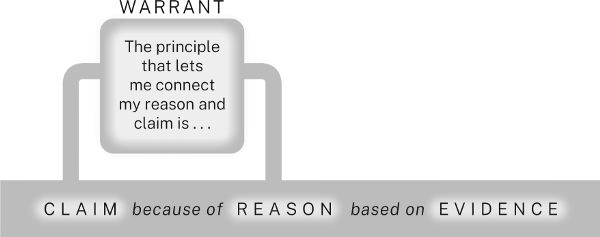

As we’ll see in chapter 8, it’s not easy to de­cide when you even need a war­rant. Ex­per­i­enced re­search­ers usu­ally state them on only two oc­ca­sions: when they think an audi­ence in their field might ask how a reason is rel­ev­ant to a claim or when they are ex­plain­ing their fields’ ways of reas­on­ing to a gen­eral audi­ence.

5.4 Ac­know­ledging and Re­spond­ing to An­ti­cip­ated Ques­tions and Ob­jec­tions

Care­ful audi­ences will ques­tion every part of your ar­gu­ment, so you must an­ti­cip­ate as many of their ques­tions as you can and then ac­know­ledge and re­spond to the most im­port­ant ones. For ex­ample, when an audi­ence con­siders the claim that schools should make lan­guage in­struc­tion a pri­or­ity, they may won­der if do­ing that might de­tract from the teach­ing of other sub­jects. If you think they might ask that ques­tion, you would be wise to ac­know­ledge and re­spond to it:

Ele­ment­ary schools should make teach­ing mul­tiple lan­guages a pri­or­ityclaim 1 be­cause we ac­quire lan­guages best and most eas­ily when we are young.reason 1 sup­port­ing claim 1/claim 2 ... Of course, if schools in­crease the at­ten­tion they give to lan­guages, qual­ity of in­struc­tion in other sub­jects might de­cline.ac­know­ledg­ment But little evid­ence ex­ists to sup­port that fear and much dis­pels it... re­sponse

Ele­ment­ary schools should make teach­ing mul­tiple lan­guages a pri­or­ityclaim 1 be­cause we ac­quire lan­guages best and most eas­ily when we are young.reason 1 sup­port­ing claim 1/claim 2 ... Of course, if schools in­crease the at­ten­tion they give to lan­guages, qual­ity of in­struc­tion in other sub­jects might de­cline.ac­know­ledg­ment But little evid­ence ex­ists to sup­port that fear and much dis­pels it... re­sponse

No re­search ar­gu­ment is com­plete without ac­know­ledg­ments and re­sponses, so we add them to our dia­gram to show how they re­late to all the other parts of an ar­gu­ment:

5.5 Plan­ning Your Re­search Ar­gu­ment

Re­search ar­gu­ments are com­posed of the same five ele­ments as every­day ar­gu­ments: claims, reas­ons, evid­ence, war­rants, and ac­know­ledg­ments of and re­sponses to other views. They are just more com­plex. In ad­di­tion to its main claim, a re­search ar­gu­ment may in­clude a num­ber of sub­or­din­ate claims. And each of these claims is likely to be sup­por­ted by ad­di­tional reas­ons and evid­ence and per­haps jus­ti­fied by one or more war­rants. It will al­most cer­tainly ac­know­ledge and re­spond to an­ti­cip­ated ques­tions, al­tern­at­ives, and ob­jec­tions, with each of these re­sponses de­mand­ing its own ar­gu­ment.

Fi­nally, most re­search ar­gu­ments in­clude back­ground, defin­i­tions, ex­plan­a­tions of is­sues that an audi­ence might not un­der­stand, and so on. If, for ex­ample, you were mak­ing an ar­gu­ment about the re­la­tion­ship between in­fla­tion and money sup­ply to an audi­ence un­fa­mil­iar with eco­nomic the­ory, you would have to ex­plain how eco­nom­ists un­der­stand those con­cepts. Ser­i­ous ar­gu­ments are com­plex con­struc­tions, but you can man­age them if you break them down into sim­pler ones.

To plan your ar­gu­ment, you can make a tra­di­tional out­line or visu­al­ize your ar­gu­ment in other ways. We re­com­mend us­ing a chart-like out­line or visual or­gan­izer known as a story­board. A story­board is like an out­line broken into pieces and spread over sev­eral pages, with lots of space for adding data and ideas as you go. Story­boards are more flex­ible than out­lines. You can cre­ate them us­ing an app or on­line tool or, as we do, with in­dex cards, sticky notes, or sheets of pa­per. To start a story­board, write your main claim and each reason (and sub-reason) at the top of sep­ar­ate cards or pages. Then be­low each reason (or sub-reason), list the evid­ence that sup­ports it. If you don’t have the evid­ence yet, note the kind of evid­ence you’ll need. If you ex­pect that you will have to ex­plain how your reason sup­ports its claim, add a page for its war­rant. You can also add pages for ac­know­ledg­ments of other views and your re­sponses.

You can leave story­board pages un­fin­ished un­til you are ready to fill them, and you can move pages around as you fig­ure out your ar­gu­ment and the or­gan­iz­a­tion of your pa­per. You can spread pages across a wall, group re­lated pages, and put minor sec­tions be­low ma­jor ones so that you can see at a glance the design of your whole ar­gu­ment. Pic­tur­ing your ar­gu­ment in this way can help you identify places where it needs to be de­veloped more fully, and it can let you try out dif­fer­ent ways of or­gan­iz­ing it so that you can choose the best one.

Here is part of a story­board for a re­search pro­ject on teach­ing lan­guages in ele­ment­ary schools. It’s a snap­shot of the re­search­ers’ think­ing at the present mo­ment, and it can and should change as the re­search­ers’ pro­ject pro­gresses and ideas de­velop. The first page states the re­search­ers’ ques­tion and work­ing claim—that is, a pro­vi­sional claim that will guide re­search but prob­ably change as the pro­ject pro­gresses—along with some al­tern­at­ives, in­clud­ing one the re­search­ers have re­jec­ted. The reas­ons fall into two groups, one fo­cused on when lan­guages are best learned and the other on their be­ne­fits. The plan in­cludes an ac­know­ledg­ment and re­sponse, but the page for cul­tural aware­ness is al­most blank, be­cause the re­search­ers have not yet dis­covered the right evid­ence to sup­port that reason (and if fur­ther re­search doesn’t pro­duce it, they may have to aban­don that reason and even change the claim).

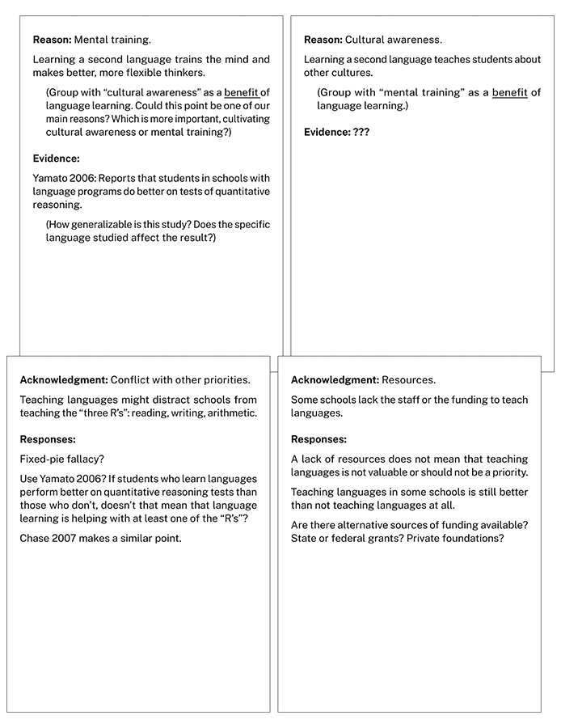

5.6 Cre­at­ing Your Ethos

A fi­nal word: In this chapter, we have in­tro­duced you to the five ele­ments—claims, reas­ons, evid­ence, war­rants, and ac­know­ledg­ments and re­sponses—from which all ar­gu­ments are com­posed. But ar­gu­ments have an im­pli­cit sixth ele­ment as well: what is tra­di­tion­ally called your ethos. Your audi­ence will judge your ar­gu­ments not just as in­tel­lec­tual con­struc­tions but also by the char­ac­ter you pro­ject when you make them. Do you seem to be the sort of per­son who brings the audi­ence along by provid­ing ne­ces­sary back­ground in­form­a­tion, who of­fers suf­fi­cient (neither thin nor ex­cess­ive) sup­port for your claims, who thought­fully con­siders is­sues from all sides? Or do you seem to be someone who sees only one point of view and dis­misses or even ig­nores the views of oth­ers? Like­wise, in your style of writ­ing or your man­ner of present­ing, do you show that you are sens­it­ive to your audi­ence’s needs and re­spect­ful of their time and at­ten­tion, or do you come off as terse, ar­rog­ant, or self-in­dul­gently opaque? (We’ll con­sider these con­cerns in chapters 15 and 16.)

Cog­nit­ive Over­load: Some Re­as­sur­ing Words

At about this point, many stu­dents new to re­search be­gin to feel over­whelmed. If that’s how you are feel­ing, it may help to know that your anxi­et­ies have less to do with your in­tel­li­gence and abil­ity than with in­ex­per­i­ence. One of us was ex­plain­ing to teach­ers of legal writ­ing how be­ing a novice makes many first-year law stu­dents feel like in­com­pet­ent writers. At the end of the talk, one wo­man re­por­ted that she had been a pro­fessor of an­thro­po­logy whose pub­lished work was praised for the clar­ity of its writ­ing. Then she switched ca­reers and went to law school. She said that dur­ing her first six months, she wrote so in­co­her­ently that she feared she was suf­fer­ing from a de­gen­er­at­ive brain dis­ease. Of course, she was not: she was go­ing through the pain­ful trans­ition most of us ex­per­i­ence when we try to write about mat­ters we do not en­tirely un­der­stand for an audi­ence we un­der­stand even less. She was re­lieved to find that the bet­ter she un­der­stood the law, the bet­ter she wrote about it.

If you feel over­whelmed, you can take com­fort in that story, as did one reader who e-mailed us this:

In The Craft of Re­search you write about a wo­man who switched from an­thro­po­logy to law and sud­denly found her­self un­able to write clearly. After be­ing an as­sist­ant pro­fessor of graphic design for five years, I re­cently switched to an­thro­po­logy and sud­denly found that writ­ing an­thro­po­logy pa­pers is like pulling teeth. I thought to my­self that I might have a de­gen­er­at­ive brain dis­order! I laughed out loud when I read about the an­thro­po­lo­gist who switched to law. It made me feel a bit bet­ter.

In The Craft of Re­search you write about a wo­man who switched from an­thro­po­logy to law and sud­denly found her­self un­able to write clearly. After be­ing an as­sist­ant pro­fessor of graphic design for five years, I re­cently switched to an­thro­po­logy and sud­denly found that writ­ing an­thro­po­logy pa­pers is like pulling teeth. I thought to my­self that I might have a de­gen­er­at­ive brain dis­order! I laughed out loud when I read about the an­thro­po­lo­gist who switched to law. It made me feel a bit bet­ter.

When you com­mu­nic­ate clearly and re­spect­fully and an­ti­cip­ate and ad­dress your audi­ence’s ques­tions and con­cerns (this is an­other reason ac­know­ledg­ments and re­sponses are so im­port­ant), you earn their con­fid­ence and give them good reason to work with you in de­vel­op­ing and test­ing new ideas. In the long run, the ethos you pro­ject in in­di­vidual ar­gu­ments hardens into your repu­ta­tion—some­thing every re­searcher must care about—be­cause your repu­ta­tion is the ta­cit sixth ele­ment in every ar­gu­ment you make. It an­swers the un­spoken ques­tion Can I trust you? That an­swer must be Yes.

▶ Quick Tip: A Com­mon Mis­take—Fall­ing Back on What You Know

If you are an in­ex­per­i­enced re­searcher, you may be temp­ted to rely too heav­ily on what feels fa­mil­iar. You might em­brace a claim too early, per­haps even be­fore you have done much re­search, be­cause you “know” you can prove it. But fall­ing back on that kind of cer­tainty will just keep you from do­ing your best think­ing. Be­ing a re­searcher means al­low­ing your­self to be sur­prised by your dis­cov­er­ies and in­sights. So when you start a pro­ject, be­gin not with a claim you know you can prove but with a prob­lem you want to ex­plore and solve.

Like­wise, when you are new to a field, you may be temp­ted to rely on ways of ar­guing that are fa­mil­iar to you from your edu­ca­tion or ex­per­i­ence. If, in a lit­er­at­ure class, you learned to sup­port your claims by present­ing and ana­lyz­ing quo­ta­tions, do not as­sume that you can do the same in fields that em­phas­ize “ob­ject­ive data,” such as bio­logy or ex­per­i­mental psy­cho­logy. On the other hand, if as a bio­logy or psy­cho­logy ma­jor you learned to sup­port your claims by gath­er­ing hard data and per­form­ing stat­ist­ical ana­lyses, do not as­sume that you can do the same in art his­tory. This does not mean that what you learn in one class is use­less in an­other. Ar­gu­ments in all fields rely on the ele­ments we de­scribe here. But you have to learn what’s dis­tinct­ive in the way a field handles those ele­ments and be flex­ible enough to ad­apt, trust­ing the skills you’ve learned.

And as you be­come more fa­mil­iar with your field, you may be temp­ted to over­sim­plify in a dif­fer­ent way. When some be­gin­ning re­search­ers suc­ceed at mak­ing one kind of ar­gu­ment, they just keep mak­ing it over and over. Their mas­tery of one kind of com­plex­ity keeps them from re­cog­niz­ing an­other: they fail to see that their field, if it is an act­ive one, is marked by com­pet­ing meth­od­o­lo­gies, com­pet­ing solu­tions, com­pet­ing goals and ob­ject­ives. Don’t fall into this trap. If you can make one type of ar­gu­ment, try oth­ers: seek out al­tern­at­ive meth­ods, for­mu­late not only mul­tiple solu­tions but mul­tiple ways of sup­port­ing them, ask whether oth­ers would ap­proach your prob­lem dif­fer­ently.

---

## ▶ Quick Tip: Make Your Claim Contestable

6 Mak­ing Claims

In this chapter, we dis­cuss how to re­cog­nize the kind of claim that an­swers your re­search ques­tion and how to tell if a claim is spe­cific and sig­ni­fic­ant enough to serve as the main claim of your ar­gu­ment.

You need a pro­vi­sional an­swer to your re­search ques­tion—that is, a pro­vi­sional claim—to fo­cus your search for data or in­form­a­tion to use as evid­ence in your re­search ar­gu­ment. As you re­fine that claim, you must also be sure it is spe­cific enough to be ar­gu­able and sig­ni­fic­ant enough to need ar­guing for. Ask your­self three ques­tions:

* 1\. What kind of claim should I make?
* 2\. Is it spe­cific enough to sug­gest an ar­gu­ment for it?
* 3\. Will my audi­ence think it is sig­ni­fic­ant enough to need an ar­gu­ment sup­port­ing it?

When you can an­swer those three ques­tions, you’re ready to as­semble your ar­gu­ment.

6.1 De­term­in­ing the Kind of Claim You Should Make

The kind of prob­lem you pose de­term­ines the kind of claim you make and the kind of ar­gu­ment you need to sup­port it. As we saw in chapter 2, aca­demic re­search­ers usu­ally pose not prac­tical prob­lems but con­cep­tual ones, the kind whose solu­tion asks someone not to act but to un­der­stand.

We can make a sim­ilar dis­tinc­tion when it comes to claims by no­ti­cing that they can ad­dress a range of ques­tions: Does a thing or a situ­ation ex­ist? If so, how should we char­ac­ter­ize it? How did it get this way? Is it good or bad? What can or should be done about it? An­swers to the first four of these ques­tions are con­cep­tual claims. An­swers to the fifth are prac­tical claims. The claims you can make will fall into one (or more) of the fol­low­ing classes:

CON­CEP­TUAL CLAIMS

* ▪ Claims of fact or ex­ist­ence: 

>   1. To­gether, China and In­dia grow more than half of the world’s pea­nuts.
>   2. ▪ Claims of defin­i­tion and clas­si­fic­a­tion:
>   3. A pea­nut sheller is a spe­cial­ized ma­chine used to shell pea­nuts after they are roas­ted.
>   4. Pea­nuts are legumes, not nuts.
>   5. ▪ Claims of cause and con­sequence:
>   6. Just touch­ing a pea­nut can pro­voke severe re­ac­tions in those who are highly al­ler­gic to them.
>   7. ▪ Claims of eval­u­ation or ap­praisal:
>   8. Pea­nuts are ab­so­lutely de­li­cious.
> 

* PRAC­TICAL CLAIMS
* ▪ Claims of ac­tion or policy: 

>   1. The fed­eral gov­ern­ment should lower trade bar­ri­ers to in­crease pea­nut ex­ports.
>

To­gether, China and In­dia grow more than half of the world’s pea­nuts. ▪ Claims of defin­i­tion and clas­si­fic­a­tion: A pea­nut sheller is a spe­cial­ized ma­chine used to shell pea­nuts after they are roas­ted. Pea­nuts are legumes, not nuts. ▪ Claims of cause and con­sequence: Just touch­ing a pea­nut can pro­voke severe re­ac­tions in those who are highly al­ler­gic to them. ▪ Claims of eval­u­ation or ap­praisal: Pea­nuts are ab­so­lutely de­li­cious.

The fed­eral gov­ern­ment should lower trade bar­ri­ers to in­crease pea­nut ex­ports.

For claims of fact or ex­ist­ence, you must provide evid­ence that a situ­ation is, in fact, as you char­ac­ter­ize it. Claims of defin­i­tion or clas­si­fic­a­tion de­pend on reas­on­ing about sim­il­ar­it­ies or dif­fer­ences that as­signs an en­tity to some broader class or dis­tin­guishes it from other en­tit­ies. Claims of cause or con­sequence con­nect sets of facts to show that some situ­ation does (or doesn’t) fol­low from or lead to an­other. Claims of eval­u­ation or ap­praisal de­pend on cri­teria of judg­ment to jus­tify why some­thing is good or bad (or bet­ter or worse than some­thing else). These are all con­cep­tual claims.

The fifth type, a claim of ac­tion or policy, is a prac­tical claim and usu­ally rests on prior con­cep­tual claims: one that defines the prob­lem or demon­strates that a prob­lem ex­ists, an­other that iden­ti­fies its causes, and still an­other that ex­plains how do­ing what you pro­pose will fix it. When ar­guing for a prac­tical claim, you may need to ex­plain the fol­low­ing:

* ▪ Why your solu­tion is feas­ible; how it can be im­ple­men­ted with reas­on­able time and ef­fort.
* ▪ Why it will cost less to im­ple­ment than the cost of the prob­lem.
* ▪ Why it will not cre­ate a big­ger prob­lem than the one it solves.
* ▪ Why it is bet­ter than al­tern­at­ive solu­tions.

If your audi­ence ex­pects these sub-ar­gu­ments and you don’t make them, your audi­ence may re­ject your whole ar­gu­ment. Fi­nally, don’t in­flate the im­port­ance of a con­cep­tual claim by tack­ing on a prac­tical ac­tion, at least not early on. If you want to sug­gest a prac­tical ap­plic­a­tion of your con­cep­tual claim, do so at the end of your ar­gu­ment, in the con­clu­sion to your pa­per or present­a­tion. There, you can of­fer it as an ac­tion worth con­sid­er­ing without hav­ing to de­velop a case for it (we re­turn to this point in chapter 14).

6.2 Eval­u­at­ing Your Claim

We can’t tell you how to find a good claim, but we can show you what good claims look like and how to eval­u­ate the one you have. Above all, your claim should be both spe­cific and sig­ni­fic­ant.

6.2.1 Make Your Claim Spe­cific

Vague claims lead to vague ar­gu­ments. The more spe­cific your claim, the more it helps you plan your ar­gu­ment. Com­pare these two claims:

Re­mote work is det­ri­mental to so­ci­ety. Re­mote work threatens the so­cial fab­ric of urban cen­ters by re­du­cing rider­ship on pub­lic trans­port­a­tion and erod­ing the nat­ural cus­tomer base for down­town re­tail­ers and res­taur­ants.

Re­mote work is det­ri­mental to so­ci­ety.

Re­mote work threatens the so­cial fab­ric of urban cen­ters by re­du­cing rider­ship on pub­lic trans­port­a­tion and erod­ing the nat­ural cus­tomer base for down­town re­tail­ers and res­taur­ants.

The first is so vague that we have little idea about what’s to come. The second in­cludes a set of spe­cific con­cepts that give the re­searcher ideas or themes to de­velop in the ar­gu­ment that fol­lows. The claim’s spe­cificity sig­nals how the ar­gu­ment is likely to pro­ceed.

6.2.2 Make Your Claim Sig­ni­fic­ant

After the spe­cificity of a claim, an audi­ence looks most closely at its sig­ni­fic­ance, a qual­ity they meas­ure by how much it asks them to change what they think. While we can’t quantify sig­ni­fic­ance, we can roughly es­tim­ate it: If an audi­ence ac­cepts a claim, how many be­liefs must they change? And how found­a­tional are those be­liefs? The most sig­ni­fic­ant claims ask an audi­ence to change their most strongly held be­liefs (and they will res­ist such claims ac­cord­ingly).

Re­search com­munit­ies some­times con­sider a claim sig­ni­fic­ant if it simply of­fers new in­form­a­tion on a topic of in­terest:

I de­scribe here six thir­teenth-cen­tury Latin gram­mars of the Welsh lan­guage. Found just re­cently, these gram­mars are the only ex­amples of their kind. They help us bet­ter ap­pre­ci­ate the range of gram­mars writ­ten in the me­di­eval period.

I de­scribe here six thir­teenth-cen­tury Latin gram­mars of the Welsh lan­guage. Found just re­cently, these gram­mars are the only ex­amples of their kind. They help us bet­ter ap­pre­ci­ate the range of gram­mars writ­ten in the me­di­eval period.

(Re­call the mem­bers of that Waffle Lov­ers So­ci­ety from the in­tro­duc­tion [I.4.1], who just wanted to be en­ter­tained by some in­ter­est­ing facts.)

But re­search com­munit­ies value claims more highly when they not only of­fer new in­form­a­tion but use that in­form­a­tion to settle what seems puzz­ling, in­con­sist­ent, or oth­er­wise prob­lem­atic:

There has been a long de­bate about how fluc­tu­ations in con­sumer con­fid­ence af­fect the stock mar­ket, but new stat­ist­ical tools sug­gest little re­la­tion­ship between ...

There has been a long de­bate about how fluc­tu­ations in con­sumer con­fid­ence af­fect the stock mar­ket, but new stat­ist­ical tools sug­gest little re­la­tion­ship between ...

And they value claims most highly when they up­set what seems long settled:

It has long been an art­icle of faith in mod­ern phys­ics that the speed of light is con­stant every­where at all times, un­der all con­di­tions, but new data sug­gest it might not be.

It has long been an art­icle of faith in mod­ern phys­ics that the speed of light is con­stant every­where at all times, un­der all con­di­tions, but new data sug­gest it might not be.

A claim like that would be con­tested by le­gions of phys­i­cists be­cause if true, it would mean that phys­i­cists would have to change their minds not just about the speed of light but about lots of other things as well.

One simple way to sig­nal the sig­ni­fic­ance of your claim is to ac­know­ledge the cur­rent un­der­stand­ing it chal­lenges (see chapter 9). That second claim about re­mote work is spe­cific enough, but it might still seem one-sided. So “thicken” it by in­tro­du­cing it with a qual­i­fy­ing clause be­gin­ning with a word or phrase like al­though, while, or even though:

Al­though re­mote work of­fers many be­ne­fits to com­pan­ies and em­ploy­ees, it also threatens the so­cial fab­ric of urban cen­ters by re­du­cing rider­ship on pub­lic trans­port­a­tion and erod­ing the nat­ural cus­tomer base for down­town re­tail­ers and res­taur­ants.

Al­though re­mote work of­fers many be­ne­fits to com­pan­ies and em­ploy­ees, it also threatens the so­cial fab­ric of urban cen­ters by re­du­cing rider­ship on pub­lic trans­port­a­tion and erod­ing the nat­ural cus­tomer base for down­town re­tail­ers and res­taur­ants.

You can use an in­tro­duct­ory clause be­gin­ning with al­though or a sim­ilar word to ac­know­ledge three kinds of al­tern­at­ive views:

* ▪ Some­thing that your audi­ence be­lieves but your claim chal­lenges: 

>   1. Al­though many as­sume that re­mote work has few if any neg­at­ive con­sequences . . .
>   2. ▪ A point of view that con­flicts with yours:
>   3. Al­though some older re­search sug­gests that re­mote work does not sig­ni­fic­antly re­duce con­sumer spend­ing in cit­ies . . .
>   4. ▪ A con­di­tion that lim­its the scope or con­fid­ence of your claim:
>   5. Al­though it is dif­fi­cult to gauge the long-term ef­fects of re­mote work on cit­ies be­cause it is so new . . .
>

Al­though many as­sume that re­mote work has few if any neg­at­ive con­sequences ... ▪ A point of view that con­flicts with yours: Al­though some older re­search sug­gests that re­mote work does not sig­ni­fic­antly re­duce con­sumer spend­ing in cit­ies ... ▪ A con­di­tion that lim­its the scope or con­fid­ence of your claim: Al­though it is dif­fi­cult to gauge the long-term ef­fects of re­mote work on cit­ies be­cause it is so new ...

If your audi­ence might think of those qual­i­fic­a­tions, ac­know­ledge them first. You not only im­ply that you un­der­stand their views, but you com­mit your­self to re­spond­ing to them in the course of your ar­gu­ment.

If you are an ad­vanced re­searcher, you meas­ure the sig­ni­fic­ance of your claim by how much it changes what your com­munity thinks and how it does its re­search. Few sci­entific ac­com­plish­ments have been as sig­ni­fic­ant as the model of the double-helix struc­ture of DNA tra­di­tion­ally cred­ited to James Wat­son and Fran­cis Crick. Not only did it make sci­ent­ists think about ge­net­ics dif­fer­ently, but it cre­ated new re­search ques­tions and op­por­tun­it­ies in dis­cip­lines from bio­logy to math­em­at­ics to his­tory. Wat­son and Crick knew what they were look­ing for. To ar­rive at their model, they built on and in­teg­rated re­search find­ings by many other sci­ent­ists go­ing back dec­ades, in­clud­ing cru­cial em­pir­ical data be­long­ing to Maurice Wilkins and Ros­alind Frank­lin (see 17.2 for more about the eth­ics of this situ­ation).

But sig­ni­fic­ant dis­cov­er­ies also come by sur­prise. One of our col­leagues, the an­thro­po­lo­gist Fal­lou Ngom, found among his de­ceased father’s pa­pers a piece of writ­ing in an Ar­abic-like script that read like the West African lan­guage Wo­lof. Ngom was puzzled: al­though he had been raised in Senegal, he was un­aware that such a writ­ing sys­tem ex­is­ted; in fact, he had thought that his father couldn’t write at all. Curi­ous, he began look­ing for other ex­amples of such writ­ing and found it every­where. What he dis­covered (from the per­spect­ive of West­ern schol­ar­ship) was ‘Ajamī, a writ­ing sys­tem ad­ap­ted from Ar­abic used to write a host of West African lan­guages. Ngom’s dis­cov­ery upen­ded the long-es­tab­lished Euro­centric be­lief that many West African so­ci­et­ies were il­lit­er­ate when in fact they have rich writ­ten cul­tures go­ing back cen­tur­ies. And in so do­ing, it opened up new ho­ri­zons for re­search.

These stor­ies show the com­plex re­la­tion­ship between dis­cov­ery and ex­pert­ise: Wat­son and Crick drew on the work of their re­search com­munity to solve one of its most im­port­ant prob­lems; Ngom’s ex­pert­ise in the West­ern dis­cip­lines of his­tory and an­thro­po­logy (he re­ceived his train­ing as a re­searcher at French and Amer­ican uni­ver­sit­ies) al­lowed him to see the im­port­ance for those dis­cip­lines of that note in his father’s pa­pers.

You don’t have to of­fer a sweep­ing claim to make a use­ful con­tri­bu­tion to a re­search com­munity. Even small find­ings can be sig­ni­fic­ant if they chal­lenge cur­rent know­ledge or raise new ques­tions (see chapter 1). If, for ex­ample, you dis­covered that Mar­tin Luther King Jr. wrote a high school pa­per on some philo­sopher, his­tor­i­ans would comb King’s later writ­ings for traces of that in­flu­ence.

Of course, if you are a stu­dent or a new re­searcher in a field, you may not be able to make claims that chal­lenge the ex­perts (or to re­cog­nize such claims when you find them). But you can still ex­per­i­ence what it means to make ar­gu­ments for a re­search com­munity by con­sid­er­ing your claims in the con­text of your own know­ledge and think­ing, and that of your class or peers. Ima­gine an audi­ence made up of people like your­self. What did you think be­fore you began your re­search? How much has your claim changed what you now think? What do you un­der­stand now that you didn’t be­fore? That’s the best way to pre­pare to an­swer the most im­port­ant ques­tion any re­searcher can face: not Why should I be­lieve this? but Why should I care? (See I.4.3, 2.5, and 9.1.)

6.3 Qual­i­fy­ing Claims to En­hance Your Cred­ib­il­ity

Some new re­search­ers think their claims are most cred­ible when they are stated most force­fully. But noth­ing dam­ages your ethos more than ar­rog­ant cer­tainty. As para­dox­ical as it seems, you make your ar­gu­ment stronger and more cred­ible by mod­estly ac­know­ledging its lim­its. You gain the trust of your audi­ence when you ac­know­ledge and re­spond to their views, show­ing that you have not only un­der­stood but con­sidered their po­s­i­tions (see chapter 9). But you can lose that trust if you then make claims that over­reach. Limit your claims to what your ar­gu­ment can ac­tu­ally sup­port by qual­i­fy­ing their scope and cer­tainty.

6.3.1 Ac­know­ledge Lim­it­ing Con­di­tions

Every claim has lim­it­ing con­di­tions:

We ex­pect the blue crab pop­u­la­tion in the Ches­apeake Bay to con­tinue ex­pand­ing, as­sum­ing today’s con­ser­va­tion meas­ures re­main in place. Based on avail­able eco­nomic data, a global re­ces­sion ap­pears un­likely. Ac­cord­ing to cur­rent cli­mate mod­els, the earth could warm to two de­grees Celsius over pre-in­dus­trial levels as soon as the mid-2030s.

We ex­pect the blue crab pop­u­la­tion in the Ches­apeake Bay to con­tinue ex­pand­ing, as­sum­ing today’s con­ser­va­tion meas­ures re­main in place.

Based on avail­able eco­nomic data, a global re­ces­sion ap­pears un­likely.

Ac­cord­ing to cur­rent cli­mate mod­els, the earth could warm to two de­grees Celsius over pre-in­dus­trial levels as soon as the mid-2030s.

So men­tion only those that your audi­ence might plaus­ibly think of. Sci­ent­ists rarely ac­know­ledge that their claims de­pend on the ac­cur­acy of their in­stru­ments be­cause that lim­it­a­tion ap­plies to every sci­entific meas­ure­ment. But eco­nom­ists of­ten ac­know­ledge lim­its on their claims be­cause their pre­dic­tions are sub­ject to chan­ging con­di­tions and be­cause they want to sig­nal what con­di­tions to watch for. In this next ex­ample, the writer’s men­tion of lim­it­ing con­di­tions al­lows for a fuller and more ac­cur­ate state­ment of the claim:

Today Frank­lin D. Roosevelt is widely revered, but to­ward the end of his second term, he was quite un­pop­u­lar, at least among cer­tain seg­ments of Amer­ican so­ci­ety.claim News­pa­pers, for ex­ample, at­tacked him for pro­mot­ing so­cial­ism, a sign that a mod­ern ad­min­is­tra­tion is in trouble. In 1938, 70 per­cent of Mid­w­est news­pa­pers ac­cused him of want­ing the gov­ern­ment to man­age the bank­ing sys­tem... Some have ar­gued oth­er­wise, in­clud­ing Nich­olson (1983, 1992) and Wig­gins (1973), both of whom of­fer an­ec­dotal re­ports that Roosevelt was al­ways in high re­gard,ac­know­ledg­ment but these re­ports are sup­por­ted only by the memor­ies of those who had an in­terest in dei­fy­ing FDR.re­sponse Un­less it can be shown that the news­pa­pers crit­ical of Roosevelt were con­trolled by spe­cial in­terests,lim­it­a­tion on claim their at­tacks demon­strate sig­ni­fic­ant pop­u­lar dis­sat­is­fac­tion with Roosevelt’s pres­id­ency.re­state­ment of claim

Today Frank­lin D. Roosevelt is widely revered, but to­ward the end of his second term, he was quite un­pop­u­lar, at least among cer­tain seg­ments of Amer­ican so­ci­ety.claim News­pa­pers, for ex­ample, at­tacked him for pro­mot­ing so­cial­ism, a sign that a mod­ern ad­min­is­tra­tion is in trouble. In 1938, 70 per­cent of Mid­w­est news­pa­pers ac­cused him of want­ing the gov­ern­ment to man­age the bank­ing sys­tem... Some have ar­gued oth­er­wise, in­clud­ing Nich­olson (1983, 1992) and Wig­gins (1973), both of whom of­fer an­ec­dotal re­ports that Roosevelt was al­ways in high re­gard,ac­know­ledg­ment but these re­ports are sup­por­ted only by the memor­ies of those who had an in­terest in dei­fy­ing FDR.re­sponse Un­less it can be shown that the news­pa­pers crit­ical of Roosevelt were con­trolled by spe­cial in­terests,lim­it­a­tion on claim their at­tacks demon­strate sig­ni­fic­ant pop­u­lar dis­sat­is­fac­tion with Roosevelt’s pres­id­ency.re­state­ment of claim

6.3.2 Use Hedges to Limit Cer­tainty

Only rarely can we state our claims with ab­so­lute cer­tainty. Care­ful writers qual­ify their cer­tainty with words and phrases called hedges.

Wat­son and Crick un­der­stood the tre­mend­ous sig­ni­fic­ance of their model of DNA, but when they an­nounced it, they still hedged their claims (hedges are bold­faced; the in­tro­duc­tion is con­densed):

We wish to sug­gest a [note: not state the] struc­ture for the salt of deoxyribose nuc­leic acid (D.N.A.)... A struc­ture for nuc­leic acid has already been pro­posed by Paul­ing and Corey... In our opin­ion, this struc­ture is un­sat­is­fact­ory for two reas­ons: (1) We be­lieve that the ma­ter­ial which gives the X-ray dia­grams is the salt, not the free acid... (2) Some of the van der Waals dis­tances ap­pear to be too small. (J. D. Wat­son and F. H. C. Crick, “Mo­lecu­lar Struc­ture of Nuc­leic Acids”)

We wish to sug­gest a [note: not state the] struc­ture for the salt of deoxyribose nuc­leic acid (D.N.A.)... A struc­ture for nuc­leic acid has already been pro­posed by Paul­ing and Corey... In our opin­ion, this struc­ture is un­sat­is­fact­ory for two reas­ons: (1) We be­lieve that the ma­ter­ial which gives the X-ray dia­grams is the salt, not the free acid... (2) Some of the van der Waals dis­tances ap­pear to be too small. (J. D. Wat­son and F. H. C. Crick, “Mo­lecu­lar Struc­ture of Nuc­leic Acids”)

Without the hedges, these sen­tences would be more con­cise but also more ag­gress­ive. Com­pare that cau­tious pas­sage with this more force­ful ver­sion (much of the ag­gress­ive tone comes from the lack of qual­i­fic­a­tion):

We an­nounce here the struc­ture for the salt of deoxyribose nuc­leic acid (D.N.A.)... A struc­ture for nuc­leic acid has already been pro­posed by Paul­ing and Corey... Their struc­ture is un­sat­is­fact­ory for two reas­ons: (1) The ma­ter­ial which gives their X-ray dia­grams is the salt, not the free acid... (2) Their van der Waals dis­tances are too small.

We an­nounce here the struc­ture for the salt of deoxyribose nuc­leic acid (D.N.A.)... A struc­ture for nuc­leic acid has already been pro­posed by Paul­ing and Corey... Their struc­ture is un­sat­is­fact­ory for two reas­ons: (1) The ma­ter­ial which gives their X-ray dia­grams is the salt, not the free acid... (2) Their van der Waals dis­tances are too small.

In most fields, audi­ences dis­trust pat cer­tainty ex­pressed in words like all, no one, every, al­ways, never, and so on, but if you hedge too much, you will seem timid. Dif­fer­ent re­search com­munit­ies use hedges to dif­fer­ent de­grees, and find­ing the right bal­ance is a mat­ter of ex­per­i­ence. So no­tice how ex­perts in your field hedge their ar­gu­ments and do like­wise.

▶ Quick Tip: Make Your Claim Con­test­able

You can gauge the po­ten­tial sig­ni­fic­ance of your claim by ask­ing whether any­one would bother to con­test it. If not, then your claim may not be worth ar­guing. Here are three claims, which are weak for dif­fer­ent reas­ons:

This re­port sum­mar­izes re­cent re­search on the dis­ap­pear­ance of bees. Barack Obama was the first Black pres­id­ent of the United States. Ham­let is not an im­port­ant char­ac­ter in Shakespeare’s Ham­let.

This re­port sum­mar­izes re­cent re­search on the dis­ap­pear­ance of bees.

Barack Obama was the first Black pres­id­ent of the United States.

Ham­let is not an im­port­ant char­ac­ter in Shakespeare’s Ham­let.

To as­sess whether these claims are worth con­test­ing, con­sider their op­pos­ites:

This re­port does not sum­mar­ize re­cent re­search on the dis­ap­pear­ance of bees. Barack Obama was not the first Black pres­id­ent of the United States. Ham­let is an im­port­ant char­ac­ter in Shakespeare’s Ham­let.

This re­port does not sum­mar­ize re­cent re­search on the dis­ap­pear­ance of bees.

Barack Obama was not the first Black pres­id­ent of the United States.

Ham­let is an im­port­ant char­ac­ter in Shakespeare’s Ham­let.

That first claim is merely an as­ser­tion of the re­port’s topic. Its op­pos­ite is just non­sensical. (To be pre­cise, it is a claim of fact, but the fact is about the re­port, not about the bees.) The second (also a claim of fact) is eas­ily veri­fi­able. Its op­pos­ite is demon­strably false. The third (a claim of eval­u­ation) may seem strong, but its op­pos­ite is so ob­vi­ous that it goes without say­ing. Shakespeare pre­sum­ably titled his play The Tragedy of Ham­let, Prince of Den­mark for a reason. So none of these claims are worth ar­guing—prob­ably.

The test isn’t fool­proof, and some great thinkers have suc­cess­fully con­tra­dicted ap­par­ently self-evid­ent claims, as Co­per­ni­cus did when he as­ser­ted fool­ishly—or so it seemed at the time—that the sun does not go around the earth.

---

## ▶ Quick Tip: Assess Your Evidence as You Gather It

7 As­sem­bling Reas­ons and Evid­ence

In this chapter, we dis­cuss two kinds of sup­port for a claim: reas­ons and evid­ence. We show you how to dis­tin­guish between the two, how to use reas­ons to or­gan­ize your ar­gu­ment, and how to eval­u­ate the qual­ity of your evid­ence.

Audi­ences look first for the core of an ar­gu­ment: a claim and its sup­port. They look par­tic­u­larly at its set of reas­ons to judge its plaus­ib­il­ity and their or­der to judge its lo­gic. If they think those reas­ons make sense, they will look at the evid­ence you present to back them up. If they don’t be­lieve the evid­ence, they’ll re­ject the reas­ons and, with them, your claim.

So as you as­semble your ar­gu­ment, you must of­fer a plaus­ible set of reas­ons in a clear, lo­gical or­der, based on evid­ence your audi­ence will ac­cept. This chapter shows you how to do that.

7.1 Us­ing Reas­ons to Plan Your Ar­gu­ment

When you or­der your reas­ons, you build a lo­gical struc­ture for your ar­gu­ment. Earlier, we re­com­men­ded that you plan your ar­gu­ment us­ing a story­board (see 5.5). If you do, you can use it to test your ar­gu­ment’s lo­gic or flow. Look­ing at the cards or pages in your story­board, read the reas­ons, not the de­tails, to see if their or­der makes sense. If it doesn’t, try dif­fer­ent ar­range­ments un­til it does. At this point, you are plan­ning and de­vel­op­ing only your ar­gu­ment, not your pa­per, re­port, or present­a­tion. When you turn from your ar­gu­ment it­self to fig­ur­ing out how best to com­mu­nic­ate it to oth­ers, you may need to make fur­ther ad­just­ments. We’ll say more about draft­ing and de­liv­er­ing ar­gu­ments in part IV.

7.2 Dis­tin­guish­ing Evid­ence from Reas­ons

Once you’ve ar­ranged your reas­ons in a plaus­ible or­der, be sure you have suf­fi­cient evid­ence to sup­port each one. Your evid­ence is the in­form­a­tion you use to back up your reas­ons. The prob­lem is you don’t get to de­cide whether your evid­ence is suf­fi­cient; your audi­ence does. To count as evid­ence, a state­ment must re­port some­thing they can be ex­pec­ted not to ques­tion, at least for the pur­poses of the ar­gu­ment. But if they do ques­tion it, what you think is hard evid­ence be­comes for them only an­other reason. Con­sider this ar­gu­ment:

Amer­ican higher edu­ca­tion must curb es­cal­at­ing tu­ition costsclaim be­cause the price of col­lege is be­com­ing an im­ped­i­ment to lower-in­come stu­dents en­ter­ing the pro­fes­sional middle class.reason Today many stu­dents leave col­lege with a crush­ing debt bur­den.evid­ence

Amer­ican higher edu­ca­tion must curb es­cal­at­ing tu­ition costsclaim be­cause the price of col­lege is be­com­ing an im­ped­i­ment to lower-in­come stu­dents en­ter­ing the pro­fes­sional middle class.reason Today many stu­dents leave col­lege with a crush­ing debt bur­den.evid­ence

That last sen­tence of­fers as evid­ence a state­ment its writers take to be a hard “fact.” But we could still ques­tion it: That’s just a gen­er­al­iz­a­tion. What hard num­bers do you have to back up “many stu­dents” or “crush­ing debt bur­den”? When we do, we treat that state­ment not as evid­ence but as a sec­ond­ary reason that must rest on evid­ence of its own. To sat­isfy us, the writers would have to add some­thing like this:

In 2020–21, 43 per­cent of stu­dents at pub­lic four-year col­leges and over 75 per­cent of stu­dents at private four-year in­sti­tu­tions held fed­eral stu­dent loans, and the av­er­age debt of bor­row­ers at gradu­ation was over $30,000.evid­ence

In 2020–21, 43 per­cent of stu­dents at pub­lic four-year col­leges and over 75 per­cent of stu­dents at private four-year in­sti­tu­tions held fed­eral stu­dent loans, and the av­er­age debt of bor­row­ers at gradu­ation was over $30,000.evid­ence

If we were really skep­tical, we could again ask, What backs up those num­bers? What jus­ti­fies the claim that this situ­ation is a crisis? If so, the writers would have to provide still harder data, break­ing down those num­bers to doc­u­ment the con­sequences of debt for re­cent gradu­ates. If they have it, they could show the raw data. If they drew those facts from a sec­ond­ary source, they could cite the source. But even then, those facts could be ques­tioned: How did you col­lect your data? Why should we be­lieve your source is re­li­able? Such ques­tions can, in prin­ciple, be asked forever, but at some point, we ex­pect reas­on­able audi­ences to stop—or none of us would be able to make any ar­gu­ments at all. Your re­spons­ib­il­ity is to of­fer evid­ence up to that point.

Our Found­a­tional Meta­phors for Evid­ence

When we talk about evid­ence, we typ­ic­ally use found­a­tional meta­phors: good evid­ence is solid or hard, the bed­rock found­a­tion on which we build ar­gu­ments. Bad evid­ence is flimsy, weak, or thin. Lan­guage like that en­cour­ages read­ers to think of evid­ence as a real­ity in­de­pend­ent of any­one’s in­ter­pret­a­tion and judg­ment of it. But data are al­ways con­struc­ted and shaped by those who col­lect and use them as evid­ence. As you build your ar­gu­ment, keep in mind that your evid­ence will count as evid­ence only if your audi­ence is will­ing to ac­cept it, at least for the mo­ment.

7.3 De­term­in­ing the Kind of Evid­ence You Need

The kind of claim you make will de­term­ine the kind of reason you need to sup­port it and the kind of evid­ence you need to present to back up that reason. Re­search­ers in dif­fer­ent fields tend to rely on char­ac­ter­istic sorts of evid­ence—eco­nom­ists and chem­ists might prefer em­pir­ical data and stat­ist­ical mod­els; an­thro­po­lo­gists and so­ci­olo­gists might rely on in­ter­views and eth­no­graph­ies; lit­er­ary schol­ars and his­tor­i­ans might want quo­ta­tions from tex­tual or oral sources—and learn­ing how to do re­search in a field means not just un­der­stand­ing its prob­lems and ques­tions but also learn­ing how to find or pro­duce the kinds of evid­ence its ar­gu­ments re­quire. But no field “owns” a par­tic­u­lar sort of evid­ence or re­lies solely on any single kind, es­pe­cially today, when in­ter­dis­cip­lin­ary re­search is so prized.

So as you plan your ar­gu­ment, con­sider both the sorts of evid­ence your audi­ence will value and the kind of evid­ence you need to sup­port any par­tic­u­lar reason. Here are two claims that sound sim­ilar but need dif­fer­ent kinds of reas­ons and evid­ence:

In Nat­ive Speaker, Chang-rae Lee power­fully rep­res­ents the double con­scious­ness ex­per­i­enced by the chil­dren of first-gen­er­a­tion im­mig­rants. In Nat­ive Speaker, Change-rae Lee ac­cur­ately cap­tures the ra­cial­ized polit­ics of late twen­ti­eth-cen­tury New York City.

In Nat­ive Speaker, Chang-rae Lee power­fully rep­res­ents the double con­scious­ness ex­per­i­enced by the chil­dren of first-gen­er­a­tion im­mig­rants.

In Nat­ive Speaker, Change-rae Lee ac­cur­ately cap­tures the ra­cial­ized polit­ics of late twen­ti­eth-cen­tury New York City.

For the first, you would need quo­ta­tions from the novel; for the second, you would need quo­ta­tions coupled with his­tor­ical evid­ence. The kind of evid­ence you need will in­flu­ence the kind of re­search you do.

7.4 Dis­tin­guish­ing Evid­ence from Re­ports of It

Now a com­plic­a­tion: Re­search­ers rarely in­clude in any pa­per or present­a­tion the evid­ence it­self. Even if you col­lect your own data, count­ing rab­bits in a field or in­ter­view­ing voters ex­it­ing from a polling sta­tion, you can only refer to or rep­res­ent those rab­bits and voters in words, num­bers, tables, graphs, pic­tures, and so on. For ex­ample, when a pro­sec­utor says in court, Jones is guilty of coun­ter­feit­ing goods, and here is the evid­ence to prove it, that pro­sec­utor can hold up a fake Gucci hand­bag re­covered from Jones’s gar­age and even let jur­ors hold it in their own hands. (Of course, both the pro­sec­utor and the jur­ors must be­lieve the of­ficer who test­i­fies to find­ing it there in the first place.) But when the pro­sec­utor writes a brief on the case, the hand­bag can’t be stapled to the page; it can only be re­ferred to or de­scribed.

In the same way, re­search­ers can­not share with their audi­ences “the evid­ence it­self.” For ex­ample:

Emo­tions play a lar­ger role in ra­tion­al­ity than many think.claim In fact, without the emo­tional cen­ters of the brain, we could not make ra­tional de­cisions.reason 1 sup­port­ing claim Some people whose brains have sus­tained phys­ical dam­age to their emo­tional cen­ters can­not make the simplest de­cisions.reason 2 sup­port­ing reason 1 For ex­ample, con­sider the case of Mr. Y, who ... re­port of evid­ence

Emo­tions play a lar­ger role in ra­tion­al­ity than many think.claim In fact, without the emo­tional cen­ters of the brain, we could not make ra­tional de­cisions.reason 1 sup­port­ing claim Some people whose brains have sus­tained phys­ical dam­age to their emo­tional cen­ters can­not make the simplest de­cisions.reason 2 sup­port­ing reason 1 For ex­ample, con­sider the case of Mr. Y, who ... re­port of evid­ence

That ar­gu­ment doesn’t of­fer as evid­ence real people with dam­aged brains; it can only re­port ob­ser­va­tions of their be­ha­vior, cop­ies of their brain scans, tables of their re­ac­tion times, and so on. (In fact, we prefer to read re­ports of oth­ers than to have to test brains and read fMRI scans ourselves.)

We know this dis­tinc­tion between evid­ence and re­ports of evid­ence must seem like a fine one, but we in­sist on it to em­phas­ize an im­port­ant point: Evid­ence rarely stands alone or speaks for it­self; it is al­most al­ways used to sup­port some reason, and it is shaped by that use. When you take data or in­form­a­tion from a source, re­mem­ber that it has been put into a form that serves that source’s ends. Like­wise, when you present as evid­ence data or in­form­a­tion you gathered or dis­covered your­self, re­mem­ber that you in­ev­it­ably shape it to your ends, through your re­search meth­ods and how you choose to re­port it. In fact, even be­fore you star­ted col­lect­ing any­thing at all, you had to de­cide what to count, how to cat­egor­ize the num­bers, how to or­der them, whether to present them in the form of a table, bar chart, or graph. Even pho­to­graphs and video re­cord­ings re­flect a par­tic­u­lar point of view. In short, facts are shaped by those who col­lect them and again by the in­ten­tions of those who use them.

This squishy qual­ity of re­ports of re­ports is why people who read lots of re­search are so de­mand­ing about the re­li­ab­il­ity of evid­ence. For ex­ample, if you col­lect quant­it­at­ive data your­self, they will want to know how you did it. If you de­pend on quo­ta­tions, they will ex­pect them to come from primary sources, or as close to primary sources as you can get. And they will want com­plete cita­tions and a bib­li­o­graphy so that they could, if they chose to, look at your sources them­selves. Again, your ethos as a re­searcher is im­port­ant: your audi­ence wants to know they can trust the com­plete chain of re­ports between what’s “out there” in the world and what they are read­ing, and the best guar­an­tee that they can have is your repu­ta­tion for com­pet­ence and in­teg­rity.

Trust­ing Evid­ence Three Hun­dred Years Ago and Now

In the early days of ex­per­i­mental sci­ence, re­search­ers con­duc­ted ex­per­i­ments be­fore what they called “wit­nesses,” reput­able sci­ent­ists who ob­served the ex­per­i­ments so that they could at­test to the ac­cur­acy of the re­por­ted evid­ence. Re­search­ers don’t rely on wit­nesses any­more. In­stead, each area of study has stand­ard­ized its meth­od­o­lo­gies for col­lect­ing and re­port­ing evid­ence to en­sure that it is re­li­able (as­sum­ing the re­search­ers are hon­est). When you ob­serve the stand­ard pro­ced­ures in your field, you en­cour­age your audi­ence to ac­cept your evid­ence at your word, without need­ing to ex­am­ine it them­selves. So as you read sec­ond­ary sources, note the kind of evid­ence they cite and how they cite it, then do like­wise. When in so­ci­ology, do as so­ci­olo­gists do.

We live in an age awash in in­form­a­tion, much of it of du­bi­ous re­li­ab­il­ity, and much of it cre­ated—in­creas­ingly not even by other people but by com­pu­ter­ized “bots”—with the in­tent of ma­nip­u­lat­ing or de­ceiv­ing us. The last link in that chain of cred­ib­il­ity is you, so be thought­ful about whose data you use and how you use them.

7.5 Eval­u­at­ing Your Evid­ence

Once you know the kind of evid­ence your re­search com­munity ex­pects, you can test your evid­ence by ask­ing five ques­tions: Is your evid­ence, or your re­ports of it, ac­cur­ate? Ap­pro­pri­ately pre­cise? Suf­fi­cient and rep­res­ent­at­ive? Au­thor­it­at­ive? Clear and un­der­stand­able? (We’ll add a sixth cri­terion, rel­ev­ance, in chapter 8.) These ques­tions get at cri­teria we ap­ply to eval­u­ate evid­ence not just in aca­demic and pro­fes­sional re­search but also in or­din­ary con­ver­sa­tions, even with chil­dren.

Child: I need a new back­pack for school.claim Look. This one is too small.evid­ence

Par­ent: You shouldn’t have to carry much more stuff this year than you did last year, and it was per­fectly fine be­fore [i.e., your evid­ence could be rel­ev­ant, but I re­ject it be­cause it is not ac­cur­ate and be­cause even if it were ac­cur­ate, “too small” is not ad­equately pre­cise].

Child: But it’s too worn-out for school.reason Look how dirty it is—and this broken zip­per.evid­ence

Par­ent: The dirt will wash off, and the zip­per is just stuck. That’s not enough to buy a new back­pack [i.e., you may be fac­tu­ally cor­rect, but dirt and a stuck zip­per alone are not suf­fi­cient evid­ence that the back­pack is un­fit for school].

Child: It hurts my back.reason Look at how stiff I am.evid­ence

Par­ent: You were fine just a minute ago [i.e., your evid­ence is not rep­res­ent­at­ive].

Child: Every­body thinks I should get a new one.reason Harry said so.evid­ence

Par­ent: Harry’s opin­ion doesn’t mat­ter in this house [i.e., Harry may have said that, but his opin­ions are not au­thor­it­at­ive].

Child: It’s go­ing to break my com­puter.reason Look at how this pocket is stitched!evid­ence

Par­ent: I don’t see that at all [i.e., it’s not evid­ent that the stitch­ing will lead to a broken com­puter].

As you as­semble your evid­ence, screen it for those cri­teria be­fore you add it to your story­board.

7.5.1 Is Your Evid­ence Ac­cur­ate?

People of­ten con­fuse ac­cur­acy and pre­ci­sion. Ac­cur­acy refers to how closely your re­port of your evid­ence matches the evid­ence it­self. (If someone else were to redo your meas­ure­ments, would they get the same num­bers you did? If they were to check your quo­ta­tions from a novel, would they dis­cover that you mis­tran­scribed a word here and there?) Pre­ci­sion refers to how close re­peated meas­ure­ments of a value are to each other. (When you ran your ex­per­i­ment three times, how close were your meas­ure­ments to each other?) Both are im­port­ant.

The audi­ences for re­search ar­gu­ments are pre­dis­posed to be skep­tical, so they re­gard mis­takes in your evid­ence as signs of your broader un­re­li­ab­il­ity. Whether your re­search ar­gu­ment de­pends on in­form­a­tion col­lec­ted in a lab, in the field, in an archive, or from sources you found in the lib­rary or on­line, re­cord that in­form­a­tion com­pletely and clearly, then double-check it when you use it in your pa­per or present­a­tion (see chapter 4). Get­ting the small things right demon­strates your care­ful­ness.

You can some­times use even ques­tion­able evid­ence, if you ac­know­ledge its du­bi­ous qual­ity. In fact, if you point to evid­ence that seems to sup­port your claim but then re­ject it as un­re­li­able, you show your­self to be cau­tious, self-crit­ical, and thus trust­worthy.

7.5.2 Is Your Evid­ence Ap­pro­pri­ately Pre­cise?

Audi­ences also want you to state your evid­ence with ap­pro­pri­ate pre­ci­sion. They be­come wary when you hedge in ways that seem in­ten­ded not to ac­know­ledge le­git­im­ate un­cer­tain­ties but to ex­cuse vague­ness:

The Forest Ser­vice has spent a great deal of money to pre­vent forest fires, but there is still a high prob­ab­il­ity of large, costly ones.

The Forest Ser­vice has spent a great deal of money to pre­vent forest fires, but there is still a high prob­ab­il­ity of large, costly ones.

How much money is a great deal? How prob­able is a high prob­ab­il­ity—30 per­cent? 80 per­cent? What counts as large and costly? Watch for words like some, most, many, al­most, of­ten, usu­ally, fre­quently, gen­er­ally, and so on. Such words can ap­pro­pri­ately limit the breadth of a claim, but they can also fudge it if the re­searcher didn’t work hard enough to get the pre­cise num­bers.

What counts as ap­pro­pri­ately pre­cise, how­ever, dif­fers by field. A phys­i­cist meas­ures the life of quarks in frac­tions of a nano­second, so the tol­er­able mar­gin of er­ror is van­ish­ingly small. A his­tor­ian gauging when the So­viet Union reached the point of in­ev­it­able col­lapse would es­tim­ate it in months. A pa­le­on­to­lo­gist might date a newly dis­covered spe­cies give or take tens of thou­sands of years. Ac­cord­ing to the stand­ards of their fields, all three are ap­pro­pri­ately pre­cise. (Evid­ence can also be too pre­cise. Only a fool­hardy his­tor­ian would as­sert that the So­viet Union reached its point of in­ev­it­able col­lapse at 2:13 p.m. on Au­gust 18, 1987.)

7.5.3 Is Your Evid­ence Suf­fi­cient and Rep­res­ent­at­ive?

Be­gin­ners typ­ic­ally of­fer too little evid­ence. They think they prove a claim with one quo­ta­tion, one num­ber, one per­sonal ex­per­i­ence (though some­times only one bit of evid­ence is suf­fi­cient to dis­prove it). For ex­ample:

Shakespeare must have been a fem­in­ist be­cause the wo­men in Twelfth Night and Much Ado about Noth­ing are so self-con­fid­ent.

Shakespeare must have been a fem­in­ist be­cause the wo­men in Twelfth Night and Much Ado about Noth­ing are so self-con­fid­ent.

An audi­ence needs more than that to ac­cept such a sig­ni­fic­ant claim.

Even if you of­fer lots of evid­ence, your audi­ence will still ex­pect it to be rep­res­ent­at­ive of the full range of vari­ation in what’s avail­able. The wo­men in one or two Shakespearean plays do not rep­res­ent all his wo­men, any more than Shakespeare rep­res­ents all Eliza­bethan drama. Audi­ences are es­pe­cially wary when your evid­ence is a small sample from a large body of data, as in sur­veys. Whenever you use sampled data, not only must your data be rep­res­ent­at­ive, but you must show that it is.

Evid­ence is some­times ques­tioned for be­ing an­ec­dotal. An an­ec­dote is a short re­port of a per­sonal ex­per­i­ence or epis­ode. An­ec­dotal evid­ence is evid­ence gathered not sys­tem­at­ic­ally by ap­ply­ing a re­search method but ar­bit­rar­ily through per­sonal ex­per­i­ence. It might be rep­res­ent­at­ive but, then again, it might not. Of course, people tend to be moved by stor­ies, so an­ec­dotal evid­ence can some­times be per­suas­ive in ways that stat­ist­ics are not. The very per­suas­ive­ness of the telling ex­ample, the per­fect case study, or the ex­cep­tion that proves the rule makes ar­gu­ment by an­ec­dote power­ful but also risky.

A re­lated charge is that of cherry-pick­ing, of present­ing only those bits of evid­ence that sup­port a reason and claim and ig­nor­ing avail­able pieces of evid­ence that don’t. This charge is one of the most dev­ast­at­ing a re­searcher can face be­cause it im­plies not just care­less­ness but dis­hon­esty. To avoid it, you must show that you have con­sidered all of the evid­ence avail­able to you.

7.5.4 Is Your Evid­ence Au­thor­it­at­ive?

In gen­eral, re­search­ers as­sign de­grees of au­thor­ity to sources based on their repu­ta­tion for rigor and ob­jectiv­ity. That’s why it’s im­port­ant to con­sider not just what a source says but also what kind of source it is. For ex­ample, most sci­ent­ists would ac­cept data on the trans­mis­sion of vir­uses ob­tained from the US Cen­ters for Dis­ease Con­trol as cred­ible, even al­low­ing for the pos­sib­il­ity of er­ror (and even if some skep­tics doubt the CDC’s ob­jectiv­ity and see its guid­ance as be­ing tain­ted by polit­ics). How­ever, few would trust data on the same topic taken from Wiki­pe­dia—or cite Wiki­pe­dia in a re­search re­port—be­cause in the re­search com­munit­ies to which they be­long, Wiki­pe­dia is not re­garded as au­thor­it­at­ive.

This ex­ample raises an im­port­ant point: In re­search ar­gu­ments, judg­ments about the au­thor­ity of sources are typ­ic­ally made by re­search com­munit­ies, not in­di­vidu­als. They are backed by pro­cesses of peer re­view, in which mem­bers of a re­search com­munity vet re­search ar­gu­ments be­fore they are pub­lished, and by the cred­ib­il­ity of the in­sti­tu­tions and or­gan­iz­a­tions that sup­port schol­arly and sci­entific re­search and propag­ate its res­ults: uni­ver­sit­ies and uni­ver­sity presses, gov­ern­mental or­gan­iz­a­tions such as the CDC, even com­mer­cial en­ter­prises such as those that own many aca­demic journ­als and data­bases.

7.5.5 Is Your Evid­ence Clear and Un­der­stand­able?

Your evid­ence may be ac­cur­ate, pre­cise, suf­fi­cient and rep­res­ent­at­ive, and au­thor­it­at­ive, but if your audi­ence finds it per­plex­ing, if they can’t un­der­stand how it sup­ports your ar­gu­ment, then you might as well have offered no evid­ence at all. Whether you are of­fer­ing quo­ta­tions, quant­it­at­ive data, or visual evid­ence, be sure your audi­ence will no­tice in it what you want them to no­tice.

Quo­ta­tions, for in­stance, rarely “speak for them­selves”; you need to ex­plain and in­ter­pret them to be sure your audi­ence gets a con­nec­tion that may be self-evid­ent to you. Here, a claim about Ham­let is based on the evid­ence of the quo­ta­tion that fol­lows:

When Ham­let comes upon his uncle, Claudius, at prayer, he demon­strates cool ra­tion­al­ity:claim Now might I do it [kill him] pat, now ’a is a-pray­ing, And now I’ll do’t. And so ’a goes to heaven, And so am I re­veng’d... [Ham­let pauses to think] [But this] vil­lain kills my father, and for that, I, his sole son, do this same vil­lain send To heaven. Why, this is hire and salary, not re­venge. (3.3)re­port of evid­ence

When Ham­let comes upon his uncle, Claudius, at prayer, he demon­strates cool ra­tion­al­ity:claim

Now might I do it [kill him] pat, now ’a is a-pray­ing,

And now I’ll do’t. And so ’a goes to heaven,

And so am I re­veng’d... [Ham­let pauses to think]

[But this] vil­lain kills my father, and for that,

I, his sole son, do this same vil­lain send

To heaven.

Why, this is hire and salary, not re­venge. (3.3)re­port of evid­ence

But it’s not clear how that quo­ta­tion sup­ports the claim be­cause noth­ing in it ex­pli­citly refers to Ham­let’s ra­tion­al­ity. In con­trast, com­pare this:

When Ham­let comes upon his uncle, Claudius, at prayer, he demon­strates cool ra­tion­al­ity.claim He im­puls­ively wants to kill Claudius but pauses to re­flect—if he kills Claudius while pray­ing, he will send his soul to heaven, but he wants Claudius damned to hell, so he coolly de­cides to kill him later:reason Now might I do it [kill him] pat, ... re­port of evid­ence

When Ham­let comes upon his uncle, Claudius, at prayer, he demon­strates cool ra­tion­al­ity.claim He im­puls­ively wants to kill Claudius but pauses to re­flect—if he kills Claudius while pray­ing, he will send his soul to heaven, but he wants Claudius damned to hell, so he coolly de­cides to kill him later:reason

Now might I do it [kill him] pat, ... re­port of evid­ence

Now we see the con­nec­tion.

The same prin­ciple ap­plies when you present quant­it­at­ive data or visual im­ages. Here’s an ex­ample from a con­sult­ing firm’s present­a­tion to a cli­ent. The cli­ent, a global re­tailer, wanted to know whether its large-volume or small-volume stores had greater po­ten­tial for growth. The con­sult­ing firm’s re­search showed that while the large-volume stores cur­rently had more sales, its smal­ler-volume stores offered a bet­ter growth op­por­tun­ity. The first ver­sion of the re­port in­cluded this chart:

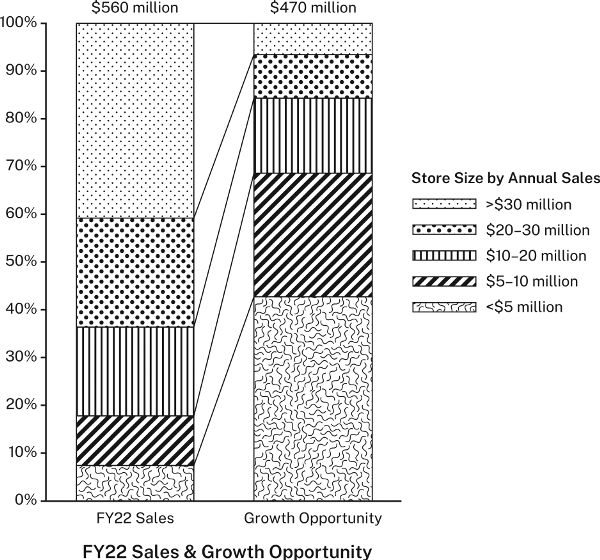

But that chart ob­scures its point be­cause it em­phas­izes total sales and total op­por­tun­ity, not the re­l­at­ive sales and op­por­tun­ity of dif­fer­ent-sized stores. In the fi­nal ver­sion of the re­port, the con­sult­ing firm broke the ori­ginal chart into two, to bet­ter show the com­par­ison:

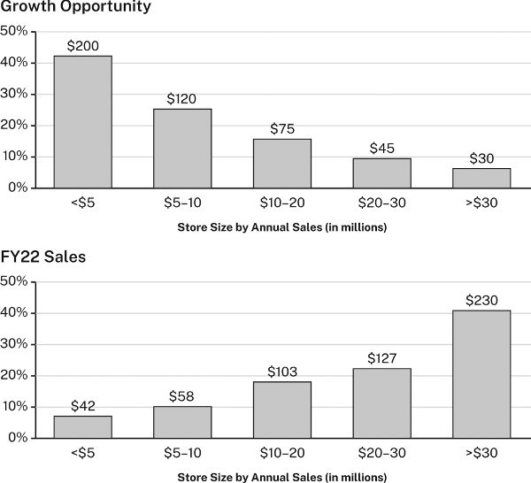

Now, be­cause both charts share a com­mon ho­ri­zontal axis, we can see the re­la­tion­ship: as store size in­creases, the an­ti­cip­ated growth op­por­tun­ity goes down even though fiscal-year sales for 2022 go up.

The same holds for im­ages. If view­ers don’t no­tice in an im­age what a re­searcher wants them to, they might not un­der­stand that im­age as evid­ence. For this reason, re­search­ers some­times en­hance their im­ages to high­light or bring out cer­tain fea­tures. But be care­ful that your “en­hance­ments” don’t amount to fab­ric­at­ing evid­ence. It can be a slip­pery slope.

▶ Quick Tip: As­sess Your Evid­ence as You Gather It

In chapter 4, we en­cour­aged you to en­gage sources act­ively in your notes, to in­clude in them not just quo­ta­tions or bib­li­o­graphic in­form­a­tion but your own thoughts and re­ac­tions (see 4.3–4.5). Do­ing that is es­pe­cially im­port­ant when you are re­cord­ing data or in­form­a­tion that you might use as evid­ence be­cause of the three ele­ments that make up your ar­gu­ment’s core—a claim, reas­ons, and evid­ence—your evid­ence is the only one that you don’t for­mu­late your­self. Re­mem­ber, your claims are state­ments of your ideas, and your reas­ons are state­ments that sup­port them. But your evid­ence isn’t a state­ment (al­though you might make state­ments to re­port it); it’s the data or in­form­a­tion on which those other state­ments are based (see 5.2 and 7.2). You need to know that it has been re­cor­ded ac­cur­ately, but you also need to un­der­stand its value and lim­it­a­tions. So be­gin as­sess­ing it as you gather it. Con­sider how far you can trust it and what you might do with it. Note your sense of its re­li­ab­il­ity, any con­cerns you have about it, even lines of ar­gu­ment it sug­gests (Why did you choose to re­cord those num­bers or that quo­ta­tion?). Let the ques­tions in this chapter guide you (see 7.5). As­sess­ing your evid­ence as you gather it will help you in at least three ways: It will pro­tect you from the trap of mech­an­ic­ally re­cord­ing more and more and more data and in­form­a­tion, which can be a kind of pro­cras­tin­a­tion (if you keep tak­ing notes, you can put off the hard work of draft­ing). It will en­able you to eval­u­ate your evid­ence more rig­or­ously later be­cause you’ll have your ini­tial re­ac­tions to it. And it will get you think­ing early about the ar­gu­ment you will even­tu­ally make.

---

## ▶ Quick Tip: Reasons, Evidence, and Warrants

8 War­rants

War­rants are gen­eral prin­ciples that con­nect reas­ons to claims. This chapter ex­plains when and how to use them. All re­search ar­gu­ments have war­rants, just as they have claims, reas­ons, and evid­ence. But un­like these core ele­ments, war­rants are of­ten left un­stated. In gen­eral, you should state your war­rants only when your audi­ence will not un­der­stand your ar­gu­ment oth­er­wise or when you ex­pect your audi­ence to chal­lenge your reas­on­ing.

Con­sider this ar­gu­ment:

Ja­pan faces a de­clin­ing stand­ard of liv­ingclaim be­cause its fer­til­ity rate is only 1.3 and fall­ing.reason

Ja­pan faces a de­clin­ing stand­ard of liv­ingclaim be­cause its fer­til­ity rate is only 1.3 and fall­ing.reason

Someone re­sponds:

Well, you’re right about Ja­pan’s fer­til­ity rate, but I don’t see why that means Ja­pan’s stand­ard of liv­ing will de­cline. How does that fol­low?

Well, you’re right about Ja­pan’s fer­til­ity rate, but I don’t see why that means Ja­pan’s stand­ard of liv­ing will de­cline. How does that fol­low?

If you were mak­ing that ar­gu­ment, how would you an­swer? Of­fer­ing evid­ence of Ja­pan’s fer­til­ity rate wouldn’t help be­cause the ques­tion is not about the truth of the reason it­self but about how it sup­ports the claim. The ques­tion gets at the fourth and most ab­stract ele­ment of an ar­gu­ment: its war­rants. War­rants are gen­eral prin­ciples that con­nect reas­ons to claims. They are es­sen­tial be­cause they ex­plain or au­thor­ize the reas­on­ing that makes ar­gu­ments pos­sible. They are im­port­ant for you to un­der­stand be­cause you may face ques­tions not just about the truth of a reason but about its rel­ev­ance as well. In that case, you need to be able to ex­plain not just what your reas­ons and evid­ence are, but why they sup­port your claim (which can be harder than it sounds). Every ques­tion about your war­rants is, ul­ti­mately, a ques­tion about the basis of your be­liefs: it chal­lenges you to re­cog­nize that your ar­gu­ment makes sense only be­cause you ac­cept cer­tain prin­ciples (your war­rants) and to ac­know­ledge that when oth­ers who hold dif­fer­ent prin­ciples con­sider your reas­ons and evid­ence, they may ar­rive at dif­fer­ent con­clu­sions than you did or at no con­clu­sions at all.

Luck­ily, most of the time, we are spared from such philo­soph­iz­ing. That’s be­cause most of our war­rants are given to us by the com­munit­ies in which we par­ti­cip­ate, in­clud­ing not just our re­search and pro­fes­sional com­munit­ies but also our so­cial and fa­milial groups, polit­ical and re­li­gious af­fil­i­ations, and even our cul­tures.

As a prac­tical mat­ter, the ba­sic prin­ciple is this: state your war­rants only if your audi­ence holds dif­fer­ent ones, will not be able to un­der­stand your reas­on­ing un­less you do, or may chal­lenge your reas­on­ing. When mak­ing ar­gu­ments for ex­perts in a field, you can leave most of your war­rants un­stated be­cause those ex­perts will usu­ally take them for gran­ted.

8.1 War­rants in Every­day Reas­on­ing

While the concept of war­rants is ab­stract, we rely on them all the time. We un­der­stand them eas­ily enough when we of­fer pro­verbs to jus­tify our reas­on­ing. That’s be­cause pro­verbs are cul­tural war­rants that we all know. For ex­ample, someone says:

I hear the FBI has been ques­tion­ing the mayor’s staff.reason The mayor must be in­volved in some­thing crooked.claim

I hear the FBI has been ques­tion­ing the mayor’s staff.reason The mayor must be in­volved in some­thing crooked.claim

An­other per­son might ob­ject, You’re right. The FBI has been ques­tion­ing the mayor’s staff, but why does that mean the mayor is crooked? To ex­plain the reas­on­ing that led to that con­clu­sion, the first per­son might of­fer the pro­verb, Well, where there’s smoke, there’s fire. That is, when we see a sign of some­thing wrong, we can in­fer that some­thing is in fact wrong.

The reas­on­ing works like this. Most pro­verbs have two dis­tinct parts: a cir­cum­stance (Where there’s smoke ... ) and its con­sequence (... there’s fire). If a cir­cum­stance im­plies a con­sequence in gen­eral, then we can rely on that con­nec­tion to li­cense our in­fer­ences in spe­cific in­stances. In the case of the pro­verb about smoke and fire and that situ­ation with the FBI and the mayor, the reas­on­ing looks like this:

We use pro­verbs to jus­tify many kinds of every­day reas­on­ing: cause and ef­fect (Haste makes waste); rules of be­ha­vior (Look be­fore you leap); re­li­able in­fer­ence (One swal­low does not a sum­mer make). But such pro­verbs are not our only ex­amples of every­day war­rants. We use war­rants every­where: in sports (De­fense wins cham­pi­on­ships); in cook­ing (Serve oysters only in months with an “r”); in defin­i­tions (A prime num­ber can be di­vided only by it­self and one); even in re­search (When an audi­ence finds an er­ror in one bit of evid­ence, they dis­trust the rest).

8.2 War­rants in Re­search Ar­gu­ments

In the spe­cial­ized ar­gu­ments of re­search­ers and other pro­fes­sion­als, war­rants work in ex­actly the same way, but they dif­fer in some re­spects that can make them dif­fi­cult to man­age, es­pe­cially for those new to a field.

First, the war­rants in re­search ar­gu­ments aren’t al­ways com­mon­places we share; they are of­ten spe­cial­ized prin­ciples of reas­on­ing that be­long to par­tic­u­lar re­search com­munit­ies. It just takes time for new re­search­ers to grasp the war­rants of their fields—in fact, that’s much of what it means to learn to think like a bio­lo­gist, a his­tor­ian, a phys­i­cian, and so on.

Second, ex­perts rarely state their war­rants ex­pli­citly when they ad­dress their fel­low spe­cial­ists be­cause they can safely as­sume their fel­low spe­cial­ists already know them. (To state war­rants that should be ob­vi­ous could seem con­des­cend­ing or—worse—un­mask a pur­por­ted ex­pert as no ex­pert at all.)

While this prac­tice of leav­ing ac­cep­ted war­rants un­stated serves re­search com­munit­ies well, it is also use­ful to be able to identify war­rants at work, both for those as­sess­ing ar­gu­ments they’ve been offered and for novices just learn­ing their fields. As­sum­ing the avail­able evid­ence sup­ports the reason, bio­lo­gists would ac­cept this ar­gu­ment:

A whale is more closely re­lated to a hip­po­pot­amus than to a cowclaim be­cause it shares more DNA with a hip­po­pot­amus.reason

A whale is more closely re­lated to a hip­po­pot­amus than to a cowclaim be­cause it shares more DNA with a hip­po­pot­amus.reason

No bio­lo­gist would ask, What makes DNA rel­ev­ant to meas­ur­ing re­la­tion­ship? So no bio­lo­gist writ­ing for fel­low bio­lo­gists would of­fer a war­rant an­swer­ing that ques­tion. If, how­ever, a non-bio­lo­gist asked that ques­tion, the bio­lo­gist would an­swer with a war­rant other bio­lo­gists take for gran­ted:

When a spe­cies shares more DNA with one spe­cies than it does with an­other,cir­cum­stance we in­fer that it is more closely re­lated to the first.con­sequence

When a spe­cies shares more DNA with one spe­cies than it does with an­other,cir­cum­stance we in­fer that it is more closely re­lated to the first.con­sequence

Of course, the bio­lo­gist would prob­ably then have to ex­plain that war­rant as well. The point is this: whether or not a war­rant gets stated ex­pli­citly de­pends not only on the ar­gu­ment but also on the audi­ence. Mem­bers of a re­search com­munity state prin­ciples that are ob­vi­ous to other mem­bers only when they com­mu­nic­ate with those out­side their com­munity—or when chal­lenged.

Third, the spe­cial­ized war­rants be­long­ing to re­search com­munit­ies are of­ten stated in ways that com­press their cir­cum­stances and con­sequences. In most pro­verbs, these parts are dis­tinct: Where there’s smoke,cir­cum­stance there’s fire.con­sequence But we can also com­press those two parts into one short state­ment: Smoke means fire. That’s some­thing we rarely do with pro­verbs but that ex­perts do of­ten:

Shared DNA is the meas­ure of the re­la­tion­ship between spe­cies.

Shared DNA is the meas­ure of the re­la­tion­ship between spe­cies.

Phrased this way, our bio­lo­gist’s war­rant doesn’t ex­pli­citly dis­tin­guish a cir­cum­stance from its con­sequence, but we can. For pur­poses of clar­ity, we’ll state war­rants in their most ex­pli­cit form: When X, then Y.

Here again is that ar­gu­ment about Ja­pan’s eco­nomic fu­ture:

Ja­pan faces a de­clin­ing stand­ard of liv­ingclaim be­cause its fer­til­ity rate is only 1.3 and fall­ing.reason

Ja­pan faces a de­clin­ing stand­ard of liv­ingclaim be­cause its fer­til­ity rate is only 1.3 and fall­ing.reason

If someone ob­jects that the reason seems ir­rel­ev­ant to the claim, the per­son mak­ing the ar­gu­ment would have to of­fer a war­rant to jus­tify the con­nec­tion:

When a na­tion’s labor force shrinks,gen­eral cir­cum­stance its eco­nomic fu­ture is grim.gen­eral con­sequence

When a na­tion’s labor force shrinks,gen­eral cir­cum­stance its eco­nomic fu­ture is grim.gen­eral con­sequence

Both the cir­cum­stance and con­sequence have to be more gen­eral than the spe­cific reason and claim. Visu­ally, that lo­gic looks like this:

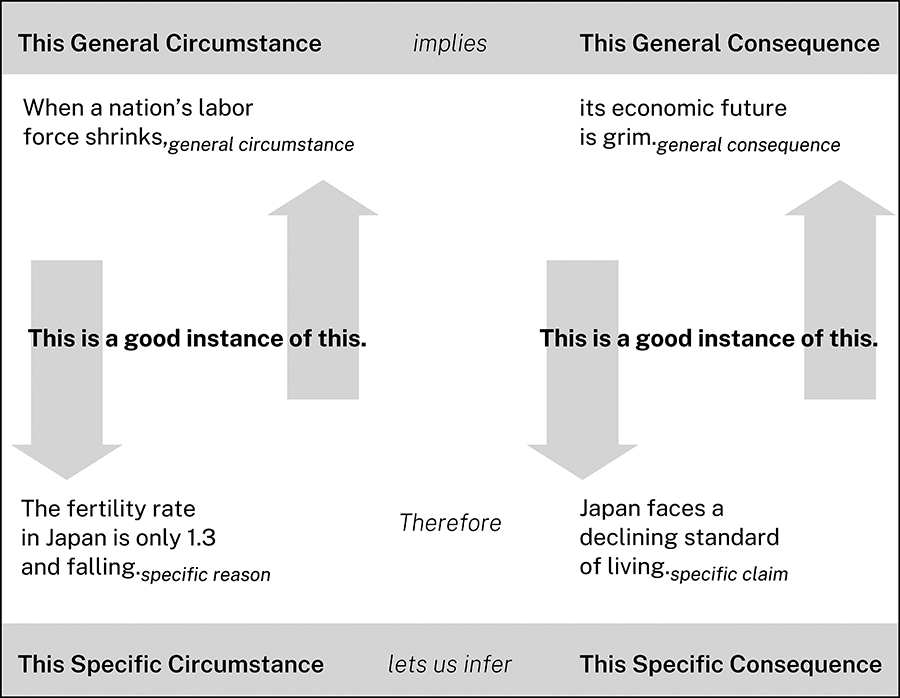

The pat­tern is the same in every­day and spe­cial­ized reas­on­ing.

8.3 Test­ing War­rants

Audi­ences chal­lenge war­rants in pre­dict­able ways. Con­sider this ar­gu­ment:

It seems un­likely that in early eight­eenth-cen­tury New Eng­land, many farm­ers other than the most af­flu­ent owned a clockclaim be­cause clocks are rarely men­tioned in farm­ers’ wills.reason A re­view of 124 such wills filed in four Mas­sachu­setts counties between 1700 and 1750 shows that only 14 per­cent men­tion a clock of any sort.re­port of evid­ence

It seems un­likely that in early eight­eenth-cen­tury New Eng­land, many farm­ers other than the most af­flu­ent owned a clockclaim be­cause clocks are rarely men­tioned in farm­ers’ wills.reason A re­view of 124 such wills filed in four Mas­sachu­setts counties between 1700 and 1750 shows that only 14 per­cent men­tion a clock of any sort.re­port of evid­ence

Such a claim is likely to be ques­tioned by those whose be­liefs it chal­lenges. Even if they ac­cept that the reason is true—that clocks were in fact rarely men­tioned in wills—they may still ob­ject: But I don’t see how that counts as a reason to be­lieve that few farm­ers owned clocks. It’s ir­rel­ev­ant. If a his­tor­ian mak­ing this ar­gu­ment an­ti­cip­ated that ob­jec­tion, that his­tor­ian might in­tro­duce it with its war­rant:

In early eight­eenth-cen­tury New Eng­land, wills lis­ted valu­able house­hold ob­jects, so when a will fails to men­tion such an ob­ject, the test­ator did not own one.war­rant It there­fore seems un­likely that ... claim

In early eight­eenth-cen­tury New Eng­land, wills lis­ted valu­able house­hold ob­jects, so when a will fails to men­tion such an ob­ject, the test­ator did not own one.war­rant It there­fore seems un­likely that ... claim

Note that this ar­gu­ment de­pends on a second war­rant as well: that what’s true of farm­ers in Mas­sachu­setts is true of farm­ers in New Eng­land more broadly. But if the his­tor­ian be­lieves it won’t be ques­tioned, it can go un­stated.

A suc­cess­ful war­rant must meet five con­di­tions. That is, an audi­ence must be able to say “yes” to the fol­low­ing ques­tions:

* 1\. Is that war­rant reas­on­able?
* 2\. Is it suf­fi­ciently lim­ited?
* 3\. Is it su­per­ior to any com­pet­ing war­rants?
* 4\. Is it ap­pro­pri­ate to this field?
* 5\. Is it able to cover the reason and claim?

8.3.1 Is Your War­rant Reas­on­able?

A war­rant seems reas­on­able when an audi­ence can ac­cept that its con­sequence fol­lows from its cir­cum­stance. If your audi­ence won’t ac­cept your war­rant on its face, then you have to con­vince them to ac­cept it by treat­ing it as a claim in its own ar­gu­ment, sup­por­ted by its own reas­ons and evid­ence:

In early eight­eenth-cen­tury New Eng­land, wills lis­ted valu­able house­hold ob­jects, so when a will fails to men­tion such an ob­ject, the test­ator did not own one.war­rant/claim Myles and Winn (2018) con­firm that to be the case.reason Their study of in­her­it­ance prac­tices in eight­eenth- and nine­teenth-cen­tury Amer­ica shows that ... evid­ence

In early eight­eenth-cen­tury New Eng­land, wills lis­ted valu­able house­hold ob­jects, so when a will fails to men­tion such an ob­ject, the test­ator did not own one.war­rant/claim Myles and Winn (2018) con­firm that to be the case.reason Their study of in­her­it­ance prac­tices in eight­eenth- and nine­teenth-cen­tury Amer­ica shows that ... evid­ence

8.3.2 Is Your War­rant Suf­fi­ciently Lim­ited?

Most war­rants are reas­on­able only within cer­tain lim­its. For ex­ample, the war­rant about clock own­er­ship is too ri­gid be­cause it seems to al­low no ex­cep­tions:

In early eight­eenth-cen­tury New Eng­land, wills lis­ted valu­able house­hold ob­jects, so when a will fails to men­tion such an ob­ject, the test­ator did not own one.

In early eight­eenth-cen­tury New Eng­land, wills lis­ted valu­able house­hold ob­jects, so when a will fails to men­tion such an ob­ject, the test­ator did not own one.

It might seem more plaus­ible if it were qual­i­fied:

In early eight­eenth-cen­tury New Eng­land, wills usu­ally lis­ted house­hold ob­jects con­sidered es­pe­cially valu­able by their own­ers, so when a will fails to men­tion such an ob­ject, the test­ator prob­ably did not own one.

In early eight­eenth-cen­tury New Eng­land, wills usu­ally lis­ted house­hold ob­jects con­sidered es­pe­cially valu­able by their own­ers, so when a will fails to men­tion such an ob­ject, the test­ator prob­ably did not own one.

But once you start qual­i­fy­ing a war­rant with words like usu­ally, prob­ably, and es­pe­cially, you may then have to show that its ex­cep­tions do not ex­clude your reason and claim: What fre­quency are usu­ally and prob­ably? Were clocks con­sidered es­pe­cially valu­able?

8.3.3 Is Your War­rant Su­per­ior to Any Com­pet­ing War­rants?

You may think your war­rant is reas­on­able and suf­fi­ciently lim­ited, but other war­rants might com­pete with or su­per­sede it. Here are two com­pet­ing war­rants, both ar­gu­ably reas­on­able:

When people be­lieve a med­ical pro­ced­ure may harm them, they have a right to re­fuse it. Taylor be­lieves that the COVID-19 vac­cine causes myocarditis, so he has a right to re­fuse it. When med­ical de­cisions con­cern mat­ters of pub­lic health, the state has a right to reg­u­late them. Wide­spread vac­cin­a­tion for COVID-19 makes every­one safer, so the state can com­pel gov­ern­ment em­ploy­ees to re­ceive it.

When people be­lieve a med­ical pro­ced­ure may harm them, they have a right to re­fuse it. Taylor be­lieves that the COVID-19 vac­cine causes myocarditis, so he has a right to re­fuse it.

When med­ical de­cisions con­cern mat­ters of pub­lic health, the state has a right to reg­u­late them. Wide­spread vac­cin­a­tion for COVID-19 makes every­one safer, so the state can com­pel gov­ern­ment em­ploy­ees to re­ceive it.

Which war­rant should pre­vail? That’s a mat­ter for ar­gu­ment.

You can some­times re­con­cile com­pet­ing war­rants by lim­it­ing them:

When people be­lieve a med­ical pro­ced­ure may harm them, they have a right to re­fuse it, so long as that does not jeop­ard­ize the health of oth­ers. When med­ical de­cisions con­cern mat­ters of pub­lic health, the state has a right to reg­u­late them, so long as the state en­croaches as little as pos­sible on in­di­vidu­als’ right to con­trol what hap­pens to their bod­ies.

When people be­lieve a med­ical pro­ced­ure may harm them, they have a right to re­fuse it, so long as that does not jeop­ard­ize the health of oth­ers.

When med­ical de­cisions con­cern mat­ters of pub­lic health, the state has a right to reg­u­late them, so long as the state en­croaches as little as pos­sible on in­di­vidu­als’ right to con­trol what hap­pens to their bod­ies.

Find­ing the right bal­ance, or any bal­ance at all, is not al­ways easy. In fact, so-called “cul­ture wars” ar­gu­ments (like those over COVID-19 vac­cine re­quire­ments) are of­ten so heated and in­tract­able be­cause they are more about com­pet­ing val­ues and prin­ciples (that is to say, war­rants) than about reas­ons or evid­ence.

8.3.4 Is Your War­rant Ap­pro­pri­ate to This Field?

Your war­rant may be reas­on­able, suf­fi­ciently lim­ited, and su­per­ior to oth­ers, but it still has to be ac­cep­ted as ap­pro­pri­ate to the field to which an ar­gu­ment con­trib­utes. Law stu­dents get a pain­ful les­son in the law when they find that many every­day war­rants have no place in legal ar­gu­ments. Most start law school hold­ing this com­mon­sense be­lief:

When a per­son is wronged, the law should cor­rect it.

When a per­son is wronged, the law should cor­rect it.

But law stu­dents have to learn that legal war­rants may su­per­sede such com­mon­sense ideas. For ex­ample:

When one ig­nores legal ob­lig­a­tions, even in­ad­vert­ently, one must suf­fer the con­sequences.

When one ig­nores legal ob­lig­a­tions, even in­ad­vert­ently, one must suf­fer the con­sequences.

There­fore:

When eld­erly home own­ers for­get to pay real es­tate taxes, oth­ers can buy their houses for back taxes and evict them.

When eld­erly home own­ers for­get to pay real es­tate taxes, oth­ers can buy their houses for back taxes and evict them.

Law stu­dents must learn that justice, in a strictly legal sense, is not the out­come they be­lieve to be eth­ical but the one that the law and the courts sup­port.

8.3.5 Is Your War­rant Able to Cover Your Reason and Claim?

Fi­nally, you must be sure that your reason and claim are good in­stances of your war­rant’s gen­eral cir­cum­stance and gen­eral con­sequence. For ex­ample:

Ahmed: Maybe you should start us­ing a pro­ductiv­ity app,claim be­cause you keep miss­ing our staff meet­ings.reason

Beth: Why do you think a pro­ductiv­ity app will get me to at­tend our staff meet­ings?

Ahmed: If you’re more or­gan­ized,gen­eral cir­cum­stance you’re more likely to re­mem­ber your ap­point­ments.gen­eral con­sequence

Beth: Well, I don’t skip those meet­ings be­cause I’m un­or­gan­ized.

Beth ob­jects not that Ahmed’s reason is false but that it is not a valid in­stance of his war­rant’s gen­eral cir­cum­stance. She doesn’t deny miss­ing those staff meet­ings; she only denies that the reason she’s miss­ing them is be­cause she’s un­or­gan­ized. (Maybe she just finds them a waste of time.) To her, Ahmed’s reason isn’t covered by his war­rant and is there­fore not rel­ev­ant.

Beth might also have re­spon­ded that us­ing a pro­ductiv­ity app would make her less or­gan­ized:

Beth: I’ve al­ways used a day plan­ner, so I really don’t think an app would help me.

In that case, she would be ob­ject­ing that Ahmed’s claim isn’t a good in­stance of the war­rant’s con­sequence, in other words, that it doesn’t fol­low from his reason: even if she were un­or­gan­ized, a pro­ductiv­ity app wouldn’t help her.

Most real-world ar­gu­ments are like this one, in which what “counts” as an in­stance of a war­rant’s gen­eral cir­cum­stance or what fol­lows as a spe­cific con­sequence is a mat­ter of de­bate and ne­go­ti­ation rather than one of un­con­tested defin­i­tion. Ahmed and Beth might reas­on­ably dis­agree about what makes a per­son “un­or­gan­ized” as they never would about what makes a geo­met­rical fig­ure a tri­angle. This is yet an­other reason ar­gu­ments about war­rants lead to fur­ther ar­gu­ments and, ideally, to bet­ter un­der­stand­ing.

8.4 Know­ing When to State a War­rant

Ar­gu­ments in any field de­pend on count­less prin­ciples of reas­on­ing, but most of these are so em­bed­ded in re­search­ers’ ta­cit know­ledge or so gen­er­ally ac­cep­ted that they go un­noted and even un­noticed. There are three oc­ca­sions, how­ever, when you may have to state a war­rant ex­pli­citly:

* 1\. **You are ad­dress­ing an audi­ence out­side your field.** When you make an ar­gu­ment for an audi­ence that does not share your ex­pert­ise, you may need to ex­plain how ex­perts in your field draw con­clu­sions and sup­port their claims, es­pe­cially if these ways of reas­on­ing are un­usual.
* 2\. **You use a prin­ciple of reas­on­ing that is new or con­tro­ver­sial in your field.** When you rely on un­con­ven­tional prin­ciples of reas­on­ing, you can an­ti­cip­ate that your ar­gu­ment will be re­ceived at least by some with skep­ti­cism. So de­fuse that skep­ti­cism by stat­ing your war­rant and jus­ti­fy­ing it. Refer to re­spec­ted fig­ures in your field who also use it. If you can’t do that, make an ar­gu­ment of your own de­fend­ing your reas­on­ing.
* 3\. **You make a claim that some will res­ist be­cause they just don’t want it to be true.** In this case, a good strategy is to of­fer a war­rant you hope they will ac­cept _be­fore_ you lay out a reason and claim you sus­pect they will res­ist. They may not like the claim any bet­ter, but you will at least en­cour­age them to see that it is not un­reas­on­able. For ex­ample: 

>   1. We should ac­cept that hu­man ac­tions are largely re­spons­ible for cli­mate changeclaim be­cause vir­tu­ally all cli­mate sci­ent­ists hold that view.reason
> 

> 
> An audi­ence may res­ist that claim be­cause it threatens other strong con­vic­tions they hold. A re­searcher con­front­ing such an audi­ence might en­cour­age them at least to con­sider that claim by giv­ing them a war­rant that they should be able to ac­cept:

What You Don’t Say Says Who You Are

You treat your audi­ence cour­teously when you state and sup­port war­rants to ex­plain prin­ciples of reas­on­ing that they may not re­cog­nize. But you make an equally strong (though less friendly) ges­ture when you keep si­lent about war­rants you should state for an audi­ence not in the know. One way or the other, war­rants sig­ni­fic­antly af­fect how audi­ences per­ceive the ethos you pro­ject through your ar­gu­ments.

>   1. **When an over­whelm­ing ma­jor­ity of com­pet­ent ex­perts ar­rive at the same con­clu­sion, we can prob­ably trust it.** war­rant We should there­fore ac­cept that hu­man ac­tions are largely re­spons­ible for cli­mate changeclaim be­cause vir­tu­ally all cli­mate sci­ent­ists hold that view.reason
> 

> 
> When an audi­ence ac­cepts that a war­rant is reas­on­able, that a reason is true, and that the reason and claim are good in­stances of the war­rant’s gen­eral cir­cum­stance and con­sequence, then they are lo­gic­ally ob­liged at least to _con­sider_ the claim. If they don’t, no ra­tional ar­gu­ment is likely to change their minds.

We should ac­cept that hu­man ac­tions are largely re­spons­ible for cli­mate changeclaim be­cause vir­tu­ally all cli­mate sci­ent­ists hold that view.reason An audi­ence may res­ist that claim be­cause it threatens other strong con­vic­tions they hold. A re­searcher con­front­ing such an audi­ence might en­cour­age them at least to con­sider that claim by giv­ing them a war­rant that they should be able to ac­cept:

An audi­ence may res­ist that claim be­cause it threatens other strong con­vic­tions they hold. A re­searcher con­front­ing such an audi­ence might en­cour­age them at least to con­sider that claim by giv­ing them a war­rant that they should be able to ac­cept:

What You Don’t Say Says Who You Are

You treat your audi­ence cour­teously when you state and sup­port war­rants to ex­plain prin­ciples of reas­on­ing that they may not re­cog­nize. But you make an equally strong (though less friendly) ges­ture when you keep si­lent about war­rants you should state for an audi­ence not in the know. One way or the other, war­rants sig­ni­fic­antly af­fect how audi­ences per­ceive the ethos you pro­ject through your ar­gu­ments.

When an over­whelm­ing ma­jor­ity of com­pet­ent ex­perts ar­rive at the same con­clu­sion, we can prob­ably trust it.war­rant We should there­fore ac­cept that hu­man ac­tions are largely re­spons­ible for cli­mate changeclaim be­cause vir­tu­ally all cli­mate sci­ent­ists hold that view.reason When an audi­ence ac­cepts that a war­rant is reas­on­able, that a reason is true, and that the reason and claim are good in­stances of the war­rant’s gen­eral cir­cum­stance and con­sequence, then they are lo­gic­ally ob­liged at least to con­sider the claim. If they don’t, no ra­tional ar­gu­ment is likely to change their minds.

When an audi­ence ac­cepts that a war­rant is reas­on­able, that a reason is true, and that the reason and claim are good in­stances of the war­rant’s gen­eral cir­cum­stance and con­sequence, then they are lo­gic­ally ob­liged at least to con­sider the claim. If they don’t, no ra­tional ar­gu­ment is likely to change their minds.

8.5 Us­ing War­rants to Test Your Ar­gu­ment

You can test the sound­ness of an ar­gu­ment by try­ing to ima­gine a war­rant for it. Here’s a flawed ar­gu­ment:

Chil­dren aged 12–16 today are sig­ni­fic­antly more prone to men­tal health prob­lems than were their coun­ter­parts from a gen­er­a­tion ago.reason Brown (2021) has shown that since 2010, the in­cid­ence of anxi­ety and de­pres­sion in chil­dren has risen by ... evid­ence We must con­clude that so­cial me­dia is hav­ing a det­ri­mental ef­fect on chil­dren’s men­tal health.claim

Chil­dren aged 12–16 today are sig­ni­fic­antly more prone to men­tal health prob­lems than were their coun­ter­parts from a gen­er­a­tion ago.reason Brown (2021) has shown that since 2010, the in­cid­ence of anxi­ety and de­pres­sion in chil­dren has risen by ... evid­ence We must con­clude that so­cial me­dia is hav­ing a det­ri­mental ef­fect on chil­dren’s men­tal health.claim

To un­der­stand what’s wrong here, we can try to ima­gine a war­rant that would con­nect the stated reason—chil­dren’s men­tal health prob­lems are in­creas­ing—to the claim that so­cial me­dia is at least in part re­spons­ible for that in­crease. That claim seems com­mon­sensical and may even be true, but there is no sat­is­fy­ing war­rant (that is, one that sat­is­fies the five cri­teria noted in 8.3) that can con­nect that spe­cific reason to that spe­cific claim. The war­rant would need to be some­thing like this:

When chil­dren’s men­tal health is af­fected for the worse,gen­eral cir­cum­stance so­cial me­dia is to blame.gen­eral con­sequence

When chil­dren’s men­tal health is af­fected for the worse,gen­eral cir­cum­stance so­cial me­dia is to blame.gen­eral con­sequence

That doesn’t seem reas­on­able. Why single out so­cial me­dia spe­cific­ally? What about all the other in­flu­ences that might ad­versely af­fect chil­dren?

To fix that ar­gu­ment, we need to re­vise the reason so that it is a good in­stance of the gen­eral cir­cum­stance of a war­rant the audi­ence will ac­cept, which may also mean pro­du­cing new evid­ence to sup­port that re­vised reason:

The more chil­dren are sub­jec­ted to ad­verse in­flu­ences they can­not con­trol, the more severe the neg­at­ive ef­fects on their men­tal health will be.war­rant So­cial me­dia use, a known risk factor for anxi­ety and de­pres­sion in chil­dren aged 12–16, has in­creased sig­ni­fic­antly over the past ten years.new reason Jones (2022) shows that ... new evid­ence Given these facts, it seems likely that in­creased so­cial me­dia use is mak­ing today’s chil­dren more prone to men­tal health is­sues than were chil­dren a dec­ade ago.claim

The more chil­dren are sub­jec­ted to ad­verse in­flu­ences they can­not con­trol, the more severe the neg­at­ive ef­fects on their men­tal health will be.war­rant So­cial me­dia use, a known risk factor for anxi­ety and de­pres­sion in chil­dren aged 12–16, has in­creased sig­ni­fic­antly over the past ten years.new reason Jones (2022) shows that ... new evid­ence Given these facts, it seems likely that in­creased so­cial me­dia use is mak­ing today’s chil­dren more prone to men­tal health is­sues than were chil­dren a dec­ade ago.claim

Now the reason and claim seem closer to what the war­rant cov­ers or in­cludes. We show this ar­gu­ment’s lo­gic in the fig­ure on p. 149.

But a skep­tic keen to de­rail the ar­gu­ment might still ob­ject:

Wait. So­cial me­dia isn’t al­ways an “ad­verse in­flu­ence” that chil­dren “can’t con­trol.” Couldn’t it have pos­it­ive ef­fects as well? Gran­ted, so­cial me­dia use among chil­dren is tied to a risk of anxi­ety and de­pres­sion, but it also al­lows chil­dren to con­nect with friends when oth­er­wise they might re­main isol­ated ...

Wait. So­cial me­dia isn’t al­ways an “ad­verse in­flu­ence” that chil­dren “can’t con­trol.” Couldn’t it have pos­it­ive ef­fects as well? Gran­ted, so­cial me­dia use among chil­dren is tied to a risk of anxi­ety and de­pres­sion, but it also al­lows chil­dren to con­nect with friends when oth­er­wise they might re­main isol­ated ...

In re­sponse, the re­searcher would have to deal with those chal­lenges. Now you un­der­stand why im­port­ant is­sues are so end­lessly con­tested, why even when you feel your case is air­tight, oth­ers can still say, Wait a minute. What about ... ?

8.6 Chal­len­ging Oth­ers’ War­rants

The most dif­fi­cult ar­gu­ments to make are those that chal­lenge not just claims and evid­ence but the war­rants a re­search com­munity em­braces. No ar­gu­ment­at­ive task is harder, be­cause in do­ing so, you ask a com­munity to change not just what they be­lieve but how they reason. To chal­lenge a war­rant suc­cess­fully, you must first ima­gine how those who ac­cept it would de­fend it. War­rants can be based on dif­fer­ent kinds of sup­port­ing ar­gu­ments, so you have to chal­lenge them in dif­fer­ent ways.

8.6.1 Chal­len­ging War­rants Based on Ex­per­i­ence

We base some war­rants on our ex­per­i­ence or on re­ports by oth­ers.

When people ha­bitu­ally lie, we shouldn’t trust them. Where there’s smoke, there’s fire. When the yield curve in gov­ern­ment bonds in­verts, a re­ces­sion is likely.

When people ha­bitu­ally lie, we shouldn’t trust them.

Where there’s smoke, there’s fire.

When the yield curve in gov­ern­ment bonds in­verts, a re­ces­sion is likely.

To chal­lenge those war­rants, you must chal­lenge the re­li­ab­il­ity of the ex­per­i­ence, which is rarely easy, or find counter­examples that can­not be dis­missed as spe­cial cases.

8.6.2 Chal­len­ging War­rants Based on Au­thor­ity

We be­lieve some people be­cause of their ex­pert­ise, po­s­i­tion, or cha­risma:

When au­thor­ity X says Y, Y must be so.

When au­thor­ity X says Y, Y must be so.

The easi­est—and friend­li­est—way to chal­lenge an au­thor­ity is to ar­gue that, on the mat­ter in ques­tion, the au­thor­ity does not have all the evid­ence or reaches bey­ond its ex­pert­ise. The most ag­gress­ive way is to ar­gue that the source is in fact not an au­thor­ity at all.

8.6.3 Chal­len­ging War­rants Based on Sys­tems of Know­ledge

These war­rants are backed by sys­tems of defin­i­tions, prin­ciples, or the­or­ies:

* FROM MATH­EM­AT­ICS: When we add two odd num­bers, we get an even one.
* FROM BIO­LOGY: When an or­gan­ism re­pro­duces sexu­ally, its off­spring dif­fer from either par­ent.
* FROM LAW: When a pre­ced­ent ex­ists, a judge should fol­low it.

When you chal­lenge these war­rants, “facts” are largely ir­rel­ev­ant. You must either chal­lenge the sys­tem, al­ways dif­fi­cult, or show that the case does not fall un­der the war­rant.

8.6.4 Chal­len­ging Cul­tural War­rants

Cul­tural war­rants are backed not by in­di­vidual ex­per­i­ence but by the com­mon ex­per­i­ence of an en­tire cul­ture and there­fore seem to be un­as­sail­able “com­mon sense”:

What goes around comes around. An in­sult jus­ti­fies re­tali­ation. What doesn’t kill you makes you stronger.

What goes around comes around.

An in­sult jus­ti­fies re­tali­ation.

What doesn’t kill you makes you stronger.

War­rants like these may change over time, but slowly. You can chal­lenge them by of­fer­ing com­pet­ing war­rants or by not­ing their cul­tural spe­cificity.

8.6.5 Chal­len­ging Meth­od­o­lo­gical War­rants

These war­rants are gen­eral pat­terns of thought with no con­tent un­til ap­plied to spe­cific cases. We use them to ex­plain ab­stract reas­on­ing (they are the source of many pro­verbs):

* GEN­ER­AL­IZ­A­TION: When every known case of X has qual­ity Y, then all Xs prob­ably have qual­ity Y. (_Seen one, seen them all._)
* ANA­LOGY: When X is like Y in most re­spects, then X will be like Y in other re­spects. (_The acorn doesn’t fall far from the tree._)
* SIGN: When Y reg­u­larly oc­curs be­fore, dur­ing, or after X, Y is a sign of X. (_Cold hands, warm heart._)

Philo­soph­ers have ques­tioned these war­rants, but in mat­ters of prac­tical ar­gu­ment­a­tion, we chal­lenge only their ap­plic­a­tion or point out lim­it­ing con­di­tions: Yes, we can ana­lo­gize X to Y, but not if ...

8.6.6 Chal­len­ging War­rants Based on Art­icles of Faith

Some war­rants are bey­ond chal­lenge: Thomas Jef­fer­son in­voked one when he wrote in the De­clar­a­tion of In­de­pend­ence, We hold these truths to be self-evid­ent, that all men are cre­ated equal... Oth­ers in­clude

When a claim is based on nat­ural law, it must be true. When a claim is based on di­vine rev­el­a­tion, it must be true.

When a claim is based on nat­ural law, it must be true.

When a claim is based on di­vine rev­el­a­tion, it must be true.

Such war­rants are backed not by ar­gu­ments but by the con­vic­tion of those who es­pouse them, and they are there­fore al­most im­possible to con­test dir­ectly with com­pet­ing war­rants. When a war­rant is used to short-cir­cuit the give-and-take of ar­gu­ment­a­tion by pla­cing a par­tic­u­lar claim bey­ond dis­pute, we have left the do­main of re­search and re­search ar­gu­ment. A claim as­sumed to be true—rather than judged to be true or at least plaus­ible be­cause of the reas­ons and evid­ence sup­port­ing it—can­not be con­sidered a product of re­search.

▶ Quick Tip: Reas­ons, Evid­ence, and War­rants

You can jus­tify your reas­ons in two ways: by of­fer­ing evid­ence to sup­port them or by de­riv­ing them from a war­rant. Each of these ways leads to a dif­fer­ent kind of ar­gu­ment. Re­search­ers gen­er­ally trust the first kind more than the second, so base your reas­ons on solid evid­ence when you can. Com­pare these two ar­gu­ments:

We should do what we can to dis­cour­age teen­agers from tex­ting and driv­ingclaim be­cause dis­trac­ted driv­ing is a lead­ing cause of teen­age deaths.reason Ac­cord­ing to the CDC, mo­tor vehicle ac­ci­dents are re­spons­ible for over a third of all fatal­it­ies among people aged 12–19, and tex­ting while driv­ing ex­po­nen­tially in­creases the like­li­hood that any driver will be in­volved in one. Moreover, ... evid­ence We should do what we can to dis­cour­age teen­agers from tex­ting and driv­ingclaim be­cause when they do, their risk of hav­ing an ac­ci­dent in­creases.reason 1 Driv­ing is dif­fi­cult and tex­ting a dis­trac­tion,reason 2 sup­port­ing reason 1 and we know that when people are dis­trac­ted while per­form­ing com­plex tasks, their per­form­ance suf­fers.war­rant link­ing reason 2 and reason 1

We should do what we can to dis­cour­age teen­agers from tex­ting and driv­ingclaim be­cause dis­trac­ted driv­ing is a lead­ing cause of teen­age deaths.reason Ac­cord­ing to the CDC, mo­tor vehicle ac­ci­dents are re­spons­ible for over a third of all fatal­it­ies among people aged 12–19, and tex­ting while driv­ing ex­po­nen­tially in­creases the like­li­hood that any driver will be in­volved in one. Moreover, ... evid­ence

We should do what we can to dis­cour­age teen­agers from tex­ting and driv­ingclaim be­cause when they do, their risk of hav­ing an ac­ci­dent in­creases.reason 1 Driv­ing is dif­fi­cult and tex­ting a dis­trac­tion,reason 2 sup­port­ing reason 1 and we know that when people are dis­trac­ted while per­form­ing com­plex tasks, their per­form­ance suf­fers.war­rant link­ing reason 2 and reason 1

If you are like most people, you prob­ably pre­ferred the first of these ar­gu­ments. That’s be­cause its war­rant is not con­tro­ver­sial (and there­fore goes without say­ing) and its claim is sup­por­ted by a reason based on solid evid­ence. That second ar­gu­ment is plaus­ible be­cause reason 1 and reason 2 are good in­stances of that war­rant’s gen­eral con­sequence and con­di­tion. But most people still want evid­ence.

In par­tic­u­lar, you can’t sup­port a claim of fact (see 6.1) with a war­rant and reason alone:

Tex­ting and driv­ing is a lead­ing cause of teen­age deathsclaim of fact be­cause tex­ting while driv­ing is very dis­tract­ing.reason When drivers are dis­trac­ted, they in­crease their risk of hav­ing ser­i­ous, even fatal ac­ci­dents.war­rant

Tex­ting and driv­ing is a lead­ing cause of teen­age deathsclaim of fact be­cause tex­ting while driv­ing is very dis­tract­ing.reason When drivers are dis­trac­ted, they in­crease their risk of hav­ing ser­i­ous, even fatal ac­ci­dents.war­rant

Are you think­ing, I could be­lieve that, but I’d like some proof? That com­mon­sense re­sponse is telling. We can’t just reason our way to the con­clu­sion that tex­ting while driv­ing is a lead­ing cause of teen fatal­it­ies, or even that it causes teen fatal­it­ies at all. Ex­cept in a few fields—some branches of math­em­at­ics, philo­sophy, theo­logy—the way to demon­strate a claim of fact is to show with evid­ence that what you are claim­ing is, in fact, the case.

The les­son is this: whenever you can, rely not on elab­or­ate lines of reas­on­ing based on war­rants but on hard evid­ence.

---

## ▶ Quick Tip: Three Predictable Disagreements

9 Ac­know­ledg­ments and Re­sponses

An ar­gu­ment is not com­plete if it fails to re­cog­nize other points of view. This chapter shows how you can make your ar­gu­ment more con­vin­cing by ac­know­ledging and re­spond­ing to ques­tions, ob­jec­tions, and al­tern­at­ives oth­ers might raise.

The core of your ar­gu­ment, again, is a claim sup­por­ted by reas­ons based on evid­ence. You thicken it with ad­di­tional sub-reas­ons and their evid­ence and per­haps also with war­rants that con­nect that claim to its reas­ons. But if you give your audi­ence only claims, reas­ons, evid­ence, and war­rants—no mat­ter how com­pel­ling these are to you—they may still find your ar­gu­ment thin or dis­missive of their views. Ar­gu­ments are not just lo­gical con­struc­tions; they are also so­cial in­ter­ac­tions.

To craft a suc­cess­ful ar­gu­ment, you must do more than as­semble a sound edi­fice of claims, reas­ons, and evid­ence; you must also bring your audi­ence into your ar­gu­ment by po­s­i­tion­ing those claims as con­tri­bu­tions to an on­go­ing con­ver­sa­tion in which your audi­ence is in­ves­ted (see the in­tro­duc­tion and 5.1). You can do this by present­ing your main claim as a solu­tion to a prob­lem your audi­ence cares about (that’s an im­port­ant func­tion of in­tro­duc­tions, which we will talk more about in chapter 14). You can also do it by an­ti­cip­at­ing, ac­know­ledging, and re­spond­ing to ques­tions, ob­jec­tions, and al­tern­at­ives that you think an audi­ence might raise. As you plan and draft your pa­per or present­a­tion, those oth­ers won’t be there to ques­tion you or to of­fer their own views. So you have to ima­gine their ques­tions and views and take them into ac­count. That’s how you es­tab­lish a co­oper­at­ive re­la­tion­ship with your audi­ence, by ima­gin­ing your­self con­vers­ing with its mem­bers.

In this chapter, we show you how to ima­gine and ad­dress three kinds of ques­tions an audi­ence may ask about your ar­gu­ment:

* ▪ They may chal­lenge the re­search ques­tion or prob­lem it ad­dresses, won­der­ing why the ar­gu­ment is worth mak­ing at all.
* ▪ They may ques­tion your ar­gu­ment’s sound­ness or co­her­ence—the clar­ity of your claim, the qual­ity of your reas­ons and evid­ence, or your lo­gic and reas­on­ing.
* ▪ They may ask you to con­sider al­tern­at­ives—dif­fer­ent ways of fram­ing the prob­lem, other pos­sible claims or solu­tions, evid­ence you’ve over­looked, or what oth­ers have writ­ten on your topic.

When you an­ti­cip­ate, ac­know­ledge, and re­spond to all three kinds of ques­tions, you cre­ate an ar­gu­ment that your audi­ence will more likely trust and ac­cept. Don’t go easy on your­self: the time to fix a prob­lem with your ar­gu­ment is when you find it.

9.1 Ques­tions about Your Re­search Prob­lem

In part I, we noted that good re­search be­gins with good ques­tions lead­ing to in­ter­est­ing prob­lems—that is, prob­lems re­search com­munit­ies be­lieve are sig­ni­fic­ant and worth solv­ing. Ques­tions about your re­search prob­lem are less ques­tions about your ar­gu­ment it­self than ques­tions that pre­cede your ar­gu­ment. But if you can’t an­swer them, you risk your audi­ence not at­tend­ing to your ar­gu­ment at all. The first ques­tion a re­searcher needs to be able to an­swer to an audi­ence’s sat­is­fac­tion is Why should I care? (See I.4.3, 2.5, and 6.2.)

An audi­ence will care about a re­search ar­gu­ment when they ap­pre­ci­ate the sig­ni­fic­ance of the ques­tion or prob­lem it ad­dresses and when they be­lieve in your re­search pro­ject—that is, when they be­lieve your pro­ject could lead to a trust­worthy solu­tion or an­swer. Here are some ques­tions you can ad­dress to cre­ate that con­fid­ence.

Start with your re­search prob­lem:

* 1\. _Why do you think there’s a prob­lem at all?_ The costs or con­sequences of the situ­ation need to be sig­ni­fic­ant, for you and your audi­ence.
* 2\. _Have you prop­erly defined the prob­lem?_ Be sure the prob­lem in­volves the is­sue you raise and not an­other one and that its scope is man­age­able (not too big, not too small).
* 3\. _Is the prob­lem prac­tical or con­cep­tual?_ That is, does it call for _ac­tion_ or for _un­der­stand­ing_ as its solu­tion?
* 4\. _Why is the prob­lem sig­ni­fic­ant?_ You need an an­swer to this ques­tion that your audi­ence will ac­cept.
* 5\. _Will your audi­ence be­lieve your pro­ject will al­low you to solve the prob­lem? Why or why not?_ Some­times you have to per­suade your audi­ence that you can an­swer a re­search ques­tion (for in­stance, by demon­strat­ing that you have the ne­ces­sary cap­ab­il­it­ies or ex­pert­ise or that you can get the ne­ces­sary data) be­fore you pro­ceed to an­swer it.

9.2 Ques­tions about the Sound­ness of Your Ar­gu­ment

These next ques­tions are about the core of your ar­gu­ment—your claim, reas­ons, and evid­ence—and your war­rants. They con­cern the qual­ity of your ar­gu­ment it­self, or how well its parts hang to­gether. Start with the solu­tion to your prob­lem, or your claim:

* 1\. _Is your solu­tion or claim prac­tical or con­cep­tual, and does it match the prob­lem?_
* 2\. _Does your solu­tion or claim solve the prob­lem?_
* 3\. _Is your claim spe­cific enough, or is it too sweep­ing or vague?_
* 4\. _Is your claim con­test­able?_
* 5\. _Is your claim ap­pro­pri­ately hedged, or have you stated your claim too strongly?_

Note where your ar­gu­ment might seem weak but ac­tu­ally isn’t. If, for ex­ample, you an­ti­cip­ate that your audi­ence will think your solu­tion has costs that it doesn’t, you can de­fuse that con­cern by ac­know­ledging and re­spond­ing to it:

It might seem that by fo­cus­ing on the ac­tions of spe­cific banks, we are min­im­iz­ing the sys­temic forces that con­trib­uted to the fin­an­cial crisis, but, in fact, our case stud­ies will show ...

It might seem that by fo­cus­ing on the ac­tions of spe­cific banks, we are min­im­iz­ing the sys­temic forces that con­trib­uted to the fin­an­cial crisis, but, in fact, our case stud­ies will show ...

Next, ques­tion your sup­port—your reas­ons and evid­ence. Start with your reas­ons:

* 1\. _Do you have enough reas­ons?_
* 2\. _Are your reas­ons con­sist­ent, or do they con­tra­dict each other?_
* 3\. _Are your reas­ons rel­ev­ant to your claim?_

Next, ima­gine chal­lenges to your evid­ence. An audi­ence might ques­tion its kind or cur­rency:

* 1\. “You have the wrong kind of evid­ence for our field”; “I want to see a dif­fer­ent _sort_ of evid­ence—hard num­bers, not an­ec­dotes (or stor­ies about real people, not cold num­bers).”
* 2\. “This evid­ence is out-of-date”; “There’s newer re­search than this.”

If you present the right kind of evid­ence and your evid­ence is cur­rent, an audi­ence might still ques­tion its qual­ity:

* 1\. “It isn’t ac­cur­ate. The num­bers don’t add up.”
* 2\. “It isn’t pre­cise enough. What do you mean by ‘many’?”
* 3\. “It isn’t suf­fi­cient or rep­res­ent­at­ive. You didn’t get data on all the groups.”
* 4\. “It isn’t au­thor­it­at­ive. Smith is no ex­pert on this mat­ter.”
* 5\. “It isn’t un­der­stand­able. I can’t make sense of your data.”
* 6\. “I don’t get it. How is this rel­ev­ant?”

An audi­ence can be par­tic­u­larly skep­tical when they have a stake in a solu­tion that dif­fers from yours. So if you feel your evid­ence has lim­it­a­tions, you may want to ad­mit them can­didly, be­fore your audi­ence ob­jects. In sum, when as­sem­bling your ar­gu­ment, test your claims, reas­ons, and evid­ence as you ex­pect the most skep­tical mem­bers of your audi­ence will. You can then ad­dress at least the most im­port­ant ob­jec­tions that you can ima­gine them rais­ing. Show your audi­ence that you’ve put your ar­gu­ment through your own “stress test” be­fore they put it through theirs. Even then, some might re­main un­per­suaded. Either they were not will­ing to be per­suaded (and there­fore not genu­ine con­ver­sa­tional part­ners to be­gin with) or they were simply un­con­vinced. So be it.

9.3 Ima­gin­ing Al­tern­at­ives to Your Ar­gu­ment

When you re­cog­nize your ar­gu­ment’s lim­it­a­tions, you build cred­ib­il­ity by show­ing your audi­ence that you are mak­ing an hon­est case and deal­ing with them fairly. You will seem even more cred­ible if you show not just that you un­der­stand the strengths and lim­it­a­tions of your ar­gu­ment, but also that you un­der­stand and have thought about the al­tern­at­ives to it.

Those who see the world dif­fer­ently from you are likely not just to hold views that dif­fer from yours but also to define terms dif­fer­ently, to reason dif­fer­ently, even to of­fer dif­fer­ent evid­ence. Do not simply dis­miss these dif­fer­ences; in­stead, bring the most im­port­ant of them into your ar­gu­ment by ac­know­ledging and re­spond­ing to them.

If you know your sub­ject and audi­ence very well, you can try to ima­gine those al­tern­at­ives your­self. But usu­ally the best way to identify al­tern­at­ive views is to look to your sources. In chapter 4, we en­cour­aged you to act­ively en­gage your sources dur­ing your re­search, to use them not just as sources of in­form­a­tion but to stim­u­late your own think­ing. Your sources also of­fer a ready sup­ply of al­tern­at­ive views that you can re­spond to.

You can think of your sec­ond­ary sources as a writ­ten re­cord of the con­ver­sa­tion about your topic, ques­tion, or prob­lem. Know­ing that con­ver­sa­tion al­lows you to con­trib­ute to it. When you read your sources, note where they ad­vance claims dif­fer­ent from yours, take dif­fer­ent ap­proaches, fo­cus on dif­fer­ent as­pects of the prob­lem, and so on. Note es­pe­cially where—and why—you and your sources dis­agree. Also note where one source dis­agrees with an­other. All those dis­agree­ments can help you identify al­tern­at­ives to ac­know­ledge in your own ar­gu­ment. If you know how you would re­spond to a par­tic­u­lar source, add that re­sponse to your notes as you read.

You can re­spond not only to your sources’ claims but also to their reas­ons and evid­ence, and their reas­on­ing. If you find a source that your audi­ence might take ser­i­ously but that you don’t find per­suas­ive, don’t ig­nore it. In­stead, ex­plain why. Fi­nally, your sources also help you ima­gine your audi­ence and an­ti­cip­ate their re­ac­tions to your ar­gu­ment. Of­ten your audi­ence will be made up of people like your sources’ au­thors—and some­times may even in­clude them.

9.4 De­cid­ing What to Ac­know­ledge

If you can ima­gine just a few al­tern­at­ives and ob­jec­tions to your ar­gu­ment, you’ll face a Goldilocks mo­ment: Ac­know­ledge too many and you dis­tract from the core of your ar­gu­ment; ac­know­ledge too few and you seem dis­missive or even ig­nor­ant of your audi­ence’s views. You need to fig­ure out how many ac­know­ledg­ments will feel “just right.”

9.4.1 Choos­ing What to Re­spond To

To nar­row your list of al­tern­at­ives and ob­jec­tions, con­sider these pri­or­it­ies:

* ▪ plaus­ible charges of weak­nesses that you can re­but
* ▪ al­tern­at­ive lines of ar­gu­ment im­port­ant in your field
* ▪ al­tern­at­ive con­clu­sions that an audi­ence _wants_ to be true
* ▪ al­tern­at­ive evid­ence that an audi­ence knows
* ▪ im­port­ant counter­examples that you have to ad­dress

Look for op­por­tun­it­ies to re­it­er­ate parts of your ar­gu­ment. For ex­ample, if an audi­ence might mis­con­strue your ar­gu­ment’s scope, ac­know­ledge their con­cern and use your cla­ri­fic­a­tion to re­mind them of your point:

There is reason to worry about heavy metal con­tam­in­a­tion in some farmed fish, but our study fo­cuses on the nu­tri­tional value of wild-caught ...

There is reason to worry about heavy metal con­tam­in­a­tion in some farmed fish, but our study fo­cuses on the nu­tri­tional value of wild-caught ...

Or if your audi­ence might think of an al­tern­at­ive solu­tion close to yours, use it to em­phas­ize the vir­tues of your solu­tion:

Most re­search­ers ar­gue that rules and other forms of formal writ­ing ad­vice de­grade rather than im­prove per­form­ance be­cause writ­ing “is a non-con­scious act of mak­ing mean­ing, not a con­scious pro­cess of fol­low­ing rules.” That is true for parts of the pro­cess: writers should not con­sult rules as they draft sen­tences. But writ­ing in­volves not just draft­ing but many con­scious pro­cesses as well. What we show here is what kinds of formal ad­vice do and do not work for con­scious as­pects of writ­ing...

Most re­search­ers ar­gue that rules and other forms of formal writ­ing ad­vice de­grade rather than im­prove per­form­ance be­cause writ­ing “is a non-con­scious act of mak­ing mean­ing, not a con­scious pro­cess of fol­low­ing rules.” That is true for parts of the pro­cess: writers should not con­sult rules as they draft sen­tences. But writ­ing in­volves not just draft­ing but many con­scious pro­cesses as well. What we show here is what kinds of formal ad­vice do and do not work for con­scious as­pects of writ­ing...

Fi­nally, ac­know­ledge al­tern­at­ives that may par­tic­u­larly ap­peal to your audi­ence but only if you can re­spond sub­stant­ively, without ap­pear­ing to brush them aside.

9.4.2 Ac­know­ledging Weak­nesses in Your Ar­gu­ment

If you dis­cover a weak­ness in your ar­gu­ment that you can­not fix, try to re­define your prob­lem or re­build your ar­gu­ment to avoid it. But if you can­not, you face a tough de­cision. You could just ig­nore the weak­ness and hope your audi­ence doesn’t no­tice it. But that’s dis­hon­est. If they do no­tice it, they will doubt your com­pet­ence, and if they think you tried to hide it, they will ques­tion your hon­esty. Our ad­vice may seem na­ive, but it works. Can­didly ac­know­ledge the is­sue and re­spond that

* ▪ the rest of your ar­gu­ment more than com­pensates for the weak­ness.
* ▪ while the weak­ness is ser­i­ous, more re­search will show a way around it.
* ▪ while the weak­ness makes it im­possible to ac­cept your claim fully, your ar­gu­ment of­fers im­port­ant in­sight into the ques­tion and sug­gests what at­trib­utes a bet­ter an­swer would have.

Oc­ca­sion­ally re­search­ers turn fail­ure into suc­cess by treat­ing a claim they wanted to sup­port but couldn’t as a hy­po­thesis that oth­ers might find reas­on­able. Then they show why it isn’t:

It might seem that when jur­ors hear the facts of a case in a form that fo­cuses on vic­tims’ suf­fer­ing, they will be more likely to blame the ac­cused. That is, after all, the stand­ard prac­tice of plaintiffs’ law­yers and what we ex­pec­ted our re­search to af­firm. But in fact, we found no cor­rel­a­tion between ...

It might seem that when jur­ors hear the facts of a case in a form that fo­cuses on vic­tims’ suf­fer­ing, they will be more likely to blame the ac­cused. That is, after all, the stand­ard prac­tice of plaintiffs’ law­yers and what we ex­pec­ted our re­search to af­firm. But in fact, we found no cor­rel­a­tion between ...

9.4.3 Ac­know­ledging Ques­tions You Can’t An­swer

Be­gin­ning re­search­ers some­times aim to have the last word on a topic, to make an ar­gu­ment that al­lows for no re­sponse but total agree­ment. That’s a mis­take. Ex­per­i­enced re­search­ers know that the goal of re­search is usu­ally to ad­vance the col­lect­ive un­der­stand­ing of a re­search com­munity, to keep its con­ver­sa­tion go­ing. In fact, the most stim­u­lat­ing re­search is of­ten that which provides not an­swers to ex­ist­ing ques­tions but new ques­tions we haven’t yet thought to ask. This is es­pe­cially true for re­search ad­dress­ing con­cep­tual prob­lems, but it can be true for ap­plied re­search as well.

A know­ledge­able audi­ence will think bet­ter of your ar­gu­ment and of you if, rather than pre­tend­ing you have all the an­swers, you are can­did about ques­tions that still re­main.

9.5 Fram­ing Your Re­sponses as Sub-ar­gu­ments

You can’t re­spond to al­tern­at­ives and ob­jec­tions simply by as­sert­ing com­pet­ing claims. Even a min­imal re­sponse de­mands ex­plan­a­tion:

While some or­gan­iz­a­tions, such as the US Pre­vent­ive Ser­vices Task Force (USP­STF), re­com­mend against routine PSA screen­ing of men over 55,ac­know­ledg­ment of ob­jec­tion we are con­cerned spe­cific­ally with the value of screen­ings for higher-risk pop­u­la­tions such as men with a fam­ily his­tory of pro­state can­cer.ex­plan­a­tion of why ob­jec­tion does not ap­ply

While some or­gan­iz­a­tions, such as the US Pre­vent­ive Ser­vices Task Force (USP­STF), re­com­mend against routine PSA screen­ing of men over 55,ac­know­ledg­ment of ob­jec­tion we are con­cerned spe­cific­ally with the value of screen­ings for higher-risk pop­u­la­tions such as men with a fam­ily his­tory of pro­state can­cer.ex­plan­a­tion of why ob­jec­tion does not ap­ply

That ini­tial ex­plan­a­tion may be enough, but if you feel you need more, of­fer ad­di­tional sup­port:

While some or­gan­iz­a­tions, such as the US Pre­vent­ive Ser­vices Task Force (USP­STF), re­com­mend against routine PSA screen­ing of men over 55,ac­know­ledg­ment of ob­jec­tion we are con­cerned spe­cific­ally with the value of screen­ings for at-risk pop­u­la­tions such as men with a fam­ily his­tory of pro­state can­cer.ex­plan­a­tion why ob­jec­tion does not ap­ply We re­cog­nize that routine PSA screen­ings have res­ul­ted in over­dia­gnosis and over­treat­ment, sub­ject­ing many men to ad­verse side ef­fects un­ne­ces­sar­ily,ad­di­tional con­ces­sion to the ob­jec­tion but Tsai et al. (2021) have shown that coupled with ef­fect­ive coun­sel­ing, the test­ing of at-risk pop­u­la­tions re­duces the in­cid­ence of ... re­port of ad­di­tional evid­ence

While some or­gan­iz­a­tions, such as the US Pre­vent­ive Ser­vices Task Force (USP­STF), re­com­mend against routine PSA screen­ing of men over 55,ac­know­ledg­ment of ob­jec­tion we are con­cerned spe­cific­ally with the value of screen­ings for at-risk pop­u­la­tions such as men with a fam­ily his­tory of pro­state can­cer.ex­plan­a­tion why ob­jec­tion does not ap­ply We re­cog­nize that routine PSA screen­ings have res­ul­ted in over­dia­gnosis and over­treat­ment, sub­ject­ing many men to ad­verse side ef­fects un­ne­ces­sar­ily,ad­di­tional con­ces­sion to the ob­jec­tion but Tsai et al. (2021) have shown that coupled with ef­fect­ive coun­sel­ing, the test­ing of at-risk pop­u­la­tions re­duces the in­cid­ence of ... re­port of ad­di­tional evid­ence

If you feel you need more still, you will need to of­fer a full sub-ar­gu­ment. Again, when re­spond­ing to al­tern­at­ives, you face a Goldilocks choice: not too much, not too little. Only ex­per­i­ence can teach you how to find this bal­ance. So no­tice how ex­perts achieve it and do like­wise.

9.6 The Vocab­u­lary of Ac­know­ledg­ment and Re­sponse

When you want to ac­know­ledge and re­spond to an ob­jec­tion or al­tern­at­ive, you have to de­cide how much at­ten­tion to give it: op­tions range from just men­tion­ing an ob­jec­tion and dis­miss­ing it to ad­dress­ing it at length. We present our ad­vice roughly in that or­der, from the briefest and most dis­missive to the most sus­tained and re­spect­ful. (Brack­ets and slashes in­dic­ate al­tern­at­ive choices.)

9.6.1 Ac­know­ledging Ob­jec­tions and Al­tern­at­ives

Ac­know­ledge an ob­jec­tion or al­tern­at­ive in lan­guage that shows how much weight you give it. Here are some op­tions.

* 1\. You can down­play an ob­jec­tion or al­tern­at­ive by in­tro­du­cing it with _des­pite_ , _re­gard­less of_ , or _not­with­stand­ing_ : 

>   1. [**Des­pite/Re­gard­less of/Not­with­stand­ing**] the mayor’s claims that she wants to re­duce prop­erty taxes,ac­know­ledg­ment her latest budget pro­pos­als sug­gest that . . .re­sponse
>   2. Use _al­though_ , _while_ , and _even though_ in the same way:
>   3. [**Al­though/While/Even though**] Even though some smal­ler and mid­size banks have failed,ac­know­ledg­ment the re­tail bank­ing sec­tor as a whole re­mains strong . . .re­sponse
>   4. 2\. You can sig­nal an ac­know­ledg­ment in­dir­ectly with _seem_ , _ap­pear_ , _may_ , or _could_ , or with an ad­verb like _plaus­ibly_ , _jus­ti­fi­ably_ , _reas­on­ably_ , _sur­pris­ingly_ , or even _cer­tainly_ :
>   5. In his per­sonal journ­als, Gandhi ex­presses what [**seem/ap­pear**] to be symp­toms of clin­ical de­pres­sion.ac­know­ledg­ment But those who ob­served him . . .re­sponse
>   6. This pro­posal [**may have/plaus­ibly has**] some merit,ac­know­ledg­ment but we . . .re­sponse
>   7. 3\. You can at­trib­ute an ob­jec­tion or al­tern­at­ive to an un­named source, which gives it a little weight:
>   8. It is easy to [**think/ima­gine/say/claim/ar­gue**] that taxes should . . .ac­know­ledg­ment But there is [**an­other/al­tern­at­ive/pos­sible**] [**ex­plan­a­tion/line of ar­gu­ment/ac­count/pos­sib­il­ity**].re­sponse
>   9. Some evid­ence [**might/may/can/could/does**] [**sug­gest/in­dic­ate/point to/lead some to think**] that we should . . . ,ac­know­ledg­ment but . . .re­sponse
>   10. 4\. You can at­trib­ute an ob­jec­tion or al­tern­at­ive to a gen­eric in­ter­locutor, giv­ing it more weight:
>   11. There are [**some/many/a few**] who [**might/may/could/would**] [**say/think/ar­gue/claim/charge/ob­ject**] that car­bon cap­ture tech­no­lo­gies are not . . .ac­know­ledg­ment But, in fact, . . .re­sponse
>   12. Al­though [**some re­search­ers/crit­ics/schol­ars**] have ar­gued that . . . ,ac­know­ledg­ment our re­search shows . . .
>   13. Note that you can weaken your ethos and your case if you pre­ma­turely or ex­cess­ively den­ig­rate views you dis­agree with or, es­pe­cially, those who hold them.
>   14. The **ill-con­ceived claim** that . . .
>   15. Some **na­ive** re­search­ers have claimed that . . .
>   16. The **of­ten-care­less** his­tor­ian has even claimed that . . .
>   17. Save cri­ti­cism for the re­sponse, and dir­ect it at the work rather than the per­son.
>   18. 5\. You can ac­know­ledge an ob­jec­tion or al­tern­at­ive in your own voice, us­ing _I_ or _we_ , a pass­ive verb, or a word or phrase such as _ad­mit­tedly_ , _gran­ted_ , _to be sure_ , and so on, which con­cedes it some valid­ity:
>   19. I [**un­der­stand/know/real­ize**] that pro­gress­ives be­lieve . . . ,ac­know­ledg­ment but . . .re­sponse
>   20. It is [**true/pos­sible/likely**] that heat pumps are more ef­fi­cient than nat­ural-gas fur­naces.ac­know­ledg­ment How­ever, . . .re­sponse
>   21. It [**must/should/can**] be [**ad­mit­ted/ac­know­ledged/noted/con­ceded**] that no good evid­ence proves that . . .ac­know­ledg­ment Nev­er­the­less, . . .
>   22. [**Gran­ted/Cer­tainly/Ad­mit­tedly/True/To be sure/Of course**], Adams has claimed . . .ac­know­ledg­ment How­ever, . . .re­sponse
>   23. We [**would/could/can/might/may**] [**say/ar­gue/claim/think**] that pro­grams such as free men­tal health screen­ings might dis­cour­age . . . ,ac­know­ledg­ment but these ef­fects are out­weighed by . . .re­sponse
>

[Des­pite/Re­gard­less of/Not­with­stand­ing] the mayor’s claims that she wants to re­duce prop­erty taxes,ac­know­ledg­ment her latest budget pro­pos­als sug­gest that ... re­sponse Use al­though, while, and even though in the same way: [Al­though/While/Even though] Even though some smal­ler and mid­size banks have failed,ac­know­ledg­ment the re­tail bank­ing sec­tor as a whole re­mains strong ... re­sponse 2. You can sig­nal an ac­know­ledg­ment in­dir­ectly with seem, ap­pear, may, or could, or with an ad­verb like plaus­ibly, jus­ti­fi­ably, reas­on­ably, sur­pris­ingly, or even cer­tainly: In his per­sonal journ­als, Gandhi ex­presses what [seem/ap­pear] to be symp­toms of clin­ical de­pres­sion.ac­know­ledg­ment But those who ob­served him ... re­sponse This pro­posal [may have/plaus­ibly has] some merit,ac­know­ledg­ment but we ... re­sponse 3. You can at­trib­ute an ob­jec­tion or al­tern­at­ive to an un­named source, which gives it a little weight: It is easy to [think/ima­gine/say/claim/ar­gue] that taxes should ... ac­know­ledg­ment But there is [an­other/al­tern­at­ive/pos­sible] [ex­plan­a­tion/line of ar­gu­ment/ac­count/pos­sib­il­ity].re­sponse Some evid­ence [might/may/can/could/does] [sug­gest/in­dic­ate/point to/lead some to think] that we should ... ,ac­know­ledg­ment but ... re­sponse 4. You can at­trib­ute an ob­jec­tion or al­tern­at­ive to a gen­eric in­ter­locutor, giv­ing it more weight: There are [some/many/a few] who [might/may/could/would] [say/think/ar­gue/claim/charge/ob­ject] that car­bon cap­ture tech­no­lo­gies are not ... ac­know­ledg­ment But, in fact, ... re­sponse Al­though [some re­search­ers/crit­ics/schol­ars] have ar­gued that ... ,ac­know­ledg­ment our re­search shows ... Note that you can weaken your ethos and your case if you pre­ma­turely or ex­cess­ively den­ig­rate views you dis­agree with or, es­pe­cially, those who hold them. The ill-con­ceived claim that ... Some na­ive re­search­ers have claimed that ... The of­ten-care­less his­tor­ian has even claimed that ... Save cri­ti­cism for the re­sponse, and dir­ect it at the work rather than the per­son. 5. You can ac­know­ledge an ob­jec­tion or al­tern­at­ive in your own voice, us­ing I or we, a pass­ive verb, or a word or phrase such as ad­mit­tedly, gran­ted, to be sure, and so on, which con­cedes it some valid­ity: I [un­der­stand/know/real­ize] that pro­gress­ives be­lieve ... ,ac­know­ledg­ment but ... re­sponse It is [true/pos­sible/likely] that heat pumps are more ef­fi­cient than nat­ural-gas fur­naces.ac­know­ledg­ment How­ever, ... re­sponse It [must/should/can] be [ad­mit­ted/ac­know­ledged/noted/con­ceded] that no good evid­ence proves that ... ac­know­ledg­ment Nev­er­the­less, ... [Gran­ted/Cer­tainly/Ad­mit­tedly/True/To be sure/Of course], Adams has claimed ... ac­know­ledg­ment How­ever, ... re­sponse We [would/could/can/might/may] [say/ar­gue/claim/think] that pro­grams such as free men­tal health screen­ings might dis­cour­age ... ,ac­know­ledg­ment but these ef­fects are out­weighed by ... re­sponse

9.6.2 Re­spond­ing to Ob­jec­tions and Al­tern­at­ives

Be­gin your re­sponse with a term or phrase that sig­nals dis­agree­ment, such as but, how­ever, or on the other hand. If you haven’t already ex­plained the basis of your re­sponse, you may have to sup­port it with its own reason or even with a com­plete sub­or­din­ate ar­gu­ment.

You can re­spond in ways that range from tact­ful to blunt.

* 1\. You can re­gret not that the source is un­clear, but that _you_ don’t en­tirely un­der­stand: 

>   1. But [**I do not quite un­der­stand how/I find it dif­fi­cult to see how/It is not clear to me how**] X can claim that, when . . .re­sponse
>   2. 2\. Or you can note that there are un­settled is­sues:
>   3. But there are **other is­sues here** . . . /But there **re­mains the prob­lem of** . . .re­sponse
>   4. 3\. You can re­spond more force­fully, claim­ing the ac­know­ledged po­s­i­tion is ir­rel­ev­ant or un­re­li­able:
>   5. But as in­sight­ful as that may be,ac­know­ledg­ment it [**ig­nores/is ir­rel­ev­ant to/does not bear on**] the is­sue at hand.re­sponse
>   6. But the [**evid­ence/reas­on­ing**] is [**un­re­li­able/shaky/thin**].re­sponse
>   7. But the ar­gu­ment is [**un­ten­able/weak/con­fused/simplistic**].re­sponse
>   8. But the ar­gu­ment [**over­looks/ig­nores/misses**] key factors.re­sponse
>   9. You have to de­cide how blunt your re­sponse should be. If an al­tern­at­ive seems ob­vi­ously wrong, say so, but again fo­cus on the work rather than the per­son.
>   10. 4\. When you think an­other re­searcher seems to have not thought through an is­sue care­fully, you usu­ally should say so civilly. Here are a few pos­sib­il­it­ies:
>   11. Smith’s evid­ence is im­port­ant,ac­know­ledg­ment **but we must look at all the avail­able evid­ence**.re­sponse
>   12. That ex­plains some of the prob­lem,ac­know­ledg­ment **but it is too com­plex for a single ex­plan­a­tion**.re­sponse
>   13. That prin­ciple holds in many cases,ac­know­ledg­ment **but not in all**.re­sponse
>

But [I do not quite un­der­stand how/I find it dif­fi­cult to see how/It is not clear to me how] X can claim that, when ... re­sponse 2. Or you can note that there are un­settled is­sues: But there are other is­sues here ... /But there re­mains the prob­lem of ... re­sponse 3. You can re­spond more force­fully, claim­ing the ac­know­ledged po­s­i­tion is ir­rel­ev­ant or un­re­li­able: But as in­sight­ful as that may be,ac­know­ledg­ment it [ig­nores/is ir­rel­ev­ant to/does not bear on] the is­sue at hand.re­sponse But the [evid­ence/reas­on­ing] is [un­re­li­able/shaky/thin].re­sponse But the ar­gu­ment is [un­ten­able/weak/con­fused/simplistic].re­sponse But the ar­gu­ment [over­looks/ig­nores/misses] key factors.re­sponse You have to de­cide how blunt your re­sponse should be. If an al­tern­at­ive seems ob­vi­ously wrong, say so, but again fo­cus on the work rather than the per­son. 4. When you think an­other re­searcher seems to have not thought through an is­sue care­fully, you usu­ally should say so civilly. Here are a few pos­sib­il­it­ies: Smith’s evid­ence is im­port­ant,ac­know­ledg­ment but we must look at all the avail­able evid­ence.re­sponse That ex­plains some of the prob­lem,ac­know­ledg­ment but it is too com­plex for a single ex­plan­a­tion.re­sponse That prin­ciple holds in many cases,ac­know­ledg­ment but not in all.re­sponse

▶ Quick Tip: Three Pre­dict­able Dis­agree­ments

There are three kinds of al­tern­at­ives that at least some mem­bers of your audi­ence are likely to think of.

* 1\. **There are causes in ad­di­tion to the one you claim.** If your ar­gu­ment is about cause and ef­fect, re­mem­ber that no ef­fect has a single cause and no cause has a single ef­fect. If you ar­gue that X causes Y, every­one will think of other causes. Hon­ey­bee colon­ies may be col­lapsing be­cause of pesti­cide use, but someone know­ledge­able about hon­ey­bees could also list other pos­sible factors, in­clud­ing loss of hab­itat, dis­ease, ge­net­ic­ally mod­i­fied crops, and para­sites. So if you fo­cus on one cause out of many, ac­know­ledge the oth­ers. And if you feel your audi­ence might think that some cause de­serves more at­ten­tion than you give it, ac­know­ledge that view and ex­plain why you de-em­phas­ized it.
* 2\. **What about these counter­examples?** No mat­ter how rich your evid­ence, some skep­tical mem­bers of your audi­ence are likely to think of ex­cep­tions and counter­examples that they be­lieve un­der­mine your ar­gu­ment. So you must think of them first, ac­know­ledge the more plaus­ible ones, es­pe­cially if they are vivid, and then ex­plain why you don’t con­sider them as dam­aging as those skep­tics might. Be par­tic­u­larly wary when you make claims about a phe­nomenon with a wide range of vari­ation, such as the cli­mate. People who do not un­der­stand stat­ist­ical reas­on­ing will fo­cus on an ab­er­rant case, even though it falls within a nor­mal dis­tri­bu­tion: a cold Fourth of July in Miami does not dis­prove a claim about cli­mate change, any more than a warm New Year’s Day in Montreal proves it.
* 3\. **I don’t define X as you do. To me, X means . . .** It helps an audi­ence ac­cept your claim if they ac­cept your defin­i­tions: if you are re­search­ing “ad­dic­tion” to so­cial me­dia, your audi­ence must un­der­stand what you mean by that term. Do you mean it lit­er­ally (that is, that so­cial me­dia cre­ates phys­ical crav­ings like ci­gar­ettes and some drugs) or just meta­phor­ic­ally (that it’s merely hard to stop us­ing)? You can find defin­i­tions ran­ging from a few lines in a dic­tion­ary to pages in a med­ical ref­er­ence work. But re­gard­less of what those sources say, people tend to re­define terms they en­counter to suit their own views. Big-tech ex­ec­ut­ives have ar­gued that so­cial me­dia is not ad­dict­ive be­cause people are free to stop us­ing it; their crit­ics ar­gue that it is ad­dict­ive be­cause many people can’t. 

When your ar­gu­ment hinges on the mean­ing of a term, define it to sup­port your solu­tion and of­fer a sub­or­din­ate ar­gu­ment for your defin­i­tion. Don’t treat a dic­tion­ary defin­i­tion as au­thor­it­at­ive (never be­gin, “Ac­cord­ing to _Web­ster’s_ , ‘ad­dic­tion’ means . . .”). Be aware of plaus­ible al­tern­at­ive defin­i­tions that you may need to ac­know­ledge. If you use a tech­nical term that also has a com­mon mean­ing (like _so­cial class_ or _the­ory_), ac­know­ledge that com­mon mean­ing and ex­plain why you have ad­op­ted the tech­nical one. Con­versely, if you do not use a tech­nical term as an ex­pert would ex­pect you to, ac­know­ledge that and ex­plain why you’ve op­ted for an­other mean­ing.

When your ar­gu­ment hinges on the mean­ing of a term, define it to sup­port your solu­tion and of­fer a sub­or­din­ate ar­gu­ment for your defin­i­tion. Don’t treat a dic­tion­ary defin­i­tion as au­thor­it­at­ive (never be­gin, “Ac­cord­ing to Web­ster’s, ‘ad­dic­tion’ means ... ”). Be aware of plaus­ible al­tern­at­ive defin­i­tions that you may need to ac­know­ledge. If you use a tech­nical term that also has a com­mon mean­ing (like so­cial class or the­ory), ac­know­ledge that com­mon mean­ing and ex­plain why you have ad­op­ted the tech­nical one. Con­versely, if you do not use a tech­nical term as an ex­pert would ex­pect you to, ac­know­ledge that and ex­plain why you’ve op­ted for an­other mean­ing.

---

## IV  Delivering Your Argument

Part IV

De­liv­er­ing Your Ar­gu­ment

---

## Prologue: Planning, Writing, and Thinking

Pro­logue

Planning, Writing, and Thinking

Not all re­search pro­jects cul­min­ate in a formal pa­per or present­a­tion. But if yours will, you will even­tu­ally need a plan. Many writers be­gin without a plan, but as things be­come clearer, they have to dis­card good but ir­rel­ev­ant pages. Oth­ers can’t get go­ing without elab­or­ate out­lines, sum­mar­ies, or story­boards. And some of us com­pose drafts in our heads well be­fore turn­ing to a ser­i­ous draft in writ­ing. You have to find your own way to start a first draft, but you can pre­pare for that mo­ment if you keep writ­ing your way to­ward the pa­per from the start through sum­mar­ies, ana­lyses, and cri­tiques.

Here’s how you know when you’re ready to plan a draft:

* ▪ You know who your audi­ence is, what they know, and why they should care about your prob­lem.
* ▪ You know the kind of ethos or char­ac­ter you want to pro­ject.
* ▪ You can sketch your ques­tion and its an­swer in two or three sen­tences.
* ▪ You can sketch the reas­ons and evid­ence sup­port­ing your claim.
* ▪ You know when your audi­ence may not see the rel­ev­ance of a reason to a claim and can state the war­rant that con­nects them.
* ▪ You know the ques­tions, al­tern­at­ives, and ob­jec­tions that are likely to be raised, and you can re­spond to them.

Even when they have a plan and are ready to draft, though, ex­per­i­enced writers know that they won’t march straight through to a fin­ished product. They know they’ll make some wrong turns but also some new dis­cov­er­ies and maybe even re­think their whole pro­ject. They also know that a lot of their early draft­ing will not make it into their fi­nal draft, and so they start early enough to leave time for re­vi­sion.

Part IV will lead you through the pro­cess of cre­at­ing your fi­nal pa­per or present­a­tion. In chapter 10, we walk through plan­ning and draft­ing, then in chapter 11 or­gan­iz­ing your ar­gu­ment. In chapter 12, we dis­cuss the de­mand­ing task of in­cor­por­at­ing and cit­ing sources. In chapter 13, we dis­cuss how to present quant­it­at­ive data in visual form, and in chapter 14 how to write ef­fect­ive in­tro­duc­tions and con­clu­sions. In chapter 15, we of­fer prin­ciples for writ­ing in a clear and dir­ect style. Fi­nally, in chapter 16, we dis­cuss how to de­liver your re­search as a present­a­tion.

Be­fore that, let’s con­sider an es­sen­tial activ­ity of re­search: shar­ing it with oth­ers. As we stress through­out this book, shar­ing the res­ults of our re­search with an in­ter­ested re­search com­munity is the ul­ti­mate goal of re­search. It is why we find a good ques­tion, search for sound data, and for­mu­late and sup­port a good an­swer. Some­times, the audi­ence for our work may be a single teacher, at least ini­tially. You may think, My teacher knows all about my topic. What do I gain from writ­ing up my re­search, other than prov­ing I can do it? Well, your teacher’s job is not just to verify that you can re­search and write but to help you de­velop these skills. An­other an­swer is that we write not only to share our work, but to im­prove it be­fore we do.

Bey­ond shar­ing our re­search, there are at least three reas­ons to write as we re­search:

* ▪ Write to re­mem­ber: 

>   1. Ex­per­i­enced re­search­ers first write to re­mem­ber what they have read. A few tal­en­ted people can hold in mind masses of in­form­a­tion, but most of us need to take notes on what we read. If you don’t, you are likely to for­get or, worse, mis­re­mem­ber.
>   2. ▪ Write to un­der­stand:
>   3. A second reason for writ­ing is to see lar­ger pat­terns in what we read and in the data we col­lect. When you ar­range and re­arrange the res­ults of your re­search in new ways, you dis­cover new im­plic­a­tions, con­nec­tions, and com­plic­a­tions. Even if you could hold it all in mind, you would need help to line up ar­gu­ments that pull in dif­fer­ent dir­ec­tions, plot out com­plic­ated re­la­tion­ships, and sort out dis­agree­ments among ex­perts.
> 

Sort­ing Out Terms: An­swer, Solu­tion, Claim, Point

In parts I and II, we used the terms _an­swer_ and _solu­tion_ to name the pro­pos­i­tion that re­solved the cent­ral is­sue of your re­search. In part III, we used the term _claim_ to refer to an an­swer or solu­tion for which you ar­gue and _main claim_ for the claim that con­sti­tutes the key as­ser­tion the rest of your ar­gu­ment sup­ports. Here in part IV, we use _point_ to name the sen­tence that states a claim in a pa­per (some use the term _thesis_). _An­swer_ , _solu­tion_ , _claim_ , and _point_ —all those terms refer to the same thing, viewed in dif­fer­ent ways.

>   1. That’s why prac­ticed re­search­ers don’t put off writ­ing un­til they have gathered all the data they need: they write from the start of their pro­jects to help them as­semble their in­form­a­tion in new ways.
>   2. ▪ Write to test your think­ing:
>   3. A third reason to write is to get your thoughts out of your head and onto pa­per, where you will see what you _really_ think. Just about all of us, stu­dents and pro­fes­sion­als alike, be­lieve our ideas are more com­pel­ling than they turn out to be in the cold light of print. You can­not know how good your ideas are un­til you sep­ar­ate them from the swift and muddy flow of thought and fix them in an or­gan­ized form that you—and your read­ers—can study.
>

Ex­per­i­enced re­search­ers first write to re­mem­ber what they have read. A few tal­en­ted people can hold in mind masses of in­form­a­tion, but most of us need to take notes on what we read. If you don’t, you are likely to for­get or, worse, mis­re­mem­ber. ▪ Write to un­der­stand: A second reason for writ­ing is to see lar­ger pat­terns in what we read and in the data we col­lect. When you ar­range and re­arrange the res­ults of your re­search in new ways, you dis­cover new im­plic­a­tions, con­nec­tions, and com­plic­a­tions. Even if you could hold it all in mind, you would need help to line up ar­gu­ments that pull in dif­fer­ent dir­ec­tions, plot out com­plic­ated re­la­tion­ships, and sort out dis­agree­ments among ex­perts.

Sort­ing Out Terms: An­swer, Solu­tion, Claim, Point

In parts I and II, we used the terms an­swer and solu­tion to name the pro­pos­i­tion that re­solved the cent­ral is­sue of your re­search. In part III, we used the term claim to refer to an an­swer or solu­tion for which you ar­gue and main claim for the claim that con­sti­tutes the key as­ser­tion the rest of your ar­gu­ment sup­ports. Here in part IV, we use point to name the sen­tence that states a claim in a pa­per (some use the term thesis). An­swer, solu­tion, claim, and point—all those terms refer to the same thing, viewed in dif­fer­ent ways.

That’s why prac­ticed re­search­ers don’t put off writ­ing un­til they have gathered all the data they need: they write from the start of their pro­jects to help them as­semble their in­form­a­tion in new ways. ▪ Write to test your think­ing: A third reason to write is to get your thoughts out of your head and onto pa­per, where you will see what you really think. Just about all of us, stu­dents and pro­fes­sion­als alike, be­lieve our ideas are more com­pel­ling than they turn out to be in the cold light of print. You can­not know how good your ideas are un­til you sep­ar­ate them from the swift and muddy flow of thought and fix them in an or­gan­ized form that you—and your read­ers—can study.

We of­fer one ad­di­tional reason for writ­ing up your re­search: writ­ing is think­ing. Writ­ing up your re­search is, fi­nally, think­ing with and for your audi­ence. When you write for oth­ers, you un­tangle your ideas so that you and they can ex­plore, ex­pand, com­bine, and un­der­stand them more fully. Think­ing for oth­ers is more care­ful, more sus­tained, more in­sight­ful—in short, more thought­ful—than just about any other kind of think­ing.

---

## ▶ Quick Tip: Managing Anxiety as a Writer

10 Plan­ning and Draft­ing

Once you’ve as­sembled your ar­gu­ment, you might be ready to draft it. But ex­per­i­enced writers know they can be­ne­fit from a plan. A plan helps you or­gan­ize the ele­ments of your ar­gu­ment into a form that will be both co­her­ent and per­suas­ive.

Some fields do some of the work of plan­ning for you be­cause they have stand­ard forms through which re­search is com­mu­nic­ated. In the ex­per­i­mental sci­ences, for ex­ample, read­ers ex­pect re­search re­ports to fol­low a format some­thing like this:

In­tro­duc­tion—Meth­ods and Ma­ter­i­als—Res­ults—Dis­cus­sion—Con­clu­sion

In­tro­duc­tion—Meth­ods and Ma­ter­i­als—Res­ults—Dis­cus­sion—Con­clu­sion

If your field re­quires you to fol­low a con­ven­tional plan, ask your teacher for a model or find one in a sec­ond­ary source. In most fields, how­ever, you must cre­ate a plan of your own, but that plan must still help read­ers find what they are look­ing for.

10.1 Why a Formal Pa­per?

Even those who agree that writ­ing is an im­port­ant part of learn­ing, think­ing, and un­der­stand­ing may still won­der, Why can’t I write the way I write? Why must I sat­isfy the de­mands of a com­munity I have not joined (and may not want to)? Such con­cerns are le­git­im­ate, and most teach­ers wish stu­dents would raise them more of­ten. But it would be a shal­low edu­ca­tion that did not change you at all, and the deeper your edu­ca­tion, the more it will change the “you” that you are or want to be.

The most im­port­ant reason to learn to write in ways audi­ences ex­pect is that when you write for oth­ers, you de­mand more of your­self than when you write for your­self alone. By the time you fix your ideas in writ­ing, they are so fa­mil­iar to you that you need help to see them not for what you want them to be but for what they really are. You will un­der­stand your own work bet­ter when you try to an­ti­cip­ate your read­ers’ in­ev­it­able and crit­ical ques­tions: How have you eval­u­ated your evid­ence? Why do you think it’s rel­ev­ant? What ideas have you con­sidered but re­jec­ted?

We have en­cour­aged you to write as you go, as a way of cla­ri­fy­ing your ideas as you de­velop them. But all re­search­ers can re­call mo­ments when, in writ­ing to meet read­ers’ ex­pect­a­tions, they de­tec­ted a flaw in their think­ing or dis­covered a new in­sight they missed when writ­ing just for them­selves. That hap­pens only once you ima­gine and then meet the needs and ex­pect­a­tions of read­ers, es­pe­cially in­formed and care­ful ones.

Even so, you might think, OK, I’ll write for read­ers, but why not in my own way? The con­ven­tional forms that read­ers ex­pect are more than just empty ves­sels into which you pour your ideas. They also al­low writers to think and com­mu­nic­ate in ways they might not be able to oth­er­wise, and they em­body the shared val­ues of the re­search com­munit­ies that use them. Whatever re­search com­munity you join, you’ll be ex­pec­ted to show that you un­der­stand its prac­tices by present­ing your re­search in the re­cog­nized forms, or genres, that the com­munity uses to rep­res­ent not just what it knows but also how it knows.

The vari­ous genres of re­search-based writ­ing—re­search pa­per, schol­arly art­icle, re­search re­port, con­fer­ence pa­per, legal brief, and many oth­ers—have evolved to meet the needs of the com­munit­ies that use them. Re­l­at­ively stable, they al­low both new­comers and long­time mem­bers of those com­munit­ies to come to­gether through shared prac­tices and ex­pect­a­tions. Once you know the genres that be­long to your par­tic­u­lar re­search com­munity, you’ll be bet­ter able to an­swer your com­munity’s pre­dict­able ques­tions and un­der­stand what its mem­bers care about and why.

But again, you might think, Why should I ad­opt lan­guage and forms that are not mine? Aren’t you just try­ing to turn me into an aca­demic like yourselves? If I write as you ex­pect me to, I risk los­ing my iden­tity. And again, we ac­know­ledge the le­git­im­acy of such con­cerns about iden­tity and change. How­ever, we do not be­lieve that learn­ing to use the con­ven­tional forms of a field re­quires you to sur­render your per­sonal iden­tity. Quite the op­pos­ite. It al­lows you to share your ideas and per­spect­ives in ways that can be heard by oth­ers.

In fact, as you learn to write the genres of a field or pro­fes­sion, you be­come a mem­ber of that re­search com­munity. In that sense, your learn­ing changes you. But know, too, that as you use these forms, you also change them, how­ever in­cre­ment­ally. Many forms of re­search-based writ­ing look very dif­fer­ent today from how they looked one hun­dred, fifty, or (in some fields) ten years ago, and they con­tinue to evolve as re­search com­munit­ies tackle new prob­lems, ad­opt new meth­ods, cap­it­al­ize on new com­mu­nic­a­tion tech­no­lo­gies, and in­cor­por­ate new mem­bers and new ways of know­ing.

10.2 Plan­ning Your Pa­per

10.2.1 Sketch a Work­ing In­tro­duc­tion

Writers are of­ten ad­vised to write their in­tro­duc­tions last, but most of us need a work­ing in­tro­duc­tion to start us on the right track. Ex­pect to write your in­tro­duc­tion twice, then: a sketch for now, for your­self, and a fi­nal one later for your read­ers. That fi­nal in­tro­duc­tion will usu­ally have three parts (see chapter 14), so you might as well sketch your work­ing in­tro­duc­tion to an­ti­cip­ate them. If you have fol­lowed our earlier sug­ges­tion, you have writ­ten your main claim at the bot­tom of the first page of your story­board. Now fill in the page above it with what leads up to that claim.

1\. Con­text (What Your Read­ers Now Think or Do)

Since the core of your in­tro­duc­tion is your re­search ques­tion, you must first of­fer read­ers some­thing your ar­gu­ment will dis­rupt.

Briefly state a be­lief or con­di­tion your ar­gu­ment will chal­lenge. For ex­ample, you might set up a ques­tion about the Apollo mis­sion to the moon by ask­ing read­ers to think about its status as a sym­bol of Amer­ica’s iden­tity as a tech­no­lo­gic­ally ad­vanced na­tion. You can state that con­text in terms of

* ▪ what you be­lieved be­fore you began your re­search (_I used to think . . ._). 

>   1. I al­ways thought of the Apollo mis­sion as a sym­bol of Amer­ican in­genu­ity.
>   2. ▪ what oth­ers be­lieve (_Most people think . . ._).
>   3. The Apollo mis­sion has al­ways been re­cog­nized not only as a sig­na­ture achieve­ment in hu­man his­tory but also as a sym­bol of Amer­ica’s pree­m­in­ence in tech­no­logy.
>   4. ▪ an event or situ­ation (_What events seem to show is . . ._).
>   5. Half a cen­tury after hu­man be­ings first set foot on the moon, the Apollo mis­sion re­mains a sym­bol of Amer­ican na­tional pride.
>   6. ▪ what other re­search­ers have found (_Re­search­ers have shown . . ._).
>   7. Re­search­ers gen­er­ally agree that the Apollo mis­sion ac­cel­er­ated tech­no­lo­gical in­nov­a­tion across a range of in­dus­tries.
>

I al­ways thought of the Apollo mis­sion as a sym­bol of Amer­ican in­genu­ity. ▪ what oth­ers be­lieve (Most people think ... ). The Apollo mis­sion has al­ways been re­cog­nized not only as a sig­na­ture achieve­ment in hu­man his­tory but also as a sym­bol of Amer­ica’s pree­m­in­ence in tech­no­logy. ▪ an event or situ­ation (What events seem to show is ... ). Half a cen­tury after hu­man be­ings first set foot on the moon, the Apollo mis­sion re­mains a sym­bol of Amer­ican na­tional pride. ▪ what other re­search­ers have found (Re­search­ers have shown ... ). Re­search­ers gen­er­ally agree that the Apollo mis­sion ac­cel­er­ated tech­no­lo­gical in­nov­a­tion across a range of in­dus­tries.

Of course, you can’t use all of these ap­proaches in one pa­per; you would choose one or two for your in­tro­duc­tion that best set up your ar­gu­ment. And if you sum­mar­ize sources at this point, use only those sources whose find­ings you in­tend to ex­tend, modify, or cor­rect.

2\. Prob­lem (What Your Read­ers Need to Know but Don’t, and Why That Mat­ters)

A re­search prob­lem, we noted in part I, re­sponds to a re­search ques­tion and con­sists of two parts: a con­di­tion and its costs or con­sequences, which es­tab­lish its sig­ni­fic­ance. Re­search prob­lems, re­mem­ber, can be con­cep­tual or prac­tical (see 2.1); here we take as an ex­ample a con­cep­tual prob­lem. In your in­tro­duc­tion, ex­press that ques­tion or con­di­tion as a mo­tiv­at­ing state­ment about what those in your re­search com­munity don’t know or un­der­stand. Start with but, yet, how­ever, or some­thing sim­ilar.

Re­search Ques­tion: How did the Apollo mis­sion be­come a sym­bol of Amer­ican na­tional iden­tity? Mo­tiv­at­ing State­ment: I al­ways thought of the Apollo mis­sion as a sym­bol of Amer­ica’s na­tional iden­tity. A unique mo­ment in hu­man his­tory, the moon land­ing was also a ma­jor mo­ment in Amer­ican his­tory. We know al­most everything about how Apollo got to the moon, sev­eral times over,con­text yet even today we don’t fully un­der­stand why this par­tic­u­lar mis­sion was deemed so cent­ral to Amer­ican na­tional iden­tity.mo­tiv­at­ing state­ment

Re­search Ques­tion:

How did the Apollo mis­sion be­come a sym­bol of Amer­ican na­tional iden­tity?

Mo­tiv­at­ing State­ment:

I al­ways thought of the Apollo mis­sion as a sym­bol of Amer­ica’s na­tional iden­tity. A unique mo­ment in hu­man his­tory, the moon land­ing was also a ma­jor mo­ment in Amer­ican his­tory. We know al­most everything about how Apollo got to the moon, sev­eral times over,con­text yet even today we don’t fully un­der­stand why this par­tic­u­lar mis­sion was deemed so cent­ral to Amer­ican na­tional iden­tity.mo­tiv­at­ing state­ment

Writers in­tro­duce a mo­tiv­at­ing state­ment in many ways. As you read, note how your sources do it, then use them as mod­els.

Next, if you can, ex­plain the sig­ni­fic­ance of your ques­tion by an­swer­ing So what if we don’t find out? In part I, we said this was the most im­port­ant ques­tion you need to an­swer about any re­search pro­ject, be­cause it gets at why your pro­ject mat­ters to you and should mat­ter to oth­ers. Your in­tro­duc­tion is your best op­por­tun­ity to ex­plain this sig­ni­fic­ance to your read­ers:

If we can ex­plain how the Apollo mis­sion be­came a sym­bol of Amer­ican na­tional iden­tity, we can bet­ter un­der­stand how spe­cific his­tor­ical events func­tion as sym­bols of na­tional iden­tity more gen­er­ally.

If we can ex­plain how the Apollo mis­sion be­came a sym­bol of Amer­ican na­tional iden­tity, we can bet­ter un­der­stand how spe­cific his­tor­ical events func­tion as sym­bols of na­tional iden­tity more gen­er­ally.

When you are draft­ing, you may find the an­swer to So what? hard to ima­gine. If so, don’t dwell on it. You can re­turn to that ques­tion as you re­vise.

3\. Re­sponse (What Your Read­ers Should Know)

Re­vise your claim to an­swer the ques­tion in terms that match those you used to ex­plain the con­text and prob­lem:

The Apollo mis­sion to land hu­man be­ings on the moon served as a sym­bol of na­tional iden­tity not only be­cause it cel­eb­rated Amer­ican in­genu­ity and tech­no­lo­gical prowess but be­cause it did so against the So­viet Union, a com­pet­itor with the United States in the space race. A suc­cess­ful mis­sion sym­bol­ized, for Amer­ic­ans, the su­peri­or­ity of their way of life.

The Apollo mis­sion to land hu­man be­ings on the moon served as a sym­bol of na­tional iden­tity not only be­cause it cel­eb­rated Amer­ican in­genu­ity and tech­no­lo­gical prowess but be­cause it did so against the So­viet Union, a com­pet­itor with the United States in the space race. A suc­cess­ful mis­sion sym­bol­ized, for Amer­ic­ans, the su­peri­or­ity of their way of life.

If you can’t do that, at least give your pa­per a “launch­ing point” by de­scrib­ing how your pa­per will an­swer your ques­tion:

This pa­per be­gins by sum­mar­iz­ing the polit­ical con­text sur­round­ing the Apollo mis­sion. It then ex­am­ines treat­ments of the mis­sion in con­tem­por­ary print me­dia ...

This pa­per be­gins by sum­mar­iz­ing the polit­ical con­text sur­round­ing the Apollo mis­sion. It then ex­am­ines treat­ments of the mis­sion in con­tem­por­ary print me­dia ...

Sketchy as it is, this in­tro­duc­tion is enough to get you star­ted. In your fi­nal draft, once you have ac­tu­ally writ­ten your ar­gu­ment, you’ll flesh out and re­fine your in­tro­duc­tion (see chapter 14).

10.2.2 Identify Key Terms That Will Run Through Your Whole Pa­per

For your pa­per to seem co­her­ent, read­ers must re­cog­nize a few key con­cepts run­ning through its parts. But they may not if you refer to those con­cepts in many dif­fer­ent ways. So choose terms for your con­cepts that you will use with some con­sist­ency. Make these choices care­fully be­cause your terms will both sig­nal how you ima­gine your audi­ence and af­fect how your audi­ence re­sponds to you. For ex­ample, if you are writ­ing for a broad audi­ence, you might opt for fruit fly rather than Dro­so­phila melano­gaster. Some writers worry about re­peat­ing terms too much. That’s fair, but you will no­tice that re­pe­ti­tion more than your read­ers will be­cause you already know what you are try­ing to say. In fact, thought­ful re­pe­ti­tion can be an ef­fect­ive strategy for help­ing read­ers fol­low your ar­gu­ment.

Look in your notes or story­board for terms that name your key con­cepts, es­pe­cially where you state your claim and its sig­ni­fic­ance. Try to iden­tity the four or five terms that seem most im­port­ant. Sup­pose, for ex­ample, that you are writ­ing about mix­ing in elec­tronic dance mu­sic. Your pa­per might have as one or­gan­iz­ing theme the legal concept of “fair use.” But read­ers might miss it if you use too many re­lated terms in your pa­per: copy­right, cre­ativ­ity, fair use, free­dom, in­tel­lec­tual prop­erty, re­mix, roy­alty. In their sheer num­ber, they might ob­scure your lar­ger theme.

As you draft, you may find new themes and drop some old ones, but you’ll write more co­her­ently if you keep your most im­port­ant terms and con­cepts in the front of your mind.

10.2.3 Plan the Body of Your Pa­per

* 1\. **Sketch back­ground and define terms.** After the in­tro­duc­tion page of your story­board, add a page on which you out­line ne­ces­sary back­ground. You may have to define terms, re­view re­search in more de­tail, spell out your prob­lem, set lim­its on your pro­ject, loc­ate your prob­lem in a lar­ger his­tor­ical or so­cial con­text, and so on. Keep it short.
* 2\. **Cre­ate a story­board page for each ma­jor sec­tion of your pa­per.** At the top of each of these pages, write the point that the rest of that sec­tion sup­ports, de­vel­ops, or ex­plains. Usu­ally, this will be a reason sup­port­ing your main claim.
* 3\. **Find a suit­able or­der.** When you de­veloped your ar­gu­ment (see 7.1), you ordered its parts in a way that made sense to you. Now, as you plan, you must fig­ure out an or­der that will make sense to your read­ers. Con­sider these op­tions. The first two are based on your topic: 

  * ▪ **Part-by-part.** If you can break your topic into its parts, you can deal with each in turn, but you must still or­der those parts in a way that will help read­ers un­der­stand them—by their func­tional re­la­tion­ships, hier­archy, and so on.
  * ▪ **Chro­no­lo­gical.** This is the simplest: earlier to later or cause to ef­fect. 

These next six op­tions are based on your read­ers’ know­ledge and un­der­stand­ing.

  * ▪ **Short to long, simple to com­plex.** Most read­ers prefer to deal with simple is­sues be­fore they work through more com­plex ones.
  * ▪ **More fa­mil­iar to less fa­mil­iar.** Most read­ers prefer to read about more fa­mil­iar is­sues be­fore they read about new ones.
  * ▪ **Less con­test­able to more con­test­able.** Most read­ers move more eas­ily from what they agree with to what they don’t.
  * ▪ **More im­port­ant to less im­port­ant (or vice versa).** Most read­ers prefer to read more im­port­ant reas­ons first (but those reas­ons may have more im­pact if they come last).
  * ▪ **Earlier un­der­stand­ing to pre­pare for later un­der­stand­ing.** Read­ers may have to un­der­stand some events, prin­ciples, defin­i­tions, and so on be­fore they can un­der­stand some­thing else.
  * ▪ **Gen­eral ana­lysis fol­lowed by spe­cific ap­plic­a­tions.** Read­ers may have to un­der­stand the out­lines of your over­all po­s­i­tion be­fore they can fol­low how you ap­ply it to spe­cific texts, events, situ­ations, and so on.

These next six op­tions are based on your read­ers’ know­ledge and un­der­stand­ing.

Of­ten these prin­ciples co­oper­ate: what read­ers agree with and eas­ily un­der­stand might also be short and fa­mil­iar. But these prin­ciples may also con­flict: you may have to de­cide whether to lead with your main point or lead up to it with ne­ces­sary back­ground. Whatever or­der you choose, be sure it ad­dresses your read­ers’ needs and doesn’t just re­flect how your ideas oc­curred to you.

Fi­nally, when you start to draft, be­gin each sec­tion or para­graph with a word or phrase that sig­nals the or­der you chose: First ... , second ... ; Later ... , fi­nally ... ; More im­port­ant ... ; A more com­plex is­sue is ... ; As a res­ult ... Don’t worry if these sig­nals feel awk­ward. You can re­vise or even de­lete them later.

10.2.4 Plan Each Sec­tion and Sub­sec­tion

* 1\. **High­light the key terms in each sec­tion and sub­sec­tion.** Just as your pa­per needs an in­tro­duc­tion, so does each of its sec­tions. Earlier we told you to state the point of each sec­tion at the top of its story­board page. Now, just as you picked out key terms to run through your whole pa­per, high­light in your story­board the ones that uniquely dis­tin­guish each sec­tion from all the oth­ers. If you can­not find such terms, look closely at how that sec­tion con­trib­utes to the whole. It may of­fer little or noth­ing. 

As you draft, use these key terms to cre­ate head­ings for each sec­tion. If pa­pers in your field do not use head­ings, you can re­move them from your last draft.

* 2\. **In­dic­ate where to put evid­ence, war­rants, ac­know­ledg­ments and re­sponses, and sum­mar­ies.** Add these parts to the story­board page for each sec­tion. They may, in turn, need to be sup­por­ted by their own ar­gu­ments. 

  * ▪ **Evid­ence.** Most sec­tions con­sist primar­ily of evid­ence sup­port­ing reas­ons. If you have sev­eral pieces of evid­ence sup­port­ing the same reason, ar­range them in a way that will make sense to read­ers. Note where you may have to ex­plain your evid­ence—where it came from, why it’s re­li­able, ex­actly how it sup­ports a reason.
  * ▪ **Ac­know­ledg­ments and re­sponses.** Ima­gine what read­ers might ob­ject to, then out­line a re­sponse. Re­sponses may be sub-ar­gu­ments with at least a claim and reas­ons (_Some re­search­ers have said . . . , but I be­lieve . . . be­cause . . ._). They may in­clude evid­ence and even a second re­sponse to an ima­gined re­sponse to your first re­sponse.
  * ▪ **War­rants.** Gen­er­ally speak­ing, if you need to state a war­rant, state it _be­fore_ you of­fer its claim and sup­port­ing reason. The fol­low­ing ar­gu­ment, for ex­ample, needs a war­rant if it’s in­ten­ded for non-ex­perts in Eliza­bethan so­cial his­tory:

> Since most stu­dents at Ox­ford Uni­ver­sity in 1580 signed doc­u­ments with only their first and last names,reason most of them must have been com­mon­ers.claim

That ar­gu­ment is clearer to every­one (even ex­perts) when in­tro­duced by a war­rant:

> In late six­teenth-cen­tury Eng­land, when someone was not a gen­tle­man but a com­moner, he did not add “Mr.” or “Esq.” to his sig­na­ture.war­rant Most stu­dents at Ox­ford Uni­ver­sity in 1580 signed doc­u­ments with only their first and last names,reason so most of them must have been com­mon­ers.claim

If you think read­ers might ques­tion your war­rant, sketch an ar­gu­ment to sup­port it. If read­ers might think that your reason or claim isn’t a valid in­stance of the war­rant, sketch an ar­gu­ment show­ing that it is.

As you draft, use these key terms to cre­ate head­ings for each sec­tion. If pa­pers in your field do not use head­ings, you can re­move them from your last draft.

Since most stu­dents at Ox­ford Uni­ver­sity in 1580 signed doc­u­ments with only their first and last names,reason most of them must have been com­mon­ers.claim

Since most stu­dents at Ox­ford Uni­ver­sity in 1580 signed doc­u­ments with only their first and last names,reason most of them must have been com­mon­ers.claim

That ar­gu­ment is clearer to every­one (even ex­perts) when in­tro­duced by a war­rant:

In late six­teenth-cen­tury Eng­land, when someone was not a gen­tle­man but a com­moner, he did not add “Mr.” or “Esq.” to his sig­na­ture.war­rant Most stu­dents at Ox­ford Uni­ver­sity in 1580 signed doc­u­ments with only their first and last names,reason so most of them must have been com­mon­ers.claim

In late six­teenth-cen­tury Eng­land, when someone was not a gen­tle­man but a com­moner, he did not add “Mr.” or “Esq.” to his sig­na­ture.war­rant Most stu­dents at Ox­ford Uni­ver­sity in 1580 signed doc­u­ments with only their first and last names,reason so most of them must have been com­mon­ers.claim

If you think read­ers might ques­tion your war­rant, sketch an ar­gu­ment to sup­port it. If read­ers might think that your reason or claim isn’t a valid in­stance of the war­rant, sketch an ar­gu­ment show­ing that it is.

If your draft is long and “fact-heavy” with dates, names, events, or num­bers, you might briefly sum­mar­ize the pro­gress of your ar­gu­ment at the end of each ma­jor sec­tion. What have you es­tab­lished? How does your ar­gu­ment shape up so far? If in your fi­nal draft those sum­mar­ies seem clumsy, cut them.

10.2.5 Sketch a Work­ing Con­clu­sion

State your point again at the top of a con­clu­sion page of your story­board. After it, if you can, sketch its sig­ni­fic­ance (an­other an­swer to So what?).

As you plan your in­tro­duc­tion, body, and con­clu­sion and be­gin to draft, you may dis­cover that you can’t use all the notes you col­lec­ted. That doesn’t mean you wasted time. As Ern­est Hem­ing­way said, you know you’re writ­ing well when you dis­card stuff you know is good—but not as good as what you keep.

10.3 Avoid­ing Three Com­mon but Flawed Pat­terns

Not all pat­terns for or­gan­iz­ing your pa­per are equally good. Our first ef­forts of­ten so closely track our think­ing and activ­it­ies as re­search­ers and writers that they don’t serve the in­terests of our read­ers. Here are three un­help­ful or­gan­iz­a­tional pat­terns:

* 1\. **Do not or­gan­ize your pa­per as a nar­rat­ive of your think­ing.** This pat­tern is fine and even nat­ural in early drafts, as you are still fig­ur­ing out what you think and want to say. But it’s less help­ful to read­ers, who want to know your point and reas­ons for be­liev­ing it, but not ne­ces­sar­ily every step, false start, re­versal, and change of mind (or heart) you ex­per­i­enced along the way. Read­ers be­come es­pe­cially an­noyed when they have to slog through the his­tory of your pro­ject to get to a main point you have saved for the end. 

To test your draft for this prob­lem, look for sen­tences that refer not to the res­ults of your re­search but to how you did it or to what you were think­ing. You see signs of this in lan­guage like _The first is­sue was . . ._ ; _Then I com­pared . . ._ ; _Fi­nally, I con­clude . . ._ If you dis­cover more than a few such sen­tences, you may not be sup­port­ing a claim but rather telling the story of how you ar­rived at it. If so, re­or­gan­ize your pa­per around the core ele­ments of your ar­gu­ment—your claim and the reas­ons and evid­ence sup­port­ing it.

* 2\. **Do not as­semble your pa­per as a patch­work of your sources.** This pat­tern, like the pre­ced­ing one, can be use­ful in early drafts. It de­pends on how you write: some re­search­ers like to “block out” their evid­ence and then flesh out their ar­gu­ments around them. Oth­ers prefer to fo­cus first on their own ideas and “fill in” their evid­ence later. But ul­ti­mately, read­ers want _your_ ana­lysis, not a sum­mary of your sources. Be­gin­ning re­search­ers go wrong when they stitch to­gether quo­ta­tions, sum­mar­ies, and loose para­phrases of sources into a patch­work that re­flects little of their own think­ing. Such “patch writ­ing” in­vites the charge _This is all sum­mary, no ana­lysis._ It is a par­tic­u­lar risk if you do most of your re­search on­line, be­cause it is so easy to cut-and-paste from your sources. Ex­per­i­enced read­ers re­cog­nize patch writ­ing, and you risk a charge of pla­gi­ar­ism (see 12.9).
* 3\. **Do not map your pa­per dir­ectly on to the lan­guage of an as­sign­ment.** While an as­sign­ment might seem to provide a ready-made or­gan­iz­a­tional scheme, ad­opt­ing it is risky, even in early drafts. If you echo the lan­guage of your as­sign­ment in your first para­graph, your teacher may think that you’ve con­trib­uted no ideas of your own, as in this ex­ample: 

>   1. AS­SIGN­MENT: Dif­fer­ent the­or­ies of per­cep­tion give dif­fer­ent weight to cog­nit­ive me­di­ation in pro­cessing sens­ory in­put. Some claim that in­put reaches the brain un­me­di­ated; oth­ers that re­cept­ive or­gans are sub­ject to cog­nit­ive in­flu­ence. Com­pare two the­or­ies of visual, aural, or tact­ile per­cep­tion that take dif­fer­ent po­s­i­tions on this mat­ter.
>   2. PA­PER’S OPEN­ING PARA­GRAPH: Dif­fer­ent the­or­ists of visual per­cep­tion give dif­fer­ent weight to the role of cog­nit­ive me­di­ation in pro­cessing sens­ory in­put. In this pa­per I will com­pare two the­or­ies of visual per­cep­tion, one of which . . .
>   3. If your as­sign­ment lists a series of is­sues to cover, ad­dress those is­sues in the or­der that best helps you com­mu­nic­ate your par­tic­u­lar ar­gu­ment to your read­ers, not the or­der in which they were given in the as­sign­ment. If, for ex­ample, you were asked to “com­pare and con­trast Freud and Jung on the ima­gin­a­tion and un­con­scious,” you would not have to or­gan­ize your pa­per into two parts, the first on Freud and the second on Jung. That kind of or­gan­iz­a­tion too of­ten res­ults in a pair of un­re­lated sum­mar­ies. In­stead, try break­ing the top­ics into their con­cep­tual parts, such as ele­ments of the un­con­scious and the ima­gin­a­tion, their defin­i­tions, and so on; then or­der those parts in a way use­ful to your read­ers.
>

To test your draft for this prob­lem, look for sen­tences that refer not to the res­ults of your re­search but to how you did it or to what you were think­ing. You see signs of this in lan­guage like The first is­sue was ... ; Then I com­pared ... ; Fi­nally, I con­clude ... If you dis­cover more than a few such sen­tences, you may not be sup­port­ing a claim but rather telling the story of how you ar­rived at it. If so, re­or­gan­ize your pa­per around the core ele­ments of your ar­gu­ment—your claim and the reas­ons and evid­ence sup­port­ing it.

AS­SIGN­MENT: Dif­fer­ent the­or­ies of per­cep­tion give dif­fer­ent weight to cog­nit­ive me­di­ation in pro­cessing sens­ory in­put. Some claim that in­put reaches the brain un­me­di­ated; oth­ers that re­cept­ive or­gans are sub­ject to cog­nit­ive in­flu­ence. Com­pare two the­or­ies of visual, aural, or tact­ile per­cep­tion that take dif­fer­ent po­s­i­tions on this mat­ter. PA­PER’S OPEN­ING PARA­GRAPH: Dif­fer­ent the­or­ists of visual per­cep­tion give dif­fer­ent weight to the role of cog­nit­ive me­di­ation in pro­cessing sens­ory in­put. In this pa­per I will com­pare two the­or­ies of visual per­cep­tion, one of which ... If your as­sign­ment lists a series of is­sues to cover, ad­dress those is­sues in the or­der that best helps you com­mu­nic­ate your par­tic­u­lar ar­gu­ment to your read­ers, not the or­der in which they were given in the as­sign­ment. If, for ex­ample, you were asked to “com­pare and con­trast Freud and Jung on the ima­gin­a­tion and un­con­scious,” you would not have to or­gan­ize your pa­per into two parts, the first on Freud and the second on Jung. That kind of or­gan­iz­a­tion too of­ten res­ults in a pair of un­re­lated sum­mar­ies. In­stead, try break­ing the top­ics into their con­cep­tual parts, such as ele­ments of the un­con­scious and the ima­gin­a­tion, their defin­i­tions, and so on; then or­der those parts in a way use­ful to your read­ers.

10.4 Turn­ing Your Plan into a Draft

Some writers think that once they have an out­line or, bet­ter, a story­board, they can just grind out sen­tences. Ex­per­i­enced writers know bet­ter. They know that like plan­ning, draft­ing can also be an act of dis­cov­ery. It is when draft­ing that we of­ten ex­per­i­ence one of re­search’s most ex­cit­ing mo­ments: we dis­cover ideas that we didn’t have un­til we ex­pressed them.

10.4.1 Draft in a Way That Feels Com­fort­able

Many ex­per­i­enced writers be­gin to write as they fill up their story­boards. They use early drafts to ex­plore what they think, then re­fine their plans based on what they dis­cover. They know that much of that early writ­ing will not sur­vive. Ex­plor­at­ory draft­ing can help you dis­cover ideas you never ima­gined, but it takes time. If you are writ­ing to a tight dead­line, draft when you have a clearer plan.

Many writers draft quickly: they let the words flow, omit­ting quo­ta­tions and data that they can plug in later, skip­ping ahead when they get stuck. If they don’t re­mem­ber a de­tail, they in­sert a “[?]” and keep writ­ing un­til they run out of gas, then go back to look it up. But quick drafters need time to re­vise, so if you draft quickly, start early.

Dead­lines and Draft­ing

Dead­lines come too soon: we long for an­other month, a week, just one more day. (We fought dead­lines for every edi­tion of this book.) So start draft­ing as soon as you can. Some re­search­ers tell them­selves that be­fore they can be­gin writ­ing, they have to read one more art­icle, do one more ex­per­i­ment, check their math or quo­ta­tions one more time. But if you don’t start, you’ll never fin­ish. Sim­il­arly, some re­search­ers think they have to keep work­ing on their writ­ing un­til it is per­fect. Well, that per­fect pa­per, dis­ser­ta­tion, or book has never been writ­ten and never will be. All you can do is to make yours as good as you can in the time avail­able. When you’ve done that, you can say: Reader, after my best ef­forts, here’s what I be­lieve, put as best as I can. These ideas are im­port­ant to me, and I hope they will be to you. I have tested and sup­por­ted them as fully as time and my abil­it­ies al­low, so that you might find my ar­gu­ment strong enough to con­sider or per­haps even to ac­cept.

Other writers can work only slowly and de­lib­er­ately: they have to get every sen­tence right be­fore they start the next one. To do that, they need a me­tic­u­lous plan. So if you draft slowly, cre­ate a de­tailed out­line or story­board.

Most writers work best when they draft quickly, re­vise care­fully, and toss what’s ir­rel­ev­ant. But draft in any way that works for you.

10.4.2 Use Keywords and Head­ings to Stay on Track

One prob­lem with draft­ing is stay­ing on track. A story­board helps, but you might also keep your key terms in front of you and, from time to time, check how of­ten you use them, es­pe­cially those that dis­tin­guish each sec­tion. But don’t let your story­board or key terms stifle fresh think­ing. If you find your­self wan­der­ing, fol­low the trail un­til you see where it takes you. You may be on the track of an in­ter­est­ing idea.

Pub­lished art­icles and pa­pers in most fields use head­ings and sub­head­ings to ori­ent their read­ers, and we sug­gest that you use them also when you draft. Cre­ate each head­ing or sub­head­ing from words that are im­port­ant to its sec­tion or sub­sec­tion:

Re­mix­ing in Elec­tronic Dance Mu­sic: In­tel­lec­tual Prop­erty and the Lim­its of Fair Use

Re­mix­ing in Elec­tronic Dance Mu­sic: In­tel­lec­tual Prop­erty and the Lim­its of Fair Use

Again, these head­ings also show the struc­ture of your pa­per at a glance and can keep you fo­cused as you draft. When you re­vise, you can de­cide which to keep and which to re­move.

▶ Quick Tip: Man­aging Anxi­ety as a Writer

Writ­ing, we know, can pro­voke a lot of anxi­ety, and for good reas­ons. It’s hard: one psy­cho­lo­gist has com­pared its cog­nit­ive dif­fi­culty to that of play­ing ex­pert-level chess. It’s per­sonal: when we write, even about aca­demic and pro­fes­sional sub­jects, we in­ev­it­ably re­veal some­thing of ourselves—if not the de­tails of our lives, then at least our habits of mind and thought. It’s time-con­sum­ing: for most people, writ­ing well re­quires an in­vest­ment of time, and writ­ing un­der the pres­sure of tight dead­lines is stress­ful. It’s of­ten high stakes: the qual­ity of our writ­ing as stu­dents and re­search­ers has ma­jor con­sequences, not just for our re­search com­munit­ies but for ourselves—our grades, pub­lic­a­tions, pro­mo­tions, even jobs can de­pend on it.

Writ­ing anxi­ety also has ser­i­ous con­sequences. It can ex­acer­bate broader men­tal health chal­lenges and pres­sures, and if that’s your situ­ation, we en­cour­age you to seek out and use the men­tal health re­sources avail­able to you. Anxi­ety can keep us from do­ing our best work. It can even lead us to make reck­less and un­eth­ical choices: for ex­ample, many of those who pla­gi­ar­ize, whether stu­dents or pro­fes­sion­als, do so not be­cause they see noth­ing wrong with it but be­cause they ra­tion­al­ize their choices un­der pres­sure.

Here are some tips that might help. They are based on our ex­per­i­ence teach­ing thou­sands of writers as well as our own per­sonal ex­per­i­ence with writ­ing anxi­ety (we struggle too—even when writ­ing this book!):

* ▪ **Give your­self ad­equate time.** When plan­ning any pro­ject, most people un­der­es­tim­ate how long it will take. The same is true for writ­ing. So make your best es­tim­ate, then double it.
* ▪ **Di­vide large and ab­stract tasks into smal­ler and more con­crete ones.** If the pro­spect of “writ­ing a pa­per” feels daunt­ing, break it down to more man­age­able tasks: make a story­board, draft a pro­vi­sional in­tro­duc­tion, sum­mar­ize and re­spond to a source, edit your sen­tences for clar­ity, and so on.
* ▪ **Fo­cus on your writ­ing’s strengths, not its weak­nesses.** This bit of ad­vice might seem coun­ter­in­tu­it­ive: _How can I write a bet­ter pa­per_ _if I don’t catch and fix all my mis­takes?_ Be­fore you sub­mit it, you should of course give your writ­ing a good ed­it­or­ial pol­ish­ing. But fo­cus­ing ob­sess­ively on a pa­per’s de­fi­cits is not just dis­cour­aging; it can also keep you from fully de­vel­op­ing your ideas and pro­du­cing your best work. One of the most im­port­ant abil­it­ies you can cul­tiv­ate as a writer is the abil­ity to re­cog­nize and then build on mo­ments of po­ten­tial in a draft.
* ▪ **Don’t go it alone.** Whenever you can, share your writ­ing with oth­ers. You will be­ne­fit from their re­sponses, and just talk­ing it through will stim­u­late your think­ing.
* ▪ **Ad­opt reas­on­able stand­ards.** We all want our writ­ing to be as good as it can be, but no one’s writ­ing is per­fect. Re­mem­ber the say­ing _Don’t let the per­fect be the en­emy of the good._ If you feel that you must make every sen­tence or para­graph per­fect be­fore you move to the next one, you risk para­lysis. It helps if you write in­form­ally along the way. In any event, know that every re­searcher com­prom­ises on per­fec­tion to get the job done.
* ▪ **Re­cog­nize when you are stuck, and then do some­thing dif­fer­ent.** There’s a name for that feel­ing of not be­ing able to put words down on a page or up on a screen, no mat­ter how hard you try: writer’s block. Many in­ex­per­i­enced writers hope they can just push through it, but that rarely works. One cause of writer’s block is the cog­nit­ive phe­nomenon of “an­chor­ing.” It’s a kind of cog­nit­ive bias that keeps us from let­ting go of the first idea or phras­ing that oc­curs to us and ima­gin­ing oth­ers. You can’t com­bat an­chor­ing just by try­ing harder, be­cause that only re­in­forces it. In­stead, you have to step back and pur­pose­fully open your mind to al­tern­at­ives. You can take a break (of twenty minutes, or a day or two, or months or years, de­pend­ing on your pro­ject and the time you have) to let your un­con­scious mind work on the prob­lem. You can talk with oth­ers about your pa­per or even some­thing un­re­lated to it. You can even lever­age gen­er­at­ive AI: plug in the pas­sage that’s got you stuck and ask for al­tern­at­ives—but if you do, be sure to ac­know­ledge this prac­tice and clear it with your teacher (see the Quick Tip at the end of chapter 3).
* ▪ **Ac­cept that you are not your pa­per.** For many, writ­ing—even the kinds of aca­demic and pro­fes­sional writ­ing we ad­dress in this book—is deeply per­sonal. But con­fus­ing the qual­ity of your pa­per with your ca­pa­cit­ies or value as a per­son can be de­bil­it­at­ing. We sug­gest that you re­gard any piece of writ­ing not as an ex­ten­sion of your­self but as a product you craft: do your best to make it as good as pos­sible, then let it go.
* ▪ **Fi­nally, visit a writ­ing cen­ter if one is avail­able to you.** Most col­leges and uni­ver­sit­ies, many high schools, and in­creas­ing num­bers of pub­lic lib­rar­ies and work­places spon­sor writ­ing cen­ters through which you can re­ceive a per­sonal con­sulta­tion about your writ­ing and that can dir­ect you to ad­di­tional in­form­a­tion about pro­duct­ive writ­ing prac­tices and tech­niques.

---

## ▶ Quick Tip: Abstracts

11 Re­vis­ing and Or­gan­iz­ing

This chapter ex­plains how to re­vise and or­gan­ize your drafts so that your ar­gu­ment is as clear to your read­ers as it is to you. At first this method may seem a bit mech­an­ical, but that’s its vir­tue. If you fol­low it one step at a time, you can ana­lyze and im­prove the or­gan­iz­a­tion of your draft ef­fi­ciently and re­li­ably.

Some new re­search­ers think that once they’ve churned out a draft, they’re done. The best writers know bet­ter. They write a first draft not to show to read­ers, but to dis­cover what case they can ac­tu­ally make for their point and whether it stands up to their own scru­tiny. Then they re­vise and re­vise un­til they think their read­ers will agree with their ar­gu­ment too. Re­vis­ing for read­ers is hard, though, be­cause we all know our own work too well to read it as oth­ers will. You must first know what read­ers look for, then de­term­ine whether your draft helps them find it. To do that, you have to ana­lyze your draft ob­ject­ively; oth­er­wise, you’ll just read into it what you want your read­ers to get out of it.

Some writers res­ist any re­vis­ing for read­ers, fear­ing that if they ac­com­mod­ate their read­ers, they com­prom­ise their in­teg­rity. They think that the truth of their dis­cov­ery should speak for it­self, and if read­ers have a hard time un­der­stand­ing it, well, they just have to work harder. But re­vis­ing for read­ers doesn’t mean pan­der­ing to them. In fact, you only im­prove your ideas when you ima­gine draw­ing read­ers into an ami­able con­ver­sa­tion in which they en­gage your be­liefs as you en­gage theirs.

In this chapter, we show you how to dia­gnose and re­vise your or­gan­iz­a­tion and ar­gu­ment so that read­ers get out of it what you think you put into it.

11.1 Think­ing Like a Reader

Read­ers do not read word by word, sen­tence by sen­tence, as if they were adding up beads on a string. They want to be­gin with a sense of the whole, its struc­ture, and, most im­port­ant, why they should read your pa­per in the first place. Then they use that sense of the whole to in­ter­pret its parts. So when you re­vise, it makes sense to at­tend first to your over­all or­gan­iz­a­tion, then to sec­tions, then to the co­her­ence of your para­graphs and the clar­ity of your sen­tences, and, fi­nally, to mat­ters of spelling and punc­tu­ation. In real­ity, of course, no one re­vises so neatly. We all re­vise as we go, cor­rect­ing spelling as we re­arrange our ar­gu­ment, cla­ri­fy­ing evid­ence as we re­vise a para­graph. But when you sys­tem­at­ic­ally re­vise top-down, from global struc­ture to local sen­tences and words, you are more likely to read as your read­ers will than if you start at the bot­tom, with words and sen­tences, and work up. You will also re­vise more ef­fi­ciently be­cause you won’t spend time fine-tun­ing whole sec­tions that you later de­cide to re­arrange or even cut.

11.2 Re­vis­ing Your Frame

Read­ers must re­cog­nize three things in­stantly and un­am­bigu­ously:

* ▪ where your in­tro­duc­tion ends
* ▪ where your con­clu­sion be­gins
* ▪ what sen­tence in one or both states your main point

To en­sure that read­ers re­cog­nize these, do the fol­low­ing:

* 1\. **Put an ex­tra line space after your in­tro­duc­tion and be­fore your con­clu­sion.** If your field ap­proves, put head­ings at those breaks so that read­ers can’t miss them.
* 2\. **State your main point at or close to the end of your in­tro­duc­tion.** Then com­pare that point with the one in your con­clu­sion. They should at least not con­tra­dict each other. Nor should they be identical: make the one in your con­clu­sion more spe­cific and defin­it­ive.
* 3\. **In­clude in the point sen­tence of your in­tro­duc­tion key terms that name con­cepts and themes that run through your pa­per.** Do this not only when your point sen­tence an­nounces your main claim but also if it is just a launch­ing point (see 10.2.1, 14.4.2). 

For ex­ample, con­sider this in­tro­duct­ory para­graph (much ab­bre­vi­ated). What does it im­ply about the point of the pa­per?

>   1. In the el­ev­enth cen­tury, the Ro­man Cath­olic Church ini­ti­ated sev­eral Cru­sades to re­cap­ture the Holy Land. In a let­ter to King Henry IV in the year 1074, Gregory VII urged a Cru­sade but failed to carry it out. In 1095 his suc­cessor, Pope Urban II, gave a speech at the Coun­cil of Cler­mont in which he also called for a Cru­sade, and in the next year, in 1096, he ini­ti­ated the First Cru­sade. In this pa­per, I will dis­cuss the reas­ons for the Cru­sades.
>   2. The closest thing to a point sen­tence ap­pears to be that vague last one. But it merely an­nounces the Cru­sades as a topic.
>   3. Here are the first few sen­tences from the first para­graph of the con­clu­sion (again, much ab­bre­vi­ated). Which is the point sen­tence?
>   4. As these doc­u­ments show, popes Urban II and Gregory VII did urge the Cru­sades to re­store the Holy Land to Chris­tian rule. But their ef­forts were also shrewd polit­ical moves to unify the Ro­man and Greek churches and to pre­vent the breakup of the em­pire from in­ternal forces threat­en­ing to tear it apart. In so do­ing, they . . .
>   5. The point sen­tence in the con­clu­sion seems to be the second one (“But their ef­forts . . . apart”). That point is spe­cific, sub­stant­ive, and plaus­ibly con­test­able. We could add a shortened ver­sion of that point to the end of the in­tro­duc­tion, or we could write a new sen­tence for the in­tro­duc­tion that, while not re­veal­ing the full point, would at least in­tro­duce the key con­cepts of the pa­per more clearly:
>   6. In a series of doc­u­ments, the popes pro­posed their Cru­sades to re­store Jer­u­s­alem to Christen­dom, but their words sug­gest other is­sues in­volving **polit­ical con­cerns** about European and Chris­tian **unity** in the face of **in­ternal forces** that were **di­vid­ing** them.
>

For ex­ample, con­sider this in­tro­duct­ory para­graph (much ab­bre­vi­ated). What does it im­ply about the point of the pa­per?

In the el­ev­enth cen­tury, the Ro­man Cath­olic Church ini­ti­ated sev­eral Cru­sades to re­cap­ture the Holy Land. In a let­ter to King Henry IV in the year 1074, Gregory VII urged a Cru­sade but failed to carry it out. In 1095 his suc­cessor, Pope Urban II, gave a speech at the Coun­cil of Cler­mont in which he also called for a Cru­sade, and in the next year, in 1096, he ini­ti­ated the First Cru­sade. In this pa­per, I will dis­cuss the reas­ons for the Cru­sades. The closest thing to a point sen­tence ap­pears to be that vague last one. But it merely an­nounces the Cru­sades as a topic. Here are the first few sen­tences from the first para­graph of the con­clu­sion (again, much ab­bre­vi­ated). Which is the point sen­tence? As these doc­u­ments show, popes Urban II and Gregory VII did urge the Cru­sades to re­store the Holy Land to Chris­tian rule. But their ef­forts were also shrewd polit­ical moves to unify the Ro­man and Greek churches and to pre­vent the breakup of the em­pire from in­ternal forces threat­en­ing to tear it apart. In so do­ing, they ... The point sen­tence in the con­clu­sion seems to be the second one (“But their ef­forts ... apart”). That point is spe­cific, sub­stant­ive, and plaus­ibly con­test­able. We could add a shortened ver­sion of that point to the end of the in­tro­duc­tion, or we could write a new sen­tence for the in­tro­duc­tion that, while not re­veal­ing the full point, would at least in­tro­duce the key con­cepts of the pa­per more clearly: In a series of doc­u­ments, the popes pro­posed their Cru­sades to re­store Jer­u­s­alem to Christen­dom, but their words sug­gest other is­sues in­volving polit­ical con­cerns about European and Chris­tian unity in the face of in­ternal forces that were di­vid­ing them.

11.3 Re­vis­ing Your Ar­gu­ment

Once you de­term­ine that the frame of your pa­per will work for read­ers, ana­lyze your ar­gu­ment sec­tion by sec­tion. We know this seems to re­peat earlier steps, but once draf­ted, your ar­gu­ment may look dif­fer­ent from the way it did in your story­board or out­line.

11.3.1 Identify the Sub­stance of Your Ar­gu­ment

Does the struc­ture of your pa­per match the struc­ture of your ar­gu­ment?

* 1\. **Is each reason sup­port­ing your main claim the point of a sec­tion of its own?** If not, the or­gan­iz­ing points of your pa­per may con­flict with the struc­ture of your ar­gu­ment.
* 2\. **Do you strike the right bal­ance between reas­ons and evid­ence?** In each sec­tion, identify everything that counts as evid­ence, all the sum­mar­ies, para­phrases, quo­ta­tions, facts, fig­ures, graphs, tables. If you de­vote little space to present­ing and ex­plain­ing your evid­ence, your ar­gu­ment may be thin. If you have lots of evid­ence but few or no reas­ons, you may have just a data dump.

11.3.2 Eval­u­ate the Qual­ity of Your Ar­gu­ment

What might cause your read­ers to doubt your ar­gu­ment?

* 1\. **Is your evid­ence re­li­able?** In chapter 7, we said that evid­ence should be ac­cur­ate, pre­cise, suf­fi­cient and rep­res­ent­at­ive, au­thor­it­at­ive, and clear and un­der­stand­able (see 7.5). If you are close to a fi­nal draft, it may be too late to find more or bet­ter evid­ence. But you can check other mat­ters: 

  * ▪ Check your data and quo­ta­tions against your notes.
  * ▪ Make sure your read­ers see how quo­ta­tions and data re­late to your claim.
  * ▪ Be sure you haven’t skipped in­ter­me­di­ate sub-reas­ons between a ma­jor reason and its sup­port­ing evid­ence.

* 2\. **Have you ap­pro­pri­ately qual­i­fied your ar­gu­ment?** Can you drop in a few ap­pro­pri­ate hedges like _prob­ably_ , _most_ , _of­ten_ , _may_ , and so on?
* 3\. **Have you ex­pressed all the war­rants you should?** There is no easy test for this ques­tion. Once you identify each sec­tion and sub­sec­tion of your ar­gu­ment, write in the mar­gin its most im­port­ant un­stated war­rant. Then ask whether read­ers will ac­cept it. If not, you have to state and sup­port it.
* 4\. **Does your pa­per read like a con­ver­sa­tion with peers or col­leagues ask­ing hard but friendly ques­tions?** If it reads like a con­test between com­pet­it­ors or if you haven’t ac­know­ledged and re­spon­ded to al­tern­at­ive views or ob­jec­tions, go back through your ar­gu­ment and ima­gine a sym­path­etic but skep­tical reader ask­ing, _Why do you be­lieve that? Are you really mak­ing that strong a point? Could you ex­plain how this evid­ence relates to your point? But what about . . . ?_ (Re­view chapter 9.) Then ad­dress those ob­jec­tions that seem most im­port­ant.

11.4 Re­vis­ing Your Or­gan­iz­a­tion

Once you are con­fid­ent about the outer frame of your pa­per and the sub­stance of its ar­gu­ment, make sure that read­ers will find the whole pa­per co­her­ent. Check the fol­low­ing:

* 1\. **Do key terms run through your whole pa­per?**

  * ▪ High­light key terms in the main point in your in­tro­duc­tion and con­clu­sion.
  * ▪ High­light those same terms in the body of your pa­per.
  * ▪ Un­der­line other words re­lated to con­cepts named by those high­lighted terms. 

Here again is that con­clud­ing para­graph about the Cru­sades, with its key terms high­lighted:

>   1. As these doc­u­ments show, popes Urban II and Gregory VII did urge the Cru­sades to re­store the Holy Land to Chris­tian rule. But their ef­forts were also shrewd polit­ical moves to unify the Ro­man and Greek churches and to pre­vent the breakup of the em­pire from in­ternal forces threat­en­ing to tear it apart.
>   2. If read­ers don’t see at least one of those key terms in most para­graphs, they may think your pa­per wanders.
>   3. If you find a pas­sage that lacks key terms, you might shoe­horn a few in. If that’s dif­fi­cult, you may have got­ten off track and need to re­write or even dis­card that pas­sage.
>   4. 2\. **Is the be­gin­ning of each sec­tion and sub­sec­tion clearly signaled?** Could you quickly and con­fid­ently in­sert head­ings to mark where your ma­jor sec­tions be­gin? If you can’t, your read­ers prob­ably won’t re­cog­nize your or­gan­iz­a­tion. If you don’t use head­ings, add an ex­tra line space between ma­jor sec­tions.
>   5. 3\. **Does each ma­jor sec­tion be­gin with words that sig­nal how that sec­tion relates to the one be­fore it?** Read­ers must not only re­cog­nize where sec­tions be­gin and end, but un­der­stand why they are ordered as they are. Have you signaled the lo­gic of your or­der with phrases such as _More im­port­ant . . ._ ; _The other side of this is­sue is . . ._ ; _Some have ob­jec­ted that . . ._ ; _One com­plic­a­tion is . . ._ ; or even just _First, . . . Second, . . ._ ?
>   6. 4\. **Is it clear how each sec­tion relates to the whole?** For each sec­tion ask, _What ques­tion does this sec­tion an­swer?_ If it doesn’t an­swer one of the five ques­tions whose an­swers con­sti­tute an ar­gu­ment (see 5.1), does it cre­ate a con­text, ex­plain a back­ground concept or is­sue, or help read­ers in some other way? If you can’t ex­plain how a sec­tion relates to your point, con­sider cut­ting it.
>   7. 5\. **Is the point of each sec­tion stated in a brief in­tro­duc­tion (prefer­ably) or in its con­clu­sion?** If you have a choice, state the point of a sec­tion at the end of its in­tro­duc­tion. Never bury it in the middle. If a sec­tion is longer than a few pages, you might con­clude by re­stat­ing your point and sum­mar­iz­ing your ar­gu­ment, es­pe­cially if your ar­gu­ment is fact-heavy with names, dates, or num­bers.
>   8. 6\. **Does each sec­tion have key terms run­ning through it?** Each sec­tion needs its own key terms to dis­tin­guish it from the oth­ers. If you find no terms that dif­fer from those run­ning through the whole, then your read­ers may not see what new ideas that sec­tion con­trib­utes. If you find that some of the terms also run through an­other sec­tion, the two sec­tions may only re­peat each an­other. If so, con­sider com­bin­ing them.
>

Here again is that con­clud­ing para­graph about the Cru­sades, with its key terms high­lighted:

As these doc­u­ments show, popes Urban II and Gregory VII did urge the Cru­sades to re­store the Holy Land to Chris­tian rule. But their ef­forts were also shrewd polit­ical moves to unify the Ro­man and Greek churches and to pre­vent the breakup of the em­pire from in­ternal forces threat­en­ing to tear it apart. If read­ers don’t see at least one of those key terms in most para­graphs, they may think your pa­per wanders. If you find a pas­sage that lacks key terms, you might shoe­horn a few in. If that’s dif­fi­cult, you may have got­ten off track and need to re­write or even dis­card that pas­sage. 2. Is the be­gin­ning of each sec­tion and sub­sec­tion clearly signaled? Could you quickly and con­fid­ently in­sert head­ings to mark where your ma­jor sec­tions be­gin? If you can’t, your read­ers prob­ably won’t re­cog­nize your or­gan­iz­a­tion. If you don’t use head­ings, add an ex­tra line space between ma­jor sec­tions. 3. Does each ma­jor sec­tion be­gin with words that sig­nal how that sec­tion relates to the one be­fore it? Read­ers must not only re­cog­nize where sec­tions be­gin and end, but un­der­stand why they are ordered as they are. Have you signaled the lo­gic of your or­der with phrases such as More im­port­ant ... ; The other side of this is­sue is ... ; Some have ob­jec­ted that ... ; One com­plic­a­tion is ... ; or even just First, ... Second, ... ? 4. Is it clear how each sec­tion relates to the whole? For each sec­tion ask, What ques­tion does this sec­tion an­swer? If it doesn’t an­swer one of the five ques­tions whose an­swers con­sti­tute an ar­gu­ment (see 5.1), does it cre­ate a con­text, ex­plain a back­ground concept or is­sue, or help read­ers in some other way? If you can’t ex­plain how a sec­tion relates to your point, con­sider cut­ting it. 5. Is the point of each sec­tion stated in a brief in­tro­duc­tion (prefer­ably) or in its con­clu­sion? If you have a choice, state the point of a sec­tion at the end of its in­tro­duc­tion. Never bury it in the middle. If a sec­tion is longer than a few pages, you might con­clude by re­stat­ing your point and sum­mar­iz­ing your ar­gu­ment, es­pe­cially if your ar­gu­ment is fact-heavy with names, dates, or num­bers. 6. Does each sec­tion have key terms run­ning through it? Each sec­tion needs its own key terms to dis­tin­guish it from the oth­ers. If you find no terms that dif­fer from those run­ning through the whole, then your read­ers may not see what new ideas that sec­tion con­trib­utes. If you find that some of the terms also run through an­other sec­tion, the two sec­tions may only re­peat each an­other. If so, con­sider com­bin­ing them.

11.5 Check­ing Your Para­graphs

You may have learned that every para­graph should be­gin with a topic sen­tence and be dir­ectly rel­ev­ant to the sec­tion in which it ap­pears. Those are good rules of thumb, but ap­plied too strictly they can make your writ­ing seem stiff. The im­port­ant thing is to struc­ture and ar­range your para­graphs so that they lead your read­ers through the con­ver­sa­tion you are or­ches­trat­ing. Open each para­graph with a sen­tence or two that sig­nal its key con­cepts. Do­ing that will help read­ers bet­ter un­der­stand what fol­lows. If your open­ing doesn’t also state the para­graph’s point, then your last sen­tence should. Never bury the point in the middle.

Para­graphs vary in length de­pend­ing on the type of writ­ing in which they ap­pear. For ex­ample, they tend to be shorter in brief re­search re­ports and longer in, say, crit­ical es­says or book chapters. Para­graphs should be long enough to de­velop their points but not so long that read­ers lose fo­cus, which is simply to say they should be “just right” (an­other Goldilocks mo­ment). If you find your­self string­ing to­gether choppy para­graphs of just a few lines, it may mean your points are not well de­veloped. If you find your­self rolling out very long para­graphs of more than a page, it may mean that you are di­gress­ing. You can some­times vary the lengths of your para­graphs for ef­fect: use short para­graphs to high­light trans­itions or state­ments that you want to em­phas­ize.

Some writers find it more nat­ural to think not about their para­graphs but about their para­graph breaks. Use your para­graph breaks as you would the pauses in a con­ver­sa­tion, for ex­ample, to rest after you make a strong point, to give your read­ers a mo­ment to pro­cess a com­plex pas­sage, or to sig­nal a trans­ition to a new idea.

11.6 Let­ting Your Draft Cool, Then Re­vis­it­ing It

If you start your pro­ject early, you’ll have time to let your re­vised draft cool, that is, to put it aside so that you can get some dis­tance from it and then ap­proach it afresh. What seems good one day of­ten looks dif­fer­ent the next. When you re­turn to your draft, don’t read straight through; skim its top-level parts: its in­tro­duc­tion, the first para­graph of each ma­jor sec­tion, and its con­clu­sion. Do the ar­gu­ment and or­gan­iz­a­tion still seem right to you? If not, ad­just them. Even bet­ter, ask someone you trust to skim your pa­per and sum­mar­ize it: if they get some­thing wrong, your fi­nal read­ers likely will too, so cla­rify it. Fi­nally, al­ways con­sider your reader’s ad­vice, even if you do not fol­low every sug­ges­tion.

▶ Quick Tip: Ab­stracts

An ab­stract is a para­graph that tells read­ers what they will find in a pa­per, art­icle, or re­port. It should be shorter than an in­tro­duc­tion but do three things that an in­tro­duc­tion does (see 10.2.1 and chapter 14):

* ▪ state the re­search prob­lem
* ▪ an­nounce key themes
* ▪ state the main point or a launch­ing point that an­ti­cip­ates the main point

Ab­stracts dif­fer from field to field, and some fields don’t use them at all. But most ab­stracts fol­low one of three pat­terns. To de­term­ine which best suits your field, ask your teacher or look in a stand­ard journal. Here are ex­amples of these pat­terns, ad­ap­ted from the ab­stract to an art­icle in polit­ical sci­ence (the third is the ori­ginal).

1\. Con­text + Prob­lem + Main Point

This kind of ab­stract is an ab­bre­vi­ated in­tro­duc­tion. It be­gins with a sen­tence or two to es­tab­lish the con­text of pre­vi­ous re­search, con­tin­ues with a sen­tence or two to state the prob­lem, and con­cludes with the main point.

Schol­ars have long as­sumed that demo­cracy im­proves the qual­ity of life for its cit­izens.con­text But re­cent re­search has called this or­tho­doxy into ques­tion, sug­gest­ing that there is little or no re­la­tion­ship between a coun­try’s re­gime type and its level of hu­man de­vel­op­ment.prob­lem In this art­icle, we ar­gue that demo­cracy can be shown to ad­vance hu­man de­vel­op­ment, but only when con­sidered as a his­tor­ical phe­nomenon.main point

Schol­ars have long as­sumed that demo­cracy im­proves the qual­ity of life for its cit­izens.con­text But re­cent re­search has called this or­tho­doxy into ques­tion, sug­gest­ing that there is little or no re­la­tion­ship between a coun­try’s re­gime type and its level of hu­man de­vel­op­ment.prob­lem In this art­icle, we ar­gue that demo­cracy can be shown to ad­vance hu­man de­vel­op­ment, but only when con­sidered as a his­tor­ical phe­nomenon.main point

2\. Con­text + Prob­lem + Launch­ing Point

This pat­tern is the same as the pre­vi­ous one, ex­cept that the ab­stract states not a spe­cific point but out­lines how the art­icle will un­fold.

Schol­ars have long as­sumed that demo­cracy im­proves the qual­ity of life for its cit­izens,con­text but re­cent re­search has called this or­tho­doxy into ques­tion, sug­gest­ing that there is little or no re­la­tion­ship between a coun­try’s re­gime type and its level of hu­man de­vel­op­ment.prob­lem In this art­icle, we re­view this body of work, de­velop a series of causal path­ways through which demo­cracy might im­prove so­cial wel­fare, and test two hy­po­theses: (a) that a coun­try’s level of demo­cracy in a given year af­fects its level of hu­man de­vel­op­ment and (b) that its stock of demo­cracy over the past cen­tury af­fects its level of hu­man de­vel­op­ment.launch­ing point

Schol­ars have long as­sumed that demo­cracy im­proves the qual­ity of life for its cit­izens,con­text but re­cent re­search has called this or­tho­doxy into ques­tion, sug­gest­ing that there is little or no re­la­tion­ship between a coun­try’s re­gime type and its level of hu­man de­vel­op­ment.prob­lem In this art­icle, we re­view this body of work, de­velop a series of causal path­ways through which demo­cracy might im­prove so­cial wel­fare, and test two hy­po­theses: (a) that a coun­try’s level of demo­cracy in a given year af­fects its level of hu­man de­vel­op­ment and (b) that its stock of demo­cracy over the past cen­tury af­fects its level of hu­man de­vel­op­ment.launch­ing point

3\. Sum­mary

A sum­mary also states the con­text and the prob­lem; but be­fore re­port­ing the res­ult, it sum­mar­izes the rest of the ar­gu­ment, fo­cus­ing either on the evid­ence sup­port­ing the res­ult or on the pro­ced­ures and meth­ods used to achieve it. Here is the ab­stract as it was pub­lished:

Does demo­cracy im­prove the qual­ity of life for its cit­izens? Schol­ars have long as­sumed that it does,con­text but re­cent re­search has called this or­tho­doxy into ques­tion.prob­lem This art­icle re­views this body of work, de­vel­ops a series of causal path­ways through which demo­cracy might im­prove so­cial wel­fare, and tests two hy­po­theses: (a) that a coun­try’s level of demo­cracy in a given year af­fects its level of hu­man de­vel­op­ment and (b) that its stock of demo­cracy over the past cen­tury af­fects its level of hu­man de­vel­op­ment. Us­ing in­fant mor­tal­ity rates as a core meas­ure of hu­man de­vel­op­ment, we con­duct a series of time-series—cross-na­tional stat­ist­ical tests of these two hy­po­theses. We find only slight evid­ence for the first pro­pos­i­tion, but sub­stan­tial sup­port for the second.sum­mary Thus, we ar­gue that the best way to think about the re­la­tion­ship between demo­cracy and de­vel­op­ment is as a time-de­pend­ent, his­tor­ical phe­nomenon.main point

Does demo­cracy im­prove the qual­ity of life for its cit­izens? Schol­ars have long as­sumed that it does,con­text but re­cent re­search has called this or­tho­doxy into ques­tion.prob­lem This art­icle re­views this body of work, de­vel­ops a series of causal path­ways through which demo­cracy might im­prove so­cial wel­fare, and tests two hy­po­theses: (a) that a coun­try’s level of demo­cracy in a given year af­fects its level of hu­man de­vel­op­ment and (b) that its stock of demo­cracy over the past cen­tury af­fects its level of hu­man de­vel­op­ment. Us­ing in­fant mor­tal­ity rates as a core meas­ure of hu­man de­vel­op­ment, we con­duct a series of time-series—cross-na­tional stat­ist­ical tests of these two hy­po­theses. We find only slight evid­ence for the first pro­pos­i­tion, but sub­stan­tial sup­port for the second.sum­mary Thus, we ar­gue that the best way to think about the re­la­tion­ship between demo­cracy and de­vel­op­ment is as a time-de­pend­ent, his­tor­ical phe­nomenon.main point

Since this ver­sion in­cludes a sum­mary, its state­ment of the prob­lem is shorter than in the other ver­sions (an ab­stract can only be so long). No­tice, too, the open­ing sen­tence. Rather than stat­ing the con­text in stand­ard fash­ion, this ver­sion be­gins with what seems to be a rhet­or­ical ques­tion—“Does demo­cracy im­prove the qual­ity of life for its cit­izens?”—just so it can then upend the im­plied an­swer. Even as com­pressed a form as an ab­stract al­lows for the oc­ca­sional styl­istic flour­ish.

A fi­nal tip: if you pub­lish your re­search, some re­searcher down the line may want to find it, us­ing a search en­gine that looks for keywords. So ima­gine search­ing for your pa­per your­self. What keywords would you look for? Use them in your title and ab­stract.

---

## ▶ Quick Tip: Indicating Citations in Your Paper

12 In­cor­por­at­ing Sources

This chapter ex­plains three ways you can in­cor­por­ate lan­guage from sources into your pa­per (sum­mary, para­phrase, and quo­ta­tion), how to cite your sources cor­rectly, and why you must.

Most of your pa­per or present­a­tion should be in your own words and re­flect your own think­ing. But that think­ing should be sup­por­ted by evid­ence from your re­search and thickened with ac­know­ledg­ments of and re­sponses to rel­ev­ant ar­gu­ments from other re­search­ers. The main place you find these other ar­gu­ments is in your sec­ond­ary sources, the pub­lished “con­ver­sa­tions” of a re­search com­munity pre­served in its lit­er­at­ure, the books, art­icles, re­ports, and pa­pers its mem­bers have pro­duced. We have talked about the im­port­ance of es­tab­lish­ing your ethos, of earn­ing the trust of your audi­ence. How much they trust you will be de­term­ined, largely, by how you use your sources, es­pe­cially those sec­ond­ary sources. So you need to un­der­stand the choices you have.

12.1 Sum­mar­iz­ing, Para­phras­ing, and Quot­ing

When you sum­mar­ize, you dis­till or com­press and then state the main points of a longer pas­sage or source (sum­mar­ies are typ­ic­ally much shorter than the ori­ginal); when you para­phrase, you re­state a pas­sage from a source in your own words; when you quote, you re­pro­duce a source’s words ex­actly. Dif­fer­ent fields use these tech­niques to dif­fer­ent de­grees: re­search­ers in the hu­man­it­ies quote their sources more than do so­cial and nat­ural sci­ent­ists, who typ­ic­ally para­phrase and sum­mar­ize. But you must de­cide each case for it­self, de­pend­ing on how you use the in­form­a­tion or ideas you find in your sources. Here are some prin­ciples:

* ▪ Sum­mar­ize when you are us­ing a source’s over­all ideas and the de­tails are un­im­port­ant.
* ▪ Para­phrase when your ar­gu­ment de­pends on spe­cific points or pieces of in­form­a­tion from a source but not on its spe­cific words.
* ▪ Quote for these pur­poses:
* —The words them­selves are your evid­ence, and you need to present them ex­actly as they ap­pear in the ori­ginal source.
* —The words are so strik­ingly ori­ginal or el­eg­antly ex­pressed that it is use­ful to quote rather than para­phrase.
* —The words ex­press key con­cepts so clearly or mem­or­ably that quot­ing them helps to frame an ex­ten­ded dis­cus­sion.
* —The words are from an au­thor­ity who backs up your claims.
* —The words ex­press a view you dis­agree with, and you want to demon­strate your fair­ness by stat­ing it ex­actly.

For every sum­mary, para­phrase, or quo­ta­tion, cite its bib­li­o­graphic data in the ap­pro­pri­ate style (see 12.8 and this chapter’s Quick Tip). Re­mem­ber that your goal is to com­mu­nic­ate your ideas and ar­gu­ment, so don’t just stitch to­gether sum­mar­ies, para­phrases, and quo­ta­tions of your sources with few words of your own (see 10.3). If you are a stu­dent, your teacher will find such work dis­ap­point­ing, and audi­ences for ad­vanced re­search re­ject such patch­works out of hand.

12.2 Cre­at­ing a Fair Sum­mary

Use a sum­mary to re­port in­form­a­tion from a source when only its main points are rel­ev­ant to your ar­gu­ment. Be­cause a good sum­mary leaves out de­tails, it is shorter than the ori­ginal. In some cases, a sum­mary will cover all of a source’s main points but not al­ways. It is fine to fo­cus on the points and in­form­a­tion most rel­ev­ant to your ar­gu­ment. But you can­not slant your sum­mary so much that you mis­rep­res­ent your source or change its over­all mean­ing. It’s an­other case in which you’ll have to ex­er­cise some judg­ment.

12.3 Cre­at­ing a Fair Para­phrase

When you para­phrase, you re­state a pas­sage from a source in your own words. For this reason, a para­phrase is usu­ally about the same length as the ori­ginal. Some new re­search­ers won­der why they should bother to para­phrase when quot­ing would be easier and safer (it’s harder to dis­tort a source’s mean­ing if you use its ex­act words). There are a couple of reas­ons. When you para­phrase rather than quote, you fo­cus at­ten­tion on a source’s ideas rather than its words. You show your audi­ence not just that you un­der­stand the source but how you un­der­stand it. Also, be­cause you main­tain your own voice, your pa­per or present­a­tion will seem more uni­fied than it oth­er­wise would if it con­stantly moves between your sources’ words and your own.

But para­phras­ing can be hard be­cause a source’s words can get into your head and stay there. Here’s a tip: When you para­phrase, read the pas­sage un­til you think you fully un­der­stand it. Then, without look­ing back at the source, state your un­der­stand­ing out loud as though you were ex­plain­ing it to a listener. When you are happy with your spoken ver­sion, write it down. For ex­ample, here is a pas­sage from Mal­colm Glad­well’s Out­liers: The Story of Suc­cess.

Achieve­ment is tal­ent plus pre­par­a­tion. The prob­lem with this view is that the closer psy­cho­lo­gists look at the ca­reers of the gif­ted, the smal­ler the role in­nate tal­ent seems to play and the big­ger the role pre­par­a­tion seems to play. (38)

Achieve­ment is tal­ent plus pre­par­a­tion. The prob­lem with this view is that the closer psy­cho­lo­gists look at the ca­reers of the gif­ted, the smal­ler the role in­nate tal­ent seems to play and the big­ger the role pre­par­a­tion seems to play. (38)

This para­phrase is suf­fi­ciently dis­tinct from the ori­ginal pas­sage:

As Glad­well ob­serves, sum­mar­iz­ing stud­ies on the highly suc­cess­ful, we tend to over­es­tim­ate the role of tal­ent and un­der­es­tim­ate that of pre­par­a­tion (38).

As Glad­well ob­serves, sum­mar­iz­ing stud­ies on the highly suc­cess­ful, we tend to over­es­tim­ate the role of tal­ent and un­der­es­tim­ate that of pre­par­a­tion (38).

We took Glad­well’s idea and put it in our own words. No­tice also that we chose not to put tal­ent or pre­par­a­tion in quo­ta­tion marks. We de­cided that those words are com­mon enough to use as our own.

This para­phrase is too close to the ori­ginal pas­sage:

Suc­cess seems to de­pend on a com­bin­a­tion of tal­ent and pre­par­a­tion. How­ever, when psy­cho­lo­gists closely ex­am­ine the gif­ted and their ca­reers, they dis­cover that in­nate tal­ent plays a much smal­ler role than pre­par­a­tion (Glad­well 38).

Suc­cess seems to de­pend on a com­bin­a­tion of tal­ent and pre­par­a­tion. How­ever, when psy­cho­lo­gists closely ex­am­ine the gif­ted and their ca­reers, they dis­cover that in­nate tal­ent plays a much smal­ler role than pre­par­a­tion (Glad­well 38).

If you can run your fin­ger along your sen­tences and find sim­ilar words ex­press­ing the same ideas in the same or­der as they ap­pear in your source, your para­phrase is too close. Try again.

12.4 Us­ing Dir­ect Quo­ta­tions

Sig­nal dir­ect quo­ta­tions in one of two ways:

* ▪ For a quo­ta­tion shorter than a hun­dred words or so, use a _run-in quo­ta­tion_ by put­ting the quoted lan­guage on the same line as your text and en­clos­ing it in quo­ta­tion marks.
* ▪ For a longer quo­ta­tion, use a _block quo­ta­tion_ set off as a sep­ar­ate, in­den­ted unit, without quo­ta­tion marks.

You can in­sert run-in and block quo­ta­tions in your text in three ways:

* ▪ Drop in the quo­ta­tion with a few identi­fy­ing words (_Au­thor says_ , _Ac­cord­ing to Au­thor_ , _As Au­thor puts it_ , etc.). 

> As his­tor­ian Tiya Miles ex­plains, “Des­pite the prom­in­ence of a Cartesian du­al­ity in West­ern philo­sophy that pro­posed a clear split between spirit and mat­ter, en­slaved Blacks knew that people could be treated like things and things prized over people” (268).
> 
> As his­tor­ian Tiya Miles ex­plains:
> 
> Des­pite the prom­in­ence of a Cartesian du­al­ity in West­ern philo­sophy that pro­posed a clear split between spirit and mat­ter, en­slaved Blacks knew that people could be treated like things and things prized over people. Awash in this aw­ful know­ledge, African Amer­ic­ans may have been early the­or­ists of the mer­cur­ial nature of things. In this un­der­stand­ing, they would have joined Nat­ive Amer­ic­ans, the first thing-makers on this con­tin­ent who af­firmed in their stor­ies and lived through their ac­tions a be­lief that many things have a kind of spirit and are cap­able of re­la­tion­ship. (268)

* ▪ In­tro­duce the quo­ta­tion with a sen­tence that in­ter­prets or char­ac­ter­izes it. 

> His­tor­ian Tiya Miles ar­gues that the con­cep­tion of the ma­ter­ial world fostered by slavery chal­lenges dom­in­ant West­ern meta­phys­ical as­sump­tions and has af­fin­it­ies with that of In­di­gen­ous Amer­ican peoples: “Des­pite the prom­in­ence of . . .” (268).

* ▪ Weave the quo­ta­tion into the gram­mar of your own sen­tence. You can use this tech­nique com­bined with para­phrase to em­phas­ize par­tic­u­larly mean­ing­ful or mem­or­able phrases from the ori­ginal. (Note that the verb “may have” and the term “African Amer­ic­ans” are com­mon enough that they need not be quoted.) 

> His­tor­ian Tiya Miles ar­gues that the “aw­ful know­ledge,” fostered by the ex­per­i­ence of slavery, that “people could be treated like things and things prized over people” may have made African Amer­ic­ans “early the­or­ists of the mer­cur­ial nature of things” (268).

You can modify a quo­ta­tion so long as you don’t change its mean­ing and you sig­nal de­le­tions with three dots (called _el­lipses_) and changes with square brack­ets. This ver­sion mod­i­fies the quo­ta­tion to fit the gram­mar of the writer’s sen­tence:

> His­tor­ian Tiya Miles ar­gues that be­cause “[t]hey lived each day in haunted aware­ness of the thin bound­ary line between hu­man and non-hu­man. . . . African Amer­ic­ans may have been early the­or­ists of the mer­cur­ial nature of things” (268).

As his­tor­ian Tiya Miles ex­plains, “Des­pite the prom­in­ence of a Cartesian du­al­ity in West­ern philo­sophy that pro­posed a clear split between spirit and mat­ter, en­slaved Blacks knew that people could be treated like things and things prized over people” (268). As his­tor­ian Tiya Miles ex­plains: Des­pite the prom­in­ence of a Cartesian du­al­ity in West­ern philo­sophy that pro­posed a clear split between spirit and mat­ter, en­slaved Blacks knew that people could be treated like things and things prized over people. Awash in this aw­ful know­ledge, African Amer­ic­ans may have been early the­or­ists of the mer­cur­ial nature of things. In this un­der­stand­ing, they would have joined Nat­ive Amer­ic­ans, the first thing-makers on this con­tin­ent who af­firmed in their stor­ies and lived through their ac­tions a be­lief that many things have a kind of spirit and are cap­able of re­la­tion­ship. (268)

As his­tor­ian Tiya Miles ex­plains, “Des­pite the prom­in­ence of a Cartesian du­al­ity in West­ern philo­sophy that pro­posed a clear split between spirit and mat­ter, en­slaved Blacks knew that people could be treated like things and things prized over people” (268).

As his­tor­ian Tiya Miles ex­plains:

Des­pite the prom­in­ence of a Cartesian du­al­ity in West­ern philo­sophy that pro­posed a clear split between spirit and mat­ter, en­slaved Blacks knew that people could be treated like things and things prized over people. Awash in this aw­ful know­ledge, African Amer­ic­ans may have been early the­or­ists of the mer­cur­ial nature of things. In this un­der­stand­ing, they would have joined Nat­ive Amer­ic­ans, the first thing-makers on this con­tin­ent who af­firmed in their stor­ies and lived through their ac­tions a be­lief that many things have a kind of spirit and are cap­able of re­la­tion­ship. (268)

His­tor­ian Tiya Miles ar­gues that the con­cep­tion of the ma­ter­ial world fostered by slavery chal­lenges dom­in­ant West­ern meta­phys­ical as­sump­tions and has af­fin­it­ies with that of In­di­gen­ous Amer­ican peoples: “Des­pite the prom­in­ence of ... ” (268).

His­tor­ian Tiya Miles ar­gues that the con­cep­tion of the ma­ter­ial world fostered by slavery chal­lenges dom­in­ant West­ern meta­phys­ical as­sump­tions and has af­fin­it­ies with that of In­di­gen­ous Amer­ican peoples: “Des­pite the prom­in­ence of ... ” (268).

His­tor­ian Tiya Miles ar­gues that the “aw­ful know­ledge,” fostered by the ex­per­i­ence of slavery, that “people could be treated like things and things prized over people” may have made African Amer­ic­ans “early the­or­ists of the mer­cur­ial nature of things” (268).

His­tor­ian Tiya Miles ar­gues that the “aw­ful know­ledge,” fostered by the ex­per­i­ence of slavery, that “people could be treated like things and things prized over people” may have made African Amer­ic­ans “early the­or­ists of the mer­cur­ial nature of things” (268).

You can modify a quo­ta­tion so long as you don’t change its mean­ing and you sig­nal de­le­tions with three dots (called el­lipses) and changes with square brack­ets. This ver­sion mod­i­fies the quo­ta­tion to fit the gram­mar of the writer’s sen­tence:

His­tor­ian Tiya Miles ar­gues that be­cause “[t]hey lived each day in haunted aware­ness of the thin bound­ary line between hu­man and non-hu­man... African Amer­ic­ans may have been early the­or­ists of the mer­cur­ial nature of things” (268).

His­tor­ian Tiya Miles ar­gues that be­cause “[t]hey lived each day in haunted aware­ness of the thin bound­ary line between hu­man and non-hu­man... African Amer­ic­ans may have been early the­or­ists of the mer­cur­ial nature of things” (268).

12.5 Mix­ing Sum­mary, Para­phrase, and Quo­ta­tion

In prac­tice, ex­per­i­enced writers of­ten mix sum­mary, para­phrase, and quo­ta­tion. For ex­ample, when you weave a quo­ta­tion into your own sen­tence, that sen­tence usu­ally in­cludes some para­phrase (the para­phrase is un­der­lined):

In his dis­cus­sion of re­li­gion, Pos­ner says of Amer­ican so­ci­ety that “a not­able fea­ture ... is [its] re­li­gious plur­al­ism.” He ar­gues that to un­der­stand how well so­cial norms con­trol what we do, we should con­sider “the his­tor­ical im­port­ance of re­li­gion as both a source and en­for­cer of such norms” (299).

In his dis­cus­sion of re­li­gion, Pos­ner says of Amer­ican so­ci­ety that “a not­able fea­ture ... is [its] re­li­gious plur­al­ism.” He ar­gues that to un­der­stand how well so­cial norms con­trol what we do, we should con­sider “the his­tor­ical im­port­ance of re­li­gion as both a source and en­for­cer of such norms” (299).

You can sim­il­arly em­bed quo­ta­tions in a sum­mary. Use this tech­nique to take ad­vant­age of a par­tic­u­larly mem­or­able phrase from your source or to re­cruit key terms and con­cepts without sur­ren­der­ing your own style or voice.

12.6 Show­ing Read­ers How Evid­ence Is Rel­ev­ant

As we noted in chapter 7, evid­ence rarely speaks for it­self, es­pe­cially not long quo­ta­tions, im­ages, or com­plex charts or tables (see 7.5.5). You must speak for such evid­ence by ex­plain­ing what you want your read­ers to get out of it. When you quote a pas­sage from a primary source, ana­lyze or in­ter­pret it for your read­ers by stat­ing in your own words how it sup­ports your point. If you don’t, they may not get the con­nec­tion. The length of your ex­plan­a­tion should be pro­por­tional to the length of your quo­ta­tion: you can of­ten ex­plain a short quo­ta­tion in a sen­tence or two, but a long block quo­ta­tion might re­quire a para­graph or more. Don’t skimp on your ex­plan­a­tion: re­mem­ber that your read­ers are in­ter­ested in your ideas, not just your evid­ence. The same holds for charts and tables (see chapter 13).

12.7 The So­cial Im­port­ance of Cit­ing Sources

Giv­ing credit to oth­ers by prop­erly cit­ing your sources is more than just a form­al­ity. It is one of the main ways you par­ti­cip­ate in a re­search com­munity, es­pe­cially as you be­come more ad­vanced as a re­searcher. Through your cita­tions, you show how oth­ers have in­flu­enced you, and you sig­nal the kind of reader that you hope will be in­ter­ested in your ideas in turn. For ex­ample, if you as­pire to pub­lish in a cer­tain journal, cite some sources from it to show that you are fa­mil­iar not just with your field’s gen­eral lit­er­at­ure but with the spe­cific de­bates and per­spect­ives that journal rep­res­ents. In fact, when skim­ming a source, many ex­per­i­enced re­search­ers turn to the cita­tions first, be­cause the cita­tions let them know which re­search com­munity the au­thor is ad­dress­ing.

12.7.1 Cita­tions Be­ne­fit You

Cor­rect cita­tions pro­tect you from a charge of pla­gi­ar­ism, but bey­ond that, they con­trib­ute to your ethos. First, read­ers don’t trust sources they can’t find. If they can’t find your sources be­cause you failed to doc­u­ment them ad­equately, they won’t trust your evid­ence; and if they don’t trust your evid­ence, they won’t trust your ar­gu­ment or you. Second, many read­ers be­lieve that when writers can’t get the little things right, they can’t be trus­ted on the big ones. That may not be fair, but it’s a fact.

12.7.2 Cita­tions Help Your Read­ers

Read­ers use cita­tions be­fore, while, and after they read your pa­per. Be­fore, many ex­per­i­enced read­ers will pre­view your pa­per by skim­ming your list of sources to see whose work you read and whose you didn’t. As they read, read­ers use cita­tions to as­sess the re­li­ab­il­ity, cur­rency, and com­plete­ness of your evid­ence. Read­ers can be skep­tical of pa­pers whose sources are out­dated or all very re­cent. But pa­pers whose cita­tions show a range and depth of sources re­as­sure read­ers. Fi­nally, just as you de­pended on cita­tions to start your bib­li­o­graphic trail, so will some read­ers de­pend on your list to start theirs.

12.7.3 Cita­tions Honor Your Sources

Few aca­demic re­search­ers get rich writ­ing on top­ics such as “Ohio edu­ca­tion, 1825–1850.” Their re­ward isn’t money; it’s the repu­ta­tion they earn for do­ing good work and the pleas­ure they take in know­ing that col­leagues re­spect it enough to cite it—even in dis­agree­ment. The au­thors of your sources may never know you cited them, but that doesn’t mat­ter. When you cite sources, you honor them by ac­know­ledging your in­tel­lec­tual debts. In short, when you cite sources fully and ac­cur­ately, you sus­tain and en­rich the sense of com­munity that gives writ­ten re­search both its schol­arly and so­cial value.

12.8 Four Com­mon Cita­tion Styles

It might seem easier if we all cited sources in the same style, but there are good reas­ons we don’t. The many dif­fer­ences among cita­tion styles can seem picky and ir­rel­ev­ant, but they mat­ter to read­ers. So be sure to find out which style you should use, and con­sult the proper guide. (You can also find re­li­able on­line guides.)

Some teach­ers in­sist that stu­dents learn to cre­ate cita­tions manu­ally. That’s be­cause learn­ing a field’s cita­tion con­ven­tions can tell you much about the kinds of sources and evid­ence it val­ues. For ex­ample, fields that rely heav­ily on quo­ta­tion, like lit­er­ary stud­ies, prefer cita­tion formats that al­low spe­cific pages, pas­sages, and even lines to be loc­ated pre­cisely. Fields that place a premium on sources’ cur­rency, like some branches of com­puter sci­ence and data sci­ence, prefer styles that em­phas­ize their pub­lic­a­tion dates.

But today, much of the work of cre­at­ing cita­tions can be auto­mated. Many re­search­ers use cita­tion soft­ware to auto­mat­ic­ally gen­er­ate cita­tions in the style they choose, and many aca­demic data­bases will ex­port cita­tions in any num­ber of styles. If you are a stu­dent, be sure you know your teacher’s view: some teach­ers en­cour­age this prac­tice while oth­ers ob­ject to it. And be aware that auto­mat­ic­ally gen­er­ated cita­tions aren’t per­fect; a know­ledge of the de­tails will help you to identify and fix the kinds of er­rors and omis­sions that com­monly oc­cur.

For aca­demic re­search, there are two ba­sic pat­terns, au­thor-title and au­thor-date, each with two com­mon ver­sions.

12.8.1 Two Ba­sic Pat­terns: Au­thor-Title and Au­thor-Date

All cita­tion forms be­gin with the name of the au­thor, ed­itor, or who­ever else is re­spons­ible for the source. We dis­tin­guish styles by what fol­lows the au­thor. If the title fol­lows the au­thor, the style is called au­thor-title.

Ghosh, Amitav. The Nut­meg’s Curse: Par­ables for a Planet in Crisis. Uni­ver­sity of Chicago Press, 2021.

Ghosh, Amitav. The Nut­meg’s Curse: Par­ables for a Planet in Crisis. Uni­ver­sity of Chicago Press, 2021.

This pat­tern is com­mon in the hu­man­it­ies.

If the date fol­lows the au­thor, the style is called au­thor-date.

Ghosh, Amitav. 2021. The Nut­meg’s Curse: Par­ables for a Planet in Crisis. Uni­ver­sity of Chicago Press.

Ghosh, Amitav. 2021. The Nut­meg’s Curse: Par­ables for a Planet in Crisis. Uni­ver­sity of Chicago Press.

This pat­tern is used in the nat­ural sci­ences and most of the so­cial sci­ences be­cause in those rap­idly chan­ging fields, read­ers want to know quickly how old a source is. They can spot dates more eas­ily when they come at the be­gin­ning of a cita­tion.

12.8.2 Two Au­thor-Title Styles

There are two ver­sions of au­thor-title style, each based on a well-known style manual.

* ▪ **Chicago Au­thor-Title Style:** _The Chicago Manual of Style_ , 18th ed. (Uni­ver­sity of Chicago Press, 2024). It is some­times called Tur­a­bian style, based on a widely used con­densed manual: Kate L. Tur­a­bian, _A Manual for Writers of Re­search Pa­pers, Theses, and Dis­ser­ta­tions_ , 9th ed. (Uni­ver­sity of Chicago Press, 2018). When us­ing this style, you list your sources in a bib­li­o­graphy and cite them in your text with foot­notes or end­notes.
* ▪ **MLA Style:** _MLA Hand­book_ , 9th ed. (Mod­ern Lan­guage As­so­ci­ation, 2021). You are most likely to learn MLA style in a lit­er­at­ure or com­pos­i­tion course. In this style, you give a list of works cited and cite your sources par­en­thet­ic­ally in your text.

These styles dif­fer only in minor de­tails, but those de­tails mat­ter, so be sure to con­sult the proper style guide.

12.8.3 Two Au­thor-Date Styles

There are two ver­sions of au­thor-date style, each based on a well-known style manual.

* ▪ **Chicago Au­thor-Date Style:** This style is also de­scribed in _The Chicago Manual of Style_ and some­times called Tur­a­bian style. When us­ing it, you list your sources in a bib­li­o­graphy and cite them par­en­thet­ic­ally in your text.
* ▪ **APA Style:** _Pub­lic­a­tion Manual of the Amer­ican Psy­cho­lo­gical As­so­ci­ation_ , 7th ed. (Amer­ican Psy­cho­lo­gical As­so­ci­ation, 2020). This style uses par­en­thet­ical cita­tions as well.

Like the au­thor-title styles, these styles dif­fer only in minor de­tails. But again, those de­tails mat­ter, so be sure to fol­low the pre­scrip­tions of the style you use down to the last comma, space, and cap­ital let­ter.

12.9 Guard­ing against In­ad­vert­ent Pla­gi­ar­ism

If you are not care­ful as you draft, you may lead read­ers to think that you are try­ing to pass off as your own the work of an­other writer. Stu­dents know they cheat when they put their name on a pa­per pur­chased on­line or “bor­rowed” from a friend. Most also know they cheat when they pass off as their own long pas­sages copied dir­ectly from their sources or cre­ated whole­sale through gen­er­at­ive AI.

You risk be­ing charged with pla­gi­ar­ism when, in­ten­tion­ally or not, you do any of the fol­low­ing:

* ▪ You quote, para­phrase, or sum­mar­ize a source but fail to cite it.
* ▪ You use the ex­act words of a source and you do cite it, but you fail to put those words in quo­ta­tion marks or in a block quo­ta­tion.
* ▪ You para­phrase a source and cite it, but you use words so sim­ilar to those of the source that any­one can see that as you para­phrased, you fol­lowed the source word by word.
* ▪ You use ideas or meth­ods from a source but fail to cite it.

12.9.1 Cite the Source of Every Quo­ta­tion, Para­phrase, or Sum­mary

You must cite a source every time you use its words, even if you only para­phrase or sum­mar­ize them. If the quo­ta­tions, para­phrases, or sum­mar­ies come from dif­fer­ent pages of a source, cite each one in­di­vidu­ally. If a para­phrase or sum­mary ex­tends over sev­eral para­graphs, cite it only once at the end. (The Quick Tip at the end of this chapter of­fers guid­ance on cit­ing sources in your text.)

Writers of­ten slip into in­ad­vert­ent pla­gi­ar­ism not be­cause they don’t know what they should cite but be­cause they lose track of which words are theirs and which are bor­rowed. That’s why in chapter 4 we urged you to dis­tin­guish in your notes between quo­ta­tions, para­phrases, and sum­mar­ies of sources and your own ana­lyses, thoughts, and com­ment­ary. Al­ways in­clude the cita­tion as soon as you add a quo­ta­tion be­cause you may not re­mem­ber to do so later. Be es­pe­cially care­ful to cite a para­phrase or sum­mary as you draft it; oth­er­wise, you may not even re­mem­ber that it ori­gin­ated with a source.

12.9.2 Sig­nal Every Quo­ta­tion, Even When You Cite Its Source

Even when you cite a source, read­ers must know ex­actly which words are not yours. It gets com­plic­ated, how­ever, when you quote phrases or in­di­vidual words. Con­sider these sen­tences from Guns, Germs, and Steel by the his­tor­ian Jared Dia­mond:

Be­cause tech­no­logy be­gets more tech­no­logy, the im­port­ance of an in­ven­tion’s dif­fu­sion po­ten­tially ex­ceeds the im­port­ance of the ori­ginal in­ven­tion. Tech­no­logy’s his­tory ex­em­pli­fies what is termed an autocata­lytic pro­cess: that is, one that speeds up at a rate that in­creases with time, be­cause the pro­cess cata­lyzes it­self. (Dia­mond 1997, 258)

Be­cause tech­no­logy be­gets more tech­no­logy, the im­port­ance of an in­ven­tion’s dif­fu­sion po­ten­tially ex­ceeds the im­port­ance of the ori­ginal in­ven­tion. Tech­no­logy’s his­tory ex­em­pli­fies what is termed an autocata­lytic pro­cess: that is, one that speeds up at a rate that in­creases with time, be­cause the pro­cess cata­lyzes it­self. (Dia­mond 1997, 258)

If you are writ­ing about Dia­mond’s ideas, you would prob­ably have to use some of his words, such as the im­port­ance of an in­ven­tion. But you wouldn’t put that phrase in quo­ta­tion marks be­cause it shows no ori­gin­al­ity of thought or ex­pres­sion.

Two of his phrases, how­ever, are so strik­ing that they do re­quire quo­ta­tion marks: tech­no­logy be­gets more tech­no­logy and autocata­lytic pro­cess. For ex­ample:

The power of tech­no­logy goes bey­ond in­di­vidual in­ven­tions be­cause “tech­no­logy be­gets more tech­no­logy.” It is, as Dia­mond puts it, an “autocata­lytic pro­cess” (258).

The power of tech­no­logy goes bey­ond in­di­vidual in­ven­tions be­cause “tech­no­logy be­gets more tech­no­logy.” It is, as Dia­mond puts it, an “autocata­lytic pro­cess” (258).

Once you cite those words, you can use them again without quo­ta­tion marks or cita­tion:

As one in­ven­tion be­gets an­other one and that one still an­other, the pro­cess be­comes a self-sus­tain­ing cata­lysis that spreads across na­tional bound­ar­ies.

As one in­ven­tion be­gets an­other one and that one still an­other, the pro­cess be­comes a self-sus­tain­ing cata­lysis that spreads across na­tional bound­ar­ies.

This is a gray area: words that seem strik­ing to some are not to oth­ers. If you put quo­ta­tion marks around too many or­din­ary phrases, read­ers might think you’re na­ive, but if you fail to use them when read­ers think you should, they may sus­pect you of pla­gi­ar­ism. Since it’s bet­ter to seem na­ive than dis­hon­est, es­pe­cially early in your ca­reer, use quo­ta­tion marks freely. (You must, how­ever, fol­low the stand­ard prac­tices of your field. Law­yers, for ex­ample, of­ten use the ex­act lan­guage of a stat­ute or ju­di­cial opin­ion with no quo­ta­tion marks.)

12.9.3 Don’t Para­phrase Too Closely

You para­phrase ap­pro­pri­ately when you rep­res­ent an idea in your own words more clearly or poin­tedly than the source does. But read­ers will think that you pla­gi­ar­ize if they can match your words, phras­ing, or even sen­tence struc­ture with those of your source (see 12.3).

12.9.4 Usu­ally Cite a Source for Ideas Not Your Own

The ba­sic prin­ciple is simple: cite a source for a bor­rowed idea whenever a reader might think you are claim­ing that it is ori­ginal to you. But when you try to ap­ply it, the rule be­comes more com­plic­ated be­cause few of our ideas are en­tirely our own. You aren’t ex­pec­ted to find and cite a source for every fa­mil­iar idea. But you are ex­pec­ted to cite the source for an idea when (1) the idea is as­so­ci­ated with a spe­cific per­son and (2) it’s new enough not to be part of a field’s com­mon know­ledge. For ex­ample, many people have no­ticed that time seems to slow down dur­ing mo­ments of in­tense danger, such as a car ac­ci­dent or a phys­ical at­tack. No one would ex­pect you to cite the source for that ob­ser­va­tion be­cause no one would think you were tak­ing credit for it. On the other hand, some re­search­ers ar­gue that this per­cep­tion is caused by the way the amy­g­dala cap­tures memor­ies of these ex­per­i­ences. You would have to cite the source of that idea be­cause it is so closely tied to those par­tic­u­lar re­search­ers. (The same prin­ciple ap­plies if you bor­row a method unique to a source.)

12.9.5 In­ad­vert­ent Pla­gi­ar­ism Is Still Pla­gi­ar­ism

It’s your re­spons­ib­il­ity as a re­searcher and writer to know when you need to cite a source. Teach­ers some­times treat un­in­ten­tional pla­gi­ar­ism as a learn­ing op­por­tun­ity when stu­dents are just learn­ing the con­ven­tions of aca­demic and schol­arly writ­ing—but not al­ways. If you are un­sure how to cite, con­sult with your teacher or your writ­ing cen­ter, if one is avail­able to you. Ex­per­i­enced re­search­ers and writers have no ex­cuse. Here is how to think about this is­sue: If the au­thor whose ideas you bor­rowed read your writ­ing, would that au­thor re­cog­nize your words or ideas, in­clud­ing para­phrases, sum­mar­ies, or even gen­eral ideas or meth­ods as their own? If so, you must cite that source and en­close ex­act words from that source in quo­ta­tion marks or set them off in a block quo­ta­tion.

Why the fuss over hon­est slip-ups? First, they harm your cred­ib­il­ity. One fail­ure to ac­know­ledge a source can lead read­ers to doubt your hon­esty, which can be a ca­reer-end­ing judg­ment for an ad­vanced stu­dent or pro­fes­sional aca­demic. (We have seen job of­fers res­cin­ded and ten­ure denied for this reason.) But they mat­ter even to a be­gin­ner. Your teach­ers are pre­par­ing you to write not for them but for oth­ers who will judge you in part by how care­fully and com­pletely you cite your sources. Second, pla­gi­ar­ism is not a vic­tim­less of­fense. Even when in­ad­vert­ent, it de­prives other re­search­ers of de­served credit for their work and, worse, by eras­ing a bib­li­o­graphic trail that could lead to it, hinders an en­tire re­search com­munity.

▶ Quick Tip: In­dic­at­ing Cita­tions in Your Pa­per

You must in­dic­ate in your pa­per every place where you use a source. Three of the four most com­mon cita­tion styles—Chicago au­thor-date style, MLA style, and APA style (see 12.8)—use par­en­thet­ical cita­tions that dir­ect read­ers to spe­cific pages in the source, with enough in­form­a­tion to find the cor­res­pond­ing entry in a list of sources.

Some have noted how Muslim Amer­ican youth draw on Black pop­u­lar cul­ture as they nav­ig­ate Amer­ican ra­cial polit­ics (Kha­beer, 2016, 5–6).

Some have noted how Muslim Amer­ican youth draw on Black pop­u­lar cul­ture as they nav­ig­ate Amer­ican ra­cial polit­ics (Kha­beer, 2016, 5–6).

If you use Chicago au­thor-title style, you may in­stead use a raised note num­ber, or su­per­script, that dir­ects read­ers to a cor­res­pond­ingly numbered note at the bot­tom of the page or at the end of the pa­per.

Some have noted how Muslim Amer­ican youth draw on Black pop­u­lar cul­ture as they nav­ig­ate Amer­ican ra­cial polit­ics.5 5. Su’ad Ab­dul Kha­beer, Muslim Cool: Race, Re­li­gion, and Hip Hop in the United States (NYU Press, 2016), 5–6.

Some have noted how Muslim Amer­ican youth draw on Black pop­u­lar cul­ture as they nav­ig­ate Amer­ican ra­cial polit­ics.5

5\. Su’ad Ab­dul Kha­beer, Muslim Cool: Race, Re­li­gion, and Hip Hop in the United States (NYU Press, 2016), 5–6.

Par­en­thet­ical Cita­tions

A par­en­thet­ical (or in-text) cita­tion in­cludes only the in­form­a­tion a reader needs to loc­ate the source in a list of sources at the end of your pa­per. De­pend­ing on your field, that list will be called your bib­li­o­graphy, ref­er­ences, or works cited. What you in­clude in a par­en­thet­ical cita­tion de­pends on whether you use au­thor-title or au­thor-date cita­tion style. For ex­ample, here are the au­thor-title forms for cit­ing a single-au­thor work if you do not men­tion the au­thor in your sen­tences and you have only one work by that au­thor in your list of sources:

* **Chicago Au­thor-Title** (Au­thor, page[s]) 

  * Only one writer provides data on this mat­ter (Kay, 220).

* **MLA** (Au­thor page[s]) 

  * Only one writer provides data on this mat­ter (Kay 220).

Chicago au­thor-title style is nor­mally used with notes (see next sec­tion), but par­en­thet­ical cita­tions may be use­ful for re­peated ref­er­ences to the same source. If your list of sources in­cludes more than one pub­lic­a­tion by the same au­thor, you must add a short title so that read­ers will know which pub­lic­a­tion you are cit­ing. In this case, the format in both styles is the same:

* **Chicago Au­thor-Title and MLA** (Au­thor, _Short Title_ , page[s]) 

  * Only one writer provides data on this mat­ter (Kay, _A Life_ , 220).

In au­thor-date style, you must add the date to every cita­tion:

* **Chicago Au­thor-Date** (Au­thor date, page[s]) 

  * Only one writer provides data on this mat­ter (Kay 2006, 220).

* **APA** (Au­thor, date, p. xxx) 

  * Only one writer provides data on this mat­ter (Kay, 2006, p. 220).

If you have men­tioned the au­thor, drop the name from the cita­tion re­gard­less of which style you’re us­ing:

* **Chicago Au­thor-Title and MLA:** Kay is the only writer who provides data on this mat­ter (220).
* **Chicago Au­thor-Date:** Kay is the only writer who provides data on this mat­ter (2006, 220).
* **APA:** Kay is the only writer who provides data on this mat­ter (2006, p. 220).

There are ad­di­tional rules for cita­tions if a work has more than one au­thor, if you cite more than one work by the same au­thor from the same year, if you need to cite mul­tiple sources in a single pas­sage, and so on. For these, con­sult the ap­pro­pri­ate guide.

Notes and Bib­li­o­graphy

In Chicago au­thor-title style, you use notes—foot­notes at the bot­tom of the page or end­notes fol­low­ing the pa­per—to dir­ect read­ers to sources in a bib­li­o­graphy. Notes in­clude the same in­form­a­tion as a bib­li­o­graphy entry, but the form dif­fers in three ways: notes list the first au­thor’s name not by last name, first name, but first name last name; in­di­vidual ele­ments of a note are sep­ar­ated by com­mas rather than peri­ods; and pub­lic­a­tion data are in par­en­theses.

* NOTE FORM: 5. Su’ad Ab­dul Kha­beer, _Muslim Cool: Race, Re­li­gion, and Hip Hop in the United States_ (NYU Press, 2016), 5–6.
* BIB­LI­O­GRAPHY FORM: Kha­beer, Su’ad Ab­dul. _Muslim Cool: Race, Re­li­gion, and Hip Hop in the United States._ NYU Press, 2016.

For de­tails, con­sult the Tur­a­bian guide or The Chicago Manual of Style.

Re­search­ers are in­creas­ingly us­ing par­en­thet­ical cita­tions rather than notes be­cause notes du­plic­ate the in­form­a­tion lis­ted in a bib­li­o­graphy. If in doubt, ask your teacher or an ex­per­i­enced re­searcher in your field.

---

## ▶ Quick Tip: Look for Opportunities to Include Visual Evidence

13 Com­mu­nic­at­ing Evid­ence Visu­ally

Most read­ers grasp quant­it­at­ive evid­ence more eas­ily in tables, charts, and graphs than they do in words. But some visual forms suit par­tic­u­lar data and mes­sages bet­ter than oth­ers. In this chapter, we show you how to choose the graphic form that best helps read­ers both grasp your data and un­der­stand how they sup­port your ar­gu­ment.

The cliché that a pic­ture is worth a thou­sand words is of­ten true in terms of the im­pact that the visual rep­res­ent­a­tion of nu­mer­ical data can have in re­search-based ar­gu­ments. In this chapter, we provide a brief over­view of ma­jor types and rhet­or­ical uses of graph­ics that can sup­port an ar­gu­ment. For a more com­pre­hens­ive treat­ment of graph­ics, see this book’s ap­pendix, which fea­tures ad­di­tional re­sources on the visual rep­res­ent­a­tion of data.

First, a note on ter­min­o­logy: We use the term graph­ics for all visual rep­res­ent­a­tions of data. Tra­di­tion­ally, graph­ics are di­vided into tables and fig­ures. A table is a grid with columns and rows. Fig­ures are all other graphic forms, in­clud­ing graphs, charts, pho­to­graphs, draw­ings, and dia­grams. Fig­ures that present quant­it­at­ive data are di­vided into charts and graphs. Charts typ­ic­ally con­sist of bars, circles, points, or other shapes; graphs con­sist of con­tinu­ous lines.

13.1 Choos­ing Visual or Verbal Rep­res­ent­a­tions

When the data you need to present are few and simple, read­ers can grasp them as eas­ily in a sen­tence as in a table (see table 13.1):

In 2020, on av­er­age, men earned $64,217 a year and wo­men $53,387, a dif­fer­ence of $10,830. (In per­cent­age terms, wo­men earned $.83 to every $1 earned by a man.)

In 2020, on av­er­age, men earned $64,217 a year and wo­men $53,387, a dif­fer­ence of $10,830. (In per­cent­age terms, wo­men earned $.83 to every $1 earned by a man.)

Table 13.1. Me­dian non-farm salar­ies for men and wo­men ($), 2020

Men |  64,217  
Wo­men |  53,387  
Dif­fer­ence |  10,830

Men

64,217

Wo­men

53,387

Dif­fer­ence

10,830

But if you present more than a few num­bers, read­ers will struggle to keep them straight without a table (see table 13.2) or other visual aid:

Between 1980 and 2020, the his­tor­ical wage gap between men and wo­men has con­trac­ted sub­stan­tially. In 1980, the me­dian av­er­age wage for non-farm work for men was $58,428, while for wo­men it was $35,150. On av­er­age wo­men earned $0.60 to every $1 earned by a man. This di­vide has var­ied over time but has shrunk in re­cent years to its low­est point. In 2000, the wage gap between wo­men ($43,327) and men ($58,772) was 26% but nar­rowed in 2020 to 17%, with men’s av­er­age earn­ings of $64,217 com­pared to wo­men’s $53,387.

Between 1980 and 2020, the his­tor­ical wage gap between men and wo­men has con­trac­ted sub­stan­tially. In 1980, the me­dian av­er­age wage for non-farm work for men was $58,428, while for wo­men it was $35,150. On av­er­age wo­men earned $0.60 to every $1 earned by a man. This di­vide has var­ied over time but has shrunk in re­cent years to its low­est point. In 2000, the wage gap between wo­men ($43,327) and men ($58,772) was 26% but nar­rowed in 2020 to 17%, with men’s av­er­age earn­ings of $64,217 com­pared to wo­men’s $53,387.

13.2 Choos­ing the Most Ef­fect­ive Graphic

When you graph­ic­ally present data as com­plex as the data in that para­graph, the most com­mon choices are tables, bar charts, and line graphs, each of which has a dis­tinct­ive ef­fect.

A table seems pre­cise and ob­ject­ive. It em­phas­izes dis­crete num­bers and re­quires read­ers to in­fer re­la­tion­ships or trends on their own (un­less you state them in an in­tro­duct­ory sen­tence).

Table 13.2. Change in wage gap between men and wo­men, 1980–2020

Me­dian earn­ings for full-time non-farm work­ers by gender in real dol­lars ($) and by per­cent­age ($)  
Gender |  1980 |  1990 |  2000 |  2010 |  2020  
Men |  58,428 |  55,804 |  58,772 |  59,714 |  64,217  
Wo­men |  35,150 |  39,965 |  43,327 |  45,937 |  53,387  
Dif­fer­ence ($) |  23,278 |  15,839 |  15,445 |  13,777 |  10,830  
Gap (%) |  60% |  72% |  74% |  77% |  83%

Me­dian earn­ings for full-time non-farm work­ers by gender in real dol­lars ($) and by per­cent­age ($)

Gender

1980

1990

2000

2010

2020

Men

58,428

55,804

58,772

59,714

64,217

Wo­men

35,150

39,965

43,327

45,937

53,387

Dif­fer­ence ($)

23,278

15,839

15,445

13,777

10,830

Gap (%)

60%

72%

74%

77%

83%

Charts and line graphs present a visual im­age that com­mu­nic­ates val­ues less pre­cisely than do the ex­act num­bers of a table but with more im­pact. But charts and graphs also dif­fer. A bar chart em­phas­izes con­trasts among dis­crete items:

Fig­ure 13.1. Change in wage gap between men and wo­men, 1980–2020

Fig­ure 13.1. Change in wage gap between men and wo­men, 1980–2020

A line graph sug­gests con­tinu­ous change over time:

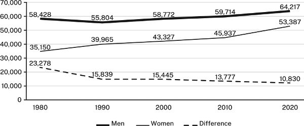

Fig­ure 13.2. Change in wage gap between men and wo­men, 1980–2020

Fig­ure 13.2. Change in wage gap between men and wo­men, 1980–2020

Choose the form that achieves the ef­fect you want, not the one that first comes to mind. If you are new to quant­it­at­ive re­search, limit your choices to ba­sic tables, bar charts, and line graphs. Your com­puter soft­ware of­fers more choices, but ig­nore those you are not fa­mil­iar with. If you are do­ing ad­vanced re­search, read­ers will ex­pect you to draw from a lar­ger range of graph­ics favored in your field. In that case, con­sult table 13.6, which de­scribes the rhet­or­ical uses of other com­mon forms. You may have to con­sider even more cre­at­ive ways of rep­res­ent­ing data if you are writ­ing a dis­ser­ta­tion or art­icle in a field that routinely dis­plays com­plex re­la­tion­ships in large data sets. (See the ap­pendix for ad­di­tional re­sources.)

What fol­lows is a guide to the ba­sics of tables, charts, and graphs.

13.3 Design­ing Tables, Charts, and Graphs

Present­a­tion soft­ware can cre­ate graph­ics so dazzling that many writers let their soft­ware de­term­ine their design. That is a mis­take. Read­ers don’t care how fancy a graphic is if it doesn’t com­mu­nic­ate its point clearly. Here are some prin­ciples for design­ing ef­fect­ive graph­ics.

13.3.1 Frame Each Graphic to Help Read­ers Un­der­stand It

A graphic rep­res­ent­ing com­plex re­la­tion­ships among num­bers rarely speaks for it­self. You must frame it to show read­ers what to see in it and how to un­der­stand its rel­ev­ance to your ar­gu­ment:

* 1\. La­bel every graphic in a way that de­scribes its data. For a table, the la­bel is called a _title_ and is set flush left above the table; for a fig­ure, the la­bel is called a _le­gend_ and is set flush left be­low the fig­ure. Keep titles and le­gends short but de­script­ive enough to dis­tin­guish every graphic from every other one. 

  * ▪ Avoid mak­ing the title or le­gend a gen­eral topic.

> NOT: Heads of house­holds
> 
> BUT: Changes in one- and two-par­ent heads of house­holds, 2005–2020

  * ▪ Do not give back­ground in­form­a­tion or char­ac­ter­ize what the data im­ply.

> NOT: Weaker ef­fects of coun­sel­ing on de­pressed chil­dren be­fore pro­fes­sion­al­iz­a­tion of staff, 2012–2022
> 
> BUT: Ef­fect of coun­sel­ing on de­pressed chil­dren, 2012–2022

  * ▪ Be sure la­bels dis­tin­guish graph­ics present­ing sim­ilar data.

> NOT: Risk factors for high blood pres­sure
> 
> BUT: Risk factors for high blood pres­sure among men in Cairo, Illinois

* 2\. In­sert into the table or fig­ure in­form­a­tion that helps read­ers see how the data sup­port your point. For ex­ample, if num­bers in a table show a trend and the size of the trend mat­ters, in­dic­ate the change in a fi­nal column. If a line on a graph changes in re­sponse to an in­flu­ence not men­tioned on the graph, add text to the im­age to ex­plain it. 

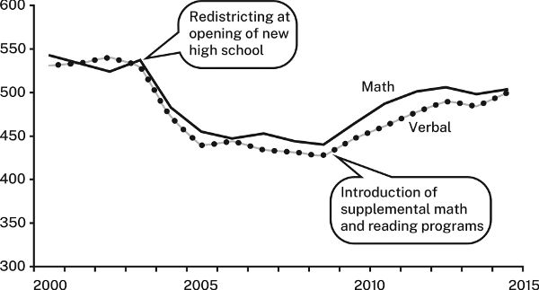

Fig­ure 13.3. SAT scores for Mid-City High, 2000–2015

>   1. Al­though read­ing and math scores de­clined by al­most 100 points fol­low­ing re­dis­trict­ing, that trend re­versed when sup­ple­mental math and read­ing pro­grams were in­tro­duced.
>   2. 3\. In­tro­duce the table or fig­ure with a sen­tence that ex­plains how to in­ter­pret it. Then high­light what in the table or fig­ure you want read­ers to fo­cus on, par­tic­u­larly any num­ber or re­la­tion­ship men­tioned in that in­tro­duct­ory sen­tence. For ex­ample, we have to study table 13.3 to un­der­stand how it sup­ports the sen­tence be­fore it:
>   3. Most pre­dic­tions about in­creased gas­ol­ine con­sump­tion have proved wrong.
> 

Table 13.3. US Do­mestic De­mand for Gas­ol­ine, 1990–2020 (in bil­lions of gal­lons)

|  1990 |  2000 |  2010 |  2020  
---|---|---|---|---  
An­nual con­sump­tion |  113.6 |  131.9 |  137.7 |  127.7  
  
We need a more in­form­at­ive title, a sen­tence to ex­plain how the num­bers sup­port or il­lus­trate the claim, and visual cues that guide us to what we should see in the table:

>   1. Gas­ol­ine con­sump­tion has not grown as pre­dicted. Through the 2000s and 2010s, gas­ol­ine con­sump­tion leveled off, and it even de­clined in 2020, likely as an ef­fect of quar­ant­in­ing dur­ing the COVID-19 pan­demic.
>

NOT: Heads of house­holds BUT: Changes in one- and two-par­ent heads of house­holds, 2005–2020

NOT: Heads of house­holds

BUT: Changes in one- and two-par­ent heads of house­holds, 2005–2020

NOT: Weaker ef­fects of coun­sel­ing on de­pressed chil­dren be­fore pro­fes­sion­al­iz­a­tion of staff, 2012–2022 BUT: Ef­fect of coun­sel­ing on de­pressed chil­dren, 2012–2022

NOT: Weaker ef­fects of coun­sel­ing on de­pressed chil­dren be­fore pro­fes­sion­al­iz­a­tion of staff, 2012–2022

BUT: Ef­fect of coun­sel­ing on de­pressed chil­dren, 2012–2022

NOT: Risk factors for high blood pres­sure BUT: Risk factors for high blood pres­sure among men in Cairo, Illinois

NOT: Risk factors for high blood pres­sure

BUT: Risk factors for high blood pres­sure among men in Cairo, Illinois

Fig­ure 13.3. SAT scores for Mid-City High, 2000–2015

Al­though read­ing and math scores de­clined by al­most 100 points fol­low­ing re­dis­trict­ing, that trend re­versed when sup­ple­mental math and read­ing pro­grams were in­tro­duced. 3. In­tro­duce the table or fig­ure with a sen­tence that ex­plains how to in­ter­pret it. Then high­light what in the table or fig­ure you want read­ers to fo­cus on, par­tic­u­larly any num­ber or re­la­tion­ship men­tioned in that in­tro­duct­ory sen­tence. For ex­ample, we have to study table 13.3 to un­der­stand how it sup­ports the sen­tence be­fore it: Most pre­dic­tions about in­creased gas­ol­ine con­sump­tion have proved wrong.

Table 13.3. US Do­mestic De­mand for Gas­ol­ine, 1990–2020 (in bil­lions of gal­lons)

1990

2000

2010

2020

An­nual con­sump­tion

113.6

131.9

137.7

127.7

We need a more in­form­at­ive title, a sen­tence to ex­plain how the num­bers sup­port or il­lus­trate the claim, and visual cues that guide us to what we should see in the table:

Gas­ol­ine con­sump­tion has not grown as pre­dicted. Through the 2000s and 2010s, gas­ol­ine con­sump­tion leveled off, and it even de­clined in 2020, likely as an ef­fect of quar­ant­in­ing dur­ing the COVID-19 pan­demic.

13.3.2 Keep All Graph­ics as Simple as Their Con­tent Al­lows

Some guides en­cour­age you to cram as much data as you can into a graphic. But read­ers want to see only the data rel­ev­ant to your point, free of dis­trac­tions. For all graph­ics:

* 1\. In­clude only rel­ev­ant data. To provide data only for the re­cord, la­bel it ac­cord­ingly and put it in an ap­pendix.
* 2\. Keep the visual im­pact simple. 

  * ▪ Box a graphic only if you group two or more fig­ures.
  * ▪ Do not color or shade the back­ground.

FOR TABLES

* ▪ Never use both ho­ri­zontal and ver­tical dark lines to di­vide columns and rows. Use light gray lines only if the table is com­plex or you want to fo­cus your reader’s at­ten­tion on its rows or its columns.
* ▪ For tables with many rows, lightly shade every fifth row.

FOR CHARTS AND GRAPHS

* ▪ Use back­ground grid lines only if the graphic is com­plex or read­ers need to see pre­cise num­bers. Make them light gray.
* ▪ Use pat­terns or shad­ing to mark a con­trast. Do not mark con­trasts us­ing col­ors or shades of color alone be­cause people with cer­tain visual impair­ments may not be able to dis­tin­guish them. In­stead, rely on pat­terns or (bet­ter) la­bels wherever pos­sible. Also, avoid us­ing color if your graphic will be prin­ted or pho­to­copied in black-and-white later.
* ▪ Never use iconic bars (for ex­ample, im­ages of cars to rep­res­ent auto­mobile pro­duc­tion) or three di­men­sions merely for ef­fect. Both look am­a­teur­ish and can dis­tort how read­ers judge val­ues.
* ▪ Plot data on three di­men­sions only when your read­ers are fa­mil­iar with such graphs and you can­not dis­play the data in any other way.
* 3\. Use clear la­bels. 

  * ▪ La­bel all rows and columns in tables and both axes in charts and graphs.
  * ▪ Use tick marks and la­bels to in­dic­ate in­ter­vals on the ver­tical axis of a graph.
  * ▪ If pos­sible, la­bel lines, bar seg­ments, and the like on the im­age rather than in a le­gend set to the side or be­low. Use a le­gend only if la­bels would make the im­age too com­plex to read eas­ily.
  * ▪ When spe­cific num­bers mat­ter, add them to bars or seg­ments in charts or to dots on lines in graphs.

13.4 Spe­cific Guidelines for Tables, Bar Charts, and Line Graphs

13.4.1 Tables

Tables with lots of data can seem dense, so or­gan­ize them to help read­ers.

* ▪ Or­der the rows and columns by a prin­ciple that em­phas­izes what you want read­ers to see. Do not auto­mat­ic­ally choose al­pha­betic or­der.
* ▪ Round num­bers to a rel­ev­ant value. If dif­fer­ences of less than 1,000 don’t mat­ter, then 2,123,499 is ir­rel­ev­antly pre­cise.
* ▪ Sum totals at the bot­tom of a column or at the end of a row, not at the top or left.

Com­pare tables 13.4 and 13.5:

Table 13.4. Un­em­ploy­ment in ma­jor in­dus­trial na­tions, 2000–2015

|  2000 |  2015 |  Change  
Aus­tralia |  5.2 |  6.1 |  1.0  
Canada |  8.0 |  6.9 |  (1.1)  
France |  9.7 |  10.7 |  1.0  
Ger­many |  7.1 |  5.2 |  (1.9)  
Italy |  8.4 |  11.9 |  3.5  
Ja­pan |  5.0 |  3.9 |  (1.1)  
Sweden |  8.6 |  7.7 |  (0.9)  
United King­dom |  7.9 |  6.6 |  (1.3)  
United States |  9.6 |  6.2 |  (3.4)

2000

2015

Change

Aus­tralia

5.2

6.1

1.0

Canada

8.0

6.9

(1.1)

France

9.7

10.7

1.0

Ger­many

7.1

5.2

(1.9)

Italy

8.4

11.9

3.5

Ja­pan

5.0

3.9

(1.1)

Sweden

8.6

7.7

(0.9)

United King­dom

7.9

6.6

(1.3)

United States

9.6

6.2

(3.4)

Table 13.4 looks cluttered, and its items aren’t help­fully or­gan­ized. In con­trast, table 13.5 is clearer be­cause it has an in­form­at­ive title, less visual clut­ter, and items or­gan­ized to let us see the pat­tern of changes in com­par­at­ive terms more eas­ily.

Table 13.5. Changes in un­em­ploy­ment rates of in­dus­trial na­tions, 2000–2015

|  2000 |  2015 |  Change  
United States |  9.6 |  6.2 |  (3.4)  
Ger­many |  7.1 |  5.2 |  (1.9)  
United King­dom |  7.9 |  6.6 |  (1.3)  
Canada |  8.0 |  6.9 |  (1.1)  
Ja­pan |  5.0 |  3.9 |  (1.1)  
Sweden |  8.6 |  7.7 |  (0.9)  
Aus­tralia |  5.2 |  6.2 |  1.0  
France |  9.7 |  10.7 |  1.0  
Italy |  8.4 |  11.9 |  3.5

2000

2015

Change

United States

9.6

6.2

(3.4)

Ger­many

7.1

5.2

(1.9)

United King­dom

7.9

6.6

(1.3)

Canada

8.0

6.9

(1.1)

Ja­pan

5.0

3.9

(1.1)

Sweden

8.6

7.7

(0.9)

Aus­tralia

5.2

6.2

1.0

France

9.7

10.7

1.0

Italy

8.4

11.9

3.5

13.4.2 Bar Charts

Bar charts com­mu­nic­ate as much by visual im­pact as by spe­cific num­bers. But bars ar­ranged in no pat­tern im­ply no point. If pos­sible, group and ar­range bars to cre­ate an im­age that matches your mes­sage. For ex­ample, look at fig­ure 13.4 in the con­text of the ex­plan­at­ory sen­tence be­fore it. The items are lis­ted al­pha­bet­ic­ally, an or­der that doesn’t help read­ers see the point:

Most of the world’s deserts are con­cen­trated in North Africa and the Middle East.

Most of the world’s deserts are con­cen­trated in North Africa and the Middle East.

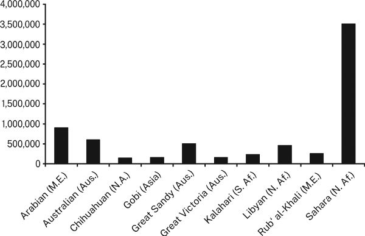

Fig­ure 13.4. World’s ten largest deserts

Fig­ure 13.4. World’s ten largest deserts

In con­trast, fig­ure 13.5 on the next page sup­ports the claim “Most of the world’s deserts are con­cen­trated in North Africa and the Middle East” with a cor­res­pond­ing im­age.

· · ·

In stand­ard bar charts, each bar rep­res­ents 100 per­cent of a whole. But some­times read­ers need to see spe­cific num­bers for parts of the whole. You can provide them in two ways:

* ▪ Di­vide the bars into pro­por­tional parts, cre­at­ing a “stacked” bar.
* ▪ Give each part of the whole its own bar, then group the parts into clusters.

Fig­ure 13.5. World dis­tri­bu­tion of large deserts

Fig­ure 13.5. World dis­tri­bu­tion of large deserts

Use stacked bars only when you want read­ers to com­pare whole val­ues for dif­fer­ent bars rather than their di­vided seg­ments, be­cause read­ers can’t eas­ily com­pare the pro­por­tions of seg­ments by eye alone. If you do use stacked bars, do this:

* ▪ Ar­range seg­ments in a lo­gical or­der. If pos­sible, put the largest seg­ment at the bot­tom in the darkest shade.
* ▪ La­bel seg­ments with spe­cific num­bers to as­sist com­par­is­ons; con­nect cor­res­pond­ing seg­ments with gray lines.

Com­pare fig­ures 13.6 and 13.7 on the fa­cing page.

If you group bars be­cause seg­ments are as im­port­ant as the wholes, do this:

* ▪ Ar­range groups in a lo­gical or­der; if pos­sible, put bars of sim­ilar size next to one an­other (or­der bars in the same way through all the groups).
* ▪ La­bel groups with the num­ber for the whole, either above each group or be­low the la­bels on the bot­tom.

Most data that fit a bar chart can also be shown in a pie chart. Pie charts are pop­u­lar in magazines, tabloids, and an­nual re­ports. While splashy, they are harder to read than bar charts. Read­ers must com­pare pro­por­tions of seg­ments whose sizes are of­ten hard to judge. But pie charts have their place, es­pe­cially to com­mu­nic­ate qual­it­at­ive im­pres­sions about the com­par­at­ive size of data, either to show that one seg­ment is dis­pro­por­tion­ately lar­ger than the rest or that the data are di­vided into many small seg­ments. Avoid us­ing pie charts to con­vey quant­it­at­ive data in any de­tail. For that, use bar charts.

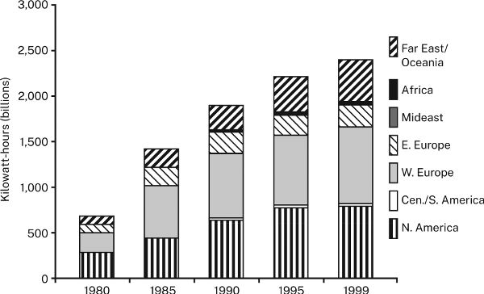

Fig­ure 13.6. World gen­er­a­tion of nuc­lear en­ergy, 1980–1999

Fig­ure 13.6. World gen­er­a­tion of nuc­lear en­ergy, 1980–1999

Fig­ure 13.7. Largest gen­er­at­ors of nuc­lear en­ergy, 1980–1999

Fig­ure 13.7. Largest gen­er­at­ors of nuc­lear en­ergy, 1980–1999

13.4.3 Line Graphs

Be­cause a line graph em­phas­izes trends, read­ers must see a clear im­age to in­ter­pret it cor­rectly. Do the fol­low­ing:

* ▪ Choose the vari­able that makes the line go in the dir­ec­tion, up or down, that sup­ports your point. If the good news is a re­duc­tion (down) in high school dro­pouts, you can more ef­fect­ively rep­res­ent the same data as a rising line in­dic­at­ing in­crease in re­ten­tion (up). If you want to em­phas­ize bad news, find a way to rep­res­ent your data as a fall­ing line.
* ▪ Plot more than six lines on one graph only if you can­not make your point in any other way.
* ▪ If you have fewer than ten or so data points, in­dic­ate them with dots. If only a few are rel­ev­ant, in­sert num­bers to show their ex­act value.
* ▪ Do not de­pend on dif­fer­ent shades of gray to dis­tin­guish lines, as in fig­ure 13.8.

Com­pare fig­ure 13.8 and fig­ure 13.9 on the fa­cing page.

Fig­ure 13.8 is harder to read be­cause the shades of gray do not dis­tin­guish the lines well against the back­ground and be­cause our eyes have to flick back and forth to con­nect the lines to the le­gend. Fig­ure 13.9 makes those con­nec­tions clearer.

These dif­fer­ent ways of show­ing the same data can be con­fus­ing, so test dif­fer­ent op­tions. Con­struct al­tern­at­ive graph­ics, then ask someone un­fa­mil­iar with the data to judge those al­tern­at­ives for im­pact and clar­ity. Be sure to in­tro­duce the fig­ures with a sen­tence that states the claim you want them to sup­port.

13.5 Rep­res­ent­ing Data Eth­ic­ally

Your graphic must be not only clear and ac­cur­ate, but hon­est. Do not dis­tort the im­age of the data to make your point. On page 230, the two bar charts dis­play identical data, yet im­ply dif­fer­ent mes­sages.

Fig­ure 13.8. For­eign-born res­id­ents in the United States, 1870–1990

Fig­ure 13.8. For­eign-born res­id­ents in the United States, 1870–1990

Fig­ure 13.9. For­eign-born res­id­ents in the United States, 1870–1990

Fig­ure 13.9. For­eign-born res­id­ents in the United States, 1870–1990

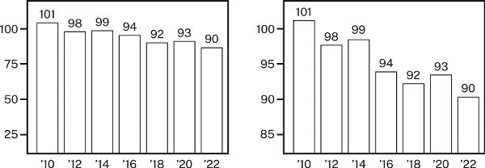

Fig­ure 13.10. Cap­itol City pol­lu­tion in­dex, 2010–2022

Fig­ure 13.10. Cap­itol City pol­lu­tion in­dex, 2010–2022

The 0–100 scale on the left in fig­ure 13.10 cre­ates a fairly flat slope, which makes the drop in pol­lu­tion seem small. The ver­tical scale on the right, how­ever, be­gins not at 0 but at 80. When a scale is so trun­cated, it cre­ates a sharper slope that ex­ag­ger­ates small con­trasts.

Graphs can also mis­lead by im­ply­ing false cor­rel­a­tions. Someone might claim that un­em­ploy­ment goes down as union mem­ber­ship goes down and of­fer fig­ure 13.11 as evid­ence. And in­deed, in that graph, union mem­ber­ship and the un­em­ploy­ment rate do seem to move to­gether so closely that a reader might in­fer one causes the other:

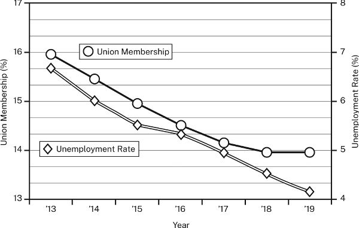

Fig­ure 13.11. Union mem­ber­ship and un­em­ploy­ment rate, 2013–2019

Fig­ure 13.11. Union mem­ber­ship and un­em­ploy­ment rate, 2013–2019

But the scale for the left axis (union mem­ber­ship) dif­fers from the scale for the right axis (the un­em­ploy­ment rate), mak­ing it seem that the two trends could be caus­ally re­lated. They may be, but that dis­tor­ted im­age doesn’t prove it.

Graphs can also mis­lead when they en­cour­age read­ers to mis­judge val­ues. The two charts in fig­ure 13.12 rep­res­ent ex­actly the same data but seem to com­mu­nic­ate dif­fer­ent mes­sages:

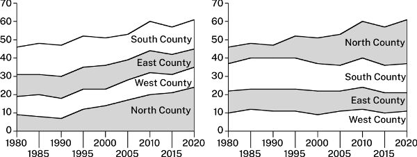

Fig­ure 13.12. Rep­res­ent­a­tion of col­lar counties in state uni­ver­sity un­der­gradu­ates (per­cent of total), 1980–2020

Fig­ure 13.12. Rep­res­ent­a­tion of col­lar counties in state uni­ver­sity un­der­gradu­ates (per­cent of total), 1980–2020

The charts in fig­ure 13.12 are both stacked area charts. Charts such as these rep­res­ent changes in val­ues not by the angles of the lines, but by the areas between them. In both charts, the bands for south, east, and west are roughly the same width through­out, in­dic­at­ing little change in the val­ues they rep­res­ent. The band for the north, how­ever, widens sharply, rep­res­ent­ing a sharp in­crease in the num­bers it rep­res­ents. In the chart on the left, read­ers could eas­ily mis­judge the top three bands, be­cause they are on top of the rising north band, mak­ing those bands seem to rise as well. In the chart on the right, on the other hand, those three bands do not rise be­cause they are on the bot­tom. Now only the band for the north rises.

Here are four guidelines for avoid­ing visual mis­rep­res­ent­a­tion:

* ▪ Do not ma­nip­u­late a scale to mag­nify or re­duce a con­trast.
* ▪ Do not use a fig­ure whose im­age dis­torts val­ues.
* ▪ Do not make a table or fig­ure un­ne­ces­sar­ily com­plex or mis­lead­ingly simple.
* ▪ If the table or fig­ure sup­ports a point, state it.

Table 13.6. Com­mon graphic forms and their uses

Data |  Rhet­or­ical Uses

Data

Rhet­or­ical Uses

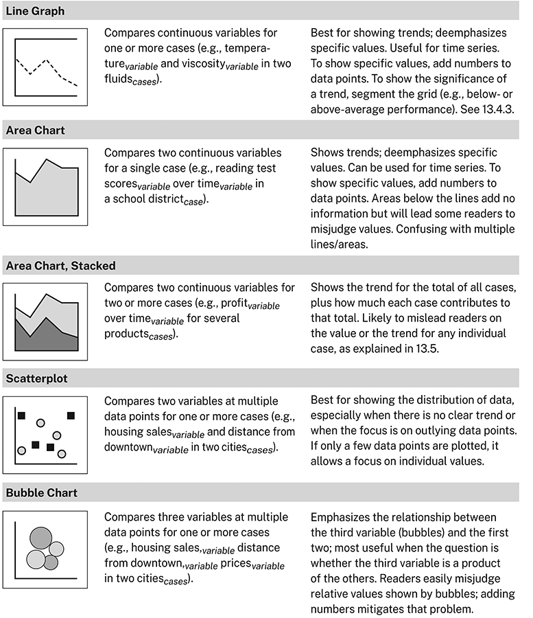

▶ Quick Tip: Look for Op­por­tun­it­ies to In­clude Visual Evid­ence

In­creas­ingly, pa­pers and present­a­tions in all fields are mul­timodal—that is, they in­clude visual as well as verbal in­form­a­tion. Mul­timodal ar­gu­ments have long been the norm in the nat­ural sci­ences and many so­cial sci­ences and are be­com­ing ac­cep­ted in fields that have tra­di­tion­ally avoided them. More than ever then, be­gin­ning re­search­ers must learn how and when to present data or in­form­a­tion in graphic form, rather than in words alone. Even if your pa­per or present­a­tion doesn’t need visual evid­ence, it might be­ne­fit from hav­ing it be­cause mul­tiple modes of rep­res­ent­ing evid­ence, work­ing to­gether, make it more likely that your audi­ence will un­der­stand and be con­vinced by your ar­gu­ments. So be on the lookout for op­por­tun­it­ies to rep­res­ent that data visu­ally:

* ▪ **No­tice how sources in your field use visual evid­ence.** Pay at­ten­tion not just to the kinds of data or in­form­a­tion that get rep­res­en­ted but to the forms those rep­res­ent­a­tions take.
* ▪ **Ask ex­per­i­enced re­search­ers how they use visual evid­ence in their own work.** When you un­der­stand the choices ex­perts make, you will make bet­ter choices your­self.
* ▪ **De­cide to use at least one graphic in your pa­per.** That de­cision alone will fo­cus your at­ten­tion on ways you can use visual evid­ence in your ar­gu­ment.
* ▪ **Ask your teach­ers for as­sign­ments that in­vite the use of visual evid­ence.** Most teach­ers ap­pre­ci­ate it when stu­dents as­pire to make moves in their own work that they see and ad­mire in their sources. Even if your as­sign­ment doesn’t ex­pli­citly call for you to use graph­ics, don’t be shy about ask­ing your teach­ers for the op­tion to do so.

---

## ▶ Quick Tip: Use Key Terms in Titles

14 In­tro­duc­tions and Con­clu­sions

A good in­tro­duc­tion en­cour­ages read­ers to read your work with in­terest and pre­pares them to un­der­stand it bet­ter. A good con­clu­sion leaves them with a clear state­ment of your point and re­newed ap­pre­ci­ation of its sig­ni­fic­ance. In this chapter, we show you how to write both. The time you spend on your in­tro­duc­tion and con­clu­sion may be your most im­port­ant.

Once you think you have a draft that works, you’re ready to write your fi­nal in­tro­duc­tion and con­clu­sion. Some writers think that means fol­low­ing the stand­ard ad­vice: Grab their at­ten­tion with some­thing snappy or cute. That ad­vice is not use­less, but your audi­ence wants more than cute and snappy. In part I, we showed you how to de­velop a pro­ject around a re­search prob­lem. Here, we show you how to use that prob­lem to en­gage your audi­ence. A catchy open­ing might spark read­ers’ at­ten­tion, but what keeps their at­ten­tion is a prob­lem they think needs a solu­tion and a prom­ise that you have found it. As we have said, you can al­ways work with read­ers who say, I don’t agree. You can’t do much with those who shrug and say, I don’t care.

14.1 The Com­mon Struc­ture of In­tro­duc­tions

As we have noted, dif­fer­ent re­search com­munit­ies do things in dif­fer­ent ways. While their in­tro­duc­tions may look dif­fer­ent on the sur­face, their un­der­ly­ing struc­tures are the same. Con­sider these three con­densed ex­amples from the fields of cul­tural cri­ti­cism, com­puter design, and legal his­tory:

(1) Why can’t a ma­chine be more like a man? In al­most every epis­ode of Star Trek: The Next Gen­er­a­tion, the an­droid Data won­ders what makes a per­son a per­son. In the ori­ginal Star Trek, sim­ilar ques­tions were raised by the half-Vul­can Mr. Spock, whose status as a per­son was un­der­mined by his ma­chine­like lo­gic and lack of emo­tion. In fact, Data and Spock are only two ex­amples of “quasi-per­sons” who have ex­plored the nature of hu­man­ity. The same ques­tion has been raised by and about creatures ran­ging from Franken­stein’s mon­ster to the Ter­min­ator. But the real ques­tion is why these char­ac­ters who struggle to be per­sons are al­most al­ways white and male. As cul­tural in­ter­pret­ers, do they ta­citly re­in­force de­struct­ive ste­reo­types of what it means to be “nor­mal”? The model per­son seems in fact to be defined by West­ern cri­teria that ex­clude most of the people in the world. (2) As part of its pro­gram of Con­tinu­ous Qual­ity Im­prove­ment (CQI), Mo­to­dyne Com­puters plans to re­design the user in­ter­face for its Uni­dyneTM on­line help sys­tem. The spe­cific­a­tions for its in­ter­face call for self-ex­plan­at­ory icons that let users identify their func­tion without verbal la­bels. Mo­to­dyne has three years’ ex­per­i­ence with its cur­rent icon set, but it has no data show­ing which icons are self-ex­plan­at­ory. Lack­ing such data, we can­not de­term­ine which icons to re­design. This re­port provides data for el­even icons, show­ing that five of them are not self-ex­plan­at­ory. (3) In today’s so­ci­ety, would Ma­jor John An­dré, a Brit­ish spy in ci­vil­ian clothes cap­tured be­hind Amer­ican lines in 1780, be hanged? Though con­sidered a noble pat­riot, he suffered the pun­ish­ment man­dated by mil­it­ary law. Over time our tra­di­tions have changed, but the pun­ish­ment for spy­ing has not. It is the only of­fense that man­dates death. Re­cently, how­ever, the Su­preme Court has re­jec­ted man­dat­ory death sen­tences in ci­vil­ian cases, cre­at­ing an am­bi­gu­ity in their ap­plic­a­tion to mil­it­ary cases. If Su­preme Court de­cisions ap­ply to the mil­it­ary, will Con­gress have to re­vise the Uni­form Code of Mil­it­ary Justice? This art­icle con­cludes that it will.

(1) Why can’t a ma­chine be more like a man? In al­most every epis­ode of Star Trek: The Next Gen­er­a­tion, the an­droid Data won­ders what makes a per­son a per­son. In the ori­ginal Star Trek, sim­ilar ques­tions were raised by the half-Vul­can Mr. Spock, whose status as a per­son was un­der­mined by his ma­chine­like lo­gic and lack of emo­tion. In fact, Data and Spock are only two ex­amples of “quasi-per­sons” who have ex­plored the nature of hu­man­ity. The same ques­tion has been raised by and about creatures ran­ging from Franken­stein’s mon­ster to the Ter­min­ator. But the real ques­tion is why these char­ac­ters who struggle to be per­sons are al­most al­ways white and male. As cul­tural in­ter­pret­ers, do they ta­citly re­in­force de­struct­ive ste­reo­types of what it means to be “nor­mal”? The model per­son seems in fact to be defined by West­ern cri­teria that ex­clude most of the people in the world.

(2) As part of its pro­gram of Con­tinu­ous Qual­ity Im­prove­ment (CQI), Mo­to­dyne Com­puters plans to re­design the user in­ter­face for its Uni­dyneTM on­line help sys­tem. The spe­cific­a­tions for its in­ter­face call for self-ex­plan­at­ory icons that let users identify their func­tion without verbal la­bels. Mo­to­dyne has three years’ ex­per­i­ence with its cur­rent icon set, but it has no data show­ing which icons are self-ex­plan­at­ory. Lack­ing such data, we can­not de­term­ine which icons to re­design. This re­port provides data for el­even icons, show­ing that five of them are not self-ex­plan­at­ory.

(3) In today’s so­ci­ety, would Ma­jor John An­dré, a Brit­ish spy in ci­vil­ian clothes cap­tured be­hind Amer­ican lines in 1780, be hanged? Though con­sidered a noble pat­riot, he suffered the pun­ish­ment man­dated by mil­it­ary law. Over time our tra­di­tions have changed, but the pun­ish­ment for spy­ing has not. It is the only of­fense that man­dates death. Re­cently, how­ever, the Su­preme Court has re­jec­ted man­dat­ory death sen­tences in ci­vil­ian cases, cre­at­ing an am­bi­gu­ity in their ap­plic­a­tion to mil­it­ary cases. If Su­preme Court de­cisions ap­ply to the mil­it­ary, will Con­gress have to re­vise the Uni­form Code of Mil­it­ary Justice? This art­icle con­cludes that it will.

The top­ics and prob­lems posed in those three in­tro­duc­tions dif­fer as much as their in­ten­ded audi­ences, but be­hind them is a shared pat­tern that read­ers look for in all in­tro­duc­tions, re­gard­less of field. That com­mon struc­ture con­sists of three ele­ments:

* ▪ state­ment of the con­text
* ▪ state­ment of the prob­lem
* ▪ state­ment of a re­sponse

Not every in­tro­duc­tion has all three ele­ments, but most do.

Here is that pat­tern of con­text + prob­lem + re­sponse in each of those in­tro­duc­tions:

(1) CON­TEXT: Why can’t a ma­chine be more like a man? ... The same ques­tion has been raised by and about creatures ran­ging from Franken­stein’s mon­ster to the Ter­min­ator. PROB­LEM: But the real ques­tion is ... do they ta­citly re­in­force de­struct­ive ste­reo­types of what it means to be “nor­mal”? RE­SPONSE: The model per­son seems in fact to be defined by West­ern cri­teria that ex­clude most of the people in the world.

(1) CON­TEXT: Why can’t a ma­chine be more like a man? ... The same ques­tion has been raised by and about creatures ran­ging from Franken­stein’s mon­ster to the Ter­min­ator.

PROB­LEM: But the real ques­tion is ... do they ta­citly re­in­force de­struct­ive ste­reo­types of what it means to be “nor­mal”?

RE­SPONSE: The model per­son seems in fact to be defined by West­ern cri­teria that ex­clude most of the people in the world.

(2) CON­TEXT: As part of its pro­gram of Con­tinu­ous Qual­ity Im­prove­ment (CQI), Mo­to­dyne Com­puters plans to re­design the user in­ter­face... Mo­to­dyne has three years’ ex­per­i­ence with its cur­rent icon set ... PROB­LEM: ... but it has no data show­ing which icons are self-ex­plan­at­ory. Lack­ing such data, we can­not de­term­ine which icons to re­design. RE­SPONSE: This re­port provides data for el­even icons, show­ing that five of them are not self-ex­plan­at­ory.

(2) CON­TEXT: As part of its pro­gram of Con­tinu­ous Qual­ity Im­prove­ment (CQI), Mo­to­dyne Com­puters plans to re­design the user in­ter­face... Mo­to­dyne has three years’ ex­per­i­ence with its cur­rent icon set ...

PROB­LEM: ... but it has no data show­ing which icons are self-ex­plan­at­ory. Lack­ing such data, we can­not de­term­ine which icons to re­design.

RE­SPONSE: This re­port provides data for el­even icons, show­ing that five of them are not self-ex­plan­at­ory.

(3) CON­TEXT: In today’s so­ci­ety, would Ma­jor John An­dré ... be hanged [for spy­ing]? ... It is the only of­fense that man­dates death. PROB­LEM: Re­cently, how­ever, the Su­preme Court has re­jec­ted man­dat­ory death sen­tences in ci­vil­ian cases, cre­at­ing an am­bi­gu­ity in their ap­plic­a­tion to mil­it­ary cases... [W]ill Con­gress have to re­vise the Uni­form Code of Mil­it­ary Justice? RE­SPONSE: This art­icle con­cludes that it will.

(3) CON­TEXT: In today’s so­ci­ety, would Ma­jor John An­dré ... be hanged [for spy­ing]? ... It is the only of­fense that man­dates death.

PROB­LEM: Re­cently, how­ever, the Su­preme Court has re­jec­ted man­dat­ory death sen­tences in ci­vil­ian cases, cre­at­ing an am­bi­gu­ity in their ap­plic­a­tion to mil­it­ary cases... [W]ill Con­gress have to re­vise the Uni­form Code of Mil­it­ary Justice?

RE­SPONSE: This art­icle con­cludes that it will.

Each of those ele­ments plays its own role in mo­tiv­at­ing read­ers to read your pa­per and in help­ing them to un­der­stand it.

14.2 Step 1: Stat­ing a Con­text

Con­sider the open­ing of a fairy tale:

One sunny morn­ing Little Red Rid­ing Hood was skip­ping through the forest on her way to Grand­mother’s house.stable con­text [ima­gine but­ter­flies dan­cing around her head to flutes and vi­ol­ins]

One sunny morn­ing Little Red Rid­ing Hood was skip­ping through the forest on her way to Grand­mother’s house.stable con­text [ima­gine but­ter­flies dan­cing around her head to flutes and vi­ol­ins]

Like the open­ing to most fairy tales, this one es­tab­lishes a stable, even happy con­text, just so that it can be dis­rup­ted with a prob­lem:

... when sud­denly Hungry Wolf jumped out from be­hind a treedis­rupt­ing con­di­tion [ima­gine trom­bones and tu­bas] fright­en­ing her [and, if they’ve lost them­selves in the story, little chil­dren as well].cost

... when sud­denly Hungry Wolf jumped out from be­hind a treedis­rupt­ing con­di­tion [ima­gine trom­bones and tu­bas] fright­en­ing her [and, if they’ve lost them­selves in the story, little chil­dren as well].cost

The rest of the story elab­or­ates that prob­lem and then re­solves it.

Most in­tro­duc­tions fol­low the same strategy. To es­tab­lish com­mon ground—a shared un­der­stand­ing between audi­ence and writer about the lar­ger is­sue the writer will ad­dress—they state a stable con­text, some ap­par­ently un­prob­lem­atic ac­count of what is already known or ac­cep­ted. The writer then dis­rupts it with a prob­lem, say­ing in ef­fect: Reader, you may think you know some­thing, but your know­ledge is im­per­fect or in­com­plete.

(3) STABLE CON­TEXT: In today’s so­ci­ety, would Ma­jor John An­dré, a Brit­ish spy ... be hanged? ... [Spy­ing] is the only of­fense that man­dates death. DIS­RUPT­ING PROB­LEM: Re­cently, how­ever, the Su­preme Court has re­jec­ted man­dat­ory death sen­tences...

(3) STABLE CON­TEXT: In today’s so­ci­ety, would Ma­jor John An­dré, a Brit­ish spy ... be hanged? ... [Spy­ing] is the only of­fense that man­dates death.

DIS­RUPT­ING PROB­LEM: Re­cently, how­ever, the Su­preme Court has re­jec­ted man­dat­ory death sen­tences...

Writers some­times skip the con­text when they are sure their read­ers already re­cog­nize their prob­lem as a prob­lem, usu­ally be­cause it is well es­tab­lished in a par­tic­u­lar re­search com­munity. This in­tro­duc­tion opens dir­ectly with a prob­lem:

The most re­cent sci­entific mod­els pre­dict that rising sea levels will threaten the world’s coastal cit­ies well be­fore the end of this cen­tury.

The most re­cent sci­entific mod­els pre­dict that rising sea levels will threaten the world’s coastal cit­ies well be­fore the end of this cen­tury.

But usu­ally, read­ers need some con­text to un­der­stand a prob­lem’s sig­ni­fic­ance, so writers in­tro­duce it with the seem­ingly un­prob­lem­atic con­text of an ac­cep­ted un­der­stand­ing or prior re­search, spe­cific­ally so they can dis­rupt it:

Be­cause of their ef­fect­ive­ness in lower­ing cho­les­terol and seem­ingly minor side ef­fects, stat­ins have long been pre­scribed as a routine pre­vent­at­ive treat­ment for car­di­ovas­cu­lar dis­ease and strokes.stable con­text How­ever, sev­eral stud­ies con­duc­ted in the 2010s sug­ges­ted that stat­ins may in­crease risk of cog­nit­ive impair­ment and de­men­tia,destabil­iz­ing con­di­tion lead­ing to some un­cer­tainty in the med­ical com­munity about their wide­spread use.con­sequence

Be­cause of their ef­fect­ive­ness in lower­ing cho­les­terol and seem­ingly minor side ef­fects, stat­ins have long been pre­scribed as a routine pre­vent­at­ive treat­ment for car­di­ovas­cu­lar dis­ease and strokes.stable con­text How­ever, sev­eral stud­ies con­duc­ted in the 2010s sug­ges­ted that stat­ins may in­crease risk of cog­nit­ive impair­ment and de­men­tia,destabil­iz­ing con­di­tion lead­ing to some un­cer­tainty in the med­ical com­munity about their wide­spread use.con­sequence

Read­ers now have not one reason to be in­ter­ested in the prob­lem, but two: not just the prob­lem it­self, but also their in­com­plete un­der­stand­ing of the whole mat­ter.

Your con­text can de­scribe a mis­un­der­stand­ing:

The Cru­sades are widely be­lieved to have been mo­tiv­ated by re­li­gious zeal to re­store the Holy Land to Christen­dom.stable con­text In fact, the motives were at least partly, if not largely, polit­ical.

The Cru­sades are widely be­lieved to have been mo­tiv­ated by re­li­gious zeal to re­store the Holy Land to Christen­dom.stable con­text In fact, the motives were at least partly, if not largely, polit­ical.

It can sur­vey ob­sol­ete un­der­stand­ings or re­search:

Few so­ci­olo­gical con­cepts have fallen out of fa­vor as fast as the no­tion that re­li­gious faith provides a pro­tect­ive in­flu­ence against sui­cide. Once one of so­ci­ology’s ba­sic be­liefs, it has been called into ques­tion by a series of re­cent stud­ies... stable con­text How­ever, cer­tain stud­ies still find an ef­fect of re­li­gion ...

Few so­ci­olo­gical con­cepts have fallen out of fa­vor as fast as the no­tion that re­li­gious faith provides a pro­tect­ive in­flu­ence against sui­cide. Once one of so­ci­ology’s ba­sic be­liefs, it has been called into ques­tion by a series of re­cent stud­ies... stable con­text How­ever, cer­tain stud­ies still find an ef­fect of re­li­gion ...

Or it can point to a mis­un­der­stand­ing about the prob­lem it­self:

Amer­ican edu­ca­tion has fo­cused on teach­ing chil­dren to think crit­ic­ally, to ask ques­tions and test an­swers.stable con­text But the field of crit­ical think­ing has been taken over by fads and spe­cial in­terests.

Amer­ican edu­ca­tion has fo­cused on teach­ing chil­dren to think crit­ic­ally, to ask ques­tions and test an­swers.stable con­text But the field of crit­ical think­ing has been taken over by fads and spe­cial in­terests.

Some in­ex­per­i­enced re­search­ers skimp on con­text, open­ing their pa­pers as if they were pick­ing up a class con­ver­sa­tion where it left off. Their in­tro­duc­tions are so sketchy that only oth­ers in the course would un­der­stand them:

In view of Hof­stadter’s fail­ure to re­spect the dif­fer­ences among math, mu­sic, and art, it is not sur­pris­ing that the re­sponse to The Em­bod­ied Mind would be stormy. It is less clear what caused the con­tro­versy. I will ar­gue that any ac­count of the hu­man mind must be in­ter­dis­cip­lin­ary...

In view of Hof­stadter’s fail­ure to re­spect the dif­fer­ences among math, mu­sic, and art, it is not sur­pris­ing that the re­sponse to The Em­bod­ied Mind would be stormy. It is less clear what caused the con­tro­versy. I will ar­gue that any ac­count of the hu­man mind must be in­ter­dis­cip­lin­ary...

When you draft your in­tro­duc­tion, ima­gine you are writ­ing to someone who has read some of the same sources as you and is gen­er­ally in­ter­ested in the same is­sues, but does not know what spe­cific­ally happened in your class.

Oth­ers make the op­pos­ite mis­take, think­ing they should list every source they read that re­motely touches their topic. Sur­vey only those sources whose find­ings you will dir­ectly modify. Add more only if you need to loc­ate the prob­lem in a wider con­text.

14.3 Step 2: Stat­ing Your Prob­lem

Once you state a stable con­text, dis­rupt it with a prob­lem (see chapter 2). As we have said, the state­ment of a re­search prob­lem has two parts:

* ▪ a _con­di­tion_ of in­com­plete know­ledge or un­der­stand­ing, and
* ▪ the _con­sequences_ of that con­di­tion, a more sig­ni­fic­ant gap in un­der­stand­ing

You can state the con­di­tion dir­ectly:

... but Mo­to­dyne has no data show­ing which icons are self-ex­plan­at­ory.

... but Mo­to­dyne has no data show­ing which icons are self-ex­plan­at­ory.

Or you can im­ply it in an in­dir­ect ques­tion:

The real ques­tion is why these char­ac­ters are al­most al­ways white and male.

The real ques­tion is why these char­ac­ters are al­most al­ways white and male.

You make this con­di­tion of ig­nor­ance or flawed un­der­stand­ing part of a full re­search prob­lem only when you ima­gine someone ask­ing, So what?, and then spell out as an an­swer that con­di­tion’s con­sequence. You can state that con­sequence as a dir­ect cost:

Lack­ing such data, we can­not de­term­ine which icons to re­design.cost

Lack­ing such data, we can­not de­term­ine which icons to re­design.cost

Or you can trans­form the cost into a be­ne­fit:

With such data, we could de­term­ine which icons to re­design.be­ne­fit

With such data, we could de­term­ine which icons to re­design.be­ne­fit

The choice between stat­ing a cost and stat­ing a be­ne­fit is not just a mat­ter of style. Read­ers are typ­ic­ally more mo­tiv­ated by a real cost than by a po­ten­tial be­ne­fit. Our sug­ges­tion: state costs or con­sequences when present­ing your prob­lem; state be­ne­fits to in­tensify your solu­tion.

That’s the stand­ard way to state a prob­lem, but there are op­tions.

14.3.1 Should You State the Con­di­tion of a Prob­lem Ex­pli­citly?

Oc­ca­sion­ally, you tackle a prob­lem so fa­mil­iar that its name im­plies both its con­di­tion and con­sequence to those in the field: the role of DNA in per­son­al­ity; Shakespeare’s know­ledge of lan­guages. Like­wise, in some fields like math­em­at­ics and the nat­ural sci­ences, many re­search prob­lems are widely known, so just stat­ing the con­di­tion is enough to bring to mind its con­sequence. Here again is that (con­densed) in­tro­duc­tion to Crick and Wat­son’s land­mark ac­count of the double-helix struc­ture of DNA:

We wish to sug­gest a struc­ture for the salt of deoxyribose nuc­leic acid (D.N.A.). This struc­ture has novel fea­tures which are of con­sid­er­able bio­lo­gical in­terest. A struc­ture for nuc­leic acid has already been pro­posed by Paul­ing and Corey. They kindly made their ma­nu­script avail­able to us in ad­vance of pub­lic­a­tion. Their model con­sists of three in­ter­twined chains, with the phos­phates near the fibre axis, and the bases on the out­side. In our opin­ion, this struc­ture is un­sat­is­fact­ory...

We wish to sug­gest a struc­ture for the salt of deoxyribose nuc­leic acid (D.N.A.). This struc­ture has novel fea­tures which are of con­sid­er­able bio­lo­gical in­terest. A struc­ture for nuc­leic acid has already been pro­posed by Paul­ing and Corey. They kindly made their ma­nu­script avail­able to us in ad­vance of pub­lic­a­tion. Their model con­sists of three in­ter­twined chains, with the phos­phates near the fibre axis, and the bases on the out­side. In our opin­ion, this struc­ture is un­sat­is­fact­ory...

It was enough for them merely to “sug­gest” a struc­ture for DNA, be­cause they knew every­one wanted to know what it was. (Note, though, that they do raise a prob­lem by men­tion­ing Paul­ing and Corey’s in­cor­rect model.)

In the nat­ural sci­ences and most so­cial sci­ences, re­search­ers usu­ally ad­dress ques­tions fa­mil­iar to their read­ers. In these fields, you might think you do not need to spell out your prob­lem. But read­ers will not know the par­tic­u­lar gap in their know­ledge that your re­search will fill un­less you tell them.

In the hu­man­it­ies and some so­cial sci­ences, re­search­ers more of­ten pose ques­tions that they alone have found or even in­ven­ted, ques­tions that read­ers find new and of­ten sur­pris­ing. In these fields, you must ex­pli­citly de­scribe the im­per­fect or in­com­plete un­der­stand­ing that you in­tend to rem­edy.

14.3.2 Should You State Con­sequences and Be­ne­fits?

For read­ers to take your prob­lem ser­i­ously, they must re­cog­nize the cost they will pay if it is not re­solved or the be­ne­fits they will gain if it is. When these costs and be­ne­fits are ob­vi­ous, not just for you but for your read­ers, you may omit them. But if not, you need to make them ex­pli­cit. If in doubt, state them.

Some­times you can de­scribe tan­gible costs that your re­search helps your read­ers avoid:

Last year the River City Su­per­visors agreed that River City should add the Bay­side de­vel­op­ment to its tax base. Their plan, how­ever, was based on little eco­nomic ana­lysis. If the Board votes to an­nex Bay­side without un­der­stand­ing what it will cost the city, the Board risks worsen­ing River City’s already shaky fiscal situ­ation. When the bur­den of bring­ing sewer and wa­ter ser­vice up to city code are in­cluded in the ana­lysis, the an­nex­a­tion will cost more than the Board as­sumes.

Last year the River City Su­per­visors agreed that River City should add the Bay­side de­vel­op­ment to its tax base. Their plan, how­ever, was based on little eco­nomic ana­lysis. If the Board votes to an­nex Bay­side without un­der­stand­ing what it will cost the city, the Board risks worsen­ing River City’s already shaky fiscal situ­ation. When the bur­den of bring­ing sewer and wa­ter ser­vice up to city code are in­cluded in the ana­lysis, the an­nex­a­tion will cost more than the Board as­sumes.

This is how to in­tro­duce a prob­lem of ap­plied re­search, in which the area of ig­nor­ance (no eco­nomic ana­lysis) has tan­gible con­sequences (higher costs). To in­tro­duce a prob­lem of pure re­search, you ex­plain the con­sequence not in tan­gible terms such as money but as mis­un­der­stand­ing or, al­tern­at­ively, as the pos­sible be­ne­fit of bet­ter un­der­stand­ing:

For dec­ades, Amer­ican cit­ies have an­nexed up­scale neigh­bor­hoods to prop up tax bases, of­ten bring­ing dis­ap­point­ing eco­nomic be­ne­fits. But those res­ults could have been pre­dicted had they done ba­sic eco­nomic ana­lysis. The an­nex­a­tion move­ment is a case study of how polit­ical de­cisions at the local level fail to use ex­pert in­form­a­tion. What is puzz­ling is why cit­ies do not seek out that ex­pert­ise. If we can dis­cover why cit­ies fail to rely on ba­sic eco­nomic ana­lyses, we might bet­ter un­der­stand why their de­cision-mak­ing fails so of­ten in other areas as well. This pa­per ana­lyzes the de­cision-mak­ing pro­cess of three cit­ies that an­nexed sur­round­ing areas without con­sid­er­a­tion of eco­nomic con­sequences.

For dec­ades, Amer­ican cit­ies have an­nexed up­scale neigh­bor­hoods to prop up tax bases, of­ten bring­ing dis­ap­point­ing eco­nomic be­ne­fits. But those res­ults could have been pre­dicted had they done ba­sic eco­nomic ana­lysis. The an­nex­a­tion move­ment is a case study of how polit­ical de­cisions at the local level fail to use ex­pert in­form­a­tion. What is puzz­ling is why cit­ies do not seek out that ex­pert­ise. If we can dis­cover why cit­ies fail to rely on ba­sic eco­nomic ana­lyses, we might bet­ter un­der­stand why their de­cision-mak­ing fails so of­ten in other areas as well. This pa­per ana­lyzes the de­cision-mak­ing pro­cess of three cit­ies that an­nexed sur­round­ing areas without con­sid­er­a­tion of eco­nomic con­sequences.

14.3.3 Test­ing Con­di­tions and Con­sequences

In chapter 2, we sug­ges­ted a way to test how clearly you ar­tic­u­late the con­sequences of not solv­ing a prob­lem: after the sen­tences that best state your read­ers’ con­di­tion of ig­nor­ance or mis­un­der­stand­ing, ask, So what?

Mo­to­dyne has no data show­ing which icons are self-ex­plan­at­ory. [So what?] Without such data, it can­not de­term­ine which icons to re­design. The re­sur­gent in­terest in the World War II–era fig­ure Rosie the Riv­eter in the 1980s and after shows how an iconic im­age may be turned to new polit­ical and cul­tural ends that in ret­ro­spect we ac­know­ledge as also ex­clu­sion­ary. [So what?] Well ...

Mo­to­dyne has no data show­ing which icons are self-ex­plan­at­ory. [So what?] Without such data, it can­not de­term­ine which icons to re­design.

The re­sur­gent in­terest in the World War II–era fig­ure Rosie the Riv­eter in the 1980s and after shows how an iconic im­age may be turned to new polit­ical and cul­tural ends that in ret­ro­spect we ac­know­ledge as also ex­clu­sion­ary.

[So what?] Well ...

An­swer­ing So what? can be ex­as­per­at­ing. If you like im­ages of Rosie the Riv­eter, you can ex­plore them without an­swer­ing to any­one, but if you want oth­ers to ap­pre­ci­ate this in­terest as re­search, you have to “sell” them on its sig­ni­fic­ance.

To con­vince an audi­ence to care, you have to show them that your prob­lem is their prob­lem—even if they don’t know it yet. You have to con­vince them that learn­ing how the World War II–era fig­ure of Rosie the Riv­eter was re­cast as a fem­in­ist icon in the 1980s and then later—in this cen­tury—re­cog­nized as a sym­bol of spe­cific­ally white wo­men’s em­power­ment will help them un­der­stand some­thing more im­port­ant both about how cul­tural iden­tit­ies are formed and changed and about the par­ti­al­ity of our own un­der­stand­ing.

To be sure, some audi­ences will ask again, So what? I don’t care about cul­tural iden­tit­ies. To which you can only say, Wrong audi­ence. Suc­cess­ful re­search­ers know how to find and solve in­ter­est­ing prob­lems, but they also know how to find (or cre­ate) an audi­ence in­ter­ested in the prob­lems they solve.

If you are sure your audi­ence knows the con­sequences of your prob­lem, you might de­cide not to state them ex­pli­citly. Crick and Wat­son did not spe­cify the cost of not know­ing the struc­ture of DNA be­cause they knew their audi­ence already re­cog­nized that without un­der­stand­ing the struc­ture of DNA, they could not un­der­stand ge­net­ics (some­thing more im­port­ant). Had Crick and Wat­son spelled out that con­sequence, it might have seemed re­dund­ant or con­des­cend­ing.

If you are tack­ling your first re­search pro­ject, no reas­on­able teacher will ex­pect you to state the con­sequences of your prob­lem for your field in de­tail. But you take a big step in that dir­ec­tion when you can state the con­sequences of your prob­lem for your­self. You take an even big­ger step when you can show that by bet­ter un­der­stand­ing one thing, you bet­ter un­der­stand some­thing much more im­port­ant, even if only to you.

14.4 Step 3: Stat­ing Your Re­sponse

Once you dis­rupt your read­ers’ stable con­text with a prob­lem, they ex­pect you to re­solve it in one of two ways: by stat­ing your main point or by prom­ising that you will do so later on. Read­ers look for this state­ment or prom­ise at the end of your in­tro­duc­tion.

14.4.1 State the Gist of Your Solu­tion

You can state your main point/solu­tion ex­pli­citly to­ward the end of your in­tro­duc­tion:

Be­cause of their ef­fect­ive­ness in lower­ing cho­les­terol and seem­ingly minor side ef­fects, stat­ins have long been pre­scribed as a routine pre­vent­at­ive treat­ment for car­di­ovas­cu­lar dis­ease and strokes.stable con­text How­ever, sev­eral stud­ies con­duc­ted in the 2010s sug­ges­ted that stat­ins may in­crease risk of cog­nit­ive impair­ment and de­men­tia,destabil­iz­ing con­di­tion lead­ing to some un­cer­tainty in the med­ical com­munity about their wide­spread use.con­sequence Our meta-ana­lysis of over three dozen more re­cent stud­ies sug­gests not only that this con­cern is un­foun­ded but that, in fact, stat­ins may have some in­hib­it­ory ef­fect on cog­nit­ive de­cline in older adults.gist of solu­tion/main point

Be­cause of their ef­fect­ive­ness in lower­ing cho­les­terol and seem­ingly minor side ef­fects, stat­ins have long been pre­scribed as a routine pre­vent­at­ive treat­ment for car­di­ovas­cu­lar dis­ease and strokes.stable con­text How­ever, sev­eral stud­ies con­duc­ted in the 2010s sug­ges­ted that stat­ins may in­crease risk of cog­nit­ive impair­ment and de­men­tia,destabil­iz­ing con­di­tion lead­ing to some un­cer­tainty in the med­ical com­munity about their wide­spread use.con­sequence Our meta-ana­lysis of over three dozen more re­cent stud­ies sug­gests not only that this con­cern is un­foun­ded but that, in fact, stat­ins may have some in­hib­it­ory ef­fect on cog­nit­ive de­cline in older adults.gist of solu­tion/main point

Un­less you have a good reason not to, ad­opt­ing this pat­tern is the best ap­proach.

Some new re­search­ers fear that if they re­veal their main point too early, or even out­line the or­gan­iz­a­tion of their ar­gu­ment, their read­ers will be “bored” and stop read­ing. Oth­ers worry about re­peat­ing them­selves. Both fears are base­less. When you choose this struc­ture, you put your read­ers in charge. You say to them, You con­trol how to read this pa­per. You know my prob­lem and its solu­tion, my point. You can de­cide how—even whether—to read on. No sur­prises. If you wait un­til your con­clu­sion to state your main point, you ask them to trust that fol­low­ing your pa­per through every twist and turn will be worth it in the end. Many won’t.

For audi­ences of present­a­tions, know­ing your main point up front is even more valu­able be­cause they won’t have your text in front of them (see 16.3.2). Un­like read­ers, they can’t look back if they get lost.

14.4.2 Prom­ise a Solu­tion

But you may have reas­ons not to give your main point up front. For ex­ample, in some fields and pro­fes­sions, read­ers ex­pect claims to ap­pear at the end of sec­tions or whole doc­u­ments, and if you vi­ol­ate that ex­pect­a­tion, you may con­fuse them. Like­wise, your main point may be too in­volved to sum­mar­ize suc­cinctly at the out­set (al­though of­ten when we think it is, we’re wrong). In such cases, you can ex­plain how your pa­per will pro­ceed and where it is headed, prom­ising or im­ply­ing that you will present your main point/solu­tion in your con­clu­sion:

Sev­eral stud­ies con­duc­ted in the 2010s sug­ges­ted that stat­ins may in­crease risk of cog­nit­ive impair­ment and de­men­tia. [So what?] The med­ical com­munity, there­fore, has be­come un­cer­tain about their wide­spread use. [Well, what have you found?] In this re­port, we ana­lyze over three dozen more re­cent stud­ies of stat­ins’ ef­fic­acy and side ef­fects, giv­ing spe­cial em­phasis to their ef­fects on cog­ni­tion. We then dis­cuss ... prom­ise of point to come

Sev­eral stud­ies con­duc­ted in the 2010s sug­ges­ted that stat­ins may in­crease risk of cog­nit­ive impair­ment and de­men­tia. [So what?] The med­ical com­munity, there­fore, has be­come un­cer­tain about their wide­spread use. [Well, what have you found?] In this re­port, we ana­lyze over three dozen more re­cent stud­ies of stat­ins’ ef­fic­acy and side ef­fects, giv­ing spe­cial em­phasis to their ef­fects on cog­ni­tion. We then dis­cuss ... prom­ise of point to come

Like some ab­stracts (see the Quick Tip in chapter 11), such in­tro­duc­tions of­fer a “launch­ing point” that pro­pels read­ers into the pa­per. That launch­ing-point sen­tence should in­clude terms nam­ing the key con­cepts that will run through your pa­per, to alert read­ers to them. The weak­est prom­ise is one that merely an­nounces a vague topic:

This study in­vest­ig­ates the side ef­fects of stat­ins.

This study in­vest­ig­ates the side ef­fects of stat­ins.

Again, when you save your point for the end of your pa­per, you ask your read­ers to trust that get­ting to it is worth the ef­fort. They’ll trust you more if you provide not just a gen­eral topic but an out­line of your solu­tion or ar­gu­ment (or both):

There are many designs for hy­dro­elec­tric tur­bine in­takes and di­ver­sion screens, but on-site eval­u­ation of po­ten­tial con­fig­ur­a­tions is not cost-ef­fect­ive. A more vi­able al­tern­at­ive is com­puter mod­el­ing. This study will as­sess three com­puter mod­els for eval­u­at­ing in­take and screen con­fig­ur­a­tions—Quat­tro, AVOC, and Turbo-plex—to de­term­ine their re­l­at­ive re­li­ab­il­ity, speed, and ease of use.

There are many designs for hy­dro­elec­tric tur­bine in­takes and di­ver­sion screens, but on-site eval­u­ation of po­ten­tial con­fig­ur­a­tions is not cost-ef­fect­ive. A more vi­able al­tern­at­ive is com­puter mod­el­ing. This study will as­sess three com­puter mod­els for eval­u­at­ing in­take and screen con­fig­ur­a­tions—Quat­tro, AVOC, and Turbo-plex—to de­term­ine their re­l­at­ive re­li­ab­il­ity, speed, and ease of use.

This kind of plan is com­mon in the sci­ences and so­cial sci­ences, but less fre­quent in the hu­man­it­ies, where some con­sider it a bit heavy-handed.

14.5 Set­ting the Right Pace

When craft­ing your in­tro­duc­tion, you must de­cide how quickly to raise your prob­lem. That de­pends on how much your read­ers know. The pace of an in­tro­duc­tion var­ies by field. Re­search­ers whose prob­lems are already fa­mil­iar to their re­search com­munit­ies can open quickly; those who work in fields where prob­lems are not widely shared must start more slowly.

But the pace of your in­tro­duc­tion sig­nals some­thing else as well. When you open quickly, you im­ply an audi­ence of peers; when you open slowly, you im­ply an audi­ence that knows less than you. In this next ex­ample, the writer de­votes one sen­tence to an­noun­cing a con­sensus among well-in­formed en­gin­eers and then briskly dis­rupts it:

Fluid-film forces in squeeze-film dampers (SFDs) are usu­ally ob­tained from the Reyn­olds equa­tion of clas­sical lub­ric­a­tion the­ory. How­ever, the in­creas­ing size of ro­tat­ing ma­chinery re­quires the in­clu­sion of fluid in­er­tia ef­fects in the design of SFDs. Without them ...

Fluid-film forces in squeeze-film dampers (SFDs) are usu­ally ob­tained from the Reyn­olds equa­tion of clas­sical lub­ric­a­tion the­ory. How­ever, the in­creas­ing size of ro­tat­ing ma­chinery re­quires the in­clu­sion of fluid in­er­tia ef­fects in the design of SFDs. Without them ...

(We have no idea what any of that means, but the struc­ture of con­text + prob­lem is clear.)

This next writer also ad­dresses tech­nical con­cepts but pa­tiently lays them out for an audi­ence with less tech­nical know­ledge:

A method of pro­tect­ing mi­grat­ing fish at hy­dro­elec­tric power de­vel­op­ments is di­ver­sion by screen­ing tur­bine in­takes ... [an­other 110 words ex­plain­ing screens]. Since the ef­fi­ciency of screens is de­term­ined by the in­ter­ac­tion of fish be­ha­vior and hy­draulic flow, screen design can be eval­u­ated by de­term­in­ing its hy­draulic per­form­ance ... [40 more words ex­plain­ing hy­draul­ics]. This study provides a bet­ter un­der­stand­ing of the hy­draulic fea­tures of this tech­nique, which may guide fu­ture designs.

A method of pro­tect­ing mi­grat­ing fish at hy­dro­elec­tric power de­vel­op­ments is di­ver­sion by screen­ing tur­bine in­takes ... [an­other 110 words ex­plain­ing screens]. Since the ef­fi­ciency of screens is de­term­ined by the in­ter­ac­tion of fish be­ha­vior and hy­draulic flow, screen design can be eval­u­ated by de­term­in­ing its hy­draulic per­form­ance ... [40 more words ex­plain­ing hy­draul­ics]. This study provides a bet­ter un­der­stand­ing of the hy­draulic fea­tures of this tech­nique, which may guide fu­ture designs.

It is im­port­ant to get the pace right. If your audi­ence is know­ledge­able and you open slowly, they may think you know too little. But if the audi­ence knows little and you open quickly, they may find you in­con­sid­er­ate.

14.6 Find­ing Your First Few Words

Many writers find the first sen­tence or two es­pe­cially dif­fi­cult to write, and so they fall into clichés:

* ▪ Re­peat­ing the lan­guage of an as­sign­ment. (If you are strug­gling to be­gin, jump-start your writ­ing by para­phras­ing it, but re­write those sen­tences when you re­vise.)
* ▪ Cit­ing a dic­tion­ary entry: “ _Web­ster’s_ defines _eth­ics_ as . . .” If a word is im­port­ant enough to define, a dic­tion­ary defin­i­tion won’t serve.
* ▪ Mak­ing a sweep­ing claim about his­tory or so­ci­ety: “Through­out his­tory/In today’s so­ci­ety, wo­men have . . .”
* ▪ Start­ing grandly: “The most pro­found philo­soph­ers have for cen­tur­ies wrestled with the im­port­ant ques­tion of . . .” If your sub­ject is grand, it will speak its own im­port­ance.

These mis­cues arise from a good im­pulse: they are at­tempts to es­tab­lish com­mon ground with a re­search com­munity. The prob­lem in all cases is that it is the wrong com­munity. In that first ex­ample, the com­munity is too nar­row: it is just the stu­dent’s teacher. In the rest, the com­munity is too broad: those writers are grop­ing for a con­text that all of hu­man­ity could agree to. To avoid these mis­steps, open in a way that is likely to ap­peal to the spe­cific re­search com­munity you hope to in­terest.

Here are three sug­ges­tions for how to be­gin.

14.6.1 Open with a Note­worthy Fact

Those who think that tax cuts for the rich stim­u­late the eco­nomy should con­tem­plate the fact that the top 1 per­cent of Amer­ic­ans con­trol one-third of Amer­ica’s total wealth.

Those who think that tax cuts for the rich stim­u­late the eco­nomy should con­tem­plate the fact that the top 1 per­cent of Amer­ic­ans con­trol one-third of Amer­ica’s total wealth.

14.6.2 Open with a Strik­ing Quo­ta­tion

Do this only if its words an­ti­cip­ate key terms in the rest of your in­tro­duc­tion:

“From the sheer sen­su­ous beauty of a genu­ine Jan van Eyck there em­an­ates a strange fas­cin­a­tion not un­like that which we ex­per­i­ence when per­mit­ting ourselves to be hyp­not­ized by pre­cious stones.” Ed­win Pan­of­sky sug­gests here some­thing strangely ma­gical in Jan van Eyck’s works. His im­ages hold a jewel-like fas­cin­a­tion ...

“From the sheer sen­su­ous beauty of a genu­ine Jan van Eyck there em­an­ates a strange fas­cin­a­tion not un­like that which we ex­per­i­ence when per­mit­ting ourselves to be hyp­not­ized by pre­cious stones.” Ed­win Pan­of­sky sug­gests here some­thing strangely ma­gical in Jan van Eyck’s works. His im­ages hold a jewel-like fas­cin­a­tion ...

14.6.3 Open with a Rel­ev­ant An­ec­dote

This art­icle opens with an an­ec­dote about a polit­ical protest:

In Oc­to­ber 1989, sev­eral thou­sand cit­izens of the Ger­man Demo­cratic Re­pub­lic (GDR) pro­tested in the city of Leipzig to de­mand eco­nomic and polit­ical re­forms. To schol­ars of au­thor­it­arian polit­ics, cit­izens protest­ing and de­mand­ing eco­nomic im­prove­ments is a fa­mil­iar sight... How­ever, the pro­test­ers in Leipzig also dis­played a num­ber of signs whose mes­sages fea­ture less prom­in­ently in the lit­er­at­ure on au­thor­it­arian polit­ics. The pro­test­ers wanted to “saw down the klepto­crats, not the trees” and de­man­ded “Leipzig air, without sul­furic odor” (quoted in Bölsche et al. 1989, 92). Thus, they signaled griev­ances about en­vir­on­mental pol­lu­tion.

In Oc­to­ber 1989, sev­eral thou­sand cit­izens of the Ger­man Demo­cratic Re­pub­lic (GDR) pro­tested in the city of Leipzig to de­mand eco­nomic and polit­ical re­forms. To schol­ars of au­thor­it­arian polit­ics, cit­izens protest­ing and de­mand­ing eco­nomic im­prove­ments is a fa­mil­iar sight... How­ever, the pro­test­ers in Leipzig also dis­played a num­ber of signs whose mes­sages fea­ture less prom­in­ently in the lit­er­at­ure on au­thor­it­arian polit­ics. The pro­test­ers wanted to “saw down the klepto­crats, not the trees” and de­man­ded “Leipzig air, without sul­furic odor” (quoted in Bölsche et al. 1989, 92). Thus, they signaled griev­ances about en­vir­on­mental pol­lu­tion.

The sur­pris­ing con­junc­tion of eco­nomic and en­vir­on­mental con­cerns in the an­ec­dote frames the ques­tion the art­icle ex­plores: how au­thor­it­arian re­gimes nav­ig­ate the trade-off between eco­nomic growth (through which they seek to fore­stall polit­ical dis­con­tent) and the in­creased pol­lu­tion that ac­com­pan­ies it (which en­cour­ages polit­ical dis­con­tent).

14.7 Writ­ing Your Con­clu­sion

Even if your ar­gu­ment doesn’t have a sec­tion labeled Con­clu­sion, it will have a para­graph or two that serve as one. Your con­clu­sion is an oc­ca­sion to sum up your ar­gu­ment, but just as im­port­ant, it is an op­por­tun­ity to ex­tend the con­ver­sa­tion by sug­gest­ing new ques­tions your re­search has al­lowed you to see. One way to write a con­clu­sion is to use the same ele­ments you used in your in­tro­duc­tion but in re­verse or­der.

14.7.1 Start with Your Main Point

State your main point near the be­gin­ning of your con­clu­sion. If you already stated it in your in­tro­duc­tion, re­peat it here but more fully; do not simply re­peat it word for word.

14.7.2 Add a New Sig­ni­fic­ance or Ap­plic­a­tion

After your point, say why it’s sig­ni­fic­ant, prefer­ably with a new an­swer to So what? For ex­ample, the writer of this con­clu­sion in­tro­duces an ad­di­tional con­sequence of the Su­preme Court’s de­cision on mil­it­ary death sen­tences:

In light of re­cent Su­preme Court de­cisions re­ject­ing man­dat­ory cap­ital pun­ish­ment, the man­dat­ory death pen­alty for treason is ap­par­ently un­con­sti­tu­tional and must there­fore be re­vised by Con­gress. More sig­ni­fic­antly, though, if the Uni­form Code of Mil­it­ary Justice is changed, it will chal­lenge the fun­da­mental value of mil­it­ary cul­ture that ul­ti­mate be­trayal re­quires the ul­ti­mate pen­alty. Con­gress will then have to deal with the mil­it­ary’s sense of what is just.

In light of re­cent Su­preme Court de­cisions re­ject­ing man­dat­ory cap­ital pun­ish­ment, the man­dat­ory death pen­alty for treason is ap­par­ently un­con­sti­tu­tional and must there­fore be re­vised by Con­gress. More sig­ni­fic­antly, though, if the Uni­form Code of Mil­it­ary Justice is changed, it will chal­lenge the fun­da­mental value of mil­it­ary cul­ture that ul­ti­mate be­trayal re­quires the ul­ti­mate pen­alty. Con­gress will then have to deal with the mil­it­ary’s sense of what is just.

This ob­ser­va­tion be­longs in the con­clu­sion rather than in the in­tro­duc­tion be­cause it sug­gests fur­ther ques­tions the art­icle doesn’t take up: How ex­actly will the mil­it­ary re­spond to that chal­lenge to its val­ues? How should Con­gress re­spond in turn? Just as in your in­tro­duc­tion you es­tab­lish the im­port of your prob­lem by stat­ing its con­sequences, so in your con­clu­sion you can ex­pand the sig­ni­fic­ance of your solu­tion by not­ing its ad­di­tional im­plic­a­tions.

14.7.3 Call for More Re­search

Just as your open­ing con­text sur­veys re­search already done, so your con­clu­sion can call for re­search still to do:

These dif­fer­ences between novice and ex­pert dia­gnosti­cians define their mat­ur­a­tion and de­vel­op­ment. But while we know how novices and ex­perts think dif­fer­ently, we do not un­der­stand which ele­ments in the so­cial ex­per­i­ence of novices lead them to think as ex­perts. We need lon­git­ud­inal stud­ies on how ment­or­ing and coach­ing af­fect out­comes and whether act­ive ex­plan­a­tion and cri­tique help novices be­come skilled dia­gnosti­cians more quickly.

These dif­fer­ences between novice and ex­pert dia­gnosti­cians define their mat­ur­a­tion and de­vel­op­ment. But while we know how novices and ex­perts think dif­fer­ently, we do not un­der­stand which ele­ments in the so­cial ex­per­i­ence of novices lead them to think as ex­perts. We need lon­git­ud­inal stud­ies on how ment­or­ing and coach­ing af­fect out­comes and whether act­ive ex­plan­a­tion and cri­tique help novices be­come skilled dia­gnosti­cians more quickly.

When you state what re­mains to do, you keep the con­ver­sa­tion alive. So be­fore you write your last words, ima­gine someone fas­cin­ated by your work who wants to fol­low up on it: What more would they like to know? What re­search would you sug­gest they do? After all, that may have been how you found your own prob­lem.

▶ Quick Tip: Use Key Terms in Titles

The first thing that read­ers read—and the last thing you should write—is your title. Be­gin­ning writers just at­tach a few words to sug­gest the top­ics of their pa­pers. That’s a mis­take: a title is use­ful when it helps read­ers un­der­stand spe­cific­ally what is to come. Com­pare these three titles:

Mi­crofin­ance Mi­crofin­ance and Eco­nomic De­vel­op­ment Mi­crofin­ance as a Strategy for Eco­nomic De­vel­op­ment: Real­iz­ing Its Po­ten­tial for Im­prov­ing the Stand­ing of Wo­men

Mi­crofin­ance

Mi­crofin­ance and Eco­nomic De­vel­op­ment

Mi­crofin­ance as a Strategy for Eco­nomic De­vel­op­ment: Real­iz­ing Its Po­ten­tial for Im­prov­ing the Stand­ing of Wo­men

Put into your title the key terms that run through your pa­per (see 10.2.2 and 11.4), so that when read­ers en­counter those terms, they will feel that your text has met their ex­pect­a­tions. (Two-part titles give you more room for key terms. End the main title with a colon that in­tro­duces a more spe­cific second part, or sub­title.) This ad­vice also ap­plies to head­ings of sec­tions.

---

## ▶ Quick Tip: The Quickest Revision Strategy

15 Re­vis­ing Style

Telling Your Story Clearly

So far we have fo­cused on the ar­gu­ment and or­gan­iz­a­tion of your pa­per. In this chapter, we show you how to re­vise your sen­tences so that read­ers will think they are clear and dir­ect.

Read­ers will ac­cept your claim only if they un­der­stand your ar­gu­ment, but they won’t un­der­stand your ar­gu­ment if they can’t un­der­stand your sen­tences. When re­vis­ing, after you at­tend to your ar­gu­ment and or­gan­iz­a­tion, find time to make a last pass to make your sen­tences as easy to read as the com­plex­ity of your ideas al­lows. But there’s a catch: you prob­ably won’t be able to tell which sen­tences need re­vis­ing just by read­ing them. Since you already know what you want them to mean, you will read into them what you want your read­ers to get out of them. To en­sure that your sen­tences will be as clear to your read­ers as they are to you, you need a way to identify dif­fi­cult sen­tences even when they seem fine to you.

15.1 Judging Style

If you had to read an art­icle in the style of one of the fol­low­ing ex­amples, which would you choose?

1a. Con­ven­tional man­age­ment prac­tice as­sumes that in­ter­ac­tion and col­lab­or­a­tion en­hance or­gan­iz­a­tional per­form­ance by im­prov­ing em­ployee cre­ativ­ity and pro­ductiv­ity. But un­less col­lab­or­a­tion is punc­tu­ated by isol­a­tion, and un­less work­space con­fig­ur­a­tions provide isol­a­tion op­por­tun­it­ies, erosion rather than en­hance­ment of or­gan­iz­a­tional ef­fect­ive­ness may res­ult. 1b. Man­agers want the people who work for them to in­ter­act and col­lab­or­ate. They as­sume that when people do this, they be­come more cre­at­ive and pro­duct­ive. The or­gan­iz­a­tion then per­forms bet­ter. But people also need op­por­tun­it­ies to work alone, and work­places need to provide these op­por­tun­it­ies. Oth­er­wise, the or­gan­iz­a­tion may be­come less ef­fect­ive. 1c. Man­agers con­ven­tion­ally as­sume that when em­ploy­ees in­ter­act and col­lab­or­ate, they be­come more cre­at­ive and pro­duct­ive, thus lead­ing the whole or­gan­iz­a­tion to per­form bet­ter. But un­less em­ploy­ees also have op­por­tun­it­ies to work alone, and un­less work­spaces are con­figured to provide them, the or­gan­iz­a­tion may be­come less rather than more ef­fect­ive.

1a. Con­ven­tional man­age­ment prac­tice as­sumes that in­ter­ac­tion and col­lab­or­a­tion en­hance or­gan­iz­a­tional per­form­ance by im­prov­ing em­ployee cre­ativ­ity and pro­ductiv­ity. But un­less col­lab­or­a­tion is punc­tu­ated by isol­a­tion, and un­less work­space con­fig­ur­a­tions provide isol­a­tion op­por­tun­it­ies, erosion rather than en­hance­ment of or­gan­iz­a­tional ef­fect­ive­ness may res­ult.

1b. Man­agers want the people who work for them to in­ter­act and col­lab­or­ate. They as­sume that when people do this, they be­come more cre­at­ive and pro­duct­ive. The or­gan­iz­a­tion then per­forms bet­ter. But people also need op­por­tun­it­ies to work alone, and work­places need to provide these op­por­tun­it­ies. Oth­er­wise, the or­gan­iz­a­tion may be­come less ef­fect­ive.

1c. Man­agers con­ven­tion­ally as­sume that when em­ploy­ees in­ter­act and col­lab­or­ate, they be­come more cre­at­ive and pro­duct­ive, thus lead­ing the whole or­gan­iz­a­tion to per­form bet­ter. But un­less em­ploy­ees also have op­por­tun­it­ies to work alone, and un­less work­spaces are con­figured to provide them, the or­gan­iz­a­tion may be­come less rather than more ef­fect­ive.

Few read­ers choose (1a): it sounds dense, ab­stract, opaque. Some choose (1b), but to many it sounds simplistic. Most choose (1c), which sounds like one col­league speak­ing to an­other. One of the worst prob­lems in aca­demic writ­ing is that too many re­search­ers sound like (1a).

A few re­search­ers prefer (1a), claim­ing that heavy think­ing de­mands heavy writ­ing, that when they try to make com­plic­ated ideas clear, they sac­ri­fice nu­ances and com­plex­ity of thought for too-easy un­der­stand­ing. If read­ers don’t un­der­stand, too bad; they should work harder.

Per­haps. Dense writ­ing may oc­ca­sion­ally in­dic­ate the ir­re­du­cible dif­fi­culty of a work of genius, but more of­ten it’s a sign of hazy think­ing by writers who aren’t con­sid­er­ing their read­ers. Some writers do go too far in avoid­ing a dense style, us­ing simplistic sen­tences like those in (1b) above. But we as­sume that most of you do not have that prob­lem. We ad­dress here the prob­lem of a style that is too “aca­demic,” which is to say, more dif­fi­cult than it has to be. Con­vo­luted and in­dir­ect prose is not what good writers aim for.

This prob­lem es­pe­cially af­fects those just start­ing ad­vanced work be­cause they are hit by double trouble. When we write about new and com­plex ideas that chal­lenge our un­der­stand­ing, we write less clearly than we or­din­ar­ily would. But new re­search­ers com­pound that prob­lem when, be­liev­ing that a com­plex style sig­nals status and ex­pert­ise, they im­it­ate the tangled prose they read. That we can avoid.

15.2 The First Two Prin­ciples of Clear Writ­ing

15.2.1 Dis­tin­guish­ing Im­pres­sions from Their Causes

If we asked you to ex­plain why you chose (1c) over (1a) above, you would prob­ably say that (1a) was un­clear, wordy, and dense while (1c) was clear, con­cise, and dir­ect. But strictly speak­ing, those words de­scribe not those sen­tences but how you felt as you read them. If you said that (1a) was dense, you were really say­ing that you had a hard time get­ting through it; if you said (1c) was clear, you were say­ing that you found it easy to un­der­stand. Such im­pres­sion­istic words don’t help you fix sen­tences like (1a) be­cause they don’t ex­plain what it is about the words on the page or screen that makes you feel as you do. For that, you need a way to think about sen­tences that con­nects an im­pres­sion like con­fus­ing to what it is in the sen­tence that con­fuses you. More im­port­ant, you have to know how to re­vise your own sen­tences when they are clear to you but won’t be to your read­ers.

There are a few prin­ciples of style that dis­tin­guish the feel­ing of dens­ity cre­ated by (1a) from the feel­ing of ma­ture clar­ity cre­ated by (1c). These prin­ciples fo­cus on only two parts of a sen­tence: its be­gin­ning (the first six or seven words) and its end­ing (the last five or six words). Get those parts right and the rest of the sen­tence will (usu­ally) take care of it­self. To use these prin­ciples, though, you must un­der­stand five gram­mat­ical terms: simple sub­ject, whole sub­ject, verb, noun, and clause. (If you haven’t used those terms for a while, re­view them be­fore you read on.)

This is im­port­ant: don’t try to ap­ply these prin­ciples as you write new sen­tences. If you fol­low them as you draft, you may tie your­self in knots. Rather, let them guide you when you re­vise sen­tences you have already writ­ten.

15.2.2 The First Prin­ciple: Make Sub­jects Char­ac­ters

This first prin­ciple may re­mind you of some­thing you learned in ele­ment­ary school: every sen­tence has a sub­ject and a verb. In school you prob­ably learned that sub­jects are the “doers” or agents of an ac­tion. But that’s not al­ways true, be­cause sub­jects can be things other than doers, even ac­tions. Com­pare these two sen­tences (the whole sub­ject in each clause is un­der­lined):

2a. Locke fre­quently re­peated him­self be­cause he did not trust the power of words to name things ac­cur­ately. 2b. The reason for Locke’s fre­quent re­pe­ti­tion lies in his dis­trust of the ac­cur­acy of the nam­ing power of words.

2a. Locke fre­quently re­peated him­self be­cause he did not trust the power of words to name things ac­cur­ately.

2b. The reason for Locke’s fre­quent re­pe­ti­tion lies in his dis­trust of the ac­cur­acy of the nam­ing power of words.

The two sub­jects in (2a)—Locke and he—fit that ele­ment­ary school defin­i­tion: they are doers. But the sub­ject of (2b)—The reason for Locke’s fre­quent re­pe­ti­tion—does not be­cause reason doesn’t really do any­thing here. The real doer is still Locke.

To get bey­ond such defin­i­tions, we have to think not only about the gram­mar of sen­tences—their sub­jects and verbs—but also about the stor­ies they tell—about doers and their ac­tions. Here is a story about rain forests and the bio­sphere:

3a. If rain forests are stripped to serve short-term eco­nomic in­terests, the earth’s bio­sphere may be dam­aged. 3b. The strip­ping of rain forests in the ser­vice of short-term eco­nomic in­terests could res­ult in dam­age to the earth’s bio­sphere.

3a. If rain forests are stripped to serve short-term eco­nomic in­terests, the earth’s bio­sphere may be dam­aged.

3b. The strip­ping of rain forests in the ser­vice of short-term eco­nomic in­terests could res­ult in dam­age to the earth’s bio­sphere.

In the clearer ver­sion, (3a), look at the whole sub­jects of each clause:

3a. If rain forestssub­ject are strippedverb ... the earth’s bio­spheresub­ject may be dam­aged.verb

3a. If rain forestssub­ject are strippedverb ... the earth’s bio­spheresub­ject may be dam­aged.verb

Those sub­jects name the main char­ac­ters in that story in a few short, con­crete words: rain forests and the earth’s bio­sphere. Com­pare (3b):

3b. The strip­ping of rain forests in the ser­vice of short-term eco­nomic in­terestssub­ject could res­ultverb in dam­age to the earth’s bio­sphere.

3b. The strip­ping of rain forests in the ser­vice of short-term eco­nomic in­terestssub­ject could res­ultverb in dam­age to the earth’s bio­sphere.

In (3b) the simple sub­ject (strip­ping) names not a con­crete char­ac­ter but rather an ac­tion; it is only part of the long ab­stract phrase that is the whole sub­ject: the strip­ping of rain forests in the ser­vice of short-term eco­nomic in­terests.

Now we can see why that ele­ment­ary school defin­i­tion of a sen­tence’s sub­ject, while simplistic lin­guist­ic­ally, nev­er­the­less sug­gests good ad­vice about writ­ing. The first prin­ciple of clear writ­ing is this:

Read­ers will judge your sen­tences to be clear and read­able to the de­gree that their sub­jects name the main char­ac­ters in your story. When they do, those sub­jects will be short, spe­cific, and con­crete.

Read­ers will judge your sen­tences to be clear and read­able to the de­gree that their sub­jects name the main char­ac­ters in your story. When they do, those sub­jects will be short, spe­cific, and con­crete.

15.2.3 The Second Prin­ciple: Ex­press Ac­tions as Verbs

A second dif­fer­ence between clear and un­clear writ­ing lies in how writers ex­press the cru­cial ac­tions in their stor­ies—as verbs or as nouns. Look again at the pairs of sen­tences (2) and (3) be­low. (Words nam­ing ac­tions are bold­faced; ac­tions that are verbs are un­der­lined; ac­tions that are nouns are double-un­der­lined.)

2a. Locke fre­quently re­peated him­self be­cause he did not trust the power of words to name things ac­cur­ately. 2b. The reason for Locke’s fre­quent re­pe­ti­tion lies in his dis­trust of the ac­cur­acy of the nam­ing power of words. 3a. If rain forests are stripped to serve short-term eco­nomic in­terests, the earth’s bio­sphere may be dam­aged. 3b. The strip­ping of rain forests in the ser­vice of short-term eco­nomic in­terests could res­ult in dam­age to the earth’s bio­sphere.

2a. Locke fre­quently re­peated him­self be­cause he did not trust the power of words to name things ac­cur­ately.

2b. The reason for Locke’s fre­quent re­pe­ti­tion lies in his dis­trust of the ac­cur­acy of the nam­ing power of words.

3a. If rain forests are stripped to serve short-term eco­nomic in­terests, the earth’s bio­sphere may be dam­aged.

3b. The strip­ping of rain forests in the ser­vice of short-term eco­nomic in­terests could res­ult in dam­age to the earth’s bio­sphere.

Sen­tences (2a) and (3a) are clearer than (2b) and (3b) not just be­cause their sub­jects are char­ac­ters but also be­cause their ac­tions are ex­pressed not as nouns but as verbs. (We’ll dis­cuss pass­ive verbs like are stripped and be dam­aged in 15.4.)

When you ex­press ac­tions not with verbs but with ab­stract nouns, you also clut­ter a sen­tence with art­icles and pre­pos­i­tions. Look at all the art­icles and pre­pos­i­tions (bold­faced) in (4b) that (4a) doesn’t need:

4a. Hav­ing stand­ard­ized in­dices for meas­ur­ing mood dis­orders, we can quantify how pa­tients re­spond to dif­fer­ent treat­ments. 4b. The stand­ard­iz­a­tion of in­dices for the meas­ure­ment of mood dis­orders has made pos­sible our quan­ti­fic­a­tion of pa­tient re­sponse as a func­tion of treat­ment dif­fer­ences.

4a. Hav­ing stand­ard­ized in­dices for meas­ur­ing mood dis­orders, we can quantify how pa­tients re­spond to dif­fer­ent treat­ments.

4b. The stand­ard­iz­a­tion of in­dices for the meas­ure­ment of mood dis­orders has made pos­sible our quan­ti­fic­a­tion of pa­tient re­sponse as a func­tion of treat­ment dif­fer­ences.

Sen­tence (4b) adds one a, as, and for; two thes, and four ofs, all be­cause four verbs were turned into nouns: stand­ard­ize → stand­ard­iz­a­tion, meas­ure → meas­ure­ment, quantify → quan­ti­fic­a­tion, re­spond → re­sponse. (In that sen­tence, an ad­ject­ive was turned into a noun as well: dif­fer­ent → dif­fer­ences.)

When you turn verbs and ad­ject­ives into nouns, you can tangle up your sen­tences in two more ways:

* ▪ You have to add verbs that are less spe­cific and less rel­ev­ant to your story than the verbs you could have used. In (4b), in­stead of the spe­cific verbs _stand­ard­ize_ , _meas­ure_ , _quantify_ , and _re­spond_ , we have the single vague verb _made._
* ▪ You are likely to make the char­ac­ters in your story mod­i­fi­ers of nouns or ob­jects of pre­pos­i­tions or to drop them from a sen­tence al­to­gether: in (4b), the char­ac­ter _we_ be­comes the pos­sess­ive pro­noun _our_ , and _pa­tients_ is de­moted to a mod­i­fier of the noun _re­sponse_.

Nom­in­al­iz­a­tions

There is a tech­nical term for turn­ing a verb (or ad­ject­ive) into a noun: we nom­in­al­ize it. (This term defines it­self: when we nom­in­al­ize the verb nom­in­al­ize, we cre­ate the nom­in­al­iz­a­tion nom­in­al­iz­a­tion.) Most nom­in­al­iz­a­tions end with suf­fixes such as -tion, -ness, -ment, -ence, -ity.

Verb |  → |  Nom­in­al­iz­a­tion |  Ad­ject­ive |  → |  Nom­in­al­iz­a­tion  
de­cide |  |  de­cision |  pre­cise |  |  pre­ci­sion  
fail |  |  fail­ure |  fre­quent |  |  fre­quency  
res­ist |  |  res­ist­ance |  in­tel­li­gent |  |  in­tel­li­gence

Verb

→

Nom­in­al­iz­a­tion

Ad­ject­ive

→

Nom­in­al­iz­a­tion

de­cide

de­cision

pre­cise

pre­ci­sion

fail

fail­ure

fre­quent

fre­quency

res­ist

res­ist­ance

in­tel­li­gent

in­tel­li­gence

But some are spelled like the verb: change → change; delay → delay; re­port → re­port.

So here are two prin­ciples of a clear style:

* ▪ Make your cent­ral char­ac­ters sub­jects; keep those sub­jects short, con­crete, and spe­cific.
* ▪ Ex­press cru­cial ac­tions in verbs.

15.2.4 Dia­gnosis and Re­vi­sion

Given how read­ers judge sen­tences, we can of­fer ways to dia­gnose and re­vise yours.

To dia­gnose:

* 1\. High­light the first six or seven words of every clause, whether main or sub­or­din­ate, and ask: 

  * ▪ Do you get through each clause’s whole sub­ject, or at least to its simple sub­ject, in those high­lighted words?
  * ▪ If so, are those simple sub­jects con­crete char­ac­ters, not ab­strac­tions?

* 2\. Look at your verbs: Do they name con­crete and spe­cific ac­tions (like _strip_ or _dam­age_), not vague or gen­eral ones (like _res­ult_ in [3b] or _made_ in [4b] above)?

If the sen­tence fails either of these tests, you should prob­ably re­vise.

To re­vise:

* 1\. Find the char­ac­ters you want to tell a story about. If you can’t, in­vent them.
* 2\. Find what those char­ac­ters are do­ing. If their ac­tions are ex­pressed as nouns, change those nouns into verbs.
* 3\. Cre­ate clauses with your main char­ac­ters as sub­jects and their ac­tions as verbs.

You may have to re­cast your sen­tence to ex­press cause and ef­fect by us­ing some ver­sion of If X, then Y; X be­cause Y; Al­though X, Y; When X, then Y; and so on.

That’s the simple ver­sion of re­vis­ing dense prose into some­thing clearer. Here is a more nu­anced one.

15.2.5 Who or What Can Be a Char­ac­ter?

You may have wondered why we called rain forests and the earth’s bio­sphere “char­ac­ters” when we usu­ally think of char­ac­ters as flesh-and-blood people. For our pur­poses, a char­ac­ter is any­thing that you can tell a story about, in­clud­ing things like rain forests and even ab­strac­tions like thought dis­orders. In your field, you may have to tell a story about demo­graphic changes, so­cial priv­ilege, iso­therms, or gene pools.

Some­times you have a choice: you can tell a story about real or vir­tual people or about the ab­strac­tions as­so­ci­ated with them. A pa­per in eco­nom­ics, for ex­ample, might tell a story about con­sumers and the Fed­eral Re­serve or about sav­ings and mon­et­ary policy. Note that you can still treat those ab­strac­tions as char­ac­ters by mak­ing them the sub­jects (un­der­lined) of ac­tion verbs (bold­face):

5a. When con­sumers save more, the Fed­eral Re­serve changes its mon­et­ary policy to in­flu­ence how banks lend money. 5b. When con­sumer sav­ings rise, Fed­eral Re­serve mon­et­ary policy ad­apts to in­flu­ence bank lend­ing prac­tices.

5a. When con­sumers save more, the Fed­eral Re­serve changes its mon­et­ary policy to in­flu­ence how banks lend money.

5b. When con­sumer sav­ings rise, Fed­eral Re­serve mon­et­ary policy ad­apts to in­flu­ence bank lend­ing prac­tices.

All things be­ing equal, read­ers prefer char­ac­ters to be at least con­crete things or, bet­ter, flesh-and-blood people.

Ex­perts, how­ever, like to tell stor­ies about ab­strac­tions (bold­faced; sub­jects are un­der­lined).

6\. Stand­ard­ized in­dices to meas­ure mood dis­orders help us quantify how pa­tients re­spond to dif­fer­ent treat­ments. These meas­ure­ments sug­gest that treat­ments re­quir­ing long-term hos­pit­al­iz­a­tion are no more ef­fect­ive than out­pa­tient care for most pa­tients.

6\. Stand­ard­ized in­dices to meas­ure mood dis­orders help us quantify how pa­tients re­spond to dif­fer­ent treat­ments. These meas­ure­ments sug­gest that treat­ments re­quir­ing long-term hos­pit­al­iz­a­tion are no more ef­fect­ive than out­pa­tient care for most pa­tients.

The ab­stract nouns in the second sen­tence—meas­ure­ments, treat­ments, hos­pit­al­iz­a­tion, care—refer to con­cepts as fa­mil­iar to its in­ten­ded read­ers as doc­tors and pa­tients. Given those read­ers, the writer would not need to re­vise them.

In a way, that ex­ample un­der­cuts our ad­vice about avoid­ing nouns made out of verbs be­cause now, in­stead of re­vis­ing every ab­stract noun into a verb, you have to choose which ones to change and which ones to leave as nouns. For ex­ample, the ab­stract nouns in the second sen­tence of (6) are the same as the first three in (7a):

7a. The hos­pit­al­iz­a­tion of pa­tients without ap­pro­pri­ate treat­ment res­ults in the un­re­li­able meas­ure­ment of out­comes.

7a. The hos­pit­al­iz­a­tion of pa­tients without ap­pro­pri­ate treat­ment res­ults in the un­re­li­able meas­ure­ment of out­comes.

But we would im­prove that sen­tence if we re­vised those ab­stract nouns into verbs:

7b. We can­not meas­ure out­comes re­li­ably when pa­tients are hos­pit­al­ized but not treated ap­pro­pri­ately.

7b. We can­not meas­ure out­comes re­li­ably when pa­tients are hos­pit­al­ized but not treated ap­pro­pri­ately.

So what we of­fer here is no iron rule of writ­ing, but rather a prin­ciple of dia­gnosis and re­vi­sion that you must ap­ply ju­di­ciously.

15.2.6 Avoid­ing Ex­cess­ive Ab­strac­tion

You cre­ate dif­fi­culties for read­ers when you make ab­stract nouns the main char­ac­ters and sub­jects of your sen­tences, then sprinkle more ab­strac­tions around them. Here is a pas­sage about two ab­stract char­ac­ters, demo­cra­cies and in­sti­tu­tion­al­iz­a­tion. Still, the pas­sage is still clear enough for its in­ten­ded read­ers be­cause those main char­ac­ters are sub­jects and be­cause ad­di­tional ab­strac­tions are avoided (main char­ac­ters are it­alicized; whole sub­jects are un­der­lined; verbs are bold­faced):

8a. We ex­pect that older demo­cra­cies will be­ne­fit from greater in­sti­tu­tion­al­iz­a­tion in the polit­ical sphere. Al­though polit­ical in­sti­tu­tion­al­iz­a­tion is dif­fi­cult to define, there seems to be gen­eral con­sensus that pro­ced­ures in a well-in­sti­tu­tion­al­ized polity are func­tion­ally dif­fer­en­ti­ated, reg­u­lar­ized (and hence pre­dict­able), pro­fes­sion­al­ized (in­clud­ing mer­ito­cratic meth­ods of re­cruit­ment and pro­mo­tion), ra­tion­al­ized (ex­plic­able, rule based, and non-ar­bit­rary), and in­fused with value. Most long-stand­ing demo­cra­cies fit this de­scrip­tion.

8a. We ex­pect that older demo­cra­cies will be­ne­fit from greater in­sti­tu­tion­al­iz­a­tion in the polit­ical sphere. Al­though polit­ical in­sti­tu­tion­al­iz­a­tion is dif­fi­cult to define, there seems to be gen­eral con­sensus that pro­ced­ures in a well-in­sti­tu­tion­al­ized polity are func­tion­ally dif­fer­en­ti­ated, reg­u­lar­ized (and hence pre­dict­able), pro­fes­sion­al­ized (in­clud­ing mer­ito­cratic meth­ods of re­cruit­ment and pro­mo­tion), ra­tion­al­ized (ex­plic­able, rule based, and non-ar­bit­rary), and in­fused with value. Most long-stand­ing demo­cra­cies fit this de­scrip­tion.

Note how the story be­comes less clear when those main char­ac­ters are dis­placed from sub­jects and the key ab­strac­tion in­sti­tu­tion­al­iz­a­tion is sur­roun­ded by other ab­stract nouns (main char­ac­ters are it­alicized; whole sub­jects are un­der­lined; the ad­di­tional ab­strac­tions are bold­faced):

8b. Our ex­pect­a­tion is that greater in­sti­tu­tion­al­iz­a­tion in the polit­ical sphere will be of be­ne­fit to older demo­cra­cies. Al­though defin­i­tion of polit­ical in­sti­tu­tion­al­iz­a­tion is dif­fi­cult, there seems to be gen­eral con­sensus that func­tional dif­fer­en­ti­ation, reg­u­lar­iz­a­tion (and hence pre­dict­able), pro­fes­sion­al­iz­a­tion (in­clud­ing mer­ito­cratic meth­ods of re­cruit­ment and pro­mo­tion), ra­tion­al­iz­a­tion (ex­plic­able, rule based, and non-ar­bit­rary), and the in­fu­sion of value are char­ac­ter­istic of pro­ced­ures in a well-in­sti­tu­tion­al­ized polity. This de­scrip­tion is a fit for most long-stand­ing demo­cra­cies.

8b. Our ex­pect­a­tion is that greater in­sti­tu­tion­al­iz­a­tion in the polit­ical sphere will be of be­ne­fit to older demo­cra­cies. Al­though defin­i­tion of polit­ical in­sti­tu­tion­al­iz­a­tion is dif­fi­cult, there seems to be gen­eral con­sensus that func­tional dif­fer­en­ti­ation, reg­u­lar­iz­a­tion (and hence pre­dict­able), pro­fes­sion­al­iz­a­tion (in­clud­ing mer­ito­cratic meth­ods of re­cruit­ment and pro­mo­tion), ra­tion­al­iz­a­tion (ex­plic­able, rule based, and non-ar­bit­rary), and the in­fu­sion of value are char­ac­ter­istic of pro­ced­ures in a well-in­sti­tu­tion­al­ized polity. This de­scrip­tion is a fit for most long-stand­ing demo­cra­cies.

We’re not sug­gest­ing that you change every ab­stract noun into a verb. This story about demo­cra­cies and in­sti­tu­tion­al­iz­a­tion would be dif­fi­cult to trans­pose into one about flesh-and-blood char­ac­ters like cit­izens or you without chan­ging its mean­ing. (If you don’t be­lieve us, give it a try.) But if your main char­ac­ters are ab­strac­tions, avoid oth­ers you don’t need. The skill of know­ing those you need from those you don’t comes with read­ing, prac­tice, and cri­ti­cism.

15.2.7 Cre­at­ing Main Char­ac­ters

Hav­ing qual­i­fied our prin­ciple once, we com­plic­ate it again. Most stor­ies have sev­eral char­ac­ters, any one of which you can turn into a main char­ac­ter by us­ing it re­peatedly as a sub­ject. Take the sen­tence about rain forests:

9\. If rain forests are stripped to serve short-term eco­nomic in­terests, the earth’s bio­sphere may be dam­aged.

9\. If rain forests are stripped to serve short-term eco­nomic in­terests, the earth’s bio­sphere may be dam­aged.

That sen­tence tells a story that im­plies other char­ac­ters but does not spe­cify them: Who is strip­ping the forests?

9a. If log­gers strip rain forests to serve short-term eco­nomic in­terests, they may dam­age the earth’s bio­sphere. 9b. If de­velopers strip rain forests to serve short-term eco­nomic in­terests, they may dam­age the earth’s bio­sphere. 9c. If Brazil strips its rain forests to serve short-term eco­nomic in­terests, it may dam­age the earth’s bio­sphere.

9a. If log­gers strip rain forests to serve short-term eco­nomic in­terests, they may dam­age the earth’s bio­sphere.

9b. If de­velopers strip rain forests to serve short-term eco­nomic in­terests, they may dam­age the earth’s bio­sphere.

9c. If Brazil strips its rain forests to serve short-term eco­nomic in­terests, it may dam­age the earth’s bio­sphere.

Which sen­tence is best? It de­pends on which char­ac­ter you want your read­ers to fo­cus on. As you re­vise sen­tences, put char­ac­ters in sub­jects and ac­tions in verbs, when you can. But tell the right story, which is not al­ways the most con­crete one.

15.3 A Third Prin­ciple: Old be­fore New

There is a third prin­ciple of read­ing and re­vis­ing even more im­port­ant than the first two. For­tu­nately, all three prin­ciples are re­lated. Com­pare the (a) and (b) ver­sions in the fol­low­ing. Which seems clearer? Why? (Hint: Look at the be­gin­nings of sen­tences, this time not just for char­ac­ters as sub­jects but also for whether those be­gin­nings ex­press in­form­a­tion that is fa­mil­iar or in­form­a­tion that is new and there­fore un­ex­pec­ted.)

10a. Be­cause the nam­ing power of words was dis­trus­ted by Locke, he re­peated him­self of­ten. Sev­en­teenth-cen­tury the­or­ies of lan­guage, es­pe­cially Wilkins’s scheme for a uni­ver­sal lan­guage in­volving the cre­ation of count­less sym­bols for count­less mean­ings, had centered on this nam­ing power. A new era in the study of lan­guage that fo­cused on the am­bigu­ous re­la­tion­ship between sense and ref­er­ence be­gins with Locke’s dis­trust. 10b. Locke of­ten re­peated him­self be­cause he dis­trus­ted the nam­ing power of words. This nam­ing power had been cent­ral to sev­en­teenth-cen­tury the­or­ies of lan­guage, es­pe­cially Wilkins’s scheme for a uni­ver­sal lan­guage in­volving the cre­ation of count­less sym­bols for count­less mean­ings. Locke’s dis­trust began a new era in the study of lan­guage, one that fo­cused on the am­bigu­ous re­la­tion­ship between sense and ref­er­ence.

10a. Be­cause the nam­ing power of words was dis­trus­ted by Locke, he re­peated him­self of­ten. Sev­en­teenth-cen­tury the­or­ies of lan­guage, es­pe­cially Wilkins’s scheme for a uni­ver­sal lan­guage in­volving the cre­ation of count­less sym­bols for count­less mean­ings, had centered on this nam­ing power. A new era in the study of lan­guage that fo­cused on the am­bigu­ous re­la­tion­ship between sense and ref­er­ence be­gins with Locke’s dis­trust.

10b. Locke of­ten re­peated him­self be­cause he dis­trus­ted the nam­ing power of words. This nam­ing power had been cent­ral to sev­en­teenth-cen­tury the­or­ies of lan­guage, es­pe­cially Wilkins’s scheme for a uni­ver­sal lan­guage in­volving the cre­ation of count­less sym­bols for count­less mean­ings. Locke’s dis­trust began a new era in the study of lan­guage, one that fo­cused on the am­bigu­ous re­la­tion­ship between sense and ref­er­ence.

Most read­ers prefer (10b), say­ing not just that (10a) is too dense or in­flated, but that it’s also dis­join­ted; it doesn’t flow—im­pres­sion­istic words that again de­scribe not the pas­sage but how we feel about it.

We can ex­plain those im­pres­sions if we ap­ply the “first six or seven words” test. In the dis­join­ted ver­sion, (10a), the two sen­tences after the first one be­gin with in­form­a­tion read­ers can­not pre­dict:

Sev­en­teenth-cen­tury the­or­ies of lan­guage A new era in the study of lan­guage

Sev­en­teenth-cen­tury the­or­ies of lan­guage

A new era in the study of lan­guage

For that reason, read­ers can’t eas­ily see the “topic” of the whole pas­sage.

In (10b), in con­trast, each sen­tence after the first opens with words re­fer­ring to ideas that read­ers re­call from pre­vi­ous sen­tences:

This nam­ing power [a phrase re­peated from the pre­vi­ous sen­tence] Locke’s dis­trust [a use­ful ab­stract noun that echoes a verb from the first sen­tence]

This nam­ing power [a phrase re­peated from the pre­vi­ous sen­tence]

Locke’s dis­trust [a use­ful ab­stract noun that echoes a verb from the first sen­tence]

So read­ers can see how all of those sen­tences re­late to the pas­sage’s topic.

Read­ers fol­low a story most eas­ily when sen­tences be­gin with char­ac­ters or ideas that are fa­mil­iar to them either be­cause they were already men­tioned or be­cause they come from the con­text. From this prin­ciple of read­ing, we can in­fer a pro­ced­ure for dia­gnosis and re­vi­sion.

To dia­gnose:

* 1\. High­light the first six or seven words of every sen­tence.
* 2\. Have you high­lighted words that your read­ers will find fa­mil­iar and easy to un­der­stand (usu­ally words used be­fore)?
* 3\. If not, re­vise.

To re­vise:

* 1\. Make the first six or seven words refer to fa­mil­iar in­form­a­tion, usu­ally some­thing you have men­tioned be­fore (typ­ic­ally your main char­ac­ters or ideas).
* 2\. Put at the ends of sen­tences in­form­a­tion that your read­ers will find un­pre­dict­able and there­fore harder to un­der­stand.

This old-be­fore-new prin­ciple hap­pily co­oper­ates with the one about char­ac­ters and sub­jects, but should you ever have to choose between be­gin­ning a sen­tence with a char­ac­ter or with fa­mil­iar in­form­a­tion, al­ways choose the prin­ciple of old be­fore new.

Un­for­tu­nately, ap­ply­ing this prin­ciple can be dif­fi­cult be­cause your fa­mili­ar­ity with your own ideas may keep you from dis­tin­guish­ing what is fa­mil­iar and what is new for your read­ers. So check each sen­tence to be sure the in­form­a­tion at its be­gin­ning is an­ti­cip­ated by some­thing that came be­fore. If it isn’t, re­vise.

15.4 Choos­ing between the Act­ive and Pass­ive Voice

You may have noted that in our ex­amples, some of the clearer sen­tences have verbs in the pass­ive voice (that is, a past par­ti­ciple pre­ceded by a form of to be), which seems to con­tra­dict com­mon ad­vice from Eng­lish teach­ers to avoid it. Fol­lowed mech­an­ic­ally, that ad­vice will make your sen­tences less clear. Rather than wor­ry­ing about act­ive and pass­ive, ask a sim­pler ques­tion: Do your sen­tences be­gin with fa­mil­iar in­form­a­tion and prefer­ably a main char­ac­ter? If you put fa­mil­iar in­form­a­tion in your sub­jects, you will use the act­ive and pass­ive prop­erly.

For ex­ample, which of these two pas­sages “flows” more eas­ily?

11a. The qual­ity of our air and even the cli­mate of the world de­pend on healthy rain forests in Asia, Africa, and South Amer­ica. But the in­creas­ing de­mand for more land for ag­ri­cul­tural use and for wood products for con­struc­tion world­wide now threatens these forests with de­struc­tion. 11b. The qual­ity of our air and even the cli­mate of the world de­pend on healthy rain forests in Asia, Africa, and South Amer­ica. But these rain forests are now threatened with de­struc­tion by the in­creas­ing de­mand for more land for ag­ri­cul­tural use and for wood products used in con­struc­tion world­wide.

11a. The qual­ity of our air and even the cli­mate of the world de­pend on healthy rain forests in Asia, Africa, and South Amer­ica. But the in­creas­ing de­mand for more land for ag­ri­cul­tural use and for wood products for con­struc­tion world­wide now threatens these forests with de­struc­tion.

11b. The qual­ity of our air and even the cli­mate of the world de­pend on healthy rain forests in Asia, Africa, and South Amer­ica. But these rain forests are now threatened with de­struc­tion by the in­creas­ing de­mand for more land for ag­ri­cul­tural use and for wood products used in con­struc­tion world­wide.

Most read­ers think (11b) flows more eas­ily. Why? Note that the be­gin­ning of the second sen­tence in (11b) picks up on the char­ac­ter in­tro­duced at the end of the first sen­tence:

11b... rain forests in Asia, Africa, and South Amer­ica. But these rain forests ...

11b... rain forests in Asia, Africa, and South Amer­ica. But these rain forests ...

The second sen­tence of (11a), on the other hand, opens with in­form­a­tion seem­ingly un­con­nec­ted to the first sen­tence:

11a... rain forests in Asia, Africa, and South Amer­ica. But the in­creas­ing de­mand for more land ...

11a... rain forests in Asia, Africa, and South Amer­ica. But the in­creas­ing de­mand for more land ...

In other words, the pass­ive al­lowed us to move the older, more fa­mil­iar in­form­a­tion from the end of the sen­tence to the be­gin­ning, where it be­longs. If we don’t use the pass­ive when we should, our sen­tences won’t flow as well as they could.

In Eng­lish classes, stu­dents are some­times told that they should use only act­ive verbs, but they hear the op­pos­ite in en­gin­eer­ing, the nat­ural sci­ences, and some so­cial sci­ences. Teach­ers in those fields of­ten de­mand the pass­ive, think­ing that it makes writ­ing more ob­ject­ive. Most of that ad­vice is equally mis­lead­ing. Com­pare the pass­ive (12a) with the act­ive (12b):

12a. Eye move­ments were meas­ured at tenth-of-second in­ter­vals. 12b. We meas­ured eye move­ments at tenth-of-second in­ter­vals.

12a. Eye move­ments were meas­ured at tenth-of-second in­ter­vals.

12b. We meas­ured eye move­ments at tenth-of-second in­ter­vals.

These sen­tences of­fer equally ob­ject­ive in­form­a­tion, but their stor­ies dif­fer: one is about eye move­ments, the other about a per­son meas­ur­ing them, who hap­pens also to be the au­thor. The first is sup­posed to be more “ob­ject­ive” be­cause it ig­nores the per­son and fo­cuses on the move­ments. But just avoid­ing I or we doesn’t make writ­ing more “ob­ject­ive.” It simply changes the story.

In fact, the is­sue of the pass­ive is still more com­plic­ated. When sci­ent­ists use the pass­ive to de­scribe pro­cesses, they im­ply that those pro­cesses can be re­peated by any­one. In this case, the pass­ive is the right choice be­cause any­one who wanted to re­peat the re­search would have to meas­ure eye move­ments.

On the other hand, con­sider this pair of sen­tences:

13a. It can be con­cluded that the dif­fer­ences res­ult from the Thoma­son ef­fect. 13b. We con­clude that the dif­fer­ences res­ult from the Thoma­son ef­fect.

13a. It can be con­cluded that the dif­fer­ences res­ult from the Thoma­son ef­fect.

13b. We con­clude that the dif­fer­ences res­ult from the Thoma­son ef­fect.

The act­ive verb in (13b), con­clude, and its first-per­son sub­ject, we, are not only com­mon in the sci­ences, but ap­pro­pri­ate. The dif­fer­ence? It has to do with the kind of ac­tion the verb names. First-per­son sub­jects with act­ive verbs are ap­pro­pri­ate when au­thors refer to ac­tions that only they, as writers and re­search­ers, can per­form—not only rhet­or­ical ac­tions, such as sug­gest, con­clude, ar­gue, or show, but also ac­tions for which they get credit as sci­ent­ists, such as design ex­per­i­ments, solve prob­lems, or prove res­ults. Every­one can meas­ure, but only au­thors/re­search­ers are en­titled to claim what their re­search means.

Sci­ent­ists typ­ic­ally use the first per­son and act­ive verbs at the be­gin­ning of journal art­icles, where they de­scribe how they dis­covered their prob­lem and at the end where they de­scribe how they solved it. In between, when they de­scribe pro­cesses that any­one can per­form, they reg­u­larly use the pass­ive.

15.5 A Fi­nal Prin­ciple: Com­plex­ity Last

We have fo­cused on how clauses be­gin. Now we look at how they end. Just as read­ers prefer old in­form­a­tion to come be­fore new in­form­a­tion, so they prefer simple in­form­a­tion to come be­fore com­plex in­form­a­tion. This prin­ciple is par­tic­u­larly im­port­ant in three con­texts:

* ▪ when you in­tro­duce a new tech­nical term
* ▪ when you present a unit of in­form­a­tion that is long and com­plex
* ▪ when you in­tro­duce a concept that you in­tend to de­velop in what fol­lows

Usu­ally, when you de­liver new, com­plex in­form­a­tion, you want read­ers to fo­cus on it. Luck­ily, the end of a clause is a nat­ural po­s­i­tion of stress, so put­ting your new, com­plex in­form­a­tion there will em­phas­ize it.

15.5.1 In­tro­du­cing Tech­nical Terms

When you in­tro­duce tech­nical terms that are new to your read­ers, con­struct your sen­tences so that those terms ap­pear in the last few words. Com­pare these two:

14a. The monoam­ine hy­po­thesis has been the lead­ing bio­lo­gical ac­count of de­pres­sion for over three dec­ades. Ac­cord­ing to this hy­po­thesis, de­fi­cits in monoam­ines in­clud­ing dopam­ine, epi­neph­rine, nore­pineph­rine, and sero­tonin are as­so­ci­ated with de­pres­sion. Monoam­ine con­cen­tra­tions in neural syn­apses are reg­u­lated in dif­fer­ent ways by dif­fer­ent types of an­ti­de­press­ants. 14b. For over three dec­ades, the lead­ing bio­lo­gical ac­count of de­pres­sion has been the monoam­ine hy­po­thesis. Ac­cord­ing to this hy­po­thesis, de­pres­sion is as­so­ci­ated with de­fi­cits in neur­o­trans­mit­ters called monoam­ines, in­clud­ing dopam­ine, epi­neph­rine, nore­pineph­rine, and sero­tonin. Dif­fer­ent types of an­ti­de­press­ants work in dif­fer­ent ways to reg­u­late con­cen­tra­tions of monoam­ines in neural syn­apses.

14a. The monoam­ine hy­po­thesis has been the lead­ing bio­lo­gical ac­count of de­pres­sion for over three dec­ades. Ac­cord­ing to this hy­po­thesis, de­fi­cits in monoam­ines in­clud­ing dopam­ine, epi­neph­rine, nore­pineph­rine, and sero­tonin are as­so­ci­ated with de­pres­sion. Monoam­ine con­cen­tra­tions in neural syn­apses are reg­u­lated in dif­fer­ent ways by dif­fer­ent types of an­ti­de­press­ants.

14b. For over three dec­ades, the lead­ing bio­lo­gical ac­count of de­pres­sion has been the monoam­ine hy­po­thesis. Ac­cord­ing to this hy­po­thesis, de­pres­sion is as­so­ci­ated with de­fi­cits in neur­o­trans­mit­ters called monoam­ines, in­clud­ing dopam­ine, epi­neph­rine, nore­pineph­rine, and sero­tonin. Dif­fer­ent types of an­ti­de­press­ants work in dif­fer­ent ways to reg­u­late con­cen­tra­tions of monoam­ines in neural syn­apses.

In (14a) all the tech­nical-sound­ing terms ap­pear early in the sen­tences; in (14b) those terms ap­pear at the end of the sen­tences. Most read­ers find (14b) easier to un­der­stand.

15.5.2 In­tro­du­cing Com­plex In­form­a­tion

Put com­plex bundles of ideas that re­quire long phrases or clauses at the end of a sen­tence, never at the be­gin­ning. Com­pare (11a) and (11b) again:

11a. The qual­ity of our air and even the cli­mate of the world de­pend on healthy rain forests in Asia, Africa, and South Amer­ica. But the in­creas­ing de­mand for more land for ag­ri­cul­tural use and for wood products for con­struc­tion world­wide now threatens these forests with de­struc­tion. 11b. The qual­ity of our air and even the cli­mate of the world de­pend on healthy rain forests in Asia, Africa, and South Amer­ica. But these rain forests are now threatened with de­struc­tion by the in­creas­ing de­mand for more land for ag­ri­cul­tural use and for wood products used in con­struc­tion world­wide.

11a. The qual­ity of our air and even the cli­mate of the world de­pend on healthy rain forests in Asia, Africa, and South Amer­ica. But the in­creas­ing de­mand for more land for ag­ri­cul­tural use and for wood products for con­struc­tion world­wide now threatens these forests with de­struc­tion.

11b. The qual­ity of our air and even the cli­mate of the world de­pend on healthy rain forests in Asia, Africa, and South Amer­ica. But these rain forests are now threatened with de­struc­tion by the in­creas­ing de­mand for more land for ag­ri­cul­tural use and for wood products used in con­struc­tion world­wide.

In (11a) the second sen­tence be­gins with a long, com­plex unit of in­form­a­tion, a sub­ject that runs on for six­teen words. In con­trast, the sub­ject of the second sen­tence in (11b), these rain forests, is short, simple, and easy to read, again be­cause the pass­ive verb (are ... threatened) lets us put the short and fa­mil­iar in­form­a­tion at the be­gin­ning and the long and com­plex part at the end.

15.5.3 In­tro­du­cing What Fol­lows

When you start a para­graph, put the key terms that ap­pear in the rest of the para­graph at the end of the first or second sen­tence. Which of these two sen­tences would best in­tro­duce the rest of the para­graph that fol­lows?

15a. The polit­ical situ­ation changed be­cause after Peter the Great, dis­putes over suc­ces­sion to the throne plagued seven of the eight reigns of the Ro­manov line. 15b. The polit­ical situ­ation changed be­cause after Peter the Great, seven of the eight reigns of the Ro­manov line were plagued by tur­moil over dis­puted suc­ces­sion to the throne. The prob­lems began in 1722, when a law of suc­ces­sion passed by Peter the Great ter­min­ated the prin­ciple of hered­ity and re­quired the sov­er­eign to ap­point a suc­cessor. But be­cause many tsars, in­clud­ing Peter, died be­fore they named suc­cessors, those who as­pired to rule had no au­thor­ity by ap­point­ment, and so their suc­ces­sion was of­ten dis­puted by lower-level ar­is­to­crats. There was tur­moil even when suc­cessors were ap­poin­ted.

15a. The polit­ical situ­ation changed be­cause after Peter the Great, dis­putes over suc­ces­sion to the throne plagued seven of the eight reigns of the Ro­manov line.

15b. The polit­ical situ­ation changed be­cause after Peter the Great, seven of the eight reigns of the Ro­manov line were plagued by tur­moil over dis­puted suc­ces­sion to the throne.

The prob­lems began in 1722, when a law of suc­ces­sion passed by Peter the Great ter­min­ated the prin­ciple of hered­ity and re­quired the sov­er­eign to ap­point a suc­cessor. But be­cause many tsars, in­clud­ing Peter, died be­fore they named suc­cessors, those who as­pired to rule had no au­thor­ity by ap­point­ment, and so their suc­ces­sion was of­ten dis­puted by lower-level ar­is­to­crats. There was tur­moil even when suc­cessors were ap­poin­ted.

Most read­ers feel that (15b) is more closely con­nec­ted to the rest of the pas­sage be­cause a word near its end (“suc­ces­sion”) is re­peated near the be­gin­ning of the next. The last few words of (15a), in con­trast, seem un­im­port­ant in re­la­tion to what fol­lows (in an­other con­text, of course, they might be cru­cial).

So once you’ve checked the first six or seven words in every sen­tence, check the last five or six as well. If those words are not the most im­port­ant, com­plex, or weighty, re­vise so that they are. Look es­pe­cially at the ends of sen­tences that in­tro­duce para­graphs or even sec­tions.

15.6 Ed­it­or­ial Pol­ish

We have ex­plained four prin­ciples of style that most help writers com­mu­nic­ate com­plex ideas and ar­gu­ments to their read­ers. We have left other prin­ciples—of sen­tence length, word choice, con­cision, par­al­lel con­struc­tions, and so on—un­ad­dressed, not be­cause they are un­im­port­ant but be­cause we be­lieve they are sec­ond­ary to those four. If you are in­ter­ested in learn­ing more, there are many books that cover them (see the ap­pendix for some sug­ges­tions), and we en­cour­age you to read on. But once you have your sen­tences in good shape, there is still more work to be done. You still have to check your gram­mar, spelling, and punc­tu­ation. Then you have to make sure that you have ob­served the ac­cep­ted con­ven­tions for rep­res­ent­ing num­bers, proper names, words in lan­guages other than Eng­lish, and so on. Though such mat­ters of pol­ish may seem pesky, your at­ten­tion to them in­dic­ates your care and re­spect for your sub­ject and your read­ers.

▶ Quick Tip: The Quick­est Re­vi­sion Strategy

Our ad­vice about re­vi­sion may seem overly de­tailed, but if you re­vise in steps, it’s simple to fol­low. Your first job, though, is to put your ideas into words so that you have some­thing to re­vise. You will never do that if you keep ask­ing your­self as you write whether you are fol­low­ing this or that prin­ciple of style. Once you have a draft, you can then shape it for your read­ers. If you don’t have time to look at every sen­tence, start with pas­sages where you found it hard to ex­plain your ideas. Those are the places where your sen­tences are likely to be the most dif­fi­cult for your read­ers. Fi­nally, read your writ­ing out loud. If you stumble, your read­ers will too.

For Clar­ity and Flow

To dia­gnose:

* 1\. High­light the first six or seven words in every sen­tence and clause. Ig­nore short in­tro­duct­ory phrases such as _At first_ , _For the most part_ , and so on.
* 2\. Check the high­lighted words in each sen­tence. They should in­clude at least a sub­ject that names a char­ac­ter. If they don’t, re­vise.
* 3\. Look at your verbs. Do most of them name im­port­ant ac­tions? If not, re­vise.
* 4\. Fi­nally, check that the words at the be­gin­nings of sen­tences name people or con­cepts that your read­ers will find clearly re­lated. If they don’t, re­vise.

To re­vise:

* 1\. Identify your main char­ac­ters, and make them the sub­jects of verbs.
* 2\. Look for nouns end­ing in _-tion_ , _-ment_ , _-ence_ , and so on. Con­sider turn­ing them into verbs, es­pe­cially if they are sub­jects.
* 3\. Make sure that each sen­tence be­gins with fa­mil­iar in­form­a­tion, prefer­ably a char­ac­ter you have men­tioned be­fore.

For Em­phasis

To dia­gnose:

* 1\. High­light the last five or six words in every sen­tence.
* 2\. You should have high­lighted 

  * ▪ tech­nical-sound­ing words that you are us­ing for the first time
  * ▪ new or com­plex in­form­a­tion
  * ▪ con­cepts that the next sev­eral sen­tences will de­velop
  * ▪ words and phrases you want to stress

To re­vise:

* 1\. If you do not find those things, look for them else­where in the sen­tence and move them to the end.
* 2\. If the words you high­lighted ex­press fa­mil­iar in­form­a­tion, move them for­ward in the sen­tence.
* 3\. If the words you high­lighted provide con­tex­tual or fram­ing in­form­a­tion (e.g., “As noted in fig­ure 1, . . .”) move them for­ward in the sen­tence.

---

## ▶ Quick Tip: Treat Your Presentation as a Performance

16 Re­search Present­a­tions

In this chapter, we show you how to plan, draft, and then de­liver a re­search present­a­tion. We fo­cus less on your present­a­tion’s sup­ple­ments—your handout or slides—than on what you must do to ad­dress a live audi­ence.

It may be too early in your ca­reer to think about pub­lish­ing your re­search, but it’s not too early to present it. Re­search­ers at all stages com­mu­nic­ate their work to oth­ers in live present­a­tions de­livered in per­son or on­line, of­ten in­cor­por­at­ing slides and handouts. In­creas­ingly, un­der­gradu­ate and even sec­ond­ary-school re­search­ers share their work in this way with audi­ences in and bey­ond the classroom, in­clud­ing at local re­search fairs and aca­demic con­fer­ences. Your present­a­tion may be based on a pa­per you are writ­ing or it may be the cul­min­a­tion of your re­search pro­ject in its own right. Either way, the abil­ity to present your re­search clearly and con­fid­ently in pub­lic is a cru­cial skill for any ca­reer.

16.1 Present­ing to Aud­it­ors

When you de­liver your re­search ar­gu­ment in a pa­per or re­port, you write for an audi­ence of read­ers. When you de­liver it in a live present­a­tion, you give it to an audi­ence of aud­it­ors—that is, an audi­ence made up of people who will watch, listen to, and oth­er­wise fol­low you as you share your ar­gu­ment in real time.

Most of what we have said in part IV about writ­ing for read­ers ap­plies also to cre­at­ing present­a­tions for aud­it­ors. But un­less you know and re­spect the dif­fer­ence between these two types of audi­ences, your present­a­tion will be tir­ing or hard to fol­low. When we read, we can stop to re­flect and puzzle over dif­fi­cult pas­sages. To stay on track, we can look at head­ings and even para­graph in­dent­a­tions. If our minds wander, we can al­ways re­read. But aud­it­ors can do none of these things. They must be mo­tiv­ated to pay at­ten­tion, and they need help to fol­low com­plic­ated lines of thought.

That’s why you can’t simply read your pa­per with little or no eye con­tact or other en­gage­ment with your audi­ence or, if you are us­ing slides, merely pro­ject them and re­peat their con­tent. You have to give ex­tra care to help­ing your aud­it­ors fol­low and un­der­stand you. Here is some ad­vice to help you do that.

16.1.2 Design Your Present­a­tion to Be Fol­lowed Live

To hold your aud­it­ors’ at­ten­tion, you must seem to be not lec­tur­ing at them but con­vers­ing with them. This is a skill that does not come eas­ily. Few of us can write as we would speak, and most of us need notes to stay on track.

If you do read your pa­per, read no faster than two minutes per page (at 300 words a page). This is faster than you speak or­din­ar­ily, so time your­self. In­ex­per­i­enced presenters tend to read more quickly than their aud­it­ors can com­fort­ably hear and di­gest. It’s also im­port­ant that your audi­ence see you, and not just the top of your head; so build in mo­ments when you look dir­ectly at your audi­ence, es­pe­cially when you say some­thing im­port­ant. Do so at least once or twice per page, ideally at the end of each para­graph.

Fi­nally, be ex­pli­cit about your pur­pose and your or­gan­iz­a­tion. If you’re read­ing a pa­per aloud, use sim­pler sen­tences than you would in a pa­per to be read. Fa­vor shorter sen­tences with con­sist­ent sub­jects (see 15.2). Use “I,” “we,” and “you” a lot. What may seem re­pet­it­ive to read­ers will be wel­comed by audi­ences who do not have a text in front of them.

16.1.3 Design Your Present­a­tion to Be Ac­cess­ible

Many of your aud­it­ors will be able to listen to and watch you as you present. But some will not. Like­wise, dif­fer­ent people pro­cess in­form­a­tion best in dif­fer­ent ways, so in giv­ing present­a­tions, you should use mul­tiple chan­nels of com­mu­nic­a­tion—spoken words, visu­als, handouts with text, and so on. It is your re­spons­ib­il­ity to en­sure that your present­a­tion is ac­cess­ible to every­one in your audi­ence. Here are some things you can do to meet that re­spons­ib­il­ity:

* ▪ Avoid re­ly­ing solely on col­ors to dif­fer­en­ti­ate in­form­a­tion (see chapter 13).
* ▪ Use a large font for slide titles and head­ings; avoid blocks of small text.
* ▪ In­clude cap­tion­ing in video clips.
* ▪ Or­ally de­scribe any charts, tables, im­ages, or videos.

Here are some ma­ter­i­als you can provide:

* ▪ A script of your full present­a­tion for those who need or prefer to pro­cess in­form­a­tion visu­ally or tex­tu­ally
* ▪ A handout of your slides
* ▪ Down­load­able au­dio de­scrip­tions of any charts, tables, im­ages, and videos

You can provide some of these re­sources on pa­per. You can also provide di­gital ac­cess, for ex­ample through a QR code that lets your aud­it­ors down­load what they need to a com­puter, phone, or device.

16.1.4 Design Notes for Present­ing

The notes you use when present­ing dif­fer from those that you cre­ate when do­ing your re­search or that you would use to plan a writ­ten pa­per (see 4.6 and 10.2). Their pur­pose is to keep you on track and to help you con­nect with your aud­it­ors, so that they are en­gaged by your present­a­tion. Your notes should not dis­tract you or be so elab­or­ate that you end up fo­cus­ing on them rather than on your mes­sage and your audi­ence.

There is no single right way to design notes for present­ing. In fact, part of be­com­ing an ex­per­i­enced presenter is fig­ur­ing out what style of notes works for you given your pref­er­ences and phys­ical re­quire­ments. Presenters with low vis­ion, for ex­ample, might rely on au­dio notes they ac­cess through an earpiece rather than writ­ten notes. But we can of­fer you some gen­eral tips that work for most people:

* ▪ Do not write your notes as com­plete sen­tences (much less para­graphs) that you then read aloud. Notes should help you track the struc­ture of your present­a­tion and cue what to say at cru­cial mo­ments.
* ▪ Fo­cus on the most im­port­ant parts of your present­a­tion. Sketch a com­plete in­tro­duc­tion and con­clu­sion. List your reas­ons, in or­der, prefer­ably prin­ted in large bold type; for each reason, list your two or three best bits of evid­ence, named but not ex­plained.
* ▪ Use a sep­ar­ate page for each main point. On each page, write out your main point not as a topic but as a claim, either in shortened form or (if you must) in com­plete sen­tences. Above each point, you might add an ex­pli­cit trans­ition as the oral equi­val­ent of a sub­head: “The first is­sue is . . .”
* ▪ Prom­in­ently mark those main points so that you spot them in­stantly. Un­der each, list the evid­ence that sup­ports it. If your evid­ence con­sists of num­bers or quo­ta­tions, you’ll prob­ably have to write them out, to be sure you can de­liver them ac­cur­ately.
* ▪ Or­gan­ize your points so that you cover the most im­port­ant ones first. If you run long (most of us do), you can skip a later sec­tion or even jump to your con­clu­sion without los­ing any­thing cru­cial to your ar­gu­ment. Never build up to a cli­max that you might not reach. If you must skip some­thing, use the ques­tion-and-an­swer period to re­turn to it.

Fi­nally, res­ist the tempta­tion to write out a full script. Many of us get anxious about present­ing, es­pe­cially if we’re ex­pec­ted to field ques­tions. That’s nat­ural. Some novice presenters think the cure for that anxi­ety is to rely on a script they can just read rather than to speak ex­tem­por­an­eously from notes. As tempt­ing as that may be, it’s gen­er­ally a bad idea. Your aud­it­ors will want you to en­gage with them, not just read to them (they can do that for them­selves).

Of course, some ex­per­i­enced presenters do write out full scripts. But they don’t read them word for word. In­stead, they speak from them, us­ing them to stay on track and to re­mind them­selves of key sen­tences or phrases. If you think that ap­proach will work for you, try it.

16.2 Giv­ing a Pre­lim­in­ary Present­a­tion

We en­cour­age you to seek out op­por­tun­it­ies to present your re­search not just when you have fin­ished it but as you are do­ing it. If you are writ­ing a pa­per or de­vel­op­ing a formal present­a­tion, con­sider present­ing it to your class if you are a stu­dent, to your re­search group if you are more ad­vanced, or to any audi­ence will­ing to pay at­ten­tion. While a pre­lim­in­ary present­a­tion will be more in­formal than your fi­nal pa­per or present­a­tion, it is still a valu­able ex­er­cise, be­cause it will let you get im­me­di­ate feed­back that can be very help­ful when test­ing new ideas or new data. There is noth­ing like a live audi­ence, able to re­spond in the mo­ment, to help you cla­rify your think­ing.

Your present­a­tion at this stage should have two goals: (1) to fore­cast the ar­gu­ment you will make in your fi­nal pa­per or present­a­tion, so that you can dis­cover whether it makes as much sense when you say it as when you think it; and (2) to test your ideas through the re­sponses of oth­ers. In par­tic­u­lar, your present­a­tion at this stage should do three things:

* ▪ present your re­search ques­tion or prob­lem and claim
* ▪ out­line your reas­ons sup­port­ing that claim
* ▪ pre­view the kind of evid­ence you will use to sup­port those reas­ons

16.2.1 Write Out a Com­plete In­tro­duc­tion and Con­clu­sion

There are two parts of your present­a­tion that you must get right: your in­tro­duc­tion, which pre­pares your audi­ence for what’s com­ing, and your con­clu­sion, which tells them what to re­mem­ber. Be­cause these parts are so im­port­ant, you should fully pre­pare them in ad­vance. You don’t need to mem­or­ize them, but you should re­hearse enough that you can de­liver them while re­fer­ring only oc­ca­sion­ally to your notes. That way you get off to a con­fid­ent start, which will im­prove the rest of your per­form­ance, and you end con­fid­ently, which will in­flu­ence how your audi­ence re­mem­bers it.

If you have cre­ated a story­board, you already have a sketch of an in­tro­duc­tion and notes on a con­clu­sion. In your notes, use lan­guage to be spoken. Ex­cept for tech­nical terms you may need, speak nat­ur­ally: avoid words that you aren’t com­fort­able say­ing (or prac­tice un­til you are com­fort­able) or that make you sound like a text­book. State your re­search ques­tion or prob­lem clearly, and be sure to end with your main point. In between, do what you can to an­swer So what?

16.2.2 Make the Body of Your Notes an Out­line

In the body of your present­a­tion, con­cen­trate on your reas­ons. Use them to or­gan­ize your notes, in bold type. These are the sen­tences you must be sure to say. For everything else, ad­apt to your audi­ence: spend time on what seems to en­gage them; skip what doesn’t. But do cover each reason. And just be­fore you con­clude, run through your main reas­ons in or­der—this is the best sum­mary of your ar­gu­ment.

If you have time, present some of your best evid­ence, es­pe­cially for any reas­ons that your audi­ence is un­likely to ac­cept right off. But at this stage, your present­a­tion should be fo­cused on your prob­lem, your claim, and your reas­ons sup­port­ing it. Com­mu­nic­ate them clearly, and you will have done a fine job.

16.2.3 List Some Ques­tions for Dis­cus­sion

A pre­lim­in­ary present­a­tion is as much for you as for your audi­ence. In fact, its main pur­pose is of­ten less to com­mu­nic­ate your ideas than to help you re­fine and test them. A ro­bust dis­cus­sion (of­ten called a “Q&A;”) after your present­a­tion can help you do that. To make this dis­cus­sion as pro­duct­ive as pos­sible, ask your­self, What areas of my ar­gu­ment am I most un­sure about? What do I think is my best idea? What might I be miss­ing? Where might my reas­on­ing be clear to me but not to oth­ers? Then plan some ques­tions that will fo­cus the dis­cus­sion on what you most want to find out.

16.3 Giv­ing a Fi­nal Present­a­tion

There are at least two im­port­ant dif­fer­ences between a pre­lim­in­ary present­a­tion and a fi­nal one: Be­fore you were guess­ing what your ar­gu­ment might be; now you know. That should make your present­a­tion more con­fid­ent but not dif­fer­ent in struc­ture. Also, you now know how your evid­ence sup­ports each reason. Ac­cord­ingly, you should give more at­ten­tion to evid­ence in a fi­nal present­a­tion than in a pre­lim­in­ary one. But do not lead your audi­ence through every scrap of evid­ence you gathered, even if it’s rel­ev­ant. If you do, you will run out of time. In­stead, present one best bit of evid­ence for each reason. This will as­sure your audi­ence that you can back up your claims without their hav­ing to di­gest your en­tire ar­gu­ment.

16.3.1 Nar­row Your Fo­cus

Typ­ic­ally, a present­a­tion can cover only a frac­tion of what a pa­per can. An ad­vant­age of present­ing is that you can in­ter­act with your audi­ence; an ad­vant­age of writ­ing is that you can lay out your ar­gu­ment at a level of de­tail that would be im­prac­tical in a live present­a­tion—un­less it went on for hours! That may seem ob­vi­ous, but it’s worth re­mem­ber­ing, be­cause even seasoned re­search­ers make the mis­take of try­ing to cram too many words into their al­lot­ted time.

Fi­nal present­a­tions are of­ten more formal than pre­lim­in­ary ones. In fact, in some fields, presenters are ex­pec­ted to read aloud from de­tailed scripts. If that’s the case in your field, do it. But prac­tice, so that you don’t sound like you are read­ing your own words for the first time. In a twenty-minute present­a­tion, whether you are read­ing aloud from a script or speak­ing from notes, plan on de­liv­er­ing eight-to-ten double-spaced pages of text. That doesn’t give you many words in which to com­mu­nic­ate your ideas, so you must boil down your work to its es­sence or present just a part of it. Here are two com­mon op­tions:

* ▪ _Claim with a sketch of your ar­gu­ment._ If your claim is new, fo­cus on its ori­gin­al­ity. Start with a short in­tro­duc­tion, then ex­plain your reas­ons, sum­mar­iz­ing your evid­ence for each.
* ▪ _Sum­mary of a sub-ar­gu­ment._ If your ar­gu­ment is too big to de­liver in the time you have, fo­cus on a key sub-ar­gu­ment. Men­tion your main claim in your in­tro­duc­tion and con­clu­sion, but be clear that you are ad­dress­ing only part of it.

16.3.2 Sketch Your In­tro­duc­tion

For a short present­a­tion, you get only one shot at mo­tiv­at­ing your aud­it­ors be­fore they tune out, so pre­pare your in­tro­duc­tion more care­fully than any other part. Base it on the three parts of an in­tro­duc­tion de­scribed in chapter 14. You might also of­fer a road map that pre­views the dir­ec­tion your present­a­tion will take. (Be­low we sug­gest times for a talk last­ing twenty minutes.)

Use notes only to re­mind your­self of those three parts, not as a word-for-word script. If you can’t re­mem­ber the con­tent, you’re not ready to give your present­a­tion. Sketch enough in your notes to re­mind your­self of the fol­low­ing:

* 1\. What re­search you ex­tend, modify, or cor­rect (no more than a minute).
* 2\. What ques­tion your re­search ad­dresses—the gap in know­ledge or un­der­stand­ing (thirty seconds or less).
* 3\. Why your re­search mat­ters—an an­swer to _So what?_ (thirty seconds).

Those three steps, as you know by now, are cru­cial to mo­tiv­at­ing your audi­ence. If your ques­tion is new or con­tro­ver­sial, give it more time. If your audi­ence re­cog­nizes its sig­ni­fic­ance, men­tion it quickly and go on.

* 4\. What is the an­swer to your re­search ques­tion, that is, your claim (thirty seconds or less).

Aud­it­ors want to know your an­swer up front, even more than read­ers do. So un­less you have a com­pel­ling reason to wait, state your an­swer up front. If you must wait, at least pre­view it.

* 5\. How you will struc­ture your present­a­tion (ten to twenty seconds).

Most use­ful is an oral table of con­tents: “First, I will dis­cuss ... ” That may seem clumsy in print, but an audi­ence listen­ing to a present­a­tion needs more help than one read­ing a pa­per. Re­peat that struc­ture through the body of your present­a­tion.

Re­hearse your in­tro­duc­tion, not only to get it right but also to be able to look dir­ectly at or oth­er­wise en­gage your audi­ence as you give it. You can con­sult your notes later.

All told, spend no more than three minutes or so on your in­tro­duc­tion.

16.3.3 Model Your Con­clu­sion on Your In­tro­duc­tion

Make your con­clu­sion mem­or­able, so that aud­it­ors will re­peat it when asked, What did Jones say? Learn it well enough to present it without read­ing from your notes. It should have these three parts:

* ▪ your claim, in more de­tail than in your in­tro­duc­tion (if your aud­it­ors are mostly in­ter­ested in your reas­ons or data, sum­mar­ize them as well);
* ▪ your an­swer to _So what?_ (you can re­state an an­swer from your in­tro­duc­tion, but try to add a new one, even if it’s spec­u­lat­ive);
* ▪ sug­ges­tions for more re­search, what’s still to be done.

Re­hearse your con­clu­sion so that you know ex­actly how long it takes (no more than a minute or two). Then when you have that much time re­main­ing, con­clude, even if you haven’t fin­ished your last (re­l­at­ively un­im­port­ant) points. If you had to skip one or two points, work them into an an­swer dur­ing any ques­tion-and-an­swer period. If your present­a­tion runs short, don’t ad lib. You’re fin­ished.

16.3.4 An­ti­cip­ate Ques­tions

If you’re lucky, you will get ques­tions after your present­a­tion, so pre­pare an­swers for pre­dict­able ones. Ex­pect ques­tions about your data or sources, es­pe­cially if you didn’t cover them much. Also be pre­pared for ques­tions about a source you never heard of. The best policy is to ac­know­ledge that you haven’t but that you will check it out. If the ques­tion seems friendly, ask why the source is rel­ev­ant.

At­tend to every ques­tion care­fully; then to be sure you un­der­stand the ques­tion, pause be­fore you re­spond and think about it for a mo­ment. If you don’t un­der­stand the ques­tion, ask the ques­tioner to re­ph­rase it. Good ques­tions are in­valu­able, even when they seem to be chal­lenges. Use them to re­fine your think­ing.

16.3.5 Cre­ate Handouts

If your evid­ence is suit­able for it, pre­pare a handout, our term for a sup­ple­ment to your present­a­tion that you dis­trib­ute to the mem­bers of your audi­ence either on pa­per or di­git­ally, per­haps through a QR code. A handout can in­clude any­thing that will help your audi­ence fol­low and un­der­stand your present­a­tion: key slides, a list of quo­ta­tions, im­port­ant graph­ics or tables, il­lus­tra­tions, ques­tions for dis­cus­sion, and so on. Un­less your handout is for ac­cess­ib­il­ity (see 16.1.3), be se­lect­ive: it should em­phas­ize and re­in­force your most im­port­ant in­form­a­tion and claims, but it won’t do that if it in­cludes everything.

▶ Quick Tip: Treat Your Present­a­tion as a Per­form­ance

Think about the live per­form­ances you most re­mem­ber—plays, con­certs, even com­edy shows. If you are like us, what you re­mem­ber most is the con­nec­tion you felt with the per­formers. You don’t have to be an actor, pop star, or comedian to de­liver a suc­cess­ful re­search present­a­tion (al­though we have known some schol­ars who tried), but like them, you still need to con­nect with your audi­ence. What dis­tin­guishes a present­a­tion from a pa­per is your pres­ence to your audi­ence, and theirs to you. A pa­per is a text to be read, usu­ally in the ab­sence of its au­thor; a present­a­tion, while it can be based on a pa­per, is an event to be ex­per­i­enced. In other words, it’s a per­form­ance.

That’s not to say that you need to sing and dance to keep your audi­ence en­ter­tained. But you should do things that will keep them in­ter­ested and en­gaged. Here are some tips, some of which we touched on earlier in this chapter, to help you do that:

* ▪ **Look up.** Audi­ences don’t want you to read _at_ them; they want you to talk _to_ them. So look up from your notes or script and make eye con­tact with them. Or bet­ter, know your notes well enough that you have to glance down at them only oc­ca­sion­ally.
* ▪ **Speak nat­ur­ally.** Audi­ences don’t want to feel that they are be­ing ad­dressed by a ro­bot. So as you speak, pay at­ten­tion to your pace and rhythm, your tone and volume. Vary your speech to sig­nal turns in your ar­gu­ment or points of em­phasis. But be aware: speak­ing “nat­ur­ally” in a present­a­tion can feel very un­nat­ural, so prac­tice.
* ▪ **Ex­tem­por­ize.** Oc­ca­sion­ally, de­part from your pre­pared notes or script to of­fer an aside, ask a ques­tion, or even make a joke. You can plan for these mo­ments in your notes, even if you don’t write down ex­actly what you will say. If the prac­tice in your field is for presenters to read their pa­pers ver­batim, you can still punc­tu­ate your present­a­tion with a few mo­ments in which you talk ex­tem­por­an­eously to your audi­ence.
* ▪ **Show some per­son­al­ity.** Again, you’re not a ro­bot, so don’t be afraid to show some per­son­al­ity (really)! Some presenters cul­tiv­ate a quiet ser­i­ous­ness, while oth­ers are more dy­namic, even the­at­rical. Do what feels most com­fort­able for you: smile, laugh, ges­ture with your hands, of­fer the oc­ca­sional quip, move away from the po­dium (but don’t pace back and forth—that’s dis­tract­ing).
* ▪ **Fi­nally, have fun.** Some people are born per­formers. If that’s you, great. If not, still try to en­joy de­liv­er­ing your present­a­tion, for at least two reas­ons. First, you will think and per­form bet­ter be­cause you will be able to fo­cus on your ideas and your audi­ence’s re­sponses, rather be­ing dis­trac­ted by your own stress. And second, it’s ex­cru­ci­at­ing to watch a presenter who seems to be walk­ing over hot coals just to get to the end. Re­mem­ber, your audi­ence is pulling for you, even if they are skep­tical: they want to en­joy the in­tel­lec­tual give-and-take a good present­a­tion al­lows, and they want you to en­joy it as well.

---

## V  Some Last Considerations

Part V

Some Last Con­sid­er­a­tions

---

## 17.4  A Final Thought

17 The Eth­ics of Re­search

In this book, we have offered a lot of prac­tical ad­vice about how to do re­search and make and com­mu­nic­ate re­search ar­gu­ments. We have also shared our no­tion of what might be called the en­ter­prise of re­search: spe­cific­ally, we see re­search as a pro­foundly so­cial activ­ity in which com­munit­ies of re­search­ers par­ti­cip­ate in ex­ten­ded “con­ver­sa­tions” (some­times in per­son and some­times through writ­ten or pub­lished ar­gu­ments, some­times with con­tem­por­ar­ies and some­times span­ning gen­er­a­tions) with each other and other in­ter­ested audi­ences in a com­mon pur­suit of a bet­ter un­der­stand­ing of the world and bet­ter solu­tions to its prob­lems. Now we want to share with you some eth­ical con­sid­er­a­tions all re­search­ers must con­front, hop­ing that as you grow as a re­searcher, you’ll give them more thought.

The term eth­ical comes from the Greek ethos, mean­ing either a com­munity’s shared cus­toms or an in­di­vidual’s char­ac­ter, good or bad. All re­search­ers, from the most novice stu­dents to the most ex­per­i­enced pro­fess­ors, face three sets of eth­ical ob­lig­a­tions: to them­selves, to their spe­cific audi­ences and re­search com­munit­ies, and to oth­ers who might be af­fected dir­ectly and in­dir­ectly by their re­search.

17.1 Your Eth­ical Ob­lig­a­tion to Your­self

Your first eth­ical ob­lig­a­tion is to con­duct your­self with per­sonal in­teg­rity. At its most ba­sic, this ob­lig­a­tion can be ex­pressed as a series of Thou shalt nots, which we have dis­cussed through­out this book:

* ▪ Do not pla­gi­ar­ize.
* ▪ Do not claim credit for the res­ults of oth­ers.
* ▪ Do not mis­rep­res­ent sources, in­vent evid­ence, or fake res­ults.
* ▪ Do not present evid­ence whose ac­cur­acy you don’t trust, un­less you say so.
* ▪ Do not con­ceal ob­jec­tions you can­not re­but.
* ▪ Do not ca­ri­ca­ture or dis­tort op­pos­ing views.
* ▪ Do not des­troy data or evid­ence or con­ceal sources im­port­ant for those who fol­low.

We are sure you can think of oth­ers. It’s easy enough to ap­ply these prin­ciples to ob­vi­ous cases: the ar­chae­olo­gist who faked the fos­sil­ized re­mains of an un­known spe­cies of early hu­man, the med­ical re­search­ers who altered im­ages of tis­sue samples to show the res­ult they wanted, the car man­u­fac­turer that in­stalled soft­ware in some of its vehicles to en­able them to evade emis­sions tests—and then tried to cover it up by des­troy­ing data, and of course stu­dents who buy pa­pers on­line and sub­mit them as their own.

About more com­plic­ated cases, reas­on­able people may dif­fer in their eth­ical judg­ments. But the ob­lig­a­tion of per­sonal in­teg­rity re­mains, both for its own sake and be­cause it is es­sen­tial to main­tain­ing the sense of trust that al­lows re­search com­munit­ies to func­tion. Thanks to ever-more ac­cess­ible tech­no­lo­gies such as gen­er­at­ive AI and their ever-ex­pand­ing ca­pa­cit­ies, the power to ac­cess, pro­cess, ana­lyze, cre­ate, and fake in­form­a­tion and even ar­gu­ments has never been greater. For this reason, it is, if any­thing, more im­port­ant than ever for re­search­ers to main­tain their per­sonal in­teg­rity.

17.2 Your Eth­ical Ob­lig­a­tions to Your Audi­ence and Fel­low Re­search­ers

Your next eth­ical ob­lig­a­tions are to your re­search com­munity (which, if you are a stu­dent, in­cludes your class­mates and teach­ers), to the broader com­munity of all schol­ars and re­search­ers, and to your audi­ence—those ac­tual and ima­gined com­munit­ies you ad­dress and in­voke when you share your find­ings, ideas, and ar­gu­ments. If you ac­cept, as we do, that re­search is in­her­ently col­lab­or­at­ive, then you must con­sider how your choices and ac­tions af­fect not just your­self but also those com­munit­ies that en­able and hope to be­ne­fit from your re­search. To ful­fill your eth­ical ob­lig­a­tions to these com­munit­ies, you must move bey­ond simple shalt nots to con­sider what you should af­firm­at­ively do.

* ▪ When you ask oth­ers to ac­cept your evid­ence in good faith, you also ask for their trust, set­ting a stand­ard for your work higher than it might be if it af­fected you alone.
* ▪ When you ex­plain to oth­ers why your re­search _should_ change their un­der­stand­ing and be­liefs, you must ex­am­ine not only your own un­der­stand­ing and in­terests, but your re­spons­ib­il­ity to them if you con­vince them to change theirs.
* ▪ When you ac­know­ledge your audi­ence’s al­tern­at­ive views, in­clud­ing their strongest ob­jec­tions and re­ser­va­tions, you move closer not just to more re­li­able know­ledge, bet­ter un­der­stand­ing, and sounder be­liefs, but to hon­or­ing their dig­nity and hu­man needs.

When re­search­ers flout these ob­lig­a­tions, they harm not just their own repu­ta­tions but also those who de­pend on their work. You might think that fudging a foot­note or a bit of data is a minor of­fense, but such acts al­ways erode the trust on which re­search com­munit­ies de­pend and some­times they have sig­ni­fic­ant tan­gible costs. For ex­ample, a 1998 study link­ing the MMR (measles, mumps, ru­bella) vac­cine to aut­ism was based on fals­i­fied data, but the skep­ti­cism about vac­cines this study en­gendered per­sists. And sev­eral ma­jor phar­ma­ceut­ical com­pan­ies have had to with­draw drugs from the mar­ket, and some­times pay ma­jor fin­an­cial set­tle­ments, be­cause of fraud­u­lent or un­eth­ical drug tri­als.

While all re­search­ers have eth­ical ob­lig­a­tions to their audi­ences and fel­low re­search­ers, these ob­lig­a­tions are el­ev­ated for es­tab­lished re­search­ers who may have the power to shape the re­search agen­das, repu­ta­tions, and even ca­reers of oth­ers. Wat­son and Crick, the pair of sci­ent­ists who de­scribed the double-helix struc­ture of DNA (see 6.2.2), re­lied on un­pub­lished data pro­duced by two other sci­ent­ists, Maurice Wilkins and Ros­alind Frank­lin, which had been shared with them by Crick’s su­per­visor without ex­pli­cit per­mis­sion. Wat­son and Crick ac­know­ledged Wilkins’s and Frank­lin’s con­tri­bu­tions only min­im­ally, both in their ori­ginal art­icle and in their later writ­ings about their dis­cov­ery. Even if Wat­son and Crick did not ac­tu­ally steal Frank­lin’s data (some evid­ence sug­gests that she may have ta­citly ac­ceded to their use of it), their treat­ment of her cer­tainly de­prived her of the full credit and re­cog­ni­tion she de­served and may there­fore be re­garded as un­eth­ical.

It is this con­cern for the com­mon work of a com­munity that un­der­scores why, for ex­ample, re­search­ers con­demn pla­gi­ar­ism so strongly. Pla­gi­ar­ism is theft, but of more than words. To mis­rep­res­ent a source or to take credit for work that is not one’s own (whether that work was done by an­other re­searcher, pur­chased on­line, or gen­er­ated with AI tech­no­logy) is to steal the mod­est re­cog­ni­tion that hon­est re­search­ers should re­ceive, the re­spect that some spend a life­time striv­ing to earn. And that, in turn, weak­ens re­search com­munit­ies not just by harm­ing in­di­vidual re­search­ers but also by re­du­cing the value of re­search and erod­ing the mu­tual trust on which re­search de­pends.

This is true for all re­search com­munit­ies, in­clud­ing the un­der­gradu­ate classroom. Stu­dents who pla­gi­ar­ize steal not only from their sources but from their fel­low stu­dents by mak­ing their work seem lesser by com­par­ison. When such in­tel­lec­tual thiev­ery be­comes com­mon, the com­munity grows sus­pi­cious, then dis­trust­ful, then cyn­ical: Every­one does it. I’ll fall be­hind if I don’t. Teach­ers must then worry about be­ing tricked as well as about teach­ing and learn­ing. Ul­ti­mately, stu­dents who pla­gi­ar­ize do not just com­prom­ise their own edu­ca­tions; they also steal from the lar­ger so­ci­ety that de­votes its re­sources to train­ing them to do hon­est, re­li­able work later, work that the lar­ger so­ci­ety will de­pend on.

In short, when you con­duct your re­search and share its res­ults eth­ic­ally—when you re­spect sources, pre­serve and ac­know­ledge evid­ence that run against your res­ults, as­sert claims only as strongly as they de­serve, ac­know­ledge the lim­its of your cer­tainty, and meet all the other eth­ical ob­lig­a­tions you have to your re­search com­munity and audi­ence—you con­trib­ute not just to so­ci­ety’s col­lect­ive know­ledge and un­der­stand­ing but also to the fab­ric of trust that en­ables the re­search on which so­ci­ety de­pends to ad­dress its most press­ing prob­lems.

17.3 Re­search and So­cial Re­spons­ib­il­ity

Your fi­nal eth­ical ob­lig­a­tions are to those out­side your own re­search com­munity. They ex­tend to those who could po­ten­tially be af­fected by your re­search, not just by its res­ults but also by the ques­tions you ask and how you go about an­swer­ing them:

* ▪ to those who dir­ectly or in­dir­ectly fa­cil­it­ate your re­search (the lib­rar­i­ans, lab as­sist­ants, trans­lat­ors, tran­scrip­tion­ists, and in­form­a­tion tech­no­lo­gists who help you; the aca­demic in­sti­tu­tions, found­a­tions, and tax­pay­ers who fund you)
* ▪ to those who may be your re­search sub­jects (in­ter­viewees in an oral his­tory pro­ject, in­form­ants in eth­no­graphic re­search, par­ti­cipants in an ex­per­i­ment)
* ▪ even to those who are not in­volved in your re­search but who nev­er­the­less may be touched by it

Your eth­ical ob­lig­a­tions in­clude the ob­lig­a­tion to re­cog­nize the sup­port you re­ceive from those out­side your re­search com­munity and to treat those who sup­port you with grat­it­ude and re­spect. But they also ex­tend bey­ond this ob­lig­a­tion to hu­man de­cency.

Some re­search­ers, in pur­suit of their goals or from simple hubris, know­ingly ad­opt re­search prac­tices that are co­er­cive or de­cept­ive. Such re­search­ers are clearly un­eth­ical. But even the most per­son­ally eth­ical re­search­ers can be so fo­cused on their pro­jects and pri­or­it­ies, and those of their re­search com­munit­ies, that they dis­count the po­ten­tially ex­ploit­at­ive di­men­sions and ad­verse ef­fects of their pro­jects on oth­ers, es­pe­cially when those oth­ers be­long to groups that have been minor­it­ized or mar­gin­al­ized in some way.

For this reason, col­leges, uni­ver­sit­ies, and other bod­ies in­volved in con­duct­ing and sup­port­ing re­search have cre­ated com­mit­tees to re­view pro­posed pro­jects to en­sure that they are eth­ic­ally de­signed. These com­mit­tees go by dif­fer­ent names—Hu­man Sub­jects Com­mit­tee, In­sti­tu­tional Re­view Board, Eth­ics Re­search Board, and so on—but they all aim to en­sure that re­search­ers fol­low the maxim that should gov­ern re­search as it does medi­cine: Do no harm. Con­sult with that com­mit­tee if you gather data from people—whether by in­ter­view­ing, sur­vey­ing, or per­haps even just ob­serving them.

Many pro­fes­sional or­gan­iz­a­tions and aca­demic journ­als have also ad­op­ted prin­ciples of eth­ical re­search to which their mem­bers and au­thors are ex­pec­ted to ad­here. For ex­ample, JAMA, a ma­jor med­ical re­search journal, has ad­op­ted guidelines that pro­mote trans­par­ency and equity in the re­port­ing of data con­cern­ing race and eth­ni­city. And Nature, one of the premier journ­als in the nat­ural sci­ences, has con­demned prac­tices such as heli­copter re­search (when priv­ileged re­search­ers pur­sue stud­ies in mar­gin­al­ized or oth­er­wise dis­em­powered com­munit­ies with little in­put from the mem­bers of those com­munit­ies) and eth­ics dump­ing (when priv­ileged re­search­ers loc­ate stud­ies or ex­per­i­ments in mar­gin­al­ized or dis­em­powered com­munit­ies or geo­graph­ical re­gions likely to have re­laxed eth­ical stand­ards or over­sight). The point is, eth­ical re­search is more than a per­sonal mat­ter; it also re­quires re­search­ers to ac­know­ledge, con­sider, and even work to mit­ig­ate sys­temic dif­fer­ences of power and priv­ilege that may shape and in­flu­ence their pro­jects and find­ings.

If you are still a stu­dent, you might think that these con­cerns are not rel­ev­ant to you. You would be wrong. Even as a stu­dent, the re­search prob­lems you take up, the re­search ques­tions you ask, and the re­search meth­ods you em­ploy have eth­ical di­men­sions. There is no simple for­mula that can tell you whether or not your re­search pro­ject is eth­ical. Rather, you must crit­ic­ally ex­am­ine your pro­ject not only in light of your re­search goals but also in light of your eth­ical prin­ciples, which is to say, you need to be able to ar­gue that it is eth­ical.

In chapter 8, we dis­cussed war­rants, those gen­eral prin­ciples that jus­tify the lo­gic or reas­on­ing of re­search ar­gu­ments in dif­fer­ent fields. We noted that war­rants can usu­ally be phrased When X, then Y, where X is some gen­eral cir­cum­stance and Y is some gen­eral con­sequence. If your spe­cific cir­cum­stance is a good in­stance of that gen­eral cir­cum­stance, then your spe­cific con­clu­sion will be an in­stance of its gen­eral con­sequence. Here are some war­rants you can ap­ply to test your re­search prob­lems, ques­tions, and pro­jects to judge their eth­ics:

* ▪ When re­search re­lies on de­cep­tion, it is (pos­sibly) un­eth­ical.
* ▪ When re­search ex­ploits a power dif­fer­en­tial between re­search­ers and sub­jects, it is (pos­sibly) un­eth­ical.
* ▪ When re­search ex­ploits a so­cioeco­nomic or geo­pol­it­ical power dif­fer­en­tial (e.g., do­ing dan­ger­ous ex­per­i­ments in de­vel­op­ing coun­tries), it is (pos­sibly) un­eth­ical.
* ▪ When re­search has the po­ten­tial to harm in­di­vidu­als, so­ci­et­ies, or the en­vir­on­ment, it is (pos­sibly) un­eth­ical.

There are many oth­ers. Again, de­cisions about the eth­ics of re­search, es­pe­cially from the per­spect­ive of so­cial re­spons­ib­il­ity, can be com­plex, and reas­on­able people may dif­fer in their judg­ments. Your re­spons­ib­il­ity is to weigh care­fully your pro­ject’s eth­ical con­sid­er­a­tions and de­cide.

17.4 A Fi­nal Thought

We hope that, in work­ing your way through this book, you have de­veloped not just a set of use­ful skills but also a sense of the broader stakes of au­then­tic and eth­ical re­search for your­self and oth­ers. It’s a com­mon­place that in­form­a­tion has never been more abund­ant, ubi­quit­ous, and ac­cess­ible. But our so­ci­ety also suf­fers from an anxi­ety over whether all that in­form­a­tion can lead us to some­thing more: know­ledge, un­der­stand­ing, sym­pathy, wis­dom. In this con­text, the abil­it­ies this book was writ­ten to help you cul­tiv­ate—to do care­ful and thor­ough re­search; to think and ar­gue rig­or­ously, co­gently, and with a sens­it­iv­ity to the ideas and per­spect­ives of oth­ers; and to com­mu­nic­ate clearly and un­der­stand­ably—are much more than keys to suc­cess in school or on the job. They are among the most im­port­ant abil­it­ies a cit­izen of our cur­rent cen­tury can ac­quire.

---

## 18.3  Accepting the Inevitable Messiness of Learning

18 Ad­vice for Teach­ers

In this fi­nal chapter, we want to ad­dress a par­tic­u­lar sub­set of our read­ers: the teach­ers who use our book in their classes with their stu­dents. In the pre­ced­ing sev­en­teen chapters, we have offered much ad­vice about how to do re­search, de­velop ar­gu­ments, and then com­mu­nic­ate them to oth­ers in pa­pers and present­a­tions. Here, we want to ac­know­ledge once again the con­vic­tions that in­form all of this ad­vice and ex­plore some of their im­plic­a­tions for teach­ing. Our per­spect­ives and sug­ges­tions are born of our own study and re­search as well as our years of ex­per­i­ence as teach­ers ourselves. If you are not a teacher, we hope that you will at least eaves­drop by skim­ming this chapter, since do­ing so may help you be­ne­fit from an­other’s teach­ing, or to be­come a bet­ter learner your­self.

In our pre­face, we noted that we see re­search, ar­gu­ment­a­tion, and com­mu­nic­a­tion (whether writ­ten or oral) as ne­ces­sar­ily com­munal activ­it­ies. We fur­ther noted our strong be­lief that the skills that en­able these activ­it­ies can be taught ex­pli­citly and that, given proper in­struc­tion and sup­port, any­one can learn them. These con­vic­tions or prin­ciples have im­port­ant im­plic­a­tions not just for do­ing and com­mu­nic­at­ing re­search but also for teach­ing it.

Stu­dents, we be­lieve, best learn to do and com­mu­nic­ate re­search when they are able to ground their work in rich com­munal and rhet­or­ical con­texts—that is, when their pro­jects genu­inely con­trib­ute to ad­van­cing the un­der­stand­ing of a real audi­ence or re­search com­munity (even if, for be­gin­ners, that is only the com­munity of their im­me­di­ate peers) and when they are able to write for or present to spe­cific, iden­ti­fi­able audi­ences (again, even if for be­gin­ners, their audi­ence con­sists of their im­me­di­ate peers). We fur­ther be­lieve that when learn­ing to do and com­mu­nic­ate re­search, stu­dents be­ne­fit im­mensely from ex­pli­cit in­struc­tion not just in the meth­ods, pro­ced­ures, and tech­niques they will need to know to do their re­search but also in the formal fea­tures of re­search ar­gu­ments and of the genres through which such ar­gu­ments are com­mu­nic­ated in their fields.

18.1 The Risks of Im­pos­ing Formal Rules

Em­phas­iz­ing formal fea­tures, though, has its risks, es­pe­cially with new re­search­ers. It is easy to re­duce formal struc­ture to empty drill. Those who teach dan­cers only to ex­ecute their steps or pi­an­ists only to find the right keys de­prive their charges of the deep pleas­ures of dance or mu­sic. Those who teach re­search as if it were merely learn­ing the proper forms for foot­notes and bib­li­o­graph­ies de­prive their stu­dents of the pleas­ures of dis­cov­ery, per­haps dis­cour­aging some who might oth­er­wise have blessed the world with their own good re­search.

If stu­dents are shown how to ap­proach re­search in the right spirit, the formal fea­tures of ar­gu­ment be­come an­swers to ques­tions that stim­u­late and re­ward hard think­ing. They help stu­dents re­cog­nize what is im­port­ant in re­search­ers’ re­la­tion­ships with their sources and dis­cip­lin­ary col­leagues. This re­cog­ni­tion is a pre­requis­ite to cre­at­ive and ori­ginal re­search.

Forms empty of mean­ing en­cour­age empty im­it­a­tion, es­pe­cially when teach­ers fail to cre­ate in their classrooms a rhet­or­ical con­text that dram­at­izes for stu­dents their so­cial role as re­search­ers, even if at first only in sim­u­la­tion or role-play­ing. No text­book can fully cre­ate that con­text be­cause it re­quires a class ex­per­i­ence that only ima­gin­at­ive teach­ers can or­ches­trate.

Only when teach­ers un­der­stand their par­tic­u­lar stu­dents can they de­vise as­sign­ments that cre­ate situ­ations whose so­cial dy­namic gives point and pur­pose to re­search and whose ex­pect­a­tions stu­dents can re­cog­nize and un­der­stand. The less ex­per­i­ence stu­dents have, the more sup­port teach­ers must provide be­fore their stu­dents can use formal struc­tures in pro­duct­ive ways.

18.2 On As­sign­ment Scen­arios: Cre­at­ing a Ground for Curi­os­ity

Teach­ers have found many ways to con­struct re­search as­sign­ments that give stu­dents this ne­ces­sary sup­port. The most suc­cess­ful have these fea­tures:

1\. Good as­sign­ments es­tab­lish out­comes bey­ond a product to be eval­u­ated. Good teach­ers ask stu­dents to pose ques­tions that they want to an­swer and to sup­port their an­swers with sound reas­ons and solid evid­ence. Good re­search as­sign­ments then ask stu­dents to trans­late that per­sonal in­terest into a com­munal one, so that they can ex­per­i­ence, or at least ima­gine, an audi­ence that needs the un­der­stand­ing only they can provide.

The best as­sign­ments ask stu­dents to ad­dress audi­ences who genu­inely need to know or un­der­stand some­thing bet­ter. A senior design class, for ex­ample, might ad­dress a prob­lem of a local com­pany or civic or­gan­iz­a­tion; a mu­sic class might write pro­gram notes; a his­tory class might in­vest­ig­ate the ori­gins of some part of their uni­ver­sity or a local in­sti­tu­tion.

Less ex­per­i­enced stu­dents might write or present for their class­mates or for stu­dents in an­other class who could use the in­form­a­tion that a be­gin­ning re­searcher could provide. They might do pre­lim­in­ary re­search for those senior design stu­dents or even give present­a­tions to stu­dents still in high school.

Next best are as­sign­ments that sim­u­late such situ­ations, in which stu­dents ima­gine an audi­ence—for ex­ample, other stu­dents, other re­search­ers, com­munity part­ners—that has a prob­lem the stu­dent re­searcher can solve. In large classes, stu­dents can work in small groups whose mem­bers serve as an audi­ence with in­terests that be­gin­ning re­search­ers can reas­on­ably ad­dress.

2\. Good as­sign­ments help stu­dents learn about their audi­ence or read­ers. Most people, stu­dents in­cluded, have trouble ima­gin­ing audi­ences whom they have never met and whose situ­ations they have never ex­per­i­enced. Bio­logy stu­dents with no know­ledge or ex­per­i­ence work­ing with a gov­ern­ment agency will be un­likely to write a plaus­ible re­port that meets the con­cerns of a state EPA ad­min­is­trator. But you can still urge stu­dents to ima­gine that audi­ence. Al­tern­at­ively, you can turn the class into its own audi­ence by let­ting stu­dents de­cide what prob­lems need solv­ing, what ques­tions need an­swer­ing. If stu­dents can define the prob­lems they’re in­ter­ested in, they will make the best pos­sible audi­ences for one an­other’s re­search.

3\. Good as­sign­ments cre­ate scen­arios that are rich in con­tex­tual in­form­a­tion. As­sign­ments groun­ded in rich so­cial con­texts give stu­dents the best op­por­tun­ity to pro­duce work that has depth and mean­ing. But even when it is im­prac­tical to ground an as­sign­ment in a real con­text, you should still cre­ate a scen­ario that provides as much of an ima­gined con­text as pos­sible. It is im­possible to an­ti­cip­ate everything stu­dents might need to know about such a scen­ario, so it is im­port­ant to in­teg­rate ana­lysis and dis­cus­sion of it into the re­search pro­cess. When you do that, you help stu­dents learn to make rhet­or­ic­ally sig­ni­fic­ant choices, that is, choices that an­ti­cip­ate and aim to shape an audi­ence’s re­sponses. When stu­dents have no real choices be­cause an as­sign­ment is thinly con­tex­tu­al­ized or overly scrip­ted, they can only do mech­an­ical make-work.

4\. Good as­sign­ments provide in­terim re­spon­ders. Few pro­fes­sional re­search­ers con­sider a pro­ject fin­ished be­fore they have so­li­cited re­sponses to their work from people they trust. Stu­dents need re­sponses even more. En­cour­age stu­dents to so­li­cit early re­sponses from peers, friends, fam­ily, ment­ors, even from you. And build op­por­tun­it­ies for re­sponse into your as­sign­ments them­selves. Other stu­dents can play the role of “re­spon­der” reas­on­ably well, but not if they think that their task is just “edit­ing”—which for them of­ten means re­arran­ging a sen­tence here and fix­ing a mis­spelling there. Have stu­dent re­spon­ders work through some of the steps in part IV; you can even cre­ate teams of re­spon­ders, each with re­spons­ib­il­ity for spe­cific fea­tures of the text.

5\. Good as­sign­ments give stu­dents time and a sched­ule of in­terim dead­lines. Re­search is messy, so it does no good to march stu­dents through it lock­step: (1) se­lect topic, (2) state thesis, (3) write out­line, (4) col­lect bib­li­o­graphy, (5) read and take notes, (6) write pa­per. That ca­ri­ca­tures au­then­tic re­search. But stu­dents need some frame­work, a sched­ule of tasks that helps them mon­itor their pro­gress. They need time for false starts and dead ends, for re­vi­sion and re­con­sid­er­a­tion. They need in­terim dead­lines and stages for shar­ing and as­sess­ing their pro­gress and work. Those stages can re­flect the vari­ous se­quences out­lined in this book.

6\. Good as­sign­ments en­cour­age eth­ical re­search and writ­ing prac­tices. They do this not simply by ex­horta­tion but by design. By lead­ing stu­dents to do mean­ing­ful and au­then­tic work, good as­sign­ments lessen the tempta­tion to cheat: when stu­dents find their work genu­inely mean­ing­ful, they will be in­clined to do it. Thought­ful as­sign­ments and well-or­ches­trated classes also make cheat­ing im­prac­tical. For ex­ample, a teacher who es­tab­lishes a rich so­cial and rhet­or­ical con­text in a class also guards against the un­eth­ical use of gen­er­at­ive AI be­cause the large lan­guage mod­els that en­able these tech­no­lo­gies don’t cap­ture local con­texts well or class dis­cus­sions at all.

18.3 Ac­cept­ing the In­ev­it­able Messi­ness of Learn­ing

Stu­dents also ser­i­ously—some­times des­per­ately—need other kinds of sup­port, es­pe­cially re­cog­ni­tion of what can be ex­pec­ted of them and tol­er­ance for the pre­dict­able mis­steps of even ex­per­i­enced re­search­ers. Be­gin­ners be­have in awk­ward ways, tak­ing sug­ges­tions and prin­ciples as in­flex­ible rules that they ap­ply mech­an­ic­ally. They work through a topic to a ques­tion to their lib­rary’s on­line cata­log to a few web­sites, march­ing on and on to a weak con­clu­sion, not be­cause they lack ima­gin­a­tion or cre­ativ­ity, but be­cause they are strug­gling to ac­quire a skill that to them is sur­pass­ingly strange. Such awk­ward­ness is an in­ev­it­able stage in learn­ing any skill. It passes, but too of­ten only after they have moved on to other classes.

We ourselves have had to learn to be pa­tient with stu­dents, as we wait for the delayed grat­i­fic­a­tion that comes when they ar­rive at genu­ine ori­gin­al­ity—know­ing it will likely ar­rive when we are no longer there to see it. We try to as­sure stu­dents that even if they do not solve their prob­lem, they suc­ceed if they can pose a prob­lem in a way that con­vinces us that it is new—at least to them—and ar­gu­ably needs a solu­tion. We know that some stu­dents, when given a re­search as­sign­ment, will simply gather in­form­a­tion on a topic rather than seek out a sig­ni­fic­ant prob­lem. You can help such stu­dents bet­ter un­der­stand the es­sence of au­then­tic re­search by cre­at­ing con­di­tions that en­cour­age them to fol­low their nat­ural curi­os­ity and to share what they dis­cover with oth­ers.

Fi­nally, we trust and en­cour­age you to ad­apt the prin­ciples and pro­ced­ures that we have presen­ted in this book to fit your par­tic­u­lar stu­dents. You know them best, and like all stu­dents, they will be­ne­fit enorm­ously from a teacher who know­ledge­ably, cap­ably, and com­pas­sion­ately re­sponds to their needs.

---

## Our Debts

Our Debts

From JB and WF: This edi­tion of The Craft of Re­search is the second that we have re­vised, and our primary debt is to the book’s three ori­ginal au­thors: Wayne C. Booth, Gregory G. Colomb, and Joseph M. Wil­li­ams. Through their own re­search, writ­ing, and teach­ing, they be­nefited gen­er­a­tions of stu­dents, col­leagues, and read­ers—in­clud­ing us. The op­por­tun­ity to learn from them once again as we re­vised this book for a new gen­er­a­tion of read­ers is one for which we are truly grate­ful.

We thank our ed­itor, Mary Laur, for her in­sight, coun­sel, and keen rhet­or­ical sense and also for her sup­port, en­cour­age­ment, and faith in the two of us. We thank Rus­sell David Harper for his ex­pert guid­ance on cita­tion styles, Mol­lie McFee and An­drea Blatz for their care­ful work in pre­par­ing the text, Erin DeWitt for her ex­pert and sens­it­ive copy­ed­it­ing, and the rest of the team at the Uni­ver­sity of Chicago Press who sup­por­ted this pro­ject.

We thank those who so gen­er­ously re­spon­ded to our work at every stage of its com­pos­i­tion. Doug Brent, Tom Deans, Doug Downs, Mya Poe, and An­nette Vee provided valu­able feed­back on our pro­posal for the re­vi­sion, and Tom Deans and Mya Poe read and com­men­ted on a full draft of the ma­nu­script. We thank as well our sens­it­iv­ity reader Ebonye Gussine Wilkins for her de­tailed re­view of that draft. The book is far bet­ter than it would have been for their sug­ges­tions.

We thank those who have used The Craft of Re­search in their own teach­ing and have shared their ex­per­i­ences, opin­ions, and sug­ges­tions with us. We es­pe­cially thank our col­leagues at Bo­ston Uni­ver­sity and Rut­gers Uni­ver­sity–Cam­den for ideas shared in con­ver­sa­tions over many years. Of course, the book’s short­com­ings re­main our own.

Joe Bizup thanks his wife, An­nmarie Ca­ra­cansi, and daugh­ters, Grace and Char­lotte; and Bill FitzGer­ald like­wise thanks his wife, Emilia Liev­ano, and daugh­ter, Mag­dalena. Their love and sup­port (and pa­tience with our late-night writ­ing ses­sions) were es­sen­tial.

---

## Appendix: A Brief Guide to Bibliographic and Other Resources

Ap­pendix

A Brief Guide to Bibliographic and Other Resources

This ap­pendix provides a cur­ated col­lec­tion of tools for con­duct­ing, writ­ing, and present­ing re­search as well as se­lec­ted data­bases, web­sites, and print ma­ter­i­als. In ad­di­tion, read­ers might con­sult a local lib­rar­ian or a sub­ject-spe­cific guide that can identify spe­cial­ized re­sources (data­bases, dic­tion­ar­ies, en­cyc­lo­pe­dias, etc.) for ad­vice on re­search and writ­ing.

In the re­sources provided in the second half of the list, we dis­tin­guish between those of a gen­eral nature and those re­lated to spe­cific dis­cip­lines, grouped into broad cat­egor­ies of Arts and Hu­man­it­ies, So­cial Sci­ences, and STEM (Sci­ence, Tech­no­logy, En­gin­eer­ing, and Math­em­at­ics) fields. We also dis­tin­guish between re­sources fo­cused primar­ily on re­search (in­clud­ing re­search meth­ods) and those fo­cused on writ­ing. But this dis­tinc­tion is far from ex­act; many re­sources ad­dress both re­search and writ­ing.

General Tools, Databases, and Resources

Annotation, Citation, and Presentation Tools

In chapter 4, we dis­cuss tech­niques for en­ga­ging sources act­ively, in­clud­ing the use of vari­ous tools for tak­ing notes and pre­par­ing cita­tions elec­tron­ic­ally. Most aca­demic lib­rar­ies provide ac­cess to such tools for re­search to fac­ulty, stu­dents, and other pat­rons. Here are a few of the most widely used as of this writ­ing:

* An­nota­tion tools: Ever­note, Hy­po­thes.is, Per­us­all
* Cita­tion-man­age­ment tools: End­Note, Mendeley, Zotero
* Present­a­tion tools: Power­Point, Prezi

Online Databases

Most of these data­bases are ac­cess­ible by sub­scrip­tion through a pub­lic or aca­demic lib­rary. But some (e.g., the Lib­rary of Con­gress On­line Cata­log, CQ Re­searcher) may be ac­cessed dir­ectly by in­di­vidual re­search­ers. We also in­clude sev­eral of the most com­mon on­line data­bases for im­ages.

* Aca­demic Search Premier (EB­SCO), ht­tps://www.eb­sco.com/products/re­search-data­bases/aca­demic-search-premier
* CQ Re­searcher (Sage), ht­tps://learn­in­gre­sources.sage­pub.com/cq-press/re­searcher
* ERIC (Edu­ca­tion Re­sources In­form­a­tion Cen­ter), ht­tps://eric.ed.gov/
* Gale Aca­demic One­File, ht­tps://www.gale.com/intl/data­bases/gale-one­file
* H. W. Wilson, ht­tps://www.hwwilson­in­print.com/
* JSTOR, ht­tps://www.jstor.org
* Lex­is­Nexis, ht­tps://www.lex­is­nexis.com/en-us/gate­way.page
* Lib­rary of Con­gress On­line Cata­log, ht­tps://cata­log.loc.gov/
* PubMed (Na­tional Lib­rary of Medi­cine), ht­tps://pubmed.ncbi.nlm.nih.gov/
* World­Cat, ht­tps://www.oclc.org/en/world­cat.html

Image Databases

* AP News­room (ed­it­or­ial pho­tos and videos), ht­tps://news­room.ap.org/ed­it­or­ial-pho­tos-videos/home
* Artstor, ht­tps://www.artstor.org/
* Di­gital Pub­lic Lib­rary of Amer­ica (DPLA), ht­tps://dp.la/
* Getty Im­ages, ht­tps://www.getty­im­ages.com/
* Google Im­ages, ht­tps://im­ages.google.com/

Visual Representation of Data

* Ever­green, Stephanie. _Ef­fect­ive Data Visu­al­iz­a­tion: The Right Chart for the Right Data._ 2nd ed. Sage, 2019.
* Knaflic, Cole Nusshaumer. _Storytelling with Data: A Data Visu­al­iz­a­tion Guide for Busi­ness Pro­fes­sion­als._ Wiley, 2015.
* Krum, Randy. _Cool In­fograph­ics: Ef­fect­ive Com­mu­nic­a­tion with Data Visu­al­iz­a­tion and Design._ Wiley and Sons, 2013.
* Nicol, Ad­el­heid A. M., and Penny M. Pex­man. _Dis­play­ing Your Find­ings: A Prac­tical Guide for Cre­at­ing Fig­ures, Posters, and Present­a­tions._ 6th ed. Amer­ican Psy­cho­lo­gical As­so­ci­ation, 2010.

Delivering Presentations, Designing Posters

* Al­ley, Mi­chael. _The Craft of Sci­entific Present­a­tions: Crit­ical Steps to Suc­ceed and Crit­ical Er­rors to Avoid._ 2nd ed. Springer, 2013.
* La­catus, Cor­ina, and Alex Nogues. _Cre­ate Your Re­search Poster._ Sage, 2021.
* Rowe, Nich­olas. _Aca­demic and Sci­entific Poster Present­a­tion: A Mod­ern Com­pre­hens­ive Guide._ Springer In­ter­na­tional, 2017.

Guides to Research

General

* Hud­ley, Ann H. Char­ity, Cheryl L. Dick­ter, and Han­nah A. Franz. _The In­dis­pens­able Guide to Un­der­gradu­ate Re­search: Suc­cess in and bey­ond Col­lege._ Teach­ers Col­lege Press, 2017.
* Mann, Thomas. _The Ox­ford Guide to Lib­rary Re­search._ 4th ed. Ox­ford Uni­ver­sity Press, 2015.
* Mul­laney, Thomas S., and Chris­topher Rea. _Where Re­search Be­gins: Choos­ing a Re­search Pro­ject That Mat­ters to You (and the World)._ Uni­ver­sity of Chicago Press, 2022.
* Tur­a­bian, Kate L. _A Manual for Writers of Re­search Pa­pers, Theses, and Dis­ser­ta­tions._ 9th ed. Re­vised by Wayne C. Booth, Gregory G. Colomb, Joseph M. Wil­li­ams, Joseph Bizup, Wil­liam T. FitzGer­ald, and the Uni­ver­sity of Chicago Press Ed­it­or­ial Staff. Uni­ver­sity of Chicago Press, 2018.

Research Methods

* Cress­well, John W., and Cherry N. Poth. _Qual­it­at­ive In­quiry and Re­search Design: Choos­ing among Five Ap­proaches._ 4th ed. Sage, 2017.
* Flick, Uwe. _In­tro­du­cing Re­search Meth­od­o­logy: A Be­gin­ner’s Guide to Do­ing a Re­search Pro­ject._ Sage, 2020.
* Ger­ard, Philip. _The Art of Cre­at­ive Re­search: A Field Guide for Writers_. Uni­ver­sity of Chicago Press, 2017.
* Lar­eau, An­nette. _Listen­ing to People: A Prac­tical Guide to In­ter­view­ing, Par­ti­cipant Ob­ser­va­tion, Data Ana­lysis, and Writ­ing It All Up_. Uni­ver­sity of Chicago Press, 2021.
* Mer­riam, Sharan B., and Eliza­beth J. Tis­dell. _Qual­it­at­ive Re­search: A Guide to Design and Im­ple­ment­a­tion._ 4th ed. John Wiley and Sons, 2017.
* Roul­ston, Kath­ryn, and Kath­leen de­Marrais. _Ex­plor­ing the Archives: A Be­gin­ner’s Guide for Qual­it­at­ive Re­search­ers._ My­ers Edu­ca­tion Press, 2021.
* Yin, Robert K. _Case Study Re­search and Ap­plic­a­tions: Design and Meth­ods._ Sage, 2018.

Arts and Humanities

* Brookhank, Eliza­beth, and H. Faye Christen­berry. _MLA Guide to Un­der­gradu­ate Re­search in Lit­er­at­ure._ Mod­ern Lan­guage As­so­ci­ation, 2019.
* Clary-Lemon, Jen­nifer, Derek N. Mueller, and Kate Pan­telides. _Try This: Re­search Meth­ods for Writers._ WAC Clear­ing­house, 2022.
* Geisler, Cheryl, and Jason Swarts. _Cod­ing Streams of Lan­guage: Tech­niques for the Sys­tem­atic Cod­ing of Text, Talk, and Other Verbal Data._ The WAC Clear­ing­house, 2020.
* Griffin, Gab­ri­ele, ed. _Re­search Meth­ods for Eng­lish Stud­ies._ 2nd ed. Ed­in­burgh Uni­ver­sity Press, 2013.
* Hay­ford, Michelle. _Un­der­gradu­ate Re­search in Theatre: A Guide for Stu­dents._ Taylor and Fran­cis, 2021.
* Kinkead, Joyce. _Re­search­ing Writ­ing: An In­tro­duc­tion to Re­search Meth­ods._ Utah State Uni­ver­sity Press, 2016.
* Overby, Lyn­nette Young, Jenny Olin Sha­na­han, and Gregory Young. _Un­der­gradu­ate Re­search in Dance: A Guide for Stu­dents._ Rout­ledge, 2019.
* Ram­sey, Alexis E., Wendy B. Sharer, Bar­bara L’Eplat­ten­ier, and Lisa Mas­tran­gelo. _Work­ing in the Archives: Prac­tical Re­search Meth­ods for Rhet­oric and Com­pos­i­tion._ South­ern Illinois Uni­ver­sity Press, 2010.
* Ric­ciar­delli Lu­cia, Jenny Olin Sha­na­han, and Gregory Young. _Un­der­gradu­ate Re­search in Film: A Guide for Stu­dents._ Rout­ledge, 2020.
* Todd, Molly. _Un­der­gradu­ate Re­search in His­tory: A Guide for Stu­dents._ Rout­ledge, 2022.
* Young, Gregory, and Jenny Olin Sha­na­han. _Un­der­gradu­ate Re­search in Mu­sic: A Guide for Stu­dents._ Rout­ledge, 2017.

Social Sciences (Including Business and Education)

* Howard, Chris­topher. _Think­ing Like a Polit­ical Sci­ent­ist: A Prac­tical Guide to Re­search Meth­ods._ Uni­ver­sity of Chicago Press, 2017.
* Palmer, Ruth J., and De­borah L. Thompson. _Con­duct­ing Un­der­gradu­ate Re­search in Edu­ca­tion: A Guide for Stu­dents in Teacher Edu­ca­tion Pro­grams._ Taylor and Fran­cis, 2022.
* Saldana, Johnny. _The Cod­ing Manual for Qual­it­at­ive Re­search­ers._ 4th ed. Sage, 2021.
* Sekaran, Uma, and Ro­ger Bou­gie. _Re­search Meth­ods for Busi­ness: A Skill-Build­ing Ap­proach._ 7th ed. Wiley, 2016.
* Se­lig­man, Ross A., and Lind­say A. Mitchell. _The Stu­dent Sur­vival Guide for Re­search Meth­ods in Psy­cho­logy_. Taylor and Fran­cis, 2021.

STEM Dis­cip­lines

* Har­land, Darci J. _STEM Stu­dent Re­search Hand­book._ Na­tional Sci­ence Teach­ers As­so­ci­ation, 2011.
* Har­ris, Pamela E., Erik In­sko, and Aaron Woot­ton, eds. _A Pro­ject-Based Guide to Un­der­gradu­ate Re­search in Math­em­at­ics: Start­ing and Sus­tain­ing Ac­cess­ible Un­der­gradu­ate Re­search._ Springer In­ter­na­tional, 2020.
* Northey, Mar­got, Di­anne Draper, and David B. Knight. _Mak­ing Sense in Geo­graphy and En­vir­on­mental Sci­ences: A Stu­dent’s Guide to Re­search and Writ­ing._ 6th ed. Ox­ford Uni­ver­sity Press, 2015.

Guides to Writing

General

* _The Chicago Manual of Style._ 18th ed. Uni­ver­sity of Chicago Press, 2024.
* Germano, Wil­liam. _On Re­vi­sion: The Only Writ­ing That Counts._ Uni­ver­sity of Chicago Press, 2021.
* Lipson, Charles. _Cite Right: A Quick Guide to Cita­tion Styles—MLA, APA, Chicago, the Sci­ences, Pro­fes­sions, and More._ 3rd ed. Uni­ver­sity of Chicago Press, 2018.
* Lipson, Charles. _How to Write a BA Thesis: A Prac­tical Guide from Your First Ideas to Your Fin­ished Pa­per._ 2nd ed. Uni­ver­sity of Chicago Press, 2018.
* Wil­li­ams, Joseph M., and Joseph Bizup. _Style: Les­sons in Clar­ity and Grace._ 12th ed. Pear­son, 2016.

Arts and Humanities

* Barnet, Sylvan. _A Short Guide to Writ­ing about Art._ 11th ed. Pear­son, 2015.
* _MLA Hand­book._ 9th ed. Mod­ern Lan­guage As­so­ci­ation, 2021.
* Ro­gers, Lynne, Karen M. Bot­tge, and Sara Hae­feli. _Writ­ing in Mu­sic: A Brief Guide._ Ox­ford Uni­ver­sity Press, 2021.
* Storey, Wil­liam Kelle­her. _Writ­ing His­tory: A Guide for Stu­dents._ 6th ed. Ox­ford Uni­ver­sity Press, 2020.

Social Sciences

* Al­len, Jen­nifer M., and Steven Hougland. _The SAGE Guide to Writ­ing in Crim­inal Justice Re­search Meth­ods._ Sage, 2020.
* Becker, Howard S. _Writ­ing for So­cial Sci­ent­ists: How to Start and Fin­ish Your Thesis, Book, or Art­icle._ 3rd ed. Uni­ver­sity of Chicago Press, 2020.
* Brown, Shan-Es­telle. _Writ­ing in An­thro­po­logy: A Brief Guide._ Ox­ford Uni­ver­sity Press, 2016.
* Emer­son, Robert M., Rachel I. Fretz, and Linda L. Shaw. _Writ­ing Eth­no­graphic Field­notes._ 2nd ed. Uni­ver­sity of Chicago Press, 2018.
* Ghod­see, Kristen. _From Notes to Nar­rat­ive: Writ­ing Eth­no­graph­ies That Every­one Can Read._ Uni­ver­sity of Chicago Press, 2016.
* LaVaque-Manty, Mika, and Dani­elle LaVaque-Manty. _Writ­ing in Polit­ical Sci­ence: A Brief Guide._ Ox­ford Uni­ver­sity Press, 2016.
* Mc­Clo­s­key, Deirdre Nansen. _Eco­nom­ical Writ­ing: Thirty-Five Rules for Clear and Per­suas­ive Prose._ 3rd ed. Uni­ver­sity of Chicago Press, 2019.
* Northey, Mar­got, Lorne Tep­per­man, and Pat­rizia Al­banese. _Mak­ing Sense in the So­cial Sci­ences: A Stu­dent’s Guide to Re­search and Writ­ing._ 8th ed. Ox­ford Uni­ver­sity Press, 2023.
* _Pub­lic­a­tion Manual of the Amer­ican Psy­cho­lo­gical As­so­ci­ation._ 7th ed. Amer­ican Psy­cho­lo­gical As­so­ci­ation, 2019.
* Smith-Lovin, Lynn, and Cary Moskovitz. _Writ­ing in So­ci­ology: A Brief Guide._ Ox­ford Uni­ver­sity Press, 2016.
* Stern­berg, Robert J., and Karin Stern­berg. _The Psy­cho­lo­gist’s Com­pan­ion: A Guide to Pro­fes­sional Suc­cess for Stu­dents, Teach­ers, and Re­search­ers._ 6th ed. Cam­bridge Uni­ver­sity Press, 2016.
* Van Maanen, John. _Tales of the Field: On Writ­ing Eth­no­graphy._ 2nd ed. Uni­ver­sity of Chicago Press, 2011.

STEM Disciplines

* Al­ley, Mi­chael. _The Craft of Sci­entific Writ­ing._ 4th ed. Springer, 2018.
* _The CSE Manual: Sci­entific Style and Format for Au­thors, Ed­it­ors, and Pub­lish­ers._ 9th ed. Uni­ver­sity of Chicago Press, 2024.
* Har­mon, Joseph E., and Alan G. Gross. _The Craft of Sci­entific Com­mu­nic­a­tion._ Uni­ver­sity of Chicago Press, 2010.
* Ir­ish, Robert. _Writ­ing in En­gin­eer­ing: A Brief Guide._ Ox­ford Uni­ver­sity Press, 2016.
* Long, Thomas Lawrence, and Cheryl Ta­tiana Beck. _Writ­ing in Nurs­ing: A Brief Guide._ Ox­ford Uni­ver­sity Press, 2016.
* Miller, Jane E. _The Chicago Guide to Writ­ing about Mul­tivari­ate Ana­lysis._ 2nd ed. Uni­ver­sity of Chicago Press, 2013.
* Miller, Jane E. _The Chicago Guide to Writ­ing about Num­bers._ 2nd ed. Uni­ver­sity of Chicago Press, 2015.
* Mont­gomery, Scott L. _The Chicago Guide to Com­mu­nic­at­ing Sci­ence._ 2nd ed. Uni­ver­sity of Chicago Press, 2017.
* Roldan, Leslie Ann, and Mary-Lou Mar­due. _Writ­ing in Bio­logy: A Brief Guide._ Ox­ford Uni­ver­sity Press, 2016.
* Ty­owua, An­drew Ter­he­men. _A Prac­tical Guide to Sci­entific Writ­ing in Chem­istry: Sci­entific Pa­pers, Re­search Grants and Book Pro­pos­als._ CRC Press, 2023.

---

## Index

In­dex

ab­strac­tions, in writ­ing, 258–61

ab­stract nouns, 256, 259–61, 263

ab­stracts, 198–200; in art­icles, 59; in bib­li­o­graphic sources/works, 59, 65; in data­bases, 59; defined and term us­age, 198; and in­tro­duc­tions, 198, 245; and sum­mar­ies, 199–200

ac­know­ledg­ments and re­sponses. See un­der ar­gu­ments and ar­gu­ment­a­tion

act­ive verbs and voice, 264–66. See also pass­ive verbs and voice

ad­vice, and heur­ist­ics, xiv

AI (ar­ti­fi­cial in­tel­li­gence). See gen­er­at­ive AI

an­ec­dotes, 8, 132, 157, 248

an­nota­tions: in bib­li­o­graph­ies, 59, 93; and claims, 92; mar­ginal, 92–93; sources and re­sources for, 91–93, 301–2

an­swers, defined and term us­age, 104, 173. See also ques­tions and an­swers

anxi­ety: of abund­ant in­form­a­tion, 291; of au­thors, and new pro­jects/top­ics, 48; of be­gin­ners, 48; and cog­nit­ive over­load, re­as­sur­ance for, 111; and in­ex­per­i­ence, 48, 111, 189; man­aging, 94, 188–90; as nat­ural and in­ev­it­able, 48; of presenters, notes for, 275; of re­search­ers, re­du­cing, 2, 11, 48, 111; re­view­ing and learn­ing from, 48; of writers, man­aging, 188–90. See also un­cer­tainty

ar­gu­ments and ar­gu­ment­a­tion: ac­know­ledg­ments and re­sponses, xviii–xix, 12, 82, 101–2, 105–10, 112, 154–67, 182–83, 194–95, 201, 287, 295; al­tern­at­ives to, 154, 158, 162–65; and an­swers, 98, 101; as­sem­bling, 97–98, 102–5, 124; clar­ity of, 191; as com­munal activ­ity, xiv–xvi, 292; com­mu­nic­at­ing, xv–xvi, 202, 268; con­cep­tual frame­work for, xv; core of, 102–5, 124, 136, 137, 154, 156, 159; as de­bates, 145; de­liv­er­ing, xix, 169; draft­ing, 171, 175–87; of genres, 293; hedging, 122; as in­tel­lec­tual con­struc­tions, xviii; main points of, 114; mak­ing, xv, xviii–xix, 95, 101–12; mul­timodal, 234; or­gan­iz­ing, 124, 175, 191–97; plan­ning, 107–10, 124, 171–73, 175–87; prac­tical ad­vice for, xv; qual­ity of, 194–95; ques­tions and ob­jec­tions for, 101–2, 106–7, 154, 156–57; read­ing for (sources and re­sources), 51, 81–83; real-world, 145; and re­search prob­lems, 78; re­vis­ing, 191–97, 252; re­writ­ing, 99; schol­arly, 56; shar­ing, xiv–xv; skills, xv; and solu­tions, 167; sound­ness of, 156–57; sources and re­sources for, 51, 74, 158; and sub-ar­gu­ments, 116, 161, 167; sub­stance of, 194; test­ing, 147–49; and truths, xvii–xviii; weak­nesses in, 160; writ­ing, xiv, 171–73. See also claims; war­rants

ar­ti­fi­cial in­tel­li­gence (AI). See gen­er­at­ive AI

arts and hu­man­it­ies: and pure re­search, 44; re­search guides, 304; re­search ques­tions, 241; sources cited and quoted, 88, 201, 208; sources as cur­rent, 67; writ­ing guides, 305

audi­ence, 1–13; aca­demic, 11; for ad­vanced re­search, 202; and ar­gu­ments, xiv, 158; con­nect­ing with, 4–5; and con­text, 238; co­oper­at­ive re­la­tion­ship with, 154; defined and term us­age, xvii–xviii; as en­ter­tained, 8–9; get­ting to know, 13, 99; in­terests of, 11; listen­ing by, 8, 9; re­ac­tions and re­sponses of, 13, 158; and re­search­ers, 1–2, 4–5; and rhet­or­ical sig­ni­fic­ance, 295; role of, 7–11; shared un­der­stand­ing with, 238; and sources/re­sources, 158, 202; trust of, 32, 74, 112, 120, 129, 155, 201; un­der­stand­ing, 13, 99, 238; and un­der­stand­ing, help­ing them to, 9–11; and writers, shared un­der­stand­ing with, 238. See also read­ers

aud­it­ors, present­a­tions to, 272–75, 278, 279

au­then­ti­city: and eth­ics, 291, 296; of re­search, 2, 5, 6, 9, 40, 42, 51, 66–68, 101, 291, 295–97; of sources and re­sources, 9, 51. See also cred­ib­il­ity

au­thor­ity/au­thor­it­ies: as­ser­tions of, 77; of evid­ence, 132–33; and lo­gic, 55; quotes and quo­ta­tions from, 89, 202; of sources and re­sources, 67, 77, 132; war­rants based on, chal­len­ging, 150

au­thors. See writers

bib­li­o­graph­ies: an­not­ated, 59, 93; and cita­tions, 87, 128–29, 215–16; col­lect­ing, 295; and foot­notes, 68, 215–16, 293; and gen­er­at­ive AI, 73; proper forms for, 293; sources and re­sources in, 128–29, 209, 214–15; in sources and re­sources, 62, 65, 68

Booth, Wayne C., v, xiii–xiv, xvi–xvii, 78, 299

busi­ness and edu­ca­tion. See so­cial sci­ences

charts: axes in, 135, 223; bar, 128, 218, 219, 223, 225–29, 232; bubble, 233; defined and term us­age, 217; design­ing, 220–23; as ef­fect­ive graph­ics, 218; evid­ence com­mu­nic­ated in, 128, 134–35, 206, 217–20, 222–29, 231–33; and graphs, 219, 222–23; ho­ri­zontal axes in, 135; la­bels in, 223; pie, 226–28, 232; in present­a­tions, 274; in sources and re­sources, 55; spe­cific guidelines for, 223–28

Chicago Manual of Style, The, 209, 216, 305

cita­tions and cit­ing: and bib­li­o­graph­ies, 87, 128–29, 215–16; ethos of, 206; and foot­notes, 215–16; in­dexes of, 63; in­dic­at­ing in pa­pers, 214–16; and notes, 86, 301; par­en­thet­ical, 214–15, 216; and pla­gi­ar­ism, guard­ing against, 206, 209–13; so­cial im­port­ance of, 206–7; and sources/re­sources, 68–69, 83, 201, 207, 301–20; styles of, 207–9, 214, 216. See also sources and re­sources

claims: and an­nota­tions, 92; as an­swers to re­search ques­tions, 114; and ar­gu­ments, 104, 106, 107, 114–23, 136, 137; and as­ser­tions, 104; clar­ity of, 155; con­cep­tual, 115; as con­test­able, 123; cred­ib­il­ity of, 120–22; defined and term us­age, 104, 173; eval­u­at­ing, 116–20; and facts, 1, 115, 123, 152–53; ill-con­ceived, 163; kinds of, 114–16; mak­ing sound cases in sup­port of, 11–12; prac­tical, 115–16; qual­i­fy­ing for cred­ib­il­ity, 120–22; and quo­ta­tions, 194; read­ing for (sources and re­sources), 84; and re­search ques­tions, 48, 114; as spe­cific and sig­ni­fic­ant, 114, 116–20; and war­rants, 106–7, 137. See also ar­gu­ments and ar­gu­ment­a­tion

clar­ity: of ar­gu­ments, 191; of claims, 155; and edit­ing, 188; of evid­ence, 133–35; and flow, 270; of graph­ics, 228; and re­vis­ing, 192, 252–70; and sim­pli­city, xvii; of writ­ing, 111, 188, 254–62

cog­nit­ive over­load and anxi­ety, re­as­sur­ance for, 111

Colomb, Gregory G., v, xiii–xiv, xvi–xvii, 78, 299

com­mu­nic­a­tion: as com­munal activ­ity, xiv–xvi, 292; con­cep­tual frame­work and prac­tical ad­vice for, xv; as con­ver­sa­tions, 4; of re­search, xiii, xiv–xvi, 72, 285, 292–93; skills, xv; and think­ing, 176; and writ­ing, xvi, 176

com­plex­ity, and re­vis­ing, 253, 266–68

con­clu­sions: con­ver­sa­tions in, 250; ef­fect­ive, 172; and in­tro­duc­tions, 235–50; in present­a­tions, 12, 275–76, 278–80; in re­search pa­pers, 183–84; in sources and re­sources, 65; writ­ing, 248–50. See also in­tro­duc­tions; sum­mar­ies and sum­mar­iz­ing

con­text: and audi­ence, 238; and in­ex­per­i­ence, 239; for in­tro­duc­tions, 238–40; for notes, 89–91; for re­search pa­pers, 177–78; for re­search prob­lems, 179, 199; rhet­or­ical, 292–93, 295–96; and sum­mar­ies, 199; for top­ics, 26–27

con­ver­sa­tions: ar­gu­ments as, xix, 56, 98, 101–2, 104–5, 154, 191, 201, 248; claims as, 104–5, 154; com­mu­nic­a­tion as, 4; in con­clu­sions, 250; and de­bates, xvi–xvii; re­search as, xvi–xvii, xix, 3–4, 10, 22, 32, 46, 66, 70, 82, 160, 194–95, 197, 285; writ­ing as, 4

CQ Re­searcher (Sage), 302

cred­ib­il­ity: of claims, 120–22; of evid­ence, 132–33; and hon­esty, 212–13; of on­line re­sources, 63; of sources and re­sources, 63, 93. See also au­then­ti­city

Crick, Fran­cis, 118–19, 121, 241, 243, 287–88

curi­os­ity, teach­ers fos­ter­ing, 294–97

data: defined and term us­age, 18; em­pir­ical, 126; for evid­ence, 83–84, 194; and ideas, 108; and in­form­a­tion, 18; and notes, 194; ob­ject­ive, 113; read­ing for (sources and re­sources), 83–84; sources and re­sources for, 83–84; and stat­ist­ical ana­lyses/mod­els, 113, 126; visual rep­res­ent­a­tions of, 217; visual rep­res­ent­a­tions of, sources and re­sources, 302–3. See also quant­it­at­ive data

data­base re­sources, xv, 54, 57–61, 63–64, 75–76, 87, 92–93, 133, 208, 301–3. See also in­ter­net; on­line re­sources

dead­lines, 186, 188, 295–96

de­bates, xvi–xvii, 145

dis­agree­ments: to ar­gu­ments and ar­gu­ment­a­tion, 82, 164, 166–67, 173; and counter­examples, 166; cre­at­ive, 80–81; and ethos, 163; and points of view, 55; pre­dict­able, 55, 82, 166–67; ques­tions that re­flect, 28; sort­ing out, 173; with sources and re­sources, 28, 77, 80–82, 86, 91, 158, 207; and top­ics, 22

dis­course, and know­ledge pro­duc­tion, xvi–xvii

drafts and draft­ing: ethos in, 171; evid­ence in, 182; and plan­ning, 154, 171–73, 175–87; of present­a­tions, 272; quick, 186; re­view of, 99; re­vis­ing and or­gan­iz­ing, 191–97; re­vis­it­ing, 197

ebooks, 62, 75–76

EB­SCO, 54, 302

edit­ing. See re­vis­ing and re­vi­sions

edu­ca­tion and busi­ness. See so­cial sci­ences

en­gin­eer­ing. See STEM dis­cip­lines

ERIC (Edu­ca­tion Re­sources In­form­a­tion Cen­ter), 302

eth­ics: and audi­ence, ob­lig­a­tions to, xix, 286–88; and au­then­ti­city, 291, 296; defined and term us­age, 285; dump­ing, 290; and evid­ence, visual rep­res­ent­a­tions of, 228–31; of gen­er­at­ive AI use, 72, 286, 296; and in­terests, 287; and ob­lig­a­tions, to audi­ence and re­search­ers, xix, 12, 286–88; and ob­lig­a­tions, to your­self, 12, 285–86; and power dif­fer­en­tials, ex­ploited, 290; of pro­fes­sional or­gan­iz­a­tions and aca­demic journ­als, 290; of re­search, xix, 285–91, 296; and so­cial re­spons­ib­il­ity, 289–91; and trans­par­ency, 290; and war­rants, 290–91; and writ­ing, 296

ethos: and ar­gu­ments, 110–12, 120, 129, 147, 163, 171, 201; and ar­rog­ant cer­tainty, avoid­ing, 120; of cita­tions and cit­ing, 206; defined and term us­age, 110–11, 285; and dis­agree­ments, 163; in drafts, 171; of evid­ence, 129; of sources and re­sources, 66, 201, 206; of war­rants, 147

evid­ence: ac­cur­acy of, 130; an­ec­dotal, 132; for an­swers, 18; for ar­gu­ments and claims, 17, 82–83, 97, 104, 106, 107, 124–36, 137, 149, 152–53, 184, 194; as­sess­ing as gathered, 136; au­thor­it­at­ive, 132–33; cherry-pick­ing, 132; clear and un­der­stand­able, 133–35; cred­ib­il­ity of, 132–33; data for, 83–84, 194; defined and term us­age, 18, 104; de­term­in­ing kinds needed, 126–27; in drafts, 182; eth­ics of rep­res­ent­a­tions, 228–31; ethos of, 129; eval­u­at­ing, 129–35; found­a­tional meta­phors for, 126; and hon­esty, 132; kinds of, 126–27; mis­rep­res­ent­a­tions of, visual, 231; ori­gin­al­ity in, 82; pre­cise, 130–31; qual­ity of, 124, 157; quant­it­at­ive, 217; for ques­tions, 18; and quo­ta­tions, 126, 194, 206; and reas­ons/reas­on­ing, 12, 82, 97–98, 103–7, 109–10, 124–38, 142–43, 151–58, 171, 194, 294; rel­ev­ance and re­li­ab­il­ity of, 84, 206; re­ports of, 127–29, 134; re­sponses to, 182–83; and sources/re­sources, 207; suf­fi­cient and rep­res­ent­at­ive, 131–32; and sup­port, 104; trust­ing cur­rent and past, 128; verbal, 217–18; visual com­mu­nic­a­tion and rep­res­ent­a­tions of, 134–35, 217–34, 302–3; and war­rants, 92, 152–54

fig­ures: defined and term us­age, 217; evid­ence com­mu­nic­ated in, 217, 220–21

foot­notes: and bib­li­o­graph­ies, 68, 215–16, 293; and cita­tions, 215–16; proper forms for, 293

Frank­lin, Ros­alind, 119, 287–88

Gale Aca­demic One­File, 302

gen­er­at­ive AI: and bib­li­o­graph­ies, 73; and com­mu­nic­at­ing, 72; eth­ical use of, 72, 286, 296; and ex­plor­ing, 72; and healthy skep­ti­cism, 63, 73; and hon­esty, 72–73, 209–10; lever­aging, 189; as power­ful and fal­lible, 73; for sug­ges­tions, 3, 33; and trans­par­ency, 73; us­ing, 72–73; veri­fic­a­tion of, 3

Google: and books on­line, 64; and healthy skep­ti­cism, 63; and sec­ond­ary sources, 54

graph­ics: clar­ity of, 228; com­mon forms and uses of, 232–33; defined and term us­age, 217; ef­fect­ive, choos­ing, 218–20; evid­ence com­mu­nic­ated in, 217, 218–20, 222–23, 232–33; fram­ing, 220–23; in handouts for present­a­tions, 280; la­bels in, 220–21, 223; le­gends in, 220; rhet­or­ical, 217, 219, 232–33; simple, 222–23; spe­cific guidelines for, 223–28; and three-di­men­sion plot­ting, 223; titles in, 220

graphs: axes in, 223; and charts, 219, 222–23; con­tinu­ous lines in, 217; defined and term us­age, 217; design­ing, 220–23; as ef­fect­ive graph­ics, 218; evid­ence com­mu­nic­ated in, 217, 219, 222–23, 228, 233; false cor­rel­a­tions in, 230; la­bels in, 223; line, 218, 223, 228, 233; spe­cific guidelines for, 223–28

handouts, for present­a­tions, 272, 273, 280

head­ings and sub­head­ings: and points, 275; for sec­tions and sub­sec­tions, 187, 195–96; in slides, 274

heur­ist­ics, and ad­vice, xiv

his­to­grams, 232

hon­esty: and cred­ib­il­ity, 212–13; and evid­ence, 132; and gen­er­at­ive AI use, 72–73, 209–10; and sources/re­sources, 212–13; and weak­nesses in ar­gu­ments, 160

hu­man­it­ies. See arts and hu­man­it­ies

H. W. Wilson on­line data­base, 302

hy­po­theses, 45, 53, 160, 199, 266–67

il­lus­tra­tions and im­ages. See charts; fig­ures; graph­ics; graphs; posters; tables

im­age data­bases, 302

in­ex­per­i­ence: and anxi­ety, 48, 111, 189; and con­text, 239; and fa­mili­ar­ity as mis­take, 113; and live present­a­tions, pace of, 273; as op­por­tun­ity, 48; and pure re­search, 43; and re­search prob­lems, 38–39

in­terests: of audi­ence, 11; and eth­ics, 287; and top­ics, 21, 22–25

in­ter­net: and healthy skep­ti­cism, 63; and on­line re­sources, loc­at­ing, 63–64; and top­ics, find­ing, 33. See also data­base re­sources; on­line re­sources; search en­gines; so­cial me­dia

in­tro­duc­tions: and ab­stracts, 198, 245; an­ec­dotes in, 248; clichés, avoid­ing in, 247–48; com­mon struc­ture of, 235–37; and con­clu­sions, 235–50; con­text for, 238–40; ef­fect­ive, 172; first words and sen­tences in, 247–48; pace, set­ting, 246–47; in present­a­tions, 12, 276, 278–80; quo­ta­tions in, 248; and re­search prob­lem state­ments, 240–44; and re­sponse state­ments, 244–46; sketch­ing, 177–78; in sources and re­sources, 65; top­ics in, 236. See also con­clu­sions

JAMA, med­ical re­search journal, 290

journal art­icles, 28, 62, 65, 67, 75–76, 266

JSTOR, 59, 302

keywords and key terms: in ab­stracts, 200; and audi­ence, 180; and claims, 92; in con­clu­sions, 195; in drafts, 180, 182, 187; in in­tro­duc­tions, 195, 248; in notes, 85, 93; in para­graphs, 195; and quo­ta­tions, 248; in re­search pa­pers, 180, 187, 195; and re­vis­ing, 192–93, 195, 196, 267; in sources and re­sources, 60–62, 64–66, 92, 205–6; in titles, 200, 251

know­ledge pro­duc­tion, dis­course-based model of, xvi–xvii

learn­ing: and teach­ing, 288, 296–97; and writ­ing, 175

Lex­is­Nexis, 302

lib­rar­ies, for sources and re­sources, 53, 57–63, 76, 87–88, 190, 301

Lib­rary of Con­gress On­line Cata­log, 60–61, 302

lo­gic: and au­thor­ity, 55; and reas­on­ing, 155

math­em­at­ics. See STEM dis­cip­lines

Mc­Clin­tock, Bar­bara, 26

mis­take to avoid: fall­ing back on fa­mili­ar­ity and what your know, 113

MLA Hand­book, 209, 305

nat­ural sci­ences. See STEM dis­cip­lines

Nature (journal), 290

Ngom, Fal­lou, 119

nom­in­al­iz­a­tions, of verbs and nouns, 256–58

notes and note tak­ing: and cita­tions, 86, 301; for claims, 90–91; and com­plete doc­u­ment­a­tion, 76; con­text for, 89–91; and data, 194; elec­tronic, 86–88; in­dex cards for, 85–86; for present­a­tions, 274–75, 277; and quo­ta­tions, 76, 86, 194; and ref­er­ences, 86; and sources/re­sources, 74, 76, 84–91, 136, 301; sys­tem­atic, 84–91; and think­ing on pa­per, 85–86

nouns, ab­stract. See ab­stract nouns

ob­jectiv­ity, xvii, 132

on­line re­sources: cit­ing, 76; and copy­right, 64–65; cred­ib­il­ity of, 63; cur­rency of, 68; find­ing and loc­at­ing, 33, 53, 63–65; and healthy skep­ti­cism, 63. See also data­base re­sources; in­ter­net; search en­gines

or­gan­iz­a­tional pat­terns, 184–85

ori­gin­al­ity, 69, 82, 211, 278, 296

out­lines, 19–20, 108, 171, 180–81, 185, 187, 193, 277, 295. See also story­boards

pace: in in­tro­duc­tions, 246–47; in present­a­tions, 273, 281

pa­pers and re­ports. See re­search pa­pers and re­ports

para­graphs: in­dent­ing, 272–73; re­vis­ing, 192, 196–97, 268; in sources and re­sources, 55, 65, 210

para­phrases and para­phras­ing: defined and term us­age, 201; fair, cre­at­ing, 203–4; and nat­ural sci­ences, 88, 201; and so­cial sci­ences, 88, 201; of sources and re­sources, 88–90, 199, 201–6, 210–12

pass­ive verbs and voice, 163, 256, 264–67. See also act­ive verbs and voice

peer re­view, 54, 64, 67, 132–33

pla­gi­ar­ism: and cita­tions, 206, 209–13; and eth­ics, 286, 288; guard­ing against in­ad­vert­ent, 206, 209–13; and note tak­ing, 84; as not vic­tim­less of­fense, 213; and patch writ­ing, 184–85; ra­tion­al­iz­ing, 188; and sources/re­sources, 82, 84, 210–13

plan­ning: and audi­ence, 13; and draft­ing, 154, 171–73, 175–87; and or­gan­iz­ing, 175; for pre­dict­able de­tours, 18; of pro­jects, 17–20; and think­ing, 171–73; and writ­ing, 171–73

points, defined and term us­age, 173

points of view, 35, 37, 55, 81, 102, 105, 111–12, 118, 128, 154

posters, 2, 303

present­a­tions, xix, 2, 272–82; as ac­cess­ible, 273–74; and audi­ence, ad­dress­ing in, 272; to aud­it­ors, 272–75, 278, 279; charts in, 274; con­clu­sions in, 12, 275–76, 278–80; de­liv­er­ing, 272; draft­ing, 272; fi­nal, 277–80; formal, 12; handouts for, 272, 273, 280; in­tro­duc­tions in, 12, 276, 278–80; for live audi­ence, 272–82; main points of, stat­ing up front, 245; mul­timodal, 234; notes for, 274–75, 277; pace in, 273, 281; as per­form­ances, 281–82; plan­ning, 272; pre­lim­in­ary, 275–77; slides for, 272–74, 280; sources and re­sources for, 301–3; steps in pro­du­cing, 12

prob­lems. See re­search prob­lems

pro­cras­tin­a­tion, 136

Pro­ject Guten­berg, and books on­line, 64

PubMed (Na­tional Lib­rary of Medi­cine), 59, 302

quant­it­at­ive data, 18, 128, 133–34, 172, 217, 227–28

ques­tions and an­swers, xviii, 7, 15; ac­tual, 2; for ar­gu­ments, 101–2, 106–7, 154, 156–57; and claims, 48, 114; and dis­agree­ments, 28; eval­u­at­ing, 28–29; evid­ence for, 18; for­mu­lat­ing, 48; in­dir­ect, 30–31; in­ter­pret­ive, 17–18; mo­tiv­at­ing, 31–32; pre­dict­able, an­swers for, 280; and re­search prob­lems, 21–22, 35–47, 155–56, 178, 241; rhet­or­ical, 199; and solu­tions, 235; from sources and re­sources, 27–28; spec­u­lat­ive, 27; top­ics for, 21–34. See also an­swers; claims; re­search prob­lems

quotes, quo­ta­tions, quot­ing: from au­thor­it­ies, 89, 202; cit­ing sources of, 210–11; and claims, 194; defined and term us­age, 201; dir­ect, 204–5; and evid­ence, 126, 194, 206; in in­tro­duc­tions, 248; mix­ing, 205–6; and notes, 76, 86, 194; of sources and re­sources, 88–90, 199, 201–2, 204–6, 210–11; us­ing, 204–5

read­ers, xiv, xviii, 192. See also audi­ence

reas­ons and reas­on­ing: and ana­lysis, 81–83; for ar­gu­ments and claims, 55, 81–84, 98, 102–7, 109, 124–39, 141–43, 145–48, 152–53, 155, 171, 182–84, 194; chal­lenged, 10, 137; defined and term us­age, 104; and evid­ence, 12, 82, 97–98, 103–7, 109–10, 124–38, 142–43, 151–58, 171, 194, 294; and lo­gic, 155; and points, 184; for re­search, xvi, 8; and war­rants, 92, 105–7, 137–39, 145–46, 152–54, 171; for writ­ing, 172–73

re­ports and pa­pers. See re­search pa­pers and re­ports

re­search: aca­demic, 7, 9, 19, 22, 36, 38, 47, 114, 129, 207–8; ad­vanced, 202; and an­swers to ques­tions, 7; ap­plied, 7, 42–45, 160, 242; as chal­len­ging, 12; as com­munal activ­ity, xiv–xvi, 292–93; con­cep­tual frame­work for, xv; as con­tracts, im­pli­cit, 1; defined and term us­age, 3–4; do­ing, xv; fram­ing and de­vel­op­ing, 11; and group sup­port, 19–20; guides (sources and re­sources), 303–5; heli­copter, 290; and in­form­a­tion, new and in­ter­est­ing, 6; isol­a­tion of, 19–20; meth­ods, 128, 132, 290; meth­ods, sources and re­sources, 301, 303–4; mod­els for, 55; on­line, prin­ciples for, xv; plan­ning, 17–18; prac­tical ad­vice for do­ing, xv; prac­tical con­sequences of, 43–45; pro­fes­sional, 129; pure, 7, 42–45, 242; and ques­tions, an­swers to, 7; reas­ons for, xvi, 8; rhet­or­ical, 199, 295–96; role of, 5–7; sat­is­fac­tion and suc­cess of, 12; as shared, 2, 8, 19–20, 292; skills, xv; as so­cial activ­ity, 285; sources and re­sources, 303–5; suc­cess and sat­is­fac­tion of, 12; uses of, xvi

re­search ar­gu­ments. See ar­gu­ments and ar­gu­ment­a­tion

re­search­ers, role of, 5–7

re­search pa­pers and re­ports, xvii, 2, 12; body of, 180–82; con­text for, 177–78; draft­ing, 177–87; formal, 175–77; format, 175; mul­timodal, 234; or­gan­iz­a­tional pat­terns, 184–85; plan­ning, 177–84; and points, 46; and re­search prob­lems, 178–79; re­vis­ing and or­gan­iz­ing, 191–97. See also writ­ing

re­search present­a­tions. See present­a­tions

re­search prob­lems: and ar­gu­ments, 78; ar­tic­u­la­tion of, 47; and audi­ence, 243; com­mon struc­ture of, 36–37; con­cep­tual, 7, 38–42; and con­clu­sions, 47; con­text for, 179, 199; find­ing, 45–47; and in­ex­per­i­ence, 38–39; and in­tro­duc­tions, 240–46; ori­gin­al­ity in, 82; prac­tical, 9, 37–45; and ques­tions, 21–22, 35–47, 155–56, 178, 241; read­ing for (sources and re­sources), 78–81; real-world scen­arios for, 6–7, 9; re­cog­ni­tion of, 47; and re­search pa­pers/re­ports, 178–79; solu­tions and solv­ing, xiv, 6–7, 9, 47, 104, 244–46; from sources and re­sources, 46; and top­ics, 21; un­der­stand­ing, 36–45. See also ques­tions and an­swers

re­search ques­tions. See ques­tions and an­swers

re­sources. See sources and re­sources

re­vis­ing and re­vi­sions: of ar­gu­ments, 191–97, 252; for clar­ity, dir­ect­ness, flow, 192, 252–70; and com­plex­ity, 253, 266–68; and edit­ing, 268–69; for em­phasis, 271; and old be­fore new, 262–64; and or­gan­iz­ing, 191–97; quick­est strategy for, 270–71; with read­ers in mind, xiv; style, 252–71

scat­ter­plots, 233

sci­ence, tech­no­logy, en­gin­eer­ing, and math­em­at­ics (STEM). See STEM dis­cip­lines

search en­gines, 23, 33, 58, 63–64, 67, 200. See also Google

sec­tions and sub­sec­tions: head­ings and sub­head­ings for, 187, 195–96; plan­ning, 182–83; and war­rants, 194

slides, for present­a­tions, 272–74, 280

so­cial me­dia, 28, 33–34, 147–48, 166–67

so­cial re­spons­ib­il­ity, and eth­ics, 289–91

so­cial sci­ences: and para­phras­ing, 88, 201; and pure re­search, 44; re­search guides, 304; re­search ques­tions, 241; and solu­tions, 246; sources and re­sources, cur­rency of, 67, 208; sources and re­sources, primary, 54; sources cited and quoted, 88, 201, 208; writ­ing guides, 305–6

solu­tions and an­swers, defined and term us­age, 104, 173

sources and re­sources, xviii, 49, 301–6; au­then­tic, 9, 51; au­thor­ity of, 67, 77, 132; au­thors of, 64; bias in, 62; and bib­li­o­graphic in­form­a­tion, re­cord­ing, 75–76; and bib­li­o­graphic trails, 62; cur­rency of, 67–68, 208; dif­fer­en­ti­at­ing, 56–57; elec­tronic, 62; en­ga­ging, 74–93; en­ga­ging act­ively, 76–78, 136; ethos of, 66, 201, 206; eval­u­at­ing, 51, 53–71; find­ing and loc­at­ing, 51, 53–71; gen­eral, 301–3; and hon­esty, 212–13; hu­man­it­ies, 201; in­cor­por­at­ing, 201–13; and people, 69–71; pre­dict­able and bey­ond, 69; primary, 18, 53–54, 56–57, 76; and prox­im­ity, 70; rel­ev­ance and re­li­ab­il­ity of, 51, 65–69, 92; re­search guides, 303–5; sec­ond­ary, 18, 54–59, 64, 70–71, 74, 76, 82–84, 125, 128, 158, 175, 201; so­cial im­port­ance of cit­ing, 206–7; ter­tiary, 55–56, 56–57; types of, 53–57; work­ing with, 11; writ­ing guides, 305–6. See also bib­li­o­graph­ies; cita­tions and cit­ing; data­base re­sources; lib­rar­ies; on­line re­sources

“So what?,” xiv, 29–32, 37–38, 41–42, 179, 183, 240–45, 249, 276, 279–80

spread­sheets, 77, 84

STEM dis­cip­lines: and para­phras­ing, 88, 201; and pure re­search, 44; re­search guides, 305; re­search prob­lems and ques­tions, 119, 241; and solu­tions, 246; sources cited and quoted, 88, 201, 208; sources and re­sources, cur­rency of, 208; writ­ing guides, 306

story­boards, 108, 124, 130, 171, 177, 180–83, 185–88, 193, 276. See also out­lines

sum­mar­ies and sum­mar­iz­ing, 201–2; and ab­stracts, 199–200; cit­ing sources of, 210–11; and con­text, 199; defined and term us­age, 199, 201; fair, cre­at­ing, 202; and main points, 201; mix­ing, 205–6; and plan­ning, 171; of sources and re­sources, 88–90, 199, 201–2, 205–6, 210. See also con­clu­sions

tables: defined and term us­age, 217; design­ing, 220–23; as ef­fect­ive graph­ics, 218; evid­ence com­mu­nic­ated in, 206, 217–18, 221–24; in handouts for present­a­tions, 280; la­bels in, 223; spe­cific guidelines for, 223–28

teach­ers: ad­vice for, xv, xix, 12, 292–97; and as­sign­ment scen­arios, 294–96; and curi­os­ity, cre­at­ing ground for, 294–96; and learn­ing, 288, 296–97; and real-world scen­arios for prob­lems, 6–7, 9; and rules, risk of im­pos­ing, 293–94

tech­no­lo­gies. See also gen­er­at­ive AI; STEM dis­cip­lines

thesis, xiv, 104, 173, 295

think­ing: and ar­guing, 48, 171–73; and audi­ence, 173; and com­mu­nic­a­tion, 176; and know­ledge, 120; like read­ers, 192; on pa­per, 86; and plan­ning, 171–73; and read­ing, 92; of re­search­ers, xvii; and writ­ing, 88, 171–73, 175–76

titles: in graph­ics, 220; key terms and keywords in, 200, 251; in slides, 274; sub­titles, 75, 251

top­ics: as cat­egor­ized, 27; in con­text, 26–27; defined and term us­age, 21; and dis­agree­ments, 22; find­ing, 33–34, 57; fo­cus­ing on, 23–25; his­tory of, 26; and in­stincts, 26; and in­terests, 21, 22–25; in in­tro­duc­tions, 236; nam­ing, 30; and re­search prob­lems, 21; for re­search ques­tions, 21–34; from sources and re­sources, 23, 27; as start­ing points for in­quir­ies, 21

trans­par­ency: and eth­ics, 290; and gen­er­at­ive AI, 73

trust, of audi­ence, 32, 74, 112, 120, 129, 155, 201

truths, xvii–xviii

un­cer­tainty: man­aging mo­ments of, 94; as nat­ural and in­ev­it­able, 48. See also anxi­ety

verbs and voice. See act­ive verbs and voice; pass­ive verbs and voice

war­rants: and ar­gu­ments, 105–7, 137–53; and art­icles of faith, 151; and au­thor­ity, chal­len­ging, 150; and bio­logy, 150; chal­len­ging oth­ers’, 149–51; and claims, 106–7, 137; con­di­tions to be met, 142–46; cul­tural, 150–51; defined and term us­age, 137; and eth­ics, 290–91; ethos of, 147; and evid­ence, 92, 152–54; ex­pli­cit, 141; and law, 150; and math­em­at­ics, 150; meth­od­o­lo­gical, 151; reas­on­able, 142–43; and reas­ons/reas­on­ing, 92, 105–7, 137–39, 145–46, 152–54, 171; and sec­tions/sub­sec­tions, 194; stat­ing, 137, 146–47, 183; test­ing, 142–49; un­stated, 137. See also ar­gu­ments

Wat­son, James, 118–19, 121, 241, 243, 287–88

“What If?,” 27, 30, 41, 179

Wilkins, Maurice, 119, 287–88

Wil­li­ams, Joseph M., v, xiii–xiv, xvi–xvii, 76, 77, 78, 299

Wilson (H. W.) on­line data­base, 302

World­Cat, 302

writ­ing: ab­strac­tions, 258–61; of ar­gu­ments, xiv, 171–73; and audi­ence, shared un­der­stand­ing with, 238; cen­ters and con­sult­ants, 190; clar­ity of, 111, 188, 252–62; as com­munal activ­ity, xv; and com­mu­nic­a­tion, xvi, 176; com­plex­ity in, 266–68; as con­ver­sa­tion, 4; eth­ical, 296; formal, 175–76; growth of, 88; guides (sources and re­sources), 301, 305–6; and learn­ing, 175; mod­els for, 55; nom­in­al­iz­a­tions in, 256–58; patch, 184–85; and plan­ning, 171–73, 177–84; qual­ity of, 188; and read­ers, xviii; reas­ons for, 172–73; to re­mem­ber, 172; re­search-based, 172–73, 176; skills, xv; sources and re­sources, 301, 305–6; sup­port for, 19–20; and think­ing, 88, 171–73, 175–76; and truths, xvii–xviii; to un­der­stand, 172–73, 175; while re­search­ing, 172–73, 176. See also re­search pa­pers and re­ports
